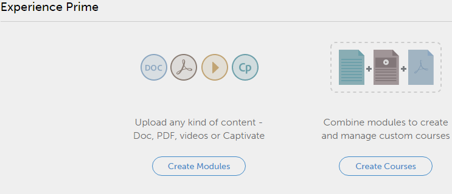

# Komma igång som författare

## Komma igång {#gettingstarted}

Komma igång -sidan hjälper dig att gå igenom de viktigaste funktionerna i programmet.

När du har loggat in som författare kan du visa popup-fönstret med en lista med videor.

## Visa exempelvideor {#viewsamplevideos}

Bläddra igenom självstudievideosjälvstudiekurserna för att förstå de viktigaste dragen i din roll som författare. Om du inte vill att det här popup-fönstret ska visas vid inloggning kan du inaktivera det genom att klicka på alternativet Visa inte vid inloggning längst ned till höger i popup-fönstret.

Klicka på Stäng fönster för att stänga popup-fönstret.

## Komma igång-sidan {#gettingstartedpage}

Från sidan Komma igång kan du utföra följande aktiviteter:

* Skapa moduler
* Skapa kurser

Du kan också lära dig mer om Learning Manager-programmet genom att välja att visa självstudievideor, hjälpinnehåll och lära dig mer om olika roller.

