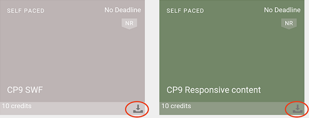

# Användare av iPad- och Android-surfplattor

När du har loggat in som elev i Learning Manager-appen på en iPad- eller Android-surfplatta kan du se följande startskärm:

Gå till utbildnings- och katalogfunktionerna genom att trycka på **Meny** och väljer lämpligt alternativ.

Du kan komma åt Learning Manager-appen offline på iPad och Android-surfplattor. Hämta och gå kurser i offlineläge och synkronisera innehållet med onlineappen när du ansluter till nätverket.

1. Tryck på rullgardinsmenyn längst upp och tryck på Utbildningsalternativ. En lista över alla tillgängliga kurser visas sida vid sida.
1. Tryck på hämtningsikonen längst ned på varje panel för utbildningsobjekt för att hämta utbildningsinnehållet.

1. När du är online visas en uppmaning i ett fält högst upp i appen om att kontrollera om du vill synka innehållet online. Tryck på det rödfärgade fältet om svaret är ja. Ett grönt färgat fält visar att innehållet är synkroniserat med onlineappen.

## Spåra enhetslagring {#trackdevicestorage}

Du kan övervaka enhetens lagring med jämna mellanrum.

Tryck på profilikonen längst upp till höger i programmet och tryck sedan på **Enhetslagring** menyalternativ.

En dialogruta med information om programlagring visas enligt nedan.

Med hjälp av applagringsinformationen kan du kontrollera det totala utrymmet på enheten, appen och de hämtade kurserna. Med den här informationen kan du ladda ned kurser. Om du vill ta bort de hämtade kurserna i enheten trycker du på X-ikonen bredvid varje kursnamn.
