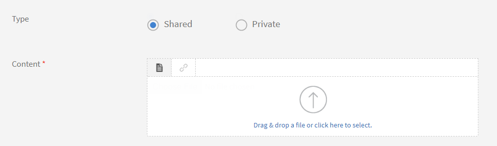

# Arbetsstöd

Arbetsstöd är ett arkiv med utbildningsinnehåll som är tillgängligt för elever utan några registrerings- eller slutförandekriterier. Elever kan hänvisa till dessa arbetsstöd för att få hjälp med att utföra någon aktivitet eller uppgift i en organisation.

Arbetsstöd kan konsumeras oberoende av eller tillsammans med kursförbrukning i Learning Manager.

Författare kan skapa arbetsstöd för elever. Använd arbetsstöd för att ge elever referensmaterial som tips, checklistor och guider som de kan använda löpande för att slutföra sina uppgifter.

## Skapa arbetsstöd {#createjobaid}

1. Klicka på Arbetsstöd i den vänstra rutan vid författarens inloggning.
1. Klicka på Skapa längst upp till höger på sidan som visas.
1. Ange namn, beskrivning och taggar. Välj kunskaper och tillhörande nivåer. Välj innehållet som privat om du inte vill att andra författare ska få tillgång till arbetsstödet för tilldelning till sina respektive kurser.

   Endast befintlig kompetens kan användas för arbetsstöd. Kompetenser är inte obligatoriska.

1. Överför arbetsstödsinnehållet i innehållsavsnittet.

   Videor, PDF, pptx och docx är de filformat som stöds för överföring. Project-zip-filer eller interaktivt innehåll stöds inte för överföring.

1. Ange varaktigheten i minuter för arbetsstödet.
1. Klicka på **[!UICONTROL Save]**.

   Arbetsstödet publiceras.

## Typer av arbetsstöd som stöds {#typesofsupportedjobaids}

Följande filformat stöds för arbetsstöd.

* PDF
* PPT
* PPTX
* XLS
* XLSX
* DOC
* DOCX
* Alla videofilformat

>[!NOTE]
>
>Zip-filer och bildfiler stöds inte.

## Indragning/återpublicering av arbetsstöd {#withdrawrepublishjobaids}

Du kan dra tillbaka det publicerade arbetsstödet genom att klicka på inställningsikonen bredvid arbetsstödet och välja att dra tillbaka.

*Redigera, dra tillbaka eller förhandsgranska ett publicerat arbetsstöd*

Visa indraget arbetsstöd genom att klicka på fliken indraget. Du kan återpublicera de återkallade jobben genom att klicka på inställningsikonen och välja Publicera.

## Stöd till HTML-paket i arbetsstöd

Arbetsstöd stöder nu HTML-standardpaket som en ny innehållstyp. Med den här förbättringen kan eleverna öppna vyn och ladda ner HTML-paketet inifrån arbetsstödspelaren.

När du skapar ett arbetsstöd kan en författare överföra ett HTML-standardpaket tillsammans med andra filformat som stöds.

*Stöd för paket med HTML*

Ett HTML-paket måste ha följande egenskaper:

* En index.html-fil.
* Filen Index.html måste finnas i rotmappen i en zip-fil.

Ange innehållet som ska överföras som en zip-fil, där filen Index.html finns.

Allt innehåll, alla resurser och alla resurser måste anges i HTML och vara tillgängliga via Index.html.

## Vanliga frågor {#frequentlyaskedquestions}

+++Hur skapar man ett arbetsstöd?

Du som är författare klickar på **[!UICONTROL Create]**. Lägg till de uppgifter som behövs och spara arbetsstödet.

När du har skapat arbetsstödet kan du lägga till arbetsstödet i en kurs samtidigt som du skapar kursen.

+++

### Mer

* [Arbetsstöd för administratörer](../../administrators/feature-summary/job-aids.md)
* [Arbetsstöd för elever](../../learners/feature-summary/job-aids.md)
