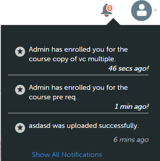
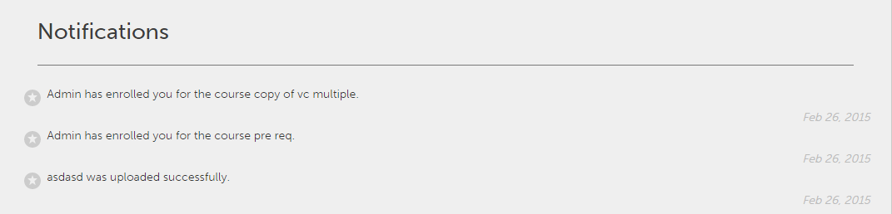

# Användarmeddelanden

Meddelandefunktionen gäller alla användare av Adobe Learning Manager. Men varje användare baserat på sin roll får olika typer av meddelanden i olika scenarier. Alla aviseringar och meddelanden till användare visas i popup-dialogrutan Aviseringar.

## Åtkomstmeddelanden {#accessnotifications}

Användare kan se meddelanden genom att klicka på aviseringsikonen i det övre högra hörnet av fönstret.

Ett exempel på meddelandefönster för författarrollen visas i följande skärmbild:

Det här popup-fönstret visar markeringar av alla meddelanden tillsammans med tidpunkten för förekomsten och en rullningslist.

Du kan känna till antalet senaste aviseringar genom det markerade numret som visas ovanpå aviseringsikonen. Om det till exempel finns fem senaste meddelanden efter din föregående inloggning, kan du se att siffran fem visas ovanpå aviseringsikonen. Dessa siffror försvinner när du läser alla de senaste meddelandena.

Klicka på länken **[!UICONTROL Show all notifications]** längst ned i popup-fönstret för meddelanden om du vill visa alla meddelanden på en separat sida.

## Typer av meddelanden för författare {#typesofnotificationsforauthors}

Författare får meddelanden när följande händelser utlöses:

* När moduluppladdningen är klar
* När en modulversion ändras
