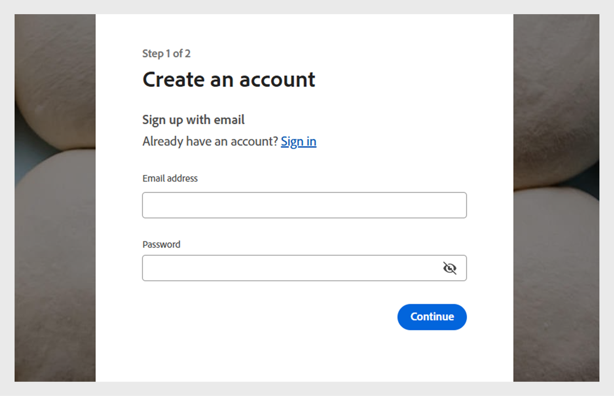

# Skapa ett testkonto i Adobe Learning Manager

Du kan enkelt skapa ett kostnadsfritt provkonto i 30 dagar i Adobe Learning Manager för att utforska funktioner och testa utbildningsarbetsflöden. Den här guiden förklarar var du ska börja, hur du registrerar dig och hur du hittar dina kontouppgifter när du har konfigurerats.

Så här skapar du ett testkonto:

1. Gå till [Adobe Learning Manager](https://business.adobe.com/products/learning-manager/adobe-learning-manager.html).
2. Välj **[!UICONTROL Free 30-day trial]**.

   

3. Välj **[!UICONTROL Create an account]** på inloggningssidan.

   

4. Skriv **[!UICONTROL Email address]** och **[!UICONTROL Password]**.

   

5. Ange följande information och välj **[!UICONTROL Create account]**:
   * Förnamn
   * Efternamn
   * Födelsedatum

   

6. Skriv och fyll i formuläret med de uppgifter som krävs för att konfigurera testversionskontot.
7. Efter konfigurationen hittar du ditt konto-ID i URL:en för din Adobe Learning Manager-URL.

   
