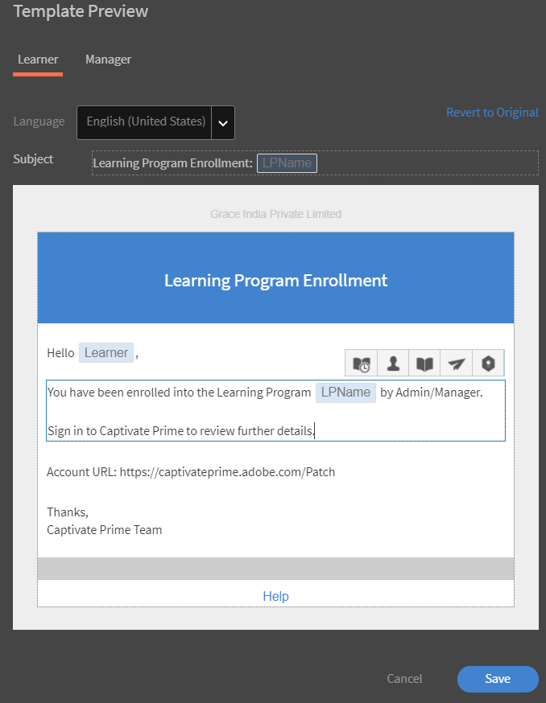

# Distributionshandbok för Learning Manager

## Introduktion {#introduction}

Learning Manager är ett system för hantering av inlärning (LMS) som gör det möjligt för utbildare att leverera engagerande och spårbara utbildningsmaterial som kan bidra till en organisations behov eller mål. Learning Manager låter i första hand lärare eller chefer tilldela kurser och andra utbildningsobjekt i en specifik ordning för elever. Detta verktyg erbjuder också flera kraftfulla funktioner, inklusive en fluidic-spelare i flera format, spelifiering, märken, lättanvända elevtavlan. För att kunna utnyttja alla dessa funktioner är det dock viktigt att först konfigurera och konfigurera Learning Manager.

Den här guiden innehåller stegvisa instruktioner om hur du kommer igång med Learning Manager. I det här dokumentet finns även detaljerad konfigurations- och konfigurationsinformation. Läs vidare för att lära dig hur du kommer igång med Learning Manager.

## Vem är den här guiden avsedd för? {#whoisthisguideintendedfor}

Du som är Learning Manager-användare kan bära hatten som administratör, författare, instruktör, chef eller elev. Den här användarhandboken är avsedd för användare som sannolikt kommer att delta i konfigurationen av ett LMS för en organisation eller en kund:

* **IT-administratör** - Som IT-administratör kan du aktivera eller integrera Learning Manager i organisationen. En IT-administratör kan också lägga till en eller flera användare och kan fungera som integrationsadministratör eller administratör som integrerar Learning Manager med program från tredje part.
* **Författare** - Som författare till Learning Manager kan du skapa utbildningsinnehåll som krävs för en organisations utbildningskrav. En författare medverkar i att skapa det grundläggande innehållet som laddas upp i Learning Manager.

* **Learning Manager-administratör** - En Learning Manager-administratör utför konfigurations- och konfigureringsaktiviteter relaterade till programmet. I vissa företag kan en IT-administratör även ha rollen som Learning Manager-administratör.

## Kom igång med Learning Manager-driftsättning {#getstartedwithcaptivateprimedeployment}

Aktivera Learning Manager-kontot med den licensnyckel du fick när du har köpt Learning Manager. Fortsätt till följande konfigurationer, som visas i följande bild:

## Konfigurera din plats i Learning Manager {#configureyoursiteincaptivateprime}

Innan du börjar lägga till och implementera utbildningsobjekt i Learning Manager finns det några viktiga konfigurationer som krävs. Börja med att konfigurera platsen så att den passar din organisation. Platskonfigurationen består av följande steg:

* Konfigurera varumärke och logotyp för din organisation
* Konfigurera e-postmallar
* Konfigurera grundläggande kontoinställningar
* Konfigurera feedbackinställningar
* Konfigurera inställningar för elevtavlan

### Konfigurera varumärke och logotyp {#setupbrandingandlogo}

Du som är administratör kan ställa in varumärket och temana så att de matchar organisationens krav på varumärken. Så här anger du varumärken och teman för webbplatsen:

### Ställa in logotyp och banderoll: {#settingthelogoandbanner}

Använd logotypen och banderollinställningarna för att visa ditt företags logotyp i Learning Manager. Konfigurera varumärkningsalternativen för att ange företagets domän i URL:en, visa organisationsnamnet och visa färgscheman som matchar organisationens varumärke. Så här konfigurerar du varumärkesinställningarna:

* Logga in på ditt Learning Manager-konto som administratör.
* Klicka på **Varumärken** i den vänstra rutan.
* På sidan Varumärkning kan du konfigurera följande alternativ genom att klicka på **Redigera** mot det alternativ som du vill ändra:

   * **Organisationsnamn** : Värdet som du anger här avgör vilket namn som visas på banderollen på varje sida på webbplatsen.
   * **Underdomän**: Det här värdet bestämmer webbplatsens URL.
   * **Formatering av logotyp**: Bilden i det här fältet visas som logotyp i det övre högra hörnet på varje sida. Här kan du antingen välja att bara visa logotypen, eller namnet på din organisation, eller logotypen och organisationens namn.

>[!NOTE]
>
>Du kan bara konfigurera namnet och logotypen med hjälp av Varumärke. Du kan inte ändra logotypens eller bildens placering.

***Learning Manager stöder följande filformat för logotypbilder: .png, .jpeg, .jpg, .gif, .bmp***

### Ange teman för webbplatsen {#settingthethemesforyoursite}

Med Learning Manager kan du ändra utseendet och känslan på din webbplats med hjälp av Teman. Programmet innehåller följande färgteman som du kan välja mellan:

* Prime-standard
* Stenar
* Karneval
* Höst
* Vinterhimmel

Välj ett färgschema som passar ditt företags varumärke.

1. Klicka på **[!UICONTROL Branding]** i det vänstra navigeringsfönstret i Learning Manager.
1. Klicka på **[!UICONTROL Edit]** i avsnittet **Teman**. Programmet låter dig välja ett nytt tema. När du väljer ett tema kan du omedelbart se de färgscheman som används för de viktigaste gränssnittselementen.

   

1. Du kan dessutom redigera **färgen på översta raden**, **accentfärgen** och **intensiteten på sidofältet**.  Du kan använda egna varumärkesfärger för de här viktiga gränssnittselementen.
1. Klicka på **[!UICONTROL Reset Theme]** om du vill återställa värdena till standardfärgschemat för ditt tema. Färgerna för de viktigaste användargränssnittselementen är inställda på standardalternativen för det valda temat.
1. När du har valt temat klickar du på **[!UICONTROL Show Hints]** för att visa etiketterna eller tipsen i förhandsgranskningen.

   

   Observera ett bildspel med flera bilder i avsnittet **Teman**. Du kan förhandsgranska temat eller färgschemat direkt i det här bildspelet. Du kan omedelbart förhandsgranska valda sidor, som startsidan, elevkontrollpanelen och så vidare.

1. Klicka på **[!UICONTROL Live Preview]** om du vill förhandsgranska ändringarna i en webbläsare. Ett popup-fönster med förhandsvisning av live-tema visas, där du antingen kan ändra färgschemat eller fortsätta med standardalternativen. Klicka på **[!UICONTROL Preview]** i det här popup-fönstret om du vill förhandsgranska alternativen i en webbläsare.

   

1. De valda alternativen används tillfälligt på platsen. Om du vill spara det valda temat och färginställningarna klickar du på **[!UICONTROL Apply]**.
1. När du har valt och tillämpat ett tema klickar du på **&#x200B;**&#x200B;[!UICONTROL Save]&#x200B;**&#x200B;** för att spara ditt val.

## Konfigurera e-postmallar {#configureemailtemplates}

Som administratör är nästa steg att konfigurera e-postmallar för olika händelser. Du kan aktivera, inaktivera och ändra e-postmallar som ska skickas till användarna. Det finns tre huvudkategorier av e-postmallar:

* Allmänna e-postmallar: Dessa e-postmeddelanden aktiveras för allmänna händelser. Ett välkomstmeddelande visas till exempel när en användare loggar in för första gången.
* E-postmallar som är kopplade till ett utbildningsobjekt eller en aktivitet: Dessa e-postmeddelanden skickas till elever, författare eller chefer vid en utbildningsaktivitet. Till exempel e-postmeddelanden som utlöses efter kursregistrering, klassrumsdeltagande, slutförande av kurser och så vidare.
* Påminnelser och uppdateringar: Dessa e-postmeddelanden utlöses när användare behöver uppdateringar eller påminnelser för en händelse. Till exempel en elev som får en påminnelse om en kommande kurs eller en administratör som får ett e-postmeddelande för en delad rapport.

Du kan aktivera och konfigurera någon av dessa e-postmeddelanden från administratörens kontrollpanel. Gör så här för att lära dig hur du anger e-postmallar:

1. Klicka på **[!UICONTROL **&#x200B; E-postmallar &#x200B;** i det vänstra navigeringsfönstret.]**
1. Klicka på en av följande flikar:**[!UICONTROL ** Allmän **/** Utbildningsaktivitet **/** Påminnelser och uppdateringar **.]** Låt oss anta att du klickar på **[!UICONTROL **&#x200B; Utbildningsaktivitet &#x200B;**.]**
1. Klicka på växlingsknappen för den aktivitet du vill utlösa ett e-postmeddelande med. I det här exemplet antar vi att du klickar på **[!UICONTROL **&#x200B; Utbildningsprogram - registrerad av admin/chef &#x200B;**.]**

   

   Systemet visar popup-meddelandet Aktiveringen lyckades. Nu när en chef eller administratör registrerar en elev för en kurs får eleven ett e-postmeddelande från detta Learning Manager-konto.

1. Du kan ändra standardmallen för e-post. Klicka på händelsen för att göra det. Klicka på **[!UICONTROL &#x200B; Learning Program - Enrolled by Admin/Manager.]** i det här exemplet
1. Observera att det finns två flikar i dialogrutan **[!UICONTROL Template Preview]**: [!UICONTROL Learner] och [!UICONTROL Manager].

   

   Klicka på e-postmeddelandet för att ändra innehållet för var och en av dessa flikar. Klicka på **[!UICONTROL Save]** för att spara ändringarna i e-postmallen.

   Nu när en elev registreras på en kurs av chefen eller administratören får eleven och hans chef ett e-postmeddelande.

   ***Obs! Ändringarna gäller endast för e-postmallen som är associerad med den valda händelsen.***

1. Observera att du inte kunde ändra konto-URL eller signatur i e-postmallen. Om du vill ändra **[!UICONTROL Account URL]** eller **[!UICONTROL Signature]** klickar du på fliken **[!UICONTROL Settings]**. På den här fliken kan du ändra e-postbanderollen, e-postsignatur och konto-URL:en.

   Konto-URL-länken visas i alla e-postmeddelanden, precis före signaturen. Ange önskad URL och klicka på **[!UICONTROL Save]**. Den här webbadressen visas bara för interna användare.

   För e-postbanderollen kan du ändra färgen på banderollen genom att välja **[!UICONTROL **&#x200B; Banderollbakgrund &#x200B;**.] **&#x200B; Du kan också använda en anpassad bild som banderoll genom att välja alternativet &#x200B;** [!UICONTROL Custom Image]&#x200B;**. Klicka på &#x200B;** [!UICONTROL Save]** när du har gjort ändringarna.

   ***Obs! Den anpassade bildstorleken för e-postbanderollen måste vara 1 240 × 200 px. Bilder som är större än den rekommenderade storleken beskärs.***

   ***Learning Manager har endast stöd för filtyperna .jpg, .jpeg och .png för e-postbanderoller.***

   

1. Du kan också välja att aktivera valfria e-postmeddelanden från chefen. Om du markerar kryssrutan **[!UICONTROL Enable]** inkluderas chefen i utskickslistan när en direktrapport får ett e-postmeddelande från det här primära kontot.

   ***Obs! Inställningarna på den här fliken gäller för alla mallar globalt.***

### Konfigurera e-postmallar för ett utbildningsobjekt {#configureemailtemplatesforalearningobject}

Förutom att ange e-postmallar på global nivå kan du som administratör även konfigurera e-postmallar för ett specifikt utbildningsobjekt. I detta fall gäller alla ändringar du gör i e-postmallen endast för det utbildningsobjektet.

Det här alternativet är också tillgängligt för författare när de ställer in ett utbildningsobjekt.

Så här konfigurerar du e-postmallar för ett utbildningsobjekt:

1. Klicka på kursen, utbildningsprogrammet eller certifieringen som du vill konfigurera e-postmallen för.
1. Klicka på **[!UICONTROL **&#x200B; E-postmallar &#x200B;** i den vänstra rutan.] **&#x200B; Systemet visar en &#x200B;**&#x200B;**[!UICONTROL Template Preview]**&#x200B;**-dialogruta.
1. Ändra ämnet eller brödtexten i e-postmallen och klicka på **[!UICONTROL **Spara**]**&#x200B;för att tillämpa ändringarna.
1. Om du vill avbryta ändringarna klickar du på **[!UICONTROL **&#x200B;Återgå till original &#x200B;**.]**

### Begränsa användare från att ta emot e-postmeddelanden {#restrictusersfromreceivingemails}

Som administratör kan du välja vem som ska ta emot e-postmeddelanden från Learning Manager och vem som inte ska det. Du kan göra detta med alternativet **&#x200B;**&#x200B;[!UICONTROL Restricted User]&#x200B;**&#x200B;** på fliken **&#x200B;**&#x200B;[!UICONTROL Settings] **&#x200B; &#x200B;**. Användare kan läggas till i den här listan med sitt namn, e-post-ID eller unika användar-ID. Användarna som listas under detta alternativ kommer att hindras från att ta emot e-postmeddelanden från Learning Manager.

## Konfigurera dina kontoinställningar {#configureyouraccountsettings}

Med Learning Manager kan du konfigurera vissa kontoinställningar som grundläggande inställningar, inställningar för feedback, allmänna inställningar och inställningar för elevtavlan. Följande procedurer visar hur du konfigurerar de här inställningarna:

### Konfigurera grundläggande inställningar {#configurebasicsettings}

1. Klicka på **&#x200B;**&#x200B;[!UICONTROL Settings]&#x200B;**&#x200B;** på startsidan för Learning Manager. Som standard visas sidan Grundläggande information, med standardspråk och standardplatsfält.
1. Klicka på **&#x200B;**&#x200B;[!UICONTROL Change]&#x200B;**&#x200B;** i det övre högra hörnet på sidan för att redigera grundläggande information.
1. Konfigurera följande alternativ:

   * **Land**: Välj land i det här nedrullningsbara fältet.
   * **Tidszon**: Ange lämplig tidszon för din plats.
   * **Språk**: Välj önskat språk. Om du ändrar språket i det här fältet tillämpas ändringen för alla användare som använder programmet. Varje användare kan dock ändra sitt språk individuellt.
   * **Räkenskapsåret börjar från**: Välj den månad då organisationens räkenskapsår börjar.

   

## Konfigurera feedbackinställningar {#configurefeedbacksettings}

Med Learning Manager kan du samla in feedback för en kurs från elever. Det är också möjligt att samla in feedback om elever med Learning Manager. Om du vill be om feedback måste du först konfigurera L1- och L3-typer av feedback.

Feedback om L3 är den feedback som en chef ger om en elev. Du kan använda denna typ av feedback för att spåra elevernas resultat över tid. Feedback om L1 är den feedback som en elev ger om en kurs. Den här typen av feedback hjälper en administratör att samla in direkt feedback om en kurs.

Du som är administratör kan konfigurera inställningarna för feedback globalt. Gör det genom att följa denna procedur:

1. Klicka på **[!UICONTROL Settings]** på startsidan för Learning Manager.
1. Klicka på **[!UICONTROL General]** i den vänstra rutan.
1. Om du vill konfigurera L1-feedback klickar du på fliken **[!UICONTROL L1 Feedback]**. Du ser alternativen att konfigurera en obligatorisk fråga och flera valfria frågor. Det här är de frågor som en elev visar när han eller hon ger feedback efter att ha slutfört en kurs. Frågorna är formulerade som satser så att eleverna kan välja sitt svar på en skala från 1 till 5.

   Första delen av L1-feedback är en obligatorisk fråga om hur det är för en elev att rekommendera den här kursen till en vän eller kollega.

   ***Obs! Du kan inte redigera eller ändra den obligatoriska frågan.***

   

1. Klicka på frågorna i **&#x200B;**&#x200B;[!UICONTROL Self-Paced Courses]&#x200B;**&#x200B;** eller **&#x200B;**&#x200B;[!UICONTROL Classroom Courses]&#x200B;**&#x200B;** om du vill konfigurera de andra frågorna för din feedbackenkät. När du klickar på en fråga kan du redigera standardfrågorna.

   

1. Du kan antingen aktivera eller inaktivera standardfrågorna eller helt ändra standardfrågorna efter dina behov. Du kan till exempel ta bort standardfrågan &quot;Utbildningsämnet var relevant för mig.&quot; och lägga till och ersätta frågan med &quot;Jag tyckte att utbildningen var användbar och relevant.&quot;
1. När du är klar med frågorna för eleverna kan du konfigurera inställningarna för påminnelser. Som standard finns det en befintlig påminnelse, där appen skickar automatiska påminnelser till elever vid lyckat slutförande av en kurs. Påminnelsen är också inställd på att upprepas varannan vecka tills eleven svarar. Du kan antingen ändra den befintliga påminnelsen genom att klicka på påminnelsen eller lägga till en ny påminnelse.

   

1. Konfigurera inställningarna för påminnelser genom att slutföra följande alternativ:

   * **När ska du skicka**: Ange om du vill skicka feedbackbegäran antingen när kursen är slutförd eller efter slutförandet av kursen.
   * **Dagar efter slutförande**: Ange hur många dagar du vill skicka feedbackbegäran efter. Det här fältet visas bara om du har markerat **&#x200B;**&#x200B;[!UICONTROL After course completion]&#x200B;**&#x200B;**.

   * **Återkommande**: Ange om du vill skicka feedbackpåminnelsen varje dag, varje vecka eller varje månad. Du kan också ange för hur många veckor du vill att påminnelsen ska skickas.

1. Klicka på bockmarkeringen för att spara påminnelseinställningarna.
1. När du är klar med alla inställningar för feedback klickar du på **[!UICONTROL **Spara**]**&#x200B;i det övre högra hörnet på sidan.

## Konfigurera L3-feedback: {#configurel3feedback}

L3-feedback innehåller frågorna som skickas till en elevs chef efter att eleven har slutfört en kurs. Med L3-feedback kan en administratör spåra ändringar i en elevs beteende eller kompetens över tid. Om du vill konfigurera den här feedbacken klickar du på fliken **&#x200B;**&#x200B;[!UICONTROL L3 Feedback]&#x200B;**&#x200B;** på sidan Feedback. Du ser en, standardfråga. Chefen måste svara på denna fråga med hjälp av en femgradig bedömningsskala.

Precis som med L1-feedback kan du konfigurera påminnelser för L3-feedback. Du kan antingen ändra den befintliga påminnelsen eller lägga till en ny feedbackpåminnelse.

När du är klar med feedbackfrågan och inställningarna för påminnelser klickar du på **&#x200B;**&#x200B;[!UICONTROL Save]&#x200B;**&#x200B;** för att tillämpa inställningarna.

## Konfigurera feedback på instansnivå {#configurefeedbackataninstancelevel}

I föregående procedur beskrevs stegen för att konfigurera feedbackinställningarna på global nivå. Det innebär att inställningarna tillämpas på alla kurser. Utöver dessa globala frågor kan du som administratör eller författare konfigurera ytterligare L1- och L3-feedbackfrågor på instansnivå.

Så här konfigurerar du feedbackinställningarna på instansnivå:

1. Klicka på **[!UICONTROL Courses]** på startsidan för Learning Manager.
1. Håll pekaren över kursen där du vill konfigurera feedbackinställningarna. Klicka på [!UICONTROL **Visa kurs**.]

   

1. Klicka på **[!UICONTROL Instance Defaults]** i avsnittet Konfigurera på sidan med kursinformation.
1. I listrutan [!UICONTROL **Språk**] väljer du språket som du vill att feedbackfrågeformuläret ska visas på.
1. Aktivera feedback om L1-reaktioner om du vill be elever om feedback. Här kan du lägga till maximalt två frågor. Elever kan ge beskrivande svar på dessa frågor.
1. Markera kryssrutan **[!UICONTROL Make Mandatory]** om du vill göra en av eller båda frågorna obligatoriska.
1. Välj **[!UICONTROL Show questionnaire immediately after course completion]** om du vill att eleverna ska visa feedbackfrågeformuläret omedelbart efter att de har slutfört kursen.

   

1. Om du vill konfigurera feedback om L3-beteendeförändring på instansnivå **&#x200B;**&#x200B;[!UICONTROL Enable]&#x200B;**&#x200B;** klickar du på Feedback om L3. I programmet visas en fördefinierad, obligatorisk fråga och en tom fråga där du kan ställa en valfri fråga.
1. För den fördefinierade frågan om elevens förbättring efter kursen är svaret i Likert-skalans format. Det vill säga, chefer måste välja ett alternativ på en skala av Starkt samtycker till att starkt motsätta sig.
1. Ange den andra frågan för chefen. Chefer kan ge ett beskrivande svar på denna fråga.
1. Markera kryssrutan **&#x200B;**&#x200B;[!UICONTROL Make Mandatory]&#x200B;**&#x200B;** om du vill göra den andra frågan obligatorisk.

   

1. Du kan även konfigurera påminnelseinställningar på instansnivå. Om du inte konfigurerar inställningar för påminnelser här tilldelas inställningarna för globala påminnelser automatiskt.
1. När du är klar med inställningarna för feedback och påminnelser klickar du på **[!UICONTROL **Spara**]**&#x200B;för att använda inställningarna.

   ***Obs! Feedbackinställningarna gäller inte för certifieringar.***

## Konfigurera allmänna inställningar {#configuregeneralsettings}

Med de allmänna inställningarna i Learning Manager kan administratörer konfigurera allmänna inställningar som påverkar andra funktioner i programmet. Du kan till exempel använda allmänna inställningar för att ange om kurseffektivitet kan göras synlig för elever. Så här konfigurerar du de allmänna inställningarna:

1. Klicka på **&#x200B;**&#x200B;[!UICONTROL Settings]&#x200B;**&#x200B;** på startsidan för Learning Manager.
1. Klicka på **&#x200B;**&#x200B;[!UICONTROL General]&#x200B;**&#x200B;** i den vänstra rutan.
1. På sidan Allmänna inställningar kan du konfigurera följande alternativ:

   För alla dessa alternativ varierar funktionen som varje alternativ påverkar. Vi kan ge tvärlänkar till var och en av de detaljerade funktionen om det behövs.

   * **Visa kurseffektivitet**: Aktivera det här alternativet om du vill att eleverna ska se hur effektiv en kurs är i kurstiteln.
   * **Alternativ för modulåterställning:** Aktivera det här alternativet om du vill ge elever möjlighet att återställa en modul. Elever kan sedan återställa sina moduler om de har misslyckats eller om de delvis har slutfört modulen och vill starta igen.
   * **Kursmoderering**: Aktivera det här alternativet om du vill att ändringarna av en kurs ska godkännas av en administratör innan ändringarna visas för eleverna.
   * **Diskussionstavla**: Aktivera det här alternativet om du vill att elever ska kunna visa och delta i diskussionstavlor för kurser. Om du aktiverar kryssrutan **Diskussionstavla** kan elever och instruktörer lägga upp kommentarer för kurser. Men om kursinställningarna indikerar att den här funktionen inte är vald har inställningarna på kursnivå företräde framför administratörsinställningarna.

   * **Utforska färdighetsalternativet**: Aktivera det här alternativet om du vill att elever ska utforska kollegor och ledarskapsfärdigheter.
   * **Unika ID:n för utbildningsobjekt**: Aktivera det här alternativet om du vill ge författare möjlighet att lägga till unika ID:n i utbildningsobjekt.
   * **Visa kataloglista**: Aktivera det här alternativet om du vill att eleverna ska se alla kataloger som är tillgängliga. Med det här alternativet kan elever förfina sin lista över utbildningsobjekt.

   

## Konfigurera inställningar för elevtavlan {#configurelearnerdashboardsettings}

Elevinstrumentpanelen i Learning Manager låter elever se sina obligatoriska och rekommenderade kurser bortsett från prestationer, färdigheter och tillkännagivanden. Administratörer kan bestämma hur denna elevtavla ska visas genom att konfigurera inställningarna för elevtavlan. Dessa inställningar bestämmer låter administratörer ställa in widgetarna på elevsidan. Dessa inställningar anger också hur och var widgetarna placeras på elevtavlan. Du som är administratör kan förhandsgranska layouten på elevtavlan innan inställningarna tillämpas.

1. Klicka på **[!UICONTROL Settings]** på startsidan för Learning Manager.
1. Klicka på **[!UICONTROL **&#x200B; instrumentpanelen för elever &#x200B;** i den vänstra navigeringspanelen.]**
1. Markera de widgetar som du vill aktivera. Om du avmarkerar en widget tas den bort direkt från förhandsgranskningen. Elever kan inte se widgeten på sin instrumentpanel.
1. Klicka på **&#x200B;**&#x200B;[!UICONTROL Save]&#x200B;**&#x200B;** för att tillämpa inställningarna.

   

1. Klicka på **[!UICONTROL Restore to Default.]** om du vill använda standardinställningarna. I det här fallet är alla widgetar utom **[!UICONTROL Welcome and Sticky Announcements]** synliga.

   ***Även efter att du har aktiverat inställningarna för elevtavlan kan eleverna ändra och flytta runt widgetar på sina respektive instrumentpaneler.***

