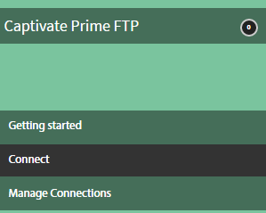

# Anslutningar för Learning Manager

Lär dig hur du integrerar Salesforce med Learning Manager med hjälp av anslutningar, hur du integrerar FTP med Learning Manager och överför CSV automatiskt med hjälp av FTP-anslutning.

Företag har andra applikationer och system som kan behöva integreras med Learning Manager. Anslutningar är verktyg som hjälper dig att utföra databaserade integreringar, som att importera data till Learning Manager från externa system eller exportera data till externa system från Learning Manager. I juli 2016-versionen har anslutningarna bara möjlighet att importera användare i grupp för Learning Manager från externa system.

Learning Manager tillhandahåller Salesforce- och FTP-anslutningar. Med Salesforce-anslutning kan integreringsadministratörer för en organisation integrera sina Salesforce-program med Learning Manager. Som integrerare kan du även använda FTP-anslutning för att automatiskt importera en uppsättning användare till ditt företagsprogram.

Learning Manager erbjuder också kontakterna Lynda, getAbstract och Harvard Management System som gör det möjligt för elever att komma åt och konsumera kurser från Lynda.com, getAbstract och Harvard ManageMentor.

Läs vidare för att lära dig hur du konfigurerar och använder var och en av dessa anslutningar i Learning Manager.

## Salesforce-koppling {#sfconnector}

Salesforce-kopplingen ansluter Learning Manager- och Salesforce-konton för att automatisera datasynkronisering. Kapaciteterna för Salesforce-anslutningen är följande:

### Mappningsattribut

Integreringsadministratören kan välja Salesforce-kolumner och mappa dem till motsvarande Learning Manager-gruppattribut. Detta är en engångsåtgärd. När mappningen är klar används samma mappning för efterföljande användarimporter. Det kan konfigureras om om om administratören vill ha en annan mappning för importerande användare.

### Automatiserad användarimport

Importera användare gör att Learning Manager-administratören kan hämta medarbetarinformation från Salesforce och importera dem till Learning Manager automatiskt. Denna automatisering gör att du slipper den manuella ansträngning som krävs för att skapa CSV och överföra till Learning Manager.

### Schemalägg automatiskt

Att använda funktionen för automatisk schemaläggning tillsammans med funktionen för automatisk användarimport kan vara effektivt. Learning Manager-administratören kan ställa in schemat efter organisationens behov. Användare i Learning Manager-programmet kan vara uppdaterade enligt schemat. Du kan synkronisera dagligen i Learning Manager-programmet.

### Filtrera användare

Learning Manager-administratören kan tillämpa filtrering på användarna innan de importeras. Learning Manager-administratör kan till exempel välja att importera alla användare i hierarkin under en eller flera specifika chefer.

## Konfigurera Salesforce-anslutning {#configuresalesforceconnector}

Lär dig processen att integrera Learning Manager med Salesforce.

### Krav {#prerequisites}

Se till att du har URL:en till din Salesforce-organisation med dig. Exempel: Om ditt organisationsnamn är **myorg**, kan Salesforce-URL:en vara [https://myorg.salesforce.com](https://myorg.salesforce.com/). Det är den enda inmatning som krävs för att ansluta Salesforce-kontot till Learning Manager.

Se också till att du har rätt inloggningsuppgifter för att logga in på kontot.

## Skapa en anslutning {#createaconnection}

1. På Learning Manager-startsidan håller du pekaren över Salesforce-kortet/miniatyrbilden. En meny visas. Klicka **[!UICONTROL Connect]** i menyn.

   

1. En dialogruta visas där du uppmanas att ange org-URL. Klicka **[!UICONTROL Connect]** efter att URL-adressen har angetts.
1. När anslutningen är klar visas översiktssidan.

## Mappningsattribut {#mapattributes}

När anslutningen har upprättats kan du mappa Salesforce-kolumner till motsvarande attribut för Learning Manager. Det här steget är obligatoriskt.

1. På mappningssidan kan du till vänster se kolumnerna i Learning Manager och till höger kan du se kolumnerna i Salesforce. Välj rätt kolumnnamn som mappas till Learning Manager-kolumnnamnet.

   

   Learning Manager-kolumndata som visas på vänster sida hämtas från de aktiva fälten. Inställningen **chef** fältet måste mappas till ett fält av typen e-postadress. Det är obligatoriskt att mappa alla kolumner innan kopplingen kan användas.

1. Klicka **[!UICONTROL Save]** efter att mappningen har slutförts.
1. Anslutningen är nu klar att användas. Kontot som har konfigurerats nu visas som en datakälla i Administratörsprogrammet för att administratören ska kunna schemalägga importen eller för synkronisering på begäran.

## Använda Salesforce-kopplingen {#usingsalesforceconnector}

Salesforce-anslutning ansluter till Salesforce.com för att hämta användarna enligt konfigurationen och lägga till dem i Learning Manager.

## FTP-anslutning för Learning Manager {#ftpconnector}

Med FTP-anslutningen kan du integrera Learning Manager med godtyckliga externa system för att automatisera datasynkroniseringen. Det förväntas att externa system kan exportera data i CSV-format och placera dem i lämplig mapp på FTP-kontot för Learning Manager. Funktionerna för FTP-anslutningar är följande:

Du kan också använda Boxs anslutning för datamigrering, användarimport och dataexport. Mer information finns i [Boxanslutning.](third-party-connectors.md#main-pars_header_302653946)

## Dataimport {#dataimport}

Importera användare gör att Learning Manager-administratören kan hämta medarbetarinformation från Learning Manager FTP-tjänsten och importera dem till Learning Manager automatiskt. Med den här funktionen kan du integrera flera system genom att placera CSV-filen som genereras av de systemen i lämplig mapp på FTP-kontona. Learning Manager hämtar CSV-filerna, slår samman dem och importerar data enligt schemat. Mer information finns i Schemaläggningsfunktionen.

**Mappningsattribut**

Integreringsadministratören kan välja kolumnerna i CSV och mappa dem till Learning Managers grupperbara attribut. Denna kartläggning är en engångsinsats. När mappningen är klar används samma mappning vid efterföljande användarimporter. Mappningen kan konfigureras om om administratören vill ha en annan mappning för importerande användare.

## Exportera data {#exportdata}

Med dataexport kan användare exportera användarkunskaper till en FTP-plats för att integrera med externa system.

## Tidsplanering {#scheduling}

Administratören kan konfigurera schemaläggningsuppgifter enligt organisationens krav och användarna i Learning Manager-programmet är uppdaterade enligt schemat. På samma sätt kan integrationsadministratören schemalägga kunskapsexport i tid för att kunna integreras med ett externt system. Du kan synkronisera dagligen i Learning Manager-programmet.

## Konfigurera FTP-anslutning för Learning Manager {#configurecaptivateprimeftpconnector}

Lär dig hur du integrerar Learning Manager med FTP-anslutning.

### Skapa en anslutning {#Createaconnection-1}

1. På startsidan för Learning Manager håller du pekaren över FTP-kortet/miniatyrbilden. En meny visas. Klicka **[!UICONTROL Connect]** i menyn.

   

1. En dialogruta visas där du uppmanas att ange e-post-ID. Ange e-post-ID för den person som ansvarar för hanteringen av organisationens FTP-konto för Learning Manager. Klicka **[!UICONTROL Connect]** efter att ha angett e-post-ID.
1. Learning Manager skickar ett e-postmeddelande till dig som uppmanar användaren att återställa lösenordet innan FTP används för första gången. Användaren måste återställa lösenordet och använda det för att få åtkomst till FTP-kontot för Learning Manager.

   Endast ett FTP-konto för Learning Manager kan skapas för ett visst Learning Manager-konto.

   På sidan Översikt kan du ange Anslutningsnamn för integreringen. Välj vilken åtgärd du vill utföra med följande alternativ:

   * Importera interna användare
   * Exportera användarfärdigheter - konfigurera ett schema
   * Exportera användarkompetenser - på begäran

   

## Importera

+++Intern användare

Med alternativet Importera intern användare kan du schemalägga genereringen av användarimportrapporten automatiskt. De genererade rapporterna skickas till dig som .CSV-filer.

+++

+++Mappattribut

När anslutningen är upprättad kan du mappa kolumnerna i CSV-filer som ska placeras i FTP-mappen till motsvarande attribut för Learning Manager. Det här steget är obligatoriskt.

1. På sidan Mappattribut kan du till vänster se förväntade kolumner i Learning Manager och till höger kan du se CSV-kolumnnamnen. Inledningsvis, på höger sida, kan du se en tom ruta. Importera CSV-mallar genom att klicka **Välj fil**.
1. I steget ovan fylls den högra listrutan för val i med alla CSV-kolumnnamn. Välj rätt kolumnnamn som mappas till Learning Manager-kolumnnamnet.

   *Fältet Chef måste nödvändigtvis mappas till ett fält av typen e-postadress. Det är obligatoriskt att mappa alla kolumner innan kopplingen kan användas.*

1. Klicka **[!UICONTROL Save]** efter att mappningen har slutförts.

   Anslutningen är nu klar att användas. Det nyss konfigurerade kontot visas nu som en datakälla i administratörsprogrammet för administratören för att schemalägga importen eller för synkronisering på begäran.

+++

+++Använda FTP-anslutningen Learning Manager

1. CSV-filerna från externa system ska placeras på följande sökväg:

   `code $OPERATION$/$OBJECT_TYPE$/$SUB_OBJECT_TYPE$/data.csv`

   **Obs!** I versionen från juli 2016 är endast import av användare tillåten. Om du vill använda FTP-anslutningen måste du därför se till att CSV-filerna finns i följande mapp:

   `code Home/import/user/internal/*.csv`

1. FTP-anslutningen tar alla rader från CSV-filer, så det är viktigt att den rad som motsvarar en användare i en CSV-fil inte visas i några andra CSV-filer.
1. Alla CSV-filer bör innehålla de kolumner som anges i mappningen.
1. Alla nödvändiga CSV-filer måste finnas i mappen innan processen börjar.

När du importerar användare till Learning Manager behöver administratören också veta hur användare hanteras i Learning Manager. Se [Hjälp för användarhantering](../integration-admin/feature-summary/migration-manual.md#usermanagement) för mer information.

+++

## Exportera

+++Kompetenser

Det finns två alternativ för att exportera rapporter om användares kompetens.

**[!UICONTROL User Skills - On Demand]**: Du kan ange startdatum och exportera rapporten med alternativet .Rapporten extraheras från det datum som angavs till idag.

**[!UICONTROL User Skills - Configure]**: Med det här alternativet kan du schemalägga extraheringen av rapporten. Markera kryssrutan Aktivera schema och ange startdatum och starttid. Du kan också ange det intervall som du vill att rapporten ska skapas och skickas med.

+++

Du öppnar exportmappen där de exporterade filerna placeras på FTP-platsen genom att öppna länken till FTP-mappen på sidan Användarfärdigheter som visas nedan.

De automatiskt exporterade filerna finns på platsen **Hem/export/&#42;FTP_location&#42;**

De automatiskt exporterade filerna blir tillgängliga med titeln **skill_Achievements_&#42;datum från &#42;_till_&#42;datum till&#42;.csv**

## Lynda-koppling {#lyndaconnector}

Lynda-kopplingen kan användas av företagskunder på Lynda.com som vill att de elever som lär sig identifiera och konsumerar Lynda-kurser direkt i Learning Manager. Anslutningen kan konfigureras för att hämta kurser från Lynda.com med jämna mellanrum med din API-nyckel. När en kurs har skapats i Learning Manager kan användarna söka efter dem och konsumera dem. Elevframsteg kan sedan följas i Learning Manager.

### Konfigurera Lynda-anslutningen {#configurethelyndaconnector}

1. Klicka på Lynda på kontrollpanelen för integrerad administration.

   Du kommer att se rutan med tre alternativ: Komma igång, Anslut och Hantera anslutningar.

1. Om du konfigurerar Lynda-anslutningen för första gången klickar du på Anslut.

   Du måste konfigurera Exavaults FTP-konto innan du konfigurerar den här anslutningen.

1. Ange ett namn på anslutningen på anslutningssidan. Ange appnyckeln och den hemliga nyckeln för din anslutning.

   Du måste kontakta leverantören för att få appnyckeln och den hemliga nyckeln.

1. Klicka på Spara.

   Konfigurationen sparas och Lynda-anslutningen för ditt konto läggs till. Nu kan du klicka på Hantera anslutningar på Startsidan och redigera din konfiguration när som helst.

1. Om du redan har en anslutning upprättad klickar du på Hantera anslutningar för att visa alla dina anslutningar.

   Migreringsfunktionen måste aktiveras för ditt konto innan du konfigurerar den här anslutningen.

1. Klicka på anslutningen som du vill redigera.
1. Klicka på Konfigurera i den vänstra rutan. Gör något av följande:

   * Visa eller redigera informationen för ditt konto och synkroniseringsschemat från det här fönstret. Du måste markera kryssrutan Aktivera anslutning om du vill aktivera det här kontot.
   * Klicka på Redigera och redigera dina inloggningsuppgifter. Klicka på Återställ om du vill ångra ändringarna i det här fältet.
   * Klicka på Aktivera schema för att schemalägga synkroniseringen. Du kan ange starttid och datum och sedan ange frekvensen för synkroniseringsschemat i dagar. Du kan till exempel aktivera synkronisering var tredje dag.

   Klicka Spara för att spara ändringarna.

   

1. I den vänstra rutan klickar du på Exekvering på begäran. Med det här alternativet kan du importera användarflöden och andra relevanta data från Lynda. Ange startdatum för körning på begäran och klicka på Kör för att köra synkroniseringen. Alla data från startdatum till nuvarande importeras.

   * Du kan klicka på Inaktivera åtkomst till Learning Manager under körning där programmet kommer att ha ett driftstopp under synkroniseringen.
   * Om du klickar på Aktivera åtkomst till Learning Manager under körning uppstår inget avbrott i tjänsten under synkroniseringen.

   

1. Du kan även klicka på Körningsstatus i den vänstra rutan när som helst om du vill visa en sammanfattning av alla körningar för den här kopplingen, i kronologisk ordning. Du kan visa startdatum och starttid för synkroniseringen, typ av synkronisering (oavsett om det är synkronisering på begäran) och synkroniseringens status (oavsett om synkroniseringen pågår eller är slutförd).

   När du tar bort och återskapar en anslutning, kommer de tidigare körningarna för anslutningen att dyka upp igen. Du kan visa alla körningar innan du tar bort anslutningen.

   Du kan bara köra en omkörning för den senaste synkroniseringen.

   

## getAbstract-koppling {#getabstractconnector}

GetAbstract-kopplingen kan användas av företagskunder på getAbstract.com, som vill att deras elever ska upptäcka och konsumera getAbstract-sammanfattningar. Kopplingen kan konfigureras för att hämta användningsdata med jämna mellanrum, baserat på vilka poster för elevslutförande som skapas i Learning Manager. Läs vidare för att lära dig hur du konfigurerar den här anslutningen i Learning Manager.

### Konfigurera getAbstract-anslutningen {#configurethegetabstractconnector}

1. Klicka på getAbstract på kontrollpanelen för integrerad administration.

   I rutan visas tre alternativ: Komma igång, Anslut och Hantera anslutningar.

1. Om du konfigurerar getAbstract-anslutningen för första gången klickar du på Anslut.

   Du måste konfigurera Exavaults FTP-konto innan du konfigurerar den här anslutningen.

   Dela FTP-uppgifterna med din innehållsleverantör så att du får åtkomst till dem.

1. Ange ett namn för anslutningen i fältet Anslutningsnamn.

   Ange lämpliga nycklar i fälten Klient-ID och Klienthemlighet. Du kanske måste kontakta din leverantör för att få lämpliga nycklar för denna koppling.

   Nycklarna krävs för att hämta kursmetadata för de kurser som kunden utnyttjar.

1. Om du redan har en anslutning upprättad klickar du på getAbstract > Manage Connections på startsidan för att visa och redigera den befintliga konfigurationen.

   Migreringsfunktionen måste aktiveras för ditt konto innan du konfigurerar den här anslutningen.

1. Klicka på anslutningen vars konfiguration du vill visa eller redigera.

   

1. Klicka på Konfigurera i den vänstra rutan. Gör något av följande:

   * Visa eller redigera informationen för ditt konto och synkroniseringsschemat från det här fönstret. Du måste markera kryssrutan Aktivera anslutning om du vill aktivera det här kontot.
   * Klicka på Redigera och redigera dina inloggningsuppgifter. Klicka på Återställ om du vill ångra ändringarna i det här fältet.
   * Klicka på Aktivera schema för att schemalägga synkroniseringen. Du kan ange starttid och datum och sedan ange frekvensen för synkroniseringsschemat i dagar. Du kan till exempel aktivera synkronisering var tredje dag.

1. Klicka på Spara.

   Konfigurationen sparas och anslutningen getAbstract för ditt konto läggs till.

1. I den vänstra rutan klickar du på Exekvering på begäran. Med det här alternativet kan du importera användarflöden och andra relevanta data från getAbstract. Ange startdatum för körning på begäran och klicka på Kör för att köra synkroniseringen. Alla data från startdatum till nuvarande importeras.

   * Du kan klicka på Inaktivera åtkomst till Learning Manager under körning där programmet kommer att ha ett driftstopp under synkroniseringen.
   * Om du klickar på Aktivera åtkomst till Learning Manager under körning uppstår inget avbrott i tjänsten under synkroniseringen.

1. Du kan även klicka på Körningsstatus i den vänstra rutan när som helst om du vill visa en sammanfattning av alla körningar för den här kopplingen, i kronologisk ordning. Du kan visa startdatum och starttid för synkroniseringen, typ av synkronisering (oavsett om det är synkronisering på begäran) och synkroniseringens status (oavsett om synkroniseringen pågår eller är slutförd).

   När du tar bort och återskapar en anslutning, kommer de tidigare körningarna för anslutningen att dyka upp igen. Du kan visa alla körningar innan du tar bort anslutningen.

   Du kan bara köra en omkörning för den senaste synkroniseringen.

   För att en synkronisering ska fungera måste du se till att användarflödet finns i mappen getAbstract FTP för de datum som anges i synkroniseringen.

   Se följande Excel-ark, som är ett exempel på en användarfeed-fil från getAbstract. Filnamnet ska följa formatet:** report_export_yyyy_MM_dd_ttmmss.xlsx** eller **report_export_yyyy_MM_dd.xlsx**.
   [getAbstract user feed exempel Excel ark](assets/report-export-20170401175342.xlsx)

## Harvard ManageMentor-anslutning {#hmmconnector}

Harvard ManageMentor kan användas av företagskunder på Harvard ManageMentor, som vill att deras elever ska upptäcka och konsumera Harvard ManageMentor kurser. Kopplingen hjälper till att skapa kurser i Learning Manager och kan konfigureras för att regelbundet hämta data om elevframsteg. Så här konfigurerar du den här anslutningen:

### Konfigurera Harvard ManagerMentor-anslutningen {#configuretheharvardmanagermentorconnector}

1. Klicka på Harvard ManageMentor på instrumentpanelen för integrerad administration.

   I rutan visas tre alternativ: Komma igång, Anslut och Hantera anslutningar.

1. Om du konfigurerar Harvard ManageMentor-anslutningen för första gången klickar du på Anslut.

   Du måste också konfigurera Exavaults FTP-konto innan du konfigurerar den här anslutningen.

   Dela FTP-uppgifterna med din innehållsleverantör så att du får åtkomst till dem.

1. I fältet Anslutningsnamn anger du ett namn för din anslutning. Klicka på Anslut för att spara anslutningen.
1. Om du redan har upprättat en anslutning klickar du på Harvard ManageMentor > Manage Connections (Hantera anslutningar) på hemsidan. Klicka på anslutningen som du vill redigera för att redigera den befintliga konfigurationen.

   Migreringsfunktionen måste aktiveras för ditt konto innan du konfigurerar den här anslutningen.

   

1. Klicka på Konfigurera i den vänstra rutan. Gör något av följande:

   * Visa eller redigera informationen för ditt konto och synkroniseringsschemat från det här fönstret. Du måste markera kryssrutan Aktivera anslutning om du vill aktivera det här kontot.
   * Klicka på Aktivera schema för att schemalägga synkroniseringen. Du kan ange starttid och datum och sedan ange frekvensen för synkroniseringsschemat i dagar. Du kan till exempel aktivera synkronisering var tredje dag.

1. I den vänstra rutan klickar du på Exekvering på begäran. Med det här alternativet kan du importera användarflöden och andra relevanta data från Harvard ManageMentor. Ange startdatum för körning på begäran och klicka på Kör för att köra synkroniseringen. Alla data från startdatum till nuvarande importeras för den här anslutningen.

   * Du kan klicka på Inaktivera åtkomst till Learning Manager under körning där programmet kommer att ha ett driftstopp under synkroniseringen.
   * Om du klickar på Aktivera åtkomst till Learning Manager under körning uppstår inget avbrott i tjänsten under synkroniseringen.

   Om du vill automatisera synkroniseringen med några dagars mellanrum, anger du antalet dagar i fältet Upprepa antal dagar. Synkronisering ser till att ditt konto uppdateras med den senaste versionen av sammanfattningarna från Harvard ManageMentor.

1. Du kan även klicka på Körningsstatus i den vänstra rutan när som helst om du vill visa en sammanfattning av alla körningar för den här kopplingen, i kronologisk ordning. Du kan visa startdatum och starttid för synkroniseringen, typ av synkronisering (oavsett om det är synkronisering på begäran) och synkroniseringens status (oavsett om synkroniseringen pågår eller är slutförd).

   När du tar bort och återskapar en anslutning, kommer de tidigare körningarna för anslutningen att dyka upp igen. Du kan visa alla körningar innan du tar bort anslutningen.

   Du kan bara köra en omkörning för den senaste synkroniseringen.

   Om synkroniseringen ska lyckas måste du se till att minst en av följande filer finns i Harvard ManageMentor FTP-mappen:

   Hmm12_metadata.xlsx: Den här filen innehåller kursmetadata för Harvard ManageMentor-kopplingen. Se till att du följer namnkonventionen när du överför filen.

   client_Hmm12_20150125.xlsx: Detta är användarflödet för Harvard ManageMentor-anslutningen. Namnkonventionen för filer som du måste följa är **client_Hmm12_yyyyMMdd.xlsx.**

   Se följande två exempel på användarfeed och kursfeed-filer för denna anslutning:
   [Kursmetadatafil för Harvard ManageMentor-kopplingen](assets/hmm12-metadata.xlsx) [Användarfeed för Harvard ManageMentor-anslutningen](assets/client-hmm12-20170304.xlsx)

## Workday-koppling {#workdayconnector}

Med hjälp av Workday-kopplingen kan du integrera Learning Manager med Workday-klienten för att automatisera datasynkronisering.

### Importera

#### Mappningsattribut

Integreringsadministratören kan välja Workday-kolumner och mappa dem till motsvarande attribut som går att gruppera i Learning Manager. Detta är en engångsinsats. När mappningen är klar används samma mappning för efterföljande användarimporter. Det kan konfigureras om om om administratören vill ha en annan mappning för importerande användare.

#### Automatiserad användarimport

Importera användare gör att Learning Manager-administratören kan hämta medarbetarinformation från Workday och importera dem till Learning Manager automatiskt.

#### Filtrera användare

Learning Manager-administratören kan tillämpa filtrering på användarna innan de importeras. Learning Manager-administratör kan till exempel välja att importera alla användare i hierarkin under en eller flera specifika chefer.

## Exportera

Med Exportera användarkompetens kan användare exportera användarfärdigheter till Workday automatiskt.

Kompetenser från flera Learning Manager-konton kan inte exporteras samtidigt med samma Workday-konto.

## Tidsplanering {#Scheduling-1}

Administratören kan konfigurera schemaläggningsuppgifter enligt organisationens krav och användarna i Learning Manager-programmet är uppdaterade enligt schemat. På samma sätt kan integrationsadministratören schemalägga kunskapsexport i tid för att kunna integreras med ett externt system. Du kan synkronisera dagligen i Learning Manager-programmet.

## Konfigurera Workday-anslutning {#configureworkdayconnector}

**Förutsättning**: Be Workday-administratören för din organisation att skapa en ISU (Integration System User) med de behörigheter som definieras i dokumentet ISU_Permissions. Hämta en kopia via länken nedan.
[Hämta en kopia av säkerheten för integreringssystemanvändare (ISU).](assets/isu-permissions-v1.pdf) Lär dig hur du integrerar Learning Manager med Workday-kopplingen.

1. Håll muspekaren över panelen Workday på Learning Manager-startsidan. En meny visas. Klicka **[!UICONTROL Connect]** i menyn.

   

1. En dialogruta visas där du ombeds att ange autentiseringsuppgifterna för den nya anslutningen. Detta är de fält som du måste ange innan du ansluter.

   * Anslutningsnamn: Ange ett anslutningsnamn enligt dina önskemål.
   * Värd-URL: Integreringsadministratören kan hämta information om värd-URL från motsvarande Workday-administratör.
   * Klient: Klienten är intern för ditt företag. Din Workday-administratör tillhandahåller klientinformationen.
   * Användarnamn och lösenord: Workday-administratören skapar en integrerad systemanvändare (ISU) med de nödvändiga säkerhetsbehörigheterna och delar det med integreringsadministratören.

   Obs! Learning Manager använder version 28.1 av Workday API.

   

1. Klicka på Anslut när du har angett information i alla relevanta fält.

   Du kan också synkronisera flera Workday-anslutningar till ditt Learning Manager-konto.

På sidan Översikt kan du ange Anslutningsnamn för integreringen. Välj vilken åtgärd du vill utföra med följande alternativ:

* Importera interna användare
* Exportera användarfärdigheter - konfigurera ett schema
* Exportera användarkompetenser - på begäran

## Importera

### Mappningsattribut {#MapAttributes-1}

Du kan använda Workday-anslutning för att integrera Learning Manager och Workday för att automatisera datasynkronisering. Du kan importera alla aktiva användare från Workday till Learning Manager. Användare kan importeras från olika datakällor, inklusive FTP och Salesforce.

Användarattributen från Learning Manager och Workday måste mappas innan användare importeras. På sidan Översikt anger du mappattributen med alternativet Interna användare under Importera.

Ange inloggningsuppgifterna för Adobe Learning Manager under kolumnen Adobe Learning Manager. Använd listrutorna för att välja rätt inloggningsuppgifter för kolumnerna under Workday.

För närvarande stöder Learning Manager import av 44 användarattribut från Workday. Lägg till ytterligare attribut med hjälp av aktiva fält i Learning Manager.

Workday har fyra hierarkinivåer medan Learning Manager har två. De fyra nivåerna i Workday är kompetensprofilkategori, kompetensprofil, färdighetsobjektkategori och färdighetspost. Ditt kompetensnamn och din kunskapsnivå från Learning Manager kommer att mappas i Workday under kunskapsobjektet.

+++Lista över Workday-attribut som stöds

wd:User_ID\
wd:Worker_ID\
wd:Personal_Data.wd:Name_Data.wd:Preferred_Name_Data.wd:Name_Detail_Data.@wd:formatted_name\
wd:Personal_Data.wd:Name_Data.wd:Legal_Name_Data.wd:Name_Detail_Data.@wd:formatted_name\
wd:Personal_Data.wd:Name_Data.wd:Legal_Name_Data.wd:Name_Detail_Data.wd:Prefix_Data.wd:Title_Descriptor\
wd:Personal_Data.wd:Name_Data.wd:Preferred_Name_Data.wd:Name_Detail_Data.wd:Prefix_Data.wd:Title_Descriptor\
wd:Personal_Data.wd:Name_Data.wd:Preferred_Name_Data.wd:Name_Detail_Data.wd:First_Name\
wd:Personal_Data.wd:Name_Data.wd:Preferred_Name_Data.wd:Name_Detail_Data.wd:Last_Name\
wd:Personal_Data.wd:Name_Data.wd:Legal_Name_Data.wd:Name_Detail_Data.wd:First_Name\
wd:Personal_Data.wd:Name_Data.wd:Legal_Name_Data.wd:Name_Detail_Data.wd:Last_Name\
wd:Personal_Data.wd:Contact_Data.wd:Address_Data.0.@wd:formatted_address\
wd:Personal_Data.wd:Contact_Data.wd:Address_Data.0.wd:Postal_Code\
wd:Personal_Data.wd:Contact_Data.wd:Address_Data.0.wd:Country_Region_Descriptor\
wd:Personal_Data.wd:Contact_Data.wd:Phone_Data.0.@wd:formatted_phone\
wd:Personal_Data.wd:Contact_Data.wd:Phone_Data.0.wd:Country_ISO_Code\
wd:Personal_Data.wd:Contact_Data.wd:Phone_Data.0.wd:International_Phone_Code\
wd:Personal_Data.wd:Contact_Data.wd:Phone_Data.0.wd:Phone_Number\
wd:Personal_Data.wd:Primary_Nationality_Reference.wd:ID.1.$\
wd:Personal_Data.wd:Gender_Reference.wd:ID.1.$\
wd:Personal_Data.wd:Identification_Data.wd:National_ID.0.wd:National_ID_Data.wd:ID\
wd:Personal_Data.wd:Identification_Data.wd:Custom_ID.0.wd:Custom_ID_Data.wd:ID\
wd:User_Account_Data.wd:Default_Display_Language_Reference.wd:ID.1.$\
wd:Role_Data.wd:Organization_Role_Data.wd:Organization_Role.0.wd:Organization_Role_Reference.wd:ID.1.$\
wd:Employment_Data.wd:Worker_Job_Data.0.wd:Position_Data.wd:Position_Title\
wd:Employment_Data.wd:Worker_Job_Data.0.wd:Position_Data.wd:Business_Title\
wd:Employment_Data.wd:Worker_Job_Data.0.wd:Position_Data.wd:Business_Site_Summary_Data.wd:Name\
wd:Employment_Data.wd:Worker_Job_Data.0.wd:Position_Data.wd:Business_Site_Summary_Data.wd:Address_Data.@wd:formatted_address\
wd:Employment_Data.wd:Worker_Job_Data.0.wd:Position_Data.wd:Job_Classification_Summary_Data.0.wd:Job_Classification_Reference.wd:ID.1.$\
wd:Employment_Data.wd:Worker_Job_Data.0.wd:Position_Data.wd:Job_Classification_Summary_Data.0.wd:Job_Group_Reference.wd:ID.1.$\
wd:Employment_Data.wd:Worker_Job_Data.0.wd:Position_Data.wd:Work_Space__Reference.wd:ID.1.$\
wd:Employment_Data.wd:Worker_Status_Data.wd:Active\
wd:Employment_Data.wd:Worker_Status_Data.wd:Active_Status_Date\
wd:Employment_Data.wd:Worker_Status_Data.wd:Hire_Date\
wd:Employment_Data.wd:Worker_Status_Data.wd:Original_Hire_Date\
wd:Employment_Data.wd:Worker_Status_Data.wd:Reretired\
wd:Employment_Data.wd:Worker_Status_Data.wd:Retirement_Date\
wd:Employment_Data.wd:Worker_Status_Data.wd:Terminated\
wd:Employment_Data.wd:Worker_Status_Data.wd:Termination_Date\
wd:Employment_Data.wd:Worker_Status_Data.wd:Termination_Last_Day_of_Work\
wd:Organization_Data.wd:Worker_Organization_Data.0.wd:Organization_Data.wd:Organization_Code\
wd:Organization_Data.wd:Worker_Organization_Data.0.wd:Organization_Data.wd:Organization_Name\
wd:Organization_Data.wd:Worker_Organization_Data.0.wd:Organization_Data.wd:Organization_Type_Reference.wd:ID.1.$\
wd:Organization_Data.wd:Worker_Organization_Data.0.wd:Organization_Data.wd:Organization_Subtype_Reference.wd:ID.1.$\
wd:Qualification_Data.wd:Education.0.wd:School_Name\
wd:Qualification_Data.wd:External_Job_History.0.wd:Job_History_Data.wd:Job_Title\
wd:Qualification_Data.wd:External_Job_History.0.wd:Job_History_Data.wd:Company\
wd:Management_Chain_Data.wd:Worker_Supervisory_Management_Chain_Data.wd:Management_Chain_Data.0.wd:Manager.Employee_ID

+++

## Exportera

Du kan exportera alla färdigheter som en användare har uppnått från Learning Manager till Workday. Observera att endast alla aktiva användarfärdigheter exporteras och att Learning Manager inte exporterar indragna kompetenser. Du kan också ansluta flera Learning Manager-konton till samma Workday-anslutning. Om kompetensnamnen är desamma i två Learning Manager-konton mappas de till samma kompetens i Workday. Det är lämpligt att uppdatera färdighetsnamnen i alla Learning Manager-konton innan du uppdaterar färdigheterna i Workday om två Learning Manager-konton använder samma Workday-konto.

+++Användarfärdigheter - konfigurera

Med det här alternativet kan du schemalägga extraheringen av rapporten. Kontrollera att kryssrutan Aktivera export av användarkompetens med denna anslutning är aktiverad. Markera kryssrutan Aktivera schema och ange startdatum och starttid. Du kan också ange det intervall som du vill att rapporten ska skapas och skickas med. Markera kryssrutan Aktivera schema och ange Startdatum, Tid och Upprepa efter &#39;n&#39; antal dagar. När du är klar klickar du på Spara.

+++

+++Användarfärdigheter - på begäran

Du kan ange startdatum och exportera rapporten med alternativet. Rapporten extraheras från det angivna datumet till i dag. Ange det datum då du vill börja skapa rapporten och klicka på Kör.

+++

+++Användarfärdigheter - körningsstatus

Här visas sammanfattningen av alla aktiviteter och deras statusrapport. Du kan ladda ner felrapporter genom att klicka på länken felrapport.

+++

## miniOrange-kontakt {#miniorangeconnector}

Med hjälp av miniOrange-kontakten kan du integrera Learning Manager med miniOrange-klienten för att automatisera datasynkronisering.

### Importera

#### Mappningsattribut

Integreringsadministratören kan välja miniOrange-attribut och mappa dem till motsvarande attribut som går att gruppera i Learning Manager. Detta är en engångsinsats. När mappningen är klar används samma mappning för efterföljande användarimporter. Det kan konfigureras om om om administratören vill ha en annan mappning för importerande användare.

#### Automatiserad användarimport

Importprocessen för användare gör att Learning Manager-administratören kan hämta information om anställda från miniOrange och importera dem till Learning Manager automatiskt.

#### Filtrera användare

Learning Manager-administratören kan tillämpa filtrering på användarna innan de importeras. Learning Manager-administratör kan till exempel välja att importera alla användare i hierarkin under en eller flera specifika chefer.

Konfigurera en miniOrange-anslutning genom att kontakta Learning Manager CSM-teamet.

## Konfigurera miniOrange-anslutning {#configureminiorangeconnector}

1. På startsidan för Learning Manager håller du pekaren över MiniOrange-kortet/miniatyrbilden. En meny visas. Klicka  **[!UICONTROL Connect]** -alternativet på menyn.

   

1. Klicka på Anslut för att upprätta en ny anslutning. Sidan miniOrange -kontakt visas. Ange information om det konto du vill mappa.

   

1. Om du vill importera miniOrange-användare direkt som intern användare för Learning Manager använder du **[!UICONTROL Import Internal Users]** alternativ.

   

1. På mappningssidan kan du på vänster sida se Learning Managers kolumner och på höger sida kan du se minisorneringskolumnerna. Välj rätt kolumnnamn som mappas till Learning Manager-kolumnnamnet.

   

1. Om du vill visa och redigera datakälla klickar du som administratör på **[!UICONTROL Settings > Data Source]**.

   Den etablerade miniOrange-källan visas. Om du behöver redigera filtret klickar du på **[!UICONTROL Edit]**.

   

1. Du får en avisering när importen är klar. Om du vill visa eller redigera importloggen klickar du på **[!UICONTROL Users > Import log.]**

### Ta bort en anslutning {#deleteaconnection}

Följ de här stegen om du vill ta bort en etablerad miniOrange-anslutning.

## BlueJeans-kontakt {#bluejeansconnector}

Du kan nu integrera Learning Manager med BlueJeans-anslutningen och använda BlueJeans för att vara värd för klasser. Med BlueJeans kan du starta ljud- och videokonferenssamtal, videochatt och webbseminarier.

Följ de här stegen för att konfigurera och använda anslutningen.

1. På startsidan för Learning Manager håller du pekaren över BlueJeans-kortet/miniatyrbilden. En meny visas. Klicka  **[!UICONTROL Connect]** -alternativet på menyn.

   

1. BlueJeans anslutningssida öppnas. Ange information om ditt konto i respektive fält för att integrera Learning Manager och BlueJeans för synkronisering av användarflöde. Du kan få information från administratören för ditt BlueJeans-konto.

   

   Elever som aktiverar kopplingen ska använda samma e-post-ID som används för ditt konto för Learning Manager för att möjliggöra återkoppling av användare till Learning Manager.

1. När anslutningen är upprättad, som författare, skapa en VC-kurs med BlueJeans som konferenssystem.

   

1. Administratörer, chefer och elever kan registrera elever för kursen som skapats. Vid registreringen får eleven ett e-postmeddelande. Eleven kan logga in på sitt Learning Manager-konto för att visa programinformationen och ta kursen.
1. När kursen är slutförd skickas slutrapporten till Learning Manager. Administratören kan se slutföranderapporten för att kontrollera elevernas närvaro och poäng.

   

## Koppling till ruta {#boxconnector}

Med BOX-kopplingen kan du integrera Learning Manager med godtyckliga externa system för att automatisera datasynkronisering. Det förväntas att externa system kan exportera data i ett CSV-format och placera dem i lämplig mapp på Box-kontot för Learning Manager. Boxanslutningens kapacitet är följande:

Du kan också använda FTP-anslutningen för datamigrering, användarimport och dataexport. Mer information finns i [FTP-anslutning för Learning Manager.](third-party-connectors.md#main-pars_header_1427405935)

## Dataimport {#DataImport-1}

Importera användare gör att Learning Manager-administratören kan hämta medarbetarinformation från Learning Manager Box-tjänsten och importera dem till Learning Manager automatiskt. Med den här funktionen kan du integrera flera system genom att placera CSV-filen som genereras av de systemen i lämplig mapp på Box-kontona. Learning Manager hämtar CSV-filerna, slår samman dem och importerar data enligt schemat. Mer information finns i Schemaläggningsfunktionen.

**Mappningsattribut**

Integreringsadministratören kan välja kolumnerna i CSV och mappa dem till Learning Managers grupperbara attribut. Denna kartläggning är en engångsinsats. När mappningen är klar används samma mappning vid efterföljande användarimporter. Mappningen kan konfigureras om om administratören vill ha en annan mappning för importerande användare.

## Dataexport {#dataexport}

Dataexporten gör det möjligt för användare att exportera användarfärdigheter till en Box-plats för att integrera med alla system från tredje part.

## Schemalägg rapporter {#schedulereports}

Administratören kan konfigurera schemaläggningsuppgifter enligt organisationens krav och användarna i Learning Manager-programmet är uppdaterade enligt schemat. På samma sätt kan integrationsadministratören schemalägga kunskapsexport i tid för att kunna integreras med ett externt system. Du kan synkronisera dagligen i Learning Manager-programmet.

## Konfigurera Box-anslutning {#configureboxconnector}

Lär dig hur du integrerar Learning Manager med Box-anslutning.

1. På Learning Manager-startsidan håller du pekaren över Box-kortet/miniatyrbilden. En meny visas. Klicka på alternativet Anslut på menyn.

   

1. En dialogruta visas där du uppmanas att ange e-post-ID. Ange e-post-ID för den person som ansvarar för att hantera Learning Manager-kontot för organisationen. Klicka på Anslut när du har angett e-post-ID.

1. Learning Manager skickar ett e-postmeddelande till dig som uppmanar användaren att återställa lösenordet innan han eller hon öppnar rutan för första gången. Användaren måste återställa lösenordet och använda det för att få tillgång till kontot Learning Manager Box.

   Endast ett Learning Manager Box-konto kan skapas för ett givet Learning Manager-konto.

   På sidan Översikt kan du ange Anslutningsnamn för integreringen. Välj vilken åtgärd du vill utföra med följande alternativ:

   * Importera interna användare
   * Exportera användarfärdigheter - konfigurera ett schema
   * Exportera användarkompetenser - på begäran

## Importera

+++Intern användare

Med alternativet Importera intern användare kan du schemalägga genereringen av användarimportrapporten automatiskt. De genererade rapporterna skickas till dig som .CSV-filer.

+++

+++Kartattribut

När en anslutning har upprättats kan du mappa kolumnerna i CSV-filer som ska placeras i Box-mappen till motsvarande attribut för Learning Manager. Det här steget är obligatoriskt.

1. På sidan Mappattribut kan du till vänster se förväntade kolumner i Learning Manager och till höger kan du se CSV-kolumnnamnen. Inledningsvis, på höger sida, kan du se en tom ruta. Importera en CSV-mallfil genom att klicka på Välj fil.

1. I steget ovan fylls den högra listrutan för val i med alla CSV-kolumnnamn. Välj rätt kolumnnamn som mappas till Learning Manager-kolumnnamnet.

   *Fältet Chef måste nödvändigtvis mappas till ett fält av typen e-postadress. Det är obligatoriskt att mappa alla kolumner innan kopplingen kan användas.*

1. Klicka på Spara när du är klar med mappningen.

   Anslutningen är nu klar att användas. Det nyss konfigurerade kontot visas nu som en datakälla i administratörsprogrammet för administratören för att schemalägga importen eller för synkronisering på begäran.

+++

+++Använda anslutning till Learning Manager Box

1. CSV-filerna från externa system ska placeras på följande sökväg:

   `code $OPERATION$/$OBJECT_TYPE$/$SUB_OBJECT_TYPE$/data.csv`

   **Obs!** I versionen från juli 2016 är endast import av användare tillåten. För att använda Box-anslutningen måste du därför se till att CSV-filerna placeras i följande mapp:\
   `code Home/import/user/internal/*.csv`

1. Box-anslutningen tar alla rader från CSV-filer, så det är viktigt att den rad som motsvarar en användare i en CSV-fil inte visas i några andra CSV-filer.
1. Alla CSV-filer bör innehålla de kolumner som anges i mappningen.
1. Alla nödvändiga CSV-filer måste finnas i mappen innan processen börjar.

När du importerar användare till Learning Manager behöver administratören också veta hur användare hanteras i Learning Manager. Se [Hjälp för användarhantering](../integration-admin/feature-summary/migration-manual.md#usermanagement) för mer information.

+++

## Exportera

+++Kompetenser

Det finns två alternativ för att exportera rapporter om användares kompetens.

Användarfärdigheter - på begäran: Du kan ange startdatum och exportera rapporten med hjälp av alternativet. Rapporten extraheras från det angivna datumet tills den finns

**[!UICONTROL User Skills - Configure]**: Med det här alternativet kan du schemalägga extraheringen av rapporten. Markera kryssrutan Aktivera schema och ange startdatum och starttid. Du kan också ange det intervall som du vill att rapporten ska skapas och skickas med.

+++

Om du vill öppna exportmappen där de exporterade filerna placeras på din Box-plats, öppnar du länken till Box-mappen på sidan Användarfärdigheter som visas nedan.

De automatiskt exporterade filerna finns på platsen **Hem/export/&#42;Box_location&#42;**

De automatiskt exporterade filerna blir tillgängliga med titeln **skill_Achievements_&#42;datum från &#42;_till_&#42;datum till&#42;.csv**

Åtkomstbehörigheterna och innehållet i Box-mappen som delas av Learning Manager-teamet bör hanteras av kunden.  Observera också att innehållet i mappen fysiskt lagras i Frankfurt.

## LinkedInLearning-anslutning {#linkedinlearningconnector}

LinkedInLearning-anslutningen kan användas av företagskunder på LinkedIn.com som vill att deras elever ska upptäcka och följa kurser inifrån Learning Manager. Kopplingen kan konfigureras för att hämta kurser med jämna mellanrum med din API-nyckel. När en kurs har skapats i Learning Manager kan användarna söka efter dem och konsumera dem. Elevframsteg kan sedan följas i Learning Manager.

### Konfigurera LinkedIn-anslutning {#configurelinkedinconnector}

1. Klicka på LinkedInLearning på kontrollpanelen för integrerad administration.

   Du kommer att se rutan med tre alternativ: Komma igång, Anslut och Hantera anslutningar.

1. Om du konfigurerar LinkedInLearning-anslutningen för första gången klickar du på Anslut.

   Du måste konfigurera Exavaults FTP-konto innan du konfigurerar den här anslutningen.

1. Ange ett namn på anslutningen på anslutningssidan. Ange appnyckeln och den hemliga nyckeln för din anslutning.

   Du måste kontakta leverantören för att få appnyckeln och den hemliga nyckeln .

1. Klicka på Spara.

   Konfigurationen sparas och LinkedInLearning-anslutningen för ditt konto läggs till. Nu kan du klicka på Hantera anslutningar på Startsidan och redigera din konfiguration när som helst.

1. Om du redan har en anslutning upprättad klickar du på Hantera anslutningar för att visa alla dina anslutningar.

   Migreringsfunktionen måste aktiveras för ditt konto innan du konfigurerar den här anslutningen.

1. Klicka på anslutningen som du vill redigera.
1. Klicka på Konfigurera i den vänstra rutan. Gör något av följande:

   * Visa eller redigera informationen för ditt konto och synkroniseringsschemat från det här fönstret. Du måste markera kryssrutan Aktivera anslutning om du vill aktivera det här kontot.
   * Klicka på Redigera och redigera dina inloggningsuppgifter. Klicka på Återställ om du vill ångra ändringarna i det här fältet.
   * Klicka på Aktivera schema för att schemalägga synkroniseringen. Du kan ange starttid och datum och sedan ange frekvensen för synkroniseringsschemat i dagar. Du kan till exempel aktivera synkronisering var tredje dag.

   Klicka Spara för att spara ändringarna.

1. I den vänstra rutan klickar du på Exekvering på begäran. Med det här alternativet kan du importera användarflöden och andra relevanta data från LinkedIn. Ange startdatum för körning på begäran och klicka på Kör för att köra synkroniseringen. Alla data från startdatum till nuvarande importeras.

   * Du kan klicka på Inaktivera åtkomst till Learning Manager under körning där programmet kommer att ha ett driftstopp under synkroniseringen.
   * Om du klickar på Aktivera åtkomst till Learning Manager under körning uppstår inget avbrott i tjänsten under synkroniseringen.

1. Du kan även klicka på Körningsstatus i den vänstra rutan när som helst om du vill visa en sammanfattning av alla körningar för den här kopplingen, i kronologisk ordning. Du kan visa startdatum och starttid för synkroniseringen, typ av synkronisering (oavsett om det är synkronisering på begäran) och synkroniseringens status (oavsett om synkroniseringen pågår eller är slutförd).

   När du tar bort och återskapar en anslutning, kommer de tidigare körningarna för anslutningen att dyka upp igen. Du kan visa alla körningar innan du tar bort anslutningen.

   Du kan bara köra en omkörning för den senaste synkroniseringen.

