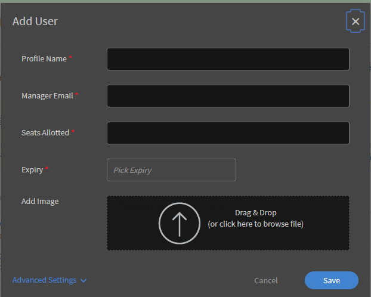
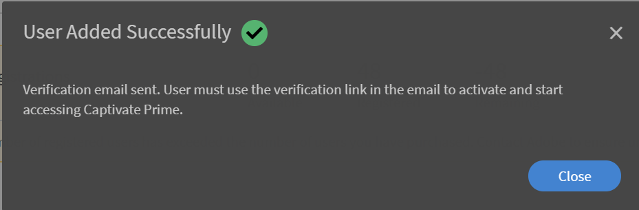

# Konfigurera användare i Learning Manager

## Interna och externa användare {#internalandexternalusers}

I alla LMS, inklusive Learning Manager, är användarhantering en viktig aspekt. Med Learning Manager kan du klassificera användare som interna och externa. Interna användare är de användare som tillhör en viss organisation eller grupp. I allmänhet är användare inom ett företag interna användare. Dessa användare har specifika utbildningsobjekt med specifika tidsgränser, enligt tilldelning av deras chefer eller administratören.

Externa användare är däremot vanligtvis tillfälliga användare av ett specifikt Learning Manager-konto. Dessa användare kan få åtkomst till specifika utbildningsobjekt genom att klicka på en tillfällig extern länk som de får via e-post. De externa användarprofilerna har vanligtvis ett utgångsdatum. En organisation som utför certifieringar för Java kan till exempel ha användare som tillfälligt loggar in för att slutföra relevanta kurser och sedan försöker certifiera sig. Vanligtvis har klassrumsutbildningar och kurser avsedda för externa användare också begränsad kapacitet.

Läs vidare för att lära dig hur du lägger till interna användare och externa användare i Learning Manager.

## Konfigurera externa användare {#setupexternalusers}

Som administratör kan du lägga till externa användare, t.ex. anställda i partnerorganisationer, i ditt Learning Manager-konto. Så här lägger du till externa användare:

1. Klicka på **[!UICONTROL **Användare**]**i det vänstra navigeringsfönstret på **[!UICONTROL **Administratörs**]**inloggningssidan.
1. På sidan **[!UICONTROL **Användare**]** klickar du på **[!UICONTROL **Externa**]**i det vänstra navigeringsfönstret. Systemet visar sidan Externa användare med en lista över externa användare (om relevant).
1. Klicka på **[!UICONTROL **Lägg till**]**i det övre högra hörnet på sidan.

   

1. I popup-dialogrutan **[!UICONTROL **Lägg till användare**]**är följande fält obligatoriska:

   * **[!UICONTROL **Profilnamn**:]**Ange namnet på den externa profil som du skapar.
   * **[!UICONTROL ** Chefens e-postadress **:]** Ange e-postadressen till chefen för den externa användaren.
   * **[!UICONTROL ** Tilldelade platser **:]** Ange antalet elever som kan registrera sig till kursen.
   * **[!UICONTROL ** Expiry **:]** Ange utgångsdatumet efter vilket en extern användare inte kan registrera eller förbruka kursen.

1. Klicka på **[!UICONTROL ** Avancerade inställningar **.]**
1. Du kan även ange följande alternativ när du skapar en extern profil:

   * **[!UICONTROL ** Lägg till bild **:]** Dra och släpp bilden du vill ha. Bilden visas på elevsidan för användare.
   * **[!UICONTROL ** Inloggningskrav **:]** Ange hur många dagar användaren måste logga in. Om den externa användaren överskrider inloggningsperioden kan eleven inte komma åt eller använda utbildningsobjektet.
   * **[!UICONTROL ** Tillåtna domäner **:]** Ange domäner avgränsade med kommatecken. Endast de användare som har de angivna domänerna kan registrera sig på kontot.
   * **[!UICONTROL ** Verifiering via e-post krävs **:]** Markera den här kryssrutan om du vill att ett bekräftelsemeddelande ska skickas till användarna

1. Klicka på **[!UICONTROL Save.]**

   

   En popup-dialogruta med URL visas. Du kan kopiera denna URL och skicka den till externa användare. Som standard skickas ett e-postmeddelande med den här URL:en till användaren.

1. När du lägger till externa profiler visas de på sidan **[!UICONTROL ** Externa användare **(** administratör **>** användare **>** externa **).]** Platsbegränsning, utgångsdatum och inloggningskrav visas också för dessa användare.
1. Om du vill ändra inställningarna för en extern användare klickar du på användarnamnet. Dialogrutan **[!UICONTROL Edit External Enrollment]** visas. Ändra inställningarna och klicka på **[!UICONTROL ** Spara **.]**
1. Du kan även skicka välkomstmeddelandet igen eller kopiera webbadressen när som helst genom att klicka på ikonerna för e-post/kopiera webbadressen bredvid den externa profilen.

   

## Pausa den externa användarprofilen {#pausetheexternaluserprofile}

När du har lagt till en extern användargrupp i Learning Manager kan du även pausa registreringen av externa användare. När du pausar blockeras registreringen av externa användare. Men den här processen fungerar bara när användarna inte har registrerat sig än genom att acceptera inbjudan.

Om du vill pausa de externa användargrupperna klickar du på **[!UICONTROL **Åtgärder**]**i det övre högra hörnet på sidan och väljer **[!UICONTROL Pause]**.

## Återuppta extern användarprofil {#resumeexternaluserprofile}

Du kan när som helst återkalla blockeringen (paus) genom att välja ett återupptagningsalternativ. Klicka på **[!UICONTROL **Åtgärder**]**längst upp till höger på sidan och välj **[!UICONTROL Resume]**.

**[!UICONTROL External user states]**

I Learning Manager gäller följande tillstånd för externa användare:

* **Inaktivt läge** - I det här läget har registreringen av externa användare upphört att gälla. Administratörerna anger förfallodatumet för de externa användarna när de läggs till via arbetsflödet Lägg till användare.
* **Aktivt läge** - I det här läget kan externa användare registrera sig till Learning Manager-programmet och även logga in på programmet.
* **Pausa** - Registreringsprocessen för externa användare blockeras i det här tillståndet. De befintliga användarna kan dock fortsätta att logga in.

## Konfigurera interna användare {#setupinternalusers}

Du som är administratör kan vilja konfigurera användare för ditt företag eller din organisation. Dessa användare kallas även för interna användare. Interna användare kan logga in på programmet med enkel inloggning eller med Adobe ID. Dessa användare kan sedan få tillgång till och använda utbildningsobjekten enligt sina behov. Det finns tre möjliga sätt att konfigurera interna användare för en organisation:

* Lägga till flera användare samtidigt via en CSV
* Lägga till användare via självregistrering
* Lägga till en enskild intern användare

## Lägga till användare med en CSV-fil {#addingusersusingacsvfile}

Du kan välja den här metoden för att lägga till interna användare om antalet användare är stort. När du använder en CSV för att lägga till användare första gången måste du mappa CSV-datainnehållet till programetiketterna. När du sedan lägger till nya användare eller uppdaterar användardata behålls samma mappning. Så här lägger du till interna användare gruppvis:

1. Klicka på **[!UICONTROL **Användare**]**i det vänstra navigeringsfönstret på sidan **[!UICONTROL Administrator Home]**.
1. Klicka på **[!UICONTROL ** Lägg till **>**&#x200B;Överför en CSV **.]**
1. Klicka på **[!UICONTROL ** Importera **i popup-dialogrutan.]**
1. Bläddra till den plats där du har sparat CSV-filen. Klicka på **[!UICONTROL Open]**.
1. Importera CSV-filen och mappa innehållet i CSV-filen till programetiketterna. Det här steget gäller endast när du överför CSV-filen för första gången.
1. Klicka på **[!UICONTROL **Spara**]**för att spara mappningen.
1. Klicka på **[!UICONTROL **Lägg till**]**om du vill överföra CSV-filen som redan är mappad till programdata.

### Att tänka på när CSV-filen skulle skapas för överföring: {#considerationswhencreatingthecsvfileforupload}

När du skapar CSV-filen för att överföra interna användare är följande några av de obligatoriska fälten som du måste ange data för: Anställds namn, Anställds e-postadress, Anställds profil eller beteckning och Chefens hierarki.

Namnet och e-postadressen för varje anställd kan mappas direkt till programdata. Observera att du måste ange ett e-postmeddelande som är angivet i CSV-filen som e-postadress för hanteraren. Du kan antingen definiera hanterar-ID när du skapar CSV-filen eller ange e-post-ID som motsvarar hanterar-ID när du överför CSV-filen.

***Innan du lägger till ett ID som medarbetarens chef-ID ska du se till att chefen läggs till som medarbetare i CSV-filen.***

***Se till att det inte finns några extra blanksteg mellan posterna för att överföra CSV-filen.***

Se en exempelögonblicksbild av en CSV-fil här:

Hämta en CSV-exempelfil genom att hämta `<give link to zip file>`.

<!--Zip file reference, no source file-->

### Konfigurera rotanvändare {#settinguprootuser}

Automatisera massimporten av användare.

## Lägga till användare via självregistrering {#addingusersthroughselfregistration}

Förutom att lägga till interna användare i grupp kan du även lägga till användare genom självregistrering. Du kan använda självregistrering för att göra det möjligt för anställda att registrera sig som elever på ditt Learning Manager-konto. När du skapar en självregistreringsprofil skapas en unik URL. Dela denna URL med medarbetaren för att göra det möjligt för dem att registrera sig i Learning Manager.

1. Klicka på **[!UICONTROL Users]** i det vänstra navigeringsfönstret på sidan **[!UICONTROL Administrator Home]**.
1. Klicka på **[!UICONTROL ** Lägg till **>** Självregistrering **.]**

   

1. Ange medarbetarens namn i fältet **[!UICONTROL Profile Name]** i popup-dialogrutan **[!UICONTROL Add User]**.
1. Ange namnet på medarbetarens chef i fältet **[!UICONTROL Manager's Name]**.
1. Du kan även lägga till profilbilden för medarbetaren med fältet **[!UICONTROL Add Image]**.
1. Klicka på **[!UICONTROL Save]**.

   

   Systemet visar en annan popup-dialogruta med ett meddelande om att profilen har skapats korrekt. I den här dialogrutan genereras också en unik URL.

1. Dela denna URL med medarbetaren så att medarbetaren kan registrera sig själv som elev.

   

## Lägg till enskilda användare i Learning Manager {#addsingleusersincaptivateprime}

Att lägga till enskilda användare är den tredje metoden för att lägga till interna användare på ditt konto. När du vill lägga till några användare är den här proceduren idealisk. Lägg till en enskild användare:

1. Klicka på **[!UICONTROL Users]** i det vänstra navigeringsfönstret på sidan **[!UICONTROL Administrator Home]**.
1. Klicka på **[!UICONTROL ** Lägg till **>** En användare **.]**

1. Ange följande information för användarna i popup-dialogrutan Lägg till användare:

   * **[!UICONTROL Name]** **[!UICONTROL :]** Ange namnet på medarbetaren eller den interna användaren. Detta fält är obligatoriskt.

   * **[!UICONTROL Email]** **[!UICONTROL :]** Ange medarbetarens e-post-ID. Detta fält är obligatoriskt.

   * **[!UICONTROL Profile]** **[!UICONTROL :]** Ange medarbetarens beteckning eller befattning.

   * **[!UICONTROL ** Chefens namn **:]** Ange namnet på chefen. Den här databashanteraren måste redan läggas till för att kunna definieras här.
   * **[!UICONTROL ** EUT **:]** Ange anställdens anslutningsdatum.
   * **[!UICONTROL **Plats**:]**Ange platsen för medarbetaren. Om du till exempel har din organisation på flera geografiska platser anger du platsen där medarbetaren finns.

   

1. Klicka på **[!UICONTROL Add]**.
1. Systemet visar ett meddelande om att användaren har lagts till. Användaren får en verifieringslänk i angivet e-post-ID. Användaren kan klicka på den här länken för att aktivera sitt konto och börja komma åt Learning Manager.

   

## Hantera användargrupper i Learning Manager {#managingusergroupsincaptivateprime}

Användargruppen är ingenting annat än en uppsättning användare som tillhör en definierad kategori. Administratörer kan använda användargrupper för att snabbt välja elever utifrån deras attribut. Du kan också snabbt tilldela logotyper eller kataloger till gruppen med användare och generera anpassade rapporter om deras förlopp.

Det finns två typer av användargrupper i Learning Manager: Anpassade och autogenererade. När du lägger till elever i ditt konto skapas vissa standardgrupper automatiskt utifrån rollerna och egenskaperna för användarna i ditt konto. Dessa grupper genereras automatiskt. Till exempel en grupp med alla elever eller alla författare.

***Du kan inte redigera namnet på och beskrivningen av automatiskt genererade grupper.***

Klicka på **[!UICONTROL Auto-generated]** i den vänstra rutan för att visa de automatiskt genererade användargrupperna i Learning Manager. Programmet visar en lista över alla automatiskt genererade användargrupper som är tillgängliga för ditt konto.

Du kan också skapa anpassade grupper med en vald lista med användare i Learning Manager. Med anpassade grupper kan du ange ett namn, en beskrivning och attributen för användargruppen. Anpassade grupper som du skapar i Learning Manager är dynamiska. Det innebär att om nya användare läggs till med liknande attribut läggs de automatiskt till i dessa användargrupper.

## Skapa anpassade användargrupper {#createcustomusergroups}

1. Klicka på **[!UICONTROL Users]** på startsidan för Learning Manager-administratör.
1. Klicka på **[!UICONTROL **Lägg till**]**i det övre högra hörnet på sidan Anpassade användargrupper.

   Systemet visar dialogrutan **[!UICONTROL Add User Group]**.

   

1. Ange namnet på och beskrivningen av din användargrupp. Till exempel Dev-Users som inkluderar användare från produktutvecklingsteamet.
1. Lägg till användare i den anpassade användargruppen genom att ange användarens användarnamn eller profil i fältet **[!UICONTROL ** Lägg till användare **.]**
1. Om du vill lägga till fler användare i den anpassade gruppen klickar du på **[!UICONTROL ** Lägg till fler användare **.]**
1. När du har lagt till alla användare klickar du på **[!UICONTROL Save]**om du vill spara den anpassade användargruppen.

