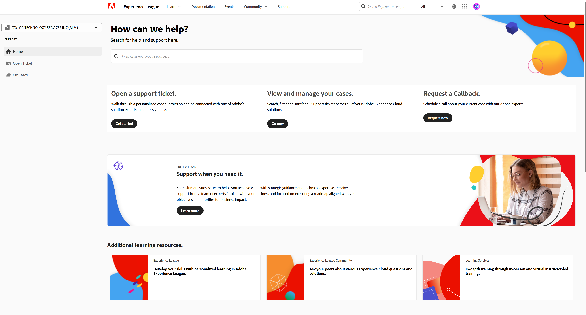

# Så här skickar du ett supportärende på Experience League

Processen för att skicka in Adobe Learning Manager supportärenden är nu direkt integrerad med supportplattformen för Experience League. Det här är en självbetjäningsportal som nyligen har omarbetats för att erbjuda mer personlig anpassning och användarvänlighet för berättigade kunder. Läs den här guiden nedan om du vill ha mer information om hur du öppnar supportportalen i Experience League och loggar ett ärende.

Observera att det bara är auktoriserade supportkontakter som kan skicka in ett supportärende. Fortsätt att skicka dina supportärenden till Adobe Learning Manager via e-post fram till 11 maj 2025 för dina supportfrågor. Efter detta datum kan du skicka dina supportärenden via Experience League supportportal enligt beskrivningen nedan, utöver den e-postkanal som redan finns.

1. Gå till supportportalen på webbplatsen **[!UICONTROL Experience League]** och välj fliken **[!UICONTROL Support]** högst upp på sidan. Du kan också gå till [direktlänken](https://experienceleague.adobe.com/home#support).

   
   _Hemsida för support_

2. Från startsidan för **[!UICONTROL Support]** kan du enkelt navigera till dina öppna ärenden, logga ett nytt ärende, visa de bästa supportartiklarna eller utforska ytterligare utbildningsresurser.

   
   _Öppna ärende_

3. Välj alternativet **[!UICONTROL Open a support case]** om du vill skicka ett ärende. Du kan också välja alternativet **[!UICONTROL Open Tickets]** på menyn i sidopanelen. Du dirigeras till sidan för att skapa ärendet, där du kan ange ditt produktnamn (Adobe Learning Manager, Audience Manager, Campaign, Target osv.), **[!UICONTROL Case title]** och **[!UICONTROL Case description]**. För att påskynda felsökningsprocessen, var så beskrivande som möjligt när du beskriver problemet du står inför.

   Mot slutet av formuläret fyller du i följande fält för att ge oss mer specifik information som hjälper oss att felsöka:

   * Anledning till problemet (välj lämplig listruta för en problemtyp)
   * Konto-ID
   * Roll (administratör, författare, elev, integrationsadministratör osv.)
   * Skiftlägesprioritet (låg, medel, hög, kritisk)
   * Verksamhetseffekt
   * Tidszon
   * Alternativ för att kopiera avsedda användare.

   Slutligen måste du ladda upp alla relevanta filer innan du klickar på **[!UICONTROL Submit]**. (Den bifogade filen är inte större än 24 MB)

   
   _Biljettformulär_

4. När du klickar på **[!UICONTROL Submit case]** omdirigeras du till sidan **[!UICONTROL My cases]**, där du kan se alla ärenden som din organisation har skickat in. Du kan också navigera till den här sidan genom att klicka på knappen **[!UICONTROL My cases]** på menyn i sidopanelen. På den här sidan kan du visa alla dina öppna och stängda supportärenden. Med hjälp av alternativen överst på sidan kan du filtrera efter ärendestatus (öppen eller stängd) eller efter Experience Cloud. Du kan också använda sökfältet för att söka efter nyckelord som gäller dina supportfrågor.

   
   _Öppna ärenden_

5. Om du vill visa mer information om ett ärende klickar du på det för att öppna ärendevyn. I ärendevyn kan du visa de senaste kommentarerna med den tilldelade ärendeägaren och lägga till ytterligare bilagor eller svar du vill ha.

Du kan eskalera ett ärende genom att välja alternativet Eskalera till hantering till höger på sidan under Ärendeinformation. Du kan också stänga ärendet genom att klicka på knappen &quot;Stäng ärende&quot; som finns bredvid.

## Ytterligare information

För att vårt supportteam ska kunna hantera dina eskaleringar på ett så effektivt sätt som möjligt ber vi dig att endast skicka in en ärendeeskalering om den allvarligt påverkar din organisation, dina partner eller kunder.

Om du har ytterligare frågor om hur du använder **[!UICONTROL Experience League Support]**-portalen kan du meddela oss i kommentarsavsnittet nedan eller kontakta vårt supportteam direkt på den här e-postadressen [almdynsupp@adobe.com](mailto:almdynsupp@adobe.com).

Om du vill lägga till en behörig kontaktperson som kan öppna supportärenden via Experience League (EXL) går du till [http://licensing.adobe.com](http://licensing.adobe.com).
