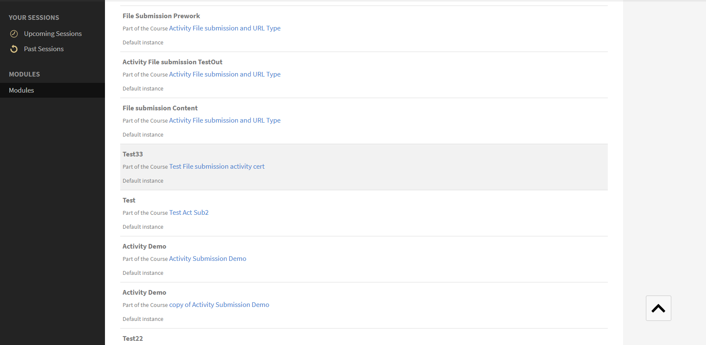
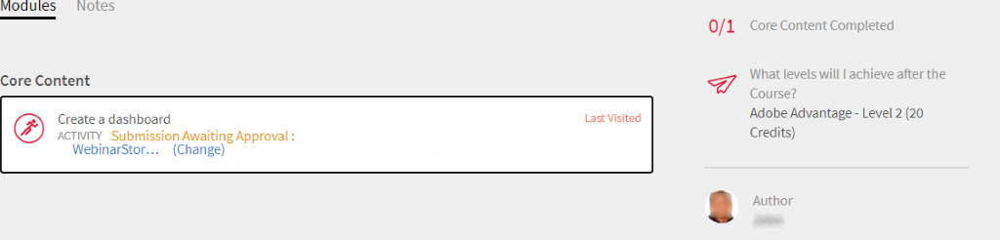

# Moduler

Läs den här artikeln och lär dig hantera moduler som instruktör i Learning Manager.

## Visa sessionsöversikt {#viewsessionoverview}

1. I den vänstra rutan klickar du på Kommande session.
1. Välj den session vars information du vill visa i listan över kommande sessioner.

   Appen visar sessionsöversikten med detaljer som namnet på sessionen, plats, tider, registreringsgräns, väntelistegräns och så vidare.

   
   *Visa kommande sessioner*

## Konfigurera sessionsdetaljer {#configuresessiondetails}

1. I den vänstra rutan klickar du på Kommande session.
1. Välj den session som du vill uppdatera.
1. Klicka på Redigera i det övre högra hörnet.

   
   *Konfigurera sessionsdetaljer*

1. På sidan Sessionsöversikt kan du redigera sessionstiderna, datumet, platsen och så vidare. Du kan även redigera eller lägga till följande sessionsinformation:

   * Ange registreringsgränsen för att ange det maximala antalet elever som tillåts för sessionen.
   * Ange väntelistegränsen om du vill ange det maximala antalet elever som tillåts på väntelistan för sessionen.
   * I fältet Tillåt inlämningar väljer du Ja för att göra det möjligt för elever att skicka in uppgifter. Om du väljer Nej kan eleverna inte överföra tilldelningsansökningar för sessionen.

   
   *Redigera sessionsdetaljerna*

1. Klicka på Spara.

   Du kan inte redigera instruktörsfältet från den här sidan.

## Överför resursfiler för sessionen {#uploadresourcefilesforyoursession}

Instruktörer kan ladda upp resursfiler som uppdragsfiler eller presentationer för modulerna eller aktivitetsfiler för modulen. Använd menyn Resurser för att lägga till resursfiler för din modul eller session.

1. I instruktörsappen klickar du på Kommande sessioner > Resurser.

   Du kan visa sidan Resurser som redan har en länk till de resurser som författarna kan ha överfört för kursen som är kopplad till din modul. Dessutom kan instruktörer även ladda upp resursfiler för moduler.

1. Klicka på Lägg till.

   
   *Lägg till en resurs för sessionen*

1. Bläddra till lämplig fil i din dator. Markera filen och klicka på Öppna.
1. När filen har överförts kan du se filen tillsammans med det datum då den lades till.

   Elever som har registrerat sig för den här modulen kan se dina filer när de har överförts, i avsnittet Resurser under Kurser.

   Om du vill ta bort en resursfil markerar du den eller de filer som du vill ta bort. Klicka på Åtgärder > Ta bort fil på sidan Resurser.

## Inlämning av fil för aktivitetsmoduler {#filesubmissionforactivitymodules}

Aktivitetsmodulen stöder arbetsflödet för inlämning av filer. Skapa som författare en aktivitetsmodul och välj  **[!UICONTROL File Submission]** alternativ. Detta ger eleverna möjlighet att skicka en fil.

Dessa filer kan godkännas/avslås av modulens instruktörer. Modulen slutförs inte förrän instruktören har godkänt inskickningen.

 
*Godkänn eller avvisa filer*

## Modulen Utvärdera checklista {#evaluate-checklist-module}

När eleven har gått kursen ser instruktören checklistmodulen på sidan Inlämningar/Checklistor i **Moduler**-sektionen. Den här sidan innehåller alla aktivitetschecklistmoduler tillsammans med aktivitetsinlämningsmoduler som ska granskas. För varje modul visas antalet elever för vilka utvärderingen ska göras.

På sidan nedan kan du visa moduler av typen **Ansökan** och **Checklista**. I det här exemplet använder vi modulen Checklista.

*Visa en lista över moduler*

Klicka på modulen Checklista. På fliken **Checklista** visas följande:

* Namnet på modulen
* Namnet på kursen
* Instans som kursen tillhör
* Kriterier för godkänt som författaren angett
* Antal checklistefrågor

*Visa checklistesidan*

För att utvärdera en elev klickar du på **[!UICONTROL Evaluate]** i **[!UICONTROL Checklist]** -kolumnen. Du kan också se att granskningens status är **Väntar**.

Utvärdera eleven och klicka på **[!UICONTROL Submit]**. Du som är instruktör måste svara på alla utvärderingsfrågor.

*Checklista för utvärdering*

Beroende på kriteriet för godkänt kommer statusen att vara antingen Misslyckad eller Godkänd.

När en checklista väl har utvärderats kan den inte utvärderas på nytt.

En instruktör kan också visa de svar som skickats in av andra instruktörer i modulen.

Du kan exportera eleverna som en CSV baserat på det sökfilter som används.

När instruktören utvärderar kursen med hjälp av checklistan ser eleven modulstatus som **Godkänt** och kursstatus som **Slutfört** eller modulstatusen som **Fel** och kursstatus som **Slutfört**.

## Kommentarer från instruktören för avvisande av en aktivitet {#rejection-comments}

En elev kan se kommentaren från en instruktör i meddelandet som skickas för avvisande. Eleven kan sedan skicka in igen genom att lämna mer information i form av kommentarer.

Så här fungerar arbetsflödet:

1. En författare skapar en kurs med en aktivitetsmodul, tilldelar en instruktör och publicerar sedan kursen.

1. En elev förbrukar kursen och efter att ha slutfört kursen lämnar in bevis på slutförande.

   
   *Skicka in bevis på slutförande*

1. Instruktören väljer sedan den aktivitetsmodul som är tilldelad honom/henne. På sidan Submissions för modulen, klickar instruktören på **Redigera**. Han/hon kan sedan ange kommentarerna för avvisande och aktivera alternativet Visa kommentar, så att eleven kan se kommentaren i meddelandet.

   
   *Ange kommentarer för slutförande*

1. Instruktören kan klicka **Avslå**. Status för inskickningen ändras till **Markerat för avvisande**.

   
   *Avslå en ansökan*

1. Efter inskickandet ändras statusen till **Avvisat**.

   
   *Visa avslagsstatus*

1. Eleven ser nu ett meddelande om att hans/hennes bidrag har avslagits. Kommentarerna från instruktören visas också i meddelandet.

   
   *Ta emot meddelande om avslag*

För att passa ändringarna har Adobe uppdaterat e-postmallen för **Ansökan har avslagits**.

## Lägg till poäng och kommentarer för aktivitetsmoduler {#addscoresandcommentsforactivitymodules}

Följ stegen nedan om du vill lägga till poäng och kommentarer för aktivitetsmoduler som har skickats för inlämning:

1. I den vänstra rutan klickar du på **[!UICONTROL Learner]**.

   
   *Välj en elev*

1. Klicka på på elevens sida **[!UICONTROL Actions]** > **[!UICONTROL Edit Scores & Comments]**.

   
   *Lägg till kommentarer*

   För elever som inte har slutfört kursen visas inte inmatningsfältet Poäng och kommentarer.

   
   *Redigera poäng och kommentarer*

1. Klicka på **[!UICONTROL Save]**.
