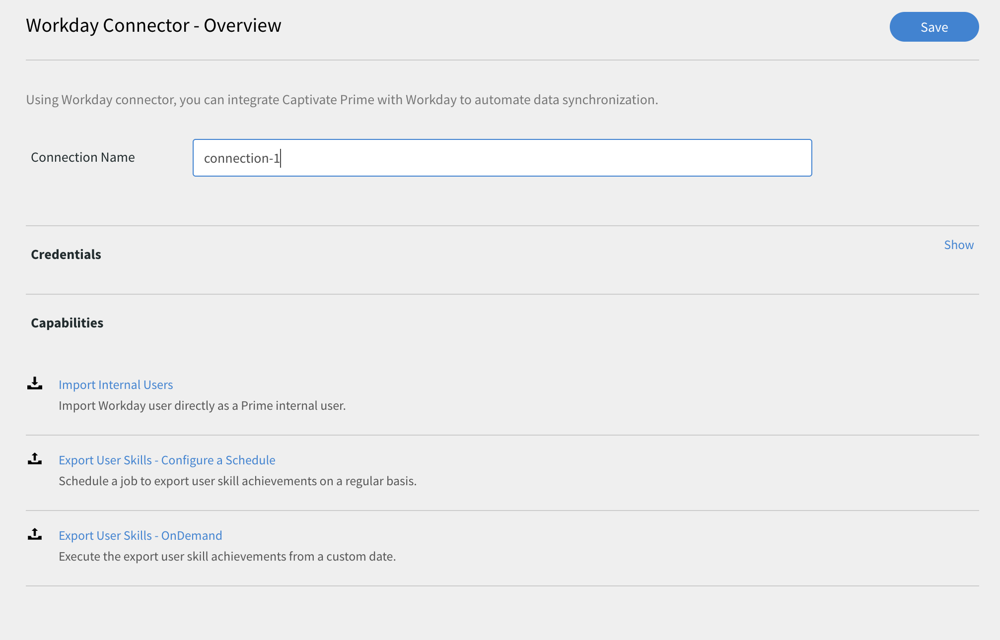
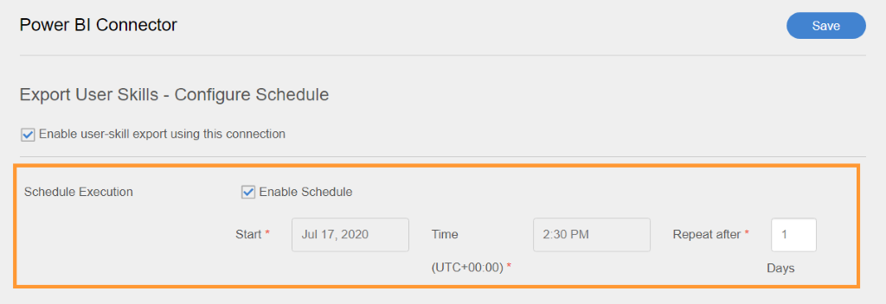
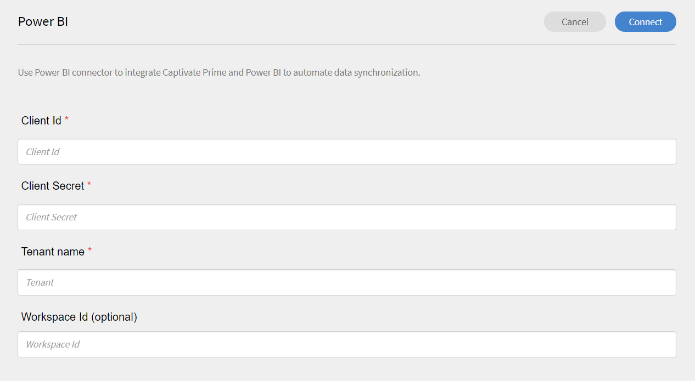
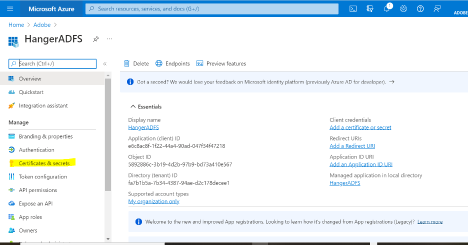
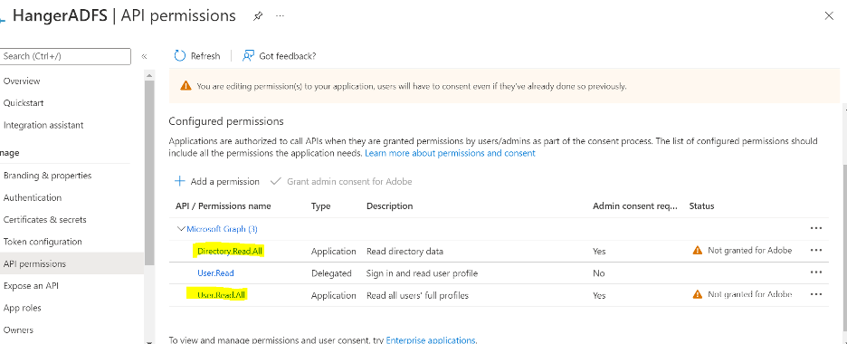
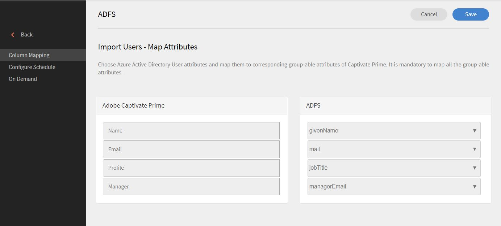

# Anslutningar för Learning Manager

Företag har andra applikationer och system som måste integreras med Learning Manager. Anslutningar är verktyg som hjälper dig att utföra databaserade integreringar, som att importera data till Learning Manager från externa system.  Den exporterar även data till externa system från Learning Manager.

Learning Manager tillhandahåller Salesforce- och FTP-anslutningar. Med Salesforce-anslutning kan integreringsadministratörer för en organisation integrera sina Salesforce-program med Learning Manager. Som integrerare kan du även använda FTP-anslutning för att automatiskt importera en uppsättning användare till ditt företagsprogram.

Learning Manager erbjuder även kontakterna Lynda, getAbstract och Harvard Management System. Via dessa kontakter kan elever få tillgång till och delta i kurser från Lynda.com, getAbstract och Harvard ManageMentor.

Läs vidare för att lära dig hur du konfigurerar och använder var och en av dessa anslutningar i Learning Manager.

<!--
>[!NOTE]
>
>**Update:** December 2020 update of Learning Manager
>
>For **FTP**, **Box**, and **Custom FTP** connectors, while exporting Learner Transcript or xAPI, you can also export the data as a **zip** file, for:
>
>* Learner Transcripts
>* xAPI
-->

>[!NOTE]
>
>I november 2022-versionen av Adobe Learning Manager har Zoom tagit bort [JWT-autentisering senast juni 2023](https://marketplace.zoom.us/docs/guides/auth/jwt/). Zoomanslutningen med JWT fortsätter därför att fungera till det angivna datumet, men vi rekommenderar att användarna skapar OAuth-appen Server-till-Server för att ersätta funktionaliteten i sina konton. Alla nya anslutningar har Zoom OAuth-autentisering som standard.

## Salesforce-koppling {#sfconnector}

Salesforce-kopplingen ansluter Learning Manager- och Salesforce-konton för att automatisera datasynkronisering. Kapaciteterna för Salesforce-anslutningen är följande:

### Mappningsattribut {#map-attributes}

Integreringsadministratören kan välja Salesforce-kolumner och mappa dem till motsvarande Learning Manager-gruppattribut. När mappningen är klar används samma mappning för efterföljande användarimporter. Det kan konfigureras om om om administratören vill ha en annan mappning för importerande användare.

### Automatiserad användarimport {#automated-user-import}

Importera användare gör att Learning Manager-administratören kan hämta medarbetarinformation från Salesforce och importera dem till Learning Manager automatiskt. Denna automatisering gör att du slipper den manuella ansträngning som krävs för att skapa CSV och överföra till Learning Manager.

### Schemalägg automatiskt {#auto-schedule}

Att använda funktionen för automatisk schemaläggning tillsammans med funktionen för automatisk användarimport kan vara effektivt. Learning Manager-administratören kan ställa in schemat efter organisationens behov. Användare i Learning Manager-programmet kan vara uppdaterade enligt schemat. Du kan synkronisera dagligen i Learning Manager-programmet.

### Filtrera användare {#filtering-user}

Learning Manager-administratören kan tillämpa filtrering på användarna innan de importeras. Learning Manager-administratör kan till exempel välja att importera alla användare i hierarkin under en eller flera specifika chefer.

### Konfigurera Salesforce-anslutning {#configuresalesforceconnector}

För att integrera Salesforce med Learning Manager, lär dig processen

#### Krav {#prerequisites}

Se till att du har URL:en till din Salesforce-organisation med dig. Om organisationens namn till exempel är **myorg** kan Salesforce-URL vara `https://myorg.salesforce.com`. Det är den enda inmatning som krävs för att ansluta Salesforce-kontot till Learning Manager.

Se också till att du har rätt inloggningsuppgifter för att logga in på kontot.

#### Skapa en anslutning {#createaconnection}

1. På Learning Manager-startsidan håller du pekaren över Salesforce-kortet/miniatyrbilden. En meny visas. Klicka på **[!UICONTROL Connect]** objekt i menyn.

   

   *Anslutningsalternativ*

1. En dialogruta visas där du uppmanas att ange org-URL. Klicka på **[!UICONTROL Connect]** när du har angett URL:en.
1. När anslutningen är klar visas översiktssidan.

### Mappningsattribut {#mapattributes}

När anslutningen har upprättats kan du mappa Salesforce-kolumner till motsvarande attribut för Learning Manager. Det här steget är obligatoriskt.

1. På mappningssidan kan du till vänster se kolumnerna i Learning Manager och till höger kan du se kolumnerna i Salesforce. Välj rätt kolumnnamn som mappas till Learning Manager-kolumnnamnet.

   
   *Mappningsattribut*

   >[!NOTE]
   >
   >Learning Manager-kolumndata som visas på vänster sida hämtas från de aktiva fälten. Fältet **hanterare** måste mappas till ett fält av typen e-postadress. Det är obligatoriskt att mappa alla kolumner innan kopplingen kan användas.

1. Klicka på **[!UICONTROL Save]** när mappningen är klar.
1. Anslutningen är nu klar att användas. Kontot som har konfigurerats och visas som en datakälla i Administratörsprogrammet. Administratören kan schemalägga importen eller synkroniseringen på begäran.

## Använda Salesforce-kopplingen {#usingsalesforceconnector}

Salesforce-anslutning ansluter till Salesforce.com för att hämta användarna enligt konfigurationen och lägga till dem i Learning Manager.

### Importera användare från Salesforce-kontakter {#import-salesforce-contacts}

Learning Manager förbättrar Salesforce-anslutningen för att hämta kontakter samt Salesforce-användare och importera dem till Learning Manager automatiskt.

På sidan Salesforce-anslutning anger du Salesforce-URL:en och slutför autentiseringen. När du har autentiserat kan du sedan fortsätta importera användare eller kontakter. Om du väljer alternativet Kontakter anger du den delmängd av kontakter som ska importeras.

Välj Salesforce-kolumnerna och mappa dem till motsvarande Learning Manager-gruppattribut. När mappningen är klar används samma mappning för efterföljande användarimporter.

1. Logga in i Salesforce.
1. Klicka på **[!UICONTROL Import Internal Users]** på anslutningssidan.

   
   *Importera interna användare*

1. Det finns ett nytt alternativ, Kontakter, på sidan **Importera användare**. Klicka på alternativknappen **Kontakter** så visas följande alternativ.

   
   *Mappa kontaktattributen*

1. Om du klickar på **[!UICONTROL Yes]** kan du göra följande:

   * **Välj kontaktkolumn:** Välj det fält som du vill importera till Learning Manager.
   * **Ange värden:** Välj de värden som representerar det markerade fältet.

   
   *Ange värdena*

   * Mappa Salesforce-kolumnerna till Learning Manager.
   * Klicka på **[!UICONTROL Save]** om du vill börja importera.

1. Om du klickar på **[!UICONTROL No. Import all Contacts]** kan du mappa fälten direkt utan att filtrera kontakterna. Här importerar du alla kontakter från Salesforce.
1. Klicka på **[!UICONTROL Save]** om du vill börja importera.

## Exportera utbildningsposter {#export-learning-records}

Learning Manager erbjuder möjligheten att exportera utbildningsposter som transkribering, användarrapport, färdighetsrapport till Salesforce. Du kan bestämma om exporterade data ska länkas till tabellen &quot;Användare&quot; eller tabellen &quot;Kontakter&quot; i Salesforce.

*Exporterar utbildningsposter*

### Anpassade objekt i Salesforce {#custom-objects-in-salesforce}

Innan du exporterar utbildningsposter från Learning Manager måste du skapa anpassade objekt i Salesforce. Anpassade objekt är objekt som du skapar för att lagra information som är specifik för ditt företag eller din bransch. Mer information finns i [Anpassade Salesforce-objekt](https://trailhead.salesforce.com/en/content/learn/modules/data_modeling/objects_intro).

Så här skapar du objekten:

1. Hämta och installera paket för att skapa anpassade objekt.

   * [Paket 1](https://test.salesforce.com/packaging/installPackage.apexp?p0=04t1k0000008WPJ)
   * [Paket 2](https://test.salesforce.com/packaging/installPackage.apexp?p0=04t1k0000008WPT)
   * [Paket 3](https://test.salesforce.com/packaging/installPackage.apexp?p0=04t1k0000008WPi)

1. Byt namn på namnen på de anpassade objekten i Salesforce.
1. Markera händelserna och klicka på **[!UICONTROL Save]**.

>[!NOTE]
>
>Kontrollera att systemadministratörsåtkomst har beviljats för alla aktiva fält som har lagts till efter paketinstallationen.

**Länka händelser med:** Välj vilket avsnitt du vill exportera - Användare eller Kontakt. Om du väljer kontaktobjektet skapas användare som finns i Learning Manager men inte i Salesforce, i Salesforce.

*Alternativet Länka händelser*

>[!NOTE]
>
>Du kan skapa flera anslutningar på ett konto. En enda anslutning kan visa upp till tre anpassade objekt i Salesforce. Om du vill skapa flera anslutningar för samma Salesforce-konto måste du installera de tre paketen. Vi tillhandahåller support för upp till tre paket.
>
>Du måste installera lika många paket som du vill skapa.

>[!NOTE]
>
>På sidan Körningsstatus för Salesforce kan antalet bearbetade poster bara kontrolleras från Salesforce. Learning Manager visar statusen som slutförd även om det sker en partiell export eller ett fel i alla poster som har bearbetats.

## Installera Salesforce-paket {#install-salesforce-package}

Learning Manager erbjuder ett Salesforce-programpaket. När de har installerats och konfigurerats i SFDC kan säljpersonal utföra sin utbildningsverksamhet inom SFDC-portalen. Med den här appen kan SFDC-användare utforska nya utbildningar, visa rekommendationer och konsumera dem direkt i SFDC-portalen. Användarna får också meddelandena som skickas av administratörer i form av mastheads direkt i appen inom SFDC-portalen.

### Konfigurera i Learning Manager-appen {#setup-in-learning-manager-app}

1. Logga in på ditt Learning Manager-administratörskonto som integrationsadministratör.
1. Klicka på **[!UICONTROL Applications]** > **[!UICONTROL Featured Apps]**.
1. Klicka på **[!UICONTROL Salesforce]**.
1. Anteckna program-ID (kallas även klient-ID ) och klienthemligheten som nämns i beskrivningen på sidan Salesforce-program.
1. Klicka på **[!UICONTROL Approve]** så måste programmet godkännas.
1. Klicka på **[!UICONTROL Developer Resources]** > **[!UICONTROL Access Tokens for Testing and Development]**.
1. I avsnittet Hämta OAuth-kod måste klient-ID:et och omfånget vara inställt på - admin:read,admin:write. Klicka på **[!UICONTROL Submit]**.
1. Ange klient-ID och klienthemlighet i Hämta uppdateringstoken. Klicka på **[!UICONTROL Submit]** och notera uppdateringstoken.

### Skapa konto i Salesforce-program {#create-account-in-salesforce-app}

1. Skapa ett konto på registreringssidan för Salesforce. Du måste skapa ett Salesforce-konto i en utvecklar- eller enterprise-version.  [URL för registrering av utvecklare](https://developer.salesforce.com/signup). Se till att du använder e-post-ID för att registrera dig för Salesforce som du har använt för Learning Manager.
1. Verifiera ditt konto via e-postmeddelandet.
1. Skapa ett lösenord och logga in på Salesforce.
1. Observera Salesforce-URL:en efter inloggning (till exempel site.lightning.force.com)

### Installera Learning Manager-paket {#install-learning-manager-package}

Om du vill installera paketet måste du först ta bort det befintliga paketet i Salesforce. Innan du avinstallerar måste du aktivera inställningarna, som visas nedan. Att tillämpa dessa inställningar är obligatoriskt, annars kan du inte installera paketet.

>[!NOTE]
>
>Adobe Learning Manager-programmet stöds bara i Salesforce Lightning-vyn.

1. Starta [URL till Learning Manager-paketet](https://login.salesforce.com/packaging/installPackage.apexp?p0=04t1k0000008WOQ).
1. Klicka på **[!UICONTROL Use Custom Domain]** på sidan **Inloggning**.
1. Ange paketets URL och klicka på **[!UICONTROL Continue]**. Alternativet Installera endast för administratörer måste vara markerat på installationssidan. Ändra inte det här alternativet.
1. Klicka på **[!UICONTROL Install]**. Klicka på **[!UICONTROL Done]** när paketet har installerats. Du kommer till sidan Installerade paket där du kan se det installerade Adobe Learning Manager-paketet.
1. Gå till Appstartaren (bredvid Konfiguration) och sök efter Adobe Learning Manager.
1. Klicka på **[!UICONTROL Configure]** om du vill konfigurera programmet.
1. Klicka på **[!UICONTROL New]** och lägg till följande information:

   * **Konfiguration:** Ange ett namn som du vill använda.
   * **ClientID**: Ange värdet som du fick från det första avsnittet.
   * **Klienthemlighet:** Ange värdet som du fick från det första avsnittet.
   * **RefreshToken:** Ange värdet som du fick från det första avsnittet.
   * **LearningManagerBaseURL:** URL:en till webbplatsen där Learning Manager finns.

### Lägg till fjärrplatsinställningar {#add-remote-site-settings}

1. Klicka på **[!UICONTROL Setup]** i det övre högra hörnet på sidan.
1. Sök efter fjärrplatsinställningar i **[!UICONTROL Quick Find]**.
1. Klicka på **[!UICONTROL New Remote Site]**.
1. Ange uppgifterna:

   * **Namn på fjärrplats:** Ange ett namn som du väljer.
   * **URL till fjärrwebbplats:** URL till webbplatsen där Learning Manager finns.

1. Starta Learning Manager.

### Aktivera meddelanden för Learning Manager-appen {#enable-notifications-for-learning-manager-app}

1. Klicka på **[!UICONTROL Setup]** i det övre högra hörnet.
1. Sök efter anpassade meddelanden.
1. Klicka på **[!UICONTROL New]**.
1. Ange följande uppgifter:

   1. **Anpassat aviseringsnamn:** LearningManagerNotification
   1. **API-namn:** LearningManagerNotification

1. Välj både **Dator** och **Mobil** som kanaler som stöds.

1. Klicka på **[!UICONTROL Save]**.
1. Följ stegen nedan för att aktivera push-meddelanden för mobila enheter:

   1. Installera Salesforce-mobilappen i din mobiltelefon.
   1. Logga in på programmet med dina inloggningsuppgifter.
   1. Gå till **Inställningar** > **Inställningar för meddelandeleverans**.
   1. Lägg till Salesforce för iOS och Android.

### Avinstallera Learning Manager från Salesforce

1. Gå till Installerade paket i Salesforce-programmet.
1. Klicka på **[!UICONTROL Uninstall]**.

## Konfigurera Learning Manager för Salesforce-användare {#configure-learning-manager-for-salesforce-users}

Learning Manager-programmet är också tillgängligt för användare som finns på alla Salesforce-konton. Salesforce-administratören kan lägga till användare baserat på profilerna. Salesforce-profilerna liknar dem i Learning Manager. Det kan till exempel gälla Administratör, Integreringsadministratör, Instruktör och så vidare. Salesforce-administratören kan också skapa en anpassad profil.

Som Salesforce-administratör kan du antingen tilldela användare profilerna eller skapa en anpassad profil.

När du installerar paketet kan du tilldela eleverna Salesforce-profilen.

När du har installerat paketet måste du konfigurera profilen.

Klicka på **[!UICONTROL Configure]** > **[!UICONTROL New]** och lägg sedan till följande:

* Konfigurationsnamn
* Klient-ID
* Klienthemlighet
* LearningManagerBaseURL
* Inaktivera omdirigering

>[!NOTE]
>
>För att elever ska kunna se Learning Manager-appen måste du aktivera den för alla elever.

Nästa steg är att ge behörighet för åtkomst till Learning Manager-appen.

*Ange behörigheter för åtkomst till Learning Manager-appen*

Välj användare och tilldela behörigheter i enlighet med detta. Eleverna kan nu komma åt Learning Manager-appen.

Välj sedan en profil, till exempel en standardprofil för en användare, och klicka på profilen. Klicka på **[!UICONTROL Edit]** och aktivera kryssrutan **Adobe Learning Manager** i avsnittet **Anpassade appinställningar**. Detta gör programmet tillgängligt för användaren.

Välj alternativet **Standard på** i avsnittet **Anpassade flikinställningar** i listrutan **Elevens startsida**.

Du måste göra programmet synligt för alla profiler.

Klicka på **[!UICONTROL Save]** så får eleverna som tillhör alla profiler åtkomst till Learning Manager-appen.

### Ändringar relaterade till utbildningsväg {#learning-path-changes}

#### Befintliga anslutningar {#existing-connections}

Om alternativet Utbildningsväg är inaktiverat i administratörskontot läggs inga rader och kolumner till i rapporten.

Om alternativet Utbildningsväg är aktiverat på administratörskontot kommer kolumnen Typ att fyllas i med utbildningsväg om elever registreras på den.

>[!NOTE]
>
>Om flaggan är aktiverad och du använder en befintlig anslutning kan några poster saknas.

#### Nya anslutningar {#new-connections}

Om alternativet Utbildningsväg är inaktiverat i administratörskontot består utbildningsrapporten av följande kolumner men innehåller inga data.

* **Inbäddad sökväg:** Visar namnet på utbildningsprogrammet
* **Inbäddat väg-ID:** Visar ID:n för utbildningsprogrammet.
* **Inbäddat kurs-ID:** Visar ID:n för kurser som finns i en utbildningsväg.

För nya anslutningar i konton där utbildningsväg är aktiverad visas de tre nya kolumnerna och alla data flödar.

Dessutom kommer rapporten att innehålla kolumntypen Utbildningsväg (högre nivå) för alla elever som är registrerade på en utbildningsväg.

I kolumnen Typ byter utbildningsprogrammet namn till Utbildningsväg. För befintliga anslutningar sker ingen förändring.

## FTP-anslutning för Learning Manager {#ftpconnector}

Med FTP-anslutningen kan du integrera Learning Manager med godtyckliga externa system för att automatisera datasynkroniseringen. Det förväntas att externa system kan exportera data i CSV-format och placera dem i lämplig mapp på FTP-kontot för Learning Manager. Funktionerna för FTP-anslutningar är följande:

Du kan också använda Boxs anslutning för datamigrering, användarimport och dataexport. Mer information finns i Rutanslutning.

### Dataimport {#data-import}

Importprocessen för användare gör det möjligt för Learning Manager-administratören att hämta information om anställda från Learning Manager FTP-tjänsten och importera dem till Learning Manager automatiskt. Med den här funktionen kan du integrera flera system genom att placera CSV-filen som genereras av de systemen i lämplig mapp på FTP-kontona. Learning Manager hämtar CSV-filerna, slår samman dem och importerar data enligt schemat. Mer information finns i schemaläggningsfunktionen.

**Mappningsattribut**

Integreringsadministratören kan välja kolumnerna i CSV och mappa dem till Learning Managers grupperbara attribut. Denna kartläggning är en tidsansträngning. När mappningen är klar används samma mappning för efterföljande användarimporter. Mappningen kan konfigureras om om administratören vill ha en annan mappning för importerande användare.

#### Exportera data {#export-data}

Dataexporten gör det möjligt för användare att exportera användarfärdigheter och elevens betygsutdrag till en FTP-plats för att integrera med alla externa system.

#### Tidsplanering {#scheduling}

Administratörer kan ställa in schemaläggningsuppgifter enligt organisationens krav och användare i Learning Manager-programmet är uppdaterade enligt schemat. På samma sätt kan integreringsadministratören schemalägga kunskapsexporten så att den sker i tid och integreras med ett externt system. Synkronisering kan utföras dagligen i Learning Manager-programmet.

### Konfigurera FTP-anslutning för Learning Manager {#configure-captivate-prime-ftp-connector}

Lär dig hur du integrerar FTP-anslutningen med Learning Manager.

#### Skapa en anslutning {#Create-a-connection-1}

1. På startsidan för Learning Manager håller du pekaren över FTP-kortet/miniatyrbilden. En meny visas. Välj alternativet Anslut på menyn.

   

   *Anslutningsalternativ*

Om du vill ansluta till en FTP-server med FTP-klienten behöver du följande information:

* **FTP-domän**: Det här är adressen till den FTP-server som du vill ansluta till. Till exempel ftp.example.com
* **Port**: FTP-standardporten är 21, men vissa servrar kan använda olika portar av säkerhetsskäl. För Adobe Learning Manager - port 22
* **FTP-användarnamn**: Användarnamnet som du behöver för att få åtkomst till FTP-servern.
* **FTP-lösenord**: Lösenordet som är kopplat till användarnamnet.

**FileZilla (Windows, macOS och Linux)**

**Steg 1: Hämta och installera FileZilla**

Om du inte har installerat FileZilla ännu kan du hämta det från den officiella webbplatsen: [Hämta](https://filezilla-project.org/) och installera det på datorn.

**Steg 2: Öppna FileZilla**

Efter installationen, starta FileZilla på datorn.

**Steg 3: Samla in FTP-serverinformation**

**Steg 4: Ange FTP-serverinformation i FileZilla**

Välj **[!UICONTROL File]** på den övre menyn och välj sedan **[!UICONTROL Site Manager]** (eller använd kortkommandot Ctrl+S).

**Steg 5: Lägg till ny FTP-webbplats**

Välj **Ny plats** i Platshanteraren och ange ett namn (t.ex. Min FTP-server).

**Steg 6: Ange FTP-information**

Ange följande information:

* **Värd**: Ange FTP-serverns adress.
* **Port**: Om servern använder en port över 21 anger du rätt portnummer.
* **Protokoll**: Välj **[!UICONTROL SFTP – SSH File Transfer Protocol]**.
* **Inloggningstyp**: Välj **[!UICONTROL Normal]**.
* **Användare**: Ange ditt FTP-användarnamn.
* **Lösenord**: Ange FTP-lösenordet.

**Steg 7: Anslut till FTP-servern**

Välj knappen **[!UICONTROL Connect]** i Platshanteraren. FileZilla ansluter till FTP-servern om all information är korrekt.

**Steg 8: Navigera och överför filer**

När du är ansluten ser du fjärrfilerna på höger sida och dina lokala filer på vänster sida. Du kan navigera mellan katalogerna och överföra filer genom att dra och släppa dem mellan panelerna.

>[!CAUTION]
>
>Undvik att ändra viktiga filer på servern när du överför filer.

<!--1. A dialog appears prompting you to enter the email id. Provide the email id of the person responsible for managing the Learning Manager FTP account for the organization. Click **[!UICONTROL Connect]** after providing the email id. 
1. Learning Manager sends you an email prompting the user to reset the password before accessing the FTP for the first time. The user must reset the password and use it for accessing the Learning Manager FTP account.

   >[!NOTE]
   >
   >Only one Learning Manager FTP account can be created for a given Learning Manager account.

   In the overview page, you can specify the Connection Name for your integration. Choose what action you want to take  from  the following options:

   * Import Internal Users  
   * Import xAPI
   * Export User Skills - Configure a Schedule  
   * Export User Skills - OnDemand  
   * Export Learner Transcripts - Configure a Schedule
   * Export Learner Transcripts - OnDemand

   
   *Export options*-->

### Importera {#import}

+++Intern användare

Med alternativet Importera intern användare kan du importera användare från en CSV till en Learning Manager på begäran eller vid schemaläggning.

+++

+++Mappattribut

När anslutningen har upprättats kan du mappa kolumnerna i CSV-filer. Den placeras i FTP-mappen till motsvarande attribut för Learning Manager. Det här steget är obligatoriskt.

1. På sidan Mappattribut kan du till vänster se förväntade kolumner i Learning Manager och till höger kan du se CSV-kolumnnamnen. Inledningsvis, på höger sida, kan du se en tom ruta. Importera en CSV-mall genom att klicka på **Välj fil**.
1. I steget ovan fylls den högra listrutan för val i med alla CSV-kolumnnamn. Välj rätt kolumnnamn som mappas till Learning Manager-kolumnnamnet.

   >[!NOTE]
   >
   >Fältet Chef måste mappas till ett fält av typen e-postadress. Det är obligatoriskt att mappa alla kolumner innan kopplingen kan användas.

1. Välj **[!UICONTROL Save]** när mappningen är klar.

   Anslutningen är nu klar att användas. Det konfigurerade kontot visas som en datakälla i administratörsprogrammet för administratören för att schemalägga importen eller för synkronisering på begäran.

+++

+++Använda FTP-anslutningen Learning Manager

1. CSV-filerna från externa system måste placeras på följande sökväg:

   `code $OPERATION$/$OBJECT_TYPE$/$SUB_OBJECT_TYPE$/data.csv`

   >[!NOTE]
   >
   >I versionen från juli 2016 är endast import av användare tillåten. Om du vill använda FTP-anslutningen måste du se till att CSV-filerna finns i följande mapp:

   `code Home/import/user/internal/*.csv`

1. FTP-anslutningen tar alla rader från CSV-filer. Det är viktigt att den rad som motsvarar en användare i en CSV-fil inte visas i några andra CSV-filer.
1. Alla CSV-filer måste innehålla de kolumner som anges i mappningen.
1. Alla nödvändiga CSV-filer måste finnas i mappen innan processen startar.

>[!NOTE]
>
>När du importerar användare till Learning Manager måste administratören också veta hur användare hanteras i Learning Manager. Mer information finns i [Hjälp för användarhantering](migration-manual.md#usermanagement).

+++

+++Importera xAPI

Med importalternativen för xAPI kan du schemalägga import av xAPI-satser från externa tjänster till Learning Manager på begäran.

+++

+++Konfigurationer som krävs för att importera xAPI

1. På konfigurationssidan väljer du en befintlig konfiguration som är tillgänglig i konfigurationslistan för att importera xAPI-satser från CSV-filen. Klicka på redigera eller **lägg till en ny konfigurationslänk** för att gå till sidan Konfigurera importkällor.

   **Konfiguration**

   * Fyll i de två fälten Namn och Källfilsnamn på sidan Konfigurera importkällor. Källfilens namn ska matcha det filnamn som anges på FTP-mappens plats.
   * Klicka på **[!UICONTROL Save]** för att spara ändringarna.

   
   *Konfigurera*

   **Filter**

   * Klicka på **[!UICONTROL Filter]** i den vänstra rutan.
   * På sidan Konfigurera import-filter fyller du i fälten Namn och Villkor för att filtrera bort posterna. Klicka på **[!UICONTROL Add new Filter]** för att lägga till ytterligare ett filter. Du kan spara eller ta bort ett filter genom att klicka på alternativet **Spara** eller **Ta bort** under kolumnen Åtgärder.

   
   *Filter*

   **Mappning**

   * Klicka på **[!UICONTROL Mapping]** i den vänstra rutan.
   * På sidan Importera xAPI-satser-konfiguration-mappning, till vänster kan du se sökvägsnamnen för xAPI JSON-fält som måste mappas med CSV-kolumnnamnen.
   * Som standard är de tre JSON-sökvägsfältnamnen som måste mappas till CSV-kolumnnamnen **actor.mbox**, **verb.id** och **object.id**. Du kan lägga till andra fält i mappningen genom att klicka på **Lägg till en ny mappning**.

   * Välj den typ av kolumnnamn som du mappar med Json-fältsökvägsnamnet (om det är sträng, siffra, booleskt eller datumtyp).
   * Klicka på Spara när du är klar med mappningen. XAPI-importen kan nu importeras enligt schema eller på begäran.

   
   *Mappning*

1. Klicka på **[!UICONTROL Configure Schedule]** i den vänstra rutan. Klicka på **[!UICONTROL Enable Schedule]** för att schemalägga importen av xAPI-satser.

   Du kan ange starttid och startdatum och sedan ange frekvensen för xAPI-importschemat i dagar. Du kan till exempel aktivera xAPI-import var tredje dag.

   
   *Importera xAPI-satser - konfigurera schema*

1. Klicka på **[!UICONTROL On Demand Execution]** i den vänstra rutan.

   
   *Importera xAPI-satser - på begäran*

1. Klicka på **[!UICONTROL Execution Status]** i den vänstra rutan för att visa sammanfattningen av alla körningar för den här kopplingen i kronologisk ordning. Du kan visa startdatum och hur lång tid det tar att importera xAPI, typen av import (om den sker på begäran eller är schemalagd) och importens status (om xAPI-importen pågår eller har slutförts eller har misslyckats).

   
   *Importera xAPI-satser - körningsstatus*

+++

<!--### Export

+++Skills

There are two options to export User skill reports.

**[!UICONTROL User Skills - On Demand]**: You can specify the  start date and export the report using the option. The report is extracted from the date entered until present.

*On demand export option*

**[!UICONTROL User Skills - Configure]**: This option let's you schedule the extraction of the report. Select the Enable Schedule check box and specify the start date and time. You can also specify the interval at which you want the report to be generated and sent.

*Configure export of report*

+++

To open the Export folder where the exported files are placed, open the link to FTP Folder provided in the User Skills page as shown below.

*FTP folder to view files*

The auto-exported files are present in the location **Home/export/&#42;FTP_location&#42;**

The auto-exported files are available with the title, **skill_achievements_&#42;date from&#42;_to_&#42;date to&#42;.csv**

*Exported .csv file*

+++Learner Transcript

**Configure**: This option  let's  you schedule the extraction of the report. Select the Enable Schedule check box and specify the start date and time. You can also specify the interval at which you want the report to be generated and sent.

+++

To open the Export folder where the exported files are placed in your FTP location, open the link to FTP Folder provided on the Learner Transcript page as shown below

The auto-exported files are present in the location **Home/export/&#42;FTP_location&#42;**

The auto-exported files are available with the title, **learner_transcript_&#42;date from&#42;_to_&#42;date to&#42;.csv**-->

### Stöd för manuella csv-fält {#support-for-manual-csv-fields}

När användardata importeras via FTP måste administratören mappa alla aktiva fält i systemet till motsvarande fält i CSV-filen.

Detta är obligatoriskt för alla aktiva CSV-fält. För manuella aktiva fält kan integreringsadministratören välja alternativet **DontImportFromSource**.

Om du väljer det här alternativet fylls inte de manuella aktiva fältvärdena i med CSV-import. De värden som eleven tillhandahållit förblir intakta.

>[!NOTE]
>
>Om alternativet **DontImportFromSource** har valts för det aktiva CSV-fältet under mappningen tas det här fältet bort från systemet.

*FTP-anslutning för aktiva fält*

## Lynda-koppling {#lynda-connector}

Lynda-kopplingen används av företagskunder på Lynda.com som vill att de elever som lär sig identifiera och konsumerar Lynda-kurser inifrån Learning Manager. Anslutningen kan konfigureras för att hämta kurser från Lynda.com med jämna mellanrum med din API-nyckel. När en kurs har skapats i Learning Manager kan användarna söka efter dem och konsumera dem. Elevframsteg kan sedan följas i Learning Manager.

### Konfigurera Lynda-anslutningen {#configure-the-lynda-connector}

1. Klicka på Lynda på kontrollpanelen för integrerad administration.

   Panelen visas med tre alternativ: Komma igång, Anslut och Hantera anslutningar.

1. Om du konfigurerar Lynda-anslutningen för första gången klickar du på Anslut.

   <!--Configure the Exavault FTP account before you configure this connector.-->

1. Ange ett namn på anslutningen på anslutningssidan. Ange appnyckeln och den hemliga nyckeln för din anslutning.

   >[!NOTE]
   >
   >Kontakta leverantören för att få appnyckeln och den hemliga nyckeln.

1. Klicka på Spara.

   Konfigurationen sparas och Lynda-anslutningen för ditt konto läggs till. Nu kan du klicka på Hantera anslutningar på startsidan och redigera din konfiguration när som helst.

1. Om du redan har en anslutning upprättad klickar du på Hantera anslutningar för att visa alla dina anslutningar.

   >[!NOTE]
   >
   >Migreringsfunktionen måste aktiveras för ditt konto innan du konfigurerar den här anslutningen.

1. Klicka på anslutningen som du vill redigera.
1. Klicka på **[!UICONTROL Configure]** i den vänstra rutan. Gör något av följande:

   * Visa eller redigera informationen för ditt konto och synkroniseringsschemat från det här fönstret. Markera kryssrutan Aktivera anslutning om du vill aktivera det här kontot.
   * Klicka på Redigera och redigera dina inloggningsuppgifter. Om du vill ångra dina uppdateringar av fältet klickar du på Återställ
   * Klicka på Aktivera schema för att schemalägga synkroniseringen. Du kan ange starttid och datum och sedan ange frekvensen för synkroniseringsschemat i dagar. Du kan till exempel aktivera synkronisering var tredje dag.

   Klicka på **[!UICONTROL Save]** för att spara ändringarna.

   

   *Konfigurera Lynda-anslutningen för Learning Manager*

1. I den vänstra rutan klickar du på On-Demand Execution. Med det här alternativet kan du importera användarflöden och andra relevanta data från Lynda. Ange startdatum för körning på begäran och klicka på Kör för att köra synkroniseringen. Alla data från startdatum till nuvarande importeras.

   * Du kan klicka på Inaktivera åtkomst till Learning Manager under körning där programmet har ett driftstopp under synkroniseringen.
   * Om du klickar på Aktivera åtkomst till Learning Manager under körning uppstår inget avbrott i tjänsten under synkroniseringen.

   

   *Utför körning på begäran för Lynda-kopplingen*

1. Du kan även klicka på Körningsstatus i den vänstra rutan när som helst om du vill visa en sammanfattning av alla körningar för den här kopplingen, i kronologisk ordning. Du kan visa startdatum och starttid för synkroniseringen, typ av synkronisering (oavsett om det är synkronisering på begäran) och synkroniseringens status (oavsett om synkroniseringen pågår eller är slutförd).

   >[!NOTE]
   >
   >När du tar bort och skapar en anslutning på nytt, kommer de tidigare körningarna för anslutningen att dyka upp igen. Du kan visa alla körningar innan du tar bort anslutningen.

   Du kan bara köra en omkörning för den senaste synkroniseringen.

   

   *Visa sammanfattningen av alla körningar genom att klicka på Körningsstatus*

## getAbstract-koppling {#getabstractconnector}

GetAbstract-kopplingen används av företagskunder på getAbstract.com, som vill att deras elever ska upptäcka och konsumera getAbstract-sammanfattningar. Kopplingen kan konfigureras för att hämta användningsdata med jämna mellanrum, baserat på vilka poster för elevslutförande som skapas i Learning Manager. Läs vidare för att lära dig hur du konfigurerar den här anslutningen i Learning Manager.

### Konfigurera getAbstract-anslutningen {#configure-the-get-abstract-connector}

1. Klicka på getAbstract på kontrollpanelen för integrerad administration.

   I rutan visas tre alternativ: Komma igång, Anslut och Hantera anslutningar.

1. Om du konfigurerar getAbstract-anslutningen för första gången klickar du på Anslut.

   <!--Configure the Exavault FTP account before you configure this connector.

   Ensure that you share this FTP credentials with your content provider to access the feeds.-->

1. Ange ett namn för anslutningen i fältet Anslutningsnamn.

   Ange lämpliga nycklar i fälten Klient-ID och Klienthemlighet. Kontakta leverantören för att få lämpliga nycklar för den här anslutningen.

   Nycklarna krävs för att hämta kursmetadata för de kurser som kunden utnyttjar.

1. Om du redan har en anslutning upprättad klickar du på getAbstract > Manage Connections på startsidan för att visa och redigera den befintliga konfigurationen.

   >[!NOTE]
   >
   >Migreringsfunktionen måste aktiveras för ditt konto innan du konfigurerar den här anslutningen.

1. Klicka på anslutningen vars konfiguration du vill visa eller redigera.

   

   *Konfigurera getAbstract-anslutningen för Learning Manager*

1. Klicka på Konfigurera i den vänstra rutan. Gör något av följande:

   * Visa eller redigera informationen för ditt konto och synkroniseringsschemat från det här fönstret. Markera kryssrutan Aktivera anslutning om du vill aktivera det här kontot.
   * Klicka på Redigera och redigera dina inloggningsuppgifter. Om du vill ångra dina uppdateringar av fältet klickar du på Återställ
   * Klicka på Aktivera schema för att schemalägga synkroniseringen. Du kan ange starttid och datum och sedan ange frekvensen för synkroniseringsschemat i dagar. Du kan till exempel aktivera synkronisering var tredje dag.

1. Klicka på **[!UICONTROL Save]**.

   Konfigurationen sparas och anslutningen getAbstract för ditt konto läggs till.

1. I den vänstra rutan klickar du på On-Demand Execution. Med det här alternativet kan du importera användarflöden och andra relevanta data från getAbstract. Ange startdatum för körning på begäran och klicka på Kör för att köra synkroniseringen. Alla data från startdatum till nuvarande importeras.

   * Du kan klicka på Inaktivera åtkomst till Learning Manager under körning där programmet har ett driftstopp under synkroniseringen.
   * Om du klickar på Aktivera åtkomst till Learning Manager under körning uppstår inget avbrott i tjänsten under synkroniseringen.

1. Du kan även klicka på Körningsstatus i den vänstra rutan när som helst om du vill visa en sammanfattning av alla körningar för den här kopplingen, i kronologisk ordning. Du kan visa startdatum och starttid för synkroniseringen, typ av synkronisering (oavsett om det är synkronisering på begäran) och synkroniseringens status (oavsett om synkroniseringen pågår eller är slutförd).

   >[!NOTE]
   >
   >När du tar bort och skapar en anslutning på nytt, kommer de tidigare körningarna för anslutningen att dyka upp igen. Du kan visa alla körningar innan du tar bort anslutningen.

   Du kan bara köra en omkörning för den senaste synkroniseringen.

   För att alla typer av synkronisering ska fungera kontrollerar du att användarflödet finns i mappen getAbstract FTP för de datum som anges i synkroniseringen.

   Se följande Excel-ark, som är ett exempel på en användarfeed-fil från getAbstract. Filnamnet måste följa formatet: **report_export_yyyy_MM_dd_ttmmss.xlsx** eller **report_export_yyyy_MM_dd.xlsx**.
   [GetAbstract-exempelblad för användarfeed](assets/report-export-20170401175342.xlsx)

## Harvard ManageMentor-anslutning {#hmmconnector}

Harvard ManageMentor används av företagskunder på Harvard ManageMentor, som vill att deras elever ska upptäcka och konsumera Harvard ManageMentor kurser. Kopplingen hjälper till att skapa kurser i Learning Manager och kan konfigureras för att regelbundet hämta data om elevframsteg. Så här konfigurerar du den här anslutningen:

### Konfigurera Harvard ManagerMentor-anslutningen {#configure-the-harvard-managermentor-connector}

1. Klicka på Harvard ManageMentor på instrumentpanelen för integrerad administration.

   I rutan visas tre alternativ: Komma igång, Anslut och Hantera anslutningar.

1. Om du konfigurerar Harvard ManageMentor-anslutningen för första gången klickar du på Anslut.

   <!--Configure the Exavault FTP account before you configure this connector.

   Ensure that you share this FTP credentials with your content provider to access the feeds.-->

1. I fältet Anslutningsnamn anger du ett namn för din anslutning. Klicka på Anslut för att spara anslutningen.
1. Om du redan har upprättat en anslutning, klicka på Harvard ManageMentor > Manage Connections på startsidan. Klicka på anslutningen som du vill redigera den befintliga konfigurationen för.

   >[!NOTE]
   >
   >Migreringsfunktionen måste aktiveras för ditt konto innan du konfigurerar den här anslutningen.

   

   *Konfigurera HarvardManage Mentor-anslutningen för Learning Manager*

1. Klicka på Konfigurera i den vänstra rutan. Gör något av följande:

   * Visa eller redigera informationen för ditt konto och synkroniseringsschemat från det här fönstret. Markera kryssrutan Aktivera anslutning om du vill aktivera det här kontot.
   * Klicka på Aktivera schema för att schemalägga synkroniseringen. Du kan ange starttid och datum och sedan ange frekvensen för synkroniseringsschemat i dagar. Du kan till exempel aktivera synkronisering var tredje dag.

1. I den vänstra rutan klickar du på On-Demand Execution. Med det här alternativet kan du importera användarflöden och andra relevanta data från Harvard ManageMentor. Ange startdatum för körning på begäran och klicka på Kör för att köra synkroniseringen. Alla data från startdatum till nuvarande importeras för den här anslutningen.

   * Du kan klicka på Inaktivera åtkomst till Learning Manager under körning där programmet har ett driftstopp under synkroniseringen.
   * Om du klickar på Aktivera åtkomst till Learning Manager under körning uppstår inget avbrott i tjänsten under synkroniseringen.

   Om du vill automatisera synkroniseringen med några dagars mellanrum, anger du antalet dagar i fältet Upprepa antal dagar. Synkronisering ser till att ditt konto uppdateras med den senaste versionen av sammanfattningarna från Harvard ManageMentor.

1. Du kan även klicka på Körningsstatus i den vänstra rutan när som helst om du vill visa en sammanfattning av alla körningar för den här kopplingen, i kronologisk ordning. Du kan visa startdatum och starttid för synkroniseringen, typ av synkronisering (oavsett om det är synkronisering på begäran) och synkroniseringens status (oavsett om synkroniseringen pågår eller är slutförd).

   >[!NOTE]
   >
   >När du tar bort och skapar en anslutning på nytt, kommer de tidigare körningarna för anslutningen att dyka upp igen. Du kan visa alla körningar innan du tar bort anslutningen.

   Du kan bara köra en omkörning för den senaste synkroniseringen.

   Om synkroniseringen ska lyckas måste du se till att minst en av följande filer finns i Harvard ManageMentor FTP-mappen:

   Hmm12_metadata.csv: Den här filen innehåller kursmetadata för Harvard ManageMentor-kopplingen. Se till att du följer namnkonventionen när du överför filen.

   client_Hmm12_20150125.csv: Detta är användarflödet för Harvard ManageMentor-anslutningen. Filnamnskonventionen som följer är **client_Hmm12_yyyyMMdd.csv.**

   Se följande två exempel på användarfeed och kursfeed-filer för denna anslutning:

   * [Kursmetadatafil för Harvard ManageMentor-kopplingen](assets/hmm12-metadata.csv)
   * [Användarfeed för Harvard ManageMentor-anslutningen](assets/client-hmm12-20170304.csv)

## Workday-koppling {#workdayconnector}

Med hjälp av Workday-kopplingen kan du integrera Learning Manager med Workday-klienten för att automatisera datasynkronisering.

### Importera {#import-1}

#### Mappningsattribut {#map-attributes-1}

Integreringsadministratören kan välja Workday-kolumner och mappa dem till motsvarande attribut som går att gruppera i Learning Manager. När mappningen är klar används samma mappning för efterföljande användarimporter. Det kan konfigureras om om om administratören vill ha en annan mappning för importerande användare.

#### Automatiserad användarimport {#automated-user-import-1}

Importera användare gör att Learning Manager-administratören kan hämta medarbetarinformation från Workday och importera dem till Learning Manager automatiskt.

#### Filtrera användare {#filtering-users}

Learning Manager-administratören kan tillämpa filtrering på användarna innan de importeras. Learning Manager-administratör kan till exempel välja att importera alla användare i hierarkin under en eller flera specifika chefer.

### Exportera {#export}

Med Exportera användarkompetens kan användare exportera användarfärdigheter till Workday automatiskt.

>[!NOTE]
>
>Kompetenser från flera Learning Manager-konton kan inte exporteras samtidigt med samma Workday-konto.

#### Viktiga saker att observera {#points-to-note}

* Se till att UUID, e-postadress och namnet på medarbetaren är unikt i flera Workday-integreringar. Felaktiga värden resulterar i ett anslutningsfel.
* UUID-fältet när det har fyllts i via Workday på kan inte tas bort av en LMS-administratör som riktas mot klienten. Om du vill ändra värdet kan du kontakta Adobe Learning Manager registrerings- eller supportteam.
* Alternativet Användarrensning kanske inte heller fungerar eftersom användarrensning endast stöder att 50 användare rensas per körning. Var extremt försiktig när du överför användare via UUID:n.

### Tidsplanering {#Scheduling-1}

Administratören kan konfigurera schemaläggningsuppgifter enligt organisationens krav och användarna i Learning Manager-programmet är uppdaterade enligt schemat. På samma sätt kan integrationsadministratören schemalägga kunskapsexport i tid för att kunna integreras med ett externt system. Du kan synkronisera dagligen i Learning Manager-programmet.

### Konfigurera Workday-anslutning {#configure-workday-connector}

>[!PREREQUISITES]
>
>Be Workday-administratören för din organisation att skapa en ISU (Integration System User) med de behörigheter som definieras i dokumentet ISU_Permissions. Hämta en kopia via länken nedan.

[Ladda ned en kopia av ISU-säkerhet (Integration System User).](assets/isu-permissions-v1.pdf) Lär dig mer om hur du integrerar Workday-anslutning med Learning Manager.

1. Håll muspekaren över panelen Workday på Learning Manager-startsidan. En meny visas. Klicka på **[!UICONTROL Connect]** objekt i menyn.

   

   *Workday-panel*

1. En dialogruta visas där du ombeds att ange autentiseringsuppgifterna för den nya anslutningen. Innan du ansluter anger du följande fält.

   * Anslutningsnamn: Ange ett anslutningsnamn enligt dina önskemål.
   * Värd-URL: Integreringsadministratören kan hämta information om värd-URL från motsvarande Workday-administratör.
   * Klient: Klienten är intern för ditt företag. Din Workday-administratör tillhandahåller klientinformationen.
   * Användarnamn och lösenord: Workday-administratören skapar en integrerad systemanvändare (ISU) med de nödvändiga säkerhetsbehörigheterna och delar det med integreringsadministratören.

>[!NOTE]
>
>   Learning Manager använder version 40.1 av Workday API.

*Konfigurera Workday-kopplingen*

1. Klicka på Anslut när du har angett information i alla relevanta fält.

   >[!NOTE]
   >
   >Du kan också synkronisera flera Workday-anslutningar till ditt Learning Manager-konto.

På sidan Översikt kan du ange Anslutningsnamn för integreringen. Välj vilken åtgärd du vill utföra med följande alternativ:

* Importera interna användare
* Exportera användarfärdigheter - konfigurera ett schema
* Exportera användarkompetenser - på begäran

*Översikt över Workday*

### Importera {#import-5}

#### Mappningsattribut {#map-attributes-4}

Du kan använda Workday-anslutning för att integrera Learning Manager och Workday för att automatisera datasynkronisering. Du kan importera alla aktiva användare från Workday till Learning Manager. Användare kan importeras från olika datakällor, inklusive FTP och Salesforce.

Innan du importerar användare måste användarattributen från Learning Manager och Workday mappas. På sidan Översikt anger du mappattributen med alternativet Interna användare under Importera.

Ange Adobe Learning Manager-inloggningsuppgifterna under kolumnen Adobe Learning Manager. Använd listrutorna för att välja rätt inloggningsuppgifter för kolumnerna under Workday.

>[!NOTE]
>
>För närvarande stöder Learning Manager import av 69 användarattribut från Workday. Lägg till fler attribut med hjälp av Aktiva fält i Learning Manager.

*Kartattribut*

Markera kryssrutan **Uteslut tillfällig arbetskraft** för att förhindra att tillfällig arbetskraft som är tillgänglig under en chef importeras.

Workday har fyra hierarkinivåer medan Learning Manager har två. De fyra nivåerna i Workday är kompetensprofilkategori, kompetensprofil, färdighetsobjektkategori och färdighetspost. Ditt kompetensnamn och din kunskapsnivå från Learning Manager har sammanställts i Workday under kunskapsobjektet.

>[!NOTE]
>
>Du kan lägga till ytterligare Workday-attribut. Kontakta din CSAM för att få attributen tillagda.

+++Lista över Workday-attribut som stöds

wd:User_ID
wd:Worker_ID
chef
wd:Personal_Data.wd:Name_Data.wd:Preferred_Name_Data.wd:Name_Detail_Data.@wd:formatted_name
wd:Personal_Data.wd:Name_Data.wd:Legal_Name_Data.wd:Name_Detail_Data.@wd:formatted_name
wd:Personal_Data.wd:Name_Data.wd:Legal_Name_Data.wd:Name_Detail_Data.wd:Prefix_Data.wd:Title_Descriptor
wd:Personal_Data.wd:Name_Data.wd:Preferred_Name_Data.wd:Name_Detail_Data.wd:Prefix_Data.wd:Title_Descriptor
wd:Personal_Data.wd:Name_Data.wd:Preferred_Name_Data.wd:Name_Detail_Data.wd:First_Name
wd:Personal_Data.wd:Name_Data.wd:Preferred_Name_Data.wd:Name_Detail_Data.wd:Last_Name
wd:Personal_Data.wd:Name_Data.wd:Legal_Name_Data.wd:Name_Detail_Data.wd:First_Name
wd:Personal_Data.wd:Name_Data.wd:Legal_Name_Data.wd:Name_Detail_Data.wd:Last_Name
wd:Personal_Data.wd:Contact_Data.wd:Address_Data.0.@wd:formatted_address
wd:Personal_Data.wd:Contact_Data.wd:Address_Data.0.wd:Postal_Code
wd:Personal_Data.wd:Contact_Data.wd:Email_Address_Data.0.wd:Email_Address
wd:Personal_Data.wd:Contact_Data.wd:Address_Data.0.wd:Country_Region_Descriptor
wd:Personal_Data.wd:Contact_Data.wd:Phone_Data.0.@wd:formatted_phone
wd:Personal_Data.wd:Contact_Data.wd:Phone_Data.0.wd:Country_ISO_Code
wd:Personal_Data.wd:Contact_Data.wd:Phone_Data.0.wd:International_Phone_Code
wd:Personal_Data.wd:Contact_Data.wd:Phone_Data.0.wd:Phone_Number
wd:Personal_Data.wd:Primary_Nationality_Reference.wd:ID.1.$
wd:Personal_Data.wd:Gender_Reference.wd:ID.1.$
wd:Personal_Data.wd:Identification_Data.wd:National_ID.0.wd:National_ID_Data.wd:ID
wd:Personal_Data.wd:Identification_Data.wd:Custom_ID.0.wd:Custom_ID_Data.wd:ID
wd:User_Account_Data.wd:Default_Display_Language_Reference.wd:ID.1.$
wd:Role_Data.wd:Organization_Role_Data.wd:Organization_Role.0.wd:Organization_Role_Reference.wd:ID.1.$
wd:Employment_Data.wd:Worker_Job_Data.0.wd:Position_Data.wd:Position_Title
wd:Employment_Data.wd:Worker_Job_Data.0.wd:Position_Data.wd:Business_Title
wd:Employment_Data.wd:Worker_Job_Data.0.wd:Position_Data.wd:Business_Site_Summary_Data.wd:Name
wd:Employment_Data.wd:Worker_Job_Data.0.wd:Position_Data.wd:Business_Site_Summary_Data.wd:Address_Data.@wd:formatted_address
wd:Employment_Data.wd:Worker_Job_Data.0.wd:Position_Data.wd:Job_Classification_Summary_Data.0.wd:Job_Classification_Reference.wd:ID.1.$
wd:Employment_Data.wd:Worker_Job_Data.0.wd:Position_Data.wd:Job_Classification_Summary_Data.0.wd:Job_Group_Reference.wd:ID.1.$
wd:Employment_Data.wd:Worker_Job_Data.0.wd:Position_Data.wd:Work_Space__Reference.wd:ID.1.$
wd:Employment_Data.wd:Worker_Job_Data.0.wd:Position_Data.wd:Job_Profile_Summary_Data.wd:Job_Family_Reference.0.wd:ID.1.$
wd:Employment_Data.wd:Worker_Job_Data.0.wd:Position_Data.wd:Job_Profile_Summary_Data.wd:Job_Profile_Name
wd:Employment_Data.wd:Worker_Job_Data.0.wd:Position_Data.wd:Job_Profile_Summary_Data.wd:Job_Profile_Reference.wd:ID.1.$
wd:Employment_Data.wd:Worker_Job_Data.0.wd:Position_Data.wd:Business_Site_Summary_Data.wd:Address_Data.0.wd:Country_Reference.wd:ID.2.$
wd:Employment_Data.wd:Worker_Job_Data.0.wd:Position_Data.wd:Worker_Type_Reference.wd:ID.1.$
wd:Employment_Data.wd:Worker_Job_Data.0.wd:Position_Data.wd:Business_Site_Summary_Data.wd:Address_Data.0.@wd:formatted_address
wd:Employment_Data.wd:Worker_Job_Data.0.wd:Position_Data.wd:Job_Profile_Summary_Data.wd:Management_Level_Reference.wd:ID.1.$
wd:Employment_Data.wd:Worker_Status_Data.wd:Active
wd:Employment_Data.wd:Worker_Status_Data.wd:Active_Status_Date
wd:Employment_Data.wd:Worker_Status_Data.wd:Hire_Date
wd:Employment_Data.wd:Worker_Status_Data.wd:Original_Hire_Date
wd:Employment_Data.wd:Worker_Status_Data.wd:Reretired
wd:Employment_Data.wd:Worker_Status_Data.wd:Retirement_Date
wd:Employment_Data.wd:Worker_Status_Data.wd:Terminated
wd:Employment_Data.wd:Worker_Status_Data.wd:Termination_Date
wd:Employment_Data.wd:Worker_Status_Data.wd:Termination_Last_Day_of_Work
wd:Organization_Data.wd:Worker_Organization_Data.0.wd:Organization_Data.wd:Organization_Code
wd:Organization_Data.wd:Worker_Organization_Data.0.wd:Organization_Data.wd:Organization_Name
wd:Organization_Data.wd:Worker_Organization_Data.0.wd:Organization_Data.wd:Organization_Type_Reference.wd:ID.1.$
wd:Organization_Data.wd:Worker_Organization_Data.0.wd:Organization_Data.wd:Organization_Subtype_Reference.wd:ID.1.$
wd:Qualification_Data.wd:Education.0.wd:School_Name
wd:Qualification_Data.wd:External_Job_History.0.wd:Job_History_Data.wd:Job_Title
wd:Qualification_Data.wd:External_Job_History.0.wd:Job_History_Data.wd:Company
wd:Management_Chain_Data.wd:Worker_Supervisory_Management_Chain_Data.wd:Management_Chain_Data.0.wd:Manager.Employee_ID
Primär e-postadress, arbete
wd:Organization_Type_Reference_Cost_Center_ID
wd:Organization_Type_Reference_Cost_Center_Name
wd:Organization_Type_Reference_Company
wd:Organization_Subtype_Reference_Department
wd:Organization_Subtype_Reference_Division
wd:Universal_ID
wd:Integration_Field_Override_Data.3.wd:Value
wd:Employment_Data.wd:Worker_Job_Data.0.wd:Position_Data.wd:Business_Site_Summary_Data.wd:Address_Data.0.wd:Country_Region_Descriptor
wd:Employment_Data.wd:Worker_Job_Data.0.wd:Position_Data.wd:Business_Site_Summary_Data.wd:Address_Data.0.wd:Country_Region_Reference.wd:ID.2.$
wd:Personal_Data.wd:Contact_Data.wd:Address_Data.0.wd:Municipal

+++

### Exportera {#export-1}

Du kan exportera alla färdigheter som en användare har uppnått från Learning Manager till Workday. Endast alla aktiva användarfärdigheter exporteras och Learning Manager exporterar inte indragna kompetenser. Du kan också ansluta flera Learning Manager\
till samma Workday-anslutning. Om kompetensnamnen är desamma i två Learning Manager-konton mappas de till samma kompetens i Workday. Innan du uppdaterar kompetensen i Workday bör du uppdatera kunskapsnamnen i alla Learning Manager-konton om två Learning Manager-konton använder samma Workday-konto.

+++Användarfärdigheter - konfigurera

Med det här alternativet kan du schemalägga extraheringen av rapporten. Kontrollera att kryssrutan Aktivera export av användarfärdigheter med den här anslutningen är aktiverad. Markera kryssrutan Aktivera schema och ange startdatum och starttid. Du kan också ange det intervall som du vill att rapporten ska skapas och skickas med. Markera kryssrutan Aktivera schema och ange Startdatum, Tid och Upprepa efter &#39;n&#39; antal dagar. När du är klar klickar du på Spara.

*Konfigurera rapporten om användarfärdigheter*

+++

+++Användarfärdigheter - på begäran

Du kan ange startdatum och exportera rapporten med alternativet. Rapporten extraheras från det datum som anges till i dag. Ange det datum då du vill börja skapa rapporten och klicka på Kör.

*Rapport om användarkompetens på begäran*

+++

+++Användarfärdigheter - körningsstatus

Här visas sammanfattningen av alla aktiviteter och deras statusrapport. Du kan ladda ner felrapporter genom att klicka på länken Felrapport.

*Körningsrapport för användarkompetens*

+++

## miniOrange-kontakt {#mini-orange-connector}

Med hjälp av miniOrange-kontakten kan du integrera Learning Manager med miniOrange-klienten för att automatisera datasynkronisering.

### Importera {#import-6}

#### Mappningsattribut {#map-attributes-5}

Integreringsadministratören kan välja miniOrange-attribut och mappa dem till motsvarande attribut som går att gruppera i Learning Manager. När mappningen är klar används samma mappning för efterföljande användarimporter. Det kan konfigureras om om om administratören vill ha en annan mappning för importerande användare.

#### Automatiserad användarimport {#automated-user-import-3}

Importprocessen för användare gör att Learning Manager-administratören kan hämta information om anställda från miniOrange och importera dem till Learning Manager automatiskt.

#### Filtrera användare {#filtering-users-3}

Learning Manager-administratören kan tillämpa filtrering på användarna innan de importeras. Learning Manager-administratör kan till exempel välja att importera alla användare i hierarkin under en eller flera specifika chefer.

För att konfigurera   miniOrange   kontakta Learning Manager CSM-teamet.

### Konfigurera miniOrange-anslutning {#configure-mini-orange-connector}

1. På startsidan för Learning Manager håller du pekaren över MiniOrange-kortet/miniatyrbilden. En meny visas. Klicka på alternativet **[!UICONTROL Connect]** i menyn.

   

   *MiniOrange-anslutningsruta*

1. Klicka på **[!UICONTROL Connect]** för att upprätta en ny anslutning. Sidan miniOrange -kontakt visas. Ange information om kontot som du vill mappa.

   

   *Skapa en anslutning*

1. Om du vill importera miniOrange-användare direkt som intern användare för Learning Manager använder du alternativet **[!UICONTROL Import Internal Users]**.

   

   *Importera interna användare*

1. På mappningssidan, till vänster   sida kan du se Learning Managers kolumner och på höger sida   sida kan du se miniOrnage kolumner. Välj rätt kolumnnamn som mappas till Learning Manager-kolumnnamnet.

   

   *Mappningsattribut*

1. Om du vill visa och redigera datakällan klickar du som administratör på **[!UICONTROL Settings > Data Source]**.

   Den etablerade miniOrange-källan visas. Klicka på **[!UICONTROL Edit]** om du behöver redigera filtret.

   

   *Visa och redigera en datakälla*

1. Du får en avisering när importen är klar. Klicka på **[!UICONTROL Users > Import log.]** om du vill visa eller redigera importloggen

<!-- #### Delete a connection {#deleteaconnection}

To delete an established  miniOrange  connection, follow these steps. -->

## Zoomkoppling {#zoom-connector}

Du kan integrera Learning Manager med Zoom-anslutningar och använda dem för att vara värd för klasser.  Med kontakten kan du ställa in videokonferensmöten/-klasser med eleverna.

Följ de här stegen för att konfigurera och använda anslutningen.

1. På startsidan för Learning Manager håller du pekaren över zoomminiatyrbilden. En meny visas. Klicka på alternativet **[!UICONTROL Connect]** på menyn.

   <!-- 

   *Zoom connector tile* -->

1. Sidan Zoomkoppling öppnas. Ange information om kontot i respektive fält för att integrera och synkronisera användarflödet. Du kan få information från administratören för ditt anslutningskonto.

   <!-- 
   *Connect to BlueJeans/ Zoom* -->

   >[!NOTE]
   >
   >Elever som aktiverar kopplingen ska använda samma e-post-ID som används för ditt konto för Learning Manager för att möjliggöra återkoppling av användare till Learning Manager.

1. När anslutningen upprättats kan du som författare skapa en VC-kurs med Zoom som konferenssystem.

   <!-- 
   
   *Create a VC course* -->

1. Administratörer, chefer och elever kan registrera elever för kursen som skapats. Vid registreringen får eleven ett e-postmeddelande. Eleven kan logga in på sitt Learning Manager-konto för att visa programinformationen och ta kursen.
1. När kursen är slutförd skickas slutrapporten till Learning Manager. Administratören kan se slutföranderapporten för att kontrollera elevernas närvaro och poäng.

   
   *Närvaro- och poängrapport*

### Skapa en OAuth-app för zoomserver till server {#create-a-zoom-server-to-server-oauth-app}

När du skapar ett OAuth-program för zoomserver-till-server som ska användas i Adobe Learning Manager måste du lägga till de omfång som krävs av Adobe Learning Manager när du skapar anslutningen.

Adobe Learning Manager kräver omfånget nedan och omfånget måste väljas i OAuth-appen.

* Visa alla användarmöten `/meeting:read:admin`
* Visa och hantera alla användarmöten `/meeting:write:admin`
* Visa rapportdata `/report:read:admin`
* Visa all användarinformation `/user:read:admin`
* Visa användarinformation och hantera användare `/user:write:admin`

## Koppling till ruta {#box_connector}

Med Box-anslutningen kan du integrera Learning Manager med godtyckliga externa system för att automatisera datasynkronisering. Det förväntas att externa system kan exportera data i ett CSV-format och placera dem i lämplig mapp på Box-kontot för Learning Manager. Boxanslutningens kapacitet är följande:

Du kan också använda FTP-anslutningen för datamigrering, användarimport och dataexport. Mer information finns i [FTP-anslutning för Learning Manager.](connectors.md#main-pars_header_1427405935)

### Dataimport {#data-import-1}

Importera användare gör att Learning Manager-administratören kan hämta medarbetarinformation från Learning Manager Box-tjänsten och importera dem till Learning Manager automatiskt. Med den här funktionen kan du integrera flera system genom att placera CSV-filen som genereras av de systemen i lämplig mapp på Box-kontona. Learning Manager hämtar CSV-filerna, slår samman dem och importerar data enligt schemat. Mer information finns i Schemaläggningsfunktionen.

**Mappningsattribut**

Integreringsadministratören kan välja kolumnerna i CSV och mappa dem till Learning Managers grupperbara attribut. Denna kartläggning är en engångsinsats. När mappningen är klar används samma mappning för efterföljande användarimporter. Mappningen kan konfigureras om om administratören vill ha en annan mappning för importerande användare.

## Dataexport {#data-export}

Dataexporten låter användare exportera användarfärdigheter och elevens betygsutdrag till en Box-plats för att integrera med alla externa system.

## Schemalägg rapporter {#schedule-reports}

Administratören kan konfigurera schemaläggningsuppgifter enligt organisationens krav och användarna i Learning Manager-programmet är uppdaterade enligt schemat. På samma sätt kan integrationsadministratören schemalägga kunskapsexport i tid för att kunna integreras med ett externt system. Du kan synkronisera dagligen i Learning Manager-programmet.

## Konfigurera Box-anslutning {#boxconnector}

Lär dig processen för att integrera Box-anslutning med Learning Manager.

1. På Learning Manager-startsidan håller du pekaren över Box-kortet/miniatyrbilden. En meny visas. Klicka på alternativet Anslut på menyn.

   

   *Anslut till Box*

1. En dialogruta visas där du uppmanas att ange e-post-ID. Ange e-post-ID för den person som ansvarar för att hantera Learning Manager-kontot för organisationen. Klicka på Anslut när du har angett e-post-ID.
1. Learning Manager skickar ett e-postmeddelande till dig som uppmanar användaren att återställa lösenordet innan han eller hon öppnar rutan för första gången. Användaren måste återställa lösenordet och använda det för att komma åt Learning Manager Box-kontot.

   >[!NOTE]
   >
   >Endast ett Learning Manager Box-konto kan skapas för ett givet Learning Manager-konto.

   På sidan Översikt kan du ange Anslutningsnamn för integreringen. Välj vilken åtgärd du vill utföra med följande alternativ:

   * Importera interna användare
   * Importera xAPI-aktivitetsrapporter
   * Exportera användarfärdigheter - konfigurera ett schema
   * Exportera användarkompetenser - på begäran
   * Exportera elevbetygsutdrag - konfigurera ett schema
   * Exportera elevens betygsutdrag - på begäran

## Importera {#import-7}

+++Intern användare

Med alternativet Importera intern användare kan du schemalägga genereringen av användarimportrapporten automatiskt. De genererade rapporterna skickas till dig som .CSV-filer.

+++

+++Kartattribut

När en anslutning har upprättats kan du mappa kolumnerna i CSV-filer som är placerade i Box-mappen till motsvarande attribut för Learning Manager. Det här steget är obligatoriskt.

1. På sidan Mappattribut, till vänster   sida kan du se förväntade kolumner i Learning Manager och till höger   på sidan kan du se CSV-kolumnnamnen. Inledningsvis, på höger sida, kan du se en tom ruta. Importera en CSV-mallfil genom att klicka på Välj fil.
1. I steget ovan fylls den högra listrutan för val i med alla CSV-kolumnnamn. Välj rätt kolumnnamn som mappas till Learning Manager-kolumnnamnet.

   *Chefsfältet måste mappas till ett fält av typen e-postadress. Det är obligatoriskt att mappa alla kolumner innan kopplingen kan användas.*

1. Klicka på Spara när du är klar med mappningen.

   Anslutningen är nu klar att användas. Det konfigurerade kontot visas som en datakälla i administratörsprogrammet för administratören för att schemalägga importen eller för synkronisering på begäran.

+++

+++xAPI-aktivitetsrapport

Med alternativet xAPI-rapportaktivitet kan du generera importen av xAPI-satser från externa tjänster. Filerna sparas som .CSV-filer och konverteras sedan till xAPI-satser vid import till Learning Manager.

+++

+++Konfigurationer som krävs för att importera xAPI

1. På konfigurationssidan väljer du en befintlig konfiguration som är tillgänglig i konfigurationslistan för att importera xAPI-satser från CSV-filen. Klicka på redigera eller lägg till en ny konfigurationslänk **för att gå till sidan Importera xAPI-satser-konfiguration-källfil.**

   

   *Redigera eller lägg till en ny konfiguration*

   **Konfiguration**

   * Fyll i de två fälten Namn och Källfilsnamn på sidan Konfigurera importkällor. Källfilens namn ska matcha det filnamn som anges på FTP-mappens plats.
   * Klicka på **[!UICONTROL Save]** för att spara ändringarna.

   

   *Konfigurera*

   **Filter**

   * I den vänstra rutan klickar du på Filter
   * På sidan Konfigurera import-filter fyller du i fältet Namn och villkor för att filtrera bort posterna. Klicka på Lägg till nytt filter för att lägga till ytterligare ett filter. Du kan spara eller ta bort ett filter genom att klicka på Spara eller Ta bort under kolumnen Åtgärder.

   

   *Filter*

   **Mappning**

   * I den vänstra rutan klickar du på Mappning.
   * På sidan Konfigurera import-mappning kan du till vänster se sökvägar för xAPI Json-fält som måste mappas med CSV-kolumnnamnen.
   * Som standard är de tre Json-sökvägsfältnamnen som måste mappas till CSV-kolumnnamnen **actor.mbox**, **verb.id** och **object.id**. Du kan lägga till andra fält i mappningen genom att klicka på Lägg till ny mappning.
   * Välj den typ av kolumnnamn som du mappar med Json-fältsökvägsnamnet (om det är sträng, siffra, booleskt eller datumtyp).
   * Klicka på Spara när du är klar med mappningen. XAPI-importen kan nu importeras enligt schema eller på begäran.

   
   *Mappning*

1. Klicka på **[!UICONTROL Configure Schedule]** i den vänstra rutan. Klicka på Aktivera schema för att schemalägga importen av xAPI-satser. Du kan ange starttid och startdatum och sedan ange frekvensen för xAPI-importschemat i dagar. Du kan till exempel aktivera xAPI-import var tredje dag.

   
   *Importera xAPI-satser - konfigurera schema*

1. Klicka på **[!UICONTROL On Demand Execution]** i den vänstra rutan.

   
   *Importera xAPI-satser - på begäran*

1. Klicka på **[!UICONTROL Execution Status]** i den vänstra rutan för att visa sammanfattningen av alla körningar för den här kopplingen i kronologisk ordning. Du kan visa startdatum och hur lång tid det tar att importera xAPI, typen av import (om den sker på begäran eller är schemalagd) och importens status (om xAPI-importen pågår eller har slutförts eller har misslyckats).

   
   *Importera xAPI-satser - körningsstatus*

+++

+++Använda anslutning till Learning Manager Box

1. CSV-filerna från externa system måste placeras på följande sökväg:

   `code $OPERATION$/$OBJECT_TYPE$/$SUB_OBJECT_TYPE$/data.csv`

   >[!NOTE]
   >
   >I versionen från juli 2016 är endast import av användare tillåten. Om du vill använda Box-anslutningen måste du därför se till att CSV-filerna finns i följande mapp:

   `code Home/import/user/internal/*.csv`

1. Box-kopplingen tar alla rader från CSV-filer. Det är viktigt att den rad som motsvarar en användare i en CSV-fil inte visas i några andra CSV-filer.
1. Alla CSV-filer måste innehålla de kolumner som anges i mappningen.
1. Alla nödvändiga CSV-filer måste finnas i mappen innan processen startar.

När du importerar användare till Learning Manager måste administratören också veta hur användare hanteras i Learning Manager. Mer information finns i [Hjälp för användarhantering](migration-manual.md#usermanagement).

+++

## Exportera {#export-2}

+++Kompetenser

Det finns två alternativ för att exportera rapporter om användares kompetens.

Användarfärdigheter - på begäran: Du kan ange startdatum och exportera rapporten med alternativet. Rapporten extraheras från det datum som anges till i dag

**[!UICONTROL User Skills - Configure]**: Med det här alternativet kan du schemalägga extraheringen av rapporten. Markera kryssrutan Aktivera schema och ange startdatum och starttid. Du kan också ange det intervall som du vill att rapporten ska skapas och skickas med.

+++

Om du vill öppna exportmappen där de exporterade filerna placeras på din Box-plats, öppnar du länken till Box-mappen på sidan Användarfärdigheter som visas nedan.

De automatiskt exporterade filerna finns på platsen **Home/export/&#42;Box_location&#42;**

De automatiskt exporterade filerna är tillgängliga med titeln **skills_achievements_&#42;date från &#42;_till_&#42;date till&#42;.csv**

>[!NOTE]
>
>Kunden hanterar åtkomstbehörigheterna och innehållet i Box-mappen som delas av Learning Manager-teamet.  Även innehållet i mappen skulle lagras fysiskt i Frankfurt.

### Stöd för manuella csv-fält {#support-for-manual-csv-fields-1}

När användardata importeras via Box måste administratören mappa alla aktiva fält i systemet till motsvarande fält i CSV-filen.

Detta är obligatoriskt för alla aktiva CSV-fält. För manuella aktiva fält kan integreringsadministratören välja alternativet **DontImportFromSource**.

Om du väljer det här alternativet fylls inte de manuella aktiva fältvärdena i med CSV-import. De värden som eleven tillhandahållit förblir intakta.

>[!NOTE]
>
>Om alternativet **DontImportFromSource** har valts för det aktiva CSV-fältet under mappningen tas det här fältet bort från systemet.

*Rutkoppling för aktiva fält*

>[!NOTE]
>
>Alla anslutningar eller migreringar där FTP/Box används som datakälla, kommer alla bearbetade CSV-filer att tas bort.
>
>CSV-filen för innehållskopplingarna, till exempel LinkedIn, tas bort efter sju dagar, medan CSV-filen för importanvändare tas bort omedelbart.

## LinkedIn Learning Connector {#linkedinlearningconnector}

LinkedIn Learning Connector används av företagskunder på LinkedIn.com som vill att de studerande ska upptäcka och genomföra kurser i Learning Manager. Kopplingen kan konfigureras för att hämta kurser med jämna mellanrum med din API-nyckel. När en kurs har skapats i Learning Manager kan användarna söka efter dem och konsumera dem. Elevframsteg kan sedan följas i Learning Manager.

>[!NOTE]
>
>Du får de unika LO-id:n för alla kurser som importeras från LinkedIn Learning-anslutningen till Adobe Learning Manager.

>[!NOTE]
>
>Utbildningstiden för LinkedIn-utbildningskurser meddelas av LinkedIn content/LinkedIn-plattformen till Learning Manager-utbildningsplattformen. Om LinkedIn-utbildningen inte skickar utbildningstiden kan den inte registreras av vår utbildningsplattform. I så fall är den inlärningstid som Learning Manager visar noll.

### Konfigurera inställningar i LinkedIn-utbildningsportalen {#configure-settings-in-linkedln-learning-portal}

1. Logga in på LinkedIn Learning LMS som administratör.
1. Klicka på **[!UICONTROL admin]** i den övre navigeringspanelen.
1. Klicka på fliken **[!UICONTROL settings]** i nästa fönster.
1. Välj **[!UICONTROL Playback Integration]** i den vänstra navigeringspanelen och klicka sedan på fliken **Integration**.
1. Klicka på **[!UICONTROL LMS Content Launch Settings]** för att expandera inställningarna.
1. Lägg till följande tre värdnamn: **learningmanager.adobe.com**, **learningmanagerlrs.adobe.com**, **cpcontentents.adobe.com**
1. Välj **[!UICONTROL Enable AICC Integration]**.

   

   *Konfiguration av LinkedIn Learning*

### Konfigurera LinkedIn Learning Connector {#configure-linkedin-learning-connector}

1. Klicka på [!UICONTROL LinkedIn Learning] på kontrollpanelen Integreringsadministratör. Alternativen Komma igång, Anslut och Hantera anslutningar visas.
1. Klicka på [!UICONTROL Connect] om du konfigurerar LinkedIn Learning-anslutningen för första gången.

   <!--Configure the Exavault FTP account before you configure this connector.

   
   *Configure connection*-->

1. Ange ett namn på anslutningen på anslutningssidan. Ange appnyckeln och den hemliga nyckeln för din anslutning.

   >[!NOTE]
   >
   >Företagsadministratören kan skapa ett nytt program från LinkedIn Learning Admin-portalen för att hämta appnyckeln och den hemliga nyckeln .

1. Klicka på **[!UICONTROL Save]**.

   Konfigurationen sparas och LinkedIn Learning-anslutningen för ditt konto läggs till. Nu kan du klicka på **[!UICONTROL Manage Connections]** på startsidan och redigera konfigurationen när som helst.

1. Om du redan har upprättat en anslutning klickar du på **[!UICONTROL Manage Connections]** för att visa alla dina anslutningar.

   >[!NOTE]
   >
   >Migreringsfunktionen måste aktiveras för ditt konto innan du konfigurerar den här anslutningen.

1. Klicka på anslutningen som du vill redigera.
1. Klicka på Konfigurera i den vänstra rutan. Gör något av följande:

   * Visa eller redigera informationen för ditt konto och synkroniseringsschemat från det här fönstret. Markera kryssrutan **[!UICONTROL Enable Connection]** om du vill aktivera det här kontot.
   * Klicka på **[!UICONTROL Edit]** och redigera dina autentiseringsuppgifter. Om du vill ångra dina uppdateringar av fältet klickar du på Återställ.
   * Klicka på **[!UICONTROL Enable Schedule]** för att schemalägga din synkronisering. Du kan ange starttid och datum och sedan ange frekvensen för synkroniseringsschemat i dagar. Du kan till exempel aktivera synkronisering var tredje dag.

   Klicka på **[!UICONTROL Save]** för att spara ändringarna.

1. Klicka på **[!UICONTROL On-Demand Execution]** i den vänstra rutan. Med det här alternativet kan du importera användarflöden och andra relevanta data från LinkedIn. Ange startdatum för körning på begäran och klicka på Kör för att köra synkroniseringen. Alla data från startdatum till nuvarande importeras.

   * Du kan klicka på **[!UICONTROL Disable access]** till Learning Manager under körning där programmet har ett driftstopp under synkroniseringen.
   * Om du klickar på **[!UICONTROL Enable access]** i Learning Manager under körningen uppstår inget avbrott i tjänsten under synkroniseringen.

   

   *Körning av rapporten på begäran*

1. Du kan även klicka på Körningsstatus i den vänstra rutan när som helst om du vill visa en sammanfattning av alla körningar för den här kopplingen, i kronologisk ordning. Du kan visa startdatum och starttid för synkroniseringen, typ av synkronisering (oavsett om det är synkronisering på begäran) och synkroniseringens status (oavsett om synkroniseringen pågår eller är slutförd).

   

   *Rapportkörningsstatus*

   >[!NOTE]
   >
   >När du tar bort och skapar en anslutning på nytt, kommer de tidigare körningarna för anslutningen att dyka upp igen. Du kan visa alla körningar innan du tar bort anslutningen.

   Du kan bara köra en omkörning för den senaste synkroniseringen.

### Filtrera LinkedIn Learning-innehåll {#filter-linkedin}

Det finns filter i LinkedIn-kopplingar för att avgränsa innehåll baserat på LinkedIn Learning Libraries. Du kan också filtrera innehåll baserat på språk och bibliotek och bara importera kurserna i de obligatoriska språken. När innehållet har importerats avskiljs det till flera kataloger baserat på importkonfigurationen.

Följande filter finns:

**Filtrera utbildningar med:** Filtrerar en delmängd av kurser från LinkedIn till Learning Manager.

* **Baserat på språk**

*Filtrera på språk*

* **Baserat på bibliotek från LinkedIn Learning**

*Filtrera efter katalog*

**Importera utbildningar till**

*Importera utbildning till kataloger*

**Importera taggar**

Det finns en taggtyp - **Anpassad tagg**, som du kan använda för att lägga till anpassade taggar i dina LinkedIn-utbildningskurser. Du kan lägga till valfritt antal taggar, avgränsade med kommatecken.

*Lägg till anpassade taggar*

Innehållet sparas bara efter migreringen. Innehållet sparas i respektive kataloger.

## Power BI-kontakt {#powerbiconnector}

>[!NOTE]
>
>Learning Manager stöder integrering med endast kommersiell licens för Microsoft Power BI. Det integreras inte med Microsoft Power BI i Government Cloud.

Du kan använda integrering med den här anslutningen för att dra nytta av dina befintliga Power BI-konton för att analysera och visualisera utbildningsdata från Learning Manager inom Power BI. Under konfigurationen kan integreringsadministratören konfigurera sin Power BI-arbetsyta så att den inkrementellt fylls i med två live-datauppsättningar - elevens betygsutdrag och rapporter om användarfärdigheter. Du kan sedan använda alla funktioner och all kraft i PowerBI för att utveckla, distribuera och distribuera anpassade kontrollpaneler som de vill i sina organisationer.

### Konfigurera anslutningen {#configuring-the-connector}

Om du vill konfigurera anslutningen håller du pekaren över panelen **[!UICONTROL Power BI]** på sidan **[!UICONTROL Connectors]** och klickar på **[!UICONTROL Connect]**. Power BI-sidan öppnas. Om du vill upprätta en anslutning anger du App Client ID, App Client Secret, Klientorganisationens namn och Workspace ID (valfritt). Följ de här stegen för att erhålla dessa inloggningsuppgifter.

*Konfigurera Power BI-kopplingen*

1. Starta <https://app.powerbi.com/embedsetup>.
1. Klicka på **[!UICONTROL Embed for your organization]** och logga in på ditt Microsoft-konto.
1. Ange programmets namn.
1. I avsnittet Apptyp väljer du alternativet Webbapp på serversidan.
1. Välj alternativet **Använd en anpassad URL** i avsnittet **[!UICONTROL Redirect URL]** (välj detta om du känner till målprogrammets URL). Ange följande URL:

   `https://learningmanager.adobe.com/ctr/app/azure/_callback` (uppdatera domänen baserat på miljön)

1. I fältet Start-URL anger du följande URL, `https://learningmanager.adobe.com/`
1. Välj **Läs alla datauppsättningar** och **Läs och skriv alla datauppsättningar** i behörighetsavsnittet.

   Hämtar klientorganisation: Kontakta din Power BI-administratör för att ange klientens namn.

   Hämta Workplace ID: Det går bara att skapa arbetsplatser för Power BI Pro-användare. Du kan skapa en arbetsplats i Power BI och hämta ID:t från webbadressen.

1. Klicka på **[!UICONTROL Register app]** och spara klient-ID:t och klienthemligheten.

>[!NOTE]
>
>Om du vill auktorisera anslutningen igen måste du skapa ett annat Power App och ange den ändrade webbadressen för omdirigering.

Du kan exportera elevens betygsutdrag, användarfärdigheter och xAPI-aktivitetsrapport med samma metod. Välj Elevens betygsutdrag/Användarfärdigheter i panelen till vänster. Sidan Exportera öppnas.

Aktivera **[!UICONTROL Enable User-Skill/ Learner Transcript export using this connection check box]**. Spara ändringarna.

**Exportera konfigurationen**: Om du vill schemalägga extraheringen av rapporten. Markera kryssrutan **[!UICONTROL Enable Schedule]** och ange startdatum och starttid. Du kan också ange det intervall som du vill att rapporten ska skapas och skickas med.

*Exportera konfigurationen för att schemalägga rapporten*

**Exportera på begäran:** Du kan ange startdatum och exportera rapporten med alternativet . Rapporten extraheras från det datum som anges till i dag.

*Exportera på begäran*

Du kan visa den exporterade informationen genom att logga in på ditt Power BI-konto. De exporterade uppgifterna visas under alternativet Datauppsättningar.

### Exportera xAPI-aktivitetsrapporter i Learning Manager {#export-xapi-activity-reports-in-captivate-prime}

Klicka på **[!UICONTROL Export xAPI Activity Report]** på sidan PowerBI-xAPI-funktioner.

*PowerBI - Exportera xAPI-aktivitetsrapport*

I den vänstra rutan väljer du **Konfiguration** och följer stegen nedan:

* Fyll i JSON-sökvägsfältet som matchar kolumnnamnet och strängtypen.
* Klicka på **[!UICONTROL Add]** om du vill lägga till fler JSON-sökvägar.
* Du kan redigera posterna i JSON-sökvägsfälten genom att klicka på **[!UICONTROL Edit]**.
* Klicka på **[!UICONTROL Save]** för att spara ändringarna.

**Konfigurera schema**

Klicka på **[!UICONTROL Configure Schedule]** i den vänstra rutan och gör följande:

* Klicka på Aktivera xAPI-satser för export med den här anslutningen.
* Klicka på kryssrutan **[!UICONTROL Enable Schedule]** och ange startdatum och starttid. Du kan också ange med vilket intervall av dagar som exporten ska upprepas och skickas.
* Klicka på knappen **[!UICONTROL Save]** för att spara schemainställningarna.

*Konfigurera schema för xAPI-export*

**På begäran**

Klicka på **[!UICONTROL On Demand]** i den vänstra rutan och ange startdatum på sidan Exportera xAPi-satser - på begäran.

*xAPI-export på begäran*

Alla exporterade data läggs till i en datauppsättning som skapas av Adobe i ditt Power BI-konto.

xAPI-export till Power BI misslyckas om få av xAPI-satserna i LRS inte har en json-sökväg som är konfigurerad för export. För xAPI-satser där json-sökvägen inte är tillgänglig ska N/A-konstantvärdet läggas till och visas i Power BI.

**Körningsstatus**

Välj **Körningsstatus** för att visa sammanfattningen av alla aktiviteter i kronologisk ordning. Varningssignalen indikerar fel under körningen. Du kan ladda ned felrapporter som **CSV** genom att klicka på länken Felrapport.

*Körningsstatus för xAPI-export*

### Enhetliga rapporter {#unified-reports}

Learning Manager ger ett sätt att skapa export med en kombination av rapporter som Användardata, Elevens betygsutdrag, spelifiering, Feedbackrapporter med mera, som en datauppsättning till Power BI.

Detta gör det möjligt för Power BI-användare att sammanfoga data från flera rapporter för att presentera mycket kraftfulla analyser och visualiseringar i Power BI.

*Enhetliga Power BI-rapporter*

**Exportera på begäran**

Ange startdatum och slutdatum och exportera rapporten med alternativet. Rapporten extraheras för det angivna datumintervallet.

*Export på begäran*

**Schemalagd export**

Om du vill schemalägga extraheringen av rapporten. Markera kryssrutan **Aktivera schema** och ange startdatum och starttid. Du kan också ange det intervall som du vill att rapporten ska skapas och skickas med.

*Konfigurera schema*

Du kan också exportera utbildningsrapporter till Power BI.

Utbildningsrapporter kan exporteras till Power BI som en del av funktionen Unified Reports.

Utbildningsrapporten har ytterligare två fält:

* Antal användare som har delat feedback om en kurs
* Genomsnittligt stjärnbetyg för en kurs

### Filterstatus för elevens betygsutdrag {#lt-status}

I avsnittet Enhetliga rapporter i en Power BI-anslutning finns det ett alternativ för att exportera elevens betygsutdrag baserat på utbildningsobjektens status.

* **Välj Alla:** Exportera alla poster eller aktiviteter på modulnivå i det angivna datumintervallet.
* **Slutfört:** Exportera alla poster som har slutförts inom datumintervallet.
* **Pågår:** Exportera alla poster som har statusen Pågår.
* **Inte påbörjat:** Uteslut de poster som har registrerats inom det angivna datumintervallet, men som inte har startats när rapporten skapas.

* **Avregistrerad:** Inkludera alla poster som avregistrerats i datumintervallet.

*Filterstatus för utbildningsutskrifter*

Du kan exportera listan och sedan använda Power BI för att analysera rapporten.

### Hämta Power BI-mallar {#template}

Learning Manager innehåller också färdiga Power BI-mallar. De här mallarna ger bättre analysmöjligheter för Adobe Learning Manager-kontoadministratörer.

Du kan enkelt hämta mallarna, exportera relevanta rapporter och rityterapporter med de här tillgängliga mallarna.

*Hämta Power BI-mallar*

Det gör att användare kan ladda ner de här mallarna och använda dem i Power BI-program och anpassa dem ytterligare, och få dina rapporter att berätta en övertygande historia.

[**Hämta mallarna**](https://documentcloud.adobe.com/link/track?uri=urn:aaid:scds:US:842bb6a2-cd7d-4c3d-b968-da38bc1cc18a)

<!--<table> 
 <tbody>
  <tr> 
   <td></td> 
   <td>
 
 
<a disablelinktracking="false" href="https://documentcloud.adobe.com/link/track?uri=urn:aaid:scds:US:842bb6a2-cd7d-4c3d-b968-da38bc1cc18a"><strong><em>Download the templates</em></strong></a>
</td> 
  </tr> 
 </tbody>
</table>-->

Du kan även hämta mallarna manuellt via länken ovan. Använd mallarna och anpassa dina rapporter därefter.

### Exportera utbildningsrapport {#export-training-report}

Utbildningsrapporterna kan exporteras till Power BI som en del av funktionen Unified Reports.

Utbildningsrapporten innehåller följande ytterligare fält:

* Antal användare som har delat feedback om en kurs
* Genomsnittligt stjärnbetyg för en kurs

*Exportera utbildningsrapport*

### Ändringar relaterade till utbildningsväg {#learning-path-related-changes}

#### Admin: Utbildningsutskrifter och enhetlig rapport {#learning-transcripts-and-unified-reports}

**Befintliga anslutningar**

Om alternativet Utbildningsväg är inaktiverat i administratörskontot läggs inga rader och kolumner till i rapporterna.

Om alternativet Utbildningsväg är aktiverat i administratörskontot kommer rapporten att innehålla kolumntypen Utbildningsväg (högre nivå) för alla elever som är registrerade på en utbildningsväg.

**Nya anslutningar**

Om alternativet Utbildningsväg är inaktiverat i administratörskontot kommer utbildningsrapporten att bestå av följande kolumner:

* Inbäddad sökväg: Visar namnet på utbildningsprogrammet
* Inbäddat väg-ID: Visar ID för utbildningsprogrammet.
* Inbäddat kurs-ID: Visar id för kurser som finns i en utbildningsväg.

Dessutom kommer rapporten att innehålla kolumntypen Utbildningsväg (högre nivå) för alla elever som är registrerade för en utbildningsväg.

I kolumnen Typ byter utbildningsprogram namn till Utbildningsväg. För befintliga anslutningar sker ingen förändring. För nya anslutningar kommer ändringarna dock att märkas efter 30 dagar.

#### Utbildningsrapport: enhetlig rapport {#training-report}

**Befintliga anslutningar**

Om alternativet Utbildningsväg är inaktiverat i administratörskontot läggs inga rader och kolumner till i rapporterna.

Om alternativet Utbildningsväg är aktiverat i administratörskontot innehåller rapporten kolumnen Typ. Kolumnen innehåller det nya värdet &quot;Utbildningsväg (högre nivå), i tillämpliga fall&quot;.

**Nya anslutningar**

Om alternativet Utbildningsväg är inaktiverat i administratörskontot kommer utbildningsrapporten att bestå av följande kolumner:

* **Inbäddad sökväg:** Visar namnet på utbildningsprogrammet
* **Inbäddat väg-ID:** Visar ID:n för utbildningsprogrammet.
* **Inbäddat kurs-ID:** Visar ID:n för kurser som finns i en utbildningsväg.

Dessutom kommer rapporten att innehålla kolumntypen Utbildningsväg (högre nivå) för alla elever som är registrerade för en utbildningsväg.

I kolumnen Typ byter utbildningsprogram namn till Utbildningsväg. För befintliga anslutningar sker ingen förändring. För nya anslutningar kommer ändringarna dock att märkas efter 30 dagar.

## Anpassad FTP {#custom-ftp}

**Krav**

>[!NOTE]
>
>Kontakta din CSM för att konfigurera den anpassade FTP-servern. CSM tillhandahåller den information som krävs för att konfigurera FTP.
>
>Att konfigurera FTP innebär en ledtid och kräver IT-stöd för att tillåta listan över IP-adresser och portar, samt för att skapa vissa mappar med specifika behörigheter på FTP-servern.

Learning Manager ger möjlighet att ansluta till din anpassade FTP-plats.

FTP-servern stöder följande:

### Dataimport {#data-import-2}

Importera användare gör att Learning Manager-administratören kan hämta medarbetarinformation från Learning Manager FTP-tjänsten och importera dem till Learning Manager automatiskt. Med den här funktionen kan du integrera flera system genom att placera CSV-filen som genereras av de systemen i lämplig mapp på FTP-kontona. Learning Manager hämtar CSV-filerna, slår samman dem och importerar data enligt schemat. Mer information finns i Schemaläggningsfunktionen.

**Mappningsattribut**

Integreringsadministratören kan välja kolumnerna i CSV och mappa dem till Learning Managers grupperbara attribut. Denna kartläggning är en engångsinsats. När mappningen är klar används samma mappning för efterföljande användarimporter. Mappningen kan konfigureras om om administratören vill ha en annan mappning för importerande användare.

### Dataexport {#data-export-3}

Med dataexport kan användare exportera användarfärdigheter och elevens betygsutdrag till FTP-platsen för att integrera med externa system.

### Schemalägg rapporter {#schedule-reports-2}

Administratören kan konfigurera schemaläggningsuppgifter enligt organisationens krav och användarna i Learning Manager-programmet är uppdaterade enligt schemat. På samma sätt kan integrationsadministratören schemalägga kunskapsexport i tid för att kunna integreras med ett externt system. Du kan synkronisera dagligen i Learning Manager-programmet.

Om du vill konfigurera en egen FTP-server loggar du in som integrationsadministratör och klickar på **[!UICONTROL Custom FTP]** > **[!UICONTROL Connect]**.

Det finns två typer av autentiseringar:

*Alternativ för anpassad FTP-autentisering*

* **Grundläggande:** Vid grundläggande autentisering behöver du bara ange FTP-domän-URL:en, användarnamnet och lösenordet. När du har angett informationen klickar du på Anslut.
* **Certifiering:** Om kundens FTP stöder certifikatautentisering kan kunden välja det här alternativet. När du har klickat på Generera SSH-nyckel hämtas SSH-nyckeln till din lokala dator. När du öppnar filen ser nyckeln ut så här:

*SSH-offentlig nyckel*

Du måste placera den här offentliga nyckeln på FTP-servern innan du lägger till informationen nedan. När du har angett den angivna nyckeln som offentlig nyckel för FTP anger du FTP-domänens URL och användarnamnet och klickar på knappen **Anslut** för att konfigurera anslutningen.

När anslutningen är klar skapas automatiskt mappar för import och export på ftp-platsen. Därefter tillhandahålls import/export-funktionen via Anpassad FTP.

>[!NOTE]
>
>En anpassad FTP-anslutning kan endast konfigureras med SFTP-servrar.

## ADFS-anslutning {#adfsconnector}

Förutsättningar för att upprätta en ADFS-anslutning:

* Logga in på Azure Portal med denna URL: [https://portal.azure.com/](https://portal.azure.com/) innan du registrerar programmet.
* Öppna Azure Active Directory.

## Så här registrerar du din ansökan {#steps-to-register-your-application}

* Klicka på Azure Active Directory. Klicka på **[!UICONTROL Add]** > **[!UICONTROL App registration]**.

  <!---->
  <!-- *Add app registration*-->

* Ange programmets namn.

  <!---->
  <!--*Enter the name of the application*-->

  Klicka på **[!UICONTROL Register]**.

* Välj **[!UICONTROL Certificates and Secrets]** i den högra rutan.

  <!---->

  <!--*Select Certificates and Secrets*-->

* Lägg till en klienthemlighet.

  <!---->

  <!--*Add a client secret*-->

* Lägg till en beskrivning till hemligheten och ange att den ska vara 24 månader.

  <!-- -->

  <!--*Add description*-->

* Kopiera värdet och hemligheten till exempelvis anteckningsblock.

  <!-- -->

  <!--*Copy value and secret key*-->

* Välj **API-behörigheter**.

  <!---->

  <!-- *Left pane containing API Permissions*-->

* Välj **Lägg till behörigheter**. Aktivera även alternativet **Bevilja administratörsgodkännande**.

  

  *Lägg till behörigheter*

* Markera **Microsoft-diagram**.

  <!---->

  <!--*Select Microsoft Graph*-->

* Välj **Programbehörigheter**.

  

  *Välj programbehörigheter*

* Sök efter *katalog* och välj **Läs katalogdata**.

  

  *Välj Läs katalogdata*

* Ange *användare* som sökterm.

  

  *Ange söktermen*

* Välj **Läs alla användares fullständiga profiler**.

  

  *Välj Läs alla användares fullständiga profiler*

* Välj **Lägg till behörigheter**.

  <!---->

  <!-- *Select Add Permissions*-->

### Konfigurationssida för ADFS {#adfs-configuration-page}

1. Ange det Klient-ID och den Klienthemlighet som du skaffade tidigare på ADFS-konfigurationssidan i Adobe Learning Manager.

   Klicka på **[!UICONTROL Connect]**.

1. Logga in på **portal.azure.com**. Värdena fylls i fälten Klient-ID och Primär domän.

### Importera {#import-8}

#### Mappningsattribut {#map-attributes-6}

Integreringsadministratören kan välja ADFS-attribut och mappa dem till motsvarande attribut som går att gruppera i Learning Manager. När mappningen är klar används samma mappning för efterföljande användarimporter. Det kan konfigureras om om om administratören vill ha en annan mappning för importerande användare.

#### Automatiserad användarimport {#automated-user-import-4}

Importprocessen för användare gör att Learning Manager-administratören kan hämta information om anställda från ADFS och importera dem till Learning Manager automatiskt.

#### Filtrera användare {#filtering-users-4}

Learning Manager-administratören kan tillämpa filtrering på användarna innan de importeras. Learning Manager-administratör kan till exempel välja att importera alla användare i hierarkin under en eller flera specifika chefer.

Konfigurera ADFS-anslutningen genom att kontakta CSM-teamet för Learning Manager.

## Konfigurera ADFS-anslutning {#configure-adfs-connector}

1. På startsidan för Learning Manager håller du pekaren över ADFS-kortet/miniatyrbilden. En meny visas. Klicka på alternativet Anslut på menyn.

   

   *ADFS-miniatyrbild*

1. Klicka på Anslut för att upprätta en ny anslutning. Sidan ADFS-anslutning visas. Ange information om kontot som du vill mappa.

   

   *Upprätta anslutning*

1. Om du vill importera ADFS-användare direkt som intern användare i Learning Manager använder du alternativet Importera interna användare.

   

   *Importera användare till Learning Manager*

1. På mappningssidan, till vänster   sida kan du se Learning Managers kolumner och på höger sida   sida kan du se ADFS-kolumnerna. Välj rätt kolumnnamn som mappas till Learning Manager-kolumnnamnet.

   

   *Mappningsattribut*

1. Om du vill visa och redigera datakällan klickar du som administratör på **[!UICONTROL Settings]** > **[!UICONTROL Data Source]**.

   Den etablerade ADFS-källan skulle listas. Klicka på **[!UICONTROL Edit]** om du behöver redigera filtret.

   
   *Inställning för datakälla*

1. Du får en avisering när importen är klar. Klicka på **[!UICONTROL Users]** > **[!UICONTROL Import log]** om du vill visa eller redigera importloggen.

### Ta bort en anslutning {#delete-a-connection-1}

Följ de här stegen om du vill ta bort en etablerad miniOrange-anslutning.

## Adobe Connect {#connect}

1. I Adobe Connect klickar du på de tre punkterna på kortet och väljer **Anslut**.
1. Klicka på länken **Konfigurera nu** i avsnittet Konfiguration av Adobe Connect.
1. Ange ditt företags Adobe Connect-domännamn och logga in autentiseringsuppgifter.

   Ett exempel på Adobe Connect-URL: ***mycompany.adobeconnect.com***

   Du måste ange e-post-ID för Adobe Connect-kontoadministratören.

   >[!NOTE]
   >
   >Endast Adobe-värdbaserade anslutningskonton stöds i Learning Manager. Exempel: &#39;.adobeconnect.com&#39;.

1. Klicka på **[!UICONTROL Integrate]**.

   När du har autentiserat e-post-ID visar Learning Manager meddelandet eftersom Connect har integrerats. Du kan börja visa dina virtuella klassrumskurser automatiskt med Adobe Connect.

   **När e-post-ID har autentiserats av Connect-kontoadministratören skickas en begäran om godkännande från Adobe Connect backend-team. Det tar vanligtvis en eller två dagar innan integreringen godkänns och konfigureras.**

   >[!NOTE]
   >
   >Adobe Connect-kontoadministratören bör acceptera villkoren för att använda Adobe Connect. Om detta inte accepteras kan din inloggningsautentisering misslyckas. Logga in på Adobe Connect-kontot en gång när du har skapat det. Vid den första inloggningen visas sidan med allmänna villkor.

### Lägg till information om virtuell klassrumssession {#add-virtual-classroom-session-information}

Om författaren till en virtuell klassrumskurs inte har angett sessionsinformationen kan administratören inkludera sessionsinformationen.

Klicka på VC-kursnamnet vid administratörsinloggning. Klicka på Instanser i den vänstra rutan och Sessionsdetaljer.  Klicka på ikonen Redigera till höger på sidan Sessionsdetaljer för att lägga till sessionsinformationen.

Med integreringen av Adobe Learning Manager och Adobe Connect för att skapa virtuella klassrumsmoduler eller sessioner bör ditt Connect-konto stödja mötesrum med tillräckligt antal rum och samtidiga användare för ditt användningsfall. Dessa mötesrum används som värd för virtuella klassrumsmoduler i Learning Manager. Ett nytt Connect-mötesrum skapas dynamiskt av Learning Manager för varje virtuell klassrumsmodul eller session i Learning Manager.

>[!NOTE]
>
>Du måste köpa Adobe Connect separat, förutom Adobe Learning Manager.

### beständigt mötesrum för Adobe Connect {#persistent}

I Adobe Connect använder man mötesrum som redan skapats i Connect. Alla mötesrum i Connect är beständiga och mötesrumsmallarna är noggrant inställda för att ge en enhetlig upplevelse för varje beständigt rum.

Du kan skapa en virtuell klassrumssession med hjälp av ett rum som redan har skapats i Adobe Connect.

Med Learning Manager kan elever även gå in i anslutningsrummet för sin virtuella session med hjälp av en autentiseringsmetod.

*Adobe Connect-autentisering*

När du skapar en VC-modul med Adobe Connect kan du välja ett beständigt rum. Om **Nej** väljs skapas ett dynamiskt mötesrum som tidigare.

*Beständig rumsmarkering*

När en elev går en kurs via Adobe Connect och efter en stund slutför kursen, visas inspelningen av sessionen tillsammans med lösenkoden i elevappen.

*Anslut inspelning*

### Importera quiz-poäng från Adobe Connect {#quiz-adobe-connect}

Importera Connect-frågeformulärsdata till Learning Manager och integrera dem med det befintliga rapporteringsarbetsflödet så att Learning Manager-användare kan få frågeformulärsdata, användarsvar och poäng från Adobe Connect-sessioner i rapporten, precis som hur de är tillgängliga för moduler i egen takt som har quiz.

Om någon elev genomför en quizkurs eller någon interaktion som stöder frågeformulärsrapportering i avsnittet Anslut, spåras alla interaktioner av eleverna utöver slutförande. Kursen måste vara en Connect VC-utbildning.

Här är ett kort arbetsflöde för processen.

**Adobe Connect - värd**

* Värden i Connect skapar en kurs och laddar upp innehåll som innehåller quiz och är interaktivt.
* Värden skapar en **virtuell klassrumsutbildning** och sparar VC-utbildningen. Värden har möjlighet att länka ovanstående skapade kurs till VC eller så kan han/hon använda alternativet **Dela kurs** inifrån Connect-appen under sessionen för att dela kursen.

**Utbildningsansvarig - författare**

* Författaren skapar en kurs i Learning Manager med modultypen **Virtuellt klassrum.**
* I listrutan **Konferenssystem** väljer du Anslut som VC-leverantör.
* Välj kursen Beständigt möte och välj VC-klassrummet som skapats av värden i Connect. Välj instruktören. Spara och Publish kursen.

**Utbildningsansvarig - elev**

* När kursen har publicerats registrerar sig eleven för kursen.
* Eleven omdirigeras till Connect VC-sessionen där hen får åtkomst till VC-sessionen av Connect-värden.

**Adobe Connect - värd**

* I VC-sessionen delar Connect-värden frågeformuläret som delades tidigare.

**Adobe Connect - elev**

* Eleven utför frågeformuläret och stänger sessionen när frågeformuläret har slutförts.

**Utbildningsansvarig - elev**

* Eleven stänger sessionen och sessionen synkroniseras automatiskt.

**Utbildningsansvarig - admin**

* När sessionen har upphört att gälla utlöses frågeimportarbetsflödet efter den schemalagda tiden.
* Vänta tills schemat har utlösts och bearbetningen är klar. Om du vill kontrollera bearbetningsstatusen från integrationsadministratörens sida kan du visa **körningsstatusen** i Adobe Connect-anslutningen för att övervaka förloppet. När körningen har slutförts ändras statusen till **Slutfört**.

* Administratören väljer sedan den Learning Manager-kurs som skapats tidigare. Administratören ser detta:

   * **Närvaro och poäng** - Visar det sista quiz-poängen och närvarostatusen.
   * **L2 quiz-poäng**

      * **Efter användare** - Visar det slutliga quiz-resultatet som **poäng** och **procent**.
      * **Efter fråga** - Visar frågeformulärsinformationen som ett rapportdiagram.

## Marketo Engage koppling {#marketo}

Learning Manager integreras med Marketo Engage, ett automatiserat marknadsföringsprogram som hjälper till att genomföra marknadsföringskampanjer.

Marketo Engage-kopplingen är utformad för att lägga till (eller uppdatera) leads i Marketo Engage-databasen när en ny användare läggs till i Learning Manager-kontot. Den kopplar även användarens utbildningsbeteenden i Learning Manager (registrering av kurser, slutförande av kurser, tilldelning av kompetenser och uppnående av kompetenser) till anpassade objekt med motsvarande leads i Marketo Engage. Detta gör det möjligt för en marknadsförare att använda dessa uppgifter för att nå målgrupper baserat på deras utbildningsbeteenden från Learning Manager och använda funktioner i Marketo Engage som &quot;Smarta listor&quot;.

Som integrationsadministratör kan du integrera Learning Manager med en Marketo Engage-instans för att automatisera datasynkronisering. Du kan exportera interna användare och exportera utbildningsregistreringar och händelser för slutförande av kompetens. Åtgärderna kan utföras enligt ett schema och de kan konfigureras på begäran.

För att Learning Manager ska kunna integreras med ditt Marketo-konto måste ditt Marketo-konto kunna skapa scheman via API:er.

Du kan hämta följande tre rapporter från Marketo-programmet:

* Användarrapport
* Utbildningsbetygsutdrag
* Rapport över användares kompetens

När du skapar en Marketo Engage-anslutning måste du ange följande information:

* Anslutningsnamn
* Klient-ID
* Klienthemlighet
* Marketo Engage-domän

*Ange autentiseringsuppgifter för Marketo*

>[!NOTE]
>
>Du kan hämta klient-ID:t och hemligheten från appen Marketo Engage. I Marketo-programmet kan du hämta klient-ID:t och hemligheten från avsnittet **LaunchPoint** och Marketo-domänen från avsnittet **Webbtjänster**.

I avsnittet **Enhetliga rapporter** i Markeo Engage-anslutningen i Learning Manager-appen kan du skapa kampanjer baserat på följande:

* En ny användare läggs till i Learning Manager
* En ny användare har registrerats till en kurs
* En ny användare har slutfört en kurs
* En elev är registrerad för en kompetens
* En elev har uppnått en kompetens

Som med alla andra anslutningar kan du schemalägga och exportera data på begäran.

### Kolumnmappning i Marketo Engage {#column-mapping-in-marketo-engage}

I Marketo finns det två databastyper:

* Lead-databas
* Anpassad objektdatabas

Kolumnmappning används för att skapa lead-databas. Leads är användare som du har exporterat från användarrapporten.

Fälten i användarrapporten visas under kolumnen Adobe Learning Manager. Fälten under kolumnen Marketo är vad Marketo tillhandahåller. Med båda kolumnerna kan du mappa valfritt fält i Learning Manager till det från Marketo. Från en Learning Manager-kolumn ansluter du till en relaterad kolumn från Marketo. När du har anslutit kolumnerna skapas en lead-databas.

Du kan sedan visa alla exporterade användare i Marketo.

I avsnittet **Anpassade Marketo-objekt** i Marketo-appen kan du se att alla tre rapporterna, Elevens betygsutdrag, Användarkompetens och Användarrapport finns. I dessa rapporter har strängen **&quot;cp_&quot;** bifogats var och en. Varje ny användare som exporteras till Marketo betraktas som en lead.

### Händelser

Exportera data från Learning Manager-händelser till en Marketo Engage-instans. Markera de händelser som ska exporteras till Marketo Engage-databasen, antingen på begäran eller enligt ett schema.

* Nytt användartillägg
* Uppdatera användarmetadata
* Uppdatera användaraktivitet
* Utbildningsregistrering
* Egenregistrering
* Färdighet

<!--## BlueJeans Events {#bj-events}

BlueJeans Events connector connects Learning Manager and BlueJeans systems to automate data synchronization. Using this connector, you can:

* **Set up virtual sessions using BlueJeans Events:** Configure a new event in BlueJeans and setup a VC session in Learning Manager by selecting the appropriate BlueJeans event. Date and time details are picked automatically from the BlueJeans events.
* **Automated User Completion Syncing:** An Automated user completion syncing process allows the Learning Manager Administrator to fetch completion records for BlueJeans events automatically.

This new connector requires a separate set of credentials to configure the connector. The credentials of the existing BlueJeans Meetings connector will not work for BlueJeans Events connector.

 
*Credentials for BlueJeans Event Connector*

### Workflow {#workflow}

1. The BlueJeans Event moderator creates an event from within BlueJeans.
1. The author creates BlueJeans event course using the BlueJeans event url, which is created in future dates.
1. Since BlueJeans events have a similar title for multiple events, the author must append the event attendee url to the room name, so that he/she can choose the appropriate event.

   The format to enter event url: ***event name--event attendee url***

   For Dynamic rooms, the behavior is similar to that of Adobe Connect.

   
   *BlueJeans Events configuration*

1. Once the author enters the BlueJeans event url, the date and time will be auto populated.
1. Add an instructor to the event. The instructor will now have elevated privileges as a Presenter in a BlueJeans event.

Administrators, managers, and learners can enroll learners to the created course. Upon enrollment, the learner receives an email. The learner can sign in to their Learning Manager account to view the program details and take the course.

When the course is complete, the completion report gets triggered after a scheduled duration. The administrator can see the completion report to check the attendance and score of the learners.

If the BlueJeans Event moderator enables the recording during the session, after session ends, the recording is available in the learner app.

*BlueJeans Events configuration*

When you enable the check-box **Fetch Events created by the other users**, you can then add the list of BlueJeans event creators in the **Additional Event Creators** field. In the Author app, only events created by these users are searchable via the type-ahead field.

If the **Additional Event Creators** field is left blank, all events created in BlueJeans will be available for searching in the Author App.

The Author, in the Author app, then selects an event from the list of available events. In addition, the Author can add instructors to the event. These instructors in Learning Manager would become the presenters within BlueJeans events.

>[!NOTE]
>
>All users must belong to the same enterprise in BlueJeans Events App.

>[!NOTE]
>
>We've added a caching mechanism that improves the overall user experience. It is applicable when you select additional event creators. In this mode, the events are fetched the first time when an author searches for an event. The cache persists for 30 mins so that authors know how long they must wait to fetch the new events.-->

## Microsoft Teams Connector {#teams-connector}

Microsoft® Teams® är en beständig chattbaserad samarbetsplattform som stöder dokumentdelning, onlinemöten och andra funktioner för affärskommunikation.

Adobe Learning Manager använder en virtuell klassrumskontakt som kan användas för att integrera Microsoft Teams-möten i Learning Manager.

Microsoft Teams-anslutning kopplar samman Learning Manager- och Microsoft Teams-systemen för att möjliggöra automatisk datasynkronisering. I följande lista visas anslutningsmöjligheterna för Microsoft Teams:

**Konfigurera virtuella sessioner med Microsoft Teams**

Med den här anslutningen kan du integrera ditt Adobe Learning Manager-konto med ditt Microsoft Teams-konto. Anslutningen gör det möjligt för en författare i Learning Manager att använda Microsoft Teams som teknikleverantör för de virtuella klassrumsmoduler som skapas i Learning Manager.

**Tillåt Microsoft Teams att autentisera elever vid inträde i virtuellt klassrum**

En mötesorganisatör kan göra det möjligt för lobbygrupper att begränsa inträdet till sammanträdet samt kontrollera övriga mötesalternativ som tillhandahålls av Microsoft Teams.

**Använd automatisk synkronisering av användarslutförande**

Med den automatiska synkroniseringsprocessen för slutförande av användare kan en Learning Manager-administratör automatiskt hämta slutförandeposterna och URL-inspelningen för Teams-mötet.

Mer information finns i [**Installera Microsoft Teams-anslutning i Adobe Learning Manager**](install-microsoft-teams-connector.md).

## Anslutning för utbildningsdataåtkomst {#training-data-access}

>[!IMPORTANT]
>
>Den här funktionen är bara tillgänglig om Adobe Learning Manager säljs som ett tillägg till Adobe Experience Manager. Kursdatan skulle vara inaktuell om 24 timmar.

>[!NOTE]
>
>Avsnittet visar hur infrastrukturen fungerar men om du vill bygga en fjärradministrerad eller AEM-baserad icke-inloggad upplevelse kan du kontakta oss. Vi kommer att föreslå rätt tillvägagångssätt grund din användning fall. Den här funktionen är inte tillgänglig för tillfället som självbetjäning.

Med anslutningen **[!UICONTROL Training Data Access]** kan du skapa en fjärradministrerad upplevelse. Den här upplevelsen kan vara fristående eller ett anpassat användargränssnitt som bygger på AEM Sites. Det hjälper till att hämta och visa utbildningsinformation för elever och möjliggör sökning och filtrering. När dataanslutningen har aktiverats kommer en uppsättning offentliga API:er att vara tillgängliga för att skapa gränssnittet där information om kursen/utbildningsvägen kommer att visas för elever.

### Konfigurera anslutningen {#configure-training-data-connector}

Använd **[!UICONTROL Training Data Access]**-kopplingen för att integrera ditt Adobe Learning Manager-konto med datalagrings- och söksystem. Det hjälper ditt AEM Sites-baserade gränssnitt att hämta utbildningsdata, visa webbsidor och erbjuda bättre sökalternativ för elever.

Exportera utbildningsmetadata från Adobe Learning Manager till datahämtnings- och sökaktiveringstjänster med hjälp av API:erna. Du kan även skapa ett schema för att automatisera dessa exporter.

Gör så här för att konfigurera anslutningen för utbildningsdataåtkomst:

1. I programmet Integreringsadministratör väljer du **[!UICONTROL Training Data Access]** > **[!UICONTROL Getting Started]**.
1. Välj **[!UICONTROL Next]** på sidan **[!UICONTROL Getting Started]**.
1. Ange anslutningsnamnet och tillåt domäner i listan.

   
Ange anslutningsnamn och domännamn

1. Välj **[!UICONTROL Type of interface]** bland följande alternativ:

   * **[!UICONTROL Native Learning Manager]**: Det här är standarderbjudandet som endast är tillgängligt för det inbyggda gränssnittet.
***[!UICONTROL  Headless interfaces]**: Detta är premiumerbjudandet som exponerar API:er för att skapa en icke-inloggad upplevelse.

   
Typer av gränssnitt

1. Välj **[!UICONTROL Connect]**. Bas-URL:en och CDN-URL:en genereras automatiskt.
Du kan använda dessa URL:er för att hämta data med API:er.

   >[!NOTE]
   >
   >Kunder som använder premiumerbjudandet får en annan URL än de som använder standarderbjudandet.

1. Välj **[!UICONTROL Export Training Metadata]** på anslutningssidan.
1. Välj **[!UICONTROL Enable training metadata export]** med den här anslutningen för att exportera utbildningsdata.
1. När du har aktiverat anslutningen migreras bilderna av alla kurser, utbildningsvägar och certifikat till nätverket för innehållsleverans.
1. Exportera metadata för kurser, utbildningsvägar och certifikat till sök- och hämtningstjänsten.
1. Du kan schemalägga metadataexporten genom att välja alternativet Aktivera schema. Schemat infaller automatiskt var tredje timme för premiumplanen.
1. Om du vill skapa en rapport på begäran går du till **[!UICONTROL On Demand]**, väljer **[!UICONTROL Start date]** och kör sedan **[!UICONTROL click]**.
Du kan kontrollera statusen för rapportkörningen på sidan **[!UICONTROL Execution Status]**.

### Skapa en webbplats i AEM {#create-website-in-aem}

**Förhandskrav:** Installera AEM-paketet från [**GitHub-databasen**](https://github.com/adobe/adobe-learning-manager-reference-site/releases/tag/1.0.0).

1. Använd bas- och hämtnings-URL:er, klient-ID, klienthemlighet och Admin-uppdateringstoken och skapa en konfiguration i AEM.
1. Skapa webbplatsen med hjälp av AEM-komponenterna.
1. Publish webbplatsen.

Mer information finns i det här [**dokumentet**](../../adobe-learning-manager-integration-aem.md).

### Elever {#learners}

Den publicerade webbplatsen visar en lista över alla migrerade kurser, certifikat och utbildningsvägar som har hämtats från söktjänsten för icke-inloggade elever.

När en elev klickar på Kurs eller Certifikat eller utbildningsväg öppnas sidan Översikt. När eleven registrerar sig på sidan måste hen först logga in och sedan gå kursen.

### Upplevelse som inte är inloggad {#non-logged-in-experience}

Med den icke-inloggade funktionen kan du skapa en realtidsupplevelse för icke-inloggade användare. En icke-inloggad upplevelse fungerar till exempel som en startsida för marknadsföringskampanjer för att uppmuntra registreringar.

Upplevelsen som inte är inloggad i Adobe Learning Manager kan konfigureras med anslutningen **[!UICONTROL Training Data Access]**. Anslutningen ger följande möjligheter:

* Standarderbjudande
* Premiumerbjudande

**Standarderbjudande**

Standarderbjudandet är att bygga den ursprungliga versionen av Adobe Learning Manager. Användarna kan skapa en huvudlös upplevelse enbart för demonstrationer, utan inloggning. Demonstrationens huvudlösa upplevelse är oskalbar och bör inte användas i en produktionsmiljö.

**Premiumerbjudande**

Premium-erbjudandet hjälper användare att skapa ett gränssnitt utan användargränssnitt som har konfigurerats av anslutningen **[!UICONTROL Training Data Access]**. Det gör att användarna kan få realtidsdata om kurs- och utbildningsvägsdetaljer som namn, beskrivning, författare, färdigheter, varaktighet osv. För blandade utbildningsscenarier får du också platsbegränsningar i realtid, antalet platser upptagna, väntelistegränser och väntelisteantal. Kunder kan använda dessa API:er för att skapa sök- och filterfunktioner och en fullständig kurssammanfattning för elever som inte är inloggade.

Kunder kan köpa en premiumplan för att bygga upp den här mycket skalbara, icke-inloggade upplevelsen.

>[!NOTE]
>
>Kontakta supportteamet eller CSM för att köpa premiumplanen.

När en användare har köpt en plan aktiverar CSM-teamet premiumplanen åt honom/henne. Med anslutningen för utbildningsdataåtkomst kan användare skapa en icke-inloggad upplevelse med de funktioner som nämnts tidigare.

## Adobe Commerce-koppling {#adobe-commerce-connector}

>[!NOTE]
>
>Den här funktionen är bara tillgänglig om Adobe Learning Manager säljs som ett tillägg till Adobe Experience Manager.

>[!NOTE]
>
>Kopplingen kan även aktiveras för testversionskonton.

Adobe Learning Manager erbjuder nu integrering med Adobe Commerce, en plattform för att skapa e-handelsupplevelser för B2B- och B2C-kunder.

Adobe Commerce är en utbyggbar och skalbar handelslösning som gör att du kan skapa handelsupplevelser i flera kanaler för B2B- och B2C-kunder på en enda plattform. Använd Adobe Commerce-anslutningen för att koppla ditt Adobe Learning Manager-konto till Adobe Commerce och förverkliga e-handelsfunktionerna på utbildningsplattformen.

Aktivera den här anslutningen och använd Adobe Commerce-funktionerna för att tillhandahålla utbildningserbjudanden i form av betalutbildning. Tänk på att du måste köpa Adobe Commerce separat innan du kan integrera det med Adobe Learning Manager via den här anslutningen.

Kopplingen integreras med Adobe Commerce genom att skicka utbildningsdata till handelsplattformen, vilket sedan gör det möjligt för elever att göra en betalning och köpa utbildning.

Förutom att initiera ett köp samlar kopplingen också in köpeinformation från Adobe Commerce, som används av Adobe Learning Manager för att validera köpet och låsa upp åtkomsten till utbildningen.

**Krav**

1. Aktivera [RabbitMq](https://devdocs.magento.com/cloud/project/services-rabbit.html) eller någon annan meddelandeförmedlare.
1. Aktivera [CRON](https://devdocs.magento.com/cloud/env/variables-deploy.html#cron_consumers_runner).
1. För steg 1 och 2 redigerar du följande filer:

   1. .magento.app.yaml
   1. .magento/services.yaml
   1. .magento.env.yaml

1. Åsidosättningsgräns via anpassad modul. Det här är ett valfritt steg, men rekommenderas starkt för stora datauppsättningar.
1. Aktivera alla asynkrona API:er på sidan. Eftersom det kan finnas mycket data, sker exporten asynkront. API:erna från Adobe Commerce kallas för att begära att nyttolast skickas. Begäran skickar meddelanden till en kö och det finns en konsument till den här kön, som bearbetar meddelandena och skapar produkter på handelssidan. Adobe Commerce tillhandahåller inte den här asynkrona bearbetningen som standard. Därför måste du aktivera det här alternativet.
1. Lägg till en länk för att gå tillbaka till ALM på sidan för genomförda betalningar. Denna retur-URL måste konfigureras i Adobe Commerce. Den URL som ska användas för länken. - `https://learningmanager.adobe.com/app/learner#/postPayment`
1. Ändra indexering från &quot;Vid sparande&quot; till &quot;Schemalagt&quot;.  Mer information finns i [kB](https://support.magento.com/hc/en-us/articles/360040227191).
1. Använd följande korrigeringsfiler. Mer information finns i [Använda korrigeringar](https://devdocs.magento.com/cloud/project/project-patch.html).
1. Konfigurera snabbt.  Snabbt krävs för Adobe Commerce på molninfrastruktur och används i mellanlagrings- och produktionsmiljöer. Mer information finns i [Snabbkonfiguration](https://devdocs.magento.com/cloud/cdn/configure-fastly.html).

### Konfigurera anslutningen {#configure-connector}

Som integrationsadministratör klickar du på **[!UICONTROL Connect]** i Adobe Commerce-kopplingen.

Ange följande information på konfigurationssidan. Dessa uppgifter, auktoriseringsnycklarna, finns i Adobe Commerce. När du har skapat en integrering i Adobe Commerce kommer autentiseringsuppgifterna att vara tillgängliga där.

*Konfigurera Adobe Commerce Connector*

När anslutningen till Adobe Commerce har aktiverats kan författaren ange priset för en kurs, utbildningsväg eller ett certifikat.

Efter att kursen, utbildningsvägen eller certifikatet har publicerats kan eleven köpa kurser i elevappen.

* **Native Learning Manager:** Eleven kan köpa en kurs, utbildningsplan eller ett certifikat från Learning Manager. Detta gäller endast om författaren har lagt till ett pris.
* **Anpassad med AEM-webbplatser:** Eleven kan köpa en kurs från en AEM-webbplats.

### Arbetsflöde {#workflow}

Adobe Commerce Administrator konfigurerar Learning Manager som en integrering.

Författaren markerar kurser, utbildningsvägar eller certifikat som premium och tilldelar priser. Det här alternativet visas endast om e-handel har aktiverats för kontot. Mer information finns i [Skapa kurser](../../authors/feature-summary/courses.md).

Kursen eller utbildningsvägen kan inte köpas förrän data har synkroniserats i Adobe Commerce.

### Exportera kurser till Adobe Commerce {#export-commerce}

När en författare har angett priserna för olika kurser, utbildningsvägar eller certifieringar exporterar du som integrationsadministratör kurserna, utbildningsvägarna eller certifieringarna till Adobe Commerce.

>[!NOTE]
>
>I mars 2024-versionen av Adobe Learning Manager har vi infört stöd för [Adobe Commerce 2.4.6](https://experienceleague.adobe.com/docs/commerce-operations/release/notes/adobe-commerce/2-4-6.html?lang=en).

1. Klicka på **[!UICONTROL Export Training Metadata]** > **[!UICONTROL On Demand]**.

1. Välj datum.

1. Klicka på **[!UICONTROL Execute]**. När genomförandet är klart kommer alla kurser eller utbildningsvägar som har ett pris att flyttas till Adobe Commerce. Eleven kan sedan köpa kursen från Learning Manager.

### Native Learning Manager med Adobe Commerce {#learning-manager-with-commerce}

#### Elev {#learner}

En elev måste vara inloggad för att köpa en kurs, ett certifikat eller en utbildningsväg.

Klicka på Köp nu för att köpa kursen. Du omdirigeras till Adobe Commerce för att slutföra köpet. När betalningen har genomförts kan du se ett meddelande som uppmanar dig att återgå till Learning Manager och starta kursen. Du måste också logga in på Adobe Commerce separat för att slutföra köpet.

När du köper en kurs, ett certifikat eller en utbildningsväg från ALM Native eller AEM får du e-postmeddelanden från ALM såväl som från Adobe Commerce.

Dessutom kan du aktivera/inaktivera e-postmeddelanden även från Adobe Commerce.

### AEM-webbplatser med Adobe Commerce {#aem-sites-with-adobe-commerce}

När alternativet Anpassad med AEM-webbplatser är aktiverat kan du som elev köpa kurser från en anpassad AEM-webbplats.

AEM-webbplatsen kommer att ha alla metadata från Learning Manager för att aktivera sökning via Adobe Commerce. Kurserna hämtas från Adobe Commerce i icke-inloggade fall.

Både inloggade och icke-inloggade är möjliga. Användare som inte är inloggade kan söka efter och bläddra i kurskatalogen, utbildningsplanen och certifikaten. Men om du vill köpa en kurs måste du logga in på AEM-webbplatsen.

Precis som med den inbyggda Learning Manager, kan du efter inloggning lägga till en kurs i varukorgen och sedan förhandsgranska eller köpa kursen.

### Konfigurera Adobe Commerce-anslutningen {#setup-commerce-connector}

#### Förutsättning {#pre-requisites}

Administratören markerar kryssrutan **Aktivera priser för utbildningar** i **Inställningar > Allmänt** i Admin-appen. Om alternativet är aktiverat kan författare ange priser för utbildningar. När du lägger till en Adobe Commerce-anslutning markeras och tillämpas den här kryssrutan automatiskt.

Adobe Learning Manager stöder e-handel för inköp och försäljning av utbildningar. Här kan användarna sälja utbildning för att främja merförsäljning och korsförsäljning av sina produkter.

Genom integreringen av Adobe Commerce stöder Adobe Learning Manager inköp och försäljning av utbildningar för att ge en mer komplett kundupplevelse i scenarier för kundpartnerutbildning.

De främsta målen med denna integration är följande:

* Användarna kan generera intäkter genom att sälja kurser på Adobe Learning Manager eller i ett Headless-utbildningsgränssnitt.
* Gör det möjligt att integrera Adobe Commerce med plattformen och sälja kurser med Learning Managers inbyggda app och AEM.
* Tillåt Learning Managers kunder att erbjuda formellt lärande i form av betalda kurser.
* Gör det möjligt för elever att förhandsgranska kurser innan de bestämmer sig för att köpa utbildningen.

#### Inbyggd Adobe Learning Manager {#native-learning-manager}

**Integreringsadministratör**

1. Lägg till Adobe Commerce-anslutningen på sidan Integreringsadministratör. Hämta autentiseringarna från programmet som skapades i Adobe Commerce.
1. När Adobe Commerce har aktiverats aktiveras e-handel i Adobe Learning Manager. Data från Learning Manager till Adobe Commerce synkroniseras enligt ett schema. Uppgifterna omfattar all utbildning (betald) tillsammans med metadata (användare, färdigheter, författarnamn, pris etc.).

>[!NOTE]
>
>Adobe Learning Manager och Adobe Commerce har olika inloggningar.

### AEM {#aem}

I det här läget genomför en elev kursen på en AEM-baserad webbplats som skapats med AEM-baserade mallar och komponenter.

På AEM-webbplatsen har eleven stöd för kundvagn, lägger till knappen i kundvagnen, tar bort kurser från kundvagnen och så vidare.

Om användaren inte är inloggad kan hen ändå söka efter kurskataloger och visa kursinformation, men kan inte köpa en kurs. Som elev måste du vara inloggad om du vill köpa en kurs.

När eleven har köpt kursen omdirigeras hen till sidan med kursöversikten i det registrerade tillståndet, där hen kan ta den köpta utbildningen.

#### Headless- Non-logged in {#headless-non-logged-in}

En elev kan:

* Sök efter utbildning i sökfältet.
* Filtrera utbildningar efter prisintervall.

En elev kan inte:

* Köpa en kurs på sidan Översikt.
* Förhandsgranska betalt innehåll.

#### Headless- Inloggad {#headless-logged-in}

En elev kan:

* Utforska, visa, sök och filtrera betalda eller kostnadsfria utbildningskurser.

* Lägg till en kurs i en kundvagn och checka sedan ut för inköp.
* Lägg till, uppdatera eller radera utbildningskurser i varukorgen.
* Betala för flera utbildningar samtidigt.
* Förhandsgranska en betald kurs i spelaren.
* Se meddelanden om det finns ett betalningsfel.

* Se fakturan som en bilaga i e-postmeddelandet efter att du har köpt kursen.

#### Synkronisering på begäran {#on-demand-sync}

Synkroniseringen mellan Learning Manager och Adobe Commerce sker två gånger per dag. När administratören har aktiverat ett konto för e-handel lagrar alternativet **Aktivera export av utbildningsmetadata med hjälp av den här anslutningen** - när det här alternativet är aktiverat - bilderna av kursen, utbildningsvägen och certifikaten i ett offentligt CDN.

Om data inte synkroniseras visas inte prisinformationen för en elev.

För Native Learning Manager: Om e-handel har aktiverats och synkronisering mellan Learning Manager och Adobe Commerce har slutförts kan elever visa eller söka kostnadsfri eller betald utbildning.

Det finns ingen Köp nu för AEM, bara en **Lägg till i kundvagn**. Knappen förblir även inaktiverad om synkroniseringen inte utförs.

#### Vanliga frågor {#faqs}

+++Vilka kurser går inte att köpa?

Kurser som återkommande certifieringar, Content Marketplace-utbildning, förvärvad utbildning, utbildning från kopplingar, Arbetsstöd och chefsgodkända/nominerade kurser kan inte köpas av en elev.
+++

+++Har rapporten Elevens betygsutdrag och utbildningar ändrats?

Dessa rapporter visar priset och inköpsdatumet för all köpt utbildning på kontot.
+++

+++Kan en elev registrera sig för en kostnadsfri utbildning?

Ja, en elev kan registrera sig för kostnadsfri utbildning. Kostnadsfri utbildning visar knappen Förhandsgranska och registrera på sidan Utbildningsöversikt.
+++
