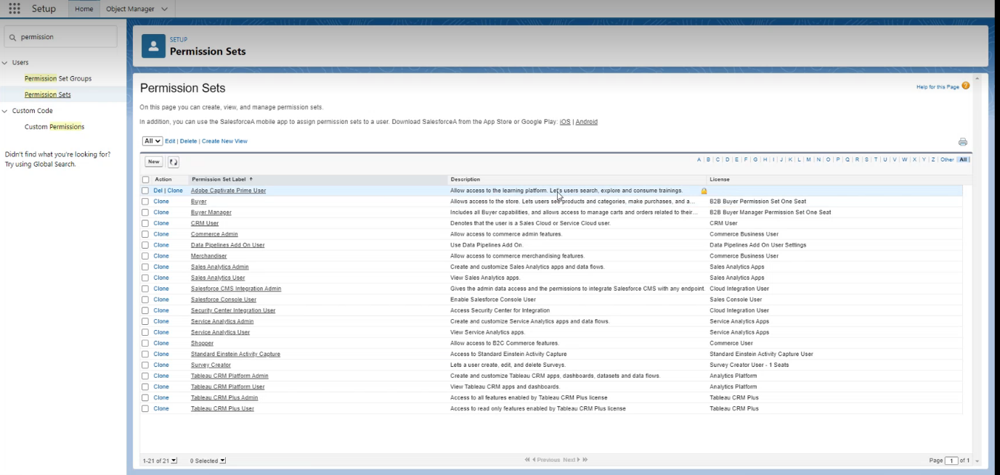
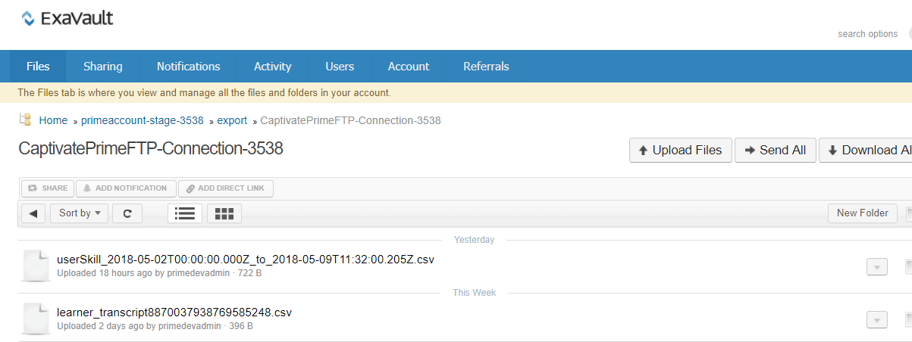
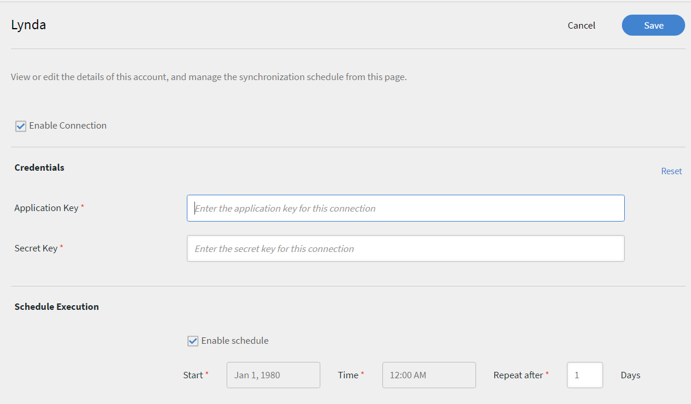
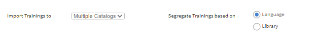
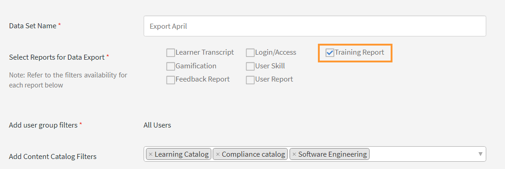
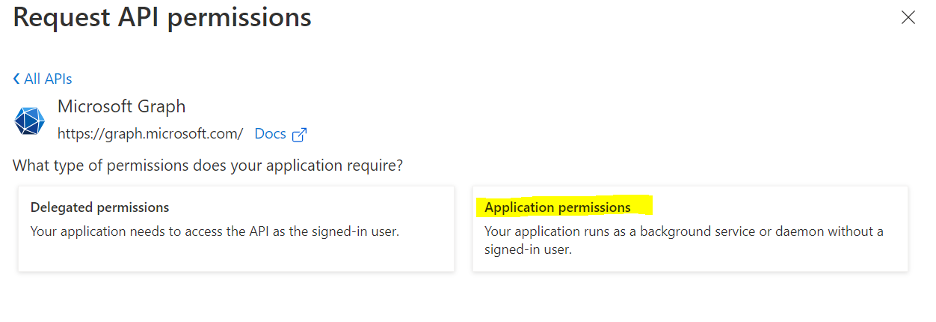

# Anslutningsprogram för Learning Manager

Företag har andra applikationer och system som måste integreras med Learning Manager. Anslutningsprogram är verktyg som hjälper till att utföra databaserade integreringar, till exempel att importera data till Learning Manager från externa system.  Den utför också export av data till externa system från Learning Manager.

Learning Manager tillhandahåller Salesforce- och FTP-anslutningar. Med hjälp av Salesforce-anslutningsprogram kan integrationsadministratörer i en organisation integrera sitt Salesforce-program med Learning Manager. Som integratör kan du också använda FTP-anslutningsappen för att automatiskt importera en uppsättning användare till ditt företagsprogram.

Learning Manager tillhandahåller även Lynda-, getAbstract- och Harvard Management System-anslutningarna. Dessa anslutningar gör det möjligt för elever att komma åt och konsumera kurser från Lynda.com, getAbstract och Harvard ManageMentor.

Läs vidare för att få veta hur du konfigurerar och använder var och en av dessa anslutningsappar i Learning Manager.

<!--
>[!NOTE]
>
>**Update:** December 2020 update of Learning Manager
>
>For **FTP**, **Box**, and **Custom FTP** connectors, while exporting Learner Transcript or xAPI, you can also export the data as a **zip** file, for:
>
>* Learner Transcripts
>* xAPI
-->

>[!NOTE]
>
>I och med november 2022-versionen av Adobe Learning Manager har Zoom fasat ut [JWT-autentisering från och med juni 2023](https://marketplace.zoom.us/docs/guides/auth/jwt/). Följaktligen kommer Zoom-anslutningen med JWT att fortsätta att fungera fram till det nämnda datumet, men vi rekommenderar användare att skapa Server-to-Server OAuth-appen för att ersätta funktionaliteten i sitt konto. Alla nya anslutningar kommer att ha Zoom OAuth-autentisering som standard.

## Salesforce-anslutning {#sfconnector}

Salesforce-anslutningsappen kopplar samman Learning Manager- och Salesforce-konton för att automatisera datasynkroniseringen. Funktionerna för Salesforce-anslutningsappen är följande:

### Kartans attribut

Integrationsadministratören kan välja Salesforce-kolumner och mappa dem till motsvarande Group Group attribut i Learning Manager. När mappningen är klar används samma mappning i efterföljande användarimporter. Den kan konfigureras om om administratören vill ha en annan mappning för import av användare.

### Automatiserad användarimport

Användarimportprocessen gör det möjligt för Learning Manager-administratören att hämta medarbetaruppgifter från Salesforce och importera dem till Learning Manager automatiskt. Den här automatiseringen undviker det manuella arbetet med att skapa CSV och ladda upp till Learning Manager.

### Automatisk tidtabell

Att använda funktionen för automatisk schemaläggning tillsammans med funktionen för automatisk användarimport kan vara effektivt. Learning Manager-administratören kan ställa in schemat enligt organisationens behov. Användare i Learning Manager-applikationen kan vara uppdaterade enligt schemat. Synkronisering kan utföras dagligen i Learning Manager-applikationen.

### Filtrera användare

Learning Manager-administratören kan tillämpa filtrering på användarna innan de importeras. Learning Manager-administratören kan till exempel välja att importera alla användare i hierarkin under en eller flera specifika chefer.

### Konfigurera Salesforce-anslutningsapp {#configuresalesforceconnector}

Lär dig processen för att integrera Salesforce med Learning Manager

#### Förutsättningar {#prerequisites}

Se till att du har webbadressen till din Salesforce-organisation med dig. Om ditt organisationsnamn till exempel är **myorg** kan Salesforce-URL:en vara `https://myorg.salesforce.com`. Det är den enda inmatningen som krävs för att koppla Salesforce-kontot till Learning Manager.

Se också till att du har rätt uppgifter för att logga in på kontot.

#### Skapa en anslutning {#createaconnection}

1. På startsidan för Learning Manager håller du muspekaren över Salesforce-kortet/miniatyren. En meny visas. Klicka på **[!UICONTROL Connect]** objekt i menyn.

   

   *Alternativ för anslutning*

1. En dialogruta visas där du uppmanas att ange org-url:en. Klicka efter **[!UICONTROL Connect]** att ha angett URL:en.
1. När anslutningen är klar visas översiktssidan.

### Kartans attribut {#mapattributes}

När anslutningen har upprättats kan du mappa Salesforce-kolumner till motsvarande attribut för Learning Manager. Det här steget är obligatoriskt.

1. På mappningssidan kan du till vänster se Learning Managers kolumner och till höger kan du se Salesforce-kolumnerna. Välj lämpligt kolumnnamn som mappas till Learning Managers kolumnnamn.

   
   *Kartans attribut*

   >[!NOTE]
   >
   >Kolumndata i Learning Manager som visas till vänster hämtas från de aktiva fälten. Fältet **chef** måste mappas till ett fält av typen e-postadress. Det är obligatoriskt att mappa alla kolumner innan anslutningsappen kan användas.

1. Klicka när **[!UICONTROL Save]** du har slutfört mappningen.
1. Kontakten är nu redo att användas. Det konto som har konfigurerats och visas som en datakälla i administratörsappen. Administratören kan schemalägga importen eller för synkronisering på begäran.

## Använda Salesforce-anslutningsappen {#usingsalesforceconnector}

Salesforce-anslutningsappen ansluter till Salesforce.com för att hämta användarna enligt konfigurationen och lägga till dem i Learning Manager.

### Importera användare från Salesforce-kontakter {#import-salesforce-contacts}

Learning Manager förbättrar Salesforce-kopplingen för att hämta kontakter och Salesforce-användare och importera dem till Learning Manager automatiskt.

På sidan Salesforce-anslutningsapp anger du Salesforce-URL:en och slutför autentiseringen. När du har autentiserat dig kan du fortsätta att importera användare eller kontakter. Om du väljer alternativet Kontakter anger du den delmängd av kontakter som ska importeras.

Välj Salesforce-kolumnerna och mappa dem till motsvarande Learning Manager grupperingsbara attribut. När mappningen är klar används samma mappning i efterföljande användarimporter.

1. Logga in på Salesforce.
1. På anslutningssidan klickar du på **[!UICONTROL Import Internal Users]**.

   
   *Importera interna användare*

1. **På sidan Importera användare** finns det ett nytt alternativ, Kontakter. Klicka på alternativknappen **Kontakter** så ser du följande alternativ.

   
   *Mappa kontaktattributen*

1. Om du klickar på **[!UICONTROL Yes]** kan du göra följande:

   * **Välj kolumnen Kontakter:** Välj det fält som du vill importera till Learning Manager.
   * **Ange värden:** Välj de värden som representerar det valda fältet.

   
   *Ange värdena*

   * Mappa Salesforce-kolumnerna med kolumnerna i Learning Manager.
   * Börja importera genom att klicka på **[!UICONTROL Save]**.

1. Om du klickar på **[!UICONTROL No. Import all Contacts]** kan du mappa fälten direkt utan att filtrera kontakterna. Här importerar du alla kontakter från Salesforce.
1. Börja importera genom att klicka på **[!UICONTROL Save]**.

## Exportera utbildningsposter

Learning Manager erbjuder en möjlighet att exportera utbildningsposter som utskrifter, användarrapporter och kunskapsrapporter till Salesforce. Du kan bestämma om exporterade data ska länkas till tabellen &quot;Användare&quot; eller tabellen &quot;Kontakter&quot; i Salesforce.

*Exportera utbildningsposter*

### Anpassade objekt i Salesforce

Innan du exporterar utbildningsposter från Learning Manager måste du skapa anpassade objekt i Salesforce. Anpassade objekt är objekt som du skapar för att lagra information som är specifik för ditt företag eller din bransch. Mer information finns i [Anpassade Salesforce-objekt](https://trailhead.salesforce.com/en/content/learn/modules/data_modeling/objects_intro).

Så här skapar du objekten:

1. Ladda ned och installera paketen för att skapa de anpassade objekten.

   * [Paketet 1](https://test.salesforce.com/packaging/installPackage.apexp?p0=04t1k0000008WPJ)
   * [Paketet 2](https://test.salesforce.com/packaging/installPackage.apexp?p0=04t1k0000008WPT)
   * [Paketet 3](https://test.salesforce.com/packaging/installPackage.apexp?p0=04t1k0000008WPi)

1. Byt namn på namnen på de anpassade objekten i Salesforce.
1. Markera händelserna och klicka på **[!UICONTROL Save]**.

>[!NOTE]
>
>Se till att systemadministratörsåtkomst har beviljats till alla aktiva fält som lagts till efter paketinstallationen.

**Länka händelser med:** Välj vilken sektion du vill exportera - Användare eller Kontakt. Om du väljer Kontaktobjekt kommer användare som finns i Learning Manager men inte i Salesforce att skapas i Salesforce.

*Alternativet Länka händelser*

>[!NOTE]
>
>Du kan skapa flera anslutningar i ett konto. En enda anslutning kan betjäna upp till tre anpassade objekt i Salesforce. Om du vill skapa flera anslutningar för samma Salesforce-konto måste du installera de tre paketen. Vi erbjuder support för upp till tre paket.
>
>Så många anslutningar som du vill skapa måste du installera så många paket.

>[!NOTE]
>
>På sidan Körningsstatus för Salesforce kan antalet bearbetade poster endast kontrolleras från Salesforce. Learning Manager visar statusen som slutförd även om det finns en partiell export eller ett fel i alla poster som har bearbetats.

## Installera Salesforce-paket

Learning Manager erbjuder ett Salesforce-apppaket. När de har installerats och konfigurerats i SFDC kan försäljningsanställda utföra sina utbildningsaktiviteter i SFDC-portalen. Den här appen gör det möjligt för SFDC-användare att utforska nya utbildningar, visa rekommendationer och konsumera dem direkt i SFDC-portalen. Användare får också meddelanden som skickas av administratörer i form av toppannonser direkt i appen i SFDC-portalen.

### Konfigurera i Learning Manager-appen

1. Logga in på ditt Learning Manager Admin-konto som Integration Admin.
1. Klicka på **[!UICONTROL Applications]** > **[!UICONTROL Featured Apps]**.
1. Klicka på **[!UICONTROL Salesforce]**.
1. På sidan Salesforce-appen noterar du program-ID:t (även kallat klient-ID) och klienthemligheten som nämns i beskrivningen.
1. Klicka på **[!UICONTROL Approve]** och din app måste godkännas.
1. Klicka på **[!UICONTROL Developer Resources]** > **[!UICONTROL Access Tokens for Testing and Development]**.
1. I avsnittet Hämta OAuth-kod måste klient-ID:t och omfånget anges till - admin:read,admin:write. Klicka på **[!UICONTROL Submit]**.
1. I Hämta uppdateringstoken anger du klient-ID och klienthemlighet. Klicka **[!UICONTROL Submit]** och anteckna uppdateringstoken.

### Skapa konto i Salesforce-appen

1. Skapa ett konto på registreringssidan för Salesforce. Du måste skapa ett Salesforce-konto i utvecklar- eller företagsutgåvan.  [Webbadress för](https://developer.salesforce.com/signup) registrering för utvecklare. Se till att du måste använda e-post-ID:t för att registrera dig för Salesforce som du använde för Learning Manager.
1. Verifiera ditt konto via verifieringsmailet.
1. Skapa ett lösenord och logga in på Salesforce.
1. Notera Salesforce-url:en efter inloggning (t.ex. site.lightning.force.com)

### Installera Learning Manager-paketet

Om du vill installera paketet måste du först ta bort det befintliga paketet i Salesforce. Innan du avinstallerar måste du aktivera inställningarna, som visas nedan. Det är obligatoriskt att använda dessa inställningar, annars kommer du inte att kunna installera paketet.

>[!NOTE]
>
>Adobe Learning Manager-appen stöds endast i Salesforce Lightning-vyn.

1. Starta url:en [för](https://login.salesforce.com/packaging/installPackage.apexp?p0=04t1k0000008WOQ) Learning Manager-paketet.
1. På inloggningssidan **** klickar du på **[!UICONTROL Use Custom Domain]**.
1. Ange paketets URL och klicka på **[!UICONTROL Continue]**. Installationssidan måste ha alternativet Installera endast för administratörer markerat. Ändra inte det här alternativet.
1. Klicka på **[!UICONTROL Install]**. När paketet är installerat klickar du på **[!UICONTROL Done]**. Du dirigeras till sidan Installerade paket och du kan se det installerade Adobe Learning Manager-paketet.
1. Gå till startprogrammet (bredvid Inställningar) och sök efter Adobe Learning Manager.
1. Konfigurera appen genom att klicka på **[!UICONTROL Configure]**.
1. Klicka **[!UICONTROL New]** och lägg till följande information:

   * **Config:** Ange ett namn som du väljer.
   * **ClientID:** Ange det värde som du fick från det första avsnittet.
   * **ClientSecret:** Ange det värde som du fick från det första avsnittet.
   * **RefreshToken:** Ange det värde som du fick från det första avsnittet.
   * **LearningManagerBaseURL:** URL:en till den webbplats där Learning Manager finns.

### Lägg till inställningar för fjärrplats

1. I det övre högra hörnet på sidan klickar du på **[!UICONTROL Setup]**.
1. I **[!UICONTROL Quick Find]** söker du efter Inställningar för fjärrplats.
1. Klicka på **[!UICONTROL New Remote Site]**.
1. Ange detaljerna:

   * **Namn på fjärrplats:** Ange ett namn som du väljer.
   * **URL för fjärrplats:** URL:en för den webbplats där Learning Manager finns.

1. Starta Learning Manager.

### Aktivera aviseringar för Learning Manager-appen

1. I det övre högra hörnet klickar du på **[!UICONTROL Setup]**.
1. Sök efter anpassade aviseringar.
1. Klicka på **[!UICONTROL New]**.
1. Ange följande information:

   1. **Namn på anpassad avisering:** LearningManagerNotification
   1. **API-namn:** LearningManagerNotification

1. Välj både **Dator** och **Mobil** som kanaler som stöds.

1. Klicka på **[!UICONTROL Save]**.
1. För att aktivera push-meddelanden för mobila enheter, följ stegen nedan:

   1. Installera Salesforce-mobilappen i din mobiltelefon.
   1. Logga in på appen med dina inloggningsuppgifter.
   1. Gå till **Inställningar** > **inställningar för** meddelandeleverans.
   1. Lägg till Salesforce för iOS och Android.

### Avinstallera Learning Manager från Salesforce

1. I Salesforce-appen går du till Installerade paket.
1. Klicka på **[!UICONTROL Uninstall]**.

## Konfigurera Learning Manager för Salesforce-användare

Learning Manager-appen är också tillgänglig för användare som finns i alla Salesforce-konton. Salesforce-administratören kan lägga till användare baserat på profilerna. Salesforce-profilerna liknar vad de är i Learning Manager. Till exempel Administratör, Integrationsadministratör, Instruktör och så vidare. Salesforce-administratören kan också skapa en anpassad profil.

Som Salesforce-administratör kan du antingen tilldela profilerna till användare eller skapa en anpassad profil.

När du installerar paketet kan du tilldela Salesforce-profilen till eleverna.

När du har installerat paketet måste du konfigurera profilen.

Klicka på **[!UICONTROL Configure]** > **[!UICONTROL New]** och lägg sedan till följande:

* Namn på konfiguration
* Klient-ID
* Klienthemlighet
* LearningManagerBaseURL (på engelska)
* Inaktivera omdirigering

>[!NOTE]
>
>För att elever ska kunna se Learning Manager-appen måste du aktivera appen för alla elever.

Nästa steg är att ge behörighet att komma åt Learning Manager-appen.

*Ange behörigheter för att komma åt Learning Manager-appen*

Välj användare och tilldela behörigheterna därefter. Eleverna kan nu komma åt appen Learning Manager.

Välj nu en profil, till exempel Standardprofil för en användare, och klicka på profilen. Klicka på **[!UICONTROL Edit]** och markera kryssrutan **Adobe Learning Manager** i **avsnittet Anpassade appinställningar**. Detta gör appen tillgänglig för användaren.

I avsnittet Inställningar för **anpassad flik** i **listrutan Startsida** väljer du alternativet **Standard på**.

Du måste göra appen synlig för alla profiler.

Klicka och **[!UICONTROL Save]** eleverna som tillhör alla profiler kommer åt Learning Manager-appen.

### Ändringar relaterade till Utbildningsväg

#### Befintliga anslutningar

Om alternativet Utbildningsväg är inaktiverat i administratörskontot läggs inga rader och kolumner till i rapporten.

Om alternativet Utbildningsväg är aktiverat i administratörskontot fylls kolumnen &quot;Typ&quot; i med Utbildningsväg om elever är inskrivna i den.

>[!NOTE]
>
>Om flaggan är aktiverad och du använder en befintlig anslutning kan några poster missas.

#### Nya anslutningar

Om alternativet Utbildningsväg är inaktiverat i administratörskontot kommer utbildningsrapporten att bestå av följande kolumner, men kommer inte att innehålla några data.

* **Inbäddad sökväg:** Visar namnet på utbildningsprogrammet
* **ID för inbäddad sökväg:** Visar ID:n för utbildningsprogrammet.
* **Inbäddat kurs-ID:** Visar ID:n för kurser som finns i en utbildningsväg.

För nya anslutningar i konton där Utbildningsväg är aktiverat visas de tre nya kolumnerna och alla data flödar.

Dessutom kommer rapporten att innehålla kolumntypen Utbildningsväg (högre nivå) för alla elever som är inskrivna i en utbildningsväg.

I kolumnen Typ kommer utbildningsprogrammet att döpas om till Utbildningsväg. För befintliga anslutningar kommer det inte att ske någon ändring.

## FTP-anslutning för Learning Manager {#ftpconnector}

Med hjälp av FTP-anslutningen kan du integrera Learning Manager med godtyckliga externa system för att automatisera datasynkronisering. Det förväntas att externa system kan exportera data i CSV-format och placera dem i lämplig mapp i Learning Manager FTP-kontot. Funktionerna för FTP-anslutningsappen är följande:

Du kan också använda Box-anslutningsappen för datamigrering, användarimport och dataexport. Mer information finns i Box-koppling.

### Import av data {#dataimport}

Användarimportprocessen gör det möjligt för Learning Manager-administratören att hämta information om anställda från FTP-tjänsten för Learning Manager och importera dem till Learning Manager automatiskt. Med den här funktionen kan du integrera flera system genom att placera CSV-filen som genereras av dessa system i lämpliga mappar för FTP-kontona. Learning Manager hämtar CSV-filerna, sammanfogar dem och importerar data enligt schemat. Se Schemaläggningsfunktionen för mer information.

**Kartans attribut**

Integrationsadministratören kan välja kolumnerna i CSV och mappa dem till Learning Managers grupperingsbara attribut. Den här kartläggningen är en engångsinsats. När mappningen är klar används samma mappning i efterföljande användarimporter. Mappningen kan konfigureras om om administratören vill ha en annan mappning för import av användare.

#### Exportera data {#exportdata}

Dataexporten gör det möjligt för användare att exportera användarkunskaper och elevutskrifter till en FTP-plats för att integrera med alla tredjepartssystem.

#### Schemaläggning {#scheduling}

Administratören kan ställa in schemaläggningsuppgifter enligt organisationens krav och användare i Learning Manager-applikationen är uppdaterade enligt schemat. På samma sätt kan integrationsadministratören schemalägga kunskapsexport i tid så att den integreras med ett externt system. Synkronisering kan utföras dagligen i Learning Manager-applikationen.

### Konfigurera FTP-anslutningsappen för Learning Manager {#configurecaptivateprimeftpconnector}

Lär dig processen för att integrera FTP-anslutningsappen med Learning Manager.

#### Skapa en anslutning {#Createaconnection-1}

1. På startsidan för Learning Manager håller du muspekaren över FTP-kortet/miniatyrbilden. En meny visas. Klicka på **[!UICONTROL Connect]** objekt i menyn.

   

   *Alternativ för anslutning*

1. En dialogruta visas där du uppmanas att ange e-post-ID. Ange e-post-ID för den person som ansvarar för att hantera Learning Manager FTP-kontot för organisationen. Klicka **[!UICONTROL Connect]** efter att du har angett e-post-ID.
1. Learning Manager skickar ett e-postmeddelande till dig och ber användaren att återställa lösenordet innan han eller hon får åtkomst till FTP:en för första gången. Användaren måste återställa lösenordet och använda det för att komma åt Learning Manager FTP-kontot.

   >[!NOTE]
   >
   >Det går bara att skapa ett FTP-konto för Learning Manager för ett visst Learning Manager-konto.

   På översiktssidan kan du ange anslutningsnamnet för integreringen. Välj vilken åtgärd du vill vidta bland följande alternativ:

   * Importera interna användare
   * Importera xAPI
   * Exportera användarkunskaper - Konfigurera ett schema
   * Exportera användarkompetens - OnDemand
   * Exportera elevavskrifter - Konfigurera ett schema
   * Exportera elevavskrifter - OnDemand

   
   *Alternativ för export*

### Import

+++Intern användare

Med alternativet Importera intern användare kan du importera användare från en csv till en Learning Manager på begäran eller schemaläggning.

+++

+++Kartattribut

När anslutningen har upprättats kan du mappa kolumnerna i CSV-filer. Den placeras i FTP-mappen till motsvarande attribut i Learning Manager. Det här steget är obligatoriskt.

1. På sidan Kartattribut kan du till vänster se Learning Managers förväntade kolumner och till höger kan du se CSV-kolumnnamnen. Till en början, på höger sida, kan du se en tom valruta. Importera en CSV-mall genom att klicka på **Välj fil**.
1. Ovanstående steg fyller i listrutan till höger med alla CSV-kolumnnamn. Välj lämpligt kolumnnamn som mappas till Learning Managers kolumnnamn.

   >[!NOTE]
   >
   >Fältet Chef måste mappas till ett fält av typen e-postadress. Det är obligatoriskt att mappa alla kolumner innan anslutningsappen kan användas.

1. Klicka när **[!UICONTROL Save]** du har slutfört mappningen.

   Kontakten är nu redo att användas. Det konfigurerade kontot visas som en datakälla i administratörsappen så att administratören kan schemalägga importen eller synkronisera på begäran.

+++

+++Använda Learning Manager FTP-kontakten

1. CSV-filerna från externa system måste placeras på följande sökväg:

   `code $OPERATION$/$OBJECT_TYPE$/$SUB_OBJECT_TYPE$/data.csv`

   >[!NOTE]
   >
   >I versionen från juli 2016 tillåts endast import av användare. Om du vill använda FTP-anslutningsappen måste du därför se till att CSV-filerna placeras i följande mapp:

   `code Home/import/user/internal/*.csv`

1. FTP-anslutningsappen tar alla rader från CSV-filer. Det är viktigt att raden som motsvarar en användare i en CSV-fil inte visas i några andra CSV-filer.
1. Alla CSV:er måste innehålla de kolumner som anges i mappningen.
1. Alla nödvändiga CSV:er måste finnas i mappen innan processen påbörjas.

>[!NOTE]
>
>När administratören importerar användare till Learning Manager måste han eller hon också veta hur användarna hanteras i Learning Manager. Mer information finns i hjälpen](migration-manual.md#usermanagement) för [användarhantering.

+++

+++Importera xAPI

Med importalternativen för xAPI kan du schemalägga importen av xAPI-satser från tredjepartstjänster till Learning Manager på begäran.

+++

+++Konfigurationer som krävs för att importera xAPI

1. På konfigurationssidan väljer du en befintlig konfiguration som är tillgänglig i konfigurationslistan för att importera xAPI-satser från CSV-filen. Klicka på redigera eller **lägg till en ny konfigurationslänk** för att gå till sidan Konfigurera importkällor.

   **Konfiguration**

   * På sidan Konfigurera importkällor fyller du i de två fälten, d.v.s. Namn och Källfilnamn. Källfilens namn ska matcha det filnamn som anges på FTP-mappens plats.
   * Klicka **[!UICONTROL Save]** för att spara ändringarna.

   
   *Konfigurera*

   **Filter**

   * I den vänstra rutan klickar du på **[!UICONTROL Filter]**.
   * På sidan Konfigurera Import-Filter fyller du i fälten Namn och Villkor för att filtrera ut posterna. Klicka **[!UICONTROL Add new Filter]** för att lägga till ytterligare ett filter. Du kan spara eller ta bort ett filter genom att klicka på **alternativet Spara** eller **Ta bort** under kolumnen Åtgärder.

   
   *Filter*

   **Kartläggning**

   * I den vänstra rutan klickar du på **[!UICONTROL Mapping]**.
   * På sidan Import xAPI Statements-Configuration-Mapping kan du till vänster se sökvägsnamnen för xAPI JSON-fältet som måste mappas med CSV-kolumnnamnen.
   * Som standard är **de tre JSON-sökvägsfältnamnen som måste mappas med CSV-kolumnnamnen actor.mbox**, **verb.id** och **object.id**. Du kan lägga till andra fält i mappningen genom att klicka på **Lägg till en ny mappning**.

   * Välj den typ av kolumnnamn som du mappar med Json-fältets sökvägsnamn (oavsett om det är sträng, nummer, boolesk eller datumtyp).
   * Klicka på Spara när du har slutfört mappningen. xAPI-importen kan nu importeras enligt schema eller på begäran.

   
   *Kartläggning*

1. I den vänstra rutan klickar du på **[!UICONTROL Configure Schedule]**. Klicka **[!UICONTROL Enable Schedule]** här om du vill schemalägga importen av xAPI-satser.

   Du kan ange starttid och startdatum och sedan ange frekvensen för ditt xAPI-importschema i dagar. Du kan till exempel aktivera xAPI-import var 3:e dag.

   
   *Importera xAPI-satser - Konfigurera schema*

1. I den vänstra rutan klickar du på **[!UICONTROL On Demand Execution]**.

   
   *Importera xAPI-uttalanden – på begäran*

1. I den vänstra rutan klickar du **[!UICONTROL Execution Status]** för att visa sammanfattningen av alla körningar för den här anslutningsappen i kronologisk ordning. Du kan se startdatum och varaktighet för den tid det tar att importera xAPI, typen av import (om den är på begäran eller schemalagd) och status för importen (om xAPI-importen pågår eller har slutförts eller har misslyckats).

   
   *Importera xAPI-satser – Körningsstatus*

+++

### Exportera

+++Färdigheter

Det finns två alternativ för att exportera rapporter om användarkunskaper.

**[!UICONTROL User Skills - On Demand]**: Du kan ange startdatum och exportera rapporten med hjälp av alternativet. Rapporten extraheras från det angivna datumet till nutid.

*Exportalternativ på begäran*

**[!UICONTROL User Skills - Configure]**: Med det här alternativet kan du schemalägga extraheringen av rapporten. Markera kryssrutan Aktivera schema och ange startdatum och starttid. Du kan också ange med vilket intervall du vill att rapporten ska genereras och skickas.

*Konfigurera export av rapport*

+++

Om du vill öppna exportmappen där de exporterade filerna är placerade öppnar du länken till FTP-mappen som finns på sidan Användarkunskaper enligt nedan.

*FTP-mapp för att visa filer*

De automatiskt exporterade filerna finns på platsen **Hem/export/&#42;FTP_location&#42;**

De automatiskt exporterade filerna är tillgängliga med titeln **skill_achievements_&#42;datera från &#42;_till_&#42;den till&#42;.csv**

*Exporterad .csv fil*

+++Transkribering av elever

**Konfigurera**: Med det här alternativet kan du schemalägga extraheringen av rapporten. Markera kryssrutan Aktivera schema och ange startdatum och starttid. Du kan också ange med vilket intervall du vill att rapporten ska genereras och skickas.

+++

För att öppna exportmappen där de exporterade filerna placeras på din FTP-plats, öppna länken till FTP-mappen som finns på sidan Learner Transcript som visas nedan

De automatiskt exporterade filerna finns på platsen **Hem/export/&#42;FTP_location&#42;**

De automatiskt exporterade filerna är tillgängliga med titeln **learner_transcript_&#42;datera från &#42;_till_&#42;den till&#42;.csv**

### Stöd för manuella csv-fält {#supportformanualcsvfields}

När du importerar användardata via FTP måste en administratör mappa alla aktiva fält som finns i systemet till motsvarande fält i csv-filen.

Detta är obligatoriskt för alla aktiva csv-fält. För manuellt aktiva fält kan integrationsadministratören välja alternativet **DontImportFromSource**.

Om du väljer det här alternativet fylls inte de manuella aktiva fältvärdena i med csv-import. De värderingar som eleven tillhandahåller förblir intakta.

>[!NOTE]
>
>Om alternativet **DontImportFromSource** väljs för aktivt csv-fält under mappningen tas det här fältet bort från systemet.

*FTP-anslutning för aktiva fält*

## Lynda-kontakt {#lyndaconnector}

Lynda-kontakten används av företagskunder hos Lynda.com som vill att deras elever ska upptäcka och använda Lynda-kurser inifrån Learning Manager. Connectorn kan konfigureras för att hämta kurser från Lynda.com med jämna mellanrum med din API-nyckel. När en kurs har skapats i Learning Manager kan användare söka efter dem och använda dem. Elevernas framsteg kan sedan spåras i Learning Manager.

### Konfigurera Lynda-anslutningsappen {#configurethelyndaconnector}

1. Från den integrerade admin-instrumentpanelen klickar du på Lynda.

   Du ser panelen med tre alternativ: Komma igång, Anslut och Hantera anslutningar.

1. Om du konfigurerar Lynda-anslutningsappen för första gången klickar du på Anslut.

   <!--Configure the Exavault FTP account before you configure this connector.-->

1. På anslutningssidan anger du ett namn för anslutningsappen. Ange Appkey och Secret key för din anslutning.

   >[!NOTE]
   >
   >Kontakta din leverantör för att få Appkey och den hemliga nyckeln.

1. Klicka på Spara.

   Konfigurationen sparas och Lynda-anslutningen för ditt konto läggs till. Du kan nu klicka på Hantera anslutningar på startsidan och redigera din konfiguration när som helst.

1. Om du redan har upprättat en anslutning klickar du på Hantera anslutningar för att visa alla dina anslutningar.

   >[!NOTE]
   >
   >Migreringsfunktionen måste vara aktiverad för ditt konto innan du konfigurerar den här anslutningsappen.

1. Klicka på den anslutning som du vill redigera.
1. I den vänstra rutan klickar du på **[!UICONTROL Configure]**. Gör något av följande:

   * Visa eller redigera information om ditt konto och synkroniseringsschemat från det här fönstret. Markera kryssrutan Aktivera anslutning om du vill aktivera det här kontot.
   * Klicka på Redigera och redigera dina inloggningsuppgifter. Om du vill ångra uppdateringarna av det här fältet klickar du på Återställ
   * Klicka på Aktivera schema för att schemalägga synkroniseringen. Du kan ange starttid och startdatum och sedan ange frekvensen för synkroniseringsschemat i dagar. Du kan till exempel aktivera synkronisering var tredje dag.

   Klicka **[!UICONTROL Save]** för att spara ändringarna.

   

   *Konfigurera Lynda-anslutningsappen för Learning Manager*

1. I den vänstra rutan klickar du på Körning på begäran. Med det här alternativet kan du importera användarfeeds och andra relevanta data från Lynda. Ange startdatumet för körningen på begäran och klicka på Kör för att köra synkroniseringen. Alla data från startdatumet tills nutid importeras.

   * Du kan klicka på Inaktivera åtkomst till Learning Manager under körning där programmet har ett driftstopp under synkroniseringen.
   * Om du klickar på Aktivera åtkomst till Learning Manager under körningen uppstår inga avbrott i tjänsten under synkroniseringen.

   

   *Utföra körning på begäran för Lynda-anslutningsappen*

1. Du kan också klicka på Körningsstatus i den vänstra rutan när som helst för att visa sammanfattningen av alla körningar för den här anslutningsappen i kronologisk ordning. Du kan visa startdatum och varaktighet för synkroniseringen, typen av synkronisering (om det är synkronisering på begäran) och status för synkroniseringen (om synkroniseringen pågår eller är klar).

   >[!NOTE]
   >
   >När du tar bort och återskapar en anslutning visas de tidigare körningarna för anslutningsappen igen. Du kan visa alla körningar innan du tog bort anslutningen.

   Du kan bara utföra en omkörning för den senaste synkroniseringen.

   

   *Visa sammanfattningen av alla körningar och klicka på Körningsstatus*

## getAbstract-koppling {#getabstractconnector}

Anslutningsappen getAbstract används av företagskunder hos getAbstract.com, som vill att deras elever ska upptäcka och använda getAbstract-sammanfattningar. Anslutningsappen kan konfigureras för att hämta användningsdata med jämna mellanrum, baserat på vilka uppgifter om slutförande av elever som skapas i Learning Manager. Läs vidare för att få veta hur du konfigurerar den här anslutningsappen i Learning Manager.

### Konfigurera anslutningsappen getAbstract {#configurethegetabstractconnector}

1. Från den integrerade admin-instrumentpanelen klickar du på getAbstract.

   På panelen visas tre alternativ: Komma igång, Anslut och Hantera anslutningar.

1. Om du konfigurerar kopplingen getAbstract för första gången klickar du på Anslut.

   <!--Configure the Exavault FTP account before you configure this connector.

   Ensure that you share this FTP credentials with your content provider to access the feeds.-->

1. Ange ett namn för anslutningen i fältet Anslutningsnamn.

   Ange lämpliga nycklar i fälten Klient-ID och Klienthemlighet. Kontakta leverantören för att få rätt nycklar för den här anslutningsappen.

   Nycklarna krävs för att hämta kursens metadata för de kurser som konsumeras av klienten.

1. Om du redan har upprättat en anslutning klickar du på getAbstract > Manage Connections på startsidan för att visa och redigera din befintliga konfiguration.

   >[!NOTE]
   >
   >Migreringsfunktionen måste vara aktiverad för ditt konto innan du konfigurerar den här anslutningsappen.

1. Klicka på den anslutning vars konfiguration du vill visa eller redigera.

   

   *Konfigurera getAbstract-anslutningsappen för Learning Manager*

1. I den vänstra rutan klickar du på Konfigurera. Gör något av följande:

   * Visa eller redigera information om ditt konto och synkroniseringsschemat från det här fönstret. Markera kryssrutan Aktivera anslutning om du vill aktivera det här kontot.
   * Klicka på Redigera och redigera dina inloggningsuppgifter. Om du vill ångra uppdateringarna av det här fältet klickar du på Återställ
   * Klicka på Aktivera schema för att schemalägga synkroniseringen. Du kan ange starttid och startdatum och sedan ange frekvensen för synkroniseringsschemat i dagar. Du kan till exempel aktivera synkronisering var tredje dag.

1. Klicka på **[!UICONTROL Save]**.

   Konfigurationen sparas och getAbstract-anslutningen för ditt konto läggs till.

1. I den vänstra rutan klickar du på Körning på begäran. Med det här alternativet kan du importera användarflöden och annan relevant data från getAbstract. Ange startdatumet för körningen på begäran och klicka på Kör för att köra synkroniseringen. Alla data från startdatumet tills nutid importeras.

   * Du kan klicka på Inaktivera åtkomst till Learning Manager under körning där programmet har ett driftstopp under synkroniseringen.
   * Om du klickar på Aktivera åtkomst till Learning Manager under körningen uppstår inga avbrott i tjänsten under synkroniseringen.

1. Du kan också klicka på Körningsstatus i den vänstra rutan när som helst för att visa sammanfattningen av alla körningar för den här anslutningsappen i kronologisk ordning. Du kan visa startdatum och varaktighet för synkroniseringen, typen av synkronisering (om det är synkronisering på begäran) och status för synkroniseringen (om synkroniseringen pågår eller är klar).

   >[!NOTE]
   >
   >När du tar bort och återskapar en anslutning visas de tidigare körningarna för anslutningsappen igen. Du kan visa alla körningar innan du tog bort anslutningen.

   Du kan bara utföra en omkörning för den senaste synkroniseringen.

   För att alla typer av synkronisering ska fungera måste du se till att användarflödet finns i FTP-mappen getAbstract för de datum som anges i synkroniseringen.

   Se följande excel-ark, som är ett exempel på en användarflödesfil från getAbstract. Filnamnet måste ha formatet: **report_export_yyyy_MM_dd_HHmmss.xlsx** eller **report_export_yyyy_MM_dd.xlsx**.
   [getAbstract exempel på användarflöde excel-ark](assets/report-export-20170401175342.xlsx)

## Anslutning till Harvard ManageMentor {#hmmconnector}

Harvard ManageMentor-kontakten används av företagskunder till Harvard ManageMentor, som vill att deras elever ska upptäcka och konsumera Harvard ManageMentor-kurser. Kopplingen hjälper till att skapa kurser i Learning Manager och kan konfigureras för att hämta förloppsdata för elever med jämna mellanrum. Utför följande procedur för att konfigurera den här anslutningsappen:

### Konfigurera Harvard ManagerMentor-anslutningsappen {#configuretheharvardmanagermentorconnector}

1. Från den integrerade admin-instrumentpanelen klickar du på Harvard ManageMentor.

   På panelen visas tre alternativ: Komma igång, Anslut och Hantera anslutningar.

1. Om du konfigurerar Harvard ManageMentor-anslutningsappen för första gången klickar du på Anslut.

   <!--Configure the Exavault FTP account before you configure this connector.

   Ensure that you share this FTP credentials with your content provider to access the feeds.-->

1. I fältet Anslutningsnamn anger du ett namn för anslutningen. Klicka på Anslut för att spara anslutningen.
1. Om du redan har upprättat en anslutning går du till startsidan och klickar på Harvard ManageMentor > Manage Connections (Hantera anslutningar). Klicka på den anslutning som du vill redigera din befintliga konfiguration med.

   >[!NOTE]
   >
   >Migreringsfunktionen måste vara aktiverad för ditt konto innan du konfigurerar den här anslutningsappen.

   

   *Konfigurera HarvardManage Mentor-kontakten för Learning Manager*

1. I den vänstra rutan klickar du på Konfigurera. Gör något av följande:

   * Visa eller redigera information om ditt konto och synkroniseringsschemat från det här fönstret. Markera kryssrutan Aktivera anslutning om du vill aktivera det här kontot.
   * Klicka på Aktivera schema för att schemalägga synkroniseringen. Du kan ange starttid och startdatum och sedan ange frekvensen för synkroniseringsschemat i dagar. Du kan till exempel aktivera synkronisering var tredje dag.

1. I den vänstra rutan klickar du på Körning på begäran. Med det här alternativet kan du importera användarflöden och annan relevant data från Harvard ManageMentor. Ange startdatumet för körningen på begäran och klicka på Kör för att köra synkroniseringen. Alla data från startdatumet tills dess att de finns importeras för den här anslutningen.

   * Du kan klicka på Inaktivera åtkomst till Learning Manager under körning där programmet har ett driftstopp under synkroniseringen.
   * Om du klickar på Aktivera åtkomst till Learning Manager under körningen uppstår inga avbrott i tjänsten under synkroniseringen.

   Om du vill automatisera synkroniseringen med några dagars mellanrum anger du antalet dagar i fältet Upprepa antal dagar. Synkronisering säkerställer att ditt konto är uppdaterat med den senaste versionen av abstrakt och sammanfattningar från Harvard ManageMentor.

1. Du kan också klicka på Körningsstatus i den vänstra rutan när som helst för att visa sammanfattningen av alla körningar för den här anslutningsappen i kronologisk ordning. Du kan visa startdatum och varaktighet för synkroniseringen, typen av synkronisering (om det är synkronisering på begäran) och status för synkroniseringen (om synkroniseringen pågår eller är klar).

   >[!NOTE]
   >
   >När du tar bort och återskapar en anslutning visas de tidigare körningarna för anslutningsappen igen. Du kan visa alla körningar innan du tog bort anslutningen.

   Du kan bara utföra en omkörning för den senaste synkroniseringen.

   För att synkroniseringen ska lyckas måste du se till att minst en av följande filer finns i FTP-mappen för Harvard ManageMentor:

   hmm12_metadata.xlsx: Den här filen innehåller kursens metadata för Harvard ManageMentor-kopplingen. Se till att du följer namngivningskonventionen när du laddar upp filen.

   client_hmm12_20150125.xlsx: Det är användarflödet för Harvard ManageMentor-anslutningsappen. Namngivningskonventionen för filer som följer är **client_hmm12_yyyyMMdd.xlsx.**

   Se följande två exempel på användarflöde och kursflödesfiler för den här kopplingen:

   * [Metadatafil för kurser för Harvard ManageMentor-kopplingen](assets/hmm12-metadata.xlsx)
   * [Användarfeed för Harvard ManageMentor-anslutningsappen](assets/client-hmm12-20170304.xlsx)

## Workday-anslutning {#workdayconnector}

Med hjälp av Workday-anslutningsappen kan du integrera Learning Manager med Workday-klientorganisationen för att automatisera datasynkroniseringen.

### Import

#### Kartans attribut

Integrationsadministratören kan välja Workday-kolumner och mappa dem till motsvarande Learning Manager gruppbara attribut. När mappningen är klar används samma mappning i efterföljande användarimporter. Den kan konfigureras om om administratören vill ha en annan mappning för import av användare.

#### Automatiserad användarimport

Användarimportprocessen gör det möjligt för Learning Manager-administratören att hämta medarbetaruppgifter från Workday och importera dem till Learning Manager automatiskt.

#### Filtrera användare

Learning Manager-administratören kan tillämpa filtrering på användarna innan de importeras. Learning Manager-administratören kan till exempel välja att importera alla användare i hierarkin under en eller flera specifika chefer.

### Exportera

Exporten av användarkunskaper gör det möjligt för användare att exportera användarkunskaper till Workday automatiskt.

>[!NOTE]
>
>Färdigheter från flera Learning Manager-konton kan inte exporteras samtidigt med samma Workday-konto.

#### Punkter att notera

* Se till att UUID, e-postadress och namn på den anställde är unika i flera Workday-integrationer. Felaktiga värden leder till ett anslutningsfel.
* UUID-fältet som har fyllts i via Workday på kan inte tas bort av någon klient som är riktad mot LMS-administratören. Om du vill ändra värdet kan du kontakta Adobe Learning Manager för introduktions- eller supportteamet.
* Alternativet Användarrensning kanske inte heller fungerar eftersom Användarrensning endast stöder 50 användare som ska rensas per körning. Var ytterst försiktig när du laddar upp användarna via UUID:erna.

### Schemaläggning {#Scheduling-1}

Administratören kan ställa in schemaläggningsuppgifter enligt organisationens krav och användare i Learning Manager-applikationen är uppdaterade enligt schemat. På samma sätt kan integrationsadministratören schemalägga kunskapsexport i tid så att den integreras med ett externt system. Synkronisering kan utföras dagligen i Learning Manager-applikationen.

### Konfigurera Workday-anslutningsappen {#configureworkdayconnector}

>[!PREREQUISITES]
>
>Be Workday-administratören i din organisation att skapa en ISU (Integration System User) med de behörigheter som definieras i ISU_Permissions-dokumentet. Ladda ner en kopia från länken nedan.

[Ladda ned en kopia av ISU-säkerheten (Integration System User).](assets/isu-permissions-v1.pdf) Lär dig processen för att integrera Workday-kontakten med Learning Manager.

1. På startsidan för Learning Manager håller du muspekaren över Workday-panelen. En meny visas. Klicka på **[!UICONTROL Connect]** objekt i menyn.

   

   *Sida vid sida för Workday*

1. En dialogruta visas där du uppmanas att ange autentiseringsuppgifterna för den nya anslutningen. Innan du upprättar anslutningen anger du följande fält.

   * Anslutningsnamn: Ange ett anslutningsnamn enligt dina önskemål.
   * Värd-URL: Integreringsadministratören kan hämta information om värd-URL:en från motsvarande Workday-administratör.
   * Klientorganisation: Klientorganisationen är intern för ditt företag. Din Workday-administratör ger dig information om klientorganisationen.
   * Användarnamn och lösenord: Workday-administratören skapar en integrerad systemanvändare (ISU) med de säkerhetsprivilegier som krävs och delar den med integrationsadministratören.

>[!NOTE]
>
>   Learning Manager använder version 40.1 av Workday API.

*Konfigurera Workday-anslutningsappen*

1. Klicka på Anslut efter att ha angett information i alla relevanta fält.

   >[!NOTE]
   >
   >Du kan också ha flera Workday-anslutningar synkroniserade med ditt Learning Manager-konto.

På översiktssidan kan du ange anslutningsnamnet för integreringen. Välj vilken åtgärd du vill vidta bland följande alternativ:

* Importera interna användare
* Exportera användarkunskaper - Konfigurera ett schema
* Exportera användarkompetens - OnDemand

*Översikt över Workday*

### Import

#### Karta Attribut {#MapAttributes-1}

Du kan använda Workday-anslutningsappen för att integrera Learning Manager och Workday för att automatisera datasynkroniseringen. Du kan importera alla aktiva användare från Workday till Learning Manager. Användare kan importeras från olika datakällor, inklusive FTP och Salesforce.

Innan du importerar användare måste användarattributen från Learning Manager och Workday mappas. På sidan Översikt använder du alternativet Interna användare under Importera för att ange kartattributen.

Ange inloggningsuppgifterna för Adobe Learning Manager under kolumnen Adobe Learning Manager. Använd listrutorna för att välja rätt autentiseringsuppgifter för kolumnerna under Workday.

>[!NOTE]
>
>För närvarande stöder Learning Manager import av 69 användarattribut från Workday. Lägg till fler attribut med hjälp av de aktiva fälten i Learning Manager.

*Kartans attribut*

**Markera kryssrutan Exkludera tillfälliga arbetare** för att förhindra att tillfälligt anställda som är tillgängliga under en chef importeras.

Workday har fyra nivåer av hierarki medan Learning Manager har två nivåer. De fyra nivåerna i Workday är kompetensprofilkategori, färdighetsprofil, färdighetsartikelkategori och färdighetsobjekt. Ditt kunskapsnamn och nivå från Learning Manager mappas tillsammans i Workday under kunskapsobjektet.

>[!NOTE]
>
>Du kan lägga till ytterligare Workday-attribut. Kontakta din CSAM för att få attributen tillagda.

+++Lista över Workday-attribut som stöds

wd:User_ID
wd:Worker_ID
föreståndare
wd:Personal_Data.wd:Name_Data.wd:Preferred_Name_Data.wd:Name_Detail_Data.@wd:Formatted_Name
wd:Personal_Data.wd:Name_Data.wd:Legal_Name_Data.wd:Name_Detail_Data.@wd:Formatted_Name
wd:Personal_Data.wd:Name_Data.wd:Legal_Name_Data.wd:Name_Detail_Data.wd:Prefix_Data.wd:Title_Descriptor
wd:Personal_Data.wd:Name_Data.wd:Preferred_Name_Data.wd:Name_Detail_Data.wd:Prefix_Data.wd:Title_Descriptor
wd:Personal_Data.wd:Name_Data.wd:Preferred_Name_Data.wd:Name_Detail_Data.wd:First_Name
wd:Personal_Data.wd:Name_Data.wd:Preferred_Name_Data.wd:Name_Detail_Data.wd:Last_Name
wd:Personal_Data.wd:Name_Data.wd:Legal_Name_Data.wd:Name_Detail_Data.wd:First_Name
wd:Personal_Data.wd:Name_Data.wd:Legal_Name_Data.wd:Name_Detail_Data.wd:Last_Name
wd:Personal_Data.wd:Contact_Data.wd:Address_Data.0.@wd:Formatted_Address
wd:Personal_Data.wd:Contact_Data.wd:Address_Data.0.wd:Postal_Code
wd:Personal_Data.wd:Contact_Data.wd:Email_Address_Data.0.wd:Email_Address
wd:Personal_Data.wd:Contact_Data.wd:Address_Data.0.wd:Country_Region_Descriptor
wd:Personal_Data.wd:Contact_Data.wd:Phone_Data.0.@wd:Formatted_Phone
wd:Personal_Data.wd:Contact_Data.wd:Phone_Data.0.wd:Country_ISO_Code
wd:Personal_Data.wd:Contact_Data.wd:Phone_Data.0.wd:International_Phone_Code
wd:Personal_Data.wd:Contact_Data.wd:Phone_Data.0.wd:Phone_Number
wd:Personal_Data.wd:Primary_Nationality_Reference.wd:ID.1.$
wd:Personal_Data.wd:Gender_Reference.wd:ID.1.$
wd:Personal_Data.wd:Identification_Data.wd:National_ID.0.wd:National_ID_Data.wd:ID
wd:Personal_Data.wd:Identification_Data.wd:Custom_ID.0.wd:Custom_ID_Data.wd:ID
wd:User_Account_Data.wd:Default_Display_Language_Reference.wd:ID.1.$
wd:Role_Data.wd:Organization_Role_Data.wd:Organization_Role.0.wd:Organization_Role_Reference.wd:ID.1.$
wd:Employment_Data.wd:Worker_Job_Data.0.wd:Position_Data.wd:Position_Title
wd:Employment_Data.wd:Worker_Job_Data.0.wd:Position_Data.wd:Business_Title
wd:Employment_Data.wd:Worker_Job_Data.0.wd:Position_Data.wd:Business_Site_Summary_Data.wd:Namn
wd:Employment_Data.wd:Worker_Job_Data.0.wd:Position_Data.wd:Business_Site_Summary_Data.wd:Address_Data.@wd:Formatted_Address
wd:Employment_Data.wd:Worker_Job_Data.0.wd:Position_Data.wd:Job_Classification_Summary_Data.0.wd:Job_Classification_Reference.wd:ID.1.$
wd:Employment_Data.wd:Worker_Job_Data.0.wd:Position_Data.wd:Job_Classification_Summary_Data.0.wd:Job_Group_Reference.wd:ID.1.$
wd:Employment_Data.wd:Worker_Job_Data.0.wd:Position_Data.wd:Work_Space__Reference.wd:ID.1.$
wd:Employment_Data.wd:Worker_Job_Data.0.wd:Position_Data.wd:Job_Profile_Summary_Data.wd:Job_Family_Reference.0.wd:ID.1.$
wd:Employment_Data.wd:Worker_Job_Data.0.wd:Position_Data.wd:Job_Profile_Summary_Data.wd:Job_Profile_Name
wd:Employment_Data.wd:Worker_Job_Data.0.wd:Position_Data.wd:Job_Profile_Summary_Data.wd:Job_Profile_Reference.wd:ID.1.$
wd:Employment_Data.wd:Worker_Job_Data.0.wd:Position_Data.wd:Business_Site_Summary_Data.wd:Address_Data.0.wd:Country_Reference.wd:ID.2.$
wd:Employment_Data.wd:Worker_Job_Data.0.wd:Position_Data.wd:Worker_Type_Reference.wd:ID.1.$
wd:Employment_Data.wd:Worker_Job_Data.0.wd:Position_Data.wd:Business_Site_Summary_Data.wd:Address_Data.0.@wd:Formatted_Address
wd:Employment_Data.wd:Worker_Job_Data.0.wd:Position_Data.wd:Job_Profile_Summary_Data.wd:Management_Level_Reference.wd:ID.1.$
wd:Employment_Data.wd:Worker_Status_Data.wd:Aktiv
wd:Employment_Data.wd:Worker_Status_Data.wd:Active_Status_Date
wd:Employment_Data.wd:Worker_Status_Data.wd:Hire_Date
wd:Employment_Data.wd:Worker_Status_Data.wd:Original_Hire_Date
wd:Employment_Data.wd:Worker_Status_Data.wd:Pensionerad
wd:Employment_Data.wd:Worker_Status_Data.wd:Retirement_Date
wd:Employment_Data.wd:Worker_Status_Data.wd:Avslutad
wd:Employment_Data.wd:Worker_Status_Data.wd:Termination_Date
wd:Employment_Data.wd:Worker_Status_Data.wd:Termination_Last_Day_of_Work
wd:Organization_Data.wd:Worker_Organization_Data.0.wd:Organization_Data.wd:Organization_Code
wd:Organization_Data.wd:Worker_Organization_Data.0.wd:Organization_Data.wd:Organization_Name
wd:Organization_Data.wd:Worker_Organization_Data.0.wd:Organization_Data.wd:Organization_Type_Reference.wd:ID.1.$
wd:Organization_Data.wd:Worker_Organization_Data.0.wd:Organization_Data.wd:Organization_Subtype_Reference.wd:ID.1.$
wd:Qualification_Data.wd:Utbildning.0.wd:School_Name
wd:Qualification_Data.wd:External_Job_History.0.wd:Job_History_Data.wd:Job_Title
wd:Qualification_Data.wd:External_Job_History.0.wd:Job_History_Data.wd:Företag
wd:Management_Chain_Data.wd:Worker_Supervisory_Management_Chain_Data.wd:Management_Chain_Data.0.wd:Manager.Employee_ID
E-post för huvudsakligt arbete
wd:Organization_Type_Reference_Cost_Center_ID
wd:Organization_Type_Reference_Cost_Center_Name
wd:Organization_Type_Reference_Company
wd:Organization_Subtype_Reference_Department
wd:Organization_Subtype_Reference_Division
wd:Universal_ID
wd:Integration_Field_Override_Data.3.wd:Värde
wd:Employment_Data.wd:Worker_Job_Data.0.wd:Position_Data.wd:Business_Site_Summary_Data.wd:Address_Data.0.wd:Country_Region_Descriptor
wd:Employment_Data.wd:Worker_Job_Data.0.wd:Position_Data.wd:Business_Site_Summary_Data.wd:Address_Data.0.wd:Country_Region_Reference.wd:ID.2.$
wd:Personal_Data.wd:Contact_Data.wd:Address_Data.0.wd:Kommun

+++

### Exportera

Du kan exportera alla färdigheter som en användare har uppnått från Learning Manager till Workday. Endast alla aktiva användarkunskaper exporteras och Learning Manager exporterar inte tillbakadragna färdigheter. Du kan även ansluta flera Learning Manager\
konton till samma Workday-anslutningsapp. Om kunskapsnamnen är desamma i två Learning Manager-konton mappas de till samma färdighet i Workday. Innan du uppdaterar färdigheten i Workday, om två Learning Manager-konton använder samma Workday-konto, rekommenderar vi att du uppdaterar kunskapsnamnen i alla Learning Manager-konton.

+++Användarfärdigheter - Konfigurera

Med det här alternativet kan du schemalägga extraheringen av rapporten. Se till att kryssrutan Aktivera export av användarkunskaper med den här anslutningen är markerad. Markera kryssrutan Aktivera schema och ange startdatum och starttid. Du kan också ange med vilket intervall du vill att rapporten ska genereras och skickas. Markera kryssrutan Aktivera schema och ange Startdatum, Tid och Upprepa efter n antal dagar. När du är klar klickar du på Spara.

*Konfigurera rapporten för användarkunskaper*

+++

+++Användarfärdigheter - På begäran

Du kan ange startdatum och exportera rapporten med hjälp av alternativet. Rapporten extraheras från det angivna datumet till nutid. Ange det datum från vilket du vill börja generera rapporten och klicka på Kör.

*Rapport om användarfärdigheter på begäran*

+++

+++Användarfärdigheter - Status för utförande

Här kan du se sammanfattningen av alla uppgifter och få deras statusrapport. Du kan ladda ned felrapporter genom att klicka på länken till felrapporten.

*Rapport om körning av användarfärdigheter*

+++

## miniOrange-kontakt {#miniorangeconnector}

Med hjälp av miniOrange-anslutningen kan du integrera Learning Manager med miniOrange-klientorganisationen för att automatisera datasynkroniseringen.

### Import

#### Kartans attribut

Integrationsadministratören kan välja miniOrange-attribut och mappa dem till motsvarande gruppbara attribut i Learning Manager. När mappningen är klar används samma mappning i efterföljande användarimporter. Den kan konfigureras om om administratören vill ha en annan mappning för import av användare.

#### Automatiserad användarimport

Användarimportprocessen gör det möjligt för Learning Manager-administratören att hämta medarbetaruppgifter från miniOrange och importera dem till Learning Manager automatiskt.

#### Filtrera användare

Learning Manager-administratören kan tillämpa filtrering på användarna innan de importeras. Learning Manager-administratören kan till exempel välja att importera alla användare i hierarkin under en eller flera specifika chefer.

Om du vill konfigurera miniOrange-kontakten kontaktar du Learning Manager CSM-teamet.

### Konfigurera miniOrange-kontakt {#configureminiorangeconnector}

1. På startsidan för Learning Manager håller du muspekaren över mini-orange-kortet/miniatyrbilden. En meny visas. Klicka på  **[!UICONTROL Connect]** alternativ i menyn.

   

   *miniOrange anslutningsplatta*

1. Klicka **[!UICONTROL Connect]** för att upprätta en ny anslutning. Sidan miniOrange connector visas. Ange uppgifterna för ditt konto som du vill mappa.

   

   *Skapa en anslutning*

1. Om du vill importera miniOrange-användare direkt som en intern Learning Manager-användare, använd alternativet **[!UICONTROL Import Internal Users]** .

   

   *Importera interna användare*

1. På mappningssidan kan du till vänster se Learning Managers kolumner och på höger sida kan du se miniOrnage-kolumnerna. Välj lämpligt kolumnnamn som mappas till Learning Managers kolumnnamn.

   

   *Kartans attribut*

1. Om du vill visa och redigera datakällan klickar du som administratör på **[!UICONTROL Settings > Data Source]**.

   Den etablerade miniOrange-källan skulle listas. Om du vill redigera filtret klickar du på **[!UICONTROL Edit]**.

   

   *Visa och redigera en datakälla*

1. Du får ett meddelande när importen är klar. Om du vill visa eller redigera importloggen klickar du på **[!UICONTROL Users > Import log.]**

<!-- #### Delete a connection {#deleteaconnection}

To delete an established  miniOrange  connection, follow these steps. -->

## Zooma anslutning {#zoom-connector}

Du kan integrera Learning Manager med Zoom-anslutningar och använda dem för att vara värd för klasser.  Anslutningen gör att du kan ställa in videokonferensmöten/klasser med eleverna.

Följ dessa steg för att konfigurera och använda anslutningsappen.

1. På startsidan för Learning Manager håller du muspekaren över Zoom-miniatyren. En meny visas. Klicka på  **[!UICONTROL Connect]** alternativ på menyn.

   <!-- 

   *Zoom connector tile* -->

1. Sidan Zooma anslutningsappen öppnas. Ange detaljerna för ditt konto i respektive fält för att integrera och synkronisera användarflödet. Du kan få information från administratören för ditt anslutningskonto.

   <!-- 
   *Connect to BlueJeans/ Zoom* -->

   >[!NOTE]
   >
   >När du som elev aktiverar anslutningsappen använder du samma e-post-ID som används för ditt Learning Manager-konto för att aktivera användarfeeds tillbaka till Learning Manager.

1. När kopplingen är upprättad skapar du som författare en VC-kurs med Zoom som konferenssystem.

   <!-- 
   
   *Create a VC course* -->

1. Administratörer, chefer och elever kan anmäla elever till den skapade kursen. Vid inskrivningen får eleven ett e-postmeddelande. Eleven kan logga in på sitt Learning Manager-konto för att se programinformationen och gå kursen.
1. När kursen är klar skickas färdigställanderapporten till Learning Manager. Administratören kan se slutföranderapporten för att kontrollera elevernas närvaro och poäng.

   
   *Närvaro- och poängsättningsrapport*

### Skapa en zoom server-till-server OAuth-app

När du skapar en Zoom Server-to-Server OAuth-app som ska användas i Adobe Learning Manager måste du lägga till omfattningar som krävs av Adobe Learning Manager när du skapar anslutningen.

Adobe Learning Manager kräver omfattningarna nedan och omfattningarna måste väljas i OAuth-appen.

* Visa alla användarmöten `/meeting:read:admin`
* Visa och hantera alla användarmöten `/meeting:write:admin`
* Visa rapportdata `/report:read:admin`
* Visa all användarinformation `/user:read:admin`
* Visa användarnas information och hantera användare `/user:write:admin`

## Box-anslutning {#boxconnector}

Med hjälp av Box-kontakten kan du integrera Learning Manager med godtyckliga externa system för att automatisera datasynkronisering. Det förväntas att externa system kan exportera data i CSV-format och placera dem i lämplig mapp i Learning Manager Box-kontot. Funktionerna för Box-anslutningsappen är följande:

Du kan också använda FTP-anslutningsappen för datamigrering, användarimport och dataexport. Mer information finns i [Learning Manager FTP-anslutningsapp.](connectors.md#main-pars_header_1427405935)

### Data Import {#DataImport-1}

Användarimportprocessen gör det möjligt för Learning Manager-administratören att hämta information om anställda från Learning Manager Box-tjänsten och importera dem till Learning Manager automatiskt. Med den här funktionen kan du integrera flera system genom att placera CSV-filen som genereras av dessa system i lämpliga mappar i Box-kontona. Learning Manager hämtar CSV-filerna, sammanfogar dem och importerar data enligt schemat. Se Schemaläggningsfunktionen för mer information.

**Kartans attribut**

Integrationsadministratören kan välja kolumnerna i CSV och mappa dem till Learning Managers grupperingsbara attribut. Den här kartläggningen är en engångsinsats. När mappningen är klar används samma mappning i efterföljande användarimporter. Mappningen kan konfigureras om om administratören vill ha en annan mappning för import av användare.

## Data Export {#dataexport}

Dataexporten gör det möjligt för användare att exportera användarkunskaper och elevutskrifter till en Box-plats för att integrera med vilket tredjepartssystem som helst.

## Schemalägg rapporter {#schedulereports}

Administratören kan ställa in schemaläggningsuppgifter enligt organisationens krav och användare i Learning Manager-applikationen är uppdaterade enligt schemat. På samma sätt kan integrationsadministratören schemalägga kunskapsexport i tid så att den integreras med ett externt system. Synkronisering kan utföras dagligen i Learning Manager-applikationen.

## Konfigurera Box-anslutning {#configureboxconnector}

Lär dig processen för att integrera Box Connector med Learning Manager.

1. På startsidan för Learning Manager håller du muspekaren över Box-kortet/miniatyrbilden. En meny visas. Klicka på Anslut objekt i menyn.

   

   *Anslut till Box*

1. En dialogruta visas där du uppmanas att ange e-post-ID. Ange e-post-ID för den person som ansvarar för att hantera Learning Manager Box-kontot för organisationen. Klicka på Anslut när du har angett e-post-ID:t.
1. Learning Manager skickar ett e-postmeddelande till dig och ber användaren att återställa lösenordet innan han eller hon öppnar Box för första gången. Användaren måste återställa lösenordet och använda det för att komma åt Learning Manager Box-kontot.

   >[!NOTE]
   >
   >Det går bara att skapa ett Box -konto för Learning Manager för ett visst Learning Manager-konto.

   På översiktssidan kan du ange anslutningsnamnet för integreringen. Välj vilken åtgärd du vill vidta bland följande alternativ:

   * Importera interna användare
   * Importera xAPI-aktivitetsrapporter
   * Exportera användarkunskaper - Konfigurera ett schema
   * Exportera användarkompetens - OnDemand
   * Exportera avskrift av elever - Konfigurera ett schema
   * Exportera avskrift av elever – OnDemand

## Import

+++Intern användare

Med alternativet för import av intern användare kan du schemalägga genereringen av användarimportrapporten automatiskt. De genererade rapporterna skickas till dig som . CSV-filer.

+++

+++Kartattribut

När en anslutning har upprättats kan du mappa kolumnerna med CSV-filer som placeras i Box-mappen till motsvarande attribut för Learning Manager. Det här steget är obligatoriskt.

1. På sidan Kartattribut kan du till vänster se Learning Managers förväntade kolumner och till höger kan du se CSV-kolumnnamnen. Till en början, på höger sida, kan du se en tom valruta. Importera en CSV-mall genom att klicka på Välj fil.
1. Ovanstående steg fyller i listrutan till höger med alla CSV-kolumnnamn. Välj lämpligt kolumnnamn som mappas till Learning Managers kolumnnamn.

   *Fältet Chef måste mappas till ett fält av typen e-postadress. Det är obligatoriskt att mappa alla kolumner innan anslutningsappen kan användas.*

1. Klicka på Spara när du har slutfört mappningen.

   Kontakten är nu redo att användas. Det konfigurerade kontot visas som en datakälla i administratörsappen så att administratören kan schemalägga importen eller synkronisera på begäran.

+++

+++xAPI-aktivitetsrapport

Med alternativet xAPI Report Activity kan du generera import av xAPI-satser från tredjepartstjänster. Filerna sparas som . CSV-filer och konverteras sedan till xAPI-satser vid import till Learning Manager.

+++

+++Konfigurationer som krävs för att importera xAPI

1. På konfigurationssidan väljer du en befintlig konfiguration som är tillgänglig i konfigurationslistan för att importera xAPI-satser från CSV-filen. Klicka på redigera eller Lägg **till en ny konfigurationslänk** för att navigera till sidan Import xAPI Statements-Configuration-Source File (Importera xAPI-uttalanden-konfiguration-källfil).

   

   *Redigera eller lägga till en ny konfiguration*

   **Konfiguration**

   * På sidan Konfigurera importkällor fyller du i de två fälten, d.v.s. Namn och Källfilnamn. Källfilens namn ska matcha det filnamn som anges på FTP-mappens plats.
   * Klicka **[!UICONTROL Save]** för att spara ändringarna.

   

   *Konfigurera*

   **Filter**

   * I den vänstra rutan klickar du på Filter
   * På sidan Konfigurera Import-Filter fyller du i fältet Namn och villkor för att filtrera ut posterna. Klicka på Lägg till nytt filter för att lägga till ytterligare ett filter. Du kan spara eller ta bort ett filter genom att klicka på alternativet Spara eller ta bort i kolumnen Åtgärder.

   

   *Filter*

   **Kartläggning**

   * I den vänstra rutan klickar du på Mappning.
   * På sidan Konfigurera importmappning kan du till vänster se sökvägsnamnen för xAPI Json-fältet som måste mappas med CSV-kolumnnamnen.
   * Som standard är **de tre Json-sökvägsfältnamnen som måste mappas med CSV-kolumnnamnen actor.mbox**, **verb.id** och **object.id**. Du kan lägga till andra fält i mappningen genom att klicka på Lägg till ny mappning.
   * Välj den typ av kolumnnamn som du mappar med Json-fältets sökvägsnamn (oavsett om det är sträng, nummer, boolesk eller datumtyp).
   * Klicka på Spara när du har slutfört mappningen. xAPI-importen kan nu importeras enligt schema eller på begäran.

   
   *Kartläggning*

1. I den vänstra rutan klickar du på **[!UICONTROL Configure Schedule]**. Klicka på Aktivera schema för att schemalägga importen av xAPI-satser. Du kan ange starttid och startdatum och sedan ange frekvensen för ditt xAPI-importschema i dagar. Du kan till exempel aktivera xAPI-import var 3:e dag.

   
   *Importera xAPI-satser - Konfigurera schema*

1. I den vänstra rutan klickar du på **[!UICONTROL On Demand Execution]**.

   
   *Importera xAPI-satser – på begäran*

1. I den vänstra rutan klickar du **[!UICONTROL Execution Status]** för att visa sammanfattningen av alla körningar för den här anslutningsappen i kronologisk ordning. Du kan se startdatum och varaktighet för den tid det tar att importera xAPI, typen av import (om den är på begäran eller schemalagd) och status för importen (om xAPI-importen pågår eller har slutförts eller har misslyckats).

   
   *Importera xAPI-satser – Körningsstatus*

+++

+++Använda Learning Manager Box-kontakten

1. CSV-filerna från externa system måste placeras på följande sökväg:

   `code $OPERATION$/$OBJECT_TYPE$/$SUB_OBJECT_TYPE$/data.csv`

   >[!NOTE]
   >
   >I versionen från juli 2016 tillåts endast import av användare. Om du vill använda Box-anslutningsappen måste du därför se till att CSV-filerna placeras i följande mapp:

   `code Home/import/user/internal/*.csv`

1. Box-anslutningsappen tar alla rader från CSV-filer. Det är viktigt att raden som motsvarar en användare i en CSV-fil inte visas i några andra CSV-filer.
1. Alla CSV:er måste innehålla de kolumner som anges i mappningen.
1. Alla nödvändiga CSV:er måste finnas i mappen innan processen påbörjas.

När administratören importerar användare till Learning Manager måste han eller hon också veta hur användare hanteras i Learning Manager. Mer information finns i hjälpen](migration-manual.md#usermanagement) för [användarhantering.

+++

## Exportera

+++Färdigheter

Det finns två alternativ för att exportera rapporter om användarkunskaper.

Användarfärdigheter - På begäran: Du kan ange startdatum och exportera rapporten med hjälp av alternativet. Rapporten extraheras från det angivna datumet till nutid

**[!UICONTROL User Skills - Configure]**: Med det här alternativet kan du schemalägga extraheringen av rapporten. Markera kryssrutan Aktivera schema och ange startdatum och starttid. Du kan också ange med vilket intervall du vill att rapporten ska genereras och skickas.

+++

Om du vill öppna exportmappen där de exporterade filerna placeras på din Box-plats öppnar du länken till Box-mappen som finns på sidan Användarkunskaper enligt nedan.

De automatiskt exporterade filerna finns på platsen **Hem/export/&#42;Box_location&#42;**

De automatiskt exporterade filerna är tillgängliga med titeln **skill_achievements_&#42;datera från &#42;_till_&#42;den till&#42;.csv**

>[!NOTE]
>
>Kunden hanterar åtkomstbehörigheterna och innehållet i Box-mappen som delas av Learning Manager-teamet.  Innehållet i mappen skulle också lagras fysiskt i Frankfurt-regionen.

### Stöd för manuella csv-fält {#Supportformanualcsvfields-1}

När du importerar användardata via Box måste en administratör mappa alla aktiva fält som finns i systemet till motsvarande fält i csv.

Detta är obligatoriskt för alla aktiva csv-fält. För manuellt aktiva fält kan integrationsadministratören välja alternativet **DontImportFromSource**.

Om du väljer det här alternativet fylls inte de manuella aktiva fältvärdena i med csv-import. De värderingar som eleven tillhandahåller förblir intakta.

>[!NOTE]
>
>Om alternativet **DontImportFromSource** väljs för aktivt csv-fält under mappningen tas det här fältet bort från systemet.

*Box-koppling för aktiva fält*

>[!NOTE]
>
>Alla anslutningsappar eller migreringar som använder FTP/Box som datakälla tas bort alla csv-filer som bearbetas.
>
>CSV-filen för innehållsanslutningarna, till exempel LinkedIn, tas bort efter sju dagar, medan CSV-filen för importanvändare tas bort omedelbart.

## Anslutningsprogram för LinkedIn-utbildning {#linkedinlearningconnector}

LinkedIn Learning-anslutningsappen används av företagskunder till LinkedIn.com som vill att deras elever ska upptäcka och använda kurser inifrån Learning Manager. Connectorn kan konfigureras för att hämta kurser med jämna mellanrum med din API-nyckel. När en kurs har skapats i Learning Manager kan användare söka efter dem och använda dem. Elevernas framsteg kan sedan spåras i Learning Manager.

>[!NOTE]
>
>Du får unika LO-ID:n för alla kurser som importerats från LinkedIn Learning-kopplingen till Adobe Learning Manager.

>[!NOTE]
>
>Den inlärningstid som spenderas i LinkedIn Learning-kurser kommuniceras av LinkedIn-innehållet/LinkedIn-plattformen till Learning Manager-lärplattformen. Om LinkedIn learning inte skickar inlärningstiden kan den inte registreras av vår lärplattform. I sådana fall är den inlärningstid som visas av Learning Manager noll.

### Konfigurera inställningar i Linkedln Learning-portalen {#configuresettingsinlinkedlnlearningportal}

1. Logga in på Linkedln Learning LMS som administratör.
1. Klicka på **[!UICONTROL admin]** i den övre navigeringspanelen.
1. Klicka på **[!UICONTROL settings]** fliken i nästa fönster.
1. Välj **[!UICONTROL Playback Integration]** i den vänstra navigeringspanelen och klicka sedan på **fliken Integration** .
1. Klicka **[!UICONTROL LMS Content Launch Settings]** för att expandera dess inställningar.
1. Lägg till följande tre värdnamn: **learningmanager.adobe.com**, **learningmanagerlrs.adobe.com****cpcontents.adobe.com**
1. Välj **[!UICONTROL Enable AICC Integration]**.

   

   *Konfiguration av LinkedIn-utbildning*

### Konfigurera LinkedIn Learning-anslutningsprogram {#configurelinkedinlearningconnector}

1. På instrumentpanelen för integrationsadministratören klickar du på [!UICONTROL LinkedIn Learning]. Alternativen Komma igång, Anslut och Hantera anslutningar visas.
1. Om du konfigurerar LinkedIn Learning-anslutningsappen för första gången klickar du på [!UICONTROL Connect].

   <!--Configure the Exavault FTP account before you configure this connector.

   
   *Configure connection*-->

1. På anslutningssidan anger du ett namn för anslutningsappen. Ange Appkey och Secret key för din anslutning.

   >[!NOTE]
   >
   >Företagsadministratören kan generera ett nytt program från LinkedIn Learning Admin-portalen för att hämta Appkey och den hemliga nyckeln.

1. Klicka på **[!UICONTROL Save]**.

   Konfigurationen sparas och LinkedIn Learning-anslutningen för ditt konto läggs till. Du kan nu klicka **[!UICONTROL Manage Connections]** på startsidan och redigera din konfiguration när som helst.

1. Om du redan har upprättat en anslutning klickar du på **[!UICONTROL Manage Connections]** Visa alla anslutningar.

   >[!NOTE]
   >
   >Migreringsfunktionen måste vara aktiverad för ditt konto innan du konfigurerar den här anslutningsappen.

1. Klicka på den anslutning som du vill redigera.
1. I den vänstra rutan klickar du på Konfigurera. Gör något av följande:

   * Visa eller redigera information om ditt konto och synkroniseringsschemat från det här fönstret. Markera kryssrutan om du vill aktivera det **[!UICONTROL Enable Connection]** här kontot.
   * Klicka på **[!UICONTROL Edit]** och redigera dina inloggningsuppgifter. Om du vill ångra uppdateringarna av det här fältet klickar du på Återställ.
   * Klicka **[!UICONTROL Enable Schedule]** här om du vill schemalägga synkroniseringen. Du kan ange starttid och startdatum och sedan ange frekvensen för synkroniseringsschemat i dagar. Du kan till exempel aktivera synkronisering var tredje dag.

   Klicka **[!UICONTROL Save]** för att spara ändringarna.

1. I den vänstra rutan klickar du på **[!UICONTROL On-Demand Execution]**. Med det här alternativet kan du importera användarflöden och annan relevant data från LinkedIn. Ange startdatumet för körningen på begäran och klicka på Kör för att köra synkroniseringen. Alla data från startdatumet tills nutid importeras.

   * Du kan klicka på **[!UICONTROL Disable access]** Learning Manager under körningen där programmet har ett driftstopp under synkroniseringen.
   * Om du klickar på **[!UICONTROL Enable access]** Learning Manager under körningen uppstår inga avbrott i tjänsten under synkroniseringen.

   

   *Utförande av rapport på begäran*

1. Du kan också klicka på Körningsstatus i den vänstra rutan när som helst för att visa sammanfattningen av alla körningar för den här anslutningsappen i kronologisk ordning. Du kan visa startdatum och varaktighet för synkroniseringen, typen av synkronisering (om det är synkronisering på begäran) och status för synkroniseringen (om synkroniseringen pågår eller är klar).

   

   *Status för rapportkörning*

   >[!NOTE]
   >
   >När du tar bort och återskapar en anslutning visas de tidigare körningarna för anslutningsappen igen. Du kan visa alla körningar innan du tog bort anslutningen.

   Du kan bara utföra en omkörning för den senaste synkroniseringen.

### Filtrera LinkedIn Utbildningsinnehåll {#filter-linkedin}

Det finns filter i LinkedIn-anslutningsappar för att separera innehåll baserat på LinkedIn Learning Libraries. Dessutom kan du också filtrera innehåll baserat på språk och bibliotek och endast importera kurserna på obligatoriska språk. När innehållet har importerats delas det upp i flera kataloger baserat på importkonfigurationen.

Följande är filtren:

**Filtrera utbildning med:** Filtrerar en delmängd av kurser från LinkedIn till Learning Manager.

* **Baserat på språk**

*Filtrera efter språk*

* **Baserat på bibliotek från LinkedIn Learning**

*Filtrera efter katalog*

**Importera utbildningar till**

*Importera utbildning till kataloger*

**Importera taggar**

Det finns en taggtyp - Anpassad tagg **, som du kan använda för att lägga till anpassade taggar till dina LinkedIn Learning-kurser**. Du kan lägga till så många taggar du vill, avgränsade med kommatecken.

*Lägga till anpassade taggar*

Innehållet sparas först efter migreringen. Innehållet kommer att sparas i respektive kataloger.

## Power BI-anslutningsapp {#powerbiconnector}

>[!NOTE]
>
>Learning Manager stöder integrering med endast kommersiell licens för Microsoft Power BI. Den integreras inte med Microsoft Power BI i Government Cloud.

Du kan använda integrering med den här anslutningsappen för att dra nytta av dina befintliga Power BI-konton för att analysera och visualisera inlärningsdata från Learning Manager i Power BI. Under konfigurationen kan integrationsadministratören konfigurera sin Power BI-arbetsyta så att den fylls i inkrementellt med två livedatauppsättningar – deltagaravskrift och användarkunskapsrapporter. Du kan sedan använda alla funktioner och kraften i PowerBI för att utveckla, distribuera och distribuera anpassade instrumentpaneler som de vill i sina organisationer.

### Konfigurera anslutningsappen {#configuringtheconnector}

Om du vill konfigurera kopplingen **[!UICONTROL Connectors]** håller du muspekaren över **[!UICONTROL Power BI]** panelen på sidan och klickar på **[!UICONTROL Connect]**. Power BI-sidan öppnas. Om du vill upprätta en anslutning anger du appklient-ID, appklienthemlighet, klientnamn och arbetsyte-ID (valfritt). Följ dessa steg för att hämta dessa autentiseringsuppgifter.

*Konfigurera Power BI-anslutningsappen*

1. Starta <https://app.powerbi.com/embedsetup>.
1. Klicka och **[!UICONTROL Embed for your organization]** logga in på ditt Microsoft-konto.
1. Ange namnet på appen.
1. I avsnittet Apptyp väljer du alternativet Webbapp på serversidan.
1. I avsnittet **[!UICONTROL Redirect URL]** väljer du alternativet Använd en anpassad URL **(Välj det här alternativet** om du känner till målprogrammets URL). Ange följande URL:

   `https://learningmanager.adobe.com/ctr/app/azure/_callback` (uppdatera domänen baserat på miljön)

1. I fältet Hem-URL anger du följande URL, `https://learningmanager.adobe.com/`
1. I avsnittet behörigheter väljer du **Läs all datauppsättning** och **Läs och skriv all datauppsättning**.

   Skaffa klientorganisation: Kontakta din Power BI-administratör för att ange klientorganisationens namn.

   Hämta arbetsplats-ID: Det går endast att skapa en arbetsplats för Power BI Pro-användare. Du kan skapa en arbetsplats i Power BI och hämta ID:t från URL:en.

1. Klicka på **[!UICONTROL Register app]** och lagra klient-ID:t och klienthemligheten.

>[!NOTE]
>
>Om du vill auktorisera anslutningen igen måste du skapa en annan Power App och ange den omdöpta omdirigerings-URL:en.

Du kan exportera Learner Transcripts, User Skills och xAPI Activity Report med samma metod. Välj Elevutskrifter/Användarfärdigheter från den vänstra panelen. Sidan Exportera öppnas.

Aktivera **[!UICONTROL Enable User-Skill/ Learner Transcript export using this connection check box]**. Spara ändringarna.

**Exportera konfigurera**: Om du vill schemalägga extraheringen av rapporten. **[!UICONTROL Enable Schedule]** Markera kryssrutan och ange startdatum och starttid. Du kan också ange med vilket intervall du vill att rapporten ska genereras och skickas.

*Exportera konfigurera för att schemalägga rapporten*

**Exportera på begäran:** Du kan ange startdatum och exportera rapporten med hjälp av alternativet . Rapporten extraheras från det angivna datumet till nutid.

*Exportera på begäran*

Exporterade data kan visas genom att logga in på ditt Power BI-konto. Exporterade data visas under alternativet för datauppsättningar.

### Exportera xAPI-aktivitetsrapporter i Learning Manager {#exportxapiactivityreportsincaptivateprime}

På sidan PowerBI-xAPI-funktioner klickar du på **[!UICONTROL Export xAPI Activity Report]**.

*PowerBI – Exportera xAPI-aktivitetsrapport*

I den vänstra rutan väljer du **Konfiguration** och följer stegen nedan:

* Fyll i fältet JSON-sökväg som matchar kolumnnamnet och strängtypen.
* Om du vill lägga till fler JSON-sökvägar klickar du på **[!UICONTROL Add]**.
* Du kan redigera posterna i JSON-sökvägsfälten genom att klicka på **[!UICONTROL Edit]**.
* Klicka **[!UICONTROL Save]** för att spara ändringarna.

**Konfigurera schema**

I den vänstra rutan klickar du på **[!UICONTROL Configure Schedule]** och gör följande:

* Klicka på Aktivera export av xAPI-satser med den här anslutningen.
* **[!UICONTROL Enable Schedule]** Klicka på kryssrutan och ange startdatum och starttid. Du kan också ange det intervall av dagar då du vill att exporten ska upprepas och skickas.
* Klicka på knappen för **[!UICONTROL Save]** att spara konfigurera schemainställningar.

*Konfigurera schema för xAPI-export*

**På begäran**

I den vänstra rutan klickar du på **[!UICONTROL On Demand]** och anger startdatumet på sidan Exportera xAPi-satser på begäran.

*xAPI-export på begäran*

Alla exporterade data hamnar i en datauppsättning som skapas av Adobe i ditt Power BI-konto.

xAPI-export till Power BI misslyckas om några av xAPI-uttrycken i LRS inte har en json-sökväg som är konfigurerad för export. För xAPI-instruktioner, där json-sökvägen inte är tillgänglig, ska N/A-konstantvärdet läggas till och visas i Power BI.

**Status för utförande**

Välj **Körningsstatus** för att visa sammanfattningen av alla uppgifter i kronologisk ordning. Varningsskylten indikerar fel under körningen. Du kan ladda ner felrapporter som **CSV** genom att klicka på länken till felrapporten.

*Status för xAPI-exportkörning*

### Enhetliga rapporter {#unified-reports}

Learning Manager är ett sätt att skapa export med en kombination av rapporter som användardata, Learner Transcript, Gamification, Feedback-rapporter med mera, som en datauppsättning till Power BI.

Detta gör det möjligt för Power BI-användare att sammanfoga data från flera rapporter för att presentera mycket kraftfulla analyser och visualiseringar i Power BI.

*Enhetliga Power BI-rapporter*

**Export på begäran**

Ange startdatum och slutdatum och exportera rapporten med hjälp av alternativet. Rapporten extraheras för det angivna datumintervallet.

*Export på begäran*

**Schemalagd export**

Om du vill schemalägga extraheringen av rapporten. **Markera kryssrutan Aktivera schema** och ange startdatum och starttid. Du kan också ange med vilket intervall du vill att rapporten ska genereras och skickas.

*Konfigurera schema*

Du kan också exportera träningsrapporter till Power BI.

Utbildningsrapporter kan exporteras till Power BI som en del av funktionen för enhetliga rapporter.

Träningsrapporten har ytterligare två fält:

* Antal användare som har delat feedback på en kurs
* Genomsnittligt stjärnbetyg för en kurs

### Filterstatus för elevutskrifter {#lt-status}

I avsnittet Enhetliga rapporter i en Power BI-anslutning finns det ett alternativ för att exportera Learner Transcripts baserat på statusen för Learning Objects.

* **Välj alla:** Exportera alla poster eller aktiviteter på modulnivå i det angivna datumintervallet.
* **Slutförd:** Exportera alla poster som har slutförts inom datumintervallet.
* **Pågår:** Exportera alla poster som har statusen Pågående.
* **Inte startad:** Uteslut de poster som är registrerade i det angivna datumintervallet, men som inte har startats när rapporten genereras.

* **Avregistrerade:** Inkludera alla poster som har avregistrerats i datumintervallet.

*Filterstatus för utbildningsutskrifter*

Du kan exportera den obligatoriska listan och sedan använda Power BI för att analysera rapporten senare.

### Ladda ned Power BI-mallar {#template}

Learning Manager tillhandahåller även färdiga Power BI-mallar. De här mallarna ger Adobe Learning Manager-kontoadministratörer bättre analysfunktioner.

Du kan enkelt ladda ner mallarna, exportera relevanta rapporter och plotta rapporter med hjälp av dessa tillgängliga mallar.

*Ladda ned Power BI-mallar*

På så sätt kan användarna ladda ned dessa mallar och använda dem i Power BI-programmet och anpassa dem ytterligare och få dina rapporter att berätta en övertygande historia.

[**Ladda ner mallarna**](https://documentcloud.adobe.com/link/track?uri=urn:aaid:scds:US:842bb6a2-cd7d-4c3d-b968-da38bc1cc18a)

<!--<table> 
 <tbody>
  <tr> 
   <td></td> 
   <td>
 
 
<a disablelinktracking="false" href="https://documentcloud.adobe.com/link/track?uri=urn:aaid:scds:US:842bb6a2-cd7d-4c3d-b968-da38bc1cc18a"><strong><em>Download the templates</em></strong></a>
</td> 
  </tr> 
 </tbody>
</table>-->

Du kan också ladda ner mallarna manuellt via länken ovan. Använd mallarna och anpassa dina rapporter därefter.

### Exportera träningsrapport

Träningsrapporterna kan exporteras till Power BI som en del av funktionen Enhetliga rapporter.

Träningsrapporten har följande ytterligare fält:

* Antal användare som har delat feedback på en kurs
* Genomsnittligt stjärnbetyg för en kurs

*Exportera träningsrapport*

### Ändringar relaterade till Utbildningsväg

#### Administratör: Utbildningsutskrifter och enhetlig rapport

**Befintliga anslutningar**

Om alternativet Utbildningsväg är inaktiverat i administratörskontot läggs inga rader och kolumner till i rapporterna.

Om alternativet Utbildningsväg är aktiverat i administratörskontot kommer rapporten att innehålla kolumntypen Utbildningsväg (högre nivå) för alla elever som är inskrivna i en utbildningsväg.

**Nya anslutningar**

Om alternativet Utbildningsväg är inaktiverat i administratörskontot kommer utbildningsrapporten att bestå av följande kolumner:

* Inbäddad sökväg: Visar namnet på utbildningsprogrammet
* ID för inbäddad sökväg: Visar ID:n för utbildningsprogrammet.
* Inbäddat kurs-ID: Visar ID:n för kurser som finns i en utbildningsväg.

Dessutom innehåller rapporten kolumntypen Utbildningsväg (högre nivå) för alla elever som är inskrivna på en utbildningsväg.

I kolumnen Typ kommer Utbildningsprogram att döpas om till Utbildningsväg. För befintliga anslutningar kommer det inte att ske någon ändring. För nya anslutningar återspeglas dock ändringarna efter 30 dagar.

#### Träningsrapport: Enhetlig rapport

**Befintliga anslutningar**

Om alternativet Utbildningsväg är inaktiverat i administratörskontot läggs inga rader och kolumner till i rapporterna.

Om alternativet Utbildningsväg är aktiverat i administratörskontot kommer rapporten att innehålla kolumnen &quot;Typ&quot;. Kolumnen innehåller det nya värdet &quot;Utbildningsväg (högre nivå), där det är tillämpligt&quot;.

**Nya anslutningar**

Om alternativet Utbildningsväg är inaktiverat i administratörskontot kommer utbildningsrapporten att bestå av följande kolumner:

* **Inbäddad sökväg:** Visar namnet på utbildningsprogrammet
* **ID för inbäddad sökväg:** Visar ID:n för utbildningsprogrammet.
* **Inbäddat kurs-ID:** Visar ID:n för kurser som finns i en utbildningsväg.

Dessutom innehåller rapporten kolumntypen Utbildningsväg (högre nivå) för alla elever som är inskrivna på en utbildningsväg.

I kolumnen Typ kommer Utbildningsprogram att döpas om till Utbildningsväg. För befintliga anslutningar kommer det inte att ske någon ändring. För nya anslutningar återspeglas dock ändringarna efter 30 dagar.

## Anpassad FTP {#custom-ftp}

**Förutsättningar**

>[!NOTE]
>
>Om du vill konfigurera din anpassade FTP kontaktar du din CSM. CSM kommer att tillhandahålla den information som krävs för att konfigurera FTP.
>
>Att sätta upp FTP:n innebär en ledtid och kräver IT-support för att tillåta listan över IP-adresser och portar, och även skapa vissa mappar med specifika behörigheter på din FTP-server.

Learning Manager ger dig möjlighet att ansluta till din anpassade FTP-plats.

Din FTP kommer att stödja dessa:

### Data Import

Användarimportprocessen gör det möjligt för Learning Manager-administratören att hämta information om anställda från FTP-tjänsten för Learning Manager och importera dem till Learning Manager automatiskt. Med den här funktionen kan du integrera flera system genom att placera CSV-filen som genereras av dessa system i lämpliga mappar för FTP-kontona. Learning Manager hämtar CSV-filerna, sammanfogar dem och importerar data enligt schemat. Se Schemaläggningsfunktionen för mer information.

**Kartans attribut**

Integrationsadministratören kan välja kolumnerna i CSV och mappa dem till Learning Managers grupperingsbara attribut. Den här kartläggningen är en engångsinsats. När mappningen är klar används samma mappning i efterföljande användarimporter. Mappningen kan konfigureras om om administratören vill ha en annan mappning för import av användare.

### Data Export

Dataexporten gör det möjligt för användare att exportera användarkunskaper och elevutskrifter till FTP-platsen för att integrera med alla tredjepartssystem.

### Schemalägg rapporter

Administratören kan ställa in schemaläggningsuppgifter enligt organisationens krav och användare i Learning Manager-applikationen är uppdaterade enligt schemat. På samma sätt kan integrationsadministratören schemalägga kunskapsexport i tid så att den integreras med ett externt system. Synkronisering kan utföras dagligen i Learning Manager-applikationen.

Om du vill konfigurera din egen FTP loggar du in som integrationsadministratör och klickar på **[!UICONTROL Custom FTP]** > **[!UICONTROL Connect]**.

Det finns två typer av autentiseringar:

*Anpassade alternativ för FTP-autentisering*

* **Grundläggande:** Vid grundläggande autentisering behöver du bara ange FTP-domänens URL, användarnamn och lösenord. När du har angett detaljerna klickar du på Anslut.
* **Certifiering:** Om kundens FTP har stöd för certifikatautentisering kan de välja det här alternativet. När du har klickat på Generera SSH-nyckel laddas SSH-nyckeln ned till den lokala datorn. När du öppnar filen ser nyckeln ut så här:

*Offentlig SSH-nyckel*

Du måste placera den offentliga nyckeln på FTP-servern innan du lägger till informationen nedan. När du har ställt in den angivna nyckeln som den offentliga nyckeln för din FTP, ange FTP-domänens URL och användarnamnet och klicka på **knappen Anslut** för att ställa in anslutningen.

När anslutningen är klar skapas automatiskt mappar för import och export på ftp-platsen. Därefter tillhandahålls import-/exportfunktionen av Anpassad FTP.

>[!NOTE]
>
>En anpassad FTP-anslutning kan endast konfigureras med SFTP-servrar.

## ADFS-anslutning {#adfsconnector}

Förutsättningar för att upprätta en ADFS-anslutning:

* Logga in på Azure-portalen med den här URL:en:  [https://portal.azure.com/](https://portal.azure.com/) innan du registrerar din app.
* Öppna Azure Active Directory.

## Steg för att registrera ditt program {#stepstoregisteryourapplication}

* Klicka på Azure Active Directory. Klicka på **[!UICONTROL Add]** > **[!UICONTROL App registration]**.

  <!---->
  <!-- *Add app registration*-->

* Ange namnet på programmet.

  <!---->
  <!--*Enter the name of the application*-->

  Klicka på **[!UICONTROL Register]**.

* I den högra rutan väljer du **[!UICONTROL Certificates and Secrets]**.

  <!---->

  <!--*Select Certificates and Secrets*-->

* Lägg till en klienthemlighet.

  <!---->

  <!--*Add a client secret*-->

* Lägg till en beskrivning i hemligheten och ange dess förfallotid till 24 månader.

  <!-- -->

  <!--*Add description*-->

* Kopiera värdet och hemligheten till till exempel anteckningar.

  <!-- -->

  <!--*Copy value and secret key*-->

* Välj **API-behörigheter**.

  <!---->

  <!-- *Left pane containing API Permissions*-->

* Välj **Lägg till behörigheter**. Aktivera också alternativet **Bevilja administratörsmedgivande**.

  

  *Lägg till behörigheter*

* Välj **Microsoft Graph**.

  <!---->

  <!--*Select Microsoft Graph*-->

* Välj **Programbehörigheter**.

  

  *Välj Programbehörigheter*

* Sök efter *katalog* och välj **Läs katalogdata**.

  

  *Välj Läs katalogdata*

* Ange *användare* som sökterm.

  

  *Ange sökordet*

* Välj **Läs alla användares fullständiga profiler**.

  

  *Välj Läs alla användares fullständiga profiler*

* Välj **Lägg till behörigheter**.

  <!---->

  <!-- *Select Add Permissions*-->

### Sidan ADFS-konfiguration

1. På sidan ADFS-konfiguration i Adobe Learning Manager anger du det klient-ID och den klienthemlighet som du fick tidigare.

   Klicka på **[!UICONTROL Connect]**.

1. Logga in på **portal.azure.com**. Värdena fylls i i fälten Klientorganisations-ID och Primär domän.

### Import

#### Kartans attribut

Integrationsadministratören kan välja ADFS-attribut och mappa dem till motsvarande Group Learning-attribut. När mappningen är klar används samma mappning i efterföljande användarimporter. Den kan konfigureras om om administratören vill ha en annan mappning för import av användare.

#### Automatiserad användarimport

Användarimportprocessen gör det möjligt för Learning Manager-administratören att hämta information om anställda från ADFS och importera dem till Learning Manager automatiskt.

#### Filtrera användare

Learning Manager-administratören kan tillämpa filtrering på användarna innan de importeras. Learning Manager-administratören kan till exempel välja att importera alla användare i hierarkin under en eller flera specifika chefer.

Om du vill konfigurera ADFS-anslutningsappen kontaktar du CSM-teamet för utbildningschefen.

## Konfigurera ADFS-anslutningsappen {#configureadfsconnector}

1. På startsidan för Learning Manager håller du muspekaren över ADFS-kortet/miniatyrbilden. En meny visas. Klicka på alternativet Anslut i menyn.

   

   *ADFS-miniatyr*

1. Klicka på Anslut för att upprätta en ny anslutning. Sidan ADFS-anslutning visas. Ange uppgifterna för ditt konto som du vill mappa.

   

   *Upprätta anslutning*

1. Om du vill importera ADFS-användare direkt som en intern Learning Manager-användare använder du alternativet Importera interna användare.

   

   *Importera användare till Learning Manager*

1. På mappningssidan kan du se Learning Managers kolumner till vänster och till höger kan du se ADFS-kolumnerna. Välj lämpligt kolumnnamn som mappas till Learning Managers kolumnnamn.

   

   *Kartans attribut*

1. Om du vill visa och redigera datakällan klickar du som administratör på **[!UICONTROL Settings]** > **[!UICONTROL Data Source]**.

   Den etablerade ADFS-källan visas. Om du vill redigera filtret klickar du på **[!UICONTROL Edit]**.

   
   *Inställning för datakälla*

1. Du får ett meddelande när importen är klar. Om du vill visa eller redigera importloggen klickar du på **[!UICONTROL Users]** > **[!UICONTROL Import log]**.

### Ta bort en anslutning {#Deleteaconnection-1}

Följ dessa steg för att ta bort en etablerad miniOrange-anslutning.

## Adobe Connect {#connect}

1. I Adobe Connect klickar du på de tre punkterna på kortet och väljer **Anslut**.
1. **Klicka på länken Konfigurera nu** i avsnittet Adobe Connect-konfiguration.
1. Ange ditt företags Adobe Connect-domännamn och inloggningsuppgifter.

   Ett exempel på en Adobe Connect-URL: ***mycompany.adobeconnect.com***

   Du måste ange e-post-ID:t för Adobe Connect-kontots administratör.

   >[!NOTE]
   >
   >Endast Adobe hosted connect-konton stöds i Learning Manager. Exempel; &quot;.adobeconnect.com&quot;.

1. Klicka på **[!UICONTROL Integrate]**.

   När du har autentiserat e-post-ID:t visar Learning Manager meddelandet när Connect har integrerats. Du kan börja visa dina virtuella klassrumskurser med Adobe Connect automatiskt.

   **När Connect-kontoadministratören har autentiserat sitt e-post-ID godkänns begäran av Adobe Connect-serverdelsteamet. Det tar vanligtvis en dag eller två för integrationen att godkännas och ställas in.**

   >[!NOTE]
   >
   >Administratören av ett Adobe Connect-konto måste godkänna villkoren för att använda Adobe Connect. Om detta inte accepteras kan din inloggningsautentisering misslyckas. När du har skapat Adobe Connect-kontot loggar du in på kontot en gång. Vid första inloggningen visas en sida med villkor.

### Lägga till sessionsinformation för virtuellt klassrum {#addvirtualclassroomsessioninformation}

Om författaren till en virtuell klassrumskurs inte har tillhandahållit sessionsinformationen kan administratören inkludera sessionsinformationen.

I Administratörsinloggning klickar du på VC-kursens namn. Klicka på Instanser i den vänstra rutan och på Sessionsinformation.  Klicka på ikonen Redigera till höger på sidan Sessionsinformation för att lägga till sessionsinformationen.

Med integreringen av Adobe Learning Manager och Adobe Connect för att skapa moduler eller sessioner för virtuella klassrum bör ditt Connect-konto ha stöd för mötesrum med tillräckligt antal rum och samtidiga användare för ditt användningsfall. Dessa mötesrum används för att vara värd för Learning Manager virtuella klassrumsmoduler. Ett nytt Connect-mötesrum skapas dynamiskt av Learning Manager för varje virtuell klassrumsmodul eller session i Learning Manager.

>[!NOTE]
>
>Du måste köpa Adobe Connect separat, förutom Adobe Learning Manager.

### Adobe Connect beständigt mötesrum {#persistent}

I Adobe Connect använder kunderna befintliga mötesrum som de redan har skapat i Connect. Alla mötesrum i Connect är beständiga och mallarna för mötesrum är noggrant inställda för att ge en enhetlig upplevelse för varje beständigt rum.

Du kan skapa en virtuell klassrumssession med hjälp av ett av de redan skapade rummen i Adobe Connect.

Learning Manager gör det också möjligt för eleverna att gå in i anslutningsrummet för sin virtuella session med hjälp av en autentiseringsmetod.

*Autentisering med Adobe Connect*

När du skapar en VC-modul med Adobe Connect kan du välja ett beständigt rum. Om **du väljer Nej** skapas ett dynamiskt mötesrum som tidigare.

*Ihållande val av rum*

När en elev går en kurs via Adobe Connect och slutför kursen, efter ett tag, visas inspelningen av sessionen tillsammans med lösenordet i Learner-appen.

*Anslut inspelning*

### Importera quizresultat från Adobe Connect {#quiz-adobe-connect}

Importera Connect-quizdata till Learning Manager och integrera dem med befintligt rapporteringsarbetsflöde så att Learning Manager-användare kan få quizdata, användarsvar och poäng från Adobe Connect-sessioner i rapporten, på samma sätt som det är tillgängligt för moduler i egen takt med quiz.

Om någon elev deltar i en frågesportkurs eller några interaktioner som stöder quiz-rapportering i avsnittet Anslut, spåras alla interaktioner av eleverna utöver slutförandet. Kursen måste vara en Connect VC-utbildning.

Här är ett kort arbetsflöde för processen.

**Adobe Connect - Värd**

* Värden i Connect skapar en kurs och laddar upp innehåll som innehåller quiz och är interaktivt.
* Värden skapar en Virtual Classroom-utbildning **och sparar VC-träningen**. Värden har möjlighet att länka den ovan skapade kursen till VC:n eller så kan han/hon använda alternativet Dela **kurs** från Connect-appen under sessionen för att dela kursen.

**Learning Manager - Författare**

* Författaren skapar en kurs i Learning Manager med modultypen Virtuellt **klassrum.**
* **I listrutan Konferenssystem** väljer du Anslut som VC-provider.
* Välj kursen Persistent Meeting och välj VC Classroom som skapats av värden i Connect. Välj instruktör. Spara och publicera kursen.

**Learning Manager - Elev**

* När kursen har publicerats skriver eleven in sig i kursen.
* Eleven omdirigeras till Connect VC-sessionen där han/hon får åtkomst till VC-sessionen av Connect-värden.

**Adobe Connect - Värd**

* I VC-sessionen delar Connect-värden testet som delades tidigare.

**Adobe Connect - Elev**

* Eleven gör frågesporten och stänger sessionen när frågesporten är klar.

**Learning Manager - Elev**

* Eleven stänger sessionen och sessionen synkroniseras automatiskt.

**Learning Manager - Admin**

* När sessionen har löpt ut kommer arbetsflödet för import av quiz att utlösas efter den schemalagda varaktigheten.
* Vänta tills schemat har utlösts och bearbetningen är klar. Om du vill kontrollera bearbetningsstatusen från integreringsadministratörssidan kan du visa körningsstatusen **** i Adobe Connect-anslutningen för att se förloppet. När körningen har lyckats ändras statusen till **Slutförd.**

* Administratören väljer sedan den Learning Manager-kurs som skapades tidigare. Administratören ser följande:

   * **Närvaro och poängsättning** - Visar det slutliga resultatet för frågesporten och närvarostatus.
   * **L2 Quiz Poäng**

      * **Efter användare** - Visar det slutliga resultatet för quizet som **poäng** och **procent.**
      * **Efter fråga** - Visar information om testet som ett rapportdiagram.

## Anslutning till Marketo Engage {#marketo}

Learning Manager integreras med Marketo Engage, en programvara för automatiserad marknadsföring som hjälper dig att köra marknadsföringskampanjer.

Marketo Engage Connector är utformad för att lägga till (eller uppdatera) leads i Marketo Engage-databasen när en ny användare läggs till i Learning Manager-kontot. Den kopplar också inlärningsbeteenden för användaren i Learning Manager (kursregistrering, slutförande av kurser, färdighetstilldelning och färdighetsprestation) som anpassade objekt med motsvarande leads i Marketo Engage. Detta gör det möjligt för en marknadsförare att använda den här informationen för att rikta in sig på målgrupper baserat på deras inlärningsbeteenden som hämtats från Learning Manager och använda funktioner i Marketo Engage som &quot;Smarta listor&quot;.

Som integrationsadministratör kan du integrera Learning Manager med en Marketo Engage-instans för att automatisera datasynkroniseringen. Du kan exportera interna användare och exportera utbildningsregistreringar och slutförande av färdigheter. Operationerna kan utföras enligt ett schema, och dessa kan konfigureras, på begäran.

För att Learning Manager ska kunna integreras med ditt Marketo-konto måste ditt Marketo-konto ha möjlighet att skapa scheman med API:er.

Från Marketo-appen kan du hämta dessa tre rapporter:

* Rapport från användare
* Transkribering av inlärning
* Rapport om användarkompetens

När du skapar en Marketo Engage-anslutning måste du ange följande information:

* Anslutningens namn
* Klient-ID
* Klient hemlighet
* Marketo Engage-domän

*Ange autentiseringsuppgifter för Marketo*

>[!NOTE]
>
>Du kan hämta klient-ID och hemlighet från Marketo Engage-appen. I Marketo-appen kan du hämta klient-ID och hemlighet från **LaunchPoint-avsnittet** och Marketo-domänen från **WebServices-avsnittet** .

**I avsnittet Enhetliga rapporter** i Markeo Engage-anslutningen i Learning Manager-appen kan du skapa kampanjer baserat på följande:

* En ny användare läggs till i Learning Manager
* En ny användare skrivs in på en kurs
* En ny användare har slutfört en kurs
* En elev skrivs in i en färdighet
* En elev har uppnått en färdighet

Precis som med andra anslutningsappar kan du schemalägga och exportera data på begäran.

### Kolumnmappning i Marketo Engage {#columnmappinginmarketoengage}

I Marketo finns det två typer av databaser:

* Databas för potentiella kunder
* Databas för anpassade objekt

Kolumnmappning används för att skapa en leaddatabas. Leads är användare som du har exporterat från användarrapporten.

Fälten från användarrapporten listas under kolumnen Adobe Learning Manager. Fälten under kolumnen Marketo är vad Marketo tillhandahåller. Med hjälp av båda kolumnerna kan du mappa valfritt fält i Learning Manager till det från Marketo. Från en Learning Manager-kolumn kopplar du en relaterad kolumn från Marketo. När du har kopplat kolumnerna skapas en leaddatabas.

Du kan sedan visa alla exporterade användare i Marketo.

**I avsnittet Marketo Custom Objects** i Marketo-appen kan du se att alla tre rapporterna, Learner Transcript, User Skill och User Report, finns. Dessa rapporter har strängen **&quot;cp_&quot;** som föregås av var och en. Varje ny användare som exporteras till Marketo betraktas som ett lead.

### Evenemang

Exportera data från Learning Manager-händelser till en Marketo Engage-instans. Välj de händelser som ska exporteras till Marketo Engage-databasen, antingen på begäran eller enligt ett schema.

* Tillägg för nya användare
* Uppdatera användarmetadata
* Uppdatera användaraktivitet
* Anmälan till utbildning
* Självinskrivning
* Slutförande av färdigheter

<!--## BlueJeans Events {#bj-events}

BlueJeans Events connector connects Learning Manager and BlueJeans systems to automate data synchronization. Using this connector, you can:

* **Set up virtual sessions using BlueJeans Events:** Configure a new event in BlueJeans and setup a VC session in Learning Manager by selecting the appropriate BlueJeans event. Date and time details are picked automatically from the BlueJeans events.
* **Automated User Completion Syncing:** An Automated user completion syncing process allows the Learning Manager Administrator to fetch completion records for BlueJeans events automatically.

This new connector requires a separate set of credentials to configure the connector. The credentials of the existing BlueJeans Meetings connector will not work for BlueJeans Events connector.

 
*Credentials for BlueJeans Event Connector*

### Workflow {#workflow}

1. The BlueJeans Event moderator creates an event from within BlueJeans.
1. The author creates BlueJeans event course using the BlueJeans event url, which is created in future dates.
1. Since BlueJeans events have a similar title for multiple events, the author must append the event attendee url to the room name, so that he/she can choose the appropriate event.

   The format to enter event url: ***event name--event attendee url***

   For Dynamic rooms, the behavior is similar to that of Adobe Connect.

   
   *BlueJeans Events configuration*

1. Once the author enters the BlueJeans event url, the date and time will be auto populated.
1. Add an instructor to the event. The instructor will now have elevated privileges as a Presenter in a BlueJeans event.

Administrators, managers, and learners can enroll learners to the created course. Upon enrollment, the learner receives an email. The learner can sign in to their Learning Manager account to view the program details and take the course.

When the course is complete, the completion report gets triggered after a scheduled duration. The administrator can see the completion report to check the attendance and score of the learners.

If the BlueJeans Event moderator enables the recording during the session, after session ends, the recording is available in the learner app.

*BlueJeans Events configuration*

When you enable the check-box **Fetch Events created by the other users**, you can then add the list of BlueJeans event creators in the **Additional Event Creators** field. In the Author app, only events created by these users are searchable via the type-ahead field.

If the **Additional Event Creators** field is left blank, all events created in BlueJeans will be available for searching in the Author App.

The Author, in the Author app, then selects an event from the list of available events. In addition, the Author can add instructors to the event. These instructors in Learning Manager would become the presenters within BlueJeans events.

>[!NOTE]
>
>All users must belong to the same enterprise in BlueJeans Events App.

>[!NOTE]
>
>We've added a caching mechanism that improves the overall user experience. It is applicable when you select additional event creators. In this mode, the events are fetched the first time when an author searches for an event. The cache persists for 30 mins so that authors know how long they must wait to fetch the new events.-->

## Anslutningsprogram för Microsoft Teams

Microsoft® Teams® är en beständig chattbaserad samarbetsplattform som stöder dokumentdelning, onlinemöten och andra funktioner för affärskommunikation.

Adobe Learning Manager använder en anslutning för virtuella klassrum som kan användas för att integrera Microsoft Teams-möten i Learning Manager.

Microsoft Teams-anslutningsappen ansluter Learning Manager- och Microsoft Teams-systemen för att möjliggöra automatisk datasynkronisering. I följande lista beskrivs funktionerna i Microsoft Teams-anslutningsappen:

**Konfigurera virtuella sessioner med Microsoft Teams**

Den här kopplingen hjälper dig att integrera ditt Adobe Learning Manager-konto med ditt Microsoft Teams-konto. När anslutningsappen har integrerats gör den det möjligt för en författare i Learning Manager att använda Microsoft Teams som tekniktjänstleverantör för de virtuella klassrumsmoduler som skapats i Learning Manager.

**Tillåt Microsoft Teams att autentisera elever när de går in i ett virtuellt klassrum**

En mötesorganisatör kan aktivera lobbyn för att begränsa inträdet till mötet samt styra de andra mötesalternativen som tillhandahålls av Microsoft Teams.

**Använda automatisk synkronisering av användarslutförande**

Den automatiserade synkroniseringsprocessen för användarslutförande gör det möjligt för en Learning Manager-administratör att automatiskt hämta slutförandeposterna och inspelnings-URL:en för Teams-mötet.

Mer information finns i  [**Installera Microsoft Teams Connector i Adobe Learning Manager**](install-microsoft-teams-connector.md).

## Icke-inloggad upplevelse

Med den icke-inloggade upplevelsen kan du skapa en realtidsupplevelse för icke-inloggade användare. En icke-inloggad upplevelse fungerar till exempel som en landningssida för marknadsföringskampanjer för att uppmuntra till registreringar.

Den icke-inloggade upplevelsen i Adobe Learning Manager kan konfigureras med hjälp av kopplingen **[!UICONTROL Training Data Access]** . Anslutningsappen innehåller följande erbjudanden:

* Standard-erbjudande
* Förstklassigt erbjudande

**Standard-erbjudande**

Standarderbjudandet är att bygga den ursprungliga versionen av Adobe Learning Manager. Användare kan skapa en icke-inloggad huvudlös upplevelse endast för demonstration. Demonstrationens headless-upplevelse är oskalbar och bör inte användas i en produktionsmiljö.

**Förstklassigt erbjudande**

Premiumerbjudandet hjälper användare att skapa ett huvudlöst gränssnitt som konfigureras av **[!UICONTROL Training Data Access]** anslutningsappen. Detta gör det möjligt för användare att få realtidsdata om information om kurser och utbildningsvägar, t.ex. namn, beskrivning, författare, färdigheter, varaktighet osv. För blandade inlärningsscenarier får du även platsgränser i realtid, upptagna platser, gränser för väntelistor och antal väntelistor. Kunder kan använda dessa API:er för att skapa sök- och filterfunktioner och en komplett kurssammanfattning för icke-inloggade elever.

Kunder kan köpa en premiumplan för att skapa den här mycket skalbara icke-inloggade upplevelsen.

>[!NOTE]
>
>Kontakta supportteamet eller CSM för att köpa premiumplanen.

När en användare har köpt en plan kommer CSM-teamet att aktivera premiumplanen åt dem. Med hjälp av anslutningsappen för åtkomst till träningsdata kan användare konfigurera en icke-inloggad upplevelse med de funktioner som nämnts tidigare.

### Anslutningsapp för åtkomst till träningsdata

>[!IMPORTANT]
>
>Den här funktionen är bara tillgänglig om Adobe Learning Manager säljs som ett tillägg till Adobe Experience Manager. Kursdata skulle vara inaktuella inom 24 timmar.

>[!NOTE]
>
>I avsnittet beskrivs hur infrastrukturen fungerar, men om du vill skapa en headless- eller AEM-baserad icke-inloggad upplevelse kan du kontakta oss. Vi kommer att föreslå rätt tillvägagångssätt baserat på ditt användningsfall. Den här funktionen är för närvarande inte tillgänglig som självbetjäning.

Med **[!UICONTROL Training Data Access]** kopplingen kan du skapa en headless-upplevelse. Den här upplevelsen kan vara fristående eller ett anpassat användargränssnitt baserat på AEM Sites. Det hjälper till att hämta och visa utbildningsinformation för elever och gör det möjligt att söka och filtrera. När dataanslutningen har aktiverats kommer en uppsättning offentliga API:er att vara tillgängliga för att skapa gränssnittet, där informationen om kursen/utbildningsvägen kommer att visas för eleverna.

#### Konfigurera anslutningsappen

**[!UICONTROL Training Data Access]** Använd kopplingen för att integrera ditt Adobe Learning Manager-konto med datalagrings- och söksystem. På så sätt kan ditt AEM Sites-baserade gränssnitt hämta träningsdata, visa webbsidor och erbjuda bättre sökalternativ för eleverna.

Exportera utbildningsmetadata från Adobe Learning Manager till tjänsterna för datahämtning och sökaktivering med hjälp av API:erna. Du kan också skapa ett schema för att automatisera dessa exporter.

Följ dessa steg för att konfigurera anslutningsappen för åtkomst till träningsdata:

1. I appen Integration Admin väljer du **[!UICONTROL Training Data Access]** > **[!UICONTROL Getting Started]**.
1. Välj **[!UICONTROL Next]** på **[!UICONTROL Getting Started]** sidan.
1. Ange anslutningsnamnet och de tillåtna domänerna.

   Skriv anslutningsnamn och domännamn

1. Välj något av **[!UICONTROL Type of interface]** följande alternativ:

   * **[!UICONTROL Native Learning Manager]**: Detta är standarderbjudandet, som endast är tillgängligt för inbyggt gränssnitt.
***[!UICONTROL  Headless interfaces]**: Det här är premiumerbjudandet som exponerar API:er för att skapa en icke-inloggad upplevelse.

   Typer av gränssnitt

1. Välj **[!UICONTROL Connect]**. Bas-URL:en och CDN-URL:en genereras automatiskt.
Du kan använda dessa URL:er för att hämta data med hjälp av API:er.

   >[!NOTE]
   >
   >Kunder som använder premiumerbjudandet får en annan URL än de som använder standarderbjudandet.

1. Välj **[!UICONTROL Export Training Metadata]** på anslutningssidan.
1. Välj **[!UICONTROL Enable training metadata export]** att använda den här anslutningen för att exportera träningsdata.
1. När du har aktiverat anslutningen migreras bilderna av alla kurser, utbildningsvägar och certifikat till CDN.
1. Exportera metadata för kurser, utbildningsvägar och certifikat till sök- och hämtningstjänsten.
1. Du kan schemalägga metadataexporten genom att välja alternativet Aktivera schema. Schemat kommer att ske automatiskt var 3:e timme för premiumplanen.
1. Om du vill ha en rapport på begäran går du till **[!UICONTROL On Demand]**, väljer och **[!UICONTROL Start date]** sedan **[!UICONTROL click]** Kör.
Du kan kontrollera statusen för rapportkörningen på **[!UICONTROL Execution Status]** sidan.

### Skapa webbplats i AEM

**Förutsättning:** Installera AEM-paketet från GitHub-databasen **[**](https://github.com/adobe/adobe-learning-manager-reference-site/releases/tag/1.0.0).

1. Använd bas- och hämtnings-URL:er, klient-ID, klienthemlighet och administratörsuppdateringstoken och skapa en konfiguration i AEM.
1. Skapa webbplatsen med AEM komponenter.
1. Publicera webbplatsen.

Mer information finns i det här  [**dokumentet**](../../adobe-learning-manager-integration-aem.md).

### Elever

Den publicerade webbplatsen visar en lista över alla migrerade kurser, certifikat och utbildningsvägar som hämtas från söktjänsten för icke-inloggade elever.

När en elev klickar på Kurs eller Certifikat eller Utbildningsväg öppnas sidan Översikt. På sidan, när eleven registrerar sig, måste de först logga in och sedan gå kursen.

## Anslutning till Adobe Commerce

>[!NOTE]
>
>Den här funktionen är bara tillgänglig om Adobe Learning Manager säljs som ett tillägg till Adobe Experience Manager.

>[!NOTE]
>
>Den här anslutningsappen kan även aktiveras för utvärderingskonton.

Adobe Learning Manager erbjuder nu integrering med Adobe Commerce, en plattform för att bygga e-handelsupplevelser för B2B- och B2C-kunder.

Adobe Commerce är en utbyggbar och skalbar lösning för e-handel som gör att ni kan skapa flerkanaliga handelsupplevelser för B2B- och B2C-kunder på en enda plattform. Använd Adobe Commerce-kopplingen för att ansluta ditt Adobe Learning Manager-konto till Adobe Commerce och få tillgång till e-handelsfunktioner på utbildningsplattformen.

Aktivera den här kopplingen och använd Adobe Commerce-funktionerna för att tillhandahålla utbildningserbjudanden som betald utbildning. Observera att du måste köpa Adobe Commerce separat innan du kan integrera det med Adobe Learning Manager med hjälp av den här kopplingen.

Kopplingen integreras med Adobe Commerce genom att skicka utbildningsdata till handelsplattformen, vilket sedan gör det möjligt för eleverna att göra en betalning och köpa utbildning.

Förutom att initiera ett köp samlar kopplingen även in inköpsinformation från Adobe Commerce, som används av Adobe Learning Manager för att validera köpet och låsa upp åtkomsten till utbildningen.

**Förutsättningar**

1. Aktivera  [RabbitMq](https://devdocs.magento.com/cloud/project/services-rabbit.html) eller någon annan asynkron meddelandekö.
1. Aktivera [CRON.](https://devdocs.magento.com/cloud/env/variables-deploy.html#cron_consumers_runner)
1. För steg 1 och 2 redigerar du följande filer:

   1. .magento.app.yaml
   1. .magento/services.yaml
   1. .magento.env.yaml

1. Åsidosätt alternativgräns via anpassad modul. Det här är ett valfritt steg, men rekommenderas starkt för stora datamängder.
1. Aktivera alla asynkrona API:er på sidan. Eftersom det kan finnas mycket data sker exporten asynkront. API:erna från Adobe Commerce kallas för den begäranolast som skickas. Begäran skickar meddelandena till en kö och det finns en konsument i den här kön, som bearbetar dessa meddelanden och skapar produkter på handelssidan. Adobe Commerce tillhandahåller inte den här asynkrona bearbetningen som standard. Det är därför du måste aktivera det här alternativet.
1. Lägg till en länk för att återgå till ALM på sidan för lyckad betalning. Den här retur-URL:en måste konfigureras i Adobe Commerce. Den URL som ska användas för länken. -  `https://learningmanager.adobe.com/app/learner#/postPayment`
1. Ändra indexering från &quot;När du sparar&quot; till &quot;Schemalagd&quot;.  Mer information finns i den här  [kunskapsbasen](https://support.magento.com/hc/en-us/articles/360040227191).
1. Applicera följande korrigeringar. Mer information finns i  [Tillämpa korrigeringar](https://devdocs.magento.com/cloud/project/project-patch.html).
1. Konfigurera snabbt.  Fastly krävs för Adobe Commerce i molninfrastruktur och används i mellanlagrings- och produktionsmiljöer. Mer information finns i [Konfigurera snabbt](https://devdocs.magento.com/cloud/cdn/configure-fastly.html).

### Konfigurera anslutningsappen

Som integreringsadministratör går du till Adobe Commerce-anslutningen och klickar på **[!UICONTROL Connect]**.

På konfigurationssidan anger du följande information. Den här informationen, auktoriseringsnycklarna, finns i Adobe Commerce. När du har skapat en integrering i Adobe Commerce kommer inloggningsuppgifterna att vara tillgängliga där.

*Konfigurera Adobe Commerce Connector*

När anslutningen till Adobe Commerce-anslutningen har aktiverats kan en författare ange priset för en kurs, utbildningsväg eller ett certifikat.

När kursen, utbildningsvägen eller certifikatet har publicerats kan en elev köpa kurser i elevens app.

* **Native Learning Manager:** Eleven kan köpa en kurs, Learning Plan eller ett certifikat från Learning Manager. Detta gäller endast om författaren har lagt till ett pris.
* **Skräddarsytt med AEM webbplatser:** Eleven kan köpa en kurs från en AEM.

### Arbetsflöde

Adobe Commerce Administrator konfigurerar Learning Manager som en integrering.

Författaren markerar kurser, utbildningsvägar eller certifikat som premium och tilldelar priser. Det här alternativet kommer bara om e-handel är aktiverat för kontot. Mer information finns i [Skapa kurser](../../authors/feature-summary/courses.md).

Kursen eller utbildningsvägen kommer inte att kunna köpas förrän data har synkroniserats i Adobe Commerce.

### Exportera kurser till Adobe Commerce

När en författare har angett priser för olika kurser, utbildningsvägar eller certifieringar exporterar du som integreringsadministratör kurserna, utbildningsvägarna eller certifieringarna till Adobe Commerce.

>[!NOTE]
>
>I mars 2024-versionen av Adobe Learning Manager har vi introducerat stöd för [Adobe Commerce 2.4.6](https://experienceleague.adobe.com/docs/commerce-operations/release/notes/adobe-commerce/2-4-6.html?lang=en).

1. Klicka på **[!UICONTROL Export Training Metadata]** > **[!UICONTROL On Demand]**.

1. Välj datum.

1. Klicka på **[!UICONTROL Execute]**. När genomförandet är klart kommer alla kurser eller utbildningsvägar som är prissatta att flyttas till Adobe Commerce. Eleven kan sedan köpa kursen från Learning Manager.

### Native Learning Manager med Adobe Commerce

#### Elev

Som elev måste du vara inloggad för att köpa en kurs, ett certifikat eller en utbildningsväg.

Om du vill köpa kursen klickar du på Köp nu. Du omdirigeras till Adobe Commerce för att slutföra köpet. När betalningen är klar kan du se ett meddelande som uppmanar dig att gå tillbaka till Learning Manager och starta kursen. Du måste också logga in på Adobe Commerce separat för att slutföra köpet.

När du köper en kurs, ett certifikat eller en utbildningsväg från ALM Native eller AEM får du e-postmeddelanden från ALM och Adobe Commerce.

Dessutom kan du aktivera/inaktivera e-postmeddelanden från Adobe Commerce.

### AEM webbplatser med Adobe Commerce

När alternativet Skräddarsytt med AEM webbplatser är aktiverat kan du som elev köpa kurser från en specialbyggd AEM.

Den AEM webbplatsen kommer att ha alla metadata från Learning Manager för att möjliggöra sökning via Adobe Commerce. Kurserna hämtas från Adobe Commerce i ej inloggade ärenden.

Både inloggade och icke-inloggade är möjliga. Icke-inloggade användare kan söka och bläddra i kurskatalogen, utbildningsplanen och certifikaten. Om du vill köpa en kurs måste du logga in på AEM.

Precis som med native Learning Manager kan du efter att ha loggat in lägga till en kurs i kundvagnen och sedan förhandsgranska eller köpa kursen.

### Konfigurera Adobe Commerce-kopplingen

#### Förutsättningar

Administratören aktiverar kryssrutan **Aktivera prissättning för utbildningar** i **Inställningar > Allmänt** i Admin-appen. Om alternativet är aktiverat kan författare ange priser för utbildningar. När du lägger till en Adobe Commerce-anslutning markeras och tillämpas den här kryssrutan automatiskt.

Adobe Learning Manager har stöd för e-handel för att köpa och sälja utbildning. Här kan användare sälja utbildning för att främja merförsäljning och korsförsäljning av sina produkter.

Med integreringen av Adobe Commerce stöder Adobe Learning Manager köp och försäljning av utbildning för att ge en mer komplett kundupplevelse i Customer Partner Education-scenarier.

De primära målen med den här integreringen är följande:

* Användare kan generera intäkter genom att sälja kurser i Adobe Learning Manager eller i ett Headless-utbildningsgränssnitt.
* Aktivera Adobe Commerce-integrering med plattformen för att sälja kurser med hjälp av Learning Managers inbyggda app och AEM.
* Låt Learning Managers kunder erbjuda formellt lärande i form av betalda kurser.
* Gör det möjligt för elever att förhandsgranska kurser innan de bestämmer sig för att köpa utbildningen.

#### Inbyggd Adobe Learning Manager

**Administratör för integration**

1. På sidan Integrationsadministratör lägger du till Adobe Commerce-kopplingen. Hämta autentiseringarna från programmet som skapades i Adobe Commerce.
1. När Adobe Commerce har aktiverats aktiveras e-handel i Adobe Learning Manager. Data från Learning Manager till Adobe Commerce synkroniseras enligt ett schema. Uppgifterna inkluderar all utbildning (betald) tillsammans med metadata (användare, färdigheter, författarens namn, pris osv.).

>[!NOTE]
>
>Adobe Learning Manager och Adobe Commerce har olika inloggningar.

### AEM AEM

I det här läget tar en elev kursen från en AEM-baserad webbplats, som har skapats med hjälp av AEM-baserade mallar och komponenter.

På den AEM webbplatsen har eleven stöd för kundvagnen, knappen Lägg till i kundvagnen, ta bort kurser från kundvagnen och så vidare.

Om användaren inte är inloggad kan han eller hon fortfarande söka efter kurskataloger och visa kursinformation, men kan inte köpa en kurs. Som elev måste du vara inloggad om du vill köpa en kurs.

När eleven har köpt kursen omdirigeras han eller hon till sidan för kursöversikt i det inskrivna tillståndet, där han eller hon kan delta i den köpta utbildningen.

#### Headless - Ej inloggad

En elev kan:

* Sök efter utbildning i sökfältet.
* Filtrera all träning efter prisklass.

En elev kan inte:

* Köp en kurs från sidan Översikt.
* Förhandsgranska betalt innehåll.

#### Headless- Inloggad

En elev kan:

* Utforska, visa, sök och filtrera betalda eller kostnadsfria utbildningar.

* Lägg till en kurs i en varukorg och gå sedan till kassan för köp.
* Lägg till, uppdatera eller ta bort träningspass i kundvagnen.
* Betala samtidigt för flera utbildningar.
* Förhandsgranska en betald kurs i spelaren.
* Se meddelanden om det finns ett betalningsfel.

* Se fakturan som en bilaga i mailet efter att du köpt kursen.

#### Synkronisering på begäran

Synkroniseringen mellan Learning Manager och Adobe Commerce sker två gånger om dagen. När administratören har aktiverat ett konto för e-handel lagrar alternativet Aktivera export av utbildningsmetadata med den här anslutningen **,** när det är aktiverat, bilderna av kursen, utbildningsvägen och certifikaten i ett offentligt CDN.

Om data förblir osynkroniserade visas inte prisinformationen för en elev.

Om e-handel är aktiverat och synkroniseringen mellan Learning Manager och Adobe Commerce är klar för inbyggd Learning Manager kan eleverna visa eller söka efter kostnadsfri eller betald utbildning.

För AEM finns det ingen Köp nu, bara en Lägg till i kundvagnsknapp ****. Den här knappen förblir också inaktiverad om synkroniseringen inte utförs.

#### Vanliga frågor

+++Vilka kurser kan inte köpas?

Kurser, t.ex. återkommande certifieringar, utbildning på innehållsmarknaden, förvärvad utbildning, utbildning från kontakter, jobbhjälpmedel och kurser som godkänts/nominerats av chefer kan inte köpas av en elev.
+++

+++Finns det någon förändring i Learner Transcript and Trainings Report?

Dessa rapporter visar pris och inköpsdatum för all köpt utbildning på kontot.
+++

+++Kan en elev anmäla sig till en gratis utbildning?

Ja, en elev kan anmäla sig till gratis utbildning. Kostnadsfri utbildning visar knappen Förhandsgranska och registrera på sidan Utbildningsöversikt.
+++
