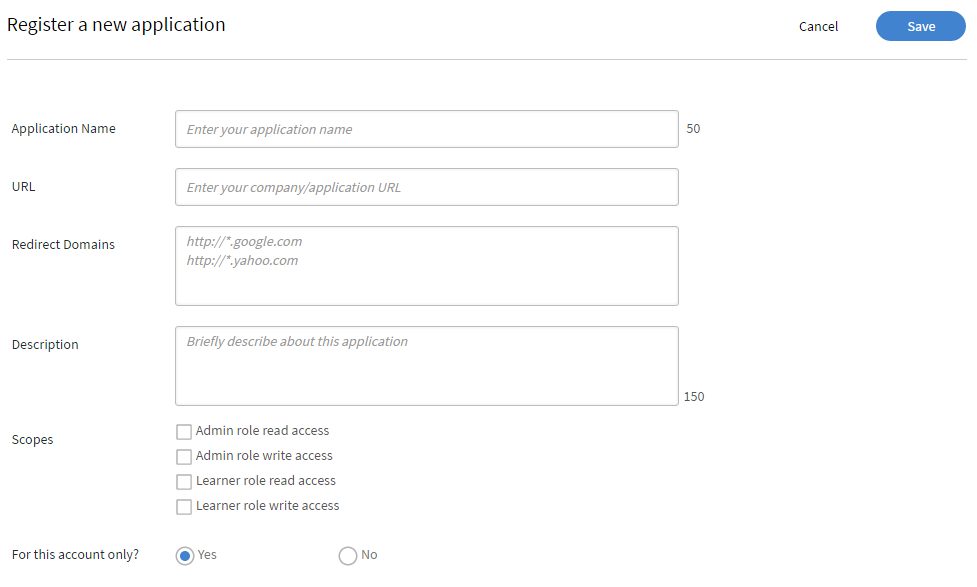

# Användarhandbok för programutvecklare

>[!NOTE]
>
>Learning Manager V1 API är nu föråldrat. Vi rekommenderar att du använder V2 API:er för att interagera med Learning Manager.


## Översikt {#overview}

[Adobe Learning Manager](http://www.adobe.com/in/products/learningmanager.html) är en molnbaserad, elevcentrerad och självbetjänad lösning för hantering av inlärning. Kunder kan använda Learning Manager-resurser programmatiskt med Learning Manager-API:et för att integrera det med andra företagsprogram. API kan också användas av Adobe partners för att förbättra värdepåståendet i Learning Manager genom att utöka dess funktionalitet eller genom att integrera den med andra program eller tjänster.

### Användningsscenario {#usagescenario}

Med Learning Manager API kan utvecklare skapa fristående program som utökar funktionerna i Learning Manager eller integrerar Learning Manager med andra arbetsflöden för företagsprogram. Du kan utveckla ett webbprogram, en datorklient eller en mobilapp med valfri teknik. Som utvecklare kan du komma åt dina programdata från Learning Manager. Driftsättningen av programmet som du utvecklar är extern till Learning Manager-plattformen och du har full kontroll över programutvecklingslivscykeln allt eftersom programmet utvecklas. Vanligtvis utvecklas program av en kundorganisation för användning med deras Learning Manager-konto, och dessa program är privata för den specifika kundorganisationen. Adobe-partners kan också skapa generiska program med Learning Manager API som kan användas av en stor mängd Learning Manager-kunder.

## API för Learning Manager {#apidescription}

Learning Manager API baseras på REST-principer och visar viktiga element i Learning Manager-objektmodellen för programutvecklare via HTTP. Innan du känner till detaljerna för API-slutpunkterna och HTTP-metoderna kan utvecklare bekanta sig med de olika Learning Manager-objekten, deras attribut och inbördes relationer. När modellerna har förståtts är det bra att ha en grundläggande förståelse för strukturen hos API-begäranden och -svar, och några vanliga programmeringstermer som vi använder generellt i hela API:et.

Mer information om de olika API-slutpunkterna och -metoderna finns i [dokumentationen för Learning Manager API](https://learningmanager.adobe.com/docs/primeapi/v2/).

## Elevens API

Adobe Learning Manager - Med elev-API:er kan du skapa en anpassad utbildningsupplevelse för dina användare. Användningen av dessa API:er kräver en giltig användartoken och ska bara användas i arbetsflöden där det finns en helt licensierad/registrerad elev.

>[!IMPORTANT]
>
>De ska inte användas, som det är, för någon form av datahämtning för att stödja icke-inloggade användare/delade användare eller andra sådana fall.

De användningsfall som inte är inloggade kräver särskild hantering.

**Kontakta lösningsarkitekturteamet om du har frågor om lämplig användning av dessa API:er och se till att en lösningsarkitekt har testat en lösning innan du driftsätter den**.

## API-autentisering {#apiauthentication}

När du skriver ett program som gör API-anrop till Learning Manager måste du registrera programmet med hjälp av appen Integration Admin.

Learning Manager API:er använder OAuth 2.0 Framework för att autentisera och auktorisera dina klientprogram.

**Procedur**

**1. Konfigurera ditt program**

Du kan konfigurera programmet med klient-ID och klienthemlighet och använda rätt slutpunkter. När du har registrerat programmet kan du hämta clientId och clientSecret. Get URL bör användas i webbläsare eftersom det autentiserar Learning Manager-användare med deras förkonfigurerade konton som SSO, Adobe ID och så vidare.

```
GET https://learningmanager.adobe.com/oauth/o/authorize?client_id=<Enter your clientId>&redirect_uri=<Enter a url to redirect to>&state=<Any String data>&scope=<one or more comma separated scopes>&response_type=CODE.
```

När autentiseringen är klar omdirigeras webbläsaren till den redirect_uri som nämns i ovanstående URL. En parameter **kod** läggs till tillsammans med omdirigerings-URI:n.

**2. Hämta uppdateringstoken från koden**

`POST https://learningmanager.adobe.com/oauth/token Content-Type: application/x-www-form-urlencoded`

Brödtext för begäran om inlägg:

```
client_id: 
<enter your clientid>
 & 
 client_secret: 
 <enter your clientsecret>
  & 
  code: 
  <code from step 1></code>
 </enter>
</enter>
```

**3.** **Hämta en åtkomsttoken från uppdateringstoken**

URL för att hämta åtkomsttoken:

POST [https://learningmanager.adobe.com/oauth/token/refresh](https://learningmanager.adobe.com/oauth/token/refresh) Content-Type: application/x-www-form-urlencoded

Brödtext för begäran om inlägg:

```
client_id: 
<enter your clientid>
 & 
 client_secret: 
 <enter your clientsecret>
  & 
  refresh_token: 
  <refresh token>
   
  </refresh>
 </enter>
</enter>
```

**URL för verifiering av information om åtkomsttoken**

`GET https://learningmanager.adobe.com/oauth/token/check?access_token=<access_token>`

**Användningsbegränsning**

En åtkomsttoken är giltig i sju dagar. Efter en dag måste du generera en ny åtkomsttoken med uppdateringstoken. Om du genererar en ny åtkomsttoken från uppdateringstoken medan en befintlig åtkomsttoken fortfarande är giltig, returneras den befintliga token.

Några av de vanligaste termerna i Learning Manager API förklaras nedan som referens.

**Inkluderar**

Utvecklare kan komma åt en enda API-objektmodell och flera modeller som är kopplade till den modellen. Om du vill komma åt efterföljande relaterade modeller måste du förstå förhållandet mellan varje modell och andra modeller. Parametern **Includes** gör att utvecklare kan komma åt beroende modeller. Du kan använda kommaavgränsare för att komma åt flera modeller. Mer information om exempelanvändning och **inkluderar** finns i avsnittet om exempel på API-modell på den här sidan.

**API-begäran**

API-begäranden kan göras genom att göra en HTTP-begäran. Beroende på ändpunkt och metod utvecklare kan ha ett val av olika HTTP verb såsom GET, PUT, POST, DELETE, PATCH, etc. För vissa förfrågningar kan frågeparametrar skickas. När en begäran om en specifik datamodell görs kan användaren också begära relaterade modeller enligt beskrivningen i JSON API-specifikationerna. Strukturen för en typisk API-begäran beskrivs i [exempelmodellanvändning](#main-pars_header_1415780624).

**API-svar**

När en API-begäran görs av en klient hämtas ett SON-dokument enligt JSON API-specifikationen. Svaret innehåller också HTTP-statuskoden, som utvecklaren kan verifiera för att utföra nästa steg i sin programlogik. Strukturen för ett typiskt API-svar beskrivs i [exempelmodellanvändning](#main-pars_header_1415780624).

**Fel**

När en API-begäran misslyckas får du ett felsvar. Den HTTP-statuskod som returneras i svaret anger felets art. Felkoder visas med siffror för varje modell i API-referensen. 200, 204, 400 och 404 är några av de vanliga felen som representeras i API:er som indikerar HTTP-åtkomstproblem.

**Fält**

API-objektets attribut och relationer kallas gemensamt för fält. Se [JSON API för mer information.](http://jsonapi.org/format/#document-resource-object-fields) Du kan använda Fält som en parameter när du gör API-anrop för att hämta ett eller flera specifika attribut från modellen. I avsaknad av parametern Fields hämtar API-anropet alla tillgängliga attribut från modellen. I följande API-anrop hämtar till exempel fälten [skills]=name attributet name för enbart kompetensmodellen.

`https://learningmanager.adobe.com/primeapi/v2/users/{userId}/userSkills/{id}?include=skillLevel.skill&fields[skill]=name `

**Sidnumrering**

Ibland resulterar en API-begäran i en lång lista med objekt som ska returneras i svaret. I sådana fall gör attributet paginering att utvecklaren kan hämta resultaten sekventiellt i form av flera sidor, där varje sida innehåller ett intervall av poster. Med pagineringsattributet i Learning Manager kan du till exempel ange det maximala antalet poster som ska visas på en sida. Du kan också definiera intervallvärden för posterna som ska visas på sidan.

**Sortering**

Sortering är tillåtet i API-modeller. Välj vilken typ av sortering som ska användas för resultaten baserat på modellen. Sortering kan göras i stigande eller fallande ordning. Om du till exempel anger `code sort=name`, sorteras den stigande efter namn. Om du anger `code sort=-name` sorteras den fallande efter namn. Se [JSON API-specifikation om du vill ha mer information](http://jsonapi.org/format/#fetching-sorting).

## Illustration av API-användning {#samplemodel}

Låt oss överväga ett scenario där en utvecklare vill få ett färdighetsnamn, maxpoäng tilldelade för färdighetsnivå och poäng som eleven fått för denna färdighet.

En userSkill-modell i API:er för Learning Manager består av id, type, dateAchived, dateCreated och pointsEarned som standardattribut. När en utvecklare använder GET-metoden för att hämta information om userSkill-modellen visas aktuella data som gäller standardattributen i svarsutdata.

Men i det här scenariot vill utvecklaren få färdighetsnamnet och kunskapspoängen för användaren. Med Learning Manager API kan du komma åt denna relaterade information med hjälp av relationsfält och inkludera parametrar. De associerade modellerna för userSkill hämtas i relationstaggen. Du kan få information om varje associerad modell genom att anropa dessa modeller tillsammans med userSkill. Om du vill hämta den här informationen använder du parametern **`code include`** med punkt- (punkt) separerade värden för var och en av de associerade modellerna. Du kan använda kommatecken som avgränsare för att begära en annan modell som user include=skillsLevel.skills,course

**API-anrop**

`https://learningmanagerqe1.adobe.com/primeapi/v1/users/%7buserId%7d/userSkills/%7bid%7d?include=skillLevel.skill&fields%5bskill%5d=name&fields%5bskillLevel%5d=maxCredits&fields%5buserSkill%5d=pointsEarned`

userId kan till exempel 746783 och userSkills id: 746783_4426_1.

**Svar från API-anrop**

```
\{ 
 "links": {"self": "https://learningmanager.adobe.com/primeapi/v2/users/746783/userSkills/746783_4426_1?include=skillLevel.skill&fields[userSkill]=pointsEarned&fields[skillLevel]=maxCredits&fields[skill]=name"}, 
 "data": { 
 "id": "746783_4426_1", 
 "type": "userSkill", 
 "attributes": {"pointsEarned": 5}, 
 "links": {"self": "https://learningmanager.adobe.com/primeapi/v2/users/746783/userSkills/746783_4426_1"} 
 }, 
 "included": [ 
 { 
 "id": "4426", 
 "type": "skill", 
 "attributes": {"name": "Java"}, 
 "links": {"self": "https://learningmanager.adobe.com/primeapi/v2/skills/4426"} 
 }, 
 { 
 "id": "4426_1", 
 "type": "skillLevel", 
 "attributes": {"maxCredits": 10} 
 } 
 ] 
} 
```

## Learning Manager-modeller {#models}

Med Learning Manager API kan utvecklare få tillgång till Learning Manager-objekt som RESTful-resurser. Varje API-slutpunkt representerar en resurs, vanligtvis en objektinstans som Badge, eller en samling av sådana objekt. Utvecklarna använder sedan HTTP-verb som PUT, GET, POST och DELETE för att utföra CRUD-åtgärder på dessa objekt (samlingar).

+++V1 API

I följande diagram visas de olika elementen i Learning Manager-objektmodellen i V1 API.


I följande tabell beskrivs olika element i objektmodellen för Learning Manager V1:

<table border="1" cellspacing="0" cellpadding="0">
 <tbody>
  <tr>
   <td>
    <p><strong>Serienummer</strong></p></td>
   <td>
    <p><strong>Learning Manager-objekt</strong></p></td>
   <td>
    <p><strong>Beskrivning</strong></p></td>
  </tr>
  <tr>
   <td>
    <p>1).      </p></td>
   <td>
    <p>användare</p></td>
   <td>
    <p>Användare är den viktigaste modellen i Learning Manager. Användare är vanligtvis de interna eller externa eleverna i en organisation som lär sig objekt. De kan dock spela vissa andra roller, som författare och chef tillsammans med elevrollen. Användar-id, typ, e-post är några av de infogade attributen. </p></td>
  </tr>
  <tr>
   <td>
    <p>2)      </p></td>
   <td>
    <p>kurs</p></td>
   <td>
    <p>Kurs är ett av utbildningsobjekten som stöds i Learning Manager och som består av en eller flera moduler. </p></td>
  </tr>
  <tr>
   <td>
    <p>3)      </p></td>
   <td>
    <p>modul</p></td>
   <td>
    <p>Modulen är en byggsten för att skapa utbildningsobjekt i Learning Manager. Modulerna kan vara av fyra olika typer, såsom klassrum, virtuellt klassrum, aktivitet och egen takt. Använd den här modulmodellen för att få information om alla moduler på ett konto. </p></td>
  </tr>
  <tr>
   <td>
    <p>4)      </p></td>
   <td>
    <p>certifiering</p></td>
   <td>
    <p>Certifiering tilldelas elever baserat på framgångsrikt slutförande av kurser. Kurser krävs i applikationen innan du använder certifieringar. </p></td>
  </tr>
  <tr>
   <td>
    <p>5)      </p></td>
   <td>
    <p>utbildningsprogram</p></td>
   <td>
    <p>Utbildningsprogram är unikt utformade kurser som uppfyller specifika utbildningskrav för användare. Vanligtvis används utbildningsprogram för att driva utbildningsmål som sträcker sig över enskilda kurser. </p></td>
  </tr>
  <tr>
   <td>
    <p>6).      </p></td>
   <td>
    <p>märket</p></td>
   <td>
    <p>Utmärkelsetecken är ett tecken på prestation som elever får när de når specifika milstolpar när de gör framsteg inom en kurs. </p></td>
  </tr>
  <tr>
   <td>
    <p>7)      </p></td>
   <td>
    <p>färdighet</p></td>
   <td>
    <p>Kompetensmodellen består av nivåer och poäng. Kompetenser kan förvärvas av elever efter relevant slutförande av kursen. </p></td>
  </tr>
  <tr>
   <td>
    <p>8)      </p></td>
   <td>
    <p>certificationEnrollment</p></td>
   <td>
    <p>Den här modellen innehåller information om en användares registrering till en enda certifiering.</p></td>
  </tr>
  <tr>
   <td>
    <p>9. ,  </p></td>
   <td>
    <p>CourseEnrollment</p></td>
   <td>
    <p>Den här modellen innehåller information om en användares registrering till en enskild kurs. </p></td>
  </tr>
  <tr>
   <td>
    <p>10. .  </p></td>
   <td>
    <p>CourseInstance</p></td>
   <td>
    <p>En kurs kan ha en eller flera associerade instanser. Du kan hämta kursinstans </p></td>
  </tr>
  <tr>
   <td>
    <p>11. .  </p></td>
   <td>
    <p>CourseSkill</p></td>
   <td>
    <p>En CourseSkill-modell anger förloppet för en enskild kompetens som uppnås genom att slutföra en kurs.</p></td>
  </tr>
  <tr>
   <td>
    <p>12. .  </p></td>
   <td>
    <p>CourseModule</p></td>
   <td>En CourseModule-modell anger hur en modul inkluderas i en kurs. Till exempel om modulen används för förtest eller för innehåll.</td>
  </tr>
  <tr>
   <td>
    <p>13. .  </p></td>
   <td>learningProgramInstance</td>
   <td>
    <p>Ett utbildningsprogram kan bestå av flera instanser som imbicerar liknande egenskaper hos ett utbildningsprogram eller anpassade instanser. </p></td>
  </tr>
  <tr>
   <td>
    <p>14. .  </p></td>
   <td>
    <p>arbetsstöd</p></td>
   <td>
    <p>Arbetsstöd är ett utbildningsinnehåll som är tillgängligt för elever utan några registrerings- eller slutförandekriterier. Du kan hämta, uppdaterat datum, status, id-information tillsammans med relaterade modeller som arbetsstödversion, författare och kunskapsnivå. </p></td>
  </tr>
  <tr>
   <td>
    <p>15. .  </p></td>
   <td>
    <p>jobAidVersion</p></td>
   <td>
    <p>Arbetsstöd kan ha en eller flera associerade versioner baserat på antalet ändringar av innehållet och antalet överföringar. Den här modellen innehåller information om en enda arbetsstödsversion. </p></td>
  </tr>
  <tr>
   <td>
    <p>16. .  </p></td>
   <td>
    <p>learningProgramInstanceEnrollment</p></td>
   <td>
    <p>Utbildningsprogrammet består av en eller flera instanser. Elever kan registrera sig för en instans av utbildningsprogrammet själva eller på uppdrag av administratören. Den här modellen innehåller information om en registrering av en användare till en enskild instans av utbildningsprogrammet. </p></td>
  </tr>
  <tr>
   <td>
    <p>17. ,  </p></td>
   <td>
    <p>moduleVersion</p></td>
   <td>
    <p>En modul kan ha en eller många versioner baserade på dess reviderade uppladdningar av innehåll. Använd den här modellen för att få specifik information om en enskild modulversion. </p></td>
  </tr>
  <tr>
   <td>
    <p>18).  </p></td>
   <td>
    <p>skillsLevel</p></td>
   <td>
    <p>En kompetensnivå består av en eller flera kurser som ska ges för att uppnå en nivå tillsammans med tillhörande tillgodoräknanden. </p></td>
  </tr>
  <tr>
   <td>
    <p>19. .  </p></td>
   <td>
    <p>userBadge</p></td>
   <td>
    <p>UserBadge relaterar ett enda märke med en enda användare. Den innehåller information som när det uppnåddes, assertionUrl och så vidare. </p></td>
  </tr>
  <tr>
   <td>
    <p>20. .  </p></td>
   <td>
    <p>userSkill</p></td>
   <td>
    <p>UserSkill anger hur mycket av en enskild kompetensnivå som uppnås av en enskild användare.</p></td>
  </tr>
 </tbody>
</table>

+++

+++V2 API

Nedan följer de olika elementen i klassdiagrammet för Learning Manager i V2 API.


<table>
 <tbody>
  <tr>
   <th><b>Learning Manager-objekt</b></th>
   <th><b>Beskrivning</b></th>
  </tr>
  <tr>
   <td>redogörelse</td>
   <td>Kapslar in detaljerna för en Learning Manager-kund.</td>
  </tr>
  <tr>
   <td><code>
     badge
    </code></td>
   <td>Utmärkelsetecken är ett tecken på prestation som elever får när de når specifika milstolpar när de gör framsteg inom en kurs. <br></td>
  </tr>
  <tr>
   <td><code>
     catalog
    </code></td>
   <td>Katalog är en samling utbildningsobjekt.</td>
  </tr>
  <tr>
   <td><code>
     user
    </code></td>
   <td>Användare är den viktigaste modellen i Learning Manager. Användare är vanligtvis de interna eller externa eleverna i en organisation som lär sig objekt. De kan dock spela vissa andra roller, som författare och chef tillsammans med elevrollen. Användar-id, typ, e-post är några av de infogade attributen. </td>
  </tr>
  <tr>
   <td>resurs</td>
   <td>Detta används för att modellera varje innehållsresurs som en modul försöker kapsla in. Alla resurser som är inkapslade i <code>
     an
    </code> <code>
     loResource
    </code> är likvärdiga när det gäller utbildningsmålet, men de skiljer sig från varandra när det gäller leveranstyp eller innehållsspråk.<br></td>
  </tr>
  <tr>
   <td>userNotification</td>
   <td>Den här modellen innehåller meddelandeinformation som gäller en elev.<br></td>
  </tr>
  <tr>
   <td>userSkill</td>
   <td>UserSkill anger hur mycket av en enskild kompetensnivå som uppnås av en enskild användare.<br></td>
  </tr>
  <tr>
   <td>userBadge</td>
   <td>UserBadge relaterar ett enskilt märke <code>
     with
    </code> till en enskild användare. Det innehåller information som när det uppnåddes, <code>
     assertionUrl
    </code> och så vidare. <br></td>
  </tr>
  <tr>
   <td>färdighet</td>
   <td>Kompetensmodellen består av nivåer och poäng. Kompetenser kan förvärvas av elever efter relevant slutförande av kursen. <br></td>
  </tr>
  <tr>
   <td>skillsLevel</td>
   <td>En kompetensnivå består av en eller flera kurser som ska ges för att uppnå en nivå tillsammans med tillhörande tillgodoräknanden. <br></td>
  </tr>
  <tr>
   <td>learningObject</td>
   <td>Ett utbildningsobjekt är en abstraktion för olika typer av objekt som användare kan registrera sig för och lära sig från. Learning Manager har för närvarande fyra typer av utbildningsobjekt - kurs, certifiering, utbildningsprogram <code>
     and
    </code> arbetsstöd.<br></td>
  </tr>
  <tr>
   <td>learningObjectInstance<br></td>
   <td>En specifik instans av ett utbildningsobjekt.<br></td>
  </tr>
  <tr>
   <td>learningObjectResource</td>
   <td>Detta motsvarar <code>
     module
    </code>. En kurs består av ytterligare en <code>
     of
    </code> modul. I Learning Manager kan en modul levereras på flera olika likvärdiga sätt. Därför omfattar <code>
     loResource
    </code> i princip alla dessa likvärdiga resurser.<br></td>
  </tr>
  <tr>
   <td>loResourceGrade<br></td>
   <td>Detta sammanfattar resultatet för den användare som använder en specifik resurs i samband med ett utbildningsobjekt som han är registrerad för. Den innehåller information som längden <code>
     user
    </code> har tillryggalagt för resursen, procentuella framsteg som har gjorts av användaren, status godkänt/underkänt och poäng som har erhållits av användaren i associerade quiz.<br></td>
  </tr>
  <tr>
   <td>kalender<br></td>
   <td>Ett kalenderobjekt är en lista över <code>
     upcoming classroom
    </code> eller virtuella klassrumskurser som användaren kan registrera sig för.<br></td>
  </tr>
  <tr>
   <td>l1FeedbackInfo<br></td>
   <td>L1-feedback kapslar in svaren som tillhandahålls av en elev för de feedbackfrågor som är kopplade till utbildningsobjekt. Detta samlas vanligtvis in efter att användaren har slutfört ett utbildningsobjekt om det är konfigurerat att samla in sådan feedback från elever.<br></td>
  </tr>
  <tr>
   <td>registrering<br></td>
   <td>Denna abstraktion omfattar detaljerna som gäller transaktionen som representerar tilldelningen av en specifik användare till en specifik instans av utbildningsobjekt.<br></td>
  </tr>
 </tbody>
</table>

+++

Lista över objektattribut och relationer.

+++konto

**Attribut**
dateCreated\
spelifiering aktiverad\
id\
språkområde\
loginUrl\
logoUrl\
name\
underdomän\
themeData\
timeZoneCode

**Relationer**
contentLocales(localizationMetadata)\
gamificationLevels(gamificationLevel)\
timeZones(timeZone)\
uiLocales(localizationMetadata)

+++

+++märke

**Attribut**
id\
imageUrl\
name\
tillstånd

+++

+++katalog

**Attribut**
dateCreated\
dateUpdated\
beskrivning\
id\
isDefault\
isInternallySearch\
isListable\
name\
tillstånd

+++

+++data

**Attribut**
id\
namn

+++

+++spelifiering

**Attribut**
färg\
name\
poäng

+++

+++learningObject

**Attribut**
authorNames\
dateCreated\
publiceringsdatum\
dateUpdated\
effectiveIndex\
enrollmentType\
id\
imageUrl\
isExternal\
isSubLoOrderEnforced\
loType\
tillstånd\
taggar

**Relationer**
författare (användare)\
enrollment(learningObjectInstanceEnrollment)\
instanser(learningObjectInstance)\
requiredLO(learningObject)\
skills(learningObjectSkill)\
subLO(learningObject)\
additionalLO(learningObject)\
additionalResources(resource)

+++

+++learningObjectInstance

**Attribut**
completionDeadline\
dateCreated\
enrollmentCount\
id\
isDefault\
seatLimit\
tillstånd\
giltighet

**Relationer**
märket (badge)\
l1FeedbackInfo(feedbackInfo)\
learningObject(learningObject)\
loResources(learningObjectResource)\
localizedMetadata(localizationMetadata)\
subLoInstances(learningObjectInstance)

+++

+++learningObjectInstanceEnrollment

**Attribut**
dateCompleted\
dateEnrollated\
dateStarted\
hasPassed\
id\
progressPercent\
poäng\
tillstånd

**Relationer**
elev (användare)\
learnerBadge(userBadge)\
learningObject(learningObject)\
loInstance(learningObjectInstance)\
loResourceGrades(learningObjectResourceGrade)

+++

+++learningObjectResource

**Attribut**
externalReporting\
id\
loResourceType\
resourceType\
version

**Relationer**
learningObject(learningObject)\
loInstance(learningObjectInstance)\
localizedMetadata(localizationMetadata)\
resources(resurs)

+++

+++learningObjectResourceGrade

**Attribut**
dateCompleted\
dateStarted\
dateSuccess\
varaktighet\
hasPassed\
id\
progressPercent\
poäng

**Relationer**
loResource(learningObjectResource)

+++

+++learningObjectSkill

**Attribut**
poäng\
id\
**Relationer**
learningObject(learningObject)\
skillsLevel(skillsLevel)

+++

+++recommendation

**Attribut**
id\
resonera

**Relationer**
learningObject(learningObject)

+++

+++resource

**Attribut**
authorDesiredDuration\
completionDeadline\
contentStructureInfoUrl\
contentType\
contentZipSize\
contentZipUrl\
dateCreated\
dateStart\
requiredDuration\
downloadUrl\
extraData\
hasQuiz\
hasToc\
id\
InstructorNames\
isDefault\
språkområde\
läge\
name\
onlyQuiz\
reportingInfo\
reportingType\
seatLimit

+++

+++skills

**Attribut**
beskrivning\
id\
name\
tillstånd

**Relationer**
levels(skillsLevel)

+++

+++skillsLevel

**Attribut**
id\
jämn\
maxCredits\
name\
**Relationer**
märket (badge)\
färdighet (kompetens)

+++

+++user

**Attribut**
avatarUrl\
biografi\
contentLocale\
mejl\
fält\
id\
name\
intjänade poäng\
profil\
roller\
tillstånd\
timeZoneCode\
uiLocale

**Relationer**
konto(konto)\
chef (användare)

+++

+++userBadge

**Attribut**
assertionUrl\
dateAchived\
id\
modelType

**Relationer**
märket (badge)\
elev (användare)\
model(learningObject)

+++

+++användarkalender

**Attribut**
kurs\
CourseType\
dateStart\
inskriven\
id\
månad\
kvartal

**Relationer**
containerLO(learningObject)\
course(learningObject)

+++

+++userNotification

**Attribut**
actionTaken\
kanal\
dateCreated\
id\
meddelande\
modelIds\
modelNames\
modelTypes\
läsa\
roll

+++

+++userSkill

**Attribut**
dateAchived\
dateCreated\
id\
intjänade poäng

**Relationer**
learnerBadge(userBadge)\
learningObject(learningObject)\
skillsLevel(skillsLevel)\
user(user)

+++

## Programutvecklingsprocess {#registration}

## Krav {#prerequisites}

Som utvecklare måste du skapa ett testkonto i Learning Manager, så att du har full tillgång till alla roller i kontot. För att kunna skriva ett program måste utvecklaren skapa vissa användare och kurser och få kontot i rimligt skick så att programmet som utvecklas kan få tillgång till vissa exempeldata.

## Skapa klient-ID och hemlighet {#createclientidandsecret}

1. Klicka på **[!UICONTROL Applications]** i den vänstra rutan i **Integreringsadministratör**-inloggningen.

   

   *Välj program i integreringsadministratören*

1. Klicka på **[!UICONTROL Register]** längst upp till höger på sidan för att registrera programinformationen. Registreringssidan visas.

   

   *Registrera programmet*

   Det är obligatoriskt att fylla i alla fält på den här sidan.

   **Programnamn**: Ange programmets namn. Det är inte obligatoriskt att använda samma programnamn, det kan vara vilket giltigt namn som helst.

   **URL**: Om du vet exakt vilken URL-adress programmet finns på kan du nämna den. Om du inte känner till det kan du ange företagets webbadress. Ett giltigt URL-namn är obligatoriskt i det här fältet.

   **Omdirigera domäner**: Ange domännamnet för programmet där du vill att Learning Manager-programmet ska omdirigeras efter OAuth-autentisering. Du kan nämna flera URL-adresser här, men du måste använda giltiga URL-adresser som `http://google.com`, `http://yahoo.com` och så vidare.

   **Beskrivning:** Ange en kort beskrivning av programmet.

   **Omfång:** Välj ett av de fyra tillgängliga alternativen för att definiera programmets omfång. Baserat på ditt val som nämns här är slutpunkten för Learning Manager API tillgänglig för ditt program. Om du till exempel valde **läsbehörighet för elevrollen** är alla slutpunkter för Learning Manager-elevens API skrivskyddade för ditt program.

   **Endast för det här kontot?**\
   **Ja** - Om du väljer Ja är programmet inte synligt för andra kontoadministratörer.\
   **Nej** - Om du väljer Nej kan andra kontoadministratörer också komma åt det här programmet, men de måste använda program-ID:t för att komma åt programmet. Program-ID genereras och visas i redigeringsläget för Learning Manager-program.

   Om du väljer **läs- och skrivåtkomst** för administratörsrollen som scope när du registrerar programmet och väljer **Läsåtkomst för administratörsroll** när du redigerar API:erna, kan du fortfarande ha skrivåtkomst till programmet eftersom appregistreringsomfånget ersätter auktoriseringsarbetsflödet.

1. Klicka på **[!UICONTROL Register]** i det övre högra hörnet när du har fyllt i informationen på registreringssidan.

## Programutveckling och testning {#applicationdevelopmentandtesting}

Utvecklare kan använda Learning Manager API för att skapa valfria program. Utvecklare måste se till att deras konton består av vissa giltiga användare och kurser. De kan skapa några dummyanvändare och kurser och simulera aktivitet i testkontot, så att de kan testa programmets funktion.

## Programdistribution {#applicationdeployment}

Vi rekommenderar att Learning Manager-administratören eller en integrationsadministratör för produktionskontot ser till att göra programmet tillgängligt för användare i organisationen. När ansökan har testats och anses redo för produktion, informera administratören för produktionskontot. Helst vill administratörerna generera ett nytt klient-ID och en klienthemlighet för programmet i produktionskontot och utföra de steg som krävs för att införliva dem i programmet på ett säkert sätt. Den faktiska proceduren för att driftsätta program varierar från företag till företag och organisationens Learning Manager-administratör måste ta emot support från IT/IS-avdelningen i organisationen för att slutföra driftsättningen.

## Godkännande av externt program {#externalapplicationapproval}

Du kan lägga till externa program genom att klicka på **Godkänn** i det övre högra hörnet på sidan **Program**. Ange det externa program-id:t och klicka på **Spara.**


*Lägg till och godkänn ett externt program*

## Vanliga frågor

+++Har Learning Manager e-handelsintegrering?

Adobe Learning Manager har ingen e-handelsintegrering. Vi tillhandahåller dock API:er så att du kan skapa ett eget fjärradministrerat LMS och implementera e-handelsfunktioner.
+++
