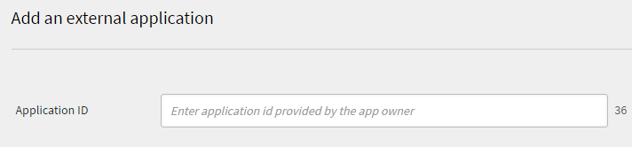

# Användarhandbok för Adobe Learning Manager-utvecklare

## Översikt

Adobe Learning Manager tillhandahåller RESTful API:er som gör det möjligt för utvecklare att integrera och anpassa program eller arbetsflöden effektivt. Utvecklarhandboken innehåller vägledning om hur du använder dessa API:er, och omfattar ämnen som autentisering, datamodeller och integrering med andra program. Dessutom kan den här användarhandboken [API-referensdokumentation](https://learningmanager.adobe.com/docs/primeapi/v2/) hjälpa utvecklare att skapa externa program eller serverarbetsflöden som interagerar med olika funktioner i Adobe Learning Manager, inklusive kursskapande, spårning av elevframsteg, kompetensmappning, certifiering, spelifiering och utskrifter.

I den här handboken beskrivs följande:

* OAuth2.0-autentisering
* API-objektmodeller
* Visar hur du använder inkludera, fält och andra parametrar
* Tillhandahåller slutpunkter för verkliga användningsfall

>[!IMPORTANT]
>
>Den här utvecklarhandboken täcker endast V2 API:erna i Adobe Learning Manager. Alla exempel, begärandestrukturer och autentiseringsarbetsflöden som beskrivs i den här handboken är specifika för /primeapi/v2/-slutpunkterna. Mer information om äldre versioner eller inaktuella API:er finns i [API-referensdokumentationen](https://learningmanager.adobe.com/docs/primeapi/v2/).

## Användningsscenarier för API

Utvecklare kan använda Learning Manager API:er för att förbättra eller integrera Learning Manager med andra företagsprogram. Du kan skapa webb-, dator- och mobilappar med vilken teknik som helst. Utvecklare kan komma åt programdata i Learning Manager, men distributionen är extern och helt kontrollerad av dig. Program utvecklas vanligtvis av kundorganisationer för deras egna konton, medan Adobe-partner kan skapa vanliga program för mer omfattande användning.

## Autentisering med OAuth 2.0

För att få säker åtkomst till Adobe Learning Manager API:er måste du autentisera med ALM:s OAuth 2.0-mekanism. I den här processen ingår att registrera programmet, generera en auktoriseringskod, byta ut den mot en uppdateringstoken och slutligen använda uppdateringstoken för att få en åtkomsttoken.

### Registrera en ansökan

Integrera Adobe Learning Manager med externa program för förbättrad mångsidighet. Stegen innebär att få åtkomst till gränssnittet för Integreringsadministratör, registrera programmet och erhålla klient-ID och hemlighet. Generera autentiseringstoken (OAuth, Refresh och Åtkomsttoken) från ALM, vilket understryker användningen av OAuth 2.0-ramverket för autentisering och auktorisering. Åtkomsttoken har en giltighet på sju dagar.

1. Logga in i Adobe Learning Manager som integreringsadministratör.
2. Välj **[!UICONTROL Applications]** i den vänstra rutan.

   

3. Välj **[!UICONTROL Register]** och lägg till följande information:

   * **[!UICONTROL Application Name]**: Skriv programmets namn (max 50 tecken).
   * **[!UICONTROL URL]**: Företagets eller programmets officiella webbadress. Används för identifiering och referens.
   * **[!UICONTROL Redirect Domains]**: Ange domänerna (till exempel [http://learningmanager.adobe.com](http://learningmanager.adobe.com)) som ALM kan omdirigera till efter auktorisering.  Du kan nämna flera URL-adresser, men URL-adresserna måste vara giltiga.
   * **[!UICONTROL Description]**: Kort beskrivning av vad programmet gör.
   * **[!UICONTROL Scopes]**: Välj ett av de sex tillgängliga alternativen för att definiera programmets omfattning. Baserat på ditt val som nämns här är API-slutpunkterna för Learning Manager tillgängliga för ditt program. Om du till exempel väljer läsåtkomst till elevrollen är alla slutpunkter för Learning Manager-elevens API skrivskyddade för ditt program.

      * Läs- och skrivåtkomst för administratörsrollen: Tillåter programmet att komma åt eller ändra data som administratör.
      * Läsåtkomst/skrivåtkomst för elevroll: Tillåter att programmet får åtkomst till eller ändrar data för elever.
      * Läs- och skrivåtkomst till xAPI: Gör att programmet kan komma åt och skicka Experience API-satser (xAPI).

   * **[!UICONTROL For this account only?]**

      * **[!UICONTROL Yes]** - Om du väljer Ja visas inte programmet för andra kontoadministratörer.
      * **[!UICONTROL No]** - Om du väljer Nej kan andra kontoadministratörer också komma åt det här programmet, men de måste använda program-ID:t för att komma åt programmet. Program-ID genereras och visas i redigeringsläget för Learning Manager-program.

     

4. Välj **[!UICONTROL Save]** för att registrera programmet.

   * När du har registrerat programmet är det tillgängligt i listan över program som har skapats på kontot. Välj programmet så ser du följande utöver de tidigare angivna fälten:
   * Program-ID: Detta är klient-ID:t. Detta ID talar om för ALM vilket program som begär åtkomst. Det ingår i API-begäranden för att identifiera programmet.
   * Programhemlighet: Detta används för att autentisera programmet och verifiera dess identitet under steg för tokenutbyte (till exempel vid begäran om en uppdateringstoken eller en åtkomsttoken).

   

## Hämta en åtkomsttoken

### Hämta auktoriseringskod från omdirigering

När du har hämtat klient-ID:t och klienthemligheten använder du dem för att begära en åtkomsttoken, som används för att autentisera API-anrop.

När du vill börja flödet med auktoriseringskoden dirigerar du användarna till följande URL i en webbläsare:

```
GET https://learningmanager.adobe.com/oauth/o/authorize?client_id=<Enter your clientId>&redirect_uri=<Enter a url to redirect to>&state=<Any String data>&scope=<one or more comma separated scopes>&response_type=CODE 
```

När användaren har auktoriserat programmet omdirigeras Adobe Learning Manager till angiven redirect_uri med en tillagd frågeparameter:

[https://yourapp.com/callback?code=abc123xyz](https://yourapp.com/callback?code=abc123xyz)

En parameterkod läggs till tillsammans med omdirigerings-URI:n.

### Hämta uppdateringstoken från kod

När du har hämtat POSTEN ska du använda valfritt API-verktyg och lägga till följande kodbegäran:

```https://learningmanager.adobe.com/oauth/token ```

**Text för begäran (x-www-form-urlencoded)**:

```
grant_type=authorization_code  
&code=abc123xyz  
&client_id=<your_client_id>  
&client_secret=<your_client_secret>  
&redirect_uri=<your_redirect_url> 
```

**Svar**

```
{ 

  "access_token": "eyJhbGciOiJIUzI1...", 
  "refresh_token": "xTjlfz0jCk6gF1...", 
  "expires_in": 604800, 
  "token_type": "Bearer" 

} 
```

Använd access_token i auktoriseringsrubriken för att göra autentiserade API-begäranden.

### Använd åtkomsttoken i ett API-anrop

Verifiera åtkomsttoken på följande sätt:

```
GET https://learningmanager.adobe.com/oauth/token/check?access_token=<access_token> 
```

En åtkomsttoken är giltig i sju dagar. Efter sju dagar måste du generera en ny åtkomsttoken med hjälp av uppdateringstoken. Om du genererar en ny åtkomsttoken från uppdateringstoken medan en befintlig åtkomsttoken fortfarande är giltig, returneras den befintliga token.

### Skaffa åtkomsttokens för testning och utveckling

Använd verktyget Adobe Learning Manager (ALM) för att generera token snabbt för att skapa åtkomsttoken för testning och utveckling. Dessa tokens är endast avsedda för personligt bruk under utvecklings- och felsökningsfaserna. Tänk på att testtoken ger åtkomst till dina ALM-data, så det är viktigt att hantera dem säkert. Dela aldrig dina testtoken med andra, använd dem i produktionsprogram eller inkludera dem i offentliga koddatabaser. Behandla dem som lösenord för att säkerställa säkerheten för ditt konto och dina data.

1. Logga in på Adobe Learning Manager som integreringsadministratör.
2. Välj **[!UICONTROL Developer Resources]** och sedan **[!UICONTROL select Access Tokens for Testing and Development]**.

   

3. Skriv **[!UICONTROL Client ID]** som du fick när du skapade ett program för att få OAuth-koden. Välj sedan **[!UICONTROL Submit]**.

   

4. Lägg till **[!UICONTROL Client ID]** och **[!UICONTROL Client Secret]** för att få uppdateringstoken. Välj sedan **[!UICONTROL Submit]**. OAuth är förifylld från föregående steg.

   

5. Lägg till klient-ID:t och klienthemligheten för att få åtkomsttoken. Välj sedan **[!UICONTROL Submit]**.

   

6. Lägg till åtkomsttoken och välj Skicka för att få information om åtkomsttoken.

   

När du väljer **[!UICONTROL Submit]** verifieras åtkomsttoken och följande svar visas:

```
{ 
  "access_token": "access token", 
  "refresh_token": "refresh token", 
  "user_role": "admin", 
  "account_id": "1234", 
  "user_id": "123456", 
  "expires_in": 604800 
} 
```

Som tidigare upphör åtkomsttoken för testning att gälla om sju dagar.

### Använd ett API-verktyg för att testa slutpunkterna

Du kan använda valfritt API-testverktyg från tredje part, men vi använder Postman för att testa slutpunkterna. Exemplen i det här dokumentet använder Postman för slutpunktstestning.

1. Öppna Postman och skapa en ny förfrågan.
2. Välj fliken Auktorisering.
3. Ställ in autentiseringstypen till Bearer Token.

   
4. Klistra in den åtkomsttoken som du erhöll från föregående avsnitt i tokenfältet.

   

5. Lägg till följande på fliken Sidhuvuden.

   * Nyckel: Acceptera
   * Värde: application/json
6. Ange din API-slutpunkt i URL-fältet. Exempel: [https://learningmanager.adobe.com/learningManager/api/v2/users](https://learningmanager.adobe.com/learningManager/api/v2/users)
Mer information finns i [Adobe Learning Manager API-referens](https://learningmanager.adobe.com/docs/primeapi/v2/).
7. Välj Skicka för att göra API-begäran.

## Typer av API:er

### API för administratörer

Med Adobe Learning Manager Admin API kan administratörer automatisera och hantera utbildningsåtgärder i stor skala.

Med hjälp av Admin API:er kan utvecklare:

>[!NOTE]
>
>Listan är inte uttömmande.

* **Hantera användare och grupper**: Skapa, uppdatera och ta bort användare eller tilldela grupper dem.
* **Registrera elever**: Automatisera registrering till kurser, utbildningsvägar eller certifieringar.
* **Följ elevens framsteg**: Hämta kurs-/modulförlopp, quizpoäng och slutförandestatus.
* **Generera rapporter**: Få tillgång till data om elevaktivitet, engagemang och prestanda.
* **Hantera innehåll**: Skapa och organisera kurser och utbildningsobjekt.

Mer information finns i [Adobe Learning Manager API-referens](https://learningmanager.adobe.com/docs/primeapi/v2/).

### Elevens API

Elevens API:er är designade för autentiserade användare (elever) och ger dig åtkomst till elevspecifik information. Dessa API:er tillåter uppgifter som:

* Komma åt en elevs kurser och framsteg
* Hämtar intjänade märken eller certifieringar
* Uppdaterar elevprofilinformation
* Visa kompetenser som är kopplade till slutförda kurser

**Viktiga punkter:**

* Dessa API:er kräver en autentiserad användartoken, vilket garanterar datasäkerhet och integritet.
* API:erna är avsedda för scenarier där användare är helt registrerade och inloggade i stället för anonyma eller delade användare.

Mer information finns i [Adobe Learning Manager API-referens](https://learningmanager.adobe.com/docs/primeapi/v2/).

## API-design och vanliga parametrar

API:erna ger utvecklare tillgång till viktiga Learning Manager-resurser som användare, kurser, färdigheter, certifieringar och utbildningsprogram. Den följer REST-principerna och använder HTTP-metoder (GET, POST, PUT, DELETE) för dataåtgärder.

| | |
|--|--|
| Metoder | GET, PUT, POST, DELETE |
| Format | application/vnd.api+json, application/json. [Läs mer](https://developer.mozilla.org/en-US/docs/Web/HTTP/Guides/MIME_types/Common_types) om vanliga MIME-typer. |
| Bas-URL | [https://learningmanager.adobe.com/primeapi/v2/](https://learningmanager.adobe.com/primeapi/v2/) |

### Vanliga parametrar

| Parametrar | Syfte |
|--|--|
| innefatta | Få relaterade resurser i ett samtal. |
| fält | Välj specifika attribut för att minska nyttolasten. |
| filter | Smala resultat (t.ex. efter ID, namn) |
| sort | Orderresultat. |
| sida[gräns], sida[förskjutning] | Stöd för sidnumrering. |

Här är en kort förklaring av varje:

### innefatta

ALM API:er kan användas för att hämta användbar information när du skapar ett anpassat program eller ett fjärradministrerat LMS. API-slutpunkterna kan vidare inkluderas med ytterligare include-parametrar för att hämta den ytterligare information som gäller de data som tas emot som standard. Dessa relationer är datamodellrelationer, till exempel när du ringer för att få användarinformation får du användarinformationen och relationen mellan chef-ID och ALM-konto-ID. Med parametern include kan du extrahera ytterligare information tillsammans med användarinformation, till exempel chefsinformation och ALM-kontouppgifter, på ett detaljerat sätt.
Kort sagt används parametern **include** i API-anrop för att hämta relaterade (länkade) resurser tillsammans med den primära resursen i ett enda svar. Det är användbart när du vill få åtkomst till kapslade eller beroende data, till exempel moduler till en kurs eller kunskaper som är mappade till en elev, utan att göra separata API-anrop.

Viktiga fördelar:

* Minskar flera API-anrop: Undviker behovet att manuellt begära varje relaterad resurs.
* Förbättrar effektiviteten: Snabbare utveckling, mindre serverbelastning och snabbare dataåtergivning.
* Garanterar datakonsekvens: Hämtar alla relaterade data i en konsekvent ögonblicksbild.

**Så här använder du parametern include**

Lägg till parametern include i API-URL:en och ange vilka relaterade entiteter som ska inkluderas.

**Vanliga innehåller sökvägar**

| Inkludera värde | Beskrivning |
|---|---|
| instanser | Returnerar alla instanser av utbildningsobjektet |
| registrering | Returnerar registreringsinformation för användaren |
| instances.loResources.resources | Hämtar moduler och resurser inuti en instans |
| additionalResources | Returnerar tillhörande tilläggsresurser |
| skills.skillLevel.badge | Hämtar kunskapsnivåer och tillhörande utmärkelsetecken |
| förutsättningarLO | Inkluderar nödvändiga utbildningsobjekt |
| subLO | Hämtar underinlärningsobjekt (som används i LP-nummer eller certifieringar) |
| subLOs.enrollment | Registrering för underutbildningsobjekt |
| instances.badge | Utmärkelsetecken har tilldelats för slutförande av en kursinstans |
| subLOs.subLOs.instances.loResources.resources | Djup kapslade resurser i en sub-sub-LO-instans |

**Exempel 1**

Hämta informationen för en användare med hjälp av parametern userID i slutpunkten

```
https://learningmanager.adobe.com/primeapi/v2/users/<userID>
```

```
GET https://learningmanager.adobe.com/primeapi/v2/users/<userID>
```

I svaret kan du se att dataobjektet har en relation med kontot och användarens chef.

```
"relationships": {
            "account": {
                "data": {
                    "id": "1010",
                    "type": "account"
                }
            },
            "manager": {
                "data": {
                    "id": "3400476",
                    "type": "user"
                }
            }
        }
```

Med parametern include i begäran kan du hämta detaljerad information om hanteraren enligt nedan:

```
GET https://learningmanager.adobe.com/primeapi/v2/users/<userid>?include=manager
```

**Exempel 2**

Om du vill hämta kursdetaljerna använder du parametern include i slutpunktsanropet. Följande slutpunkt får kursinformationen tillsammans med dess relationer.

```
GET https://learningmanager.adobe.com/primeapi/v2/learningObjects/<courseID>
```

Relationerna visas i svaret på följande sätt:

* instanser
* färdigheter
* författare

```
"relationships": {
            "authors": {
                "data": [
                    {
                        "id": "3400468",
                        "type": "user"
                    }
                ]
            },
            "instances": {
                "data": [
                    {
                        "id": "course:16444_31598",
                        "type": "learningObjectInstance"
                    }
                ]
            },
            "skills": {
                "data": [
                    {
                        "id": "course:16444_1796",
                        "type": "learningObjectSkill"
                    },
                    {
                        "id": "course:16444_3103",
                        "type": "learningObjectSkill"
                    }
                ]
            }
        }
```

Andra relationer kan inkludera (finns inte i svaret ovan):

* förutsättningarLO
* additionalLO
* additionalResources

Om du vill få detaljerade data om instanserna och kunskaperna inkluderar du &quot;instanser, färdigheter&quot; i parametern include.

```
GET https://learningmanager.adobe.com/primeapi/v2/learningObjects/<courseID>?include=instances,skills
```

Om du nu till exempel vill hämta mer data som är associerade med kursinstansen, till exempel loResources (kursmodulinformation), använder du loResources som ett kapslat include.

```
GET https://learningmanager.adobe.com/primeapi/v2/learningObjects/<courseID>?include=instances.loResources
```

Dessutom kan du kombinera färdigheter och instanser med en kapslad include.

```
GET https://learningmanager.adobe.com/primeapi/v2/learningObjects/<courseID>?include=instances,instances.loResources,skills
```

**Andra filter som ingår**

<table>
 <tbody>
  <tr>
   <td>
    <p style="text-align: left;"><b>Utbildningsprogram</b></p></td>
   <td>
    <p style="text-align: left;"><b>Kurs</b></p></td>
  </tr>
  <tr>
  <td><br>subLOs.prerequisiteLOs.enrollment</br><br>subLOs.subLOs.prerequisiteLOs.enrollment</br><br>subLOs.enrollment.loResourceGrades</br><br>subLOs.subLOs.enrollment.loResourceGrades</br><br>subLOs.subLOs.instances.loResources.resources.room</br><br>subLOs.instances.loResources.resources.room</br><br>subLOs.supplementaryResources</br><br>subLOs.enrollment</br><br>SubLOs.enrollment.loInstance.loResources.resources</br><br>subLOs.supplementaryLOs.instances.loResources.resources</br>
  </td>
  <td>
  <br>instance.enrollment.loResourceGrades</br><br>enrollment.loInstance.loResources.resources</br>equimLOs</br><br>authors</br><br>instance.loResources.resources</br><br>additionalLOs.instance.loResources.resources</br><br>additionalResources</br><br>instance.badge</br><br>skills.skillsLevel.badge</br><br>skills skillLevel.skills</br><br>instance.loResources.resources.room</br><br>equimLOs.enrollment</br><br>enrollment.loResourceGrades</br>
  </td>
  </tr>

#### fält

Ett API-objekts attribut och relationer kallas fält. Använd Fält som en parameter i API-anrop för att hämta specifika attribut från modellen. Utan parametern Fields hämtar API-anropet alla tillgängliga attribut.

I följande API-anrop hämtar till exempel fälten [skills]=name attributet name för enbart kompetensmodellen.

```
GET https://learningmanager.adobe.com/primeapi/v2/users/3400490/userSkills/3400490_1796_1?include=skillLevel.skill&fields[skill]=name
```

#### sidnumrering

API-sidnumrering är en teknik som används i API:er för att dela upp stora datauppsättningar i mindre, hanterbara segment, så kallade sidor, i stället för att returnera alla data i ett enda svar.

Sidnumreringen gör klienten och servern mindre, begränsar svarsstorleken för att undvika serverflaskhalsar eller är användbar för att visa data i tabeller eller visar en sida i taget.

**Så här fungerar sidnumrering i ALM API:er**

ALM API:er stöder sidnumrering via parametrar som:

* sida[gräns]: Antal poster per sida.
* sida[förskjutning]: Antal poster att hoppa över.
* sida[markör]: Peka på nästa resultatuppsättning. I stället för att använda förskjutningsbaserad sidnumrering (som hoppar över ett antal poster) använder markörbaserad sidnumrering en unik markör som returneras från API:et för att hämta nästa resultatsida.

Så här använder du sidnumrering i API:er:

**sida[gräns]**

Medan [https://learningmanager.adobe.com/primeapi/v2/users](https://learningmanager.adobe.com/primeapi/v2/users) returnerar alla användare och relaterad information i ett enda anrop, begränsar du antalet resultat till det angivna värdet om du använder sidan[limit].

Använd följande API om du bara vill returnera fem användarposter i ett enda anrop:

```
GET https://learningmanager.adobe.com/primeapi/v2/users?page[limit]=5
```

**sida[förskjutning]**

Använd det här API-anropet för att returnera tre användarposter, hoppa över de första fem användarna och börja från den sjätte.

```
GET https://learningmanager.adobe.com/primeapi/v2/users?page[limit]=3&page[offset]=5 
```

**sida[markör]**

1. Börja med att begära den första sidan med en gräns på 5.

   ```
   GET https://learningmanager.adobe.com/primeapi/v2/users?page[limit]=5
   ```

2. Kopiera markörvärdet från links.next och använd det i nästa begäran:

   ```
   "links": {
       "self": "https://learningmanager.adobe.com/primeapi/v2/users?page[limit]=5",
       "next": "https://learningmanager.adobe.com/primeapi/v2/users?page[limit]=5&page[cursor]=3400482"
    }
   ```

3. Skicka följande begäran:

   ```
   GET https://learningmanager.adobe.com/primeapi/v2/users?page[limit]=5&page[cursor]=3400482
   ```

Detta returnerar nästa uppsättning med 10 poster, med början efter det sista objektet från föregående sida.

#### filter

Med filterparametern kan du begränsa API-resultat baserat på ett eller flera fältvärden.

Adobe Learning Manager API:er tillhandahåller olika varianter av filterparametern för att begränsa svaren.

Mer information finns i [Adobe Learning Manager API-referens](https://learningmanager.adobe.com/docs/primeapi/v2/).

I det här exemplet visas hur du filtrerar de hjälpmedel som en elev har registrerat sig till med hjälp av slutpunkten med filterparametern:

```
GET https://learningmanager.adobe.com/primeapi/v2/users/3400480/enrollments?filter.loTypes=jobAid
```

#### sort

Parametern sort används för att sortera API-resultat i stigande eller fallande ordning baserat på ett eller flera fält.

I Adobe Learning Manager finns olika sorteringsalternativ för att sortera API-svar. Mer information finns i [Adobe Learning Manager API-referens](https://learningmanager.adobe.com/docs/primeapi/v2/).

Om du utökar det föregående exemplet sorterar du nu användarens registrering till utbildningsprogram efter datum som registrerats i stigande ordning.

```
GET https://learningmanager.adobe.com/primeapi/v2/users/3400480/enrollments?filter.lotypes=learningProgram&sort=dateEnrolled
```

## Översikt över API-modeller

Med Adobe Learning Manager API:er kan utvecklare få tillgång till Learning Manager-objekt som RESTful-resurser. Varje API-slutpunkt representerar en resurs, vanligtvis en objektinstans som Badge, eller en samling av sådana objekt. Utvecklarna använder sedan HTTP-verb som PUT, GET, POST och DELETE för att utföra CRUD-åtgärder på dessa objekt (samlingar).


| Learning Manager-objekt | Beskrivning |
|----|----|
| redogörelse | Kapslar in detaljerna för en Learning Manager-kund. |
| märket | Ett utmärkelsetecken är ett tecken på prestation som elever får när de når specifika milstolpar under kursens gång. |
| katalog | Katalog är en samling utbildningsobjekt. |
| användare | Användare är den viktigaste modellen i Learning Manager. Användare är vanligtvis de interna eller externa eleverna i en organisation som lär sig objekt. De kan dock spela vissa andra roller, som författare och chef tillsammans med elevrollen. Användar-id, typ, e-post är några av de infogade attributen. |
| resurs | Detta används för att modellera varje innehållsresurs som en modul försöker kapsla in. Alla resurser som är inkapslade i en &quot;loResource&quot; är likvärdiga när det gäller utbildningsmålet, men de skiljer sig från varandra när det gäller leveranstyp eller innehållsspråk. |
| userNotification | Den här modellen innehåller meddelandeinformation som gäller en elev. |
| userSkill | UserSkill anger hur mycket av en enskild kompetensnivå som uppnås av en enskild användare. |
| userBadge | UserBadge relaterar ett enda märke med en enda användare. Det innehåller information som när det uppnåddes, assertionUrl och så vidare. |
| färdighet | Kompetensmodellen består av nivåer och poäng. Kompetenser kan förvärvas av elever efter relevant slutförande av kursen. |
| skillsLevel | En kompetensnivå består av en eller flera kurser som ska tas tillvara för att uppnå en nivå tillsammans med tillhörande tillgodoräknanden. |
| learningObject | Ett utbildningsobjekt är en abstraktion för olika typer av objekt som användare kan registrera sig för och lära sig från. Learning Manager har för närvarande fyra typer av utbildningsobjekt - kurs, certifiering, utbildningsprogram och arbetsstöd. |
| learningObjectInstance | En specifik instans av ett utbildningsobjekt. |
| learningObjectResource | Detta motsvarar begreppet modul. En kurs består av en eller flera moduler. I Learning Manager kan en modul levereras på flera olika likvärdiga sätt. Därför omfattar LoResource i huvudsak alla dessa likvärdiga resurser. |
| loResourceGrade | Detta sammanfattar resultatet för den användare som använder en specifik resurs i samband med ett utbildningsobjekt som han är registrerad för. Den innehåller information som den tid som användaren har tillbringat i resursen, den procentuella förloppet som användaren har gjort, status för godkänt/underkänt och de poäng som användaren har fått i associerade quiz. |
| kalender | Ett kalenderobjekt är en lista över kommande klassrumskurser eller virtuella klassrumskurser som användaren kan registrera sig för. |
| l1FeedbackInfo | L1-feedback kapslar in svaren som tillhandahålls av en elev för de feedbackfrågor som är kopplade till utbildningsobjekt. Detta samlas vanligtvis in efter att användaren har slutfört ett utbildningsobjekt om det är konfigurerat att samla in sådan feedback från elever. |
| registrering | Denna abstraktion omfattar detaljerna som gäller transaktionen som representerar tilldelningen av en specifik användare till en specifik instans av utbildningsobjekt. |


## Elevens API:er och slutpunkter

Här är de viktigaste API-slutpunkterna för arbete med elevdata. Dessa API:er guidar utvecklare att interagera med elevinformation, hålla reda på framsteg, hantera registreringar och hämta kursinnehåll.

### Hämta information om alla elever

Hämta elevinformation (namn, e-postadress, UUID, användarprofil och så vidare). Använd API:et för att lista alla elever i kontot.

```
GET https://learningmanager.adobe.com/primeapi/v2/users
```

### Hämta information om en specifik elev

Om du vill visa en elevs profil efter ID använder du följande API för att ringa ett samtal.

```
GET https://learningmanager.adobe.com/primeapi/v2/users/<userID>
```

### Lista alla kurser, utbildningsprogram, arbetsstöd och certifieringar

Hämta information om alla utbildningsobjekt där eleven är registrerad, har slutfört eller har aktiverats av administratören.

```
GET https://learningmanager.adobe.com/primeapi/v2/learningObjects
```

### Få information om ett specifikt utbildningsobjekt

Få detaljerad information om ett utbildningsobjekt. Den inkluderar datum då den skapades, publiceringsdatum, uppdateringsdatum och annan information.

```
GET https://learningmanager.adobe.com/primeapi/v2/learningObjects/<LearningObjectID>
```

### Hämta en lista över kompetenser som är kopplade till kurser

Visa kompetenser som är tilldelade alla elever i kontot.

```
GET https://learningmanager.adobe.com/primeapi/v2/skills
```

### Hämta information om kompetensnivå och utmärkelsetecken

Kontrollera elevernas framsteg i färdighetsbaserade inlärningsresor.

```
GET https://learningmanager.adobe.com/primeapi/v2/skills/<skillID>?include=levels
```

### Lista över alla utmärkelsetecken som skapats för ett konto

Ring till följande slutpunkt för att hämta en lista över alla utmärkelsetecken som har skapats för ett konto i en organisation.

```
GET https://learningmanager.adobe.com/primeapi/v2/badges
```

### Hämta information om ett utmärkelsetecken

Hämta detaljerad information om ett märke, inklusive namnet på märket, URL-adressen till märket och statusen för märket.

```
GET https://learningmanager.adobe.com/primeapi/v2/badges/<skillID>
```

Detta ger följande svar:

```
{
    "links": {
        "self": "https://learningmanager.adobe.com/primeapi/v2/badges/499"
    },
    "data": {
        "id": "499",
        "type": "badge",
        "attributes": {
            "imageUrl": "https://cpcontentsdev.adobe.com/public/account/1010/accountassets/1010/badges/test_57a5ab00555a475a8fc6671562184dc9.png",
            "name": "penguins",
            "state": "Retired"
        }
    }
}
```

## Andra exempel på API-användning

### Skapa en användare

1. Använd slutpunkt:

   ```
   POST https://learningmanager.adobe.com/primeapi/v2/users
   ```

   Bearbetar attributen från API-brödtexten eller JSON-nyttolasten för att generera en användare och tillhandahåller sedan en användare med respektive användar-ID ifyllt.

2. Använd följande nyttolast som text:

   ```
   { 
      "data": { 
        "type": "user", 
        "attributes": { 
         "email": "bob@example.com", 
          "name": "Bob", 
          "userType": "INTERNAL" 
        } 
      } 
    }
   ```

Det finns tre obligatoriska attribut:

* e-postadress: användarens e-post-ID. Värdet måste vara unikt för alla användare.
* namn: Användarens namn.
* userType: För närvarande kan endast interna användare läggas till med denna slutpunkt. userType ska vara INTERNAL.

Följande svar visas:

```
{
  "links": {
      "self": "https://learningmanager.adobe.com/primeapi/v2/users"
  },
  "data": {
      "id": "13386404",
      "type": "user",
      "attributes": {
          "avatarUrl": "https://cpcontents.adobe.com/public/images/default_user_avatar.svg",
          "email": "bob@example.com",
          "name": "Bob",
          "pointsEarned": 0,
          "pointsRedeemed": 0,
          "preferredResolution": "AUTO",
          "profile": "Employee",
          "roles": [
              "Learner"
          ],
          "state": "ACTIVE",
          "userType": "Internal",
          "userUniqueId": "bob@example.com"
      },
      "relationships": {
          "account": {
              "data": {
                  "id": "1010",
                  "type": "account"
              }
          },
          "manager": {
              "data": {
                  "id": "3400468",
                  "type": "user"
              }
          }
      }
  }
}
```

### Ta bort en användare

1. Hämta användar-ID för den användare du vill ta bort.

   ```
   GET https://learningmanager.adobe.com/primeapi/v2/users/<userID>
   ```

2. Ring sedan följande när du använder DELETE:

   ```
   DELETE https://learningmanager.adobe.com/primeapi/v2/users/<userID>
   ```

Ett 204-svar visas. En 204-svarskod indikerar att åtgärden lyckats utan något innehåll att returnera. Servern har bearbetat begäran men har inga data att tillhandahålla klienten.

Användarens status är nu **[!UICONTROL DELETED]** efter att du har hämtat användarens information.

### Uppdatera användarinformation

1. Uppdatera användarinformation för användare med v2 API. Eleven kan ändra bio, uiLocale, contentLocale, timezone. För stora konton är detta asynkrona anrop. Det finns många andra användarattribut som kan uppdateras med denna API-slutpunkt. Använd slutpunkten /users/{id}, där id är användar-id för den användare vars information ska uppdateras.

```
PATCH https://learningmanager.adobe.com/primeapi/v2/users/<userID>
```

Lägg till följande i nyttolasten för begäran att uppdatera användaren med ID `<userID>` från föregående avsnitt.

Ändra fält i nyttolasten.

```
{
    "data": {
        "id": "3400468",
        "type": "user",
        "attributes": {
            "avatarUrl": "https://cpcontents.adobe.com/public/images/default_user_avatar.svg",
            "binUserId": "3e6d571f-3956-44db-be69-8e458bde649f",
            "bio": "Manager",
            "contentLocale": "de-DE",
            "email": "user@example.com",
            "enrollOnClick": true,
            "fields": {
                "Web": "Web",
                "newfororder": "newvalue",
                "location": "New",
                "test1": "b"
            },
            "gamificationEnabled": true,
            "lastLoginDate": "2025-04-30T09:30:51.000Z",
            "metadata": {
                "level": "5",
                "expertise": "java",
                "sport": "tennis"
            },
            "name": "John Adams",
            "pointsEarned": 8600,
            "pointsRedeemed": 0,
            "preferredResolution": "AUTO",
            "profile": "Employee",
            "roles": [
                "Learner",
                "Admin",
                "Author",
                "Instructor",
                "Integration Admin",
                "Manager"
            ],
            "state": "ACTIVE",
            "timeZoneCode": "213",
            "uiLocale": "en-US",
            "userType": "Internal",
            "userUniqueId": "user@example.com"
        },
        "relationships": {
            "account": {
                "data": {
                    "id": "1010",
                    "type": "account"
                }
            }
        }
    }
}
```

När du har gjort samtalet uppdateras användarens uppgifter.

### Skapa en extern profil

En extern profil avser en användarprofil som skapas för externa elever, vanligtvis enskilda personer som inte ingår i organisationens interna användarbas. Dessa elever kan inkludera kunder, partner, leverantörer, franchisetagare eller tillfälliga uppdragstagare som behöver tillgång till utbildnings- eller certifieringsprogram som erbjuds av organisationen.

1. Använd följande slutpunkt:

   ```
   POST https://learningmanager.adobe.com/primeapi/v2/externalProfiles
   ```

2. Använd följande nyttolast som text:

```
{
    "data": {
      "type": "externalProfile",
      "attributes": {
        "name": "Jonas Albertson",
        "expiry": "2027-12-31T18:29:59.000Z",
        "managerEmail": "jonas@acme.com",
        "seatLimit": 10
      }
    }
}
```

Nyttolasten har följande attribut:

* namn: Den externa användarens namn.
* Utgångsdatum: sista giltighetsdag (i ISO-8601-format) för användarens registrering i Adobe Learning Manager.
* managerEmail: e-postadressen till användarens chef för partnerorganisationen.
* seatLimit: Antalet platser som tillåts för partnerorganisationen.

När du har ringt får du följande svar:

```
{
    "links": {
        "self": "https://learningmanager.adobe.com/primeapi/v2/externalProfiles"
    },
    "data": {
        "id": "18805",
        "type": "externalProfile",
        "attributes": {
            "accessKey": "8gte2ne7f4r14",
            "enabled": true,
            "expiry": "2027-12-31T18:29:59.000Z",
            "managerEmail": "jonas@acme.com",
            "name": "Jonas Albertson",
            "seatLimit": 10,
            "url": "https://learningmanager.adobe.com/eplogin?groupid=18805&accesskey=8gte2ne7f4r14"
        }
    }
}
```

Det innebär att den externa användaren har lagts till i Adobe Learning Manager. Skicka URL:en som är i svaret till användaren och använd den för att registrera sig på plattformen.

### Extrahera en användarrapport med användar-ID och chefsinformation

En användarrapport kan hämtas direkt från användargränssnittet (**[!UICONTROL Admin]** > **[!UICONTROL Users]** > **[!UICONTROL Internal]**). Rapporten returnerar dock inte användar-ID:et och tillhörande chefsinformation.
Du kan hämta informationen med hjälp av jobb-API:et för en administratör.

1. Lägg till följande nyttolast i jobb-API:et.

   ```
   {
       "data": {
           "type": "job",
           "attributes": {
               "description": "description of your choice",
               "jobType": "generateUsers",
               "payload":{
                   "expandMetadata":true
               }
           }
      }
   }
   ```

2. Använd följande slutpunkt.

   ```
   POST https://learningmanager.adobe.com/primeapi/v2/jobs
   ```

3. Kopiera jobbets ID från svaret.

   ```
   {
       "links": {
           "self": "https://learningmanager.adobe.com/primeapi/v2/jobs"
       },
       "data": {
           "id": "43118",
           "type": "job",
           "attributes": {
               "dateCreated": "2025-05-26T06:35:35.000Z",
               "description": "description of your choice",
               "jobType": "generateUsers",
               "payload": {
                   "expandMetadata": true
               },
             "status": {
                   "code": "Submitted"
               }
           }
       }
   }
   ```

   Jobb-ID:t 43118 i svaret.
4. När du har kopierat ID:t använder du ID:t i Job API för att hämta rapporten.

   ```
   GET https://learningmanager.adobe.com/primeapi/v2/jobs/43118
   ```

5. Kopiera S3-URL:en från svaret.
6. Klistra in webbadressen i webbläsaren. Webbläsaren uppmanar dig att spara eller öppna CSV-filen. Spara filen på din dator.
Den hämtade filen innehåller följande kolumner:

internalUserID, userEmail, customerDefiniedUniqueUserId, name, managerEmail, userType, state, excludeFromGamification, pointsEarned, profile, roller, dateCreated, lastLoginDate, dateDeleted, uiLocale, contentLocale, timeZoneCode, userSource, grupp, aktiva fält, metadata och lastSocialActivityDate.

### Generera utmärkelsetecken med Jobb-API

1. Hämta en lista med utmärkelsetecken för en användare i organisationen. Använd följande slutpunkt:

   ```
   GET https://learningmanager.adobe.com/primeapi/v2/users/3400476/userBadges
   ```

   Var 3400476 är användar-ID:et.
2. Kopiera utmärkelsetecknet-ID från svaret. Till exempel är 3400476_759_COMPETENCY_1796_1 badge ID.

   ```
   {
    "id": "3400476_759_COMPETENCY_1796_1",
    "type": "userBadge",
    "attributes": {
        "assertionUrl": "https://cpcontentsdev.adobe.com/public/accountassets/1010/badges/assertions/a99566b5aa8f4cfa92380581733c63a9_1626278856926.json",
        "dateAchieved": "2016-02-25T08:45:25.000Z",
        "modelType": "skillLevel"
    },
    "relationships": {
        "badge": {
            "data": {
                "id": "759",
                "type": "badge"
            }
        },
        "learner": {
            "data": {
                "id": "3400476",
                "type": "user"
            }
        },
        "model": {
            "data": {
                "id": "1796_1",
                "type": "skillLevel"
            }
        }
    }
   }
   ```

3. Skapa en nyttolast och ange ID-bricka i nyttolasten. Ett exempel på nyttolast är följande:

   ```
   {
    "data": {
        "type": "job",
        "attributes": {
            "description": "Acme Corp Badge",
            "jobType": "generateUserBadge",
            "payload": {
                "userBadgeId": "3400476_759_COMPETENCY_1796_1"
            }
        }
    }
   }  
   ```

   När du har ringt får du jobb-ID:t i svaret.
4. Ta jobb-ID från svaret och använd jobb-ID i följande slutpunkt för att genomföra samtalet.

   ```
   GET https://learningmanager.adobe.com/primeapi/v2/jobs/<jobsID>
   ```

5. Kopiera URL-adressen för märket från svaret och öppna URL-adressen i en webbläsare. Certifikatet hämtas som PDF.

### Skapa användare i Adobe Learning Manager

Slutpunkten POST/användare hjälper dig att skapa en användare med hjälp av fjärradministrerat läge. Skapa användare med detaljerad information, som registreringsprocessen i det inbyggda användargränssnittet i Adobe Learning Manager.

Exempel:

```
POST https://learningmanager.adobe.com/primeapi/v2/users
```

Lägg till följande brödtext i begäran:

```
{   
   "data":  
     {  
       "type": "user",  
       "attributes": {  
         "bio": "",  
         "contentLocale": "fr-FR",  
         "email": "user@work.com",  
         "enrollOnClick": true,  
         "fields": {  
           "Learning Categories": [  
             "Business"  
           ],  
           "Categories": "IT"  
         },  
         "gamificationEnabled": true,  
         "name": "Test User",  
         "profile": "Engineer",  
         "userType": "INTERNAL",  
         "userUniqueId": "user@work.com"  
       },  
       "relationships": {  
         "account": {  
           "data": {  
             "id": "108079",  
             "type": "account"  
           }  
         }
         }  
       }  
    } 
```

När du har ringt upp visas följande svar:

```
{
    "links": {
        "self": "https://learningmanager.adobe.com/primeapi/v2/users"
    },
    "data": {
        "id": "13385627",
        "type": "user",
        "attributes": {
            "avatarUrl": "https://cpcontents.adobe.com/public/images/default_user_avatar.svg",
            "email": "user@work.com",
            "name": "Test User",
            "pointsEarned": 0,
            "pointsRedeemed": 0,
            "preferredResolution": "AUTO",
            "profile": "Engineer",
            "roles": [
                "Learner"
            ],
            "state": "ACTIVE",
            "userType": "Internal",
            "userUniqueId": "user@work.com"
        },
        "relationships": {
            "account": {
                "data": {
                    "id": "1010",
                    "type": "account"
                }
            },
            "manager": {
                "data": {
                    "id": "3400468",
                    "type": "user"
                }
            }
        }
    }
}
```

En ny användare läggs till i Adobe Learning Manager.

### Skicka feedback om L1

1. Hämta elevens kurs, instans och registreringsdata. Använd följande slutpunkt:

   ```
   GET /enrollments
   ```

2. Kontrollera om L1-feedback är aktiverad för kursinstansen.

   ```
   GET https://learningmanager.adobe.com/primeapi/v2/learningObjects/<loID>/instances/<loInstanceID>/l1Feedback
   ```

3. Skicka feedback om L1.

   ```
   POST /enrollments/{id}/l1Feedback
   ```

Exempel på nödvändig nyttolast:

```
{
    "data": {
      "id": "course:7454218_10333537_11257863",
      "type": "feedback",
      "attributes": {
        "questions": [
          {
            "answer": "8",
            "questionId": "1",
            "mandatory": true,
            "questionType": "scaleTen"
          }
        ],
        "score": 80
      }
    }
  }
```

### Hämta information på modulnivå för en kurs

1. Hämta information om ett utbildningsobjekt per ID.

   ```
   GET https://learningmanager.adobe.com/primeapi/v2/learningObjects/<loID>
   ```

   ```
   {
    "links": {
        "self": "https://learningmanager.adobe.com/primeapi/v2/learningObjects/course:1171899"
    },
    "data": {
        "id": "course:1171899",
        "type": "learningObject",
        "attributes": {
            "authorNames": [
                "James Adams"
            ],
            "dateCreated": "2017-11-01T15:28:09.000Z",
            "datePublished": "2017-11-01T15:28:20.000Z",
            "dateUpdated": "2017-11-01T15:28:20.000Z",
            "duration": 60,
            "effectiveModifiedDate": "2017-11-01T15:28:20.000Z",
            "effectivenessIndex": 0,
            "enrollmentType": "Self Enroll",
            "hasOptionalLoResources": false,
            "hasPreview": false,
            "isExternal": false,
            "isMqaEnabled": false,
            "isPrerequisiteEnforced": false,
            "isSubLoOrderEnforced": false,
            "loFormat": "Self Paced",
            "loResourceCompletionCount": 3,
            "loType": "course",
            "moduleResetEnabled": false,
            "state": "Published",
            "unenrollmentAllowed": true,
            "catalogLabels": [
                {
                    "catalogLabelValueIds": [
                        {
                            "name": "Sales",
                            "id": "catalogLabel:13_31"
                        }
                    ],
                    "description": "",
                    "mandatory": false,
                    "name": "Department",
                    "values": [
                        "Sales"
                    ]
                }
            ],
            "localizedMetadata": [
                {
                    "locale": "en-US",
                    "name": " Test course 2"
                }
            ],
            "rating": {
                "averageRating": 0,
                "ratingsCount": 0
            }
        },
        "relationships": {
            "authors": {
                "data": [
                    {
                        "id": "3400468",
                        "type": "user"
                    }
                ]
            },
            "instances": {
                "data": [
                    {
                        "id": "course:1171899_2067352",
                        "type": "learningObjectInstance"
                    }
                ]
            },
            "skills": {
                "data": [
                    {
                        "id": "course:1171899_1797",
                        "type": "learningObjectSkill"
                    }
                ]
            }
        }
    }
   }
   ```

2. Använd parametern include för att hämta följande:

   a. Lista alla moduler för utbildningsobjektet.

   ```
   GET https://learningmanager.adobe.com/primeapi/v2/learningObjects/course:1171899?include=instances.loResources
   ```

   b. Lista allt innehåll i modulerna.

   ```
   GET https://learningmanager.adobe.com/primeapi/v2/learningObjects/course:1171899?include=instances.loResources.resources
   ```

### Kontrollera modulförlopp

1. Hämta utbildningsobjektet från katalogen med hjälp av kurs-ID.

   ```
   GET https://learningmanager.adobe.com/primeapi/v2/learningObjects?page[limit]=10&filter.loTypes=course&sort=name&filter.ignoreEnhancedLP=true&id=<courseID>
   ```

2. Hämta registreringsinformation för en elev med hjälp av registrerings-ID:t.

   ```
   GET https://learningmanager.adobe.com/primeapi/v2/enrollments/<enrollmentID>
   ```

   Kopiera ID:t för utbildningsobjektresursgrad från svaret.
3. Använd ID:et i följande slutpunkt.

   ```
   GET https://learningmanager.adobe.com/primeapi/v2/loResourceGrades/<courseResourceGradeID>
   ```

I svaret får du information om modulens förlopp.

### Implementera personifiering av elever

När du implementerar ett fjärradministrerat LMS med Adobe Learning Manager som serverdel kan organisationer behöva supportpersonal som utger sig för att vara elever som felsöker eller får hjälp. Den API-drivna personifieringsmetoden garanterar säker åtkomst samtidigt som elevens inloggningsuppgifter skyddas och stöder sömlösa övergångar i sessionstillstånd.

Adobe Learning Manager (ALM) underlättar elevpersonifiering i fjärradministrerade LMS-miljöer genom ett dedikerat API. Den här funktionen gör att supportpersonalen tillfälligt kan identifiera en elev, så att de kan diagnostisera problem, testa funktioner eller ge praktisk hjälp genom att simulera elevens upplevelse. Personifiering aktiveras med en cachelagrad åtkomsttoken för administratörer, som används för att programmatiskt generera en åtkomsttoken för elever. Denna process gör att systemet kan fungera som om det var inloggad som eleven.

>[!IMPORTANT]
>
>Användarna måste begära särskild API-åtkomst för att använda den här funktionen och systemet måste hantera sessionsväxling, auktorisering och andra indikatorer för att säkerställa öppenhet och ansvarsskyldighet under personifieringen.

**Information om API-slutpunkt**

```
POST /oauth/learnerToken
```

**Exempel på fullständig URL**

```
https://learningmanager.adobe.com/oauth/o/learnerToken?learner_email=foo@acme.com&force=false
```

**Frågeparametrar:**

* learner_email: (sträng) Elevens e-postadress för att uppträda.
* force: (boolean) Om en token ska tvångsgenereras om en sådan finns.

**Text för begäran:**

```
{
    "client_id": "your-client-id",
    "client_secret": "your-client-secret",
    "refresh_token": "your-admin-refresh-token"
}  
```

**Exempelsvar:**

```
{
    "access_token": "generated-token",
    "refresh_token": "new-refresh-token",
    "user_role": "learner",
    "account_id": "123456",
    "user_id": "7891011",
    "expires_in": 604800
}  
```

**Exempel på cURL:**

```
curl --location --request POST 'https://learningmanager.adobe.com/oauth/o/learnerToken?learner_email=foo@acme.com&force=false' \
--header 'Content-Type: application/json' \
--data-raw '{
  "client_id": "xxxx",
  "client_secret": "xxxx",
  "refresh_token": "xxxx"
}'
```

### Generera elevbetygsutdrag

**Felkoder**

| HTTP-status | Betydelse | Felsökning |
|---|---|---|
| 400 | Felaktig begäran | Kontrollera om det finns parametrar som saknas eller har fel format i begäran. Kontrollera obligatoriska fält och korrekt formatering. Ogiltig syntax för filter, fält eller inkluderade parametrar. |
| 401 | Obehörig ogiltig eller saknad token | Se till att din åtkomsttoken är korrekt och ingår i auktoriseringsrubriken. Kontrollera att token är aktiv. Använd också rätt klient-ID och klienthemlighet när du begär token. |
| 403 | Förbjudet. Ingen åtkomst | Du har inte behörighet att komma åt resursen. Verifiera att din token har rätt omfång (admin:read, elev:write och så vidare.). |
| 404 | Resursen hittades inte | Slutpunkten eller resurs-ID:t är felaktigt eller finns inte. Kontrollera att resursen finns i parameterlistan. |
| 406 | Inte acceptabelt - felaktigt acceptera rubrik | Lägg till det här huvudet i din begäran: Godkänn: application/vnd.api+json <br>Den här innehållstypen krävs strikt för Adobe Learning Manager API:er.</br> |
| 500 | Internt serverfel | Det här är ett problem på serversidan. Försök igen om en stund eller rapportera problemet till Adobe Learning Manager supportteam om det fortsätter. |


<!--# Application developer manual

>[!NOTE]
>
>Learning Manager V1 API is now deprecated. We recommend that you use V2 APIs to interact with Learning Manager.


## Overview {#overview}

[Adobe Learning Manager](http://www.adobe.com/in/products/learningmanager.html) is a cloud-hosted, learner-centric, and self-service learning management solution. Customers can access Learning Manager resources programmatically using the Learning Manager API to integrate it with other enterprise applications. The API can also be used by Adobe partners to enhance the value proposition of Learning Manager, by extending its functionality or by integrating it with other applications or services.

### Usage scenario {#usagescenario}

Using Learning Manager API, developers can build self-contained applications that extend the functionality of Learning Manager or integrate Learning Manager with other enterprise applications workflows. You can develop a web application, desktop client or a mobile app using any technology of your choice. As a developer you can access your application data from within Learning Manager. The deployment of the application that you develop is external to the Learning Manager platform and you have full control over the software development lifecycle as the application evolves. Typically, applications are developed by a customer organization for use with their Learning Manager account, and these applications are private to that specific customer organization. Also, Adobe partners can build generic applications with Learning Manager API, that can be used by a large set of Learning Manager customers.

## Learning Manager API {#apidescription}

The Learning Manager API is based on principles of REST, and exposes key elements of the Learning Manager Object Model to application developers through HTTP. Before knowing the details of the API endpoints and the HTTP methods, developers can become familiar with the various Learning Manager objects, their attributes and inter-relationships. Once the models are understood, it will be useful to get a basic understanding of the structure of API requests and responses, and a few common programming terms that we use generically across the API.

For details of the various API endpoints and methods, refer to the  [Learning Manager API documentation](https://learningmanager.adobe.com/docs/primeapi/v2/).

## Learner APIs

Adobe Learning Manager - Learner APIs allow you to create a custom learning experience for your users. The usage of these APIs need a valid user token and are to be used only for the purpose of workflows where there is a fully licensed/registered Learner.
 
>[!IMPORTANT]
>
>They are not to be used, as is, for any sort of data retrieval to support any non-logged in user/shared users or any other such cases.
 
The non-logged in use cases require special handling. 

**Reach out to the Solution Architecture team, in case you have any questions on the appropriate use of these APIs and ensure that a Solution Architect has vetted a solution before you deploy it**.

## API authentication {#apiauthentication}

When writing an application that makes API calls to Learning Manager, you have to register your application using the Integration Admin app. 

Learning Manager APIs use OAuth 2.0 framework to authenticate and authorize your client applications. 

**Procedure**

**1. Set up your application**

You can set up your application with client id and client secret to use the proper end points. Once you register your application, you can get the clientId and clientSecret. Get URL should be used in browser as it authenticates the Learning Manager users using their pre-configured accounts such as SSO, Adobe ID, and so on. 

```
GET https://learningmanager.adobe.com/oauth/o/authorize?client_id=<Enter your clientId>&redirect_uri=<Enter a url to redirect to>&state=<Any String data>&scope=<one or more comma separated scopes>&response_type=CODE.
```

After successful authentication, your browser redirects to the redirect_uri mentioned in the above URL. A parameter **code** is appended along with the redirect uri.

**2. Get refresh token from code**

`POST https://learningmanager.adobe.com/oauth/token Content-Type: application/x-www-form-urlencoded`

Body of the post request:

```
client_id: 
<enter your clientid>
 & 
 client_secret: 
 <enter your clientsecret>
  & 
  code: 
  <code from step 1></code>
 </enter>
</enter>
```

**3.** **Obtain an access token from refresh token**

URL to obtain access token: 

POST [https://learningmanager.adobe.com/oauth/token/refresh](https://learningmanager.adobe.com/oauth/token/refresh) Content-Type: application/x-www-form-urlencoded

Body of the post request:

```
client_id: 
<enter your clientid>
 & 
 client_secret: 
 <enter your clientsecret>
  & 
  refresh_token: 
  <refresh token>
   
  </refresh>
 </enter>
</enter>
```

**URL to verify access token details**

`GET https://learningmanager.adobe.com/oauth/token/check?access_token=<access_token>`

**Usage limitation**

An access token is valid for seven days. After a day, you have to generate a new access token using refresh token. If you generate a new access token from refresh token while an existing access token is still valid, the existing token is returned. 

Some of the frequently used terms in Learning Manager API are explained below for your reference. 

**Includes**

Developers can access a single API object model and also multiple models associated with that model. To access the subsequent related models, you need to understand the relationship of each model with other models. **Includes** parameter enables developers to access the dependant models. You can use comma separator to access multiple models. For sample usage and more details on **includes**, refer to sample API model section in this page. 

**API request**

The API requests can be made by making a HTTP Request. Depending upon the end point and method developer may have a choice of various HTTP verbs such as GET, PUT, POST, DELETE, PATCH, etc. For some requests query parameters can be passed. When making a request for a specific data model, the user can also request for related models as described in the JSON API specifications. The structure of a typical API Request is described in [sample model usage](/help/migrated/integration-admin/feature-summary/developer-manual.md#api-usage-illustration).

**API response**

When an API request is made by a client, a SON document is obtained according to the JSON API specification. The response also contains the HTTP Status code, which the developer can verify to perform the appropriate next steps in his application logic. The structure of a typical API Response is described in  [sample model usage](/help/migrated/integration-admin/feature-summary/developer-manual.md#api-usage-illustration).

**Errors**

When an API request fails, an Error response is obtained. The HTTP Status code returned in the response indicates the nature of error. Error codes are represented with numbers for each model in the API reference. 200, 204, 400 and 404 are some of the common errors represented in APIs indicating HTTP access issues.  

**Fields**

API object's attributes and its relationships are collectively called Fields. Refer to [JSON API for more information.](http://jsonapi.org/format/#document-resource-object-fields) You can use Fields as a parameter while making API calls to fetch one or more specific attributes from the model. In absence of the Fields parameter, the API call fetches all the available attributes from the model. For example, in the following API call, fields[skill]=name fetches you the name attribute of the skill model alone. 

`https://learningmanager.adobe.com/primeapi/v2/users/{userId}/userSkills/{id}?include=skillLevel.skill&fields[skill]=name `

**Pagination**

Sometimes, an API request results in a long list of objects to be returned in the response. In such cases, the pagination attribute enables the developer to fetch the results sequentially in terms of multiple pages, where each page contains a range of records. For example, pagination attribute in Learning Manager enables you to set the maximum number of records to be displayed in a page. Also, you can define the range value of records to be displayed on page. 

**Sorting**

Sorting is allowed in API models. Based on the model, choose the type of sorting to be applied for the results. Sorting can be applied in ascending or descending order. For example, if you specify `code sort=name`, then it is ascending sort by name. If you specify `code sort=-name`, it is descending sort by name. Refer to [JSON API spec for more information](http://jsonapi.org/format/#fetching-sorting). 

## API usage illustration {#samplemodel}

Let us consider a scenario where a developer wants to get skill name, max points assigned for skill level and points earned by the learner for that skill.

A userSkill model in Learning Manager APIs consists of id, type, dateAchieved, dateCreated, pointsEarned as default attributes. So, when a developer uses GET method to acquire details of userSkill model, the current data pertaining to the default attributes is shown in the response output. 

But, in this scenario, the developer wants to get the skill name, and points of skill level for the user. Learning Manager API enables you to access this related information using relationship fields and include parameter. The associated models for userSkill are obtained in relatioships tag. You can get the details of each associated models by calling these models along with the userSkill. To get this information, use **`code include`** parameter with dot (period) separated values for each of the associated models. You can use comma as separator to request another model like user include=skillLevel.skill,course

**API Call**

`https://learningmanagerqe1.adobe.com/primeapi/v1/users/%7buserId%7d/userSkills/%7bid%7d?include=skillLevel.skill&fields%5bskill%5d=name&fields%5bskillLevel%5d=maxCredits&fields%5buserSkill%5d=pointsEarned`

For example userId can be 746783 and the userSkills id: 746783_4426_1. 

**Response of API call**

```
\{ 
 "links": {"self": "https://learningmanager.adobe.com/primeapi/v2/users/746783/userSkills/746783_4426_1?include=skillLevel.skill&fields[userSkill]=pointsEarned&fields[skillLevel]=maxCredits&fields[skill]=name"}, 
 "data": { 
 "id": "746783_4426_1", 
 "type": "userSkill", 
 "attributes": {"pointsEarned": 5}, 
 "links": {"self": "https://learningmanager.adobe.com/primeapi/v2/users/746783/userSkills/746783_4426_1"} 
 }, 
 "included": [ 
 { 
 "id": "4426", 
 "type": "skill", 
 "attributes": {"name": "Java"}, 
 "links": {"self": "https://learningmanager.adobe.com/primeapi/v2/skills/4426"} 
 }, 
 { 
 "id": "4426_1", 
 "type": "skillLevel", 
 "attributes": {"maxCredits": 10} 
 } 
 ] 
} 

```

## Learning Manager models {#models}

The Learning Manager API allows developers to access Learning Manager objects as RESTful resources. Each API endpoint represents a resource, typically an object instance like Badge, or a collection of such objects. The developers then use the HTTP verbs such as PUT, GET, POST and DELETE to perform the CRUD operations on those objects (collections).

+++V1 API

The following diagram represents the various elements of the Learning Manager Object Model in V1 API.


The following table describes various elements of the Learning Manager V1 object model: 

<table border="1" cellspacing="0" cellpadding="0">
 <tbody>
  <tr>
   <td>
    <p><strong>Serial No</strong></p></td>
   <td>
    <p><strong>Learning Manager Object</strong></p></td>
   <td>
    <p><strong>Description</strong></p></td>
  </tr>
  <tr>
   <td>
    <p>1.      </p></td>
   <td>
    <p>user</p></td>
   <td>
    <p>User is the key model in Learning Manager. Users are typically the internal or external learners of an organization who consume learning objects. However they may play some other roles such as author and Manager along with learner role. User id, type, email are some of the inline attributes. </p></td>
  </tr>
  <tr>
   <td>
    <p>2.      </p></td>
   <td>
    <p>course</p></td>
   <td>
    <p>Course is one of the learning objects supported in Learning Manager, that consists of one or more modules. </p></td>
  </tr>
  <tr>
   <td>
    <p>3.      </p></td>
   <td>
    <p>module</p></td>
   <td>
    <p>Module is a building block to create learning objects in Learning Manager. Modules can be of four different types such as Class room, virtual class room, activity and self-paced. Use this module model to get the details of all modules in an account. </p></td>
  </tr>
  <tr>
   <td>
    <p>4.      </p></td>
   <td>
    <p>certification</p></td>
   <td>
    <p>Certification is awarded to learners based on successful completion of courses. Courses are required in the application before you use certifications. </p></td>
  </tr>
  <tr>
   <td>
    <p>5.      </p></td>
   <td>
    <p>learning program</p></td>
   <td>
    <p>Learning programs are uniquely designed courses meeting specific learning requirements of users. Typically, learning programs are used to drive learning goals spanning across individual courses. </p></td>
  </tr>
  <tr>
   <td>
    <p>6.      </p></td>
   <td>
    <p>badge</p></td>
   <td>
    <p>Badge is a token of accomplishment that learners get when they reach specific milestones as they progress within a course. </p></td>
  </tr>
  <tr>
   <td>
    <p>7.      </p></td>
   <td>
    <p>skill</p></td>
   <td>
    <p>Skills model consists of levels and credits. Skills can be acquired by learners after relevant course completion. </p></td>
  </tr>
  <tr>
   <td>
    <p>8.      </p></td>
   <td>
    <p>certificationEnrollment</p></td>
   <td>
    <p>This model provides details of an enrollment by a user to a single certification.</p></td>
  </tr>
  <tr>
   <td>
    <p>9.  </p></td>
   <td>
    <p>courseEnrollment</p></td>
   <td>
    <p>This model provides details of an enrollment by a user to a single course. </p></td>
  </tr>
  <tr>
   <td>
    <p>10.  </p></td>
   <td>
    <p>courseInstance</p></td>
   <td>
    <p>A course can have one or many instances associated with it. You can get Course instance </p></td>
  </tr>
  <tr>
   <td>
    <p>11.  </p></td>
   <td>
    <p>courseSkill</p></td>
   <td>
    <p>A courseSkill model specifies the progress of a single skill that is achieved by completing a course.</p></td>
  </tr>
  <tr>
   <td>
    <p>12.  </p></td>
   <td>
    <p>courseModule</p></td>
   <td>A courseModule model specifies how a module is included  in a course. For instance, whether the module is used for pretest or for content.</td>
  </tr>
  <tr>
   <td>
    <p>13.  </p></td>
   <td>learningProgramInstance</td>
   <td>
    <p>A learning program can consist of multiple instances imbibing similar properties of a learning program or customized instances. </p></td>
  </tr>
  <tr>
   <td>
    <p>14.  </p></td>
   <td>
    <p>job aid</p></td>
   <td>
    <p>Job aid is a learning content accessible to learners without any enrollment or completion criteria. You can fetch, updated date, state, id information along with its related models such as job aid version, authors and skill level. </p></td>
  </tr>
  <tr>
   <td>
    <p>15.  </p></td>
   <td>
    <p>jobAidVersion</p></td>
   <td>
    <p>Job aid can have one or many versions associated to it based on number revisions in content and number of uploads. This model provides details of a single job aid version. </p></td>
  </tr>
  <tr>
   <td>
    <p>16.  </p></td>
   <td>
    <p>learningProgramInstanceEnrollment</p></td>
   <td>
    <p>Learning program consists of one or many instances. Learners can enroll to a learning program instance by themselves or assigned by administrator. This model provides details of an enrollment by a user to a single learning program instance. </p></td>
  </tr>
  <tr>
   <td>
    <p>17.  </p></td>
   <td>
    <p>moduleVersion</p></td>
   <td>
    <p>A module can have one or many versions based on its revised content uploads. Use this model to obtain specific info about any single module version. </p></td>
  </tr>
  <tr>
   <td>
    <p>18.  </p></td>
   <td>
    <p>skillLevel</p></td>
   <td>
    <p>A skill level comprises of one or many courses to be consumed in order to acquire a level along with its associated credits. </p></td>
  </tr>
  <tr>
   <td>
    <p>19.  </p></td>
   <td>
    <p>userBadge</p></td>
   <td>
    <p>UserBadge relates a single badge with a single user. It contains details such as when was it achieved, assertionUrl and so on. </p></td>
  </tr>
  <tr>
   <td>
    <p>20.  </p></td>
   <td>
    <p>userSkill</p></td>
   <td>
    <p>UserSkill indicates how much of a single skill level is achieved by a single user.</p></td>
  </tr>
 </tbody>
</table>

+++

+++V2 API

Following are the various elements of the Learning Manager class diagram in V2 API.


<table>
 <tbody>
  <tr>
   <th><b>Learning Manager Object</b></th>
   <th><b>Description</b></th>
  </tr>
  <tr>
   <td>account</td>
   <td>Encapsulates the details of a Learning Manager customer.</td>
  </tr>
  <tr>
   <td><code>
     badge
    </code></td>
   <td>Badge is a token of accomplishment that learners get when they reach specific milestones as they progress within a course. <br></td>
  </tr>
  <tr>
   <td><code>
     catalog
    </code></td>
   <td>Catalog is a collection of learning objects.</td>
  </tr>
  <tr>
   <td><code>
     user
    </code></td>
   <td>User is the key model in Learning Manager. Users are typically the internal or external learners of an organization who consume learning objects. However, they may play some other roles such as author and Manager along with learner role. User id, type, email are some of the inline attributes. </td>
  </tr>
  <tr>
   <td>resource</td>
   <td>This is used to model each content resource that a module seeks to encapsulate. All resources encapsulated within <code>
     an
    </code> <code>
     loResource
    </code> are equivalent in terms of the learning objective, but they differ from each other in terms of delivery type or content locale.<br></td>
  </tr>
  <tr>
   <td>userNotification</td>
   <td>This model contains notification information pertaining to a learner.<br></td>
  </tr>
  <tr>
   <td>userSkill</td>
   <td>UserSkill indicates how much of a single skill level is achieved by a single user.<br></td>
  </tr>
  <tr>
   <td>userBadge</td>
   <td>UserBadge relates a single badge <code>
     with
    </code> a single user. It contains details such as when was it achieved, <code>
     assertionUrl
    </code> and so on. <br></td>
  </tr>
  <tr>
   <td>skill</td>
   <td>Skills model consists of levels and credits. Skills can be acquired by learners after relevant course completion. <br></td>
  </tr>
  <tr>
   <td>skillLevel</td>
   <td>A skill level comprises of one or many courses to be consumed in order to acquire a level along with its associated credits. <br></td>
  </tr>
  <tr>
   <td>learningObject</td>
   <td>A Learning Object is an abstraction for various kinds of objects which users can enroll into and learn from. Currently Learning Manager has the four types of Learning Objects – Course, Certification, Learning Program <code>
     and
    </code> Job Aid.<br></td>
  </tr>
  <tr>
   <td>learningObjectInstance<br></td>
   <td>A specific instance of a learning object.<br></td>
  </tr>
  <tr>
   <td>learningObjectResource</td>
   <td>This is equivalent to the concept of <code>
     module
    </code>. A course is composed of one <code>
     of
    </code> more modules. In Learning Manager, a module can be delivered in a variety of equivalent ways. Therefore the <code>
     loResource
    </code> essentially encapsulates all those equivalent resources.<br></td>
  </tr>
  <tr>
   <td>loResourceGrade<br></td>
   <td>This encapsulates the outcome of the user consuming a specific resource in the context of a learning object he is enrolled into. It has information such as the duration spent by <code>
     user
    </code> in the resource, percentage progress made by the user, pass/fail status and the score obtained by the user in any associated quiz.<br></td>
  </tr>
  <tr>
   <td>calendar<br></td>
   <td>A calendar object is a list of <code>
     upcoming classroom
    </code> or virtual classroom courses that the user can enroll into.<br></td>
  </tr>
  <tr>
   <td>l1FeedbackInfo<br></td>
   <td>L1 Feedback encapsulates the answers provided by a learner for the feedback questions associated with Learning Objects. Typically this is collected after the user completes a Learning Object if configured to collect such feedback from learners.<br></td>
  </tr>
  <tr>
   <td>enrollment<br></td>
   <td>This abstraction encapsulates the details pertaining to the transaction representing the assignment of a specific user to a specific learning object instance.<br></td>
  </tr>
 </tbody>
</table>

+++

List of object attributes and relationships.

+++account

**Attributes** 
dateCreated  
gamificationEnabled  
id  
locale  
loginUrl  
logoUrl  
name  
subdomain  
themeData  
timeZoneCode

**Relationships** 
contentLocales(localizationMetadata)  
gamificationLevels(gamificationLevel)  
timeZones(timeZone)  
uiLocales(localizationMetadata)

+++

+++badge

**Attributes** 
id  
imageUrl  
name  
state

+++

+++catalog

**Attributes** 
dateCreated  
dateUpdated  
description  
id  
isDefault  
isInternallySearchable  
isListable  
name  
state

+++

+++data

**Attributes** 
id  
names

+++

+++gamification

**Attributes** 
color  
name  
points

+++

+++learningObject

**Attributes** 
authorNames  
dateCreated  
datePublished  
dateUpdated  
effectivenessIndex  
enrollmentType  
id  
imageUrl  
isExternal  
isSubLoOrderEnforced  
loType  
state  
tags

**Relationships** 
authors(user)  
enrollment(learningObjectInstanceEnrollment)  
instances(learningObjectInstance)  
prerequisiteLOs(learningObject)  
skills(learningObjectSkill)  
subLOs(learningObject)  
supplementaryLOs(learningObject)  
supplementaryResources(resource)

+++

+++learningObjectInstance

**Attributes** 
completionDeadline  
dateCreated  
enrollmentCount  
id  
isDefault  
seatLimit  
state  
validity

**Relationships** 
badge(badge)  
l1FeedbackInfo(feedbackInfo)  
learningObject(learningObject)  
loResources(learningObjectResource)  
localizedMetadata(localizationMetadata)  
subLoInstances(learningObjectInstance)

+++

+++learningObjectInstanceEnrollment

**Attributes** 
dateCompleted  
dateEnrolled  
dateStarted  
hasPassed  
id  
progressPercent  
score  
state

**Relationships** 
learner(user)  
learnerBadge(userBadge)  
learningObject(learningObject)  
loInstance(learningObjectInstance)  
loResourceGrades(learningObjectResourceGrade)

+++

+++learningObjectResource

**Attributes** 
externalReporting  
id  
loResourceType  
resourceType  
version

**Relationships** 
learningObject(learningObject)  
loInstance(learningObjectInstance)  
localizedMetadata(localizationMetadata)  
resources(resource)

+++

+++learningObjectResourceGrade

**Attributes** 
dateCompleted  
dateStarted  
dateSuccess  
duration  
hasPassed  
id  
progressPercent  
score

**Relationships** 
loResource(learningObjectResource)

+++

+++learningObjectSkill

**Attributes** 
credits  
id  
**Relationships** 
learningObject(learningObject)  
skillLevel(skillLevel)

+++

+++recommendation

**Attributes** 
id  
reason

**Relationships** 
learningObject(learningObject)

+++

+++resource

**Attributes** 
authorDesiredDuration  
completionDeadline  
contentStructureInfoUrl  
contentType  
contentZipSize  
contentZipUrl  
dateCreated  
dateStart  
desiredDuration  
downloadUrl  
extraData  
hasQuiz  
hasToc  
id  
instructorNames  
isDefault  
locale  
location  
name  
onlyQuiz  
reportingInfo  
reportingType  
seatLimit

+++

+++skill

**Attributes** 
description  
id  
name  
state

**Relationships** 
levels(skillLevel)

+++

+++skillLevel

**Attributes** 
id  
level  
maxCredits  
name  
**Relationships** 
badge(badge)  
skill(skill)

+++

+++user

**Attributes** 
avatarUrl  
bio  
contentLocale  
email  
fields  
id  
name  
pointsEarned  
profile  
roles  
state  
timeZoneCode  
uiLocale

**Relationships** 
account(account)  
manager(user)

+++

+++userBadge

**Attributes** 
assertionUrl  
dateAchieved  
id  
modelType

**Relationships** 
badge(badge)  
learner(user)  
model(learningObject)

+++

+++userCalendar

**Attributes** 
course  
courseType  
dateStart  
enrolled  
id  
month  
quarter

**Relationships** 
containerLO(learningObject)  
course(learningObject)

+++

+++userNotification

**Attributes** 
actionTaken  
channel  
dateCreated  
id  
message  
modelIds  
modelNames  
modelTypes  
read  
role

+++

+++userSkill

**Attributes** 
dateAchieved  
dateCreated  
id  
pointsEarned

**Relationships** 
learnerBadge(userBadge)  
learningObject(learningObject)  
skillLevel(skillLevel)  
user(user)

+++

## Application development process {#registration}

## Pre-requisites {#prerequisites}

As a developer you have to create a trial account on Learning Manager, so that you can have full access to all the roles within that account. To be able to write an application, a developer has to create some users and courses and get the account to a reasonable state so that the application being developed can have access to some sample data.

## Create client id and secret {#createclientidandsecret}

1. In **Integration Admin** login, click **[!UICONTROL Applications]** on the left pane. 

   

   *Select Applications on Integration Admin*

1. Click **[!UICONTROL Register]** at the upper-right corner of the page to register your application details. Registration page appears. 

   

   *Register the application*

   It is mandatory to fill up all the fields in this page. 

   **Application Name**: Enter your application name. It is not mandatory to use the same application name, it can be any valid name. 

   **URL**: If you know the exact URL where the application is hosted, you can mention it. If you are not aware, then you can mention your company URL. Valid URL name is mandatory in this field. 

   **Redirect Domains**: Enter the domain name of the application where you want the Learning Manager application to redirect after OAuth authentication. You can mention multiple URLs here but you have to use the valid URLs such as `http://google.com`, `http://yahoo.com` and so on. 

   **Description:** Enter the brief description for your application. 

   **Scopes:** Choose one of the four available options to define the scope of your application. Based on your choice mentioned here, Learning Manager API endpoint are accessible for your application. For example, If you chose **Learner role read access**, then all the Learning Manager learner API end points are read-only accessible to your application. 

   **For this account only?**   
   **Yes** - if you choose Yes, then the application is not visible to other account administrators.  
   **No** - if you choose No, other account admins can also access this application but they need to use the application id to access this application. Application id is generated and displayed in Learning Manager application Edit mode. 

   If you choose **Admin role read and write access** as scope while registering the application and choose **Admin role read access** while authoring the APIs, you can still have write access for the application as the app registration scope supersedes the authorization workflow. 

1. Click **[!UICONTROL Register]** at the upper-right corner after filling up the details in the registration page.

## Application development and testing {#applicationdevelopmentandtesting}

The Learning Manager API can be used by developers to build any application. Developers have to ensure that their accounts consist of some valid users and courses. They can create a few dummy users and courses and simulate activity in the trial account, so that they can test functionality of the application.

## Application deployment {#applicationdeployment}

We recommend that the Learning Manager Administrator or an Integration Administrator for the production account, to take ownership of making the application available to users within their organization. Once the application has been tested and is considered ready for production, inform the administrator of the production account. Ideally, the administrators want to generate a new client-id and client-secret for the application in the production account, and perform the necessary steps to incorporate them inside the application in a secure manner. The actual procedure for deploying applications varies from enterprise to enterprise, and the Learning Manager Administrator of your organization has to take support from the IT/IS department within your organization to complete the deployment.

## External application approval {#externalapplicationapproval}

You can add external applications by clicking **Approve** at the upper-right corner of the **Applications** page. Provide the external application id and click **Save.**



*Add and approve an external application*

## Frequently Asked Questions

+++Does Learning Manager have an E-commerce integration?

Adobe Learning Manager does not have an E-commerce integration. However, we provide APIs so that you can create your own headless LMS and implement E-commerce features.
+++
-->