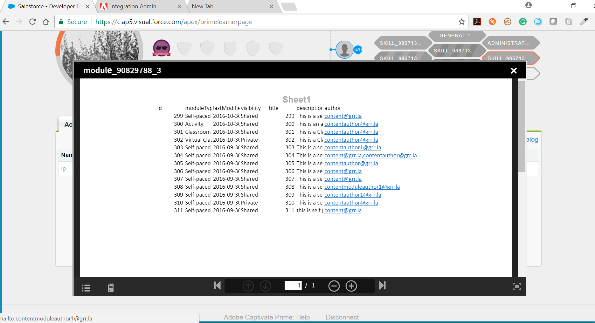

# Inbäddad fluidic-spelare

Läs den här artikeln och lär dig bädda in fluidic-spelaren i ett anpassat program.

Företag kan nu ge sina elever en anpassad upplevelse även utanför Learning Manager. Med det offentliga API:t kan du hämta all information som rör utbildningsobjekt, elevregistreringar och utbildningsframsteg och visa dem på din webbplats. Vad som är viktigare är att du även kan bädda in fluidic-spelaren i Learning Manager på din webbplats, så att eleven kan konsumera innehållet direkt på webbplatsen. Fluidic-spelaren ger dig möjlighet att spela upp allt innehåll som Learning Manager stöder. När den är inbäddad på din egen webbplats har den exakt samma funktioner som när den används i Learning Manager.

**Spela upp valfritt e-utbildningsinnehåll[&#128279;](../../learners/feature-summary/fluidic-player.md#main-pars_text_779047019)**

Fluidic-spelaren spelar upp praktiskt taget alla typer av eLearning-innehåll på samma konsekventa och intuitiva sätt utan att det krävs plugin-program eller nedladdningar. Eleven kan starta innehållet och oavsett innehållets filtyp börjar uppspelningen.

**Anteckningar och bokmärken**

Du kan göra anteckningar och bokmärka vilket innehåll som helst oavsett filtyp. Om du vill göra en viss markering från en lång fil eller video, kan du bokmärka just de punkter där du har hittat den information som är relevant för dina behov. Anteckningarna och bokmärkena kan sökas igenom eller skickas som e-post. Om du klickar på dem hamnar du i fluidic-spelaren exakt vid den punkten på videon eller sidan i dokumentet.

Mer information om fluidic-spelare finns i [Fluidic-spelare](../../learners/feature-summary/fluidic-player.md).

Här är några exempel på var du kan använda den inbäddade fluidic-spelaren.

* Du kan använda den inbäddade fluidic-spelaren på din **&#x200B; **&#x200B;webbplats för att lista de registrerade kurser för din anställda och även ge en länk för att starta en utbildning på samma sida. Det innebär att eleverna kan delta i utbildningar på intranätwebbplatsen.

* Om du bedriver utbildningsverksamhet kanske du har en webbplats där dina kunder köper kurser. Du kan integrera den inbäddade spelaren med samma webbplats så att dina kunder kan konsumera innehållet de köper på din webbplats.

## Steg för att bädda in fluidic-spelare på din webbplats {#stepstoembedfluidicplayerinyourwebsite}

Att skapa ett anpassat program för att bädda in fluidic-spelare på din webbplats innebär tre grundläggande steg:

1. Skapa ett program i integrationsadministratörsprogrammet för Learning Manager.
1. Hämta åtkomsttoken.
1. Använd åtkomsttoken för att hämta resurser från Learning Manager med offentligt API.

### 1. Skapa ett program i integrationsadministratören {#1createanapplicationinintegrationadmin}

Det här steget krävs för att skapa ett program-/klient-ID och en program-/klienthemlighet som används för att hämta uppdateringstoken och åtkomsttoken. Mer information om hur du skapar ett program finns i [Programutvecklingsprocess.](developer-manual.md#main-pars_header_994876235)

1. Gå till appen **[!UICONTROL IntegrationAdmin]** och öppna **[!UICONTROL Applications]**.

1. Välj **[!UICONTROL Register]** från sidans övre högra hörn.
1. Fönstret **[!UICONTROL Register a new application]** öppnas. Fyll i de obligatoriska fälten.
1. Om det anpassade programmet måste delas över flera konton väljer du **[!UICONTROL No]** i alternativfältet **[!UICONTROL For this account only?]**
1. Klicka på **[!UICONTROL Save]** om du vill spara programmet och generera ditt program-ID och din hemlighet.

### 2. Hämtar åtkomsttoken {#2retrievingaccesstoken}

Eftersom Learning Manager använder OAUTH2.0. krävs åtkomsttoken för att hämta resurser med hjälp av offentligt API. Åtkomsttoken kan hämtas med hjälp av uppdateringstoken, klient-ID eller klienthemlighet.

**2.1 Uppdateringstoken**

* Hämta OAuth-kod

OAuth-kod krävs för att hämta uppdateringstoken. Learning Manager omdirigerar användaren till omdirigerings-URL:en med OAuth-koden när hen loggar in med hjälp av nedanstående URL (extrahering av OAuth-kod exemplifieras i filen &quot;oauthredirect.html&quot; i exempelprogrammet):

```
code https://learningmanager.adobe.com/oauth/o/authorize  
client_id= <application_id>  
&redirect_uri=<redirect_uri>  
&state=<dummy_data>  
&scope=learner:read,learner:write  
&response_type=CODE  
&account=<account_id>  
&email=<email_id>
```

Här är **[!UICONTROL client id]** det program-id som erhölls i steg 1.
**[!UICONTROL redirect_url]** är redirect_url angivet i steg 1.
**[!UICONTROL state]** är dummydata som vi måste filtrera omdirigerings-URL utifrån för att få OAuth-kod. Omfattningen är elevens omfattning som anges i steg 1.
**[!UICONTROL response_typ]**&#x200B;e är alltid &quot;CODE&quot;.\
**[!UICONTROL account]**&#x200B;är ett valfritt fält\
**[!UICONTROL email]** är ett valfritt fält\
&#42; Om både konto-ID och e-postadress anges tillåter ovanstående URL användaren att logga in på samma konto. Det här slutpunktsexemplet visas i filen index.html i exempelprogrammet.

* Hämta uppdateringstoken

När OAuth-koden har tagits emot kan uppdateringstoken hämtas med hjälp av den mottagna OAuth-koden, klient-ID:t och klienthemligheten från slutpunkten nedan:

**https://learningmanager.adobe.com/oauth/token**

Som svar på din förfrågan om inlägg får du följande:

i. refresh_token\
ii) access_token\
iii) user_id\
iv) expires_in\
v. user_role\
vi) account_id

**2.2 Hämtar åtkomsttoken från uppdateringstoken**

Om du vill hämta din åtkomsttoken skickar du en ny begäran med din refresh_token, client_id och client_secret som postbrödtext till nedanstående URL:

**https://learningmanager.adobe.com/oauth/token/refresh**

Som svar på din förfrågan om inlägg får du följande:\
i. refresh_token\
ii) access_token\
iii) user_id\
iv) expires_in\
v. user_role\
vi) account_id

### 3. Hämta resurser med offentligt API {#3retrieveresourcesusingpublicapi}

I det tredje steget måste du använda åtkomsttoken för att hämta resurser från Learning Manager med hjälp av offentligt API.  Åtkomsttoken krävs för att genomföra ett offentligt API-anrop och måste läggas till i rubriken enligt exemplet i exempelprogrammet.

## Inbäddad spelare {#embeddableplayer}

Program från tredje part kan använda inbäddad spelare för att spela upp innehållet i ett utbildningsobjekt.

**Öppna en kurs i en inbäddad spelare**

1. Skapa en inbäddad URL

   För att öppna en kurs med en inbäddad spelare måste du skapa en inbäddad URL som visas nedan:

   `https://learningmanager.adobe.com/app/player?lo_id=<v2-api course id>&access_token=<access_token>`

   Här måste lo_id följa V2 API-kurs-id-formatet.

   Exempel: `https://learningmanager.adobe.com/app/player?lo_id=course:123456&access_token=45b269b75ac65d6696d53617f512450f`

   Certifieringar, utbildningsprogram och arbetsstöd kan också spelas upp i den inbäddade spelaren.

   Exempel: `https://learningmanager.adobe.com/app/player?lo_id=certification:12345&access_token=c1a4847dfbf4007826a027d481b93c1e`

   `https://learningmanager.adobe.com/app/player?lo_id=learningProgram:12345&access_token=c1a4847dfbf4007826a027d481b93c1e`

   `https://learningmanager.adobe.com/app/player?lo_id=jobAid:1234&access_token=c1a4847dfbf4007826a027d481b93c1e`

1. Ange den här URL:en i src-attributet för iframe.

**Stänger inbäddad spelare**

```
code window.addEventListener("message", function closePlayer(){  
   if(event.data === "status:close"){  
     //handle closing event  
   }  
});
```

## Självstudiekurs om exempelprogram {#sampleapplicationtutorial}

Det bifogade PDF-dokumentet innehåller en exempelprogramsjälvstudiekurs.
[Exempel på självstudiekurs och självstudiekurs för att bädda in fluidic-spelare.](assets/sample-applicationtutorial.zip) Alternativt innehåll

Om du är administratör kan du ställa in ditt kursmaterial så att du kan erbjuda alternativt innehåll till dina elever inom fluidic-spelaren. Om du t.ex. har elever i olika länder som kanske vill använda flera språk kan du skapa samma innehåll på flera språk. Fluidic-spelaren kommer att erbjuda eleven det språk som denne kan tänkas använda, men eleven har också möjlighet att byta till ett annat språk direkt från spelaren.

Videospecifika kontroller

Den strömningsteknik som används av Learning Manager fluidic-spelare, erbjuder videouppspelning till sina elever utan några förseningar i att starta videon, och inga krav på diskutrymme på någon enhet. Fluidic-spelaren erbjuder även smarta kontroller som uppspelningshastighet (1x, 1.5X) och skip +-10 sekunder, som är utformade för att ge eleven den exakta nivån av kontroll som de behöver för att matcha sin hastighet av inlärning.

Detta är en insats som måste göras av någon i ditt IT-team eller en extern konsult som kan bygga ett program som sedan finns på din webbplats.

1. Ändra URL:en till den inbäddade spelaren för Learning Manager med parametrar som pekar på exakt det utbildningsobjekt som måste tas.

   URL: [https://learningmanager.adobe.com/app/player](https://cpcontents.adobe.com/public/embedplayer/index22fa615ec2baa034a22090c8cd4289fa.html)

1. Använd någon av dessa parametrar för att starta en kurs:

   * Course_id : Detta är ID:t för kursen att starta
   * learning_program_id : Det här är ID:t för utbildningsprogrammet som ska startas
   * certification_id : Detta är ID:t för certifieringen som ska startas
   * lo_id : ID för utbildningsobjektet( kurs/utbildningsprogram/certifiering/arbetsstöd) att spela upp


1. Använd åtkomsttoken som en obligatorisk parameter.

   * access_token : Detta är säkerhetsparametern, använd det offentliga API:et oauth   åtkomsttoken

   Du kan få din token genom att konfigurera din inbäddade fluidic-spelare i din integrationsadministratör. Du kan få din autentiseringstoken som du kan använda som din åtkomsttoken.

   Exempel på skapad URL; https://learningmanager.adobe.com/app/player?lo_id=&quot;+lo_id+&quot;&amp;access_token=&quot;+accToken

   Här, lo_id kommer att vara ID för kursen, utbildningsprogram, certifiering och arbetsstöd.

   Exempel på lo_id - kurs:21324, learningProgram:2143, certifiering:23432, jobAid:237

1. Gör API-anrop för Learning Manager för att hämta ovanstående parametrar.

   Dessa API-anrop görs av det program som ditt IT-team/din IT-konsult ska skriva och vara värd för på din webbplats.

   Mer information om hur du använder API finns här:

   API för Learning Manager V1 - [https://learningmanager.adobe.com/docs/primeapi/v1/](https://learningmanager.adobe.com/docs/primeapi/v1/)


   API för Learning Manager V2 - [https://learningmanager.adobe.com/docs/primeapi/v2/](https://learningmanager.adobe.com/docs/primeapi/v2/)

   Objektens id skiljer sig från API:erna V1 och V2. Den inbäddade spelaren förväntar sig ID i v2-format. Använd API:et för ID-mappning i V2 för att konvertera från V1 ID till V2 ID.

   Efter att ha konstruerat URL:en, ett sätt som programmet skulle använda den för att visa för eleven är att sätta den i en iFrame. Om du klickar på den här länken öppnas fluidic-spelaren med den aktuella kursen i sitt sammanhang.

   

   Logga in på Learning Manager för att kontrollera förlopps- och slutföranderapporter.

   När eleven stänger spelaren skickar fluidic-spelaren ett &quot;stäng&quot;-meddelande till det överordnade elementet med html5 postMessage. Laddningskontrollen bör hantera meddelandet och fortsätta.

Ändra URL:en till den inbäddade spelaren för Learning Manager med parametrar som pekar på exakt det utbildningsobjekt som måste tas.

URL: [https://learningmanager.adobe.com/app/player](https://learningmanager.adobe.com/app/player)

Alla dessa parametrar kan användas för att starta en kurs:

* Course_id : Detta är ID:t för kursen att starta
* learning_program_id : Det här är ID:t för utbildningsprogrammet som ska startas
* certification_id : Detta är ID:t för certifieringen som ska startas
* lo_id : ID för utbildningsobjektet( kurs/utbildningsprogram/certifiering/arbetsstöd) att spela upp

Obligatorisk parameter:

* access_token : Detta är säkerhetsparametern, använd det offentliga API:et oauth   åtkomsttoken

Gör API-anrop för Learning Manager för att hämta ovanstående parametrar. Dessa API-anrop görs av det program som ditt IT-team/din IT-konsult ska skriva och vara värd för på din webbplats.

Mer information om hur du använder API finns här:

API för Learning Manager V1 - [https://learningmanager.adobe.com/docs/primeapi/v1/](https://learningmanager.adobe.com/docs/primeapi/v1/)


API för Learning Manager V2 - [https://learningmanager.adobe.com/docs/primeapi/v2/](https://learningmanager.adobe.com/docs/primeapi/v2/)


