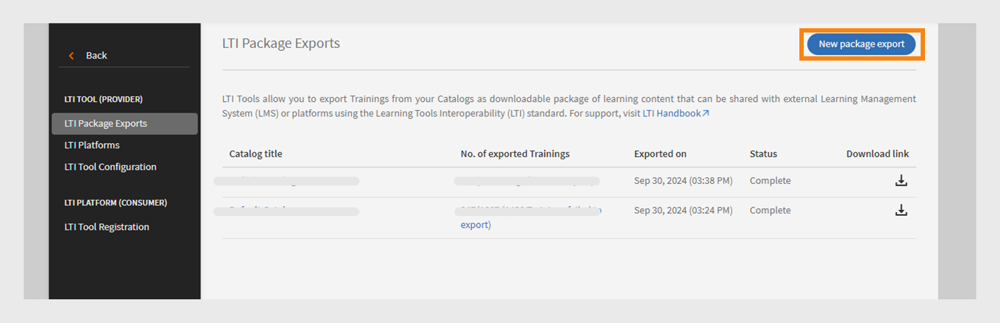

# LTI-integrering

## Vad är LTI?

Learning Tools Interoperability (LTI) är en IMS-standard för integration av utbildningsprogram i utbildningsmiljöer. Användarna kan komma åt externt utbildningsinnehåll från externa innehållsleverantörer direkt i sitt LMS utan att logga in eller gå till ett annat LMS.

## LTI-integrering med Adobe Learning Manager

Adobe Learning Manager har nu stöd för LTI version 1.3, vilket gör att det kan fungera både som verktygslåda och verktygskonsument. Den här funktionen förbättrar interoperabiliteten mellan Adobe Learning Manager och andra system för hantering av inlärning (LMS).

**LTI som verktygsleverantör**: Med LTI som verktygsleverantör kan externa system integreras med ett LMS. Adobe Learning Manager fungerar som en LTI Tool Provider, och ger andra LMS-plattformar tillgång till utbildningsobjekt från Adobe Learning Manager direkt inom sitt LMS.

**LTI som verktygskonsument**: LTI som verktygskonsument gör det möjligt för LMS att integrera externa verktyg via Learning Tools Interoperability (LTI). I detta scenario är LMS en konsument av tjänster som tillhandahålls av externa verktyg. Adobe Learning Manager fungerar som en LTI Tool-konsument och kan integrera utbildningsverktyg från tredje part så att Adobe Learning Manager-elever kan använda utbildningsobjekten från tredje parts verktyg i Adobe Learning Manager.

## Konfigurera LTI-kontakt i ALM

Följ de här stegen för att aktivera LTI-integrering i Adobe Learning Manager:

1. Logga in som **[!UICONTROL Integration Admin]**.
2. På startsidan väljer du **[!UICONTROL Applications]** > **[!UICONTROL Featured Apps]**.
3. Välj **[!UICONTROL LTI Integrations]** på sidan **[!UICONTROL Applications]**.
4. Välj alternativet **[!UICONTROL Enable LTI Integrations]** och välj **[!UICONTROL Save]**.

_Aktivera LTI-integreringar_

>[!NOTE]
>
>Du kan inte ändra eller inaktivera alternativet LTI-integreringar när det har aktiverats.

Detta skapar det nya sidofältet för LTI-integreringar i administratörskontot.

_LTI Sidebar_

En ny anpassad roll, **[!UICONTROL LTI Integration]**, har lagts till under **[!UICONTROL Account privileges]** i avsnittet **[!UICONTROL Custom Role]**. Administratörer kan tilldela användare den här rollen, vilket ger dem åtkomst till avsnittet **[!UICONTROL LTI Integration]**. Administratörer måste också bevilja **[!UICONTROL Catalogs]**-behörigheter till dessa användare för att exportera kurserna. Den här konfigurationen ger fullständig åtkomst till LTI- och katalogavsnitten för export av kurser.

_Anpassad LTI-integreringsroll_

## Adobe Learning Manager som LTI-verktygsleverantör

Som LTI-leverantör kan du med Adobe Learning Manager exportera kurser från dina kataloger som LTI-paket som kan delas med externa LMS-plattformar.

### Skapa och dela LTI-autentiseringsuppgifterna med externt LMS - administratörsarbetsflöde

Följ de här stegen för att dela LTI-autentiseringsuppgifterna med ett externt LMS:

1. Logga in som **[!UICONTROL Admin]**.
2. På startsidan väljer du **[!UICONTROL LTI Integration]** > **[!UICONTROL LTI Tool Configuration]**. Du kan se konfigurationsuppgifterna på den här sidan.
3. Administratören kan dela dessa autentiseringsuppgifter med ett externt LMS för registrering av LTI-webbplats.

   
   _Autentiseringsuppgifter för LTI-verktygskonfiguration_

   * **[!UICONTROL Token URL]**: URL:en där LMS begär en åtkomsttoken för att autentisera och auktorisera kommunikation med LTI-verktyget.
   * **[!UICONTROL Target Link URL]**: Mål-URL:en dit användare omdirigeras när LTI-verktyget startas från LMS.
   * **[!UICONTROL Public Keyset URL]**: URL:en som tillhandahåller offentliga nycklar som används för att verifiera säkerhetstoken för säker kommunikation.
   * **[!UICONTROL Redirect URL]**: URL:en som användare skickas till efter en åtgärd på LTI-verktyget. De omdirigeras vanligtvis tillbaka till LMS.

### Extern LMS-konfiguration

Med hjälp av de autentiseringsuppgifter som delas av Adobe Learning Manager-administratören registrerar den externa LMS-administratören Adobe Learning Manager och genererar autentiseringsuppgifter. Dessa inloggningsuppgifter kommer att läggas till i Adobe Learning Manager som ett sista steg i konfigurationen av Adobe Learning Manager som verktygsleverantör. Följande är de externa LMS-genererade autentiseringsuppgifterna:

* **[!UICONTROL Issuer or Platform ID]**: En unik identifierare för det LMS eller den plattform som skickar begäran om LTI-start till verktygsleverantören.
* **[!UICONTROL Client ID]**: En unik identifierare som tilldelats LTI-verktyget av LMS för auktoriseringsändamål.
* **[!UICONTROL Deployment ID]**: En identifierare som länkar en specifik LTI-verktygsdistribution till LMS för hantering av flera instanser.
* **[!UICONTROL Token URL]**: Slutpunkten där LMS begär en åtkomsttoken för att autentisera och auktorisera interaktioner med LTI-verktyget.
* **[!UICONTROL Authentication URL]**: URL:en som LMS skickar användare till för autentisering och initiering av LTI-anslutningen.
* **[!UICONTROL Public Key URL]**: URL:en som tillhandahåller den offentliga nyckel som används av LTI-verktyget för att verifiera säkerhetstoken och säkerställa säker kommunikation.

### Lägg till Adobe Learning Manager som verktygsleverantör - Administrativt arbetsflöde

Följ de här stegen för att lägga till Adobe Learning Manager som verktygsleverantör:

1. Logga in som **[!UICONTROL Admin]**.
2. På startsidan väljer du **[!UICONTROL LTI Integrations]** > **[!UICONTROL LTI Platforms]**.
3. Välj **[!UICONTROL Add]** och ange autentiseringsuppgifterna som delas av extern LMS.

   
   _Lägg till en ny LTI-plattform_

4. När alla dessa värden har lagts till väljer du **[!UICONTROL Validate]** och **[!UICONTROL Add]**.

### Exportera LTI-paket - administratörsarbetsflöde

Med LTI Tools kan du exportera utbildning från dina kataloger som ett hämtbart paket med utbildningsinnehåll som kan delas med externa system för hantering av inlärning (LMS) eller plattformar med standarden Learning Tools Interoperability (LTI).

Följ de här stegen för att exportera kursen från Adobe Learning Manager:

1. Logga in som **[!UICONTROL Admin]**.
2. På startsidan väljer du **[!UICONTROL LTI Integrations]** > **[!UICONTROL LTI Package Exports]**.
3. Välj **[!UICONTROL New package export]**.

   
   _Exportera LTI-paket_

4. Välj en katalog i listan. Du kan se listan över kurser som är tillgängliga i katalogen.
5. Välj de kurser som krävs och välj **[!UICONTROL Export as LTI]**.
6. Välj kursen för att se startlänken.
7. Välj ikonen **[!UICONTROL Download Link]** för att hämta paketet. Paketet är en zip-fil som innehåller de IMSCC-filer som har exporterats.

Med hjälp av startlänken eller IMSCC-filen kan du exportera Adobe Learning Manager-kurser till det externa LMS-systemet. Elever kan delta i Adobe Learning Manager-kurser via sitt LMS.

>[!NOTE]
>
>Om en administratör redigerar en kurs eller uppdaterar modulerna efter att ha skapat startlänken uppdateras länken automatiskt. Men om en administratör tar en kurs ur bruk efter att startlänken har skapats kommer LTI-konsumenten inte att kunna starta den indragna kursen.

## Adobe Learning Manager som LTI-konsument - administratörsarbetsflöde

Som LTI-konsument kan du använda aktivitet, verktyg, innehåll och widgetar från externa LTI-leverantörer i Adobe Learning Manager.
Om du vill lägga till Adobe Learning Manager som LTI-konsument behöver du följande autentiseringsuppgifter från den externa LTI-leverantören:

* Start-URL för inloggning
* Mållänkens URL
* Omdirigerings-URL
* Offentlig nyckeltyp

Följ de här stegen för att lägga till Adobe Learning Manager som LTI-konsument:

1. Logga in som **[!UICONTROL Admin]**.
2. På startsidan väljer du **[!UICONTROL LTI Integrations]** > **[!UICONTROL LTI Tool Registration]**.
3. Välj **[!UICONTROL Add]** > **[!UICONTROL New LTI Tool]**.

   >[!NOTE]
   >
   >Du kan importera flera LTI-verktyg genom att överföra en .csv-fil.

4. Ange ovanstående autentiseringsuppgifter från LTI-leverantören.

   
   _Lägg till ett nytt LTI-verktyg_

5. När du är klar väljer du **[!UICONTROL Validate]** och **[!UICONTROL Add]**.
6. Följande skärm visas:

   
   _Registreringsuppgifter_

7. Dela dessa autentiseringsuppgifter med LTI-leverantören för registrering. När registreringen är klar kan du hämta startlänken eller IMSCC-filen från LTI-leverantören för att importera kurserna.

### Skapa LTI-innehåll - arbetsflöde för författare

LTI-leverantörerna tillhandahåller en startlänk eller en IMSCC-fil för att lägga till sina kurser i Adobe Learning Manager. Följ de här stegen för att lägga till kurser från externt LMS:

1. Logga in som **[!UICONTROL Author]**.
2. Välj **[!UICONTROL Content Library]** > **[!UICONTROL Add]** > **[!UICONTROL LTI Module]**.

   
   _Lägg till LTI-innehåll - författare_

3. Skriv **[!UICONTROL Name]** och **[!UICONTROL Description]**.
4. Skriv **[!UICONTROL Launch Link]** och **[!UICONTROL Custom Parameters]** från LTI-leverantören.
5. Välj [!UICONTROL LTI provider] i listrutan **[!UICONTROL Tool Provider]**.
6. Sök efter och välj **[!UICONTROL Public]** i alternativet **[!UICONTROL Add to Folder]**. Detta gör kurserna tillgängliga för alla författare.
7. Välj **[!UICONTROL Save]**.
När innehållet har skapats kan du lägga till det när du skapar kursen.

### Skapa kurs med LTI-innehåll - skaparens arbetsflöde

Följ de här stegen för att skapa en kurs med LTI-innehåll:

1. Logga in som **[!UICONTROL Author]**.
2. På startsidan väljer du **[!UICONTROL Courses]** > **[!UICONTROL Add]**.
3. Skriv in **[!UICONTROL Name]** och **[!UICONTROL Description]** för kursen.
4. Välj **[!UICONTROL Add Modules]** > **[!UICONTROL Self Paced Module]** i alternativet **[!UICONTROL Modules]**.
5. Välj **[!UICONTROL LTI Content]** som du skapade och välj **[!UICONTROL Save]**.
6. Ange de obligatoriska uppgifterna, till exempel **[!UICONTROL Skills]**, **[!UICONTROL Authors]** och **[!UICONTROL Enrollment type]**.
7. När du är klar publicerar du kursen. Adobe Learning Manager-elever kan gå LTI-kurser från en extern LTI-leverantör.

## Scenarier för LTI-exportfel

Följande typer av kurser kan inte exporteras som LTI-kurser:

* **Kurs med aktivitetsmodul**: Kurser som innehåller specifika aktivitetsbaserade moduler.
* **Kurs med flera leveranstyper**: Kurser med flera leveranstyper omfattar modul i eget tempo, virtuell modul eller klassrumsmodul, aktivitetsmodul och blandad utbildning.
* **Kurs med förkunskapskrav**: Kurser som kräver förslutförande.
* **Kurs med flera registreringar**: Kurser som innehåller flera registreringar
* **Kurser med flera instanser**: Kurser som erbjuder flera leveransinstanser.

| Standardinstans | En eller flera förekomster som inte är standard | Förväntningar | Felmeddelanden |
|---|---|---|---|
| Aktiva | Inget | Exportera | Inget |
| Aktiva | Aktiva | Exportera inte | Flera instanser |
| Aktiva | Utfasad | Exportera inte | Flera instanser |
| Aktiva | Borttaget | Exportera | Inget |
| Utfasad | Inget | Exportera inte | Ta bort definitionsinstans |
| Utfasad | Aktiva | Exportera inte | Ta bort definitionsinstans, flera instanser |
| Utfasad | Utfasad | Exportera inte | Ta bort definitionsinstans, flera instanser |
| Utfasad | Ta bort | Exportera inte | Ta bort definitionsinstans |

* **Kurser med flera frågesvar**: Kurser med MQA aktiverat.
* **Kurs med instansväxling aktiverad**: kurser gör att elever kan växla mellan instanser.
* **Betald kurs**: Kurser som kräver betalning för registrering.
* **Kursens del av utbildningsvägen, certifieringen eller utbildningsplanen**: Kurserna ingår i utbildningsvägarna eller utbildningsplanerna.
* **Kurser som inte är egenregistrerade**: Kurser som är begränsade från elevens egenregistrering.
* **Klassrumskurser eller virtuella klassrumskurser**: Kurser med klassrumssessioner eller virtuella klassrumssessioner.
* **Kurser med icke-obligatoriska moduler**: Kurser som innehåller valfria eller icke-obligatoriska moduler.

_Exportstatus_

## LTI-begränsningar

Följande är LTI-begränsningar för både LTI-konsument och LTI-leverantör:

* Kan exportera blandade kurser som påverkar elevernas kursupplevelse.
* Kan exportera kurser i egen takt med klassrum, virtuella klassrum eller aktivitetsmoduler, vilket påverkar elevernas kursupplevelse.
* Kan exportera delade kurser som LinkedIn Learning och Go1-kurser.
* Kan starta kurser med tidigare registreringsdatum i ALM, vilket påverkar elevernas tillgång till och erfarenhet av kurser.
* Elever kan inte delta i LTI-kurser i iOS ALM-mobilappen, vilket påverkar kursupplevelsen.
* Elever kan inte hämta och komma åt LTI-kurser offline i ALM-mobilappen eftersom dessa kurser tillhandahålls av externa plattformar.
* Administratörer kan bara visa aktiverade kataloger och kan inte se inaktiverade kataloger.
* ALM har begränsningar för namn (63 tecken) och e-postadresser (64 tecken), vilket förhindrar åtkomst för externa LTI-elever som överskrider dessa gränser.
* Synkronisering av slutförande av kurs eller synkroniseringsfördröjningar av betyg orsakas av LTI-systemet från tredje part.
* Kurssynkroniseringsmeddelanden visas inte för Teams-elever som använder LTI-kurser via Teams-appen eller webbläsaren, vilket påverkar elevmeddelanden.
* Användardatarapporter kan inte exportera data för användare som registrerats via LTI.
* Verktygsleverantörens namn känns inte igen automatiskt när författare lägger till startlänkar i verktygskonsumenten, vilket kräver manuellt val.
* Massöverföring av verktyg via CSV kräver UTF-8-kodning för accenttecken för att undvika importfel.
* LTI-kontoadministratörer kan inte dela kurser, utbildningsvägar eller certifieringar som innehåller LTI-moduler.
* Det går inte att synkronisera om betygen när spelaren öppnas på nytt för slutförda ALM-kurser, vilket påverkar elevernas poänguppdateringar och kräver en manuell omstart.
* ALM tillåter endast aktiva användare och testanvändare att delta i LTI-kurserna.
* Synkronisering av betyg som är aktiverat i Moodle förhindrar ALM-spelaren från att starta, vilket påverkar elevernas tillgång till och upplevelse av kursen.
* LTI-fältet är ett enkelvärde och stöder inte flera värden.
* Felorsaker är inte tillgängliga när en export misslyckas under migreringen av kurser utan kärninnehåll.
* Externa LTI-kursklasser visas inte i elevens betygsutdrag och poängen visas inte på L2-quizsidan, vilket påverkar elevernas prestationsspårning.

## Bästa praxis

Vi rekommenderar att du skapar en katalog med kurser som stöder LTI för att förhindra exportfel och göra det enklare att exportera kurserna.

LTI-katalog som visar lyckad exportstatus
