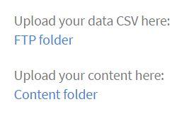

# Migreringshandbok

Referenshandbok för integrationsadministratörer som vill migrera ett befintligt LMS till Learning Manager LMS

<!-- ## Overview {#overview} -->

## Användningsscenario {#usagescenario}

I allmänhet har stora företag sina interna system för hantering av inlärning eller en leverantör som tillhandahåller äldre system för hantering av inlärning. LMS består av företagets utbildningsinnehåll och utbildningsdata. Om du är ett företag när du köper Learning Manager kanske du vill flytta ditt befintliga LMS-innehåll och -data till Learning Manager så att du kan dra nytta av fördelarna med modernt och intuitivt LMS utan att förlora någon av organisationens gamla data.

Learning Manager tillhandahåller de verktyg och specifikationer som behövs för att din organisations integrationsadministratör ska kunna konfigurera och utföra migreringsuppgifterna.

Från och med idag kan migreringsfunktionen i Learning Manager nås av en organisations administratörer genom att kontakta Adobe supportteam. Om du vill aktivera migreringsfunktionen för ditt konto kan du kontakta Adobe Learning Manager supportteam.

## Migreringsprocess {#apidescription}

Förutsättningar för migrering, viktiga steg som rör migreringsprocessen, migreringspurter, specifikationer, migrering av data och innehåll förklaras i det här avsnittet enligt följande:

### Viktig migreringsrådgivning

Du bör vara medveten om att migreringstiderna i hög grad beror på kvaliteten och storleken på dina data. Om du behöver migrera under onboarding kan du planera den här aktiviteten i god tid i förväg och samarbeta med Adobe Learning Manager onboarding-teamet för att undvika förseningar.

### Krav {#prerequisites}

Learning Manager-teamet förväntar sig att följande uppgifter utförs av organisationens integrationsadministratörer innan migreringsprocessen inleds:

* Integreringsadministratören extraherar data och innehåll från det befintliga LMS-systemet och omvandlar data till de filformat som definierats av Learning Manager.
* Learning Manager stöder inte import av användare som en del av migreringsprocessen och förväntar sig att organisationen importerar användare med hjälp av kopplingar. Adobe Systems förväntar sig att dessa anslutningar är konfigurerade före migreringsprocessen. Mer information finns i [Hjälp för Learning Manager-anslutningar](connectors.md).

Learning Manager rekommenderar att administratörer kan testa migreringsprocessen på ett testkonto innan de migrerar data och innehåll till Learning Manager-produktionsmiljön.

### Viktiga steg i migreringsprocessen {#keystepsofmigrationprocess}

De viktigaste stegen när du migrerar innehåll och data från ett befintligt LMS till Learning Manager är följande:

1. Integreringsadministratören eller integrationspartnern utvärderar befintliga LMS-data och innehåll som behöver migreras.
1. Integration Administrator utvärderar de verktyg och specifikationer som Learning Manager tillhandahåller för att hämta data och innehåll.
1. Integreringsadministratören skriver kod eller utför manuellt arbete för att exportera utbildningsdata och innehåll från det äldre LMS baserat på de funktioner som tillhandahålls av det äldre LMS.
1. När utbildningsdata och -innehåll är tillgängliga analyserar och mappar integrationsadministratören data och innehåll för att matcha migreringsspecifikationerna för Learning Manager.
1. Integreringsadministratören använder verktygen som tillhandahålls av Learning Manager för att migrera i följande ordning:

   1. Överför eleverna till Learning Manager
   1. Överför utbildningsinnehåll till Learning Manager och
   1. Till sist överför vi utbildningsdata till Learning Manager.

Organisationen kan börja använda Learning Manager LMS tillsammans med det äldre innehållet.

### Omfång för migreringsobjekt {#scopeofmigrationobjects}

Du kan bara migrera innehåll för följande utbildningsobjekt:

* Modul
* Utmärkelsetecken
* Kurs
* Modulversion
* Kursinstans
* Kursmodul
* Kompetenser
* Färdighet
* Kompetenskurs
* Certifiering
* Certifieringskurs
* Bekräfta certifiering
* Utbildningsprogram
* kurs i utbildningsprogram
* Instans för utbildningsprogram
* Kursinstans för utbildningsprogram
* Arbetsstöd
* Version av arbetsstöd
* Arbetsstödskurs
* Arbetsstödskunskaper
* Registrering
* Registrering till certifiering
* Registrering till utbildningsprogram
* Arbetsstödsregistrering
* Kursens betygsättning

### Viktiga begrepp inom migrering {#keyconceptsofmigration}

Några av de viktigaste begreppen i migreringsprocessen för Learning Manager förklaras kort så här:

**Migreringsprojekt**

I Learning Manager består ett migreringsprojekt av en eller flera sprintar. Du kan också ha flera migreringsprojekt för ditt konto. Migreringsprocessen i Learning Manager börjar med att skapa ett migreringsprojekt.

**SPRINT**

En Sprint i migreringsprocessen för Learning Manager definierar en uppsättning migreringsobjekt som du har valt att migrera från det befintliga LMS:et. Ett migreringsobjekt kan vara en kursmodul, elevposter eller ett antal kurser. Du kan ha flera utbildningsdataobjekt i en sprint. Du kan utföra migreringsjobb i varje sprint.

**SPRINT KÖRS**

Sprint Run är processen att starta ett Sprint-migreringsjobb. Du kan stoppa sprinten när som helst under en körning.

**Sprint-upprepningar**

Du kan köra ett migreringsspurt igen när som helst efter att det har slutförts. Den här situationen med rekörning eller rekörning av en sprint inträffar när du vill lägga till data i ett sprintobjekt och migrera det till programmet igen eller korrigera felen i CSV-filer.

**CSV-specifikation**

I Learning Manager finns en uppsättning med [CSV-standardspecifikationer](migration-manual.md#main-pars_header_140933605). Det bästa sättet är att gå igenom dessa CSV-specifikationer innan du börjar migrera. Integreringsadministratören för din organisation kan analysera de befintliga dataformaten och mappa dem så att de matchar de CSV-mallobjekt som Learning Manager tillhandahåller.

**Taggar för migreringsprojekt**

Adobe Systems rekommenderar att du använder en uppsättning nyckelord som taggar för att identifiera dina migreringsprojekt enkelt i Learning Manager-programmet. Med hjälp av dessa taggar kan du identifiera dina projekt internt i Learning Manager-appen vid valfri tidpunkt.

**Innehållslös modul**

Med Learning Manager kan du ladda upp en modul utan innehåll. Adobe Systems ser den som en innehållslös modul i Learning Manager. I ett scenario där du vill migrera en del av den äldre informationen från ditt befintliga LMS utan behov av något innehåll, kan du överföra filen module_version.csv utan URL-referens.

## CSV-specifikationer och CSV-exempelfiler {#csv}

Nedan hittar du specifikationerna för CSV-standardfiler som du kan använda för att mappa med befintliga LMS-migreringsdata. Klicka på csv-specifikationer och exempel-csv:er för att hämta zip-filer. Den hämtade csv-fications.zip innehåller sju Excel-arkfiler. De här Excel-arkfilerna är specifikationer med beskrivningar som hjälper dig att förstå hur du fyller upp .csv-filerna. Motsvarande .csv-filer ska innehålla data för varje fält i det föreskrivna format som förklaras i dessa .xlsx-filer.

<table border="1" cellspacing="0" cellpadding="0" width="100%">
 <tbody>
  <tr>
   <th>
    <p><b>Sl.no</b></p></th>
   <th>
    <p><b>Filnamn</b></p></th>
   <th>
    <p><b>Innehållsbeskrivning</b></p></th>
   <th>
    <p>Anteckningar</p></th>
  </tr>
  <tr>
   <td>
    <p>1</p></td>
   <td>
    <p>module.xlsx</p></td>
   <td>
    <p>Metadata för module.csv</p></td>
   <td> </td>
  </tr>
  <tr>
   <td>
    <p>2</p></td>
   <td>
    <p>badge.xlsx</p></td>
   <td>
    <p>Metadata för badge.xlsx</p></td>
   <td> </td>
  </tr>
  <tr>
   <td>
    <p>3</p></td>
   <td>
    <p>course.xlsx</p></td>
   <td>
    <p>Metadata för course.csv</p></td>
   <td>
    <p>Nämn ett författarnamn för en viss kurs eftersom flera författarnamn ibland inte visas korrekt i programmet efter migreringen. </p></td>
  </tr>
  <tr>
   <td>
    <p>4</p></td>
   <td>
    <p>module_version.xlsx </p></td>
   <td>
    <p>Metadata för module_version.csv</p></td>
   <td>
    <p>Se till att du anger URL-sökvägen till Box-kontomappen där du överförde innehållet. </p></td>
  </tr>
  <tr>
   <td>
    <p>5</p></td>
   <td>
    <p>course_instance.xlsx</p></td>
   <td>
    <p>Metadata för course_instance.csv </p></td>
   <td> </td>
  </tr>
  <tr>
   <td>
    <p>6</p></td>
   <td>
    <p>session.xlsx</p></td>
   <td>
    <p>Metadata för session.csv</p></td>
   <td>
    <p>Se till att alla poster i CSV-filen för sessionen är kopplade till minst en klassrums-/virtuell klassrumsmodul</p></td>
  </tr>
  <tr>
   <td>
    <p>7</p></td>
   <td>
    <p>course_module.xlsx</p></td>
   <td>
    <p>Metadata för course_module.csv</p></td>
   <td> </td>
  </tr>
  <tr>
   <td>
    <p>8</p></td>
   <td>
    <p>skill.xlsx</p></td>
   <td>
    <p>Metadata för skills.csv</p></td>
   <td> </td>
  </tr>
  <tr>
   <td>
    <p>9</p></td>
   <td>
    <p>skills_level.xlsx</p></td>
   <td>
    <p>Metadata för skills_level.csv</p></td>
   <td> </td>
  </tr>
  <tr>
   <td>
    <p>10</p></td>
   <td>
    <p>skills_course.xlsx</p></td>
   <td>
    <p>Metadata för skills_course.csv</p></td>
   <td> </td>
  </tr>
  <tr>
   <td>
    <p>11</p></td>
   <td>
    <p>certification.xlsx</p></td>
   <td>
    <p>Metadata för Certification.csv</p></td>
   <td> </td>
  </tr>
  <tr>
   <td>
    <p>12</p></td>
   <td>
    <p>certification_course.xlsx</p></td>
   <td>
    <p>Metadata för certification_course.csv</p></td>
   <td> </td>
  </tr>
  <tr>
   <td>
    <p>13</p></td>
   <td>
    <p>certification_commit.xlsx</p></td>
   <td>
    <p>Metadata för certification_commit.csv</p></td>
   <td> </td>
  </tr>
  <tr>
   <td>
    <p>14</p></td>
   <td>
    <p>learning_program.xlsx</p></td>
   <td>
    <p>Metadata för learning_program.csv</p></td>
   <td> </td>
  </tr>
  <tr>
   <td>
    <p>15</p></td>
   <td>
    <p>learning_program_course.xls </p></td>
   <td>
    <p>Metadata för learning_program_course.csv </p></td>
   <td> </td>
  </tr>
  <tr>
   <td>
    <p>16</p></td>
   <td>
    <p>learning_program_instance.xlsx </p></td>
   <td>
    <p>Metadata för learning_program_instance.csv</p></td>
   <td> </td>
  </tr>
  <tr>
   <td>
    <p>17</p></td>
   <td>
    <p>learning_program_instance_course_instance.xlsx </p></td>
   <td>
    <p>Metadata för learning_program_instance_course_instance.csv</p></td>
   <td> </td>
  </tr>
  <tr>
   <td>
    <p>18</p></td>
   <td>
    <p>job_aid.xlsx</p></td>
   <td>
    <p>Metadata för job_aid.csv</p></td>
   <td>
    <p>Varje migrerat job_aid kräver en eller flera versioner av job_aid.</p></td>
  </tr>
  <tr>
   <td>
    <p>19</p></td>
   <td>
    <p>Job_aid_version.xlsx</p></td>
   <td>
    <p>Metadata för job_aid_version.csv</p></td>
   <td> </td>
  </tr>
  <tr>
   <td>
    <p>20</p></td>
   <td>
    <p>job_aid_course.xlsx</p></td>
   <td>
    <p>Metadata för job_aid_course.csv</p></td>
   <td> </td>
  </tr>
  <tr>
   <td>
    <p>21</p></td>
   <td>
    <p>job_aid_skills.xlsx</p></td>
   <td>
    <p>Metadata för job_aid_skills.csv</p></td>
   <td> </td>
  </tr>
  <tr>
   <td>
    <p>22</p></td>
   <td>
    <p>enrollments.xlsx</p></td>
   <td>
    <p>Metadata för enrollments.csv</p></td>
   <td> </td>
  </tr>
  <tr>
   <td>
    <p>23</p></td>
   <td>
    <p>certification_enrollement.xlsx</p></td>
   <td>
    <p>Metadata för certification_enrollement.csv</p></td>
   <td> </td>
  </tr>
  <tr>
   <td>
    <p>24</p></td>
   <td>
    <p>learning_program_enrollment.xlsx</p></td>
   <td>
    <p>Metadata för learning_program_enrollment.csv<br><br></p></td>
   <td> </td>
  </tr>
  <tr>
   <td>
    <p>25</p></td>
   <td>
    <p>job_aid_enrollment.xlsx</p></td>
   <td>
    <p>Metadata för job_aid_enrollment.csv</p></td>
   <td> </td>
  </tr>
  <tr>
   <td>
    <p>26</p></td>
   <td>
    <p>user_course_grade.xlsx</p></td>
   <td>
    <p><br>
      Metadata för user_course_grade.csv</p></td>
   <td>
    <p>Ange nödvändiga elevdata i .csv-filen även om de inte är obligatoriska. Utan den här informationen kanske programmet Learning Manager inte återspeglar några data, även om .csv-filen bearbetas för migrering. Filen sample-csvs.zip innehåller sju .csv-filer med liknande namngivningsregler som ovan.</p></td>
  </tr>
  <tr>
   <td>
    <p>27</p></td>
   <td>
    <p>user_skills.xlsx</p></td>
   <td>
    <p><br>
      Metadata för user_skills.csv</p></td>
   <td>
    <p> </p></td>
  </tr>
 </tbody>
</table>

Learning Manager stöder endast datum- och tidsvärden i UTF 8- och 32-bitarsformat. Det kan uppstå fel under migreringen om du nämner datum i CSV-filer med ett ogiltigt datum som 2038-07-17T08:53:21.000Z eller 1980-04-17T08:13:25.322Z.

* [sample-csvs.zip](assets/sample-csvs.zip)
* [csv_fications.zip](assets/csv-specifications.zip)

Du måste vara medveten om följande beroenden av CSV-filer under importen:

* module_version.csv är beroende av module.csv
* course_instance.csv är beroende av course.csv
* course_module.csv är beroende av course.csv, module.csv och module_version.csv
* course_instance.csv är beroende av course.csv
* session.csv är beroende av course.csv och module.csv
* enrollment.csv är beroende av course.csv
* user_course_grade.csv är beroende av course.csv och module.csv
* skills_course.csv är beroende av course.csv
* skills_level.csv är beroende av skills.csv
* learning_program_instance.csv är beroende av learning_program och learning_program_course.csv
* learning_program_course.csv är beroende av learning_program.csv
* learning_program_enrollment.csv är beroende av learning_program och learning_program_instance.csv
* learning_program_instance_course_instance.csv är beroende av learning_program.csv, learning_program_instance.csv och course_instance.csv
* certification_course.csv är beroende av certification.csv och course.csv
* certification_commit.csv är beroende av certification.csv och certification_course.csv
* certification_enrollment.csv är beroende av certification.csv, certification_course.csv och certification_enrollment.csv

## Migreringsprocessen {#migrationprocedure}

Innan du börjar med migreringsproceduren är det viktigt att tänka på följande:

* Endast ett migreringsprojekt kan vara aktivt på ett konto vid en viss tidpunkt. Inom ett projekt kan endast en sprint vara aktiv vid en given tidpunkt.
* Du kan inte ångra en körning som redan pågår i migreringsprocessen. Du kan dock använda det befintliga borttagningsalternativet i varje funktion i Learning Manager för att ångra migrering av data eller innehåll.
* Så snart migreringsprojektet inleds hamnar det i ett tillstånd av &quot;Under migration&quot;. Under migreringen kan ingen annan roll än integrationsadministratörsrollen logga in på Learning Manager.

### Skapa FTP- och Box-konton {#creatingftpandboxaccounts}

Det är mycket viktigt att du planerar ditt migreringsprojekt. Vi rekommenderar att du delar upp dina projekt i flera sprintar och tydligt anger vad du vill flytta i varje sprint. Det kan till och med vara en god idé att göra en viss validering efter varje sprint för att känna sig säker på de data som migreras i den sprinten, i stället för en stor valideringsfas i slutet av projektet. Innan du börjar skriva ut som en del av ditt migreringsprojekt måste du överföra data- och CSV-innehållsfiler i FTP- respektive Box-servrar. Om du inte har några konton för anpassad FTP och Box kan du skapa dem.

<!--**Create FTP account**-->

<!--Click **[!UICONTROL Request for CSV FTP folder]**. A pop-up dialog appears prompting you to enter your e-mail id. Go through online instructions and create an FTP account. As soon as you create your account, you can view your migration project and sprint project folders in FTP. 

A sample snapshot of project files and folder of FTP is shown below for your reference. -->

<!---->

**Skapa Box-konto**

Skapa en mapp för innehållsöverföring i en liknande process som följer för att skapa FTP-mappar. Klicka på Migrering i den vänstra rutan och klicka på Begär en mapp för överföring av innehåll längst ned på sidan som visas.

Du skulle få ett e-postmeddelande från Box med en länk till den delade mappen. Om du inte har ett Box-konto klickar du på Registrera dig och skapar ett konto. Inloggningsinstruktioner skickas till e-post-ID för integreringsadministratören.

**Överför data (.csv-filer) till FTP-mappar eller Box-mappar**

Du måste skapa ett FTP- eller Box-konto innan du skapar ett migreringsprojekt. Så i det här skedet kan du skapa ett migreringsprojekt och Sprint i Learning Manager-programmet.  Se avsnittet **Procedur för data- och innehållsmigrering** på den här sidan om du vill skapa migreringsprojekt.

I FTP- eller Box-kontot klickar du på namnet på projektmappen och sedan på namnet på utskriftsbilden. I mappen sprint kan du överföra de .csv-datafiler som du tänker migrera. Om du vill överföra klickar du på knappen Överför filer högst upp i FTP- eller Box-servern och släpper .csv-filerna. En exempelögonblicksbild efter överföring till FTP visas nedan som referens.

<!---->

Du kan komma tillbaka till Learning Manager-migreringsprojektet, klicka på **[!UICONTROL Refresh]** och visa alla .csv-datatyper som listas i migreringssprutan.

**Överföra utbildningsinnehåll till innehållsmappar**

Överför utbildningsinnehållet för ditt befintliga LMS till ditt Box-konto. Om du redan har skapat migreringsprojektet och sprintar fylls migreringsprojektet och sprintnamnet i Box-kontot. Du kan överföra innehållet på samma sökväg. Se avsnittet **Procedur för data- och innehållsmigrering** på den här sidan om du vill skapa migreringsprojekt.

Du kan dra och släppa innehållsfilerna eller klicka på **[!UICONTROL Upload]** och välja filerna från skrivbordet. Om filstorleken för ditt innehåll är stor kan du uppleva en viss fördröjning vid överföring av filerna. Beroende på filens storlek varierar den tid det tar att överföra filerna till ditt Box-konto.

En exempelögonblicksbild av Box-kontot efter att ha överfört innehåll till det visas nedan som referens:


*Filer i Box-konto*

När filerna har överförts till ditt Box-konto ser du till att du nämner den relativa sökvägen för Boxs innehållsfil i module_version.csv -filen. Det här är ett obligatoriskt steg där du måste ange sökvägen till modulinnehållet.

När du har loggat in på FTP- och Box-servrarna och överfört innehållet, visas CSV-platserna som i ögonblicksbilden nedan i Learning Manager.



*CSV-platser i Box-kontot*

## Förfarande för migrering av data och innehåll {#dataandcontentmigrationprocedure}

Proceduren för att migrera dina Enterprise LMS-data och -innehåll till Learning Manager beskrivs nedan:

Gå igenom förutsättningarna för migreringsprocessen innan du börjar med migreringen. Se avsnittet [CSV-specifikationer och CSV-exempelfiler](migration-manual.md#main-pars_header_140933605) på den här sidan och förbered CSV-filerna för data- och innehållsmigrering.

1. Logga in på Learning Manager-programmet som en integrationsadministratör och klicka på **[!UICONTROL Migration]** i den vänstra rutan.

   Startsidan för Migreringsprojekt visas. Om din organisation redan har skapat migreringsprojekt kan du visa listan över alla migreringsprojekt på den här sidan.

1. Klicka på **[!UICONTROL New]** i det övre högra hörnet på sidan för att skapa ett migreringsprojekt. Du kan också klicka på länken **[!UICONTROL Create a migration project]** på sidan för att skapa ett migreringsprojekt. Sidan Skapa ett migreringsprojekt visas.

   Om du inte redan har skapat en FTP-mapp kommer du att uppmanas att skapa en FTP-mapp i kontot. Det här är ett obligatoriskt steg innan du börjar skapa ett migreringsprojekt.

   
   *Skapa FTP-mapp*

   Ange projektnamnet, projekttaggen, kurskatalogen och beskrivningen för ditt migreringsprojekt. Klicka på **[!UICONTROL Create]**.

   Migreringsdataobjekten identifieras med den här migreringsprojekttaggen. Om du inte har någon specifik kurskatalog väljer du standardkatalogen i listrutan. Alla kurser som du migrerar med ett migreringsprojekt inkluderas i katalogen som du väljer i det här skedet. Om du inte väljer någon katalog kommer alla migrerade kurser att bli en del av standardkatalogen.

1. Sidan Konfiguration av utskrift visas som i följande ögonblicksbild. Du måste skapa ett språng som en del av migreringsprojektet. Välj Sprintnamn och en kort beskrivning av sprinten. Du kan välja Ja om du vill migrera innehåll som en del av det här steget. Klicka på **[!UICONTROL Next]**.

   
   *Sprintmigrering*

   Markera kryssrutan med titeln **Användare har lagts till eller ändrats sedan den senaste körningen** för att synkronisera listan med användare med Learning Manager-programmet. Om du migrerar innehåll och data till Learning Manager-appen kanske detta inte krävs. Men om det finns ett tidsintervall mellan din tidigare spurtmigrering till den senaste spurtmigreringen är det bästa praxis att du väljer att synkronisera användarlistan. Det här steget gör att Learning Manager-databasen kan synkroniseras med dina LMS-användare.

   Det här synkroniseringssteget rekommenderas när enrollment.csv och user_course_grade.csv migreras. Det här steget gör att Learning Manager-databasen kan synkroniseras med din migreringsdatabas och säkerställer att alla användare vars poster ska migreras i Sprint är tillgängliga i migreringsdatabasen.

1. Du kan starta Sprintmigreringen med dina överförda data och ditt innehåll. Klicka på länken **[!UICONTROL Refresh]** innan du startar Sprint Run för att synkronisera FTP- och innehållsmapparna med Learning Manager-programmet.

   
   *Starta migrering av sprint*

   Klicka på **[!UICONTROL Start]** längst upp till höger på sidan. Du kan klicka på **[!UICONTROL Stop]** när som helst under utskriftsmigreringsprocessen för att avbryta utskriftsmigreringen.

   Migreringsstatusen visas för alla utskriftsdataobjekt och -innehåll. Kontrollera antalet lyckade och misslyckade objekt som en del av migreringspurten.

   Om du överför modulinnehåll kontrollerar du att sökvägen till innehållsmappen finns i module_version.csv. Om du missar det här steget kan du stöta på fel under migreringen. Om du till exempel överför innehåll i moduler, som videor, i egen takt måste du ange en relativ sökväg till Box-URL i module_version.csv. För innehåll i modulen Aktivitet kan du ange URL-namnet.

   En ögonblicksbild av förloppsdialogrutan visas nedan som referens. Som visas i ögonblicksbilden kan du visa antalet poster som har bearbetats för varje migreringsdataobjekt tillsammans med status för slutförda och misslyckade objekt. Klicka på Hämta felloggar vid de misslyckade objekten för att hämta och visa felloggarna. Du kan åtgärda problemen i CSV-filen och överföra dem igen via FTP.

   
   *Visa sprintförlopp*

   Klicka på Sprint list i den vänstra rutan om du vill visa listan över alla sprintar i ett migreringsprojekt. Du kan se en lista över alla sprintar, antalet sprintar du utförde för varje sprint, startdatum, varaktighet och slutförandestatus enligt exemplet nedan.

   
   *Visa listan över sprintar*

1. När du har överfört de senast uppdaterade CSV-filerna kan du klicka på Kör igen längst upp till höger på sidan. Alla dataobjekt bearbetas igen och de objekt som inte har ändrats ignoreras. När du är nöjd med migreringen av dataobjekt i en sprint kan du markera vårmigreringen som slutförd genom att klicka på knappen högst upp på sidan. Du kan starta en ny spurt med fler dataobjekt senare. När en utskrift har markerats som slutförd kan du inte köra den igen. På samma sätt kan du i ett migreringsprojekt ha valfritt antal sprintar. När du är nöjd med migreringsstatusen för alla sprintar kan du markera migreringsprojektet som slutfört genom att klicka på länken **Markera projektet som slutfört** på sidan Sprintlista.

   Innan du markerar migreringsprojektet som slutfört måste du se till att alla sprintar i projektet är slutförda. När du har markerat migreringsprojektet som slutfört kan du inte gå tillbaka och skapa sprintar i det projektet eller göra ändringar i det. Du måste skapa ett annat migreringsprojekt och lägga till sprints.

## Migreringsverifiering {#registration}

När du har migrerat utbildningsdata och -innehåll från organisationens äldre LMS kan du verifiera importerade data och innehåll med hjälp av olika funktioner i utbildningsobjekt. Du kan till exempel logga in som administratör på Learning Manager-programmet och kontrollera tillgängligheten för importerade moduler och kursdata och -innehåll.

## Migrering med API

Adobe Learning Manager (ALM) tillhandahåller en migreringsfunktion för att hämta data eller innehåll från externa system, som främst används för migrering från äldre LMS-plattformar.

Vissa organisationer kan dock kräva att den här processen körs regelbundet (t.ex. varje natt eller vecka) i stället för som en engångsimport.

Ett exempel är hur en fiktiv kund (NovaFX) kan integreras med en fiktiv extern leverantör (SquareCorp) och automatiserar schemalagda migreringar. Integreringen möjliggör:

* SquareCorp-kurser visas som utbildningsobjekt i ALM för NovaFX-elever.
* NovaFX spår elevframsteg för SquareCorp-värdbaserade kurser direkt i ALM.

### Integreringskrav

SquareCorp måste ange:

* Metadatainformation för kurs: Ett API för att dela kursmetadata som NovaFX har tillgång till.
* Information om förloppsdata: Ett API för att regelbundet dela information om elevframsteg och slutförande.

### Nyckeldefinitioner

* **Aktivt projekt:** Ett projekt är aktivt om det är &quot;Pågår&quot; eller &quot;Initierat&quot;.
* **Aktiv sprint:** En sprint är aktiv om den är &quot;Pågår&quot; eller &quot;Initierad&quot;.

### Automatisera sprintkörningen

Skapa ett program eller skript som utför följande enligt ett schema:

1. Hämta kursmetadata, användarregistreringar och elevbetyg från SquareCorp.
2. Generera CSV-filerna.
3. Överför filerna till Box eller FTP.
4. Utlös sprinten med hjälp av migrerings-API:er.

### API-information

#### Starta en migreringskörning

**Slutpunkt:** POST /primeapi/v2/bulkimport/startrun

Parametrar:

* **lockaccount (booleskt):** Parametern anger om kontot ska låsas när körningen påbörjas. Som standard är värdet false. Användarna bör undvika att använda den här parametern om det inte finns en giltig anledning att låsa kontot.
* **Katalog-ID (heltal):** Med den här parametern kan du välja målkatalogen under migreringen. Den ställs vanligtvis in när migreringsprojektet skapas, men kan justeras för enskilda körningar. När katalog-ID ändras kommer utbildningsobjekt som läggs till i framtida körningar att placeras i den senast valda katalogen. Om det är nödvändigt att gå tillbaka till den katalog som valdes när migreringsprojektet skapades måste detta också specificeras uttryckligen.
* **migrationProjectId (heltal):** Parametern behövs för att utlösa ett specifikt migreringsprojekt när flera API-aktiverade körningar är aktiverade på kontot.

#### Kontrollera om synkningen kan börja

Se till att innehållet kan synkroniseras till mappen sprint. Kopiera inte innehåll eller metadatafiler till FTP-mappen om inte detta API returnerar ett framgångsrikt svarsobjekt.

**Slutpunkt:** GET /primeapi/v2/bulkimport/cansync

Parametrar:

* **migrationProjectId (heltal)** Parametern behövs för att utlösa ett specifikt migreringsprojekt när flera API-aktiverade körningar är aktiverade på kontot.

<b>Svaret lyckades</b>

```
{  
    "status": "OK",  
    "title": "BULKIMPORT_CAN_SYNC_NOW",  
    "source": {  
        "info": "Yes"  
    }  
} 
```

<b>Svaret lyckades</b>

```
{ 
    "status": "BAD_REQUEST", 
    "title": "BULKIMPORT_ERROR_CANNOT_SYNC", 
    "source": { 
        "info": "Error, No active projects" 
    } 
} 
```

<b>Möjliga API-svar</b>

| Åtgärd | Typ | Meddelande |
| ------------------------------------- | ------- | ------------------------------------------------------------------------------------- |
| BULKIMPORT_RUN_INITIATED_SUCCESSFULLY | Slutfört | Körningen har initierats |
| BULKIMPORT_ERROR_CANNOT_INITATE_RUN | Fel | En körning pågår |
| BULKIMPORT_ERROR_CANNOT_INITATE_RUN | Fel | Det finns fler än ett aktivt projekt |
| BULKIMPORT_ERROR_CANNOT_INITATE_RUN | Fel | Det finns mer än en sprint |
| BULKIMPORT_ERROR_CANNOT_INITATE_RUN | Fel | Inga aktiva projekt |
| BULKIMPORT_ERROR_CANNOT_INITATE_RUN | Fel | Inga aktiva sprintar |
| BULKIMPORT_ERROR_CANNOT_INITATE_RUN | Fel | Den angivna katalogen är antingen inte ett giltigt ID eller tillhör inte det primära kontot |
| BULKIMPORT_CAN_SYNC_NOW | Info | Kan synkroniseras nu |
| BULKIMPORT_ERROR_CANNOT_SYNC | Fel | En körning pågår |
| BULKIMPORT_ERROR_CANNOT_SYNC | Fel | Det finns fler än ett aktivt projekt |
| BULKIMPORT_ERROR_CANNOT_SYNC | Fel | Det finns mer än en sprint |
| BULKIMPORT_ERROR_CANNOT_SYNC | Fel | Inga aktiva projekt |
| BULKIMPORT_ERROR_CANNOT_SYNC | Fel | Inga aktiva sprintar |
| BULKIMPORT_ERROR_CANNOT_SYNC | Fel | Det finns inga giltiga filer i mappen |

### Exempel på integrationsflöde

1. Kontrollera Cansync API.
2. Generera och överför CSV-filer.
3. Starta sprinten med start-API:et.
4. Övervaka svar och hantera fel.

### Begränsningar

Migrerings-API:erna tillhandahåller inte funktioner för att kontrollera migreringsrelaterade fel direkt i CSV-utdatafilen efter utskriftskörning. Dessa fel kan dock granskas som rader i CSV-filen genom att integreringsadministratörens användargränssnitt öppnas efter en utskriftskörning.

### Migreringsverifiering via API:er

Med migrerings-API:t `runStatus` kan integreringsadministratörer spåra förloppet för migreringskörningar som utlösts via API:t.

API:et `runStatus` tillhandahåller också en direktlänk för att hämta felloggar i CSV-format för slutförda körningar. Hämtningslänken är aktiv i sju dagar och loggarna sparas i en månad.

**Exempel på curl**

**Slutpunkt**

```
GET /bulkimport/runStatus
```

**Parametrar**

* **migrationProjectId**: (obligatoriskt). En unik identifierare för ett migreringsprojekt. Ett migreringsprojekt används för att överföra data och innehåll från ett befintligt system för hantering av inlärning (LMS) till Adobe Learning Manager. Varje migreringsprojekt kan bestå av flera sprintar, som är mindre enheter för migreringsuppgifter.

* **sprintId**: (obligatoriskt). En unik identifierare för ett sprint inom ett migreringsprojekt. Ett språng är en delmängd migreringsuppgifter som omfattar specifika utbildningsobjekt (t.ex. kurser, moduler och elevposter) som ska migreras från ett befintligt LMS till Adobe Learning Manager. Varje sprint kan utföras oberoende av varandra, vilket möjliggör en stegvis migration.

* **sprintRunId**: (obligatoriskt). En unik identifierare som används för att spåra körningen av ett specifikt sprint inom ett migreringsprojekt. Det är kopplat till den faktiska migreringsprocessen för de objekt som definieras i en sprint. SprintRunId hjälper till att övervaka, felsöka och hantera migreringsjobbet.

**Svar**

```
{
  "sprintId": 2510080,
  "sprintRunId": 2740845,
  "migrationProjectId": 2509173,
  "startTime": 1746524711052,
  "endTime": 1746524711052,
  [
    {
      "id": 2609923,
      "lastHeartbeatTime": 1746524711052,
      "objectName": "content",
      "jobState": "COMPLETED",
      "errorCsvLink": "",
      "errorLogLink": "migration/5830/2509173/2510080/2740845/content_err.csv",
      "sequenceNumber": 1
    },
    {
      "id": 2609922,
      "lastHeartbeatTime": 1746524713577,
      "objectName": "course",
      "jobState": "WAITING_IN_QUEUE",
      "errorCsvLink": "",
      "errorLogLink": null,
      "sequenceNumber": 2
    }
  ]
}
```

Dessutom innehåller API-svaret `startRun` nu migreringsprojektets ID, sprint-ID och sprint-körnings-ID, som krävs för att fråga den nya statusslutpunkten.

```
curl -X GET --header 'Accept: text/html' 'https://learningmanager.adobe.com/primeapi/v2/bulkimport/runStatus?migrationProjectId=001&sprintId=10001&sprintRunId=7'
```

Ger följande svar. Svaret innehåller:

* `migrationId`
* `sprintId`
* `sprintRunId`

**Svar**

```
{
  "status": "OK",
  "title": "BULKIMPORT_RUN_INITIATED_SUCCESSFULLY",
  "source": {
    "info": "Success",
    "migrationInfo": {
      "migrationProjectId": "001",
      "sprintId": "10001",
      "sprintRunId": "7"
    }
  }
}
```

## Eftermontering i migrering {#retrofittinginmigration}

Med den här integreringsfunktionen kan du anpassa historiska data för ett utbildningsobjekt från ett äldre system för hantering av inlärning till en aktiv kurs som skapas i Learning Manager.

Nedan hittar du specifikationerna för CSV-standardfiler som du kan använda för att mappa med befintliga LMS-migreringsdata. Klicka på csv-specifikationer och exempel-csv:er för att hämta zip-filer. Den hämtade csv-fications.zip innehåller fyra Excel-arkfiler. De här Excel-arkfilerna är specifikationer med beskrivningar som hjälper dig att förstå hur du fyller upp .csv-filerna. Motsvarande .csv-filer ska innehålla data för varje fält i det föreskrivna format som förklaras i dessa .xlsx-filer.

1-enrollment.xlsx-innehåller beskrivningar av metadata som krävs för retrofit_enrollment.csv-filen.

2-certification_enrollment.xlsx-innehåller beskrivningar av metadata som krävs för retrofit_certification_enrollment.csv-filen.

3-learning_program_enrollment.xlsx-innehåller beskrivningar av metadata som krävs för filen retrofit_learning_program_enrollment.csv.

4-user_course_grades.xlsx-innehåller beskrivningar av metadata som krävs för retrofit_user_course_grades.csv-filen.
[csv-fications.zip](assets/csv-specifications.zip)

>[!NOTE]
>
>UUID (Universally Unique Id) är också en kolumn i CSV-filen för migrering.


## Felsöka migreringsproblem {#troubleshootingmigrationissues}

Läs den här [artikeln](../../kb/troubleshooting-migration.md) om du vill veta mer om hur du löser de problem som integrationsadministratörer möter när de migrerar data och innehåll från sina befintliga LMS till Learning Manager-programmet.

## Tips för användarhantering {#usermanagement}

I det här avsnittet hittar du några av tipsen som hjälper dig att förstå hur användare beaktas och hanteras i Learning Manager. Dessa koncept skulle hjälpa dig att hantera användarna bättre när du använder CSV-import, kopplingar och migreringsfunktioner i Learning Manager.

## ID för Learning Manager {#captivateprimeids}

I Learning Manager finns två typer av unika ID:n för användare:

* Mejl-ID
* UUID (universellt unikt ID)

Learning Manager har stöd för UUID för att ge organisationer flexibilitet när det gäller att kontrollera användarkonton. Om du som administratör har ett UUID för användare på ett konto kan du ändra e-postadresserna för användarna för det kontot.

**Användningsscenario för UUID i en organisation**

Tänk dig ett scenario där en anställd A går med i ett företag som heter Learning Manager, som uppdragstagare. Under avtalsperioden kan Learning Manager-företaget inte tillhandahålla företagets e-post-ID som ```A@example.com```, i stället kan företaget endast överväga medarbetarens personliga e-postkonto, till exempel ```A@gmail.com```. Efter att ha slutfört sex månaders avtalstid kan Learning Manager vilja ändra sitt e-post-ID till företagets e-post-ID om samma anställd A ansluter till Learning Manager som heltidsanställd: ```A@example.com```.

Om du har UUID-åtkomst till användarkontot kan företaget Learning Manager dra nytta av ovanstående scenario. Learning Manager-företaget kan enkelt ersätta den personliga e-post-id för medarbetare A med ett officiellt e-post-id. Medarbetarens poster som är relevanta för det här kontot påverkas inte av den här ändringen.

## Identifiering av en enskild användare {#singleuseridentification}

Learning Manager identifierar och kommer ihåg hur en enskild användare läggs till i den, t.ex. genom självregistrering, med CSV-uppladdning, eller en enskild användare som lagts till med hjälp av användargränssnittet eller med API.

* Om en enskild användare läggs till med hjälp av användargränssnittet eller API:et kan du ta bort en sådan typ av enskilda användare med hjälp av användargränssnittet eller API:et.
* Du kan uppdatera enskilda användare med CSV-uppladdningsprocessen, men du måste komma ihåg att dessa enskilda användare behandlas som CSV-användare och att CSV-arbetsflödena gäller sådana användare.

## Tilldela chefsroll {#assigningmanagerrole}

Du kan inte tilldela en chefsroll direkt till någon användare i Learning Manager. En användare X kan bara bli en Learning Manager-hanterare när du anger ett Manager-attribut för en användare (till exempel Y) i kontot som X.

I ett scenario där X är chef för användare, till exempel A, B och C, måste du se till att chefsattributet för A, B och C är inställt på den nya chefen om X lämnar organisationen. Du kan också ställa in chefsattributet för dessa användare som ROOT tillfälligt och tilldela med det nya chefsnamnet senare.

Mer information om det här avsnittet finns i följande hjälpinnehåll:

* [Vanliga frågor om överföring av CSV-filer](/help/migrated/administrators/feature-summary/add-users-user-groups.md#bulk-upload-internal-users/)
* [Funktionshjälp för att lägga till användare](/help/migrated/administrators/feature-summary/add-users-user-groups.md)
