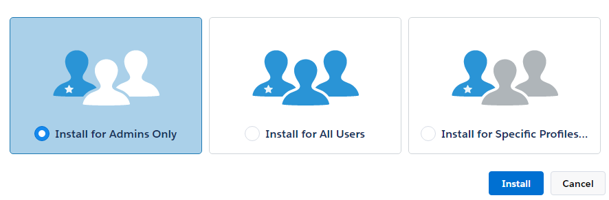
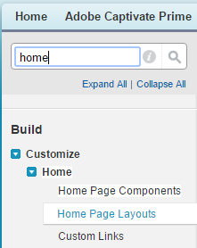

# Learning Manager-app för Salesforce

## Översikt {#overview}

Salesforce™ är en av de mest populära CRM-lösningarna bland försäljnings- och marknadsföringsteam. Med hjälp av Adobe Learning Manager-appen i Salesforce kan du låta dess användare komma åt allt sina utbildningsinnehåll direkt från Salesforce-gränssnittet. Användare kan komma åt sitt tilldelade utbildningsinnehåll som kurser, utbildningsprogram, arbetsstöd och så vidare från Salesforce. Användarna kan också få meddelanden om sina registreringar och meddelanden från administratören.

För närvarande är Salesforce-programmet inte tillgängligt eftersom godkännandet väntar från Salesforce App Exchange. Om du vill förhandsgranska betaversionen av programmet kontaktar du den kontoansvariga eller Learning Manager-supportteamet.

## Installation och konfiguration {#installationandsetup}

Lär dig att installera och konfigurera Learning Manager-appen för Salesforce genom att följa stegen nedan.

### Krav {#prerequisites}

1. Integreringsadministratören för din organisation måste godkänna Salesforce-programmet. Det här programmet finns i avsnittet med utvalda program i Learning Manager-programmet för rollen integrationsadministratör.
1. Åtkomst till organisationens Salesforce-konto, där programmet måste installeras. Vanligtvis är Salesforce-administratören i din organisation den person som installerar sådana program. Om du är integrationsadministratör för Learning Manager och inte har ett Salesforce-konto kontaktar du Salesforce-administratören för din organisation.

### Installationssteg {#installationsteps}

1. Be din kontohanterare eller kundansvariga att aktivera ditt konto för användning av den här appen genom att ange ditt konto-ID för Learning Manager. Be också om CSM för det installerbara paketet i Learning Manager Learning-elevappen för Salesforce.

1. Logga in på ditt Learning Manager-konto som integreringsadministratör och se till att Salesforce-programmet är aktiverat för ditt konto.

1. För att installera Learning Manager-appen i ditt Salesforce-konto ska du använda det installerbara paketet som tillhandahålls av din kontohanterare eller kundansvariga. Du måste ha administratörsbehörighet för Salesforce-kontot där du tänker installera programmet.

1. Välj det alternativ som visas på ögonblicksbilden och klicka på **[!UICONTROL Install]**.

   

   *Välj alternativet Installera endast för administratörer*

   Om du väljer **Installera för specifika profiler** väljer du en eller flera profiler från listan.

1. Klicka **[!UICONTROL Continue]** i popup-fönstret som verkar bekräfta åtkomst från tredje part.

   Ett meddelande visas som bekräftar att appen har installerats korrekt. Klicka **Klar**.

## Lägg till meddelandekomponent på startsidan {#addnotificationcomponenttothehomepage}

Learning Manager-teamet rekommenderar att Salesforce-administratören även lägger till Learning Manager-meddelandekomponenten till startsidans layout. Med den här komponenten kan Salesforce-användare få meddelanden om tilldelningar och andra meddelanden från Learning Manager, även när de inte befinner sig i elevappens sammanhang.

Så lägger du till Learning Manager-meddelandekomponenten i layouten på startsidan:

1. Klicka **[!UICONTROL Setup]** längst upp till höger. Alternativet för layout för startsida visas i den vänstra rutan som i ögonblicksbilden nedan.

   

   *Välj layout för startsida*

1. Välj önskad layout och klicka på **[!UICONTROL Edit]**.
1. Markera Adobe Learning Manager-aviseringsalternativet som visas på sidan och klicka på **[!UICONTROL Next]**.
1. Välj ordning på komponenterna som visas i den vänstra rutan, förhandsgranska och klicka på **[!UICONTROL Save]**.

För att lära dig instruktioner om hur du loggar in i Learning Manager-appen och använder den i Salesforce som elev, se [Hjälpinnehåll för Salesforce-program](../../learners/feature-summary/sfdc-app.md).
