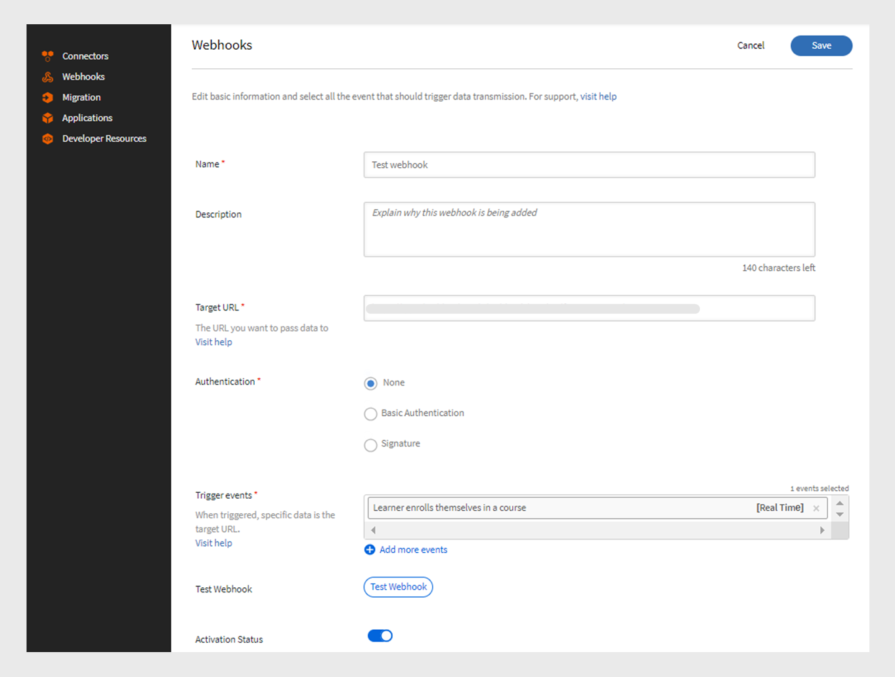

# Webhooks

Med en webhook kan en enhet automatiskt skicka realtidsdata eller meddelanden till en annan enhet när en specifik händelse inträffar. Det kommer att göra det möjligt för ett program att förse andra program med information utan att ständigt begära det. Om en användare till exempel slutför en kurs i LMS (Learning Management System) kan en webhook automatiskt skicka den informationen till en annan plattform, till exempel ett CRM- eller rapporteringsverktyg. Webhooks används ofta i integreringar för att automatisera processer och minska behovet av manuella uppdateringar mellan system. Konfigurera webhooks genom att ange en återanropsadress som du vill skicka data till.

## Webhooks jämfört med API:er

Webhooks och API:er hjälper båda system att kommunicera med varandra, men de fungerar på olika sätt. Med API:er delas informationen bara när användaren begär den. Om en elev till exempel behöver data om kursförlopp skickar hen en begäran till API:t, som sedan tillhandahåller informationen. Å andra sidan skickar webhookar automatiskt data omedelbart när en händelse inträffar. Om en elev till exempel slutför en kurs kommer den att skicka data omedelbart till avlyssnarens URL utan några manuella begäranden.

## Vad är API:er i realtid?

Med API:er i realtid kan program direkt utbyta data när en händelse inträffar. Till skillnad från traditionella API:er, som väntar på att en användare ska begära information, delar API:er i realtid data så fort det sker. Webhooks fungerar som ett API i realtid och hjälper till att dela data omedelbart när den angivna händelsen inträffar. Real-time API ser till att denna dataöverföring sker omedelbart utan att någon manuell begäran behövs, vilket gör att systemen kan hållas uppdaterade omedelbart.

## Webhook-händelser

Webhook-händelser är specifika åtgärder som sker i ett system som automatiskt skickar data till en avlyssnar-URL. När en elev till exempel registrerar sig för en kurs utlöses en webhook-händelse och skickar registreringsinformationen till lyssnarens URL.
Webhook-händelser delas in i två kategorier:

* **Realtidshändelser**: Händelser bearbetas och skickas i realtid till ett mål-URL
* **Icke-realtidshändelser**: Händelser bearbetas i grupper och skickas vid angivna tider i stället för i realtid

## Lyssnar-URL

En Avlyssnar-URL är en slutpunkt eller ett mål som tar emot datainformation när en händelse inträffar. När en specifik händelse inträffar, t.ex. en användare som registrerar sig för en kurs, skickar systemet automatiskt informationen till denna URL utan någon manuell begäran. Lyssnar-URL:en är den adress där alla dessa uppdateringar levereras.
Webhook skickar relevant information i ett JSON-format. Här är ett exempel på nyttolast för en händelse som utlösts i Adobe Learning Manager:

```
{
  "accountId": 1010,
  "events": [
    {
      "eventId": "d5fb7071-10a9-46b2-9f9e-79dde346c052",
      "eventName": "COURSE_ENROLLMENT_BATCH",
      "timestamp": 1727414643000,
      "eventInfo": "1727414643000-047210-84242-0",
      "data": {
        "userId": 4279332,
        "loId": "course:7374992",
        "loInstanceId": "course:7376092_10250977",
        "loType": "course",
        "enrollmentSource": "ADMIN_ENROLL",
        "dateEnrolled": 1727414643
      }
    }
  ]
}
```

## Skapa och hantera webhookar - integrationsadministratör

Följ stegen nedan för att skapa webbhooks-integrering i Adobe Learning Manager:

1. Logga in som **[!UICONTROL Integration Admin]**.
2. På startsidan väljer du **[!UICONTROL Webhooks]** > **[!UICONTROL Add Webhook]**.

   
   _Lägg till en webhook_

3. Ange **[!UICONTROL Name]** och **[!UICONTROL Description]** för webhooken.
4. Ange avlyssnarens URL som **[!UICONTROL Target URL]** där du vill skicka händelsedata.
5. Välj någon av autentiseringsmetoderna:
Autentisering i webbhookar är en säkerhetsmetod för att säkerställa att data som skickas till en avlyssnar-URL kommer från en betrodd källa.
   * **[!UICONTROL None]**: Ingen autentisering krävs.
   * **[!UICONTROL Basic]**: Det här är autentiseringsbaserad. Ange användarnamn och lösenord.
   * **[!UICONTROL Signature]**: Systemet skapar en speciell signatur och lägger till den i webhook-data. Den mottagande servern kontrollerar koden för att se till att data är verkliga och inte har ändrats. Generera en signatur och använd den för autentisering. Hämta signaturen som JSON.
6. Välj webhook-händelser från listrutan **[!UICONTROL Trigger events]**.

   >[!NOTE]
   >
   >Du kan även testa webhookarna genom att markera alternativet Testa webhookar på sidan Lägg till webhook.

7. Välj växlingsknappen **[!UICONTROL Activation Status]** för att aktivera webhooken. När det har aktiverats skickas data när de markerade händelserna inträffar.

>[!NOTE]
>
>Du kan skapa och hantera upp till fem webbhookar.

### Redigera webbhookar - integrationsadministratör

Så här redigerar du webhookar från Adobe Learning Manager:

1. Logga in som **[!UICONTROL Integration Admin.]**
2. Välj **[!UICONTROL Webhooks]** på startsidan.
3. Välj den webhook du vill redigera.

   
   _Redigera webhooken_
4. Välj **[!UICONTROL Edit]** för att ändra webhookens information och välj **[!UICONTROL Save]**.

### Ta bort webbhookar - integrationsadministratör

Så här redigerar du webhookar från Adobe Learning Manager:

1. Logga in som **[!UICONTROL Integration Admin]**.
2. Välj **[!UICONTROL Webhooks]** på startsidan.
3. Välj den webhook som du vill ta bort.
4. Välj **[!UICONTROL Delete]** för att ta bort webhooks.


_Ta bort webhook_

### Ta bort webhookar - integrationsadministratör

Gör så här för att ta webhookarna ur bruk:

1. Logga in som **[!UICONTROL Integration Admin]**.
2. Välj **[!UICONTROL Webhooks]** på startsidan.
3. Välj den webhook du vill redigera.
4. Välj **[!UICONTROL Edit]** och inaktivera **[!UICONTROL Activation Status]** för att ta webhooken ur bruk.


_Ta webhooken ur bruk_
