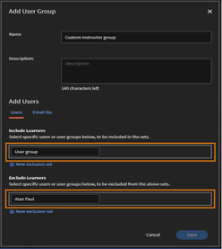
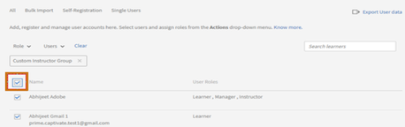

# Standardtilldelning av instruktörsroller till användargrupper i Learning Manager

## Problem

Alla användare som tilldelas en session tilldelas rollen instruktör.

## Beskrivning

Det finns scenarier där en session kan kräva flera instruktörer, eller där en administratör/författare tilldelar en användargrupp en session. Detta leder till att alla användare i användargruppen tilldelas rollen instruktör.

## Orsak

Eftersom roller inte kan förgrenade vid grupptilldelning av användare i en användargrupp tilldelas instruktörsrollen alla användare.

## Lösning

Skapa anpassade användargrupper för att filtrera användarrollerna som är tilldelade till en session. Så här tar du bort de tilldelade instruktörsrollerna i en användargrupp:

1. Logga in som administratör. Klicka på **[!UICONTROL Email Templates]** i den vänstra panelen.
1. Klicka på **[!UICONTROL Disable All]** för att undvika e-postutlösare för de ändringar som ska göras.

   

1. Gå till **Användare** > **Användargrupp**. Klicka på **[!UICONTROL Add]**.

   

1. Skapa en anpassad användargrupp i fönstret Lägg till användargrupp på följande sätt:

   * Ange ett namn för den anpassade gruppen i fältet **[!UICONTROL Name]**.
   * Lägg till användargruppen som du vill filtrera instruktörerna för under fältet **[!UICONTROL Include Learners]**.
   * Lägg till de användare vars instruktörsroll du vill behålla under fältet **[!UICONTROL Exclude Learners]**.

   

   Stegen ovan skapar en lista över användare som ska läggas till i inkluderingsuppsättningen och tar bort specifika användare (instruktörer) som nämns i uteslutningsuppsättningen.

1. Klicka på **[!UICONTROL Save]** för ändringarna.
1. Sök efter den skapade anpassade användargruppen genom att gå till **[!UICONTROL Users]** > **[!UICONTROL Internal]**.

   

1. Markera kryssrutan för att välja alla användare i gruppen.

   

1. Klicka på **[!UICONTROL Actions]** > **[!UICONTROL Remove Role]** > **[!UICONTROL Remove Instructor]**.

Se till att alla e-postutlösare som inaktiverades i steg 2 återaktiveras när de är klara.
