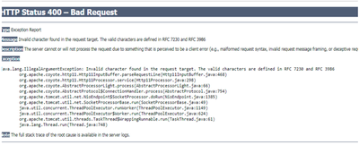

# E-postlänkar som utlöses från ändrade mallar orsakar ett fel i Learning Manager

## Problem

Ett fel uppstår när du klickar på en länk för ett automatiserat e-postmeddelande/välkomstmeddelande/registreringsmeddelande.

**Fel**

HTTP-status 400 - Felaktig begäran

## Orsak

Detta inträffar vanligtvis när e-postmallarna har anpassats felaktigt.

**Lösning**

Följ stegen nedan för att undvika fel som är relaterade till trasiga länkar som kan visas på grund av anpassning:

1. Logga in som administratör.
1. Klicka på **[!UICONTROL Email Templates]** i den vänstra panelen.

1. Navigera till önskad mall och klicka för att ändra den.

   Då öppnas fönstret **Förhandsgranskning av mall**.

   

   Observera poängen när du redigerar en e-postmall:

   * Vi rekommenderar att du ändrar en e-postmall i Learning Manager-gränssnittet.
   * Kopiera och klistra in den ändrade mallen på en Anteckningar/Word-fil för att lagra en kopia av ändringarna.
   * Undvik att ersätta dynamisk text i mallen som är markerad med blått. Exempel: &quot;**OrganizationName**&quot;, &quot;**Elev**&quot;, &quot;**klicka här**&quot;, &quot;**Certifikatnamn**&quot; och så vidare.

1. Klicka på **[!UICONTROL Save]** för att bekräfta ändringarna som har tillämpats på mallen.
1. Utlös e-postmeddelandet för att verifiera om länkarna fungerar som förväntat.
1. Återställ inställningarna till originalet genom att klicka på alternativet **Återställ till original** för den ändrade mallen.
