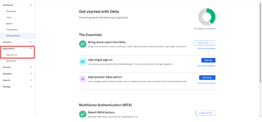

# Okta Active Directory-integrering med Adobe Learning Manager {#okta-active-directory-integration-with-adobe-learning-manager}

I det här dokumentet får du lära dig hur du integrerar Adobe Learning Manager med Okta Active Directory (AD). När du integrerar Adobe Learning Manager med Okta AD kan du:

* Kontrollera och kontrollera åtkomst till Learning Manager i Okta AD.
* Gör det möjligt för användare att automatiskt logga in på Adobe Learning Manager med sina Okta AD-konton.
* Hantera dina konton på en central plats - Okta-portalen.

Adobe Learning Manager stöder identitetsleverantörs- och tjänsteleverantörsinitierad enkel inloggning.

## Skapa ett program i OKTA

1. Logga in på Okta AD.

   >[!NOTE]
   >
   >Du behöver inte ALM-administratörsåtkomst för att skapa ett program och konfigurera en IdP.

1. Klicka på **[!UICONTROL Applications]**. Då öppnas Application Store i Okta.

   

   *Visa appbutik i Okta*

1. Klicka på **[!UICONTROL Create App Integration]**.

   

   *Välj Skapa programintegrering*

1. Välj **[!UICONTROL SAML 2.0]** från det nya programintegreringsfönstret.

   

   *Välj alternativet SAML2.0*

1. Välj **[!UICONTROL Create SAML integration]** > **[!UICONTROL General settings page]**. Ange ett programnamn.

   Observera att detta kan vara vilket namn som helst för att unikt identifiera ditt program. När du är klar klickar du på **[!UICONTROL Next]**.

   

   *Ange programmets namn*

1. Utför följande steg på sidan Konfigurera SAML-inställningar:

   **För IdP-konfiguration:**

   1. I fältet URL för enkel inloggning anger du URL:en: [https://learningmanager.adobe.com/saml/SSO](https://learningmanager.adobe.com/saml/SSO)
   1. I fältet Audience URL anger du URL:en: [https://learningmanager.adobe.com](https://learningmanager.adobe.com/)
   1. I rullgardinsmenyn **Namn-ID-format** väljer du **E-postadress**.
   1. Välj Okta-användarnamn i listrutan **Programanvändarnamn**.
   1. Om du vill skicka ytterligare attribut kan du lägga till attributen under **Attributsatser** (valfritt)

   

   *Lägg till SAML-attribut*

   **För SP-konfiguration:**

   1. I fältet URL för enkel inloggning anger du URL:en: [https://learningmanager.adobe.com/saml/SSO](https://learningmanager.adobe.com/saml/SSO)
   1. I fältet Audience URL anger du URL:en: [https://learningmanager.adobe.com](https://learningmanager.adobe.com/)
   1. I listrutan Namn-ID-format väljer du **E-postadress**.
   1. I listrutan Program, användarnamn, väljer du Okta-användarnamn.
   1. Klicka på **Visa avancerade inställningar**.
   1. Under **Signaturalgoritm** väljer du RSA-SHA256
   1. Välj SHA256 i **Kontrollalgoritm**
   1. Välj **Krypterad** i listrutan **Försäkringskryptering**.

   1. Överför certifikatfilen som delas av Adobe i alternativet **Krypteringscertifikat**.
   1. Om du vill skicka ytterligare attribut kan du lägga till attributen under **Attributsatser** (valfritt).

   

   *Lägg till ytterligare attribut*

   När du är klar klickar du på **[!UICONTROL Next]**.

1. Fliken **Feedback** är valfri. Klicka på **[!UICONTROL Finish]** när du har valt alternativ och gett din feedback.

   

   *Slutför SAML-konfigurationen*

## Extrahera URL som initierats av IdP och metadatafil

Gör som följer för att visa den URL och metadatafil som initierats av IdP/SP:

1. Öppna det program du har skapat.
1. Klicka på **[!UICONTROL View Instructions]** på fliken **Enkel inloggning**.

   

   *Välj SSO-fliken*

   **För IdP:**

   1. Identitetsleverantörens URL för enkel inloggning är den IdP-initierade URL:en.
   1. Kopiera all text som finns under fältet **Valfritt**.
   1. Öppna ett nytt anteckningsblock och klistra in den kopierade texten.
   1. Klicka på **[!UICONTROL File]** > **[!UICONTROL Save as]** > &quot;filnamn.xml&quot;. Detta blir metadatafilen.

   **För SP:**

   1. Identitetsleverantörens URL för enkel inloggning är den IdP-initierade URL:en.
   1. Identitetsleverantörens utfärdare är enhets-id:t.
   1. Kopiera all text som finns under fältet **Valfritt**.
   1. Öppna ett nytt anteckningsblock och klistra in den kopierade texten.
   1. Klicka på **[!UICONTROL File]** > **[!UICONTROL Save as]** > **[!UICONTROL filename.xml]**. Detta blir metadatafilen.

   

   *Spara SP XML-fil*

   Du måste spara den här filen i ett XML-format.

## Konfigurera SSO för Adobe Learning Manager

Utför stegen som nämns i artikeln nedan om du vill konfigurera enkel inloggning (SSO) för Adobe Learning Manager.

<!--

article not in TOC

[SSO Authentication](/help/migrated/kb/sso-authentication-for-learning-manager.md)
-->
