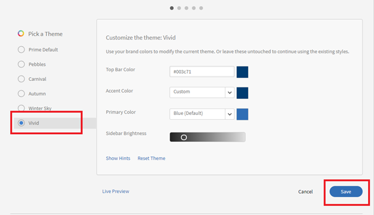

# Markeringsknappar visas inte i Learning Manager

## Problem

På grund av saknade alternativknappar kan en administratör inte utföra följande (listan är inte fullständig):

* Tilldela eller ta bort roller.
* Skicka ett välkomstmeddelande.
* Ta bort en användare.

## Orsak

Problemet uppstår på grund av felaktiga teman i kontot.

*Alternativknappar visas inte*

## Upplösning

Läs in temana igen och åtgärda alternativknapparnas utseende. Gör följande:

1. Klicka på som administratör **[!UICONTROL Branding]**.
1. I dialogrutan **Teman** avsnitt, klicka på **[!UICONTROL Edit].**
1. Välj ett tema och spara ändringarna.

   

   *Välj ett tema*

1. Återgå till föregående tema och spara ändringarna.
1. Logga ut från Adobe Learning Manager och logga in igen.
