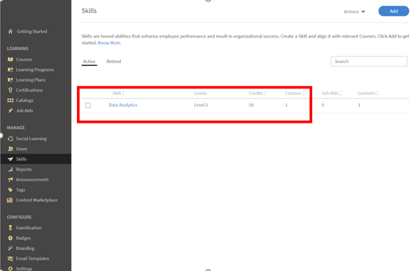

# Det går inte att uppnå en kompetens efter att ha slutfört en kurs

## Problem

En elev får inte någon färdighet ens efter att ha slutfört en kurs. Kunskaperna som är tilldelade till kursen förblir **Pågår** för eleven.

## Orsak

Det här problemet uppstår om de **poäng som krävs** för att uppnå den här kompetensen är större än de **poäng som eleven har tjänat in** efter att ha slutfört kursen.

## Lösning

Kontrollera den aktuella **kompetenspoäng** och **poäng** som krävs för att uppnå kompetensen. Följ stegen nedan:

1. Generera en **elevbetygsrapport** för eleven.
1. När du genererar elevens betygsutdrag klickar du på **[!UICONTROL Advanced Options]** och markerar alternativet **[!UICONTROL Include Skills data and summary sheets]**.

   

   *Välj alternativet Inkludera kompetensdata och sammanfattningar*

1. Öppna den hämtade elevens betygsrapport.
1. Navigera till bladet **[!UICONTROL Skills transcript]**. Här kan du visa **[!UICONTROL Credits Required]** och **[!UICONTROL Credits Earned]** av eleven.

   I exemplet nedan krävs till exempel 50 poäng för att uppnå kompetensen för en kurs. Men, eleven har uppnått endast en kredit.

   

   *Visa nödvändiga krediter*

1. Om du vill kontrollera tillskrivningar för en viss kompetens loggar du in som administratör och går till fliken **Kompetenser** enligt nedan:

   

   *Starta fliken Kompetenser*

1. Logga in som författare och öppna kursen om du vill kontrollera antalet poäng som har tilldelats en kurs. Klicka på **[!UICONTROL Settings]** > **Kurskompetenser** som visas nedan:

   

   *Visa kursfärdigheter*
