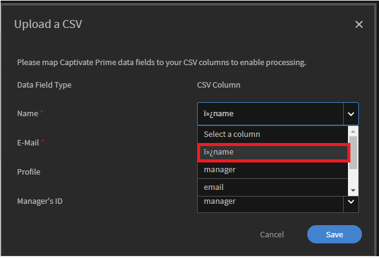
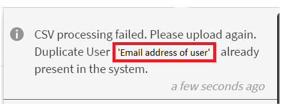

# Det gick inte att överföra CSV

## Fel: Datatrunkering: Data för långa för kolumn

Följande felmeddelande visas när du försöker ladda upp en CSV-fil i Adobe Learning Manager.

*Felmeddelande om att CSV-bearbetningen misslyckades*

## Orsak

Felet uppstår om data i den angivna kolumnen överskrider teckengränsen som har definierats för kolumnen.

## Upplösning

* Öppna CSV.
* Kontrollera data i kolumnen som nämns i felet.
* Om något värde är stort (t.ex. större än 60 tecken) ändrar du värdet för att korrigera informationen.

## Fel: Den första kolumnen i CSV-filen visar ett specialtecken

Du kan inte överföra en CSV-fil eftersom den första kolumnen visar ett specialtecken när kolumnerna mappas.

*Specialtecken i kolumnen Namn*

## Orsak

Problemet uppstår när CSV-filen sparas i UTF-8-format i Excel. När du sparar en CSV-fil i Excel som UTF-8 sparas filen i UTF-BOM-format. Du kan antingen verifiera detta med Anteckningar++ eller när du överför en CSV-fil till Learning Manager och samtidigt mappar kolumnerna visar den första kolumnen ett specialtecken.

## Upplösning

* **A:** Spara via Excel:

   1. Öppna CSV-filen i Excel.
   1. Spara filen som en vanlig CSV-fil.

* **B:** Spara via Anteckningar eller Anteckningar++:

   * Öppna CSV-filen i Anteckningar eller Anteckningar++.
   * Spara filen i UTF-8-format.

## Fel: E-postadressen till användaren finns redan i systemet

Du kan inte överföra en CSV-fil eftersom CSV-bearbetningen misslyckades. Felmeddelandet visas nedan:

*Felmeddelande för en dubblettanvändare*

## Orsak

Det här problemet uppstår om det redan finns en användare i systemet med samma e-postadress eller UUID.

## Upplösning

### Scenario 1

**Konton där UUID inte är aktiverat.**

I det här scenariot finns det två orsaker till felet:

1. Användaren som du försöker lägga till är chef för en extern profil. Lös detta genom att öppna den externa profil som användaren ingår i, välja användaren, klicka på **[!UICONTROL Actions]** > **[!UICONTROL Assign Role]** > **[!UICONTROL Manager]** och ändra profilhanteraren.
1. Användaren som du försöker lägga till har tagits bort. I det här scenariot kan du inte lägga till användaren med samma e-postadress förrän rensningsprocessen är klar. En lösning ** är att lägga ** användaren med en andra e postadress för att ge åtkomst till plattformen. När rensningsprocessen är klar redigerar du användaren och ändrar e-postadressen till rätt e-postadress.

### Scenario 2

**UUID-aktiverade konton.**

För UUID-aktiverade konton kan det här problemet uppstå om en användare har tilldelats ett UUID som redan används av en annan användare på kontot eller om användaren har en annan e-postadress.

Låt det till exempel finnas två användare, A och B, med e-postadresser,  <a@xyz.com> och <b@xyz.com> med UUID 1 respektive 2.

Om du nu överför en CSV-fil som har användar-A:s UUID som 3 och användar-B:s UUID som 2 visas ett fel.

>[!TIP]
>
>För att lösa problemet, **du måste ha samma e-postadress och UUID för användaren på CSV-filen och systemet.**

