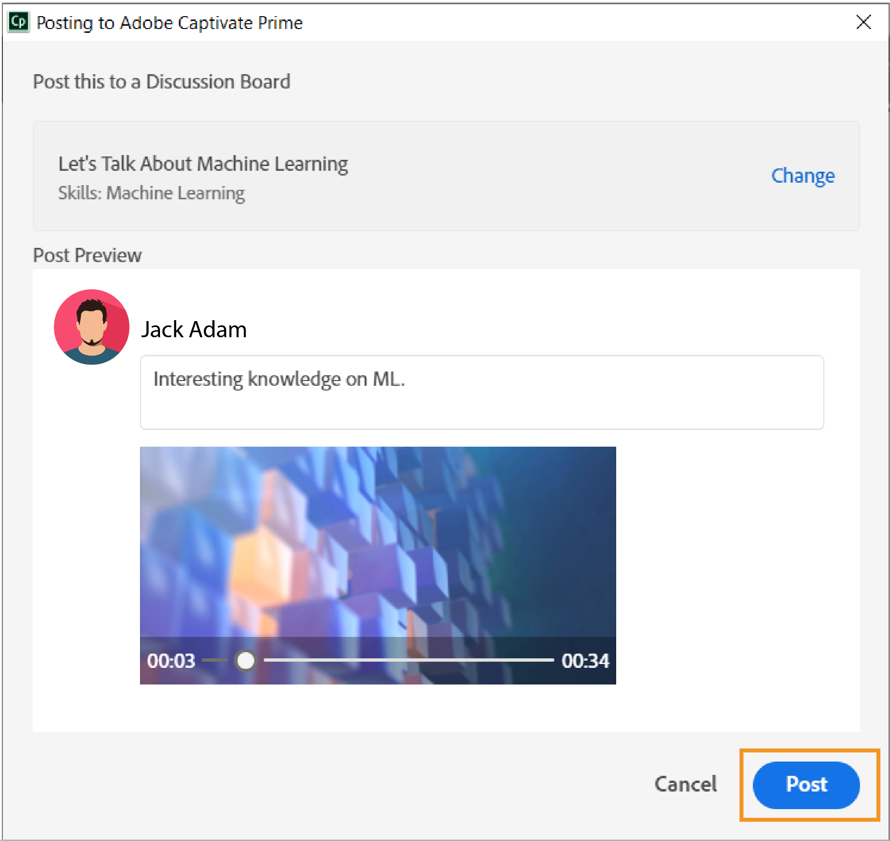

# Adobe Learning Manager-datorprogram

Lär dig skapa och förbättra innehåll som kan delas på Social utbildning med Adobe Learning Manager datorprogram.

Adobe Learning Manager-datorprogrammet är främst avsett för elever som använder Learning Manager Social Learning. När appen har installerats på en dator kan elever skapa innehåll och lägga upp det på tavlor i Learning Manager för att underlätta informella, samarbetsinriktade och sociala inlärningar bland andra. Dessutom ser datorprogrammet till att elever får meddelanden om social utbildning på sina datorer, även om de inte nödvändigtvis är inloggade på Learning Managers webbprogram.

Elever kan skapa spännande innehåll som video, ljud och skärmbilder och dela dem med andra elever. Innehållet kan bokstavligen vara vad som helst - en programvarudemo eller genomgång, en presentation, en poddsändning eller en kommenterad skärmdump av något som kan delas.

På webbsidan Learning Manager Social Learning klickar du på nytt inlägg och väljer Spela in video, eller spela in ljud, eller ta en skärmbild eller galleri för Learning Manager för att starta datorprogrammet. [Klicka här](feature-summary/social-learning-web-user.md) om du vill ha mer information om social utbildning.

Om användarna inte har något datorprogram kan du hämta det från Adobe Learning Manager-datorsidan. Om du inte kan hämta [klickar du här](../kb/troubleshooting-issues-with-adobe-learning-manager-desktop-app.md).

När användaren har installerat programmet måste han/hon logga in på det med sina inloggningsuppgifter för Learning Manager-eleven. Startsidan visas som nedanstående skärmbild.

>[!NOTE]
>
>Elever kommer inte att kunna använda datorprogrammet om Social utbildning är inaktiverat för deras konto.

<!---->
<!--*Home page*-->

## Skapa en video {#creatingavideo}

Med datorprogrammet kan användaren spela in både webb och skärm.

<!---->
<!--*Record web, screen, or both*-->

Gör följande för att göra en videoinspelning och publicera den på webbplattformen för social utbildning:

1. Kontrollera att maskinvaru- och programvarukraven uppfylls. Mer information finns i [Systemkrav](../system-requirements.md).
1. För att starta en inspelning från Social Learning väljer du ikonen för videoinspelningsposten (webb, skärm, båda) som öppnar datorprogrammet Learning Manager. I datorprogrammet med användaren inloggad kan innehållet skapas och sedan läggas upp.
1. Om du vill börja spela in från datorprogrammet loggar du in på programmet med dina inloggningsuppgifter för Learning Manager som elev.
1. Startsidan visas.
1. För att skapa ett inlägg kan du välja ett av de tre alternativen på startsidan. När du vill öppna inspelningsfönstret klickar du på ikonen Spela in video.
1. Enligt kravet kan du välja webbkamera, Skärm eller båda.

   **Webbkamera** Webbkameran fångar berättaren som demonstrerar eller presenterar ett projekt eller program, inklusive ljud. Välj webbkameraikonen bland ovanstående alternativ för att Live-fönstret ska visas.

   **Skärm** Spela in åtgärder som utförs på skärmen. När du väljer skärmikonen markeras skärmen med en postdialogruta i mitten av skärmen.

   **Både** spelar in både berättarrösten och skärmens åtgärder. Genom att välja den sista ikonen markeras skärmen och användaren får ett Live-fönster tillsammans med den.

1. Ange inställningar för inspelning.

   **Välj kamera** Klicka på videokameraikonen längst ned i fönstret för att spela in video. Välj en kamera som användaren vill använda bland de angivna alternativen.

   **Välj mikrofon** Klicka på mikrofonikonen längst ned i video- eller ljudfönstret och välj en mikrofon som användaren vill använda bland alternativen.

   >[!NOTE]
   >
   >Om användaren inte vill spela in ljud med skärm eller video väljer du alternativet **Inget** i listrutan som visas när användaren klickar på ljudikonen.
   >
   >När användarna börjar spela in sin skärm eller sig själva visas ett popup-fönster där de ombeds bekräfta om de vill fortsätta spela in utan ljudstöd. Klicka på Ja för att fortsätta.

1. Använd knappen Record för att börja spela in. Inspelningen börjar efter nedräkningen (3 sekunder).
1. Klicka på knappen pausa eller återuppta för att pausa under inspelningen och återuppta sedan om det behövs. Om du vill redigera inspelningen går du till [Redigera en inspelning](adobe-learning-manager-app-for-desktop.md#Editing) och om du vill publicera går du till [Publicera en inspelning](adobe-learning-manager-app-for-desktop.md#Publishing).

## Skapa ett ljud {#creatinganaudio}

<!---->
*Spela in ljud*

Så här spelar du in ett ljud:

1. Klicka på ikonen Spela in ljud i Learning Manager-skrivbordsprogrammets startfönster.
1. Kontrollera att mikrofonvolymen är på genom att klicka på mikrofonens volymikon och justera volymen.
1. Klicka på inspelningsknappen för att starta inspelningen.
1. När användarna har spelat in ljudet klickar du på pausknappen för att stoppa inspelningen.
1. Klicka på uppspelningsknappen om du vill förhandsgranska inspelningen.
1. Om användarna vill spela in ytterligare ljud i samma fil klickar du på **[!UICONTROL Resume]**. När den önskade inspelningen har uppnåtts klickar du på **[!UICONTROL Next]** för att spara filen på önskad plats. Inspelningen sparas i Adobe Learning Manager-appen för datorgalleri där användare kan visa sina inspelningar och skärmbilder.
1. Om du vill redigera inspelningen går du till [Redigera en inspelning](adobe-learning-manager-app-for-desktop.md#Editing) och om du vill publicera går du till [Publicera en inspelning](adobe-learning-manager-app-for-desktop.md#Publishing).

## Skapa en skärmbild {#creatingascreenshot}

Så här tar du en skärmbild:

1. Klicka på skärmbildikonen från startsidan för Learning Manager-datorprogrammet.
1. Om du bara vill hämta en del av skärmen klickar du på ikonen för att klippa ut en del av skärmen. Om du vill fånga hela skärmen klickar du på hela bildskärmsikonen.

   <!--
   *Capture a screenshot*-->

1. Lägg till kommentarer i innehållet för att hjälpa andra elever att förstå och behålla presentationen eller det statiska innehållet bättre.
1. [Klicka här](adobe-learning-manager-app-for-desktop.md#Editing) om du vill redigera skärmbilden och publicera en skärmbild [klicka här](adobe-learning-manager-app-for-desktop.md#Publishing).

## Redigera en video, ett ljud och en skärmbild {#editing}

När en fil har sparats visas redigeringsfönstret direkt på datorn där inspelningar kan göras för att se perfekta och professionella ut med hjälp av alternativen nedan:

## Anteckningar (videoinspelningar och skärmbilder) {#annotationsvideorecordingsandscreenshots}

Kommentarer kan användas på videoinspelningar och skärmbilder för att markera specifika detaljer eller skriva text för andra användare att läsa.

>[!NOTE]
>
>I video kan användare bara kommentera högst upp på skärmen.

* De olika kommentarerna som kan väljas är **ellips**, **linje**, **pil**, **markering** och **text**.

* Välj en färg för varje kommentar från färgpanelen i anteckningens egenskapspanel.
* För **Text** väljer du följande egenskaper: Teckensnitt, Fet, Kursiv, Rubrik, Justering, Färg och Bakgrundsfärg.

>[!NOTE]
>
>Om du vill visa bakgrundsfärgen för text aktiverar du Bakgrundsfärg till Ja.

## Klipp (alla typer av video- och ljudinspelningar) {#trimalltypesofvideoandaudiorecordings}

Om du vill trimma eller ta bort delar av en video eller ett ljud som inte behövs använder du trimningsverktyget.

Om du vill trimma klickar du på knappen **[!UICONTROL Start Trim]** eller på plusikonen på tidslinjen för att börja trimma. Klicka sedan på pausknappen på spelaren för att stoppa trimningen. Klicka på knappen **[!UICONTROL Confirm]** för att slutföra beskärningen.

Du kan trimma inspelningar genom att ange tiden i inmatningsfälten **[!UICONTROL Start time]** och **[!UICONTROL End time]** efter att du har aktiverat **[!UICONTROL Change Timing]**.

*Starta beskärning*

*Bekräfta beskärning*

## Panorering och zoomning (alla videoinspelningar) {#panampzoomanyvideorecording}

Panorerings- och zoomningsåtgärder kan bara göras på **Både** (webbkamera och skärm) videoinspelningar. Som standard är hela webbkameran eller skärmen markerad. Markera hörnhandtaget och dra för att markera den del av skärmen som ska visas eller fokuseras. Dubbelklicka på fönstret för helskärmsläge.

*Panorering och zoomning*

## Varumärkning (alla typer av videoinspelningar) {#brandingalltypesofvideorecordings}

Välj varumärkesverktyget om du vill skapa ett unikt namn på en video tillsammans med ett konsekvent tema. Varumärket syftar till att etablera en betydande och differentierad närvaro i systemet för hantering av inlärning som lockar och håller elever kvar för att titta på hela videon.

Så här lägger du till ett varumärke eller tema i en video:

1. Klicka på varumärkesikonen i den vänstra navigeringspanelen i redigeringsfönstret.
1. Välj ett **tema** från de angivna alternativen. Annars kan användarna anpassa sina egna teman genom att lägga till en **start**-, **bakgrund-**- och **end**-video från sina system.

   >[!NOTE]
   >
   >Klicka på knappen **Hämta fler resurser** om du vill hämta fler teman.

1. Lägg till en videotiteltext och välj en plats i rutnätet **Visa vid** för att den ska visas.

   >[!NOTE]
   >
   >Titeltext kan bara läggas till som en del av en varumärkesvideo. Ett tema krävs innan du ger en titel till varumärkesvideon.

1. Lägg till ett presentatörsnamn och en presentatörstitel i videon om det behövs. Skriv en siffra inom tidsintervallet för videon i fältet Visa vid spelhuvud för det presentatörsnamn och den titel som ska visas när videon spelas upp.
1. Lägg till en varumärkesikon på vänster eller höger sida av videoskärmen om det behövs. Klicka på **[!UICONTROL Select]** > **[!UICONTROL Browse from system]** om du vill välja en varumärkesikon.
1. Klicka på uppspelningsknappen på förhandsgranskningsskärmen om du vill förhandsgranska videofilmen.

   

   *Varumärken*

## Spela in ytterligare klipp (alla typer av video- och ljudinspelningar) {#recordingadditionalclipsalltypesofvideoandaudiorecordings}

Ytterligare ljud- och videoklipp kan spelas in till en befintlig video- eller ljudfil.

Om du vill starta en ny inspelning klickar du på ikonen för att spela in ytterligare klipp. Den nya inspelningen infogas vid spelhuvudets position i inspelningen som redigeras.

## Publicera en videoinspelning, en ljudinspelning och skärmbild {#publishing}

När alla ändringar och redigeringar har gjorts klickar du på **[!UICONTROL Share]** > skriv eller sök efter en **kompetens eller tavla** som bäst relaterar till inlägget > **inlägg**.

<!---->
*Publicera på webben*

## Bläddra i Learning Manager-skrivbordsgalleri {#browsingcaptivateprimedesktopgallery}

Alla inspelningar och skärmbilder sparas i Adobe Learning Manager-datorprogrammet. Om du vill bläddra bland dessa filer klickar du på **[!UICONTROL Gallery]** i den vänstra navigeringspanelen på startsidan.

>[!NOTE]
>
>Du kan också starta galleriet från Social utbildning genom att klicka på ikonen **Learning Manager-galleri** när du skapar ett inlägg.

I gallerifönstret skriver du namnet på den fil du letar efter i sökfältet.

Om du vill skapa en ny inspelning från gallerifönstret klickar du på knappen **Spela in ny**.

Om du vill redigera eller ta bort en fil från galleriet klickar du på de tre punkterna längst ned i filen och väljer ett alternativ i popup-listan.

## Meddelanden {#notifications}

Meddelanden i Learning Manager visas i meddelandefönstret oavsett om eleven är inloggad på webbprogrammet Learning Manager. Meddelanden innehåller inlägg eller tavlor som användare har skapat, följer eller har deltagit i. Om du klickar på meddelandet dirigeras användaren till webbplatsen för Learning Manager Social Learning.

Stäng av ljudet genom att klicka på **[!UICONTROL Profile menu*]* > &#x200B;** [!UICONTROL Settings] > **[!UICONTROL Mute notifications]**.

## Inställningar i Adobe Learning Manager-datorprogrammet {#settingsinadobecaptivateprimedesktopapplication}

Ändra följande inställningar på sidan **Inställningar**:

Stäng av aviseringar, starta programmet automatiskt, uppdatera programmet automatiskt, aktivera produktförbättring.

Du kan också ändra galleriets plats genom att klicka på hyperlänken **Ändra**.

*Inställningar för Adobe Learning Manager-program*
