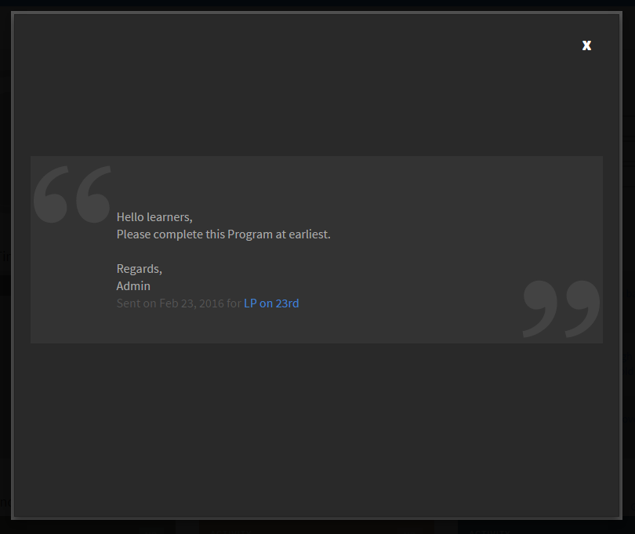

# Meddelanden

Ett meddelande är ett multimediemeddelande (text, bild eller video) som en administratör skickar till en viss grupp användare.

Administratören kan skicka meddelanden till elever för att informera dem om en händelse eller aktivitet. När ett meddelande skickas till en viss grupp eller användare av utbildningsobjekt får alla elever som är kopplade till målgruppen meddelanden.

## Meddelanden {#announcementsnotification}

Ett meddelande om sändning visas på elevens instrumentpanel som en markerad namnlist. Om eleven inte är online vid tidpunkten för tillkännagivandet visas meddelandet när en elev loggar in i Learning Manager-appen. Elever kan också visa gamla meddelanden från meddelanden.

*Meddelande om väntande meddelande*

När du klickar på Visa visas en lista med meddelanden. Nedan följer en lista med exempel på tillkännagivanden:

*Visa alla meddelanden*

## Ett exempel på tillkännagivande {#asampleannouncement}

Ett exempel på meddelande visas nedan som referens.

*Visa information om ett meddelande*
