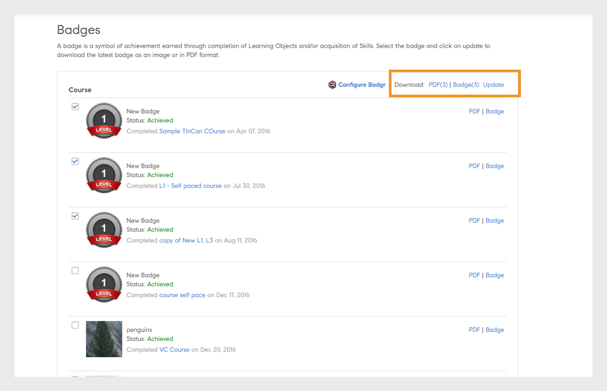

# Tecken

Lär dig visa och hämta utmärkelsetecken med Learning Manager-elevappen.

## Tecken {#Badges-1}

Utmärkelsetecken är ett mått på prestation som din medarbetare kan tjäna på att ha slutfört en kurs. I Adobe Learning Manager introduceras ett av de senaste e-utbildningskoncepten som heter Badges. Yrkesverksamma över hela världen använder dessa utmärkelsetecken som en representation av en viss färdighet eller en utbildningsinsats.

Märken hjälper elever att bättre definiera sig själva och visa upp sina detaljerade kunskaper förutom att de ger trovärdighet och god synlighet för elever.

## Visa och hämta märken {#viewinganddownloadingbadges}

En elev kan visa märken från widgeten Mina prestationer på elevens startsida. En lista med utmärkelsetecken visas längst upp på sidan bredvid din profil. Du kan bara visa upp till sju märken åt gången på startsidan. Du kan emellertid visa hela listan över märken i en dialogruta när du klickar på ett märke.

Nyligen uppnådda utmärkelsetecken visas längst till vänster i listan följt av hittills inte uppnådda utmärkelsetecken. Du kan se 40 % opacitet för utmärkelsetecken som inte har uppnåtts än jämfört med uppnådda utmärkelsetecken, för bättre identifiering.

Klicka på ett märke för att få en lista över alla utmärkelsetecken du har skaffat. Du kan också visa alla tillgängliga märken justerade till respektive kurser. Klicka på kursnamnet i utmärkelsetecken som ännu inte har uppnåtts för att visa kursen som är anpassad till utmärkelsetecknet. En exempelögonblicksbild visas nedan som referens.

Klicka **[!UICONTROL Download All Badges]** länk för att ladda ner alla dina förvärvade märken i zip-format. Du kan också ladda ner ett enskilt märke genom att klicka på kubikonen bredvid varje märke.

**Ladda ned utmärkelsetecken som PDF**

Du kan även hämta en uppsättning märken eller ett enskilt märke i PDF-format.

* Klicka **[!UICONTROL Download All Badge Records]** för att ladda ned de utmärkelsetecken du har förvärvat som PDF.
* Om du vill hämta enskilda märken markerar du märket och klickar på PDF-ikonen bredvid märkesnamnet.

**För certifikat med förfallodatum, dvs. återkommande certifikat, anger Learning Manager certifikatets giltighetsdatum. Datumen visas i användargränssnittet och på certifikatet PDF.**

## Öppna märken {#openbadges}

Open Badges-ryggsäcksplattformen, som Learning Manager stöder, håller på att **pensionerad**. För närvarande stöder Learning Manager inte Open Badges.

Öppna märken är en standard för att känna igen och verifiera inlärning för elever. Du kan använda dessa märken för att visa upp dina prestationer online.

Learning Manager stöder konceptet med öppna märken för sina elever. Du kan använda de hämtade märkena som öppna märken. Varje märke du hämtar har metadatainformation som stöder den nya standarden med ett öppet märke.

## Stöd för Badgr-märken

Elever kan integrera sitt konto för utbildningsplattformen med sitt Badgr-konto. Detta gör det möjligt för elever att dela utmärkelsetecken på sociala webbplatser via sitt Badgr-konto. Badgr erbjuder också autentiska märken baserat på ryggsäcksstandarden, vilket innebär att märkena verifieras.

Öppna märken är märken som har viss metadata inbäddad i emblembilden. Dessa metadata ger information om utfärdare, mottagare, den uppgift som utförts, giltigheten av märket etc. Badgr-ryggsäck kommer att vara tillgänglig direkt från Learning Manager för att ge en central plats att lagra alla utmärkelsetecken och dela dem. Elever kan logga in på sitt Badgr-konto och upprätta integreringen. Från och med då laddas utmärkelsetecken som uppnåtts i Learning Manager automatiskt upp till Badgr-kontot.

När administratören har aktiverat alternativet **Badgr-integrering** kan en elev sedan integrera med Badgr och konfigurera sitt utmärkelsetecken. För att integrera måste eleven logga in på Badgr-kontot från Learning Manager.

>[!NOTE]
>
>Learning Manager erbjuder inte ett Badgr-konto som en del av denna integrering. Eleven bör skapa ett eget konto och integrera med Learning Manager.

En elev måste ha ett Badgr-konto skapat innan en anslutning upprättas från Learning Manager.

I elevappen finns det ett alternativ som heter Konfigurera Badgr på sidan Märken. Om du klickar på alternativet öppnas en dialogruta, där anslutningsstatus ska visas som Ansluten/Inte ansluten.

## Uppdatering av utmärkelsetecken

En elev kan uppdatera sitt märke till det senaste märket genom att välja märket och klicka på **Uppdatera **i det övre högra avsnittet på sidan. En uppdatering av utmärkelsetecknet sker om en administratör/författare ändrar något i utmärkelsetecknet eller utmärkelsetecknet från utbildningsobjektet.

Processen att uppdatera sidan kallas manuell ombakning. I det här fallet laddas märket upp på nytt till Badgr-ryggsäcken efter att bakningen är klar, även om det har samma märke bild/namn. Efter att ha uppdaterat utmärkelsetecknet får eleven ett meddelande om att uppdateringen är slutförd.

## Vanliga frågor {#frequentlyaskedquestions}

**1). Hur laddar man ner Badge som elev?**

På märkessidan kan du ladda ned ett märke som en bild eller i PDF-format. Välj en kompetens eller en kurs och klicka på antingen **PDF** eller **Tecken**.
