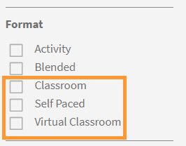

# Kataloger

Lär dig använda kataloger i Learning Manager för att se berättigade utbildningsobjekt

**Katalogen** består av alla kurser, utbildningsprogram, certifieringar och arbetsstöd som finns tillgängliga för en elevroll i företagskontot.

Elever kan visa alla tilldelade och kvalificerade utbildningsobjekt (utbildningsprogram, kurser och certifieringar) i **standardkatalogen**. Dessa utbildningsobjekt är unika för varje elev baserat på hans/hennes roll, beteckning, användargrupp, profil och så vidare.

Du kan sortera utbildningsobjekten baserat på olika kategorier som Produkter, Jobbroller, Typer, Tid som behövs, Kompetenser och Nyckelord. Du kan också filtrera med alternativen i den vänstra rutan: efter utbildningsobjekt, kompetens och slutförandestatus.

Använd sökfältet längst upp på sidan för att ange namnen på dina välbekanta utbildningsobjekt. Elever kan växla mellan stödrastret och listvyn genom att välja ikonen .

*Visa kataloger*

<!--As a learner, you can  filter training based on the format of training, for example, Classroom, Self-paced, or Virtual Classroom. In addition, the learner can also filter the trainings based on Training Duration. Skill Levels filter which is already available, can now be enabled/disabled by Administrator. -->

*Filtrera utbildning baserat på utbildningens format*

Du kan även filtrera efter utbildningens längd. Varaktighetsfiltret omfattar inte längden på förarbetet och testningen.

*Filtrera efter kurslängd*

Utbildningsfiltren **Varaktighet** och **Format** identifieras utifrån utbildningsinnehållet som är tillgängligt för standardinstansen och för kontots önskade språk.

När en utbildning har publicerats kan det ta upp till en timme för uppgifterna att finnas tillgängliga som filter.

## Sorteringsfunktioner i elevappen

Sorteringsfunktionen i elevappen ger personliga kursrekommendationer baserat på innehåll och gränssnittsspråk.  Den här förbättringen förenklar processen för elever att hitta kurser på deras önskade språk och använda mer intelligenta sorteringsalternativ.

>[!NOTE]
>
>Den här funktionen är tillgänglig både på webben och i mobilappen.

Du kan sortera kurserna i bokstavsordning:

1. **[!UICONTROL Name (A-Z)]**: Visar kurser i alfabetisk ordning.
2. **[!UICONTROL Name (Z-A)]**: Visar kurser i omvänd alfabetisk ordning.

Kurserna visas i följande prioritetsordning baserat på språkinställningar:

1. **[!UICONTROL Content Language]**: Kurser i det valda innehållsspråket visas först.
2. **[!UICONTROL Interface Language]**: Kurser i gränssnittsspråket visas nedan.
3. **[!UICONTROL Other Languages]**: Kurser i slumpmässiga språk visas sist.

Om inget innehållsspråk eller gränssnittsspråk har konfigurerats på kontot följer systemet denna sekvens:

1. **[!UICONTROL Browser Language]**: Programmet prioriterar kurser baserat på webbläsarens språkinställningar.
2. **[!UICONTROL Account Language]**: Om webbläsarspråket inte är tillgängligt övervägs ALM-kontospråket.
3. **[!UICONTROL Default to English]**: Om webbläsaren eller kontots språk inte är tillgängligt visas kurserna på engelska.

Välj sidan **[!UICONTROL Catalogs]** i elevappen och välj sedan önskat sorteringsalternativ: **[!UICONTROL Name (A-Z)]** eller **[!UICONTROL Name (Z-A)]**. Kurserna kommer att visas enligt din valda sorteringsinställning med språkbaserad prioritering.