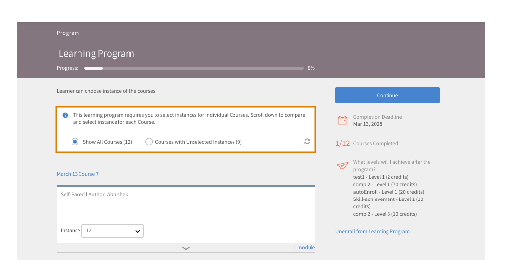

# Mina utbildningar

Läs den här artikeln om du vill veta hur du visar och utför kurser i Learning Manager. Delta i diskussioner och ge feedback.

Författare skapar kurser. Elever kan gå kurserna och administratörer kan spåra elevers resultat baserat på kursförbrukningen.

## Översikt {#overview}

Med Adobe Learning Manager får elever tillgång till kurser, utbildningsprogram och certifieringar. Elever kan bläddra igenom alla tillgängliga kurser genom att använda katalogen eller registrera sig för kurser de väljer. Elever kan visa alla registrerade kurser och de kurser som har tilldelats dem på fliken Utbildning.

>[!NOTE]
>
>Elever kan även installera Learning Manager iPad-appen från Apple Store och Learning Manager Android-appen från Google Play och få tillgång till kurser på mobila enheter. Alla elevrollfunktioner finns också i appen. Elever kan också gå kurser offline och få smidig åtkomst när de är online. Mer information finns i [Funktioner för iPad- och Android-surfplattor](ipad-android-tablet-users.md).

## Visa utbildningsobjekt {#viewingcourses}

Du kan visa en lista över alla tillgängliga kurser som en elev. Klicka på Mitt lärande på startsidan eller i den vänstra rutan för att visa alla kurser som du har registrerat dig för.

*Visa tilldelade kurser*

Om du inte har startat kursen än kan du klicka på Start bredvid kursen. Om du redan har börjat använda kursen kan du klicka på knappen Fortsätt.

Klicka på knappen Besök igen bredvid kursen för att visa en slutförd kurs.

Det kan finnas flera instanser av en kurs. Klicka på kursnamnet för att visa informationen. I den högra rutan kan du se deadline datum för varje instans av kursen.

*Visa en slutförd kurs*

## Kurseffektivitet {#courseeffectiveness}

Poäng för kurseffektivitet hjälper eleverna att hämta upp kurserna med mest effektiva poäng för sina utbildningsbehov. Kursens effektivitet utvärderas för att förstå nyttan av en kurs för eleven. Den beräknas utifrån den feedback som tagits emot av antalet användare av en viss kurs. Om andelen elever som ger feedback är högre är kursens effektivitet hög.

Det är en kombination av resultat från elevfeedback på kursinnehållet, quizresultaten för en elev och chefens feedback som utvärderar en elev baserat på lärdomar från kursen.

Från sidan Kurser kan en elev se kurseffektiviteten på kursens miniatyrbilder som visas på ögonblicksbilden nedan. Du ser betyget för denna kurs som 14.

*Visa bedömning av kurseffektivitet*

Klicka på värdet för kurseffektivitet för att se detaljerna om kurseffektivitet. Ett popup-fönster visas enligt nedan.

*Visa kurseffektivitet*

Klicka på nedåtpilen i det nedre högra hörnet av popup-fönstret för att se hur beräkningarna av kurseffektivitet görs.

*Beräkning av kursens effektivitet*

## Söka efter kurser och utbildningsprogram {#searchingcoursesandlearningprograms}

Adobe Learning Manager gör det enklare för dig att snabbt hitta de kurser du väljer. Du kan söka efter dina kurser på följande sätt:

1. Klicka på sökikonen som visas i det övre högra hörnet. Ett sökfält visas. Skriv namnet på kursen/utbildningsprogrammet eller några nyckelord som är associerade med dina kurser. Du kan söka efter kurser med hjälp av metadata, anteckningar, färdigheter, utmärkelsetecken eller taggar. Taggar är sökbara i sökfältet, vilket innebär att taggarna visas i sökfältet när du skriver.
1. Eleven kan förfina sökresultaten på katalogsidan med hjälp av typ, färdigheter, taggar och status.

Du kan sortera kurserna efter relevans, namn eller publiceringsdatum genom att klicka på Sortera efter och välja i listrutan.

På sökresultatsidan kan du filtrera kurserna efter kursernas **längd** och kursernas **format**. Detta ger dig större flexibilitet när du söker efter kurser och säkerställer att du hittar de kurser som passar dig.

## Registrering till kurser {#enrollingforcourses}

Elever registreras till kurser på följande tre möjliga sätt:

1. Administratören/chefen registrerar vissa elever för obligatoriska kurser baserat på organisationens behov.
1. Chefen nominerar några kurser till sina teammedlemmar. Du får ett meddelande med möjlighet att godkänna eller avslå kursen/utbildningsprogrammet. När en elev accepterar nomineringen registreras hen till kursen/utbildningsprogrammet.
1. Elever kan direkt registrera sig för ett kurs-/utbildningsprogram:

   1. Om kurs-/utbildningsprogrammet är av självregistreringstyp registreras eleven omedelbart.
   1. Om kursen/utbildningsprogrammet är av chefsgodkänd typ, förflyttas eleven till tillståndet **väntande godkännande**. Efter chefens godkännande registreras eleven till kursen.
   1. Om elever registrerar sig för en kurs på väntelistan (om det finns klassrum) måste de vänta tills någon hoppar av kursen eller tills administratören godkänner dem för kursen.

Elever kan registrera sig själva till en stor lista med kurser baserat på deras val. Fliken Kurser visar alla dina registrerade/tilldelade kurser.

Du kan dock välja att gå igenom någon av kurserna som listas under katalog genom att föra musen över den och klicka på Utforska. Sidan Registrera visas. Klicka på Registrera dig längst upp till höger på sidan för att inkludera listan Kurser.

Det kan finnas flera instanser/sessioner till ett kurs-/utbildningsprogram. Klicka i katalogen på namnet för kurs-/utbildningsprogrammet för att se detaljerna. Du kan se registrera dig för instansen kurs/utbildningsprogram baserat på deadline för varje instans av kursen/utbildningsprogrammet.

**Registrera intresse för kurser**

Du kan registrera dig för att visa intresse för alla klassrumskurser som inte har några planerade sessioner. Du får ett meddelande när kurssessionen börjar för att gå med i kursen.

>[!NOTE]
>
>Elever bör se ett konfliktmeddelande om de registrerar sig för två olika sessioner samtidigt eller överlappande tider.

## Arbetsflöde som elev

Som elev får du betygsätta en kurs endast efter registrering. Du kan se de genomsnittliga stjärngraderingarna för en kurs på sidan **Hem**, sidan **Mitt lärande** och katalogen **5}.**

1. Logga in som **elev**. Detta läser in **startsidan**.

1. Sök efter en kurs genom att ange kursnamnet i sökfältet. Du kan också välja från den visade kurslistan genom att klicka på **Min utbildning** eller **Katalog** i den vänstra rutan.

1. Klicka på **[!UICONTROL Enroll]** när du har valt en kurs.

   
   *Registrera dig för en kurs*

1. Välj antalet stjärnor för att betygsätta en bana därefter, där 1 är minst och 5 är bäst. Klicka sedan på **[!UICONTROL Submit]**.

   
   *Skicka in kursomdöme*

   En elev kan skicka in feedback igen genom att ange stjärnbetyg flera gånger, eftersom det senaste betyget anses vara.

1. Ett bekräftelsemeddelande visas efter överföringen.

   
   *Bekräftelsemeddelande för feedback*

   Om du vill skicka återkopplingen på nytt kan du göra det genom att klicka på meddelandet. När betyget har skickats visas meddelandet i tre sekunder och därefter visas betyget. Om du vill ändra klassificeringen kan du välja en annan stjärna och skicka in.

Kurserna kan sorteras utifrån de angivna medelpoängen. Du kan sortera ärendena från listrutan Sortera efter i det övre högra hörnet som finns i **Katalog**.

## Gå en kurs {#consumingnbspacourse}

När du har registrerat dig till en kurs kan du börja med kursen genom att klicka på Starta på kursen. Du kan också klicka på **[!UICONTROL Courses]** på fliken **[!UICONTROL Learning]**. Välj en kurs som du vill börja gå.

Om du inte har startat en kurs än klickar du på knappen Start bredvid kurstiteln.

Du kan visa alla moduler för kursen i ett webbläsarfönster.

**Spelarfunktioner**

**Innehållsförteckning** - När spelaren öppnar en kurs visas en innehållsförteckning för kursen i den vänstra rutan i fönstret. Du kan klicka på varje ämne och navigera till det direkt.

**Bokmärken** - Om någon av kursmodulerna har en modulinnehållsförteckning kan ämnen i modulens innehållsförteckning bokmärkas för att referera senare. När en post är bokmärkt visas en bandikon bredvid posten för innehållsförteckningen. Du kan ta bort bokmärken genom att klicka på menyfliksområdet igen.

**Anteckningar** - Det finns en bestämmelse för att registrera anteckningar medan du påbörjar kursen. När anteckningarna har spelats in kan du spara och ladda ned dem som PDF eller skicka dem med e-post till andra registrerade elevers e-postadresser. När du klickar på Spara får du ett alternativ för att välja platsen där du vill spara den som PDF-fil.

*Gör kursanteckningar*

**Undertexter** - Om undertexter har aktiverats under kursutveckling för Adobe Captivate-utvecklade kurser kan eleven visa undertexterna. Klicka på CC längst ned i spelaren. Alternativet för undertextning är endast tillgängligt för innehåll från HTML med Captivate 8.0.2. För alla andra typer av moduler visas inte alternativet CC på uppspelningsfältet.

**Gå tillbaka till kursen** - Du kan gå tillbaka till en kurs i två lägen under två möjliga scenarier:

* Klicka på Besök igen när kursen är i fullständigt läge.
* Klicka på Fortsätt medan kursen är i ofullständigt läge.

**Helskärm** Klicka på helskärmsikonen längst ned till höger i spelaren om du vill visa kursen i helskärmsläge.

**Navigeringsknappar** Du kan klicka på upp- och nedpilarna för att flytta mellan bilderna i PDF-, docx- och pptx-innehåll. Bildpilar kan användas för att flytta till nästa avsnitt för alla typer av innehåll.

**Stäng kursen** Klicka på stängningsikonen (x) längst upp till höger i spelaren för att avsluta kursen.

*När du har lämnat kursen kan du gå tillbaka till kursen genom att klicka på knappen Besök igen på kursbeskrivningssidan.*

## Stjärngradering

Först efter att ha registrerat sig till en kurs kan en elev ge stjärnfeedback på kursen. På sidan Kursöversikt för en kurs kan eleven betygsätta kursen som stjärnor (1-lägsta, 5-högsta).

*Ge stjärnrankning som feedback*

En elev kommer att kunna välja en viss stjärna (av 5) och skicka in betyget. Eleven kan också redigera valet genom att klicka på en annan stjärna. När du har skickat visas meddelandet Tack för din feedback.

Om eleven vill skicka återkopplingen kan han/hon göra det genom att klicka på meddelandet. Knappen **Skicka** aktiveras på nytt. En elev kan ge stjärnbetyg flera gånger efter registrering till en kurs. Det senaste betyget kommer alltid att beaktas.

När eleven har gett ett betyg, det genomsnittliga stjärnbetyget och antalet elever som har gett stjärngraderingarna på sidan **Kursöversikt**.

*Kursöversikt*

Den här funktionen är inaktiverad för alla befintliga konton. Administratörer kan aktivera det från Inställningar. Först därefter visas stjärngraderingar för eleverna.

## Content Marketplace

Alternativet Content Marketplace finns i den vänstra rutan i elevappen. När du klickar på alternativet kan du se alla kurser/hela katalogen och utvalda spellistor.

På sidan nedan kan du se de kurser som finns i hela katalogen. Varje kurs visar dess längd och det bredare ämne den tillhör. Du kan välja ämne från filtret till vänster på sidan.

Du kan förhandsgranska en kurs i exakt två minuter.

*Förhandsgranska kurs på Marketplace*

När administratören bjuder in dig att utforska och förhandsgranska ett brett utbud av kurser visas ett meddelande.

En elev kan uttrycka sitt intresse för en hel katalog eller en kurerad spellista i avsnittet **Kurerad spellista**.

*Visa kurerad spellista*

När du har uttryckt ditt intresse för en kurs/utbildning registreras intresset och administratören kan sedan hämta posten.

I elevappen har alla administratörer tillgång till Content Marketplace. Om åtkomsten återkallas av administratören kan eleverna inte se fliken Content Marketplace.

Elever som har bjudits in av administratören kan utforska Content Marketplace.

>[!NOTE]
>
>Content Marketplace stöds inte i Internet Explorer 11.

Alla filter och andra alternativ visas i videon nedan.

### Förhandsgranska innehåll

Du kan utforska och förhandsgranska kursen och se om den passar dina utbildningsbehov. Klicka på knappen **Förhandsgranska** och se kursförhandsgranskningen. Förhandsgranskningen är tillgänglig i två minuter.

*Förhandsgranska innehåll på marknaden*

## Materialnav

Med innehållsnav kan administratörer och ämnesområdesexperter (SME) välja ut spellistor som krävs från elevappen. När formuläret har valts ut kan administratörer hämta det och dela det med försäljningsagenten i Adobe.

En administratör kan bjuda in små och medelstora företag att välja ut den spellista som de är intresserade av.

Innehållsnav är tillgänglig i elevrollen för alla administratörer. Administratörer gör det möjligt för små och medelstora företag att välja ut den spellista som de är intresserade av att köpa.

Sidan Innehållsnav är alltid synlig för administratörer i deras elevroll eftersom den gör det möjligt för dem att enkelt välja ut spellistor. Administratörer kan göra den här sidan tillgänglig för begränsade ämnesexperter på deras konto så att du lättare kan välja ut rätt spellista. Gå till sidan Företagsutbildning på administratörssidan och vidta åtgärder för att ge åtkomst.

## Välj kursinstans {#choosecourseinstance}

Om du är en elev som är registrerad i en kursinstans för vilken sessionen har upphört kan du nu växla till en annan session för att göra framsteg. Detta kan endast göras om LP-skivan är flexibel.

Gör så här för att ändra kursinstans:

1. Öppna Kataloger > Utbildningsprogram.

   
   *Välj ett utbildningsprogram*

1. Använd alternativknapparna för att välja om du vill visa alla kurser eller kurser med omarkerade instanser. Observera att om eleven har slutfört instansen kan hen inte växla till en annan instans.

   
   *Visa alla kurser eller kurser med icke-markerade instanser*

1. Instanslistrutan för kursen visar de tillgängliga instanserna. Välj instansen i listrutan.

   
   *Välj en instans*

1. Klicka på **[!UICONTROL Update Enrollment]** för att tillämpa den valda instansen. Alternativet Uppdatera registrering är tillgängligt längst upp till höger på sidan.

   Den nyligen valda instansen registreras. Om en elev är registrerad på en kursinstans som är en del av en annan LO och han uppdaterar kursinstansen som är en del av det flexibla utbildningsprogrammet, kommer han automatiskt att avregistreras från de andra utbildningsobjekten efter en varning.

## Slutföra en kurs {#completingacourse}

En elev kan fylla i erforderligt antal moduler i en kurs för att slutföra kursen. Kriterierna för slutförande av kursen beror på hur många moduler som författaren har angett som obligatoriska. När du registrerar dig för en kurs med ett minimikrav för slutförande kan du se slutförandevillkoren i den högra rutan på sidan Kurs.

*Visa kriterier för slutförande*

Om till exempel en specifik kurs har slutförandekriteriet som en av två moduler, innebär slutförandet av endast en modul att du har slutfört kursen. I det här fallet visar förloppsindikatorn 100 % slutföringsläge när du slutför den första modulen.

Om modulerna ställs in enligt författarens ordning, måste du slutföra det önskade antalet moduler i den sekventiella ordningen från och med först. Om modulerna är osorterade kan du slutföra det angivna antalet moduler i valfri ordning.

Efter att ha avslutat en kurs med erforderligt antal moduler kan du, om du vill slutföra de valfria modulerna, återkomma till kursen.

## Visa och delta i diskussioner {#viewingandpariticpatingindiscussions}

Som elev kan du interagera med andra elever och dina instruktörer på fliken Diskussion. Du kan visa inläggen för alla kurser som du visar eller registrerar dig för. Om en administratör har aktiverat diskussioner för en kurs kan du visa fliken Diskussion bredvid fliken Anteckningar för kursen.

När du klickar på fliken Diskussioner kan du se befintliga inlägg och kommentarer för kursen. Om du redan har registrerat dig till kursen kan du också börja skriva inlägg eller kommentarer så att andra användare kan se dem. När du har skrivit meddelandet klickar du på Publicera. Ditt inlägg måste innehålla minst 10 tecken.

Inlägget visas omedelbart på fliken Diskussioner. Du kan sortera inläggen som Nyast först eller Äldst först och ta bort de inläggen som du skrev. Även efter att du avregistrerat dig från kursen kan du fortfarande se alla inlägg och ta bort inläggen som du skrev.

*Visa deltagardiskussioner*

Fliken Diskussion är inte aktiverad för externa användare.

*Diskussionsfliken*

## Kursens livscykel {#courselifecycle}

Kursens livscykel ser normalt ut så här:

**Utkast** - när en författare har skapat en kurs och sparat den. I det här läget är kursen inte tillgänglig för elever ännu.

**Publicerad** - när en författare har slutfört publiceringen av en kurs. I det här läget är kursen tillgänglig så att elever kan registrera sig.

**Utfasad** - Efter att ha publicerat en kurs kan en författare flytta den till ett utfasat tillstånd om han eller hon inte vill att kursen ska visas i kurskatalogen för elever.

**Borttaget** - En kurs under borttaget tillstånd tas bort helt från Adobe Learning Manager-programmet. Kurser kan bara tas bort av författare när de är i utkastläge eller utfasade tillstånd.

*Översikt över kursens livscykel*
