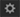

# Fluidic-spelare

Läs den här artikeln när du vill veta hur du använder Fluidic-spelaren för kurser.

Fluidic-spelaren är en plattform för elever som vill konsumera innehåll med oavbruten och blandad inlärningsupplevelse. Alla format som stöds spelas upp konsekvent i den här spelaren. Författare och administratörer kan förhandsgranska innehållet med spelaren.

## Spelarfunktioner {#playerfeatures}

<!---->

**INNEHÅLL** - När du påbörjar en kurs visar spelaren en innehållsförteckning för kursen i den vänstra rutan i fönstret. Du kan klicka på varje ämne och navigera till det direkt.

**Bokmärken** - Om någon av kursmodulerna har en modulinnehållsförteckning kan ämnen i modulen innehållsförteckning bokmärkas för att hänvisa senare. När en post är bokmärkt visas en stjärnikon bredvid posten i innehållsförteckningen. Bokmärken kan du radera genom att klicka på stjärnan igen.

**Anmärkningar** - Det finns en bestämmelse om att anteckningarna ska registreras medan du påbörjar kursen. När anteckningarna har spelats in kan du spara och ladda ned dem som PDF eller skicka dem med e-post till andra registrerade elevers e-postadresser. När du klickar på Spara får du ett alternativ för att välja platsen där du vill spara den som PDF-fil.

*Gör kursanteckningar*

**Undertexter** - För Adobe Captivate-utvecklade kurser, om undertexterna är aktiverade under kursutvecklingen, kan eleven visa undertexterna. Klicka på CC längst ned i spelaren.

**Besök kursen igen** - Du kan återkomma till en kurs i två lägen under två möjliga scenarier:

* Klicka på Besök igen när kursen är i fullständigt läge.
* Klicka på Fortsätt medan kursen är i ofullständigt läge.

**Helskärm** Klicka på helskärmsikonen längst ned till höger i spelaren för att visa kursen i helskärmsläge.

**Navigeringsknappar** Använd uppåt- och nedåtpilarna för att förflytta dig mellan bilderna i PDF-, docx- och pptx-innehåll. Bildpilar kan användas för att flytta till nästa avsnitt för alla typer av innehåll.

**Hoppa framåt/bakåt** När du spelar kan du använda  för att hoppa tillbaka med tio sekunder och   för att hoppa framåt med tio sekunder.

**Ändra uppspelningshastighet** Klicka på  -ikonen för att öppna dialogrutan Inställningar. Ett popup-fönster med texten &quot;Speed&quot; visas. Klicka på Hastighet om du vill visa de fem tillgängliga hastighetsinställningarna: 0,25x, 0,5x, 1x, 1,5x och 2x. 1x är standarduppspelningshastigheten.

*Välj rätt uppspelningshastighet*

**Ändra volyminställningar:** Använd knappen Volymkontroll för att ändra volymen när du går en kurs. Dra volymkontrollen uppåt eller nedåt om du vill ändra volyminställningarna.

*Justera volymen*

**Stäng kursen** Klicka på stängningsikonen (x) längst upp till höger i spelaren för att avsluta kursen.

När du har lämnat kursen kan du gå tillbaka till kursen genom att klicka på **Besök igen** / **Fortsätt** på kursbeskrivningssidan.

Fluidic-spelaren kan också bäddas in på en extern webbplats eller i ett externt program med Learning Manager API.
