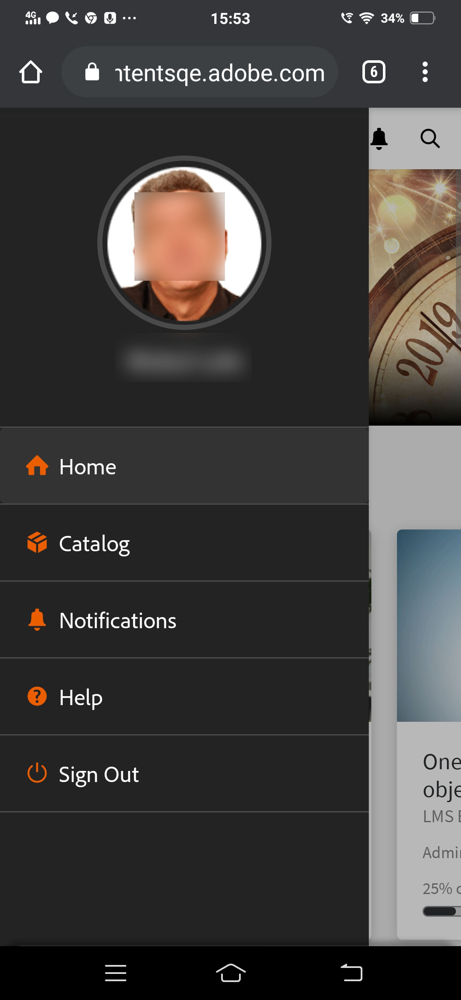
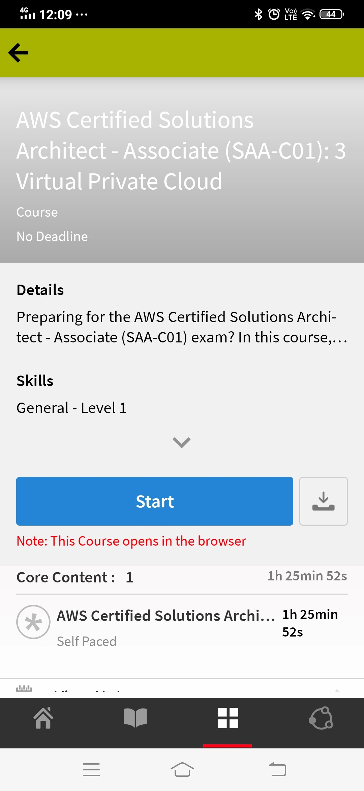
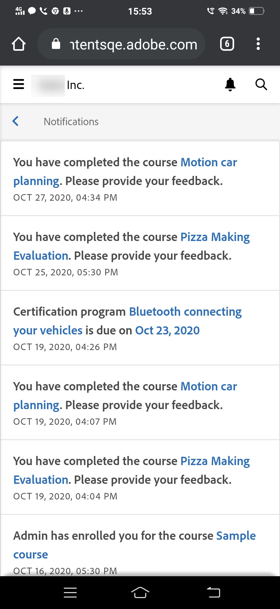
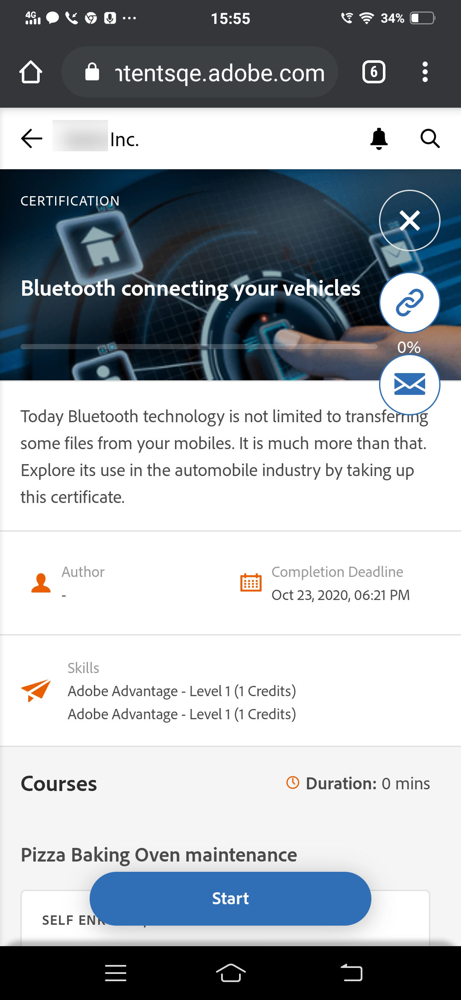
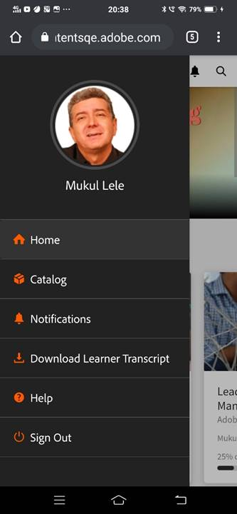
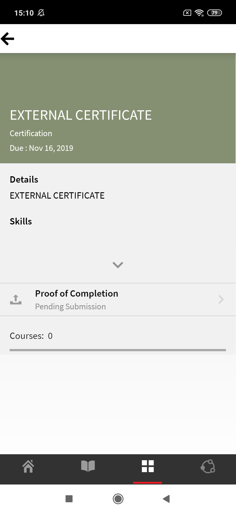
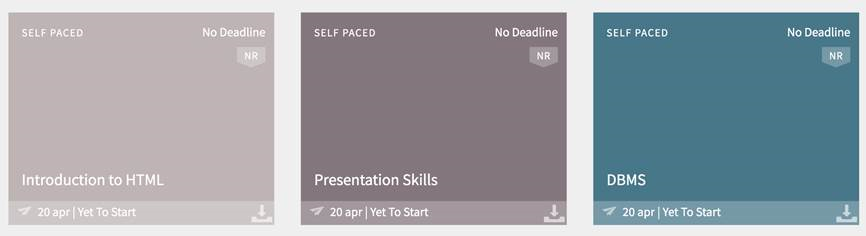

# Elevapp för mobiler och surfplattor

Läs den här artikeln för att lära dig hur du hämtar Learning Manager-elevappen för smartphones och surfplattor. Lär dig att delta i kurser med din mobila enhet eller surfplatta.

## Översikt {#overview}

Learning Manager-appen för elever är tillgänglig för både Android-telefonanvändare och iPhone-användare. Gå till antingen Google Play Store (Android OS) eller iTunes (macOS) och hämta Learning Manager-appen.

När du har hämtat och installerat programmet loggar du in på programmet med dina elevautentiseringsuppgifter. När du öppnar Learning Manager-mobilappen visas följande skärm som standard.

*Startsidan för Learning Manager-appen*

## Startsida {#homepage}

För alla konton som har alternativet Immersive Layout aktiverat finns det en helt ny startsida som stöder konfigurationen för immersiv layout. Startsidan är organiserad som en lista med kort för följande:

|  |  |
|---|---|
|  |  |

*Lista över kort på startsidan*

*Elevens sociala flöde*

## Feedback {#feedbackrating}

Learning Manager uppmanar eleven att ge feedback om sin upplevelse av mobilappen. Denna feedback visas en gång i månaden och ger användarna tillräckligt med tidsintervall för att uppleva appen och sedan ge feedback.

<!--
|  | |
|---|---|
-->

Befintliga användare bör se feedback-popup när de stänger spelaren för första gången efter att ha uppdaterat appen till den senaste versionen.

Observera att feedbacksamlingen är anonym och endast visas för användare som har aktiverat alternativet **Dela användningsdata** via en konfiguration i appinställningarna.

## Ladda ned utmärkelsetecken {#downloadbadge}

Elever kan ladda ner sina märken i PDF- och bildformat. I avsnittet Användarprofil bläddrar du ned och klickar på en länk för att hämta ett märke. Det hämtade märket sparas i standardmappen för enheter. Med appen kan du öppna mappen eller filen direkt efter att hämtningen har slutförts.

|  |
|---|

*Hämta ett utmärkelsetecken*

## Mobil webbresponsiv layout {#responsive}

En helt responsiv mobil webbupplevelse som ser till att eleverna använder sina enheter för att delta i utbildning även om de inte har installerat mobilappen.

När du först loggar in i elevappen via webbläsaren på din enhet visas elevappen i form av en mobilvänlig, responsiv layout.

Det responsiva användargränssnittsstödet för mobilwebben är endast tillgängligt om ett konto **är endast konfigurerad för djup layout**. Det responsiva användargränssnittet är **inte tillgängligt för klassisk layout**.

<!--
<table>
 <tbody>
  <tr>
   <td>
    
<strong>Home page</strong>

    
<strong>View options</strong>

    
<strong>Start course</strong>
</td>
   <td>
    
<strong>My Learning List</strong>

    
<strong>View catalog</strong>

    
<strong>Apply filters</strong>
</td>
   <td>
    
<strong>Recommendations based on interest</strong>

    
<strong>View notifications</strong>

    
<strong>Share url</strong>
</td>
  </tr>
 </tbody>
</table>
-->

## Funktioner utan stöd i en uppslukande mobil upplevelse {#unsupportedfeaturesinmobileimmersiveexperience}

Följande arbetsflöden visas i den klassiska upplevelsen för en elev:

* Flera försök
* Flexi LP
* Scenarier för filöverföring
* Ge L1-feedback

Andra appfunktioner som inte stöds är:

* Social app: en elev omdirigeras till den klassiska upplevelsen om han/hon klickar på den sociala widgeten på startsidan
* Profilinställningar/Redigera profil
* Visa utmärkelsetecken/kompetenser
* Resultattavla: En elev omdirigeras till den klassiska upplevelsen om han klickar på Leaderboard-widgeten på startsidan
* Ladda ned arbetsstöd.
* Filteralternativ i Sök.

Social utbildning har nu stöd för integrerande mobilupplevelser på webben.

Det finns vissa funktioner som inte stöds i appen Mobile Immersive. Dessa är:

| **Område** | **Stöds inte** |
|---|---|
| Tavla | SKAPA TAVLA, REDIGERA TAVLA, KOPIERA URL , TA BORT , RAPPORT, SORTERA , FILTER |
| Inlägg | Frågetyp efter skapande, redigera , flera bilagor till inlägget, kopiera webbadressen, fäst högst upp |
| Kommentar/svar | Redigera, Markera som rätt svar, Överför bild/video/ljud i kommentar eller svar |
| Media | Spela in ljud; överför bara ljudfil |
| Annat | Meddelanden, postvy, resultattavla för sociala nätverk, personer jag följer, användarprofil |

## Gör det möjligt för elever att ladda ned arbetsstöd {#download-job-aid}

I mobilläget kan en elev ladda ned ett arbetsstöd. Tryck **Inställningar** och tryck sedan på **Kataloger**. Hämta ett arbetsstöd från listan som visas.

|  |
|---|

*Ladda ned arbetsstöd*

## Gör det möjligt för elever att ladda ned elevens betygsutdrag {#download-learner-transcript}

I mobilläget kan en elev ladda ned elevens betygsutdrag.

|  |  |
|---|---|

*Ladda ned elevens betygsutdrag*

## Visa utmärkelsetecken och kunskaper {#viewbadgesandskills}

**Visa utmärkelsetecken, kompetenser och spelifieringspunkter**

Standardskärmen visar de utmärkelsetecken, färdigheter och spelifieringspunkter du nyligen har uppnått precis under din profilinformation. Om du använder en telefon visas de utmärkelsetecken du nyligen har använt. Svep åt höger för att se mer information.

**Mina väntande utbildningar**

Som standard visas de kurser du är registrerad för på skärmen. I mundiagrammet visas utbildningarna som är försenade, utbildningar som närmar sig deadline och utbildningar på rätt spår.

Tryck på en kurs för att visa information om kursen, ditt slutförandedatum (i aktuella fall). Du kan antingen fortsätta eller gå tillbaka till kursen från den här skärmen, beroende på din slutförandestatus.

*Visa väntande utbildningar*

**Visa kataloger**

Tryck på ikonen bredvid bokikonen längst ned på skärmen. Du kan omedelbart se katalogen med alla tillhörande utbildningsobjekt. Du kan välja att visa dem i stödrasterlayouten eller välja den detaljerade vyn. Välj rekommendationer för att se kursrekommendationer baserat på din utbildningshistorik.

*Visa kursrekommendationer*

## Sortera och filtrera utbildningsobjekt {#sortandfilterlearningobjects}

**Sortering och filtrering**

Klicka på sorteringsikonen längst upp till höger på skärmen Kurser eller katalog för att sortera utbildningsobjekten i bokstavsordning (stigande eller fallande) eller efter publiceringsdatum. Du kan även filtrera utbildningsobjekten efter typ, slutförandestatus, kunskaper eller taggar. Tryck på och markera filtret och tryck på Använd för att använda filtret.

**Använda sökfunktionen**

Längst upp till höger på mobilskärmen kan du se en sökikon. Tryck på den ikonen för att söka efter utbildningsobjekt med kursmetadata, unikt ID, färdigheter med mera.

**Hantera profil, inställningar och aviseringar**

Tryck  -menyn i det övre vänstra hörnet av skärmen för att visa din profil, meddelanden samt kontoinställningar.

På den här menyn kan du även skanna QR-koden för att markera närvaro för kurser.

Allt du behöver göra är att trycka på **Skanna QR-kod** och skanna koden.

**Offlineförbrukning av kurser**

När du utför hämtade kurser medan du är online kommer Learning Manager åt den hämtade kursen i stället för att göra serversamtal.

## Skanna QR-koden för att registrera dig {#qrcode}

Du kan skanna en QR-kod och registrera dig för en kurs. När utbildningsadministratören har genererat en QR-kod kan du skanna QR-koden från appen och bli registrerad i en kurs.

1. Skanna QR-koden genom att trycka på  längst upp till vänster på skärmen.
1. Tryck **Skanna QR-kod**.

Med QR-funktionen för skanning kan en elev utföra en av åtgärderna som nämns nedan beroende på vilken QR-kod som genereras av utbildningsadministratören:

* **Registrering:** Det gör att eleven kan registrera sig till en kurs genom att skanna QR-koden.
* **Slutförande:** Detta gör det möjligt för eleven att markera kursen som slutförd genom att skanna QR-koden.
* **Registrering och slutförande:** Detta gör det möjligt för eleven att registrera sig och markera slutförande samtidigt genom att skanna QR-koden.
* **Ange närvaro:** Det gör att eleven kan markera närvaro för en viss session genom att skanna QR-koden.

## Byta namn på utbildningsobjekt {#renaminglearningobjects}

Administratörer kan byta namn på utbildningsobjektens terminologi. Om du vill byta namn finns mer information i [Byta namn på utbildningsobjekt](../../administrators/feature-summary/settings.md#main-pars_header_1570157145).

## Socialt lärande {#socialmobile}

Följande funktioner stöds inte i den här uppdateringen. Du kan inte:

* Skapa eller följ en tavla.
* Kopiera en URL till ett inlägg.
* Lägg till inlägg som story eller lägg till som favorit eller fäst högst upp.
* Se en resultattavla för sociala medier.

Social utbildning är en plattform i Learning Manager-mobilappen som engagerar användare att dela idéer och meningsfulla insikter i en informell miljö. Det är en metod som kompletterar idén med traditionellt lärande.

Med social utbildning kan användarna använda expertisen runt dem för att få korrekt och koncis information. Elever kan snabbt använda den informationen för att slutföra en uppgift och uppnå ett mål.

Med mobilappen kan användare interagera med varandra genom att dela innehåll och få validering för det delade innehållet.

På den här plattformen kan du dela olika typer av innehåll: video, ljud, skärmbild, text, fråga och enkät. Användare kan också dela sina onlinelärdomar med andra användare.

Den här funktionen är bara tillgänglig i enhetsappen när administratören aktiverar **Social utbildning** för kontot.

## Starta social utbildning i appen {#launchsociallearningontheapp}

När du startar programmet trycker du på **Social** -ikonen.

*Visa social utbildning*

## Skapa ett inlägg på en tavla {#createapostinaboard}

Precis som alla andra sociala plattformar kan du i Learning Manager-mobilappen skapa ett inlägg på en tavla, så att alla elever som ingår i samma tavla kan se ditt inlägg, kommentera och lägga upp en fil tillsammans med kommentaren.

Skapa ett inlägg genom att trycka på  längst ned till höger på skärmen.

Följande skärm visas.

*Lägg till ett inlägg*

<table>
 <tbody>
  <tr>
   <td>
    

</td>
   <td>
    
Skriv ett inlägg eller klistra in en URL.
</td>
  </tr>
  <tr>
   <td>
    

</td>
   <td>
    
Ta en bild med din mobilkamera och överför den med ditt inlägg.
</td>
  </tr>
  <tr>
   <td>
    

</td>
   <td>
    
Spela in en video med din mobilkamera.
</td>
  </tr>
  <tr>
   <td>
    
 
</td>
   <td>
    
Spela in ljud med din mobil.
</td>
  </tr>
  <tr>
   <td>
    

</td>
   <td>
    
Ladda upp dokument eller filer på tavlan.
</td>
  </tr>
  <tr>
   <td>
    
 
</td>
   <td>
    
Ställ en fråga.
</td>
  </tr>
  <tr>
   <td>
    
 
</td>
   <td>
    
Skapa en enkät med ditt inlägg.
</td>
  </tr>
 </tbody>
</table>

## Innehållsformat som stöds {#supportedcontentformat}

<table>
 <tbody>
  <tr>
   <td>
    
<strong>Innehållstyp</strong>
</td>
   <td>
    
<strong>Tillägg</strong>
</td>
  </tr>
  <tr>
   <td>
    
Video
</td>
   <td>
    
wmv, f4v, asf, 3gp, 3g2, avi, mov, h264, m4v, mp4, MPEG, mpg
</td>
  </tr>
  <tr>
   <td>
    
Ljud
</td>
   <td>
    
mp3, amr, m4a, wav, wma, aac
</td>
  </tr>
  <tr>
   <td>
    
Statiska filer
</td>
   <td>
    
PDF, ppt, pptx, doc, docx, xls, xlsx
</td>
  </tr>
  <tr>
   <td>
    
Bild
</td>
   <td>
    
jpg, jpeg, png, bmp, gif
</td>
  </tr>
 </tbody>
</table>

När du har skapat ett inlägg väljer du tavlan där du vill lägga upp inlägget. Tryck på Välj tavla och sök efter den önskade tavlan.

När du har skapat ett inlägg trycker du på Publicera och publicerar din kommentar så att andra elever kan se ditt inlägg.

I mobilappen kan du inte skapa en anslagstavla. För att skapa en anslagstavla måste du logga in på webbappen som elev. Mer information om hur du skapar en anslagstavla finns i Social utbildning i [Learning Manager](/help/migrated/learners/feature-summary/social-learning-web-user.md).

## Åtgärder som kan utföras på ett inlägg {#actionsthatcanbeperformedonapost}

* Kommentera ett inlägg och utifrån behörigheten, visa inlägg på en tavla.
* Redigera eller ta bort kommentarer på en tavla.
* Redigera eller ta bort ett inlägg baserat på behörigheter.
* Rapportera ett missbruk av ett inlägg om det kränker deras integritet eller om innehållet är olämpligt. När ett inlägg har rapporterats skickas ett meddelande till administratören för anslagstavlan och moderatorer för vidare åtgärder.
* Gilla    eller ogilla     ett inlägg.
* Gilla   eller ogilla  en kommentar.

## Skapa ett inlägg på andra tavlor {#createapostinotherboards}

Du kan även skapa ett inlägg i andra tavlor.

Tryck **Alla tavlor** och du kan se aktiviteterna på tavlan som utförs av andra elever.

*Visa alla tavlans aktiviteter*

Navigera till önskad tavla och publicera din kommentar.

## Dela media på en tavla {#sharemedia}

<!---->

Dela bilder, dokument eller ljud- eller videofiler till en anslagstavla så att andra styrelseledamöter kan se ditt inlägg och starta en interaktion. Om du vill dela medier

1. Öppna den mediefil som du vill dela.
1. Tryck på knappen Dela och välj Learning Manager.
1. Välj den anslagstavla där du vill dela mediet.
1. Tryck **Post**.

Du kan också lägga upp innehåll från en extern app, till exempel dela en kommentar från Reddit eller Quora.

## Överför resurser i externt certifikat som bevis på slutförande {#externalcert}

Följ stegen nedan:

1. Logga in på enhetsprogrammet med dina elevautentiseringsuppgifter.
1. Sök efter det certifikat som skaparen har skapat.
1. I listan över externa certifikat väljer du det certifikat som krävs och registrerar dig för certifikatet.
1. Tryck **Bevis på slutförande** och ladda upp en fil, till exempel en PDF-fil eller en bild.

   |  |  |
   |---|---|
   *Ladda upp bevis på slutförande*

1. När du har överfört en fil går du till fliken **Skicka**. Ett bekräftelsemeddelande visas.

**Ladda upp en fil**

1. När du har överfört en fil trycker du på **Skicka**.

   Du kan endast ladda upp en fil som bevis på slutförande. När du försöker överföra flera filer visas följande meddelande:

   **Ändringarna du har gjort kommer att gå förlorade. Vill du fortsätta?**

1. Statusen ändras till **Väntar på godkännande** visas i orange färg.

   Du kan inte visa eller hämta den överförda filen i mobilappen.

När chefen har godkänt överföringen ändras statusen till **Godkänt**, som färgats i grönt.

Om chefen avslår ansökan ändras statusen till **Avvisat**, röd.

|  |  |  |
|---|---|---|

*Visa inlämningsstatus*

Efter avslaget får du ladda upp en fil som bevis på slutförandet.

* Du kan bara skicka en fil när statusen är **Väntande ansökan och avvisat**.
* Du kan inte skicka en fil när statusen är **Väntar på godkännande och godkänd**.

## Gå på kurser från LinkedIn Learning {#linkedin}

Learning Manager har redan stöd för LinkedIn Learning-kurser på utbildningsplattformen. Nu kan elever gå sådan LinkedIn Learning-kurs i Learning Manager-mobilappen. Sök efter en kurs i enhetsappen och starta sedan kursen.

Om du redan har LinkedIn-programmet installerat kommer kursen att öppnas i programmet, annars öppnas kursen i standardwebbläsaren, där du måste logga in med dina LinkedIn-inloggningsuppgifter.

Om du går kursen via LinkedIn-appen kommer dina framsteg inte att spåras i Learning Manager. Därför rekommenderar vi att kursen startas i webbläsaren i stället för i LinkedIn Learning-appen.

>[!NOTE]
>
>Du kan bara delta i kurserna om du har en aktiv internetuppkoppling.

|  |  |  |
|---|---|---|

*Registrera dig för kurser i LinkedIn Learning*

Utbildningstiden som tillbringas i LinkedIn-utbildningskurser meddelas av LinkedIn content/LinkedIn-plattformen till utbildningsplattformen Learning Manager.

Om LinkedIn Learning inte skickar utbildningstiden kan den inte registreras på vår utbildningsplattform. I så fall är den inlärningstid som Learning Manager visar noll.

## Skicka fil för klassrums- och aktivitetsmoduler {#submitfile}

En elev kan skicka in filer som bevis på att kursen är slutförd till instruktören. Instruktören kan sedan godkänna eller avslå ditt bidrag baserat på innehållet i filen.

En författare kan bara skapa klassrums- och aktivitetsmoduler som en elev kan använda i mobilappen.

När eleven har startat en kurs kan eleven se statusen **Insändning av fil** som väntar tillsammans med länken för att ladda upp filen, på skärmen, som visas i skärmbilden nedan.

*Status för inskickad fil*

För att ladda upp filen, klicka på **Överför fil**.

Ladda upp valfri fil och klicka på **Skicka** knapp.

 

*Skicka en fil*

## Filtyper som stöds för överföring {#supportedfiletypesforupload}

<table>
 <tbody>
  <tr>
   <td>
    
<b>Innehållstyp</b>
</td>
   <td>
    
<b>Tillägg</b>
</td>
  </tr>
  <tr>
   <td>
    
Video
</td>
   <td>
    
wmv, f4v, asf, 3gp, 3g2, avi, mov, h264, m4v, mp4, MPEG, mpg
</td>
  </tr>
  <tr>
   <td>
    
Ljud
</td>
   <td>
    
mp3, amr, m4a, wav, wma, aac
</td>
  </tr>
  <tr>
   <td>
    
Statiska filer
</td>
   <td>
    
PDF, ppt, pptx, doc, docx, xls, xlsx
</td>
  </tr>
  <tr>
   <td>
    
Bild
</td>
   <td>
    
jpg, jpeg, png, bmp, gif
</td>
  </tr>
 </tbody>
</table>

## Godkännande eller avvisande av ansökan {#approvalorrejectionofsubmission}

När du har överfört filen ändras statusen till **Väntar på godkännande.**. Instruktören visar sedan listan med [väntande ansökningar](/help/migrated/instructors/feature-summary/learners.md) och godkänner eller avvisar inskickningen via instruktörens webbapp.

När instruktören godkänner inlämningen ändras status i elevens mobilapp till **Godkänt**.

<!---->

När instruktören avslår ansökan ändras statusen i elevens mobilapp till **Avvisat**.

<!---->

Klicka på länken om du vill skicka filen igen **Överför fil**.

## Learning Manager för iPad och surfplattor {#captivateforipadandtablets}

När du har loggat in som elev i Learning Manager-appen på en iPad- eller Android-surfplatta kan du se följande **Startsida** skärmen:

<!---->

Gå till utbildnings- och katalogfunktionerna genom att trycka på **Meny** och väljer lämpligt alternativ.

<!---->

Du kan visa uppsättningen med kurser i en listvy i stället för vyn med rutor/kort.

## Åtkomst till appen offline {#accesstheappoffline}

Du kan komma åt Learning Manager-appen offline på iPad och Android-surfplattor. Du kan hämta kurser och utbildningsprogram. Gå kurser, konsumera utbildningsprogrammen i offlineläge och synkronisera innehållet med onlineappen när du ansluter till nätverket.

1. Tryck **Meny** listrutan högst upp och tryck på **Utbildning** alternativ. En lista över alla tillgängliga kurser visas sida vid sida.
1. Tryck på hämtningsikonen längst ned på varje panel för utbildningsobjekt för att hämta utbildningsinnehållet.

   

   *Hämta innehållet*

   Ett meddelande om enhetens nätverksstatus visas i ett fält högst upp i appen.

   * Rött fält anger att nätverket inte är tillgängligt för enheten.
   * Gröna fältet indikerar nätverket är tillbaka online.

Användaren kan växla tillbaka till online-läge genom att klicka på **visa onlinematerial** i det gröna fältet. Innehåll i enheten synkroniseras när användaren växlar till onlineläge.

<!--## Track device storage {#trackdevicestorage}

You can monitor your device storage periodically.

Tap the profile icon at the upper-right corner of the app and tap **Device Storage** menu option.

An app storage information dialog appears as shown below.

Using the app storage information, you can check the total space of device, app and the downloaded courses. This information enables you to download courses accordingly. To delete the downloaded courses in the device, tap delete icon adjacent to each course name.-->