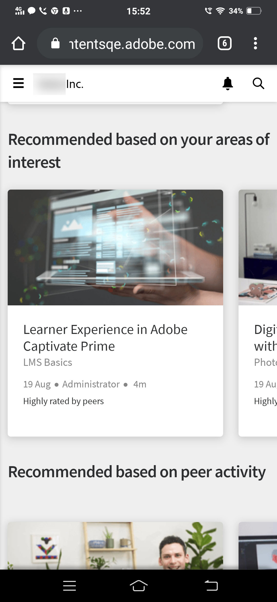
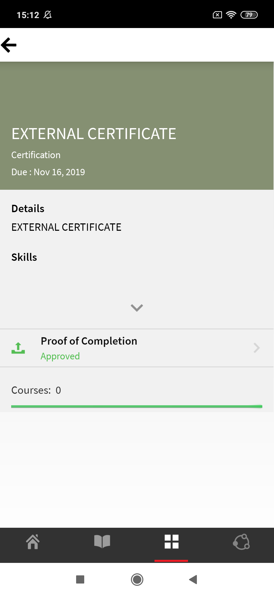

# Learner App för mobiler och surfplattor

Läs den här artikeln för att veta hur du laddar ner Learning Manager Learner-appen för smartphones och surfplattor. Lär dig hur du använder kurser med din mobil eller surfplatta.

## Översikt {#overview}

Learning Manager-appen för elever är tillgänglig för både Android-telefonanvändare och iPhone-användare. Gå till antingen Google Play Store (Android OS) eller iTunes (macOS) och ladda ner appen Learning Manager.

När du har laddat ner och installerat den här appen loggar du in på appen med dina inloggningsuppgifter. När du öppnar mobilappen för utbildningshanteraren visas följande skärm som standard.

*Startsidan för appen Learning Manager*

## Hemsida {#homepage}

För alla konton som har alternativet Avancerad layout aktiverat finns det en helt ny startsida som stöder konfigurationen av Avancerad layout. Startsidan är organiserad som en lista med kort för följande:

|  |  |
|---|---|
|  |  |

*Lista över kort på startsidan*

*Elevens sociala flöde*

## Feedback betyg {#feedbackrating}

Learning Manager uppmanar eleven att ge feedback om sin upplevelse av mobilappen. Den här feedbacken visas en gång i månaden och ger tillräckligt med tidsintervall för att användarna ska kunna uppleva appen och sedan ge feedback.

<!--
|  | |
|---|---|
-->

För befintliga användare bör de se popup-fönstret för feedback när de stänger spelaren för första gången efter att ha uppdaterat appen till den senaste versionen.

Observera att feedbackinsamlingen är anonym och endast visas för användare som har aktiverat alternativet **Dela användningsdata** via en konfiguration i Appinställningar.

## Ladda ner emblem {#downloadbadge}

Eleverna kan ladda ner sina märken i PDF- och bildformat. I avsnittet Användarprofil bläddrar du nedåt och klickar på en länk för att ladda ned ett märke. Det nedladdade märket sparas i standardmappen för enheten. Appen låter dig öppna mappen eller filen direkt efter att nedladdningen är klar.

|  |
|---|

*Ladda ned ett märke*

## Mobil webbresponsiv layout {#responsive}

En helt responsiv mobil webbupplevelse som säkerställer att eleverna använder sina enheter för att konsumera utbildning även om de inte har installerat mobilappen.

När du först loggar in på elevappen via webbläsaren på din enhet visas elevappen i form av en mobilvänlig, responsiv layout.

Stödet för det mobila webbresponsiva användargränssnittet är endast tillgängligt när ett konto **endast är konfigurerat för integrerande layout**. Det responsiva användargränssnittet är **inte tillgängligt för klassisk layout**.

<!--
<table>
 <tbody>
  <tr>
   <td>
    
<strong>Home page</strong>

    
<strong>View options</strong>

    
<strong>Start course</strong>
</td>
   <td>
    
<strong>My Learning List</strong>

    
<strong>View catalog</strong>

    
<strong>Apply filters</strong>
</td>
   <td>
    
<strong>Recommendations based on interest</strong>

    
<strong>View notifications</strong>

    
<strong>Share url</strong>
</td>
  </tr>
 </tbody>
</table>
-->

## Ladda ner prompt i ALM web

När användare öppnar en ALM-länk eller använder ALM-webben på sina mobila enheter bör de se en uppmaning som ber dem att ladda ner appen för en bättre upplevelse.

_Ladda ner ALM-appen_

## Funktioner som inte stöds i en integrerad mobilupplevelse {#unsupportedfeaturesinmobileimmersiveexperience}

Följande arbetsflöden visas i den klassiska upplevelsen för en elev:

* Flera försök
* Flexi LP
* Scenarier för filuppladdning
* Ge L1-feedback

Andra appfunktioner som inte stöds är:

* Social App: En elev omdirigeras till klassisk upplevelse om han/hon klickar på Social widget på startsidan
* Profilinställningar/Redigera profil
* Visa märke/färdigheter
* Topplista: En elev omdirigeras till klassisk upplevelse om han klickar på topplistewidgeten på startsidan
* Ladda ner Job Aids.
* Filtrera alternativ i Sök.

Social inlärning har nu stöd för mobila uppslukande webbupplevelser.

Det finns vissa funktioner som inte stöds Mobile Immersive App. Dessa är:

| **Område** | **Stöds inte** |
|---|---|
| Tavla | Skapa anslagstavla, redigera anslagstavla, kopiera URL , ta bort , rapportera, sortera, filtrera |
| Inlägg | Omröstningstyp: Skapa inlägg, Redigera, Flera bilagor till inlägget, Kopiera URL, Fäst överst |
| Kommentar/ Svar | Redigera, markera som rätt svar, ladda upp bild/video/ljud i kommentar eller svar |
| Media | Fånga ljud; Endast uppladdning av ljudfil |
| Annat | Meddelanden, Inläggsvisning, Social topplista, Personer jag följer, Användarprofil |

## Gör det möjligt för elever att ladda ner Job Aid {#download-job-aid}

I det mobila uppslukande läget kan en elev ladda ner ett jobbhjälpmedel. Tryck på **Inställningar** och sedan på **Kataloger**. Ladda ner ett Jobbhjälpmedel från listan som visas.

|  |
|---|

*Ladda ner ett jobbstöd*

## Gör det möjligt för elever att ladda ner Learner Transcript {#download-learner-transcript}

I det mobila uppslukande läget kan en elev ladda ner Learner Transcripts.

|  |  |
|---|---|

*Ladda ner Learner Transcripts*

## Visa emblem och färdigheter {#viewbadgesandskills}

**Visa märken, färdigheter och spelifieringspoäng**

Standardskärmen visar dina nyligen uppnådda märken, färdigheter och spelifieringspoäng precis under din profilinformation. Om du använder en telefon visas de nyligen uppnådda märkena. Svep åt höger för att se mer information.

**Mina väntande lärdomar**

Som standard visar skärmen de kurser som du är inskriven på. Ringdiagrammet visar den försenade inlärningen, lärdomar som närmar sig deadline och lärdomar som är på rätt spår.

Tryck på en kurs för att visa information om kursen och ditt slutdatum (om tillämpligt). Du kan antingen fortsätta eller gå tillbaka till kursen från den här skärmen, beroende på din slutförandestatus.

*Visa väntande inlärningar*

**Visa kataloger**

Tryck på ikonen bredvid bokikonen längst ned på skärmen. Du kan visa katalogen direkt med alla associerade lärobjekt. Du kan välja att visa dem i rutnätslayout eller välja den detaljerade vyn. Välj rekommendationer för att se kursrekommendationer baserat på din inlärningshistorik.

*Visa kursrekommendationer*

## Sortera och filtrera lärobjekt {#sortandfilterlearningobjects}

**Sortering och filtrering**

Klicka på sorteringsikonen längst upp till höger på kurs- eller katalogskärmen för att sortera lärobjekten i alfabetisk ordning (stigande eller fallande) eller efter publiceringsdatum. Du kan också filtrera lärobjekten efter typ, slutförandestatus, färdigheter eller efter taggar. Tryck och välj filtret och tryck på Använd för att tillämpa filtret.

**Använda sökfunktionen**

Längst upp till höger på telefonens skärm kan du se en sökikon. Tryck på den ikonen för att söka efter lärobjekt med hjälp av kursmetadata, unikt ID, färdigheter och så vidare.

**Hantera profil, inställningar och aviseringar**

Tryck på  menyn längst upp till vänster på skärmen för att visa din profil, aviseringar och kontoinställningar.

Den här menyn låter dig också skanna QR-koden för att markera närvaro för kurser.

Allt du behöver göra är att trycka på **alternativet Skanna QR-kod** och skanna koden.

**Offline-konsumtion av kurser**

När du använder nedladdade kurser medan du är online kommer Learning Manager att komma åt den nedladdade kursen istället för att göra serveranrop.

## Skanna QR-koden för att registrera dig {#qrcode}

Du kan skanna en QR-kod och anmäla dig till en kurs. När utbildningsadministratören har genererat en QR-kod kan du skanna QR-koden från appen och bli inskriven på en kurs.

1. För att skanna QR-koden, tryck på  i det övre vänstra hörnet av skärmen.
1. Tryck på **Skanna QR-kod**.

QR-funktionen för skanning gör det möjligt för en elev att utföra en av de åtgärder som nämns nedan beroende på vilken QR-kod som genereras av inlärningsadministratören:

* **Inskrivning:** Detta gör det möjligt för eleven att anmäla sig till en kurs genom att skanna QR-koden.
* **Slutförande:** Detta gör det möjligt för eleven att markera kursen som slutförd genom att skanna QR-koden.
* **Inskrivning och slutförande:** Detta gör det möjligt för eleven att registrera sig och markera slutförande samtidigt genom att skanna QR-koden.
* **Markera närvaro:** Detta gör det möjligt för eleven att markera närvaro för en viss session genom att skanna QR-koden.

## Byta namn på lärobjekt {#renaminglearningobjects}

Administratörer kan byta namn på Terms för inlärningsobjekt. Information om hur du byter namn finns i [Byta namn på lärobjekt](../../administrators/feature-summary/settings.md#main-pars_header_1570157145).

## Social inlärning {#socialmobile}

I den här uppdateringen stöds inte följande funktioner. Du kan inte:

* Skapa eller följ en anslagstavla.
* Kopiera en URL till ett inlägg.
* Lägg till inlägg som händelse eller lägg till som inlägg som favorit eller fäst högst upp.
* Visa en social topplista.

Socialt lärande är en plattform i mobilappen Learning Manager, som engagerar användare att dela idéer och meningsfulla insikter i en informell miljö. Det är en metodik som kompletterar idén om traditionellt lärande.

Social inlärning gör det möjligt för användare att använda expertisen runt omkring dem för att få korrekt och kortfattad information. Eleverna kan snabbt tillämpa den informationen för att slutföra en uppgift och uppnå ett mål.

Med hjälp av mobilappen kan användare interagera med varandra genom att dela innehåll och få validering för det delade innehållet.

På den här plattformen är de olika typerna av innehåll som kan delas video, ljud, skärmdump, text, fråga och omröstning. Användare kan också dela sina onlineinlärningar med sina kamrater.

Den här funktionen är endast tillgänglig i enhetsappen när administratören aktiverar **Social Learning** för kontot.

## Starta socialt lärande i appen {#launchsociallearningontheapp}

När du startar appen trycker du på ikonen Socialt ****.

*Visa social inlärning*

## Skapa ett inlägg på en anslagstavla {#createapostinaboard}

Precis som på alla andra sociala plattformar kan du skapa ett inlägg på en anslagstavla i mobilappen Learning Manager, så att alla elever som är med på samma anslagstavla kan se ditt inlägg, kommentera och ladda upp en fil tillsammans med kommentaren.

För att skapa ett inlägg, tryck på  längst ned till höger på skärmen.

Följande skärm visas.

*Lägg till ett inlägg*

<table>
 <tbody>
  <tr>
   <td>
    

</td>
   <td>
    
Skriv ett inlägg eller klistra in en webbadress.
</td>
  </tr>
  <tr>
   <td>
    

</td>
   <td>
    
Ta en bild med din mobilkamera och ladda upp den med ditt inlägg.
</td>
  </tr>
  <tr>
   <td>
    

</td>
   <td>
    
Spela in en video med din mobilkamera.
</td>
  </tr>
  <tr>
   <td>
    
 
</td>
   <td>
    
Spela in ljud med din mobil.
</td>
  </tr>
  <tr>
   <td>
    

</td>
   <td>
    
Ladda upp ett dokument eller en fil på anslagstavlan.
</td>
  </tr>
  <tr>
   <td>
    
 
</td>
   <td>
    
Ställ en fråga.
</td>
  </tr>
  <tr>
   <td>
    
 
</td>
   <td>
    
Skapa en omröstning med ditt inlägg.
</td>
  </tr>
 </tbody>
</table>

## Innehållsformat som stöds {#supportedcontentformat}

<table>
 <tbody>
  <tr>
   <td>
    
<strong>Typ av innehåll</strong>
</td>
   <td>
    
<strong>Tillägg</strong>
</td>
  </tr>
  <tr>
   <td>
    
Video
</td>
   <td>
    
wmv, f4v, asf, 3gp, 3g2, avi, mov, h264, m4v, mp4, MPEG, mpg
</td>
  </tr>
  <tr>
   <td>
    
Ljud
</td>
   <td>
    
mp3, amr, m4a, wav, wma, aac
</td>
  </tr>
  <tr>
   <td>
    
Statiska filer
</td>
   <td>
    
PDF, ppt, pptx, doc, docx, xls, xlsx
</td>
  </tr>
  <tr>
   <td>
    
Bild
</td>
   <td>
    
jpg, jpeg, png, bmp, gif
</td>
  </tr>
 </tbody>
</table>

När du har skapat ett inlägg väljer du den anslagstavla där du vill ladda upp inlägget. Tryck på Välj anslagstavla och sök efter önskad anslagstavla.

När du har skapat ett inlägg trycker du på Lägg upp och lägger upp din kommentar så att andra elever kan se ditt inlägg.

I mobilappen kan du inte skapa en anslagstavla. För att skapa en anslagstavla måste du logga in på webbappen som elev. Mer information om hur du skapar en anslagstavla finns i Social inlärning i [Learning Manager](/help/migrated/learners/feature-summary/social-learning-web-user.md).

## Åtgärder som kan utföras på ett inlägg {#actionsthatcanbeperformedonapost}

* Kommentera ett inlägg och baserat på behörigheten, visa inlägg på en anslagstavla.
* Redigera eller ta bort kommentarer på en anslagstavla.
* Redigera eller ta bort ett inlägg baserat på behörigheter.
* Anmäl missbruk av ett inlägg om det kränker deras integritet eller om innehållet är olämpligt. När ett inlägg har anmälts skickas en notifikation till forumadministratören och moderatorerna för vidare åtgärder.
* Gilla    eller ogilla     ett inlägg.
* Gilla   eller ogilla  en kommentar.

## Skapa ett inlägg på andra anslagstavlor {#createapostinotherboards}

Du kan också skapa ett inlägg på andra anslagstavlor.

Tryck på **Alla tavlor** så kan du se de aktiviteter på tavlan som utförs av andra elever.

*Visa alla styrelseaktiviteter*

Navigera till önskad anslagstavla och skriv din kommentar.

## Dela media på en anslagstavla {#sharemedia}

<!---->

Dela bilder, dokument eller ljud- eller videofiler på en anslagstavla så att andra forummedlemmar kan se ditt inlägg och starta en interaktion. För att dela media,

1. Öppna mediefilen som du vill dela.
1. Tryck på dela-knappen och välj Utbildningshanterare.
1. Välj den anslagstavla där du vill dela media.
1. Tryck på **Publicera**.

Du kan också lägga upp innehåll från en extern app, till exempel kan du dela en kommentar från Reddit eller Quora.

## Ladda upp resurser i ett externt certifikat som bevis på slutförande {#externalcert}

Följ stegen nedan:

1. Logga in på enhetsappen med dina inloggningsuppgifter.
1. Sök efter certifikatet som författaren har skapat.
1. I listan över externa certifikat väljer du det certifikat som krävs och registrerar dig för certifikatet.
1. Tryck på **Bevis på slutförande** och ladda upp en fil, till exempel en pdf eller en bild.

   |  |  |
   |---|---|

*Ladda upp bevis på slutförande*

1. När du har laddat upp en fil klickar du på **Skicka**. Ett bekräftelsemeddelande visas.

**Ladda upp en fil**

1. När du har laddat upp en fil trycker du på **Skicka**.

   Du kan bara ladda upp en fil som bevis på att den är klar. När du försöker ladda upp flera filer visas följande meddelande:

   **De ändringar du har gjort kommer att gå förlorade. Vill du fortsätta?**

1. Statusen ändras till **Väntar på godkännande**, som visas i en orange färg.

   Du kan inte visa eller ladda ner den uppladdade filen i mobilappen.

När chefen har godkänt inlämningen ändras statusen till **Godkänd**, färgad i grönt.

Om chefen avvisar inlämningen ändras statusen till **Avvisad**, färgad i rött.

|  |  |  |
|---|---|---|

*Visa status för inlämning*

Efter avslag får du ladda upp en fil som bevis på att den är klar.

* Du kan bara skicka en fil när statusen är **Väntar på att skickas och Avvisad**.
* Du kan inte skicka en fil när statusen är **Väntar på godkännande och Godkänd**.

## Gå kurser från LinkedIn Learning {#linkedin}

Learning Manager har redan stöd för LinkedIn Learning-kurser inom lärplattformen. Nu kan eleverna delta i sådana LinkedIn Learning-kurser i mobilappen Learning Manager. I enhetsappen söker du efter en kurs och startar sedan kursen.

Om du redan har LinkedIn-appen installerad kommer kursen att öppnas i appen, eller så öppnas kursen i standardwebbläsaren, där du måste logga in med dina LinkedIn-uppgifter.

Om du går kursen via LinkedIn-appen kommer dina framsteg inte att spåras i Learning Manager. Därför rekommenderas det att kursen startas i webbläsaren istället för LinkedIn Learning-appen.

>[!NOTE]
>
>Du kan bara gå kurserna om du har en aktiv internetuppkoppling.

|  |  |  |
|---|---|---|

*Anmäl dig till kurser i LinkedIn Learning*

Inlärningstid som tillbringas i LinkedIn Learning-kurser kommuniceras av LinkedIn-innehållet/LinkedIn-plattformen till Learning Manager-lärplattformen.

Om LinkedIn learning inte skickar inlärningstiden kan den inte registreras av vår lärplattform. I sådana fall är den inlärningstid som visas av Learning Manager noll.

## Skicka in fil för klassrum och aktivitetsmoduler {#submitfile}

Som elev kan du skicka in filer till din lärare som bevis på att du har slutfört kursen. Läraren kan sedan godkänna eller avvisa din inlämning, baserat på innehållet i filen.

En författare kan bara skapa klassrums- och aktivitetsmoduler som en elev kan använda i mobilappen.

När eleven har startat en kurs kan eleven se statusen **Filinlämning** som väntande tillsammans med länken för att ladda upp filen på skärmen, som visas i skärmdumpen nedan.

*Status för inlämning av filer*

Om du vill ladda upp filen klickar du på **Ladda upp fil**.

Ladda upp en fil och klicka på **knappen Skicka** .

 

*Skicka en fil*

## Filtyper som stöds för uppladdning {#supportedfiletypesforupload}

<table>
 <tbody>
  <tr>
   <td>
    
<b>Typ av innehåll</b>
</td>
   <td>
    
<b>Tillägg</b>
</td>
  </tr>
  <tr>
   <td>
    
Video
</td>
   <td>
    
wmv, f4v, asf, 3gp, 3g2, avi, mov, h264, m4v, mp4, MPEG, mpg
</td>
  </tr>
  <tr>
   <td>
    
Ljud
</td>
   <td>
    
mp3, amr, m4a, wav, wma, aac
</td>
  </tr>
  <tr>
   <td>
    
Statiska filer
</td>
   <td>
    
PDF, ppt, pptx, doc, docx, xls, xlsx
</td>
  </tr>
  <tr>
   <td>
    
Bild
</td>
   <td>
    
jpg, jpeg, png, bmp, gif
</td>
  </tr>
 </tbody>
</table>

## Godkännande eller avslag på inlämning {#approvalorrejectionofsubmission}

När du har laddat upp filen ändras statusen till **Väntar på godkännande.**. Läraren visar sedan listan över [väntande inlämningar](/help/migrated/instructors/feature-summary/learners.md) och godkänner eller avvisar inlämningen via instruktörens webbapp.

När läraren godkänner inlämningen ändras statusen i Learner-mobilappen till **Godkänd**.

<!---->

När läraren avvisar inlämningen ändras statusen i Learner-mobilappen till **Avvisad**.

<!---->

Om du vill skicka in filen igen klickar du på länken **Ladda upp fil**.

## Learning Manager för iPad och surfplattor {#captivateforipadandtablets}

När du har loggat in som elev i Learning Manager-appen på iPad eller Android-surfplatta kan du se följande **startskärm** :

<!---->

Om du vill navigera till inlärnings- och katalogfunktioner trycker du på **rullgardinsmenyn Meny** och väljer lämpligt alternativ.

<!---->

Du har möjlighet att visa uppsättningen med kurser i en listvy istället för sida vid sida/kortvy.

## Få tillgång till appen offline {#accesstheappoffline}

Du kan komma åt Learning Manager-appen offline på iPad och Android-surfplattor. Du kan ladda ner kurser och utbildningsprogram. Ta kurser, konsumera inlärningsprogrammen i offlineläge och synkronisera innehållet tillbaka med onlineappen när du ansluter till nätverket.

1. Tryck på **rullgardinsmenyn Meny** högst upp och tryck på **Inlärningsalternativ** . En lista över alla tillgängliga kurser visas i rutor.
1. Tryck på nedladdningsikonen längst ned på varje lärobjektsruta för att ladda ned utbildningsinnehållet.

   

   *Ladda ner innehållet*

   En uppmaning visas i ett fält högst upp i appen som anger enhetens nätverksstatus.

   * Röd stapel indikerar att nätverket inte är tillgängligt för enheten.
   * Grön stapel indikerar att nätverket är online igen.

Användaren kan växla tillbaka till onlineläge genom att klicka på **knappen Visa onlineinnehåll** i det gröna fältet. Innehållet i enheten synkroniseras när användaren växlar till onlineläge.

## Stöd för kundvagn med flera artiklar på mobil uppslukande

Elever kan nu lägga till flera kurser, utbildningsvägar eller certifieringar i kundvagnen och köpa dem tillsammans. Visa [kundvagn med flera artiklar i ALM](/help/migrated/learners/feature-summary/multi-item-cart.md)

<!--## Track device storage {#trackdevicestorage}

You can monitor your device storage periodically.

Tap the profile icon at the upper-right corner of the app and tap **Device Storage** menu option.

An app storage information dialog appears as shown below.

Using the app storage information, you can check the total space of device, app and the downloaded courses. This information enables you to download courses accordingly. To delete the downloaded courses in the device, tap delete icon adjacent to each course name.-->
