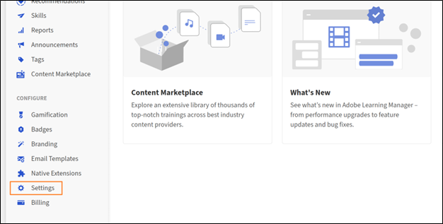
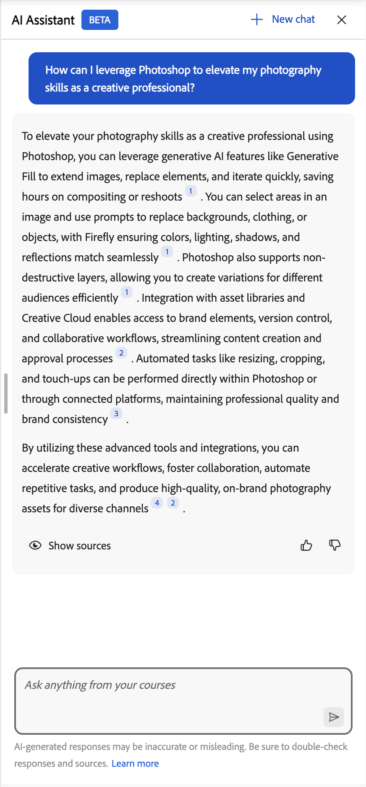

# AI-assistent för elever

AI-assistenten (beta) för elever hjälper dem att snabbt hitta svar från det tilldelade utbildningsinnehållet utan att bläddra igenom hela kurser. Du kan ställa frågor på ett enkelt språk och få korrekta, fokuserade svar med källänkar till relevant kursinnehåll.

>[!IMPORTANT]
>
>AI Assistant för elever är för närvarande tillgänglig som en betafunktion. Funktioner, scenarier som stöds och begränsningar kan ändras allt eftersom funktionen utvecklas.

## Vad är AI-assistenten för elever

AI Assistant är en GenAI-driven chattföljeslagare i Adobe Learning Manager som levererar snabba, korrekta svar på elevfrågor med hjälp av det betrodda utbildningsinnehåll som finns tillgängligt för dem i Adobe Learning Manager. Det innehåller också citat, så att eleverna alltid vet källan till informationen.

### AI-assistentens viktigaste funktioner

1. Intelligent frågesvar
   * Samtal med enkeltur och flersväng
   * Naturlig språkförståelse på engelska
   * Svar från kurser, certifieringar, utbildningsvägar och arbetsstöd
   * Smarta klarlägganden av frågor när frågorna är tvetydiga
   * Drivs av Azure Open AI LLM-funktioner för att generera svar
2. Innehållskällor och citat
   * Hämtar svar från tillgängliga resurser i kataloger som stöds.
   * Tillhandahåller citat med direkta länkar till källmaterial
   * Stöder alla ALM-innehållsformat statiska och interaktiva: PDF, DOCX, PPTX, XLSX, Audio (mp3, wav, m4a), Video (mp4, mov, wmv), HTML, SCORM 2004, SCORM 1.2
3. Användarupplevelse
   * Gränssnitt för sidopanel från alla elevsidor
   * Responsiv design som anpassar sig till innehållsområdet
   * Chatthistorik bibehållen i webbläsarsessionen
   * Rensa platta vid ny inloggning eller siduppdatering
   * Lärare eller handledarton: vänlig, tydlig och pedagogiskt sund
4. Administratörskontroller
   * Aktivera eller inaktivera funktionen på kontonivå
   * Kontrollera åtkomst för användargrupper
   * Välj vilka kataloger som ska ingå i AI-svar
   * Krav på godkännande av användningsvillkor för att följa Adobes AI-riktlinjer

## Vilka typer av innehåll stöder AI Assistant

AI-assistenten hämtar information från utbildningsinnehåll som tilldelats dig, inklusive:

* **Dokument:** PDF, Word, PowerPoint, Excel, HTML
* **Media:** Ljud (mp3, wav, m4a), video (mp4, mov, wmv)
* **Interaktivt innehåll:** SCORM 1.2, SCORM 2004
* **Typer av utbildningsobjekt:** Kurser, utbildningsvägar, certifieringar, arbetsstöd

Adobe transkriberar utbildningsinnehåll på ett säkert sätt med hjälp av betrodda externa bearbetningstjänster som tillhandahålls i Adobe privata VPC-miljöer.

### Begränsningar för kataloger och innehållskällor

Elevens AI-assistent använder bara innehåll från **interna kataloger** som uttryckligen har konfigurerats av administratörer.

Följande innehållskällor stöds **inte** i den aktuella versionen:

* Delade kataloger
* Förvärvade kataloger
* Externa kataloger
* Standardkataloger
* Innehållsbibliotek från tredje part (t.ex. LinkedIn Learning eller Go1)

Om en elev inte har tillgång till en kurs eller ett arbetsstöd kommer AI-assistenten inte att samla in information från det innehållet, och citeringslänkar kommer inte att vara tillgängliga.

## Användningsfall för AI-assistent

### Teknisk elev

Sarah är en försäljningsingenjör som lär sig mer om grafikkort. Hon behöver snabbt förstå de tekniska specifikationerna och fördelarna för att kunna svara på kundernas frågor med tillförsikt.

AI Assistant hjälper Sarah med:

* Tydlig, teknisk förklaring av komplex GPU-arkitektur
* Fördjupa förståelsen för olika grafikkort och deras olikheter
* Förklaring av exempel så att Sarah kan relatera funktioner till verkliga användningsfall

### Kundsupport

Marcus är supportspecialist på ett partnerföretag. Han behöver snabba svar om produktfunktioner för att hjälpa kunder utan att eskalera till teknikerteam.

AI Assistant hjälper Marcus med:

* Hitta relevant supportinnehåll för vanliga kundfrågor
* Ställa frågor som klargör när det ursprungliga svaret inte är tillräckligt specifikt
* Hitta rekommendationer för relaterade felsökningskurser för att förbättra sina färdigheter

### Ny medarbetarintroduktion

Jennifer har precis gått med i företaget och är överväldigad av mängden utbildningsmaterial. Hon behöver ett sätt att hitta specifik information utan att gå igenom hela kurser.

AI Assistant hjälper Jennifer med:

* Få stegvisa anvisningar om att skicka in utgiftsrapporter
* Upptäck kurser om företagspolicyer utan att bläddra i hela katalogen
* Fäst henne vid rätt avsnitt av en kurs utan att göra henne titta på timmar av video

## Hur använder AI-assistenten innehåll

AI-assistenten hjälper dig att snabbt hitta korrekta svar medan du lär dig. Om du vill använda det på ett effektivt sätt bör du förstå vilket innehåll assistenten använder, vad den inte använder och hur den genererar svar.

### Vilket innehåll använder AI Assistant

AI-assistenten besvarar frågor med enbart det utbildningsinnehåll som aktiverats av kontoadministratören. Innehållet från katalogen indexeras.

AI-assistenten analyserar ditt tilldelade utbildningsinnehåll för att generera fokuserade och sammanhangsberoende svar.

* Varje svar innehåller citat som refererar till det ursprungliga källinnehållet.
* Du kan välja ett citat för att komma direkt till den aktuella kursen, modulen eller dokumentet.
* Citat hjälper dig att verifiera information och utforska ytterligare sammanhang när det behövs.

### Strömmande svar

Ett strömmande svar innebär att AI-assistenten levererar svaret progressivt när det genereras, så att användarna kan börja läsa svaret direkt utan att vänta på att hela svaret ska läsas in.

### Citat och källgenomskinlighet

Varje AI Assistant-svar innehåller citat som länkar direkt till den ursprungliga kursen, modulen eller utbildningsobjektet. Med citat kan du:

* Välj ett infogat citattecken för att gå till det exakta refererade avsnittet
* Öppna den fullständiga källistan genom att välja Visa källor längst ned i svaret
* Verifiera information och utforska ytterligare sammanhang från den auktoritativa källan

>[!IMPORTANT]
>
>AI-assistenten ger svar baserat på innehåll som aktiverats av administratören, men om en användare saknar åtkomst till ett refererat objekt kommer hen att se meddelandet &quot;stöds inte&quot; när objektet öppnas.

## Inbyggda uppmaningar

AI-assistenten innehåller inbyggda uppmaningar som hjälper elever att snabbt komma igång med vanliga frågor och scenarier. Dessa uppmaningar vägleder elever om hur de interagerar med assistenten och visar vilka typer av frågor de kan ställa.

Inbyggda uppmaningar är anpassningsbara per konto. Organisationer kan skräddarsy dem för att återspegla deras utbildningsmål, elevroller, terminologi eller specifika användningsfall. Administratörer kan arbeta med sin CSM (Customer Success Manager) för att konfigurera eller uppdatera inbyggda uppmaningar.

Snabb anpassning hanteras på kontonivå och kan inte konfigureras direkt i Adobe Learning Manager-användargränssnittet i den aktuella versionen.

## Administratörskonfiguration - aktivera AI-assistenten för elever

Administratörer väljer vilka användargrupper och interna kataloger som får åtkomst till AI Assistant-funktionen. De bör säkerställa att de tilldelade katalogerna endast innehåller det utbildningsinnehåll som är lämpligt att visas genom AI-svar och -citat, och att dessa kataloger är Default, Internal, not Shared, Acquired eller External.

Innan du konfigurerar AI Assistant måste du bekräfta att du har administratörsuppgifter och har identifierat vilka användargrupper och kataloger som ska ha tillgång till funktionen.

### Konfigurera åtkomst till AI Assistant

Så här aktiverar du elevens AI-assistent:

1. Logga in på Adobe Learning Manager som administratör.

2. Välj **Inställningar** på startsidan.
   

3. Välj **Elevens AI-assistent (beta)** på menyn **Inställningar**.
   

4. Välj växlingsfunktionen för att aktivera **elevens AI-assistent (beta)**.
   

5. Välj en eller flera användargrupper från alternativet **Kvalificerade användargrupper**.

6. Välj **Spara** för att tillämpa inställningarna för användargruppen.

7. Välj en eller flera kataloger från alternativet **Kataloger som är berättigade**.

8. Välj **Spara** för att tillämpa kataloginställningarna.

>[!IMPORTANT]
>
>AI-assistenten stöder bara interna kataloger. Om en delad, förvärvad, extern eller annan icke-intern katalog väljs kommer dess innehåll inte att visas av AI-assistenten, även om katalogen visas i listan över berättigade kataloger.

## Elevguide - Starta AI-assistenten

### Starta AI-assistenten

Så här startar du AI-assistenten:

1. Logga in på Adobe Learning Manager som elev.

2. Välj **Fråga AI-assistenten** på startsidan.
   

3. När skärmen **Elevens AI-assistent** visas väljer du **Kom igång**.
   

>[!NOTE]
>
>När du startar AI-assistenten för första gången måste du ge ditt samtycke innan du använder den. Dialogrutan för godkännande visas bara vid den första starten. Vid alla kommande starter tas du direkt till AI-assistenten för att ange dina ledord.

4.Skriv ditt ledord i textfältet.
<!--  -->

5.Tryck på **Enter** för att få ett svar. Granska svar, källor och rekommendationer.

Du kan:

* Välj citatnumret infogat för att gå till det exakta refererade avsnittet
* Öppna den fullständiga listan över källor genom att välja **Visa källor** längst ned i svaret

AI Assistant innehåller citat med varje svar för att visa var informationen kommer ifrån. Varje citat länkar direkt till den ursprungliga kursen, modulen eller utbildningsobjektet som användes för att generera svaret.

Du kan välja vilken hänvisning som helst för att öppna den faktiska kurssidan i Adobe Learning Manager och granska hela innehållet i dess sammanhang. Citat hjälper dig att verifiera information, utforska ytterligare detaljer och fortsätta lära dig från den auktoritativa källan.

## Åtkomst till AI-assistenten via sökning

Du kan också starta AI-assistenten direkt från sökfältet. Skriv din fråga i sökfältet och välj sedan **Fråga AI-assistenten** bland alternativen som visas för att få svar från ditt tilldelade utbildningsinnehåll. Han tilldelade utbildningsinnehållet.

## Ge feedback på elevens AI-assistentens svar

Din feedback på svaren som genereras av elevens AI-assistent (beta) hjälper till att förbättra dess noggrannhet, relevans och övergripande prestanda.

### Gilla eller ogilla ett svar

* Välj **Tummen upp**, välj det som var till hjälp i svaret, lägg till kommentarer och välj sedan **Skicka**.

<!--  -->

* Välj **Tummen ner**, välj anledningen till att svaret inte var till hjälp, lägg till kommentarer och välj sedan **Skicka**.

## Starta en ny chatt i AI Assistant

Genom att starta en ny chatt kan användaren starta en ny konversation, rensa tidigare sammanhang så att assistenten kan fokusera på det nya ämnet utan att referera till tidigare interaktioner. Det är viktigt när du byter ämne eller söker svar som inte har med tidigare frågor att göra.

Rensa den aktuella konversationen och starta en ny chatt när som helst.

Välj **Ny chatt** på AI Assistant-skärmen och välj sedan **Ja**.

AI-assistenten ger elever snabba, sammanhangsberoende svar, stöder flera innehållstyper och erbjuder infogade citat för genomskinlighet. Administratörer kan kontrollera åtkomsten, vilket säkerställer att AI-assistenten är anpassad till organisationens behov och förbättrar utbildningsupplevelsen.

## Felsökning

>[!NOTE]
>
>När du har konfigurerat en ny katalog kan du vänta 4-5 timmar tills innehållet är indexerat och tillgängligt för AI Assistant-svar.

### Scenario 1: Ingen åtkomst till innehåll

Problem: Eleven har tillgång till elevassistenten men får svar av typen &quot;Jag har inget svar på den här frågan&quot;.

**Möjliga orsaker**

* Elevens kataloger ingår inte när AI-assistenten konfigureras
* Innehåll som är relaterat till frågan finns inte i utvalda kataloger eller så är katalogerna tomma
* Eleven har inte synlighet för relevant innehåll

**Lösning**

* Verifiera elevens katalogåtkomst
* Kontrollera vilka kataloger som är aktiverade i inställningarna för elevassistenten
* Se till att det finns relevant innehåll i dessa kataloger
* vänta ett par timmar efter att nytt innehåll har lagts till innan det indexeras

### Scenario 2: Irrelevanta eller dåliga svar

**Problem**: AI-assistenten ger svar som inte matchar frågan eller har låg kvalitet.

**Möjliga orsaker**

* Frågan är för bred eller tvetydig
* Relevant innehåll har dåliga metadata (beskrivningar, taggar)
* Innehållsstrukturen gör det svårt att extrahera information

**Lösning**

* Uppmuntra elever att ställa mer specifika frågor
* Granska och förbättra kursbeskrivningar och metadata
* Se till att innehållet har tydliga rubriker och strukturer
* Granska den detaljerade användningsrapporten för att identifiera mönster
* Överväg att skapa arbetsstöd för vanliga frågor

### Scenario 3: Frågor som inte omfattas

**Problem**: Eleven ställer frågor som inte har med utbildningsinnehåll att göra.

**Exempel**:

* Allmänna kunskapsfrågor (&quot;Vem är president?&quot;)
* Personliga åsikter (&quot;Vad tycker du om X?&quot;)
* Olämpligt innehåll
