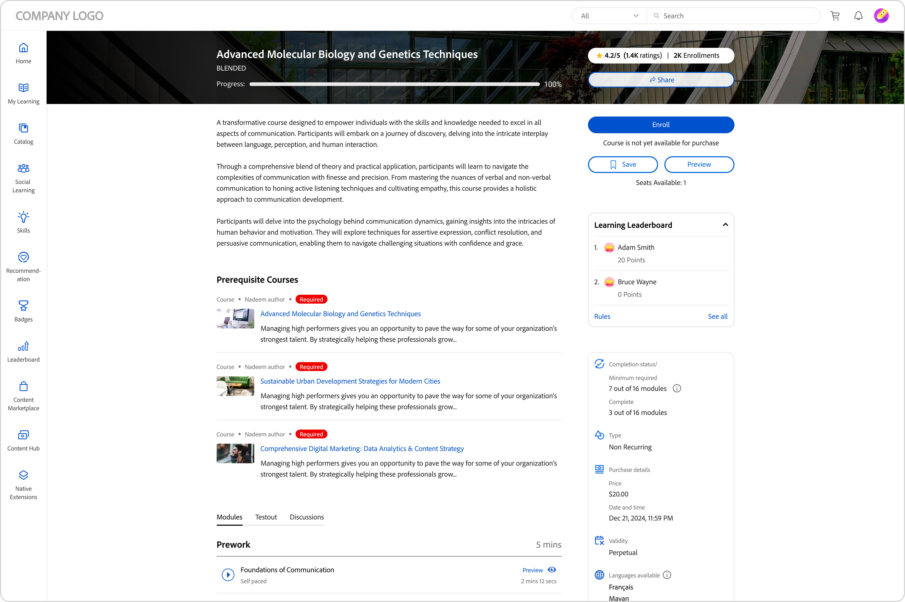

# Elevens startsida

## Översikt {#overview}

När administratören har aktiverat fördjupad layout hälsas eleven med ett helt förnyat användargränssnitt vid inloggning i appen.

>[!NOTE]
>
>Webbläsaren IE11 stöder inte uppslukande layout.

## Nytt elevgränssnitt för fördjupad layout

>[!IMPORTANT]
>
>Vi kommer att släppa det nya elevgränssnittet i faser.

Vi har förnyat elevgränssnittet med en mer elegant och uppdaterad design. Det nya användargränssnittet syftar till att ge en konsekvent användarupplevelse på målsidorna **[!UICONTROL Learner Home]**, **[!UICONTROL My Learning]**, **[!UICONTROL Catalog]** och **[!UICONTROL Course Overview]**. De nya visuella elementen följer nuvarande designstilar, vilket gör produkten mer lättanvänd och attraktiv. Den här uppdateringen innehåller ett nytt mallhuvud, en sidopanel och moderna widgetar.

>[!NOTE]
>
>Det omarbetade användargränssnittet gäller endast den fördjupande layouten. Mobilwebben/mobilappen stöder inte dessa ändringar ännu och kommer att uppdatera dem i en framtida version.

_Gammalt användargränssnitt_

_Nytt användargränssnitt_

### Hemsida

Hemsidan har en ny design med förbättrad sidopanel, övre sidhuvud, förbättrade kurskort och widgetar.

_Ny hemsida_

### Katalogsida

Katalogsidorna har ett nytt utseende med organiserade filter och förbättrade kurskort för att ge en bättre användarupplevelse.

_Katalogsida_

### Sida med kursöversikt

Kursens översiktssida har ett nytt utseende med mer detaljer om kursen. Den här sidan hjälper elever att få all information de behöver.

_Sida med kursöversikt_

### Kurskort

Kurskort har också en ny layout för att visa detaljer mer effektivt. Moderniserade kurskort visar relevanta metadata som krävs för registrering. Dessa metadata inkluderar korrekta publicerade eller förfallodatum, betyg och beskrivningar tillsammans med respektive författare eller leverantör.

_Gammalt kurskort_

_Nytt kurskort_

För kurser som har importerats från **LinkedIn** och plattformen **Go1** kommer kurskorten att visa de ursprungliga publiceringsdatumen från **LinkedIn** och **Go1**. Du kan även visa dessa specifika publiceringsdatum i användargränssnittet.

### Sidlist och sökfält

Sidofältet uppdateras med nya användargränssnittselement för ett renare utseende. Det nya sökfältet har ingen sökknapp, vilket ger det ett renare utseende. Elever kan skriva ett nyckelord och trycka på Retur för att starta sökningen eller välja resultat under sökfältet.

_Sidofält och sökfält_

### Redaktionsruta {#masthead}

Har en video- eller bildkarusell med en inbäddad URL. [Administratören kan överföra en bild- eller videoresurs](../../administrators/feature-summary/announcements.md#masthead) som masthead och ange dess synlighet för en grupp elever.

*Visa maskhuvud*

### Min utbildningslista {#mylearninglist}

Visar den utbildning som eleven har genomgått. Dessa utbildningar visas som kort som är uppradade vågrätt. Du kan klicka på höger eller vänster knapp för att bläddra bland kurserna.

*Visa min utbildningslista*

Du kan också navigera i listan genom att svepa åt vänster och höger.

Om du vill fortsätta med en kurs klickar du på **[!UICONTROL Continue]** på ett kort så startas spelaren.

Utseendet på ikoner på varje utbildningskort aktiveras/inaktiveras av administratören via Admin-appen (**Inställningar** > **Allmänt** > **Aktivera ikoner för utbildningskort**).

**Lägg till i Min utbildningslista**

Om du håller pekaren över ett kurskort i **Rekommenderat baserat på dina intresseområden** och **Rekommenderat baserat på kollegas aktivitetslistor**, kan du se ett alternativ för att lägga till kursen i **Min utbildningslista**. Klicka på **[!UICONTROL +]** på kurskortet så läggs kursen till i **Min utbildningslista**.

*Lägg till i Min utbildningslista*

## Välj kunskapsnivåer {#chooseskilllevels}

Som elev kan du filtrera kurskatalogen enligt dessa nivåer:

* Nybörjare
* Mellannivå
* Avancerad

Välj ett alternativ så kan du sedan se kurskatalogen efter valet.

*Välj kunskapsnivåer*

## Widget för efterlevnadstavla

Med widgeten Efterlevnadstavla kan elever filtrera kurser/utbildningsvägar/certifieringar som har kommande deadlines med hjälp av etiketten Efterlevnad. Den här funktionen är tillgänglig i alla elevappar, inklusive ALM Teams-appen, AEM, mobilappen, Immersive och SF-appen.

_Widget för efterlevnadstavla_

## Kalender {#calendar}

Visar dina schemalagda sessioner och utbildningar. Bläddra i kalendern och se utbildningen för kommande månader.

*Visa kalender för schemalagda sessioner*

Kalenderwidgeten har följande funktioner. Du kan visa:

* Utbildning per månad. Rulla åt vänster eller höger.
* Kommande klassrums- eller VC-utbildning som är tillgänglig för dig för registrering.
* Kommande klassrums- eller VC-utbildning som du har registrerat dig för.
* Chefsgodkänd utbildning i klassrum eller VC.

## Socialt flöde {#socialfeed}

*Visa socialt flöde*

Se vad andra användare pratar om.

Widgeten sammanfattar aktivitet under en period. IT:

* Visar aktiva användare och deras aktiviteter för de användare som ingår i din omfattning eller grupp.
* Visar inlägg som gjorts de senaste två veckorna.

## Profilfärdigheter {#profileskills}

Profilfärdigheter används för kursrekommendationer. Om administratören tilldelar en kunskap till en användare eller grupp av användare läggs kunskapen till i elevens profilkunskaper. Om eleven lägger till en kompetens i sin profil läggs alla nivåer av kompetensen till i elevens profilfärdigheter. När en elev hovrar på en kompetens kan han/hon se namnet på kompetensen, metoden för tillägg av kompetensen, nivå, procent av slutförande av kompetensen och poäng.

*Visa profilkompetenser*

Om en elev registrerar sig för en kurs kommer endast de externa färdigheter som baseras på en poäng att läggas till i profilens färdigheter. Dessutom kan en elev söka, välja och lägga till externa färdigheter i sin profil. Om en elev har loggat in på elevappen för första gången, och om elevens färdigheter redan finns, visas kunskaperna i Min profil.

## Rekommendation baserat på ditt intresseområde {#recommendationbasedonyourareaofinterest}

Visar utbildning baserat på det område du valt. Rekommendationen drivs av en maskininlärningsalgoritm.

*Visa rekommenderade kurser*

Du kan uppdatera dina kunskaper om du vill ha fler riktade rekommendationer genom att klicka på **Visa/uppdatera**.

När du har lagt till en kompetens kommer framtida rekommendationer att bli mer målinriktade och fokuserade enligt dina önskemål.

Om administratören inaktiverade alternativet **Utforska kompetenser** kan du göra dina kompetenser ännu mer intressanta.

De rekommenderade kurserna visas som kort. När du för musen över ett kort kan du se mer information om kursen.

Produktterminologi stöds också.

**Branschanpassade färdigheter**

Du kan se nätverkets kompetensdiagram om administratören har aktiverat alternativet **Branschjusterad** i Admin-appen.

Dessa färdigheter kan bara visas när administratören ställer in utbildningstypen på Branschanpassad.

I visualiseringen av kompetenskartan kan du söka efter en kompetens eller färdigheter och lägga till dessa.

*Visualisering av kompetenskarta*

Aktivera alternativet **Visa kompetenser som det finns utbildningar för i mitt konto** om du vill visa alla kompetenser som finns i ditt konto.

När du har lagt till en kompetens kan du se det tvingade riktade diagrammet med den valda kompetensen som det primära hörnet och de associerade kunskaperna som mindre hörn.

De kunskaper som du har valt visas också i avsnittet **Valda kompetenser**.

*Valda kompetenser*

Klicka på **[!UICONTROL Add]** om du vill lägga till kompetenserna.

## Rekommendation baserat på kollegas uppgift {#recommendationbasedonpeeractivity}

Visar utbildning baserat på vad dina kollegor tar. Detta drivs återigen av en maskininlärningsalgoritm. Rekommendationerna bygger på utbildning för både anpassade och branschanpassade elever.
