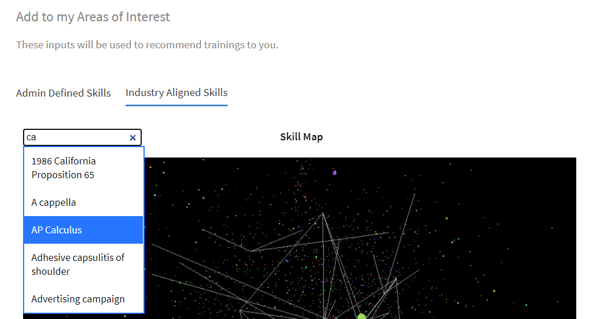

# Elevens startsida

## Översikt {#overview}

När administratören har aktiverat fördjupad layout hälsas eleven, efter att ha loggat in i appen, med ett helt förnyat användargränssnitt.

>[!NOTE]
>
>Avancerad layout stöds inte i IE11-webbläsaren.

Baserat på om en widget har aktiverats ser eleven följande:

## Masthead {#masthead}

Har en video- eller bildkarusell med en inbäddad URL. Inställningen [Administratören kan överföra vilken bild eller video som helst](../../administrators/feature-summary/announcements.md#masthead) mediefil som ett masthead och ange dess synlighet för en grupp elever.

*Visa maskhuvud*

## Min utbildningslista {#mylearninglist}

Visar den utbildning som eleven har genomgått. Dessa utbildningar visas som kort som är uppradade vågrätt. Du kan klicka på höger eller vänster knapp för att bläddra bland kurserna.

*Visa min utbildningslista*

Du kan också navigera i listan genom att svepa åt vänster och höger.

Klicka på för att återuppta en kurs **[!UICONTROL Continue]** på ett kort, och spelaren kommer att starta.

Utseendet på ikoner på varje utbildningskort aktiveras/inaktiveras av administratören via Admin-appen (**Inställningar** > **Allmänt** > **Aktivera ikoner för utbildningskort**).

**Lägg till på min utbildningslista**

Om du hovrar på ett kurskort i dialogrutan **Rekommenderas baserat på dina intressen** och **Rekommenderas baserat på listor över kollegas aktivitet**, du kan se ett alternativ för att lägga till kursen i **Min utbildningslista**. Klicka **[!UICONTROL +]** på kurskortet så läggs kursen till i **Min utbildningslista**.

*Lägg till på min utbildningslista*

## Välj kunskapsnivåer {#chooseskilllevels}

Som elev kan du filtrera kurskatalogen enligt dessa nivåer:

* Nybörjare
* Mellannivå
* Avancerat

Välj ett alternativ så kan du sedan se kurskatalogen efter valet.

*Välj kunskapsnivåer*

## Kalender {#calendar}

Visar dina schemalagda sessioner och utbildningar. Bläddra i kalendern och se utbildningen för kommande månader.

*Visa kalender för schemalagda sessioner*

Kalenderwidgeten har följande funktioner. Du kan visa:

* Utbildning per månad. Rulla åt vänster eller höger.
* Kommande klassrums- eller VC-utbildning som är tillgänglig för dig för registrering.
* Kommande klassrums- eller VC-utbildning som du har registrerat dig för.
* Chefsgodkänd utbildning i klassrum eller VC.

## Socialt flöde {#socialfeed}

*Visa flöden för sociala medier*

Se vad andra användare pratar om.

Widgeten sammanfattar aktivitet under en period. IT:

* Visar aktiva användare och deras aktiviteter för de användare som ingår i din omfattning eller grupp.
* Visar inlägg som gjorts de senaste två veckorna.

## Profilfärdigheter {#profileskills}

Profilfärdigheter används för kursrekommendationer. Om administratören tilldelar en kunskap till en användare eller grupp av användare läggs kunskapen till i elevens profilkunskaper. Om eleven lägger till en kompetens i sin profil läggs alla nivåer av kompetensen till i elevens profilfärdigheter. När en elev hovrar på en kompetens kan han/hon se namnet på kompetensen, metoden för tillägg av kompetensen, nivå, procent av slutförande av kompetensen och poäng.

*Visa profilkompetenser*

Om en elev registrerar sig för en kurs kommer endast de externa färdigheter som baseras på en poäng att läggas till i profilens färdigheter. Dessutom kan en elev söka, välja och lägga till externa färdigheter i sin profil. Om en elev har loggat in på elevappen för första gången, och om elevens färdigheter redan finns, visas kunskaperna i Min profil.

## Rekommendation baserat på ditt intresseområde {#recommendationbasedonyourareaofinterest}

Visar utbildning baserat på det område du valt. Rekommendationen drivs av en maskininlärningsalgoritm.

*Visa rekommenderade kurser*

För mer riktade rekommendationer kan du uppdatera dina kunskaper genom att klicka på **Visa/uppdatera**.

När du har lagt till en kompetens kommer framtida rekommendationer att bli mer målinriktade och fokuserade enligt dina önskemål.

Om administratören har inaktiverat alternativet **Utforska färdigheter**, du skulle kunna göra dina färdigheter mer intressanta.

De rekommenderade kurserna visas som kort. När du för musen över ett kort kan du se mer information om kursen.

Produktterminologi stöds också.

**Branschanpassade färdigheter**

Du kommer att kunna se nätverksdiagrammet över färdigheter om administratören har aktiverat alternativet **Branschanpassad** i appen Admin.

Dessa färdigheter kan bara visas när administratören ställer in utbildningstypen på Branschanpassad.

I visualiseringen av kompetenskartan kan du söka efter en kompetens eller färdigheter och lägga till dessa.

*Visualisering av kompetenskarta*

Aktivera alternativet **Visa kompetenser som det finns utbildningar för i mitt konto**, om du vill visa alla kompetenser som finns på ditt konto.

När du har lagt till en kompetens kan du se det tvingade riktade diagrammet med den valda kompetensen som det primära hörnet och de associerade kunskaperna som mindre hörn.

De kunskaper du har valt visas också i **Valda kompetenser** -sektionen.

*Valda kompetenser*

Klicka på för att lägga till kunskaperna **[!UICONTROL Add]**.

## Rekommendation baserat på kollegas uppgift {#recommendationbasedonpeeractivity}

Visar utbildning baserat på vad dina kollegor tar. Detta drivs återigen av en maskininlärningsalgoritm. Rekommendationerna bygger på utbildning för både anpassade och branschanpassade elever.
