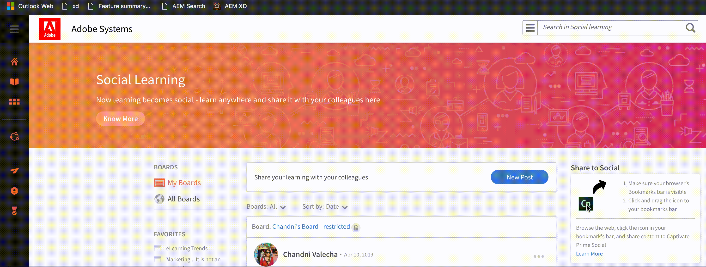

# Dela till social utbildning

Lär dig använda sociala bokmärken för att omedelbart dela en användares onlinelärande på den sociala webben.

Dela i sociala medier är ett bokmärke där elever kan dela sina onlinelärdomar, som webbsidor och bloggar, med sina kollegor. Den här funktionen stöds endast i webbläsare på datorer.

Om du klickar på det här bokmärket i bokmärkesfältet öppnas det som ett popup-fönster med eller inom webbsidan, beroende på vilken webbläsare som ska delas.

<!---->

Tillåt popup-fönster i webbläsaren.

Om du är inloggad på Learning Manager loggar bokmärket automatiskt in på ditt konto. Annars måste du logga in med dina inloggningsuppgifter för Learning Manager som elev.

Lägg till en beskrivning för inlägget och välj sedan tavlan där du vill publicera och klicka på **[!UICONTROL Post]**. Tavlan är placerad på din instrumentpanel som du kan se genom att klicka på **Gå till inlägg**.

## Lägg till delning till socialt bokmärke - låt i bokmärkesfältet {#addsharetosocialbookmarklettothebookmarksbar}

**Så här lägger du till det här bokmärket i bokmärkesfältet i webbläsaren:**

1. Kontrollera att fliken Bokmärken är aktiverad i webbläsaren.
1. Logga in på Learning Manager som elev.
1. Klicka på Social utbildning på den vänstra navigeringspanelen. Kontakta administratören om det inte syns.
1. Dra ikonen **Dela i sociala medier** till bokmärkesfältet i webbläsaren.

   Det går inte att dra och släppa i vissa webbläsare, som Chrome i Mac och Microsoft Edge i Windows. [Klicka här](share-to-social.md#add%20bookmarkl-let%20manually) om du vill ha mer information.

   <!---->

## Aktivera bokmärkesfältet i olika webbläsare {#enablingthebookmarksbarondifferentbrowsers}

## Krom {#chrome}

* Klicka på huvudmenyknappen som representeras av tre punkter i webbläsarfönstrets övre högra hörn.
* Välj Settings i listrutan. Du kommer även åt inställningsskärmen genom att ange **chrome://settings** i webbläsarens adressfält.
* Leta reda på avsnittet Utseende, som innehåller ett alternativ märkt Visa bokmärkesfältet med en kryssruta. Om du vill att bokmärkesfältet alltid ska visas när du laddar en sida, markerar du kryssrutan genom att klicka på den en gång. Om du vill inaktivera den här funktionen tar du bara bort bocken.

## Mozilla Firefox {#mozillafirefox}

* Klicka på menyknappen och välj anpassa.
* Klicka på listrutan Verktygsfält längst ned på skärmen och välj verktygsfältet Bokmärken.
* Klicka på Stäng.

## Internet Explorer {#internetexplorer}

* Högerklicka på inställningsikonen i webbläsarens övre högra hörn. Eller använd **Alt + C** på tangentbordet för att öppna fönstret i favoritfältet.
* Klicka på **[!UICONTROL Favorites bar]** för att göra favoritfältet synligt i webbläsaren.

## Microsoft Edge {#microsoftedge}

* Klicka på huvudmenyknappen som representeras av tre punkter i det övre högra hörnet > Inställningar > fältet Favoriter.
* Om du vill aktivera fältet Favoriter klickar du på på/av-knappen.

## Safari {#safari}

* Klicka på Visa-menyn > Visa fältet Favoriter. (Kortkommando: **Kommando + Skift + B**)

## Så här lägger du till bokmärken manuellt i bokmärkesfältet i olika webbläsare {#add-bookmark-let-manually}

Om du vill lägga till bokmärken manuellt i bokmärkesfältet högerklickar du på ikonen **Dela i sociala medier** > **Kopiera länkadress** och följer nedanstående procedur:

## Chrome i Mac OS {#chromeinmacos}

1. Klicka på den komprimerade menyikonen från din webbläsare > **Bokmärken** > **Bokmärkeshanteraren.**
1. Klicka på Alternativ på bokmärkesmenyn > **Lägg till nytt bokmärke.**
1. Två inmatningsfält visas i popup-dialogrutan. Ange ett namn för bokmärket, till exempel **Dela i sociala medier** i det första fältet.
1. Klistra in länkadressen **Dela i sociala medier** i det andra fältet.

## Microsoft Edge i Windows {#microsoftedgeinwindows}

1. Se till att fältet Favoriter visas. Högerklicka på favoritfältet > **Skapa ny mapp**.
1. Om du vill lägga till URL-adressen i favoritfältsmappen klickar du på **bokmärkeshubben** > ikonen **bokmärken**.
1. Spara en onlinesida i mappen och byt namn på den till Dela i sociala medier.
1. Välj hubbikonen för bokmärken > Dela i sociala medier > Redigera URL.
1. Klistra in länkadressen och klicka på Retur-knappen.
