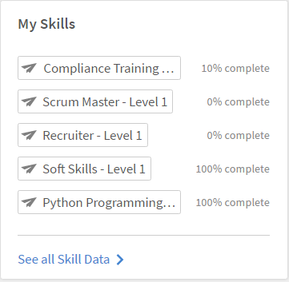

# Kompetenser och nivåer

Läs den här artikeln om du vill veta hur du uppnår färdigheter i Learning Manager som elev.

Kompetenskarta är en gruppering av kompetenser, kunskaper och egenskaper hos en anställd i en organisation. Dessa färdigheter hjälper företag/organisationer att ställa upp eller höja förväntningarna på prestanda för sina anställda. Kompetenser gör att medarbetarna kan anpassa sitt beteende till organisationens förväntningar.

Med Adobe Learning Manager kan du mappa prestanda för elever baserat på deras kunskapsuppsättningar med hjälp av widgeten Kompetenser. När elever har slutfört vissa kurser kan de veta sin ställning för varje kompetens genom att klicka på Kompetenser på elevens startsida.

## Visa kompetenser {#viewskills}

Om du vill visa kunskaperna klickar du på något av kunskapsnamnen i widgeten Kunskaper på sidan Elev. Kompetenser visas tillsammans med deras nivåer i närheten.

*Visa alla kompetenser*

Andelen slutförda för varje kompetens är tillgänglig bredvid kompetensen i widgeten. När du klickar på varje kompetens tas du till sidan Kompetenser där du kan se information om kompetensen som du klickat på.

På sidan Kompetenser visas statusen för den kompetens du klickade på. Till exempel Java. På sidan Kompetens visas status, till exempel &quot;Pågår&quot; och tillskrivningarna, till exempel &quot;2 av 10 har uppnåtts&quot;.

På den här sidan kan du klicka på var och en av dina kunskaper för att visa motsvarande data.

*Visa varje kompetens*

Endast administratörer kan skapa och tilldela kunskaper till elever. Elever tilldelas automatiskt till kompetens som motsvarar de registrerade kurserna/utbildningsprogrammen.

>[!NOTE]
>
>Elever kan bara visa sina färdigheter på kollegial nivå i en klassisk elevapp.

## Uppnå kompetens {#achieveskill}

En elev kan uppnå kompetens allt eftersom de slutför de tilldelade kurserna/utbildningsprogrammen med tilldelade kompetenspoäng. Elever kan också uppnå färdigheter genom att själva registrera sig för kurser som tillhör en viss kompetens och slutföra den.
