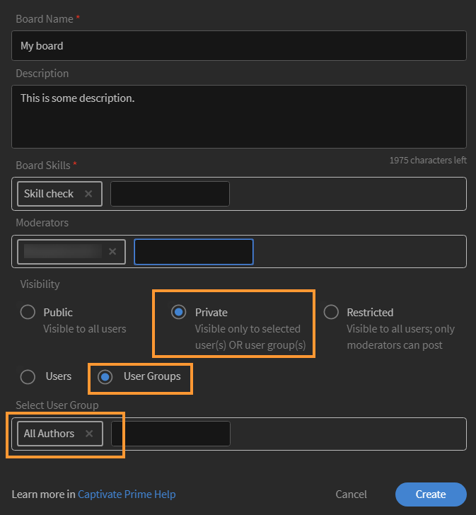
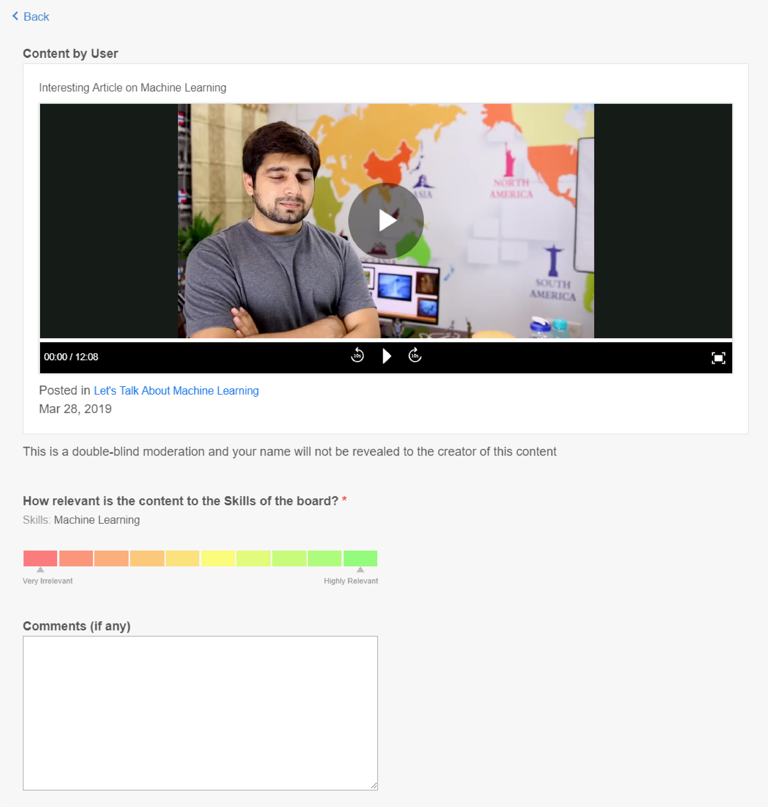
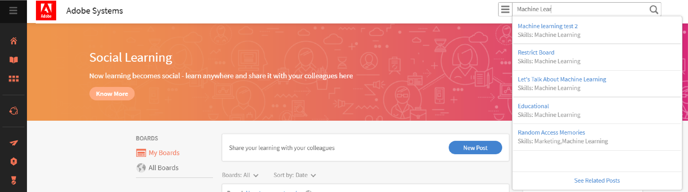

# Social utbildning i Learning Manager

Lär dig använda Social utbildning på webben som elev

Social utbildning är en plattform i Learning Manager som engagerar användare för att dela idéer och meningsfulla insikter i en informell miljö. Det är en metod som kompletterar idén med traditionellt lärande. Att slutföra en onlinekurs ger inte användarna någon fördel att interagera med sina kollegor på social nivå.

Genom att helt enkelt delta i en utbildning, garanterar inte att användarna behåller allt som lärs ut. Å andra sidan gör social utbildning det möjligt för användare att använda expertisen omkring sig för att få exakt den information de behöver. I sin tur kan användare snabbt använda den informationen för att slutföra en uppgift och uppnå ett mål.

På samma sätt gör Learning Manager Social Learning att användare kan interagera med varandra genom att kunna dela och lära sig av innehåll.

På den här plattformen kan du dela olika typer av innehåll: video, ljud, skärmbild, text, fråga och enkät. Användarna kan också dela sina onlinelärdomar med andra genom att använda **Dela till socialt bokmärke**. Mer information finns i [Dela till social utbildning](share-to-social.md).

Med hjälp av **Adobe Learning Manager-programmet för datorer** kan du även lägga upp innehåll på en anslagstavla. Du hittar mer information i [Adobe Learning Manager-datorprogrammet](../adobe-learning-manager-app-for-desktop.md).

Endast om administratören aktiverar Social utbildning är funktionen synlig för en elev .

 

*Visa utbildningstavlan*

<table>
 <tbody>
  <tr>
   <td>
    
<b>SL. Nej.</b>
</td>
   <td>
    
<b>Terminologi eller begrepp</b>
</td>
   <td>
    
<b>Kort förklaring</b>
</td>
  </tr>
  <tr>
   <td>
    
1
</td>
   <td>
    
Mina tavlor
</td>
   <td>
    
En anslagstavla är <code>
      collection
     </code> inlägg som har skapats av en användare. Mina tavlor visar alla inlägg som användaren har deltagit i, skapat och följt.
</td>
  </tr>
  <tr>
   <td>
    
2
</td>
   <td>
    
Alla tavlor
</td>
   <td>
    
På sidan Alla tavlor kan användare se tavlor som skapats av alla elever som delar aktivitetsomfattning.
</td>
  </tr>
  <tr>
   <td>
    
3
</td>
   <td>
    
Kommentar
</td>
   <td>
    
Användare kan kommentera och visa inlägg som skapas i tavlor. 
</td>
  </tr>
  <tr>
   <td>
    
4
</td>
   <td>
    
Svara
</td>
   <td>
    
Användare kan svara på kommentarer som görs på inlägg på en tavla.
</td>
  </tr>
  <tr>
   <td>
    
5
</td>
   <td>
    
Uppröst/nedröst
</td>
   <td>
    
Klicka på uppvärderings- och nedröstningsknappen för att gilla eller ogilla ett inlägg.
</td>
  </tr>
  <tr>
   <td>
    
6
</td>
   <td>
    
Social resultattavla
</td>
   <td>
    
I den sociala resultattavlan kan användarna se namnen på elever med antalet poäng de har fått genom att delta i social utbildning.
</td>
  </tr>
  <tr>
   <td>
    
7
</td>
   <td>
    
Personer jag följer
</td>
   <td>
    
Här kan användare se namnen på andra elever de följer och antalet inlägg de har skapat.
</td>
  </tr>
  <tr>
   <td>
    
8
</td>
   <td>
    
Populära färdigheter
</td>
   <td>
    
I avsnitten Alla tavlor kan de färdigheter som elever ofta har använt visas tillsammans med antalet inlägg som de har skapat med den kompetensen.
</td>
  </tr>
  <tr>
   <td>
    
9
</td>
   <td>
    
Dela i sociala medier
</td>
   <td>
    
Dela i sociala medier är ett bokmärke där användarna kan dela sina onlinelärdomar, som webbsidor och bloggar, direkt till Learning Manager Social Learning.
</td>
  </tr>
  <tr>
   <td>
    
10
</td>
   <td>
    
Nytt inlägg
</td>
   <td>
    
Med den nya inläggsknappen kan användare skapa och publicera innehåll på anslagstavlor.
</td>
  </tr>
 </tbody>
</table>

## Skapa innehåll som ett inlägg {#creatingcontentasapost}

Innehållet skapas som ett inlägg på en anslagstavla. Skapa ett inlägg genom att följa stegen nedan:

1. Klicka på **[!UICONTROL New Post].**

   
   *Välj nytt inlägg*

1. Välj någon av följande typer av innehåll som ska publiceras: text, fråga, video, ljud, undersökning eller skärmbild. Befintligt innehåll kan överföras från användarsystemet eller från galleriet i Adobe Learning Manager-datorprogrammet.

   Använd Adobe Learning Manager-datorprogrammet för att spela in en video eller skärm, ljud och ta en skärmbild. Mer information finns i [Adobe Learning Manager-datorprogrammet](../adobe-learning-manager-app-for-desktop.md).

   <!---->

1. Sök efter en anslagstavla eller kompetens som relaterar till inlägget. Klicka på **[!UICONTROL Create a New Board]** om tavlan inte finns.

   

   *Skapa en tavla*

   Om du är extern eller intern användare och om administratören har gett dig behörighet att skapa en anslagstavla, kan du skapa en anslagstavla. Om du inte har behörighet att skapa en tavla visas inte länken **Skapa en ny tavla**.

1. Fyll i informationen i popup-dialogrutan och välj följande typ av tavla:

   * **Offentlig** - Deltagande och synlighet för inlägg är tillgängligt för alla användare.
   * **Privat** - Inlägget är bara synligt för tavlans skapare, moderatorer och användare som har lagts till på tavlan.
   * **Begränsad** - endast tavlans ägare, administratör och tavlans moderatorer kan skapa inlägg. Andra användare kan delta genom att kommentera/svara, rösta upp/ned och så vidare.

   <!---->

   >[!NOTE]
   >
   >I den sociala elevappen är det bara en **administratör** som kan skapa privata tavlor med användargrupper (interna/externa).
   >
   >Alla andra användare förutom administratör, författare, elev, chef, instruktör osv. **Det går inte** att skapa privata tavlor med användargrupper. De kan inte se avsnittet med **användargrupper** när de skapar en privat tavla.

   Endast administratör - När du väljer **Privat** visas två alternativ - **Användare** och **Användargrupper**. Välj alternativet **Användargrupper** och lägg sedan till användargrupperna som du vill dela den privata tavlan med.

   I fältet Användargrupper kan du välja interna, externa eller anpassade grupper. Din privata tavla kommer då att vara synlig för alla angivna användargrupper, oavsett scopeinställningar.

1. Klicka på **[!UICONTROL Post]** om du vill dela innehåll. När du klickar på Publicera får användaren ett meddelande.

   Innehållet läggs upp baserat på kurateringsinställningen som angetts av administratören för innehåll för social utbildning som kan kurateras av [tavlans moderatorer/ämnesexperter](social-learning-web-user.md#HowtobecomeaSubjectMatterExpertSME).

   <!---->

1. Användarna får ett meddelande när deras inlägg har godkänts eller avslagits om administratören har ställt in kurateringsinställningen på Manuell kuratering. Om inlägget avvisas klickar du på hyperlänken **Klicka för att granska** för att läsa kommentarerna från tavlans moderatorer eller ämnesexperterna.

   Innehåll som skapas av användare kurateras av moderatorer på tavlan eller ämnesexperter.

   <!---->

När du skapar eller svarar på ett inlägg i Social utbildning kan du skriva ett inlägg med textredigeraren och använda olika typer av formatering.

*Skapa ett inlägg med textredigeraren*

När du skapar en tavla har du dessutom tillgång till samma uppsättning alternativ i textredigeraren.

*Skapa ett inlägg med textredigeraren*

## Visa godkänt innehåll {#viewingapprovedcontent}

När ett inlägg har godkänts visas det på en anslagstavla för social utbildning. Användare kan nu, kommentera, svara, rösta upp/ned på inlägget.

Användarna kan använda följande typ av innehåll för att göra en kommentar: spela in skärm, webbkamera eller båda, spela in ljud, ta skärmbild, ladda upp fil, galleri för Learning Manager.

<!---->

## Innehåll i Social Player {#contentinsocialplayer}

I Learning Manager läggs videor, statiskt innehåll som presentationer och bilder upp på en anslagstavla i en social spelare. Du kan överföra en fil från systemet, spela in en video/skärm och ta en skärmbild med hjälp av Adobe Learning Manager-datorprogrammet.

När användaren har lagt upp sitt innehåll kan det visas av andra elever i deras aktivitetsomfattning. Elever i sociala medier kan visa, kommentera/svara, rösta upp/ned och rapportera missbruk.

<!---->

**Kommentera/svara genom att rösta upp/ned på den sociala spelaren genom att följa stegen nedan:**

1. Klicka på helskärmsknappen i det nedre högra hörnet av spelaren i sociala medier.
1. Om du vill visa spelarkontrollerna på skärmen klickar du på nedåtpilen.
1. Om du vill visa kommentarsavsnittet klickar du på kommentarsikonen längst ned till vänster på skärmen.
1. Användare kan kommentera/svara, rösta upp/ned och rapportera missbruk.
1. Klicka på Esc-tangenten för att avsluta helskärmsläget.

## Tavlsvy i sociala medier {#board-view-social}

En elev kan se alla tavlor i en listvy. Logga in på din elevapp och klicka på knappen på din sida för social utbildning enligt nedan:

*Tavlsvy i sociala medier*

När du visar inläggen i ett brädformat kan du sedan sortera inläggen enligt **Inlägg** och **Medverkande**.

* Om du väljer **inlägg** sorteras anslagstavlorna efter antalet inlägg som gjorts på anslagstavlan.
* Om du väljer **Medverkande** sorteras anslagstavlorna efter antalet användare som har kommenterat eller svarat i trådarna.

### Kompetensfilter {#skillfilter}

*Sortera inläggen*

Med filtret Kompetens kan du välja flera kompetenser för att filtrera tavlorna. Du kan också rensa filtren när du har valt kunskaperna.

### Filter för aktivitetsnivå {#activitylevelfilter}

*Filteraktivitetsnivåer*

Med filtret Aktivitet kan du sortera tavlorna efter hur mycket som interagerar på en tavla. Du kan sortera dem enligt:

* Hög aktivitet
* Normal aktivitet
* Låg aktivitet

I tavlans vy kan du utföra de vanliga åtgärderna på tavlenivå.

<!---->

## Hämta inlägg {#downloadposts}

Elever kan hämta innehållet med bilagor från Social Learning Platform så att de kan använda innehållet offline.

*Hämta ett inlägg i sociala medier*

Du kan hämta innehållet från avsnitten Inlägg eller Kommentarer eller Svar. Du kan bara hämta en fil i taget.

Båda användartyperna (interna eller externa) måste kunna hämta innehållet.

Knappen Hämta kan också visas i sökresultat för inlägg, kommentarer eller svar.

Du kan inte hämta ett inlägg i enhetsappen än. Den här funktionen blir snart tillgänglig.

## Innehållsformat som stöds {#supportedcontentformats}

<table>
 <tbody>
  <tr>
   <td>
    
<b>Innehållstyp</b>
</td>
   <td>
    
<b>Tillägg</b>
</td>
  </tr>
  <tr>
   <td>
    
Video
</td>
   <td>
    
wmv, f4v, asf, 3gp, 3g2, avi, mov, h264, m4v, mp4, MPEG, mpg
</td>
  </tr>
  <tr>
   <td>
    
Ljud
</td>
   <td>
    
mp3, amr, m4a, wav, wma, aac
</td>
  </tr>
  <tr>
   <td>
    
Statiska filer
</td>
   <td>
    
PDF, ppt, pptx, doc, docx, xls, xlsx
</td>
  </tr>
  <tr>
   <td>
    
Bild
</td>
   <td>
    
jpg, jpeg, png, bmp, gif
</td>
  </tr>
 </tbody>
</table>

## Tavlan är bara synlig för valda användare {#selected-users}

En elev som även har rollen **administratör** kan lägga till en användargrupp på en privat tavla. Alla användargrupper kan läggas till på den privata tavlan och användarna som tillhör användargruppen har bara tillgång till tavlan.

Om en ny användare läggs till i användargruppen kan båda användarna se den privata anslagstavlan.

Om någon användare tas bort från den privata tavlan kan användaren inte längre se den privata tavlan.

Om flera användargrupper läggs till på den privata tavlan får alla användare i båda grupperna tillgång till de privata tavlorna.

<!---->

## Åtgärder som kan göras i ett inlägg {#actionsthatcanbedoneonapost}

Klicka på den komprimerade menyikonen från det övre högra hörnet av ett inlägg för att visa dess alternativ. Följande menylista visas: Redigera, lägg till i min berättelse, kopiera URL, ta bort och rapportera.

Endast vissa användare har behörighet att utföra vissa uppgifter. Följande typer av användare är innehållsägare, moderatorer för anslagstavlor och organisationens administratör.

<table>
 <tbody>
  <tr>
   <td>
    
<b>SL. Nej.</b>
</td>
   <td>
    
<b>Åtgärd</b>
</td>
   <td>
    
<b>Förklaring</b>
</td>
  </tr>
  <tr>
   <td>
    
1
</td>
   <td>
    
Redigera
</td>
   <td>
    
Med Redigera kan den som har skapat innehållet korrigera eller ändra inlägget.
</td>
  </tr>
  <tr>
   <td>
    
2
</td>
   <td>
    
Lägg till i min story
</td>
   <td>
    
En story är en samling med innehåll som har kuraterts av en användare. Användarna kan ställa in synligheten för innehållet på Privat eller Offentlig.
</td>
  </tr>
  <tr>
   <td>
    
3
</td>
   <td>
    
Kopiera URL
</td>
   <td>
    
Det här alternativet låter alla användare kopiera webbadressen till en tavla eller ett inlägg och dela den.
</td>
  </tr>
  <tr>
   <td>
    
4
</td>
   <td>
    
Ta bort
</td>
   <td>
    
Alternativet Ta bort tar bort inlägget efter att användaren har bekräftat.
</td>
  </tr>
  <tr>
   <td>
    
5
</td>
   <td>
    
Rapportera
</td>
   <td>
    
Varje användare har behörighet att rapportera ett missbruk av ett inlägg om det kränker deras integritet eller om innehållet är olämpligt.

    
När ett inlägg har rapporterats skickas ett meddelande till administratören för anslagstavlan och moderatorer för vidare åtgärder.
</td>
  </tr>
 </tbody>
</table>

**Lägg till i min berättelse**

Med sociala berättelser kan användare lägga till eller skapa berättelser med inlägg som de själva eller andra användare har skapat.

Följ stegen nedan om du vill lägga till ett inlägg i en story:

1. Klicka på den komprimerade menyikonen i det övre högra hörnet av ett inlägg och klicka på **[!UICONTROL Add to my Story]**.

   

   *Lägg till i en story*

1. I dialogrutan **Välj story** väljer du en relevant story för att kunna lägga till inlägget. Om det inte finns några relevanta befintliga artiklar skapar du en artikel genom att klicka på **Ny artikel**.

   

   *Skapa en story*

1. I dialogrutan Ny artikel fyller du i fälten Artikelnamn och Beskrivning. Du kan även ställa in synligheten för artikeln på Offentlig eller Privat.

   

   *Lägg till artikelnamn och beskrivning*

   Om du vill visa artiklar som skapats av användare klickar du på användarens namn bland profilmenyalternativen.

## Användarbehörighet för att utföra åtgärderna i ett inlägg {#userprivilegesforperformingtheactionsonapost}

<table>
 <tbody>
  <tr>
   <td>
    
 
</td>
   <td>
    
<b>Innehållsägare</b>
</td>
   <td>
    
<b>Alla användare</b>
</td>
   <td>
    
<b>Moderatorer för anslagstavlor</b>
</td>
   <td>
    
<b>Administratör</b>
</td>
  </tr>
  <tr>
   <td>
    
<b>Redigera</b>
</td>
   <td>
    
Ja
</td>
   <td>
    
Nej
</td>
   <td>
    
Nej
</td>
   <td>
    
Nej
</td>
  </tr>
  <tr>
   <td>
    
<b>Lägg till i min berättelse</b>
</td>
   <td>
    
Ja
</td>
   <td>
    
Ja
</td>
   <td>
    
Ja
</td>
   <td>
    
Ja
</td>
  </tr>
  <tr>
   <td>
    
<b>Kopiera URL</b>
</td>
   <td>
    
Ja
</td>
   <td>
    
Ja
</td>
   <td>
    
Ja
</td>
   <td>
    
Ja
</td>
  </tr>
  <tr>
   <td>
    
<b>Ta bort</b>
</td>
   <td>
    
Ja
</td>
   <td>
    
Nej
</td>
   <td>
    
Ja
</td>
   <td>
    
Ja
</td>
  </tr>
  <tr>
   <td>
    
<b>Rapportera</b>
</td>
   <td>
    
Ja
</td>
   <td>
    
Ja
</td>
   <td>
    
Ja
</td>
   <td>
    
Ja
</td>
  </tr>
 </tbody>
</table>

## Visa innehåll på tavlor {#viewingcontentinboards}

Tavlor är en samling av inlägg. Varje tavla i social utbildning skapas utifrån en färdighet. I Social utbildning kan användare visa sidan **Alla tavlor** och sidan **Mina tavlor**.

På sidan Alla tavlor visas inlägg eller tavlor som skapats av alla användare i en aktivitet. Men på sidan Mina tavlor är bara tavlor som skapats, följts och deltagit av en användare synliga.

På sidan Mina tavlor kan de synliga tavlorna filtreras enligt följande: **Alla**, **Skapade av mig**, **Kommenterade av mig**, **Följda av mig**.

*Filtrera synliga tavlor*

I båda, Mina tavlor och Alla tavlor, kan användare sortera tavlorna efter **Relevans** eller **Datum**.

*Sortera tavlor efter relevans och datum*

Om det inte finns några relevanta tavlor för inlägget när du skapar ett inlägg klickar du på [Skapa en ny tavla](social-learning-web-user.md#Creatingcontentasapost).  Följ stegen nedan för att visa, redigera, ta bort, rapportera, kopiera URL och lägga till en anslagstavla i din favoritanslagstavla:

1. Klicka på namnet på anslagstavlan eller klicka på **[!UICONTROL Go to board]**.
1. På sidan Tavlor klickar du på den komprimerade menyikonen och väljer ett alternativ i listrutan.

   <!---->

**Användare kan se följande alternativ på en tavla:**

* Antalet inlägg, visningar och personer som följer styrelsen syns på denna sida. Namnet på den som skapat anslagstavlan och datumet då styrelsen skapades visas också tillsammans med de främsta små och medelstora företagen för styrelsen.

* Namnen på tavlorna som lagts till i en användares favoritlista över tavlor visas också.

<!---->

## Dela socialt {#sharetosocial}

Dela i sociala medier är ett bokmärke som gör det möjligt för användare att dela sina onlinelärdomar, som webbsidor och bloggar, direkt på den sociala sidan som ett inlägg. Mer information finns i [Dela till social utbildning](share-to-social.md).

*Dela i social utbildning*

## Mina kunskaper {#myskills}

Användare kan visa kunskaper och antalet inlägg eller tavlor som skapats med en kompetens på sidan Mina tavlor. Klicka på **[!UICONTROL See all Skills]** om du vill visa alla färdigheter som används av användaren när en tavla skapas.

*Visa alla kompetenser*

## Personer jag följer {#peopleifollow}

På sidan Mina tavlor kan användare se namnen på de personer de följer och antalet inlägg de har skapat.

*Personer som en elev följer*

Följ de här stegen om du vill följa andra användare:

1. Klicka på en annan användares namn om du vill visa en annan användares profilsida.
1. Klicka på knappen Följ/Avfölj för att utföra önskad åtgärd.

   

   *Följ eller sluta följa en användare*

## Social resultattavla {#socialleaderboard}

Social resultattavla ger bättre spelifiering. Aktivitetspoäng delas ut till användare vid skapandet av ett nytt inlägg/en ny tavla, vid uppröstning för hans/hennes post, vid att ge rätt svar på en fråga och andra deltagande i social utbildning.

Det totala antalet poäng och nya inlägg för alla användare i samma omfattning visas i listan över sociala resultattavlor. Eleven med maximalt antal poäng visas högst upp på rankningslistan för sociala medier följt av de andra eleverna därefter.

Klicka på **[!UICONTROL Go to Leaderboard]** på sidan **Mina tavlor** för att visa alla elever och hur många poäng de har tilldelats.

*Visa alla elever*

## Aktivitetspoäng {#activitypoints}

Antalet aktivitetspoäng som ges till användare baseras på utförda sociala aktiviteter.

**Aktivitetspoäng tilldelas användare för följande:**

* 5 poäng för att skapa en tavla.
* 5 poäng för att lägga till ett inlägg som text, eller frågetyp.
* 2 poäng för att kommentera på något inlägg.
* 1 poäng tilldelas den användare som är först med att börja använda en tavla. Användarna får totalt 20 poäng för de första 20 nya inlägg som läggs upp i den tavlan.

## Hur du blir ämnesområdesexpert (SME) {#howtobecomeasubjectmatterexpertsme}

En ämnesexpert (SME) är en person med särskild kompetens. I Learning Manager Social Learning definieras användare som små och medelstora företag baserat på det maximala antalet aktivitetspoäng som de tilldelas för en kompetens.

De främsta små och medelstora företagen har förmånen att välja ut elevens innehåll innan det läggs upp på en anslagstavla i Social utbildning.

Organisationens administratör har också behörighet att lägga till fler poäng till en elev för att göra dem till ett litet eller medelstort företag för en kompetens.

## Hur väljer man ut innehåll för små och medelstora företag? {#howtocuratecontentasasme}

1. När en användare skapar ett nytt inlägg eller en ny tavla får små och medelstora företag ett meddelande som visar att ett inlägg på en tavla väntar på kuratering.

   <!---->

1. Om du vill moderera inlägget klickar du på länken **Klicka för att granska**. Den här åtgärden leder SME till sidan för innehållmoderering som ser ut som nedanstående skärmbild.

   <!---->

1. Om du vill bedöma innehåll utifrån hur relevant det är i procent med en panels kompetens väljer du färgen i relevansskalan. Den första färgen anses vara irrelevant (10 % relevans) och den sista färgen är mycket relevant (100 % relevans).
1. Det rekommenderas att de små och medelstora företagen skriver en kommentar på grundval av en viss relevanspoäng som anges. Användarna får en bättre förståelse för varför deras inlägg avvisas när de läser kommentaren.

<!--## AI-enabled auto curation {#autocuration}-->

## Söka i formellt och informellt lärande {#searchinformalandinformallearning}

Varje sida i Social utbildning har ett sökfält där användarna kan leta efter valfri tavla, kompetens eller innehåll. Sök genom att skriva i sökfältet och klicka på sökikonen eller tryck på Enter på tangentbordet.

<!---->

Följande sidor i informell utbildning har ett sökfält: **Mina tavlor**, **Alla tavlor**, **Tavlorna**, användarens **profilsida** och **andra elevs profilsida**.

När en användares sökning sker efter innehåll i den informella utbildningen visas det totala antalet sökresultat för innehållet i den informella och formella utbildningen för Learning Manager.

På samma sätt visas antalet sökresultat i informell utbildning när du söker efter innehåll på en formell utbildningssida.

*Sökresultat för utbildning*

På sidan för informella utbildningskort kan endast styrelserelaterade sökningar göras. Sökningar som inte är relaterade till en tavla visas inte.

## Visa användarprofil {#viewuserprofile}

Om social utbildning är aktiverat för en elev kan användaren visa sin profil genom att klicka på profilbilden i det övre högra hörnet av social utbildning och klicka på elevens namn i listrutan.

*Visa användarprofil*

På profilsidan kan eleverna se det totala antalet erhållna poäng, antalet skapade inlägg och antalet följare.

Elever kan också se de färdigheter som de har utsetts till ämnesområdesexperter för.

Elevens sida visar också elevens **kurerade berättelser**, **nyligen utförda aktiviteter** och **personer som följs** av dem.

## Meddelanden {#notifications}

När ett inlägg godkänns eller avvisas av SME får användaren ett meddelande som kan ses genom att klicka på aviseringsikonen i det övre högra hörnet av fönstret. Användare kan visa meddelanden Social utbildning och Formell utbildning.

<!---->
