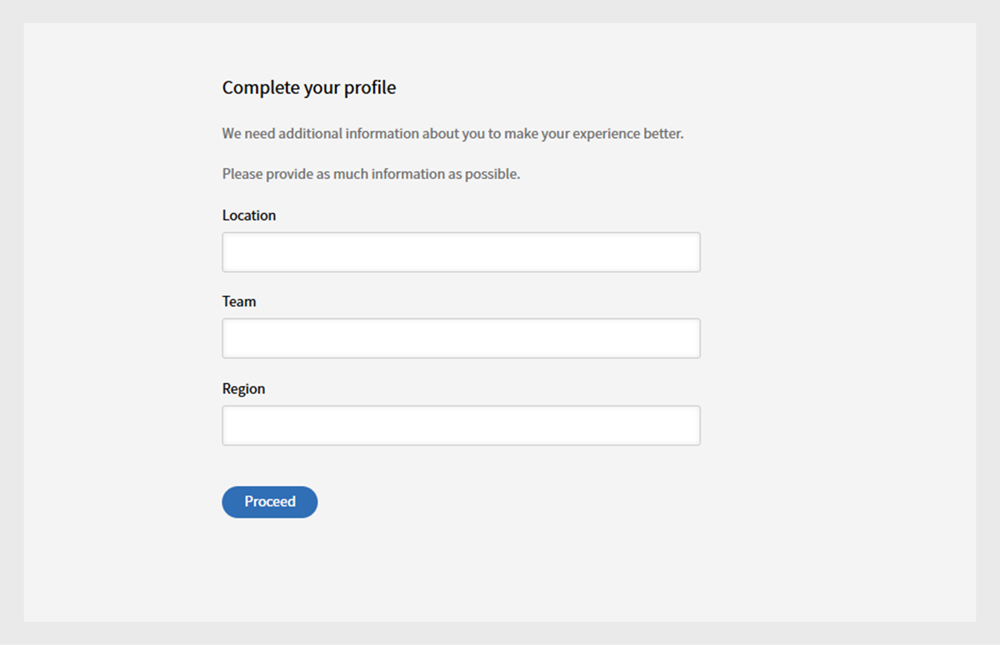

# Logga in

Logga in som elev i Learning Manager.

Elever måste skapa ett konto när de använder Adobe Learning Manager för första gången. Du kan göra detta på ett av två sätt:

* Självregistrering: använd URL:en i välkomstmeddelandet för att skapa ett konto.
* Administratörsskapat konto: En administratör kan skapa ett konto åt dig.

## Skapa ett konto med hjälp av URL:en för välkomstmeddelande

Följ de här stegen för att skapa ditt konto med URL:en från välkomstmeddelandet:

1. Starta Adobe Learning Manager med hjälp av den säkra länken som du fick via ett välkomstmeddelande från administratören.

   Inloggningsskärmen visas.

1. Välj Logga in.

   

   *Logga in med användarnamn och lösenord*

1. Ange Adobe ID, lösenord och klicka på Logga in.

   Om du har glömt lösenordet klickar du på Har du glömt lösenordet? länka och ange det e-post-ID som du använde för att skapa Adobe ID.

   <!--
   If you do not have an Adobe ID, [click here](../../../manage-account.md) to learn how to create an Adobe ID.
   -->

1. Ange din information i fälten Aktiva för att slutföra din profil.

   
   _Ange dina uppgifter i de aktiva fälten för att slutföra profilkonfigurationen_

1. Du kan också använda Enterprise ID genom att klicka på Logga in med en Enterprise ID länk.

>[!NOTE]
>
>När du har loggat in för första gången är ditt Adobe ID kopplat till ditt företagskonto. För eventuella efterföljande inloggningar kan du bokmärka din konto-URL (den andra URL:en) som du fick i välkomstmeddelandet.
