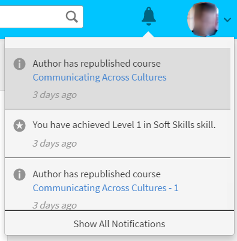

# Användarmeddelanden

<!--User notifications for Learners in Learning Manager.-->

Aviseringsfunktionen gäller alla användare av Adobe Learning Manager. Men varje användare baserat på sin roll får olika typer av meddelanden i olika scenarier. Alla aviseringar och meddelanden till användare visas i popup-dialogrutan Aviseringar.

## Åtkomstmeddelanden {#accessnotifications}

Användare kan se meddelanden genom att klicka på aviseringsikonen i det övre högra hörnet av fönstret.

Ett exempel på meddelandefönster för elevrollen visas i följande skärmbild:

*Visa alla meddelanden*

Det här popup-fönstret visar markeringar av alla meddelanden tillsammans med tidpunkten för förekomsten och en rullningslist.

Du kan ta reda på antalet senaste meddelanden baserat på det markerade numret högst upp på aviseringsikonen. Om det till exempel finns fem senaste meddelanden efter din föregående inloggning, kan du se siffran 5 visas ovanpå aviseringsikonen. Dessa siffror försvinner när du läser alla de senaste meddelandena.

Elever kan avvisa en kurs som har tilldelats dem av chefer genom att klicka på Avvisa i popupfönstret Aviseringar.

## Schemalägg push-meddelandet

Elever får push-meddelanden när de missar en deadline för kursen. Elever kommer att ha möjlighet att antingen sova på en påminnelse i 24 timmar eller bli påminda nästa vecka för varje försenad påminnelse de får. Det här gäller bara för meddelanden om försenade meddelanden.

## Visa alla meddelanden {#showallnotifications}

Klicka på länken **[!UICONTROL Show all notifications]** längst ned i popup-fönstret för meddelanden om du vill visa alla meddelanden på en separat sida.

*Visa alla meddelanden på en separat sida*

**Typer av aviseringar för elever**

Elever får meddelanden när följande händelser utlöses:

1. Eleven har slutfört en kurs
1. Eleven har slutfört en kurs och ännu inte gett L1-feedback
1. Eleven har uppnått ett utmärkelsetecken
1. Admin har registrerat en elev till en kurs eller ett utbildningsprogram eller en certifiering
1. Chefen har nominerat eleven till en kurs och eleven måste acceptera eller avvisa
1. En ny kompetens har tilldelats eleven
1. Eleven har uppnått en kompetens
1. Eleven slutför ett utbildningsprogram
1. Eleven har accepterat nomineringen
1. Eleven avvisade nomineringen
1. För chefsgodkända kurser godkänner/avvisar chefen en begäran om kursregistrering
1. Elevens väntelista har rensats.
1. Eleven har automatiskt registrerats till en kurs eller ett utbildningsprogram eller en certifiering
1. Eleven slutför en certifiering
1. Chefen godkänner/avslår beviset på slutförd certifiering som laddats upp av eleven
1. När deadline för en viss kursinstans närmar sig. (Administratören kan ange det datum då påminnelsemeddelanden kan visas för eleven).

## Ge feedback {#providefeedback}

Elever kan ge L1-feedback efter att ha slutfört en kurs som har ett alternativ för feedback. Om du vill lämna feedback klickar du på feedbacklänken som visas nedan när du har slutfört kursen.

*Ge kursfeedback*

>[!NOTE]
>
>Elever får bara feedback på kurser när en administratör aktiverar det för en viss kurs.
