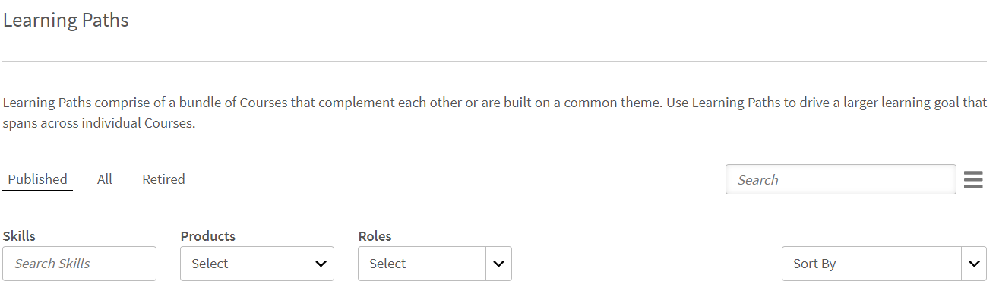

# Utbildningsobjekt

Det här dokumentet innehåller information om utbildningsobjekt för chefer.

En chef kan registrera elever under honom i kurser, utbildningsvägar och certifieringar. Mer information och steg att följa för att registrera sig finns i [Registrera elever.](../../administrators/feature-summary/courses.md#main-pars_header_1058138132)

## Kurser {#courses}

## Visa kurser {#viewingcourses}

Du som är chef kan visa en lista över alla tillgängliga kurser. Klicka på **[!UICONTROL Courses]** i den vänstra rutan för att visa listan över kurser med alternativ för sökning och filter. Du kan också visa kursens effektivitetsprocent för varje kurs på kursens miniatyrbilder. Observera att du bara kan registrera teammedlemmar på kurser som är synliga för dig under elevtillämpningen.

*Visa kurser*

>[!NOTE]
>
>Du kan visa en lista över alla utfasade kurser genom att klicka på fliken **Utfasade**.

## Visa quiz-poäng {#viewquizscores}

1. Klicka på kursnamnet på kursens miniatyrbild.
1. Klicka på Quiz-poäng i den vänstra rutan.

Du kan visa quiz-poängen för en viss kurs baserat på användarnamn eller baserat på varje fråga. Välj Efter användare eller Efter fråga flikar därefter. Du kan bara se quiz-poängen för dina teammedlemmar.

Välj instanstypen från rullgardinsmenyn för att visa poängen baserat på varje instans av kursen.

## Hantera elevlista för en kurs {#managelearnerslistforacourse}

Som chef kan du hantera elevlistan för dina teammedlemmar.

1. Klicka på kursnamnet på kursens miniatyrbild.
1. Klicka på **[!UICONTROL Learners]** i den vänstra rutan.

*Välj en elevåtgärd*

>[!NOTE]
>
>Alternativet **Exportera väntande godkännanden** kan utföras från elevappen.

Du kan utföra följande åtgärder från sidan Elever:

* Markera eleven som du vill ta bort och klicka på Åtgärder > Ta bort.
* Markera den elev vars närvaro du vill markera och klicka på Åtgärder > Markera som slutförd.

Klicka på Återställ om du vill att elever ska kunna återställa en modul och konsumera modulen igen. Klicka på Ja i dialogrutan som visas för att bekräfta återställningen. Moduler som har slutförts kan inte återställas. Endast felaktiga eller ofullständiga moduler kan återställas.

Du kan också exportera elevlistan i ett Excel-ark. Om du vill exportera elevlistan klickar du på Åtgärder > Exportera.

>[!NOTE]
>
>Om det finns flera instanser för en kurs visas elevlistan i Excel på varje flik separat. Elevlistan består av elevnamn, status och urvalskriterier. Elevstatus kan vara **Inte påbörjat**, **Pågår** eller **Slutfört**.

## Visa feedback om L1 och L3 {#viewl1andl3feedback}

Du kan visa L1-feedback från elever för en kurs och L3-feedback från medlemmar i teamet.

1. Klicka på valfri kursruta i kurslistan.
1. Klicka på L1-feedback eller L3-feedback i den vänstra rutan för att se den feedback som tagits emot.
1. Välj instansen i listrutan för att visa återkopplingen för den specifika instansen.

## Förhandsgranska kurser {#previewcourses}

Chefen kan förhandsgranska kurser genom att klicka på alternativet **Förhandsgranska som elev** medan han visar kursmodulerna.

1. Klicka på **[!UICONTROL Courses]** i den vänstra rutan när du har loggat in.
1. Klicka på en kursruta i listan över kurser på sidan.
1. Klicka på Förhandsgranska som elev i den vänstra rutan och klicka på modulnamnet på sidan för att förhandsgranska kursmodulen i spelaren.

## Kurseffektivitet {#courseeffectiveness}

Kursens effektivitet utvärderas för att förstå nyttan av en kurs för eleven. Det är en kombination av resultat från elevfeedback på kursinnehållet, quizresultaten för en elev och chefens feedback som utvärderar en elev baserat på lärdomar från kursen.

Du kan visa kursens effektivitetsklassificering på kursens miniatyrbilder som visas på ögonblicksbilden nedan. Du kan se betyget för den här kursen som 100.

<!---->

Värdet för kurseffektivitet har erhållits med beaktande av L1-, L2- och L3-feedbackvärden. Klicka på värdet för kurseffektivitet för att visa uppdelningen av varje feedback. Ett popup-fönster visas enligt nedan.

*Visa kurseffektivitet för feedback*

I den här exempelögonblicksbilden fick 1 av 1 användare alla tre feedback, därav är poängen 100/100. Från den här tabellen kan du förstå att om någon av de tre återkopplingarna (L1, L2 och L3 ) inte ges för en kurs, har det en negativ inverkan på den totala effektiviteten. Klicka på nedåtpilen i det nedre högra hörnet av popup-fönstret för att se hur beräkningarna av kurseffektivitet görs.

*Beräkning av kursens effektivitet*

Enligt cirkeldiagrammet ovan viktas L3-feedback från chefen mer.

## Söka efter kurser, utbildningsvägar och certifieringar {#searchingcourseslearningprogramsandcertifications}

Adobe Learning Manager gör det enklare för dig att snabbt hitta de kurser/utbildningsvägar du väljer. Du kan söka efter dina kurser på två sätt:

1. Använda sökfältet. Klicka på sökikonen som visas i det övre högra hörnet. Ett sökfält visas. Skriv in kursnamnet eller nyckelord som är associerade med dina kurser för att hitta dina kurser/utbildningsvägar. Du kan också söka med fördefinierade taggar som Captivate, C, Java och HTML. Taggar är sökbara i sökfältet, vilket innebär att taggarna visas i sökfältet när du skriver. Sökningen kan även utföras med hjälp av unikt ID.
1. Genom att filtrera listan över kurser/utbildningsvägar/certifieringar med hjälp av filtren. Du kan filtrera kurserna efter tillstånd som Alla, Publicerade och Utfasade.

Du kan söka baserat på kompetenser genom att välja **Kompetenser** och sedan välja dem. Som chef kan du sortera kurserna på fyra sätt för att bättre hitta den kurs du behöver. Klicka på Sortera efter och välj alfabetisk stigande ordning, alfabetisk fallande ordning, datum då kursen uppdaterades, datum då kursen skapades eller kursernas effektivitet:

* Namn (a-z)
* Namn (z-a)
* Uppdaterad datum
* Skapad datum
* Kurseffektivitet

*Filtrera kurser*

Du kan sortera utbildningsvägar på tre sätt: stigande i alfabetisk ordning, fallande i alfabetisk ordning och baserat på uppdaterat datum.

*Filtrera utbildningsväg*

## Registrera elever i kurser {#enrollinglearnersintocourses}

Chefer registrerar vissa elever för obligatoriska kurser enligt organisationens krav:

1. Håll muspekaren på publicerade kursplattor och klicka på Registrera elever.

   Du kan även klicka på en publicerad kursruta och klicka på elever i den vänstra rutan. En sida med en lista med elever visas. Klicka på Registrera.\
   Dialogrutan Registrera elever visas.

1. Ange elevens namn eller profil för att välja eleverna och klicka på Spara.

>[!NOTE]
>
>Du kan endast registrera elever som tillhör ditt team.

## Utbildningsvägar {#learningprograms}

Chefen kan registrera sig, visa quiz-poäng, L1- och L3-feedback och endast avregistrera sina reportrar.

## Lägg till elever i ett utbildningsspår {#addlearnerstoalearningprogram}

1. Klicka på Utbildningsvägar i den vänstra rutan i läget Chef.
1. Välj den publicerade utbildningsvägen från listan över paneler där du vill lägga till elever.
1. Klicka på Elever i den vänstra rutan under kategorin Programrapporter. Obs! Utbildningsprogrammet måste publiceras innan elever läggs till.
1. Klicka på länken Registrera dig på sidan.
1. Börja skriva elevens namn eller profil och välj eleverna från rullgardinsmenyn Elever. Klicka på Spara.

## Visa quiz-poäng {#Viewquizscores-1}

1. Klicka på valfri panel för utbildningsvägen.
1. Klicka på Quiz-poäng i den vänstra rutan.

Du kan visa quiz-poängen för en viss utbildningsväg baserat på användarnamn eller baserat på varje fråga. Välj Efter användare eller Efter fråga flikar därefter. Quizpoäng visas för en kurs i taget. Ändra kursnamnet från listrutan för att visa quizpoängen för andra kurser. Du kan också exportera quiz-poäng för varje kurs. Välj instanstyp i listrutan för att visa poängen baserat på varje instans av utbildningsvägen.

## Avregistrering av elever {#unenrollmentforlearners}

Chefen kan avregistrera en elev om hen inte har påbörjat utbildningsvägen än.

## Markera slutförande {#markcompletion}

En chef kan markera en LP-skiva som slutförd för elever. Mer information finns i [Markera slutförande](../../administrators/feature-summary/learning-paths.md).

## Certifieringar {#certifications}

## Registrera elever för certifieringen {#enrolllearnerstothecertification}

Du kan registrera elever till certifieringen på två sätt. Följ stegen nedan för att registrera elever.

1. Klicka på Certifieringar i den vänstra rutan när du har loggat in som chef. I listan Publicerade flikar håller du pekaren över varje certifiering och klickar på Registrera elever. Du kan även klicka på en publicerad certifieringsruta och klicka på Elever i den vänstra rutan. Klicka på + Registrera dig till höger på sidan Elever för att börja lägga till eleverna.
1. Du kan visa popup-dialogrutan Registrera elever efter att ha klickat på alternativet Registrera elever i vart och ett av de två stegen ovan. Börja skriva elevens namn, profil och välj elevens namn i listrutan och klicka på Spara.

## Avregistrering av elever {#Unenrollmentforlearners-1}

Chefen kan avregistrera en elev om eleven ännu inte har påbörjat certifieringen.

## Markera slutförande {#Markcompletion-1}

En chef kan markera slutförandet av certifieringen. Mer information finns i [Markera slutförande](../../administrators/feature-summary/certifications.md#main-pars_header_303097138).

## Chefsmeddelanden för godkännande av elevkurs {#manager-notifications-course-approval}

När en elev accepteras eller avvisas för registrering kan en chef nu visa information om sessionen (**Videokonferens** eller **Klassrum**) i popfönstret.

*Godkänn eller avslå en elevs registreringsbegäran*

Följande sessionsdetaljer visas:

* Sessionsnamn
* Instruktörens namn
* Plats
* Datum och tid

Så här fungerar arbetsflödet:

1. Chefen ser ett meddelande efter att en elev begär godkännande av en kurs.

1. Chefen klickar på **Sessionsdetaljer**.

   

   *Visa väntande uppgifter*

1. Chefen godkänner eller avvisar sedan begäran.
1. Chefen får ett bekräftelsemeddelande eller felmeddelande om godkännande eller avslag inte skedde som förväntat.
1. Eleven får ett meddelande eller godkännande eller avslag på kursregistreringen.

## Valfri inlämning för externa certifieringar {#optional}

I tidigare versioner av Learning Manager godkände en chef den fil som en elev hade skickat in för att en extern certifiering skulle slutföras. Chefen får ett meddelande först efter att eleven har skickat filen.

En chef kan nu se en lista över elever som har registrerat sig för den externa certifieringen på en inlämningssida som finns i den externa certifieringen och kan acceptera eller avvisa från själva sidan utan att vänta på ett meddelande.

När chefen accepterar utan att vänta på att filen ska skickas in får eleven ett nytt meddelande som chefen har accepterat och eleven behöver inte skicka filen. Om chefen avvisar utan att skicka in filen kan hen välja att godkänna igen utan att vänta på filen.

Om eleven skickar filen kan chefen se filen från inlämningssidan och godkänna eller avvisa den baserat på den inskickade filen.

*Acceptera eller avvisa baserat på inskickning av fil*

När kurser anges som obligatoriska:

* På inlämningssidan listas eleverna först efter att eleverna har slutfört kurserna.
* Eleven kan bara ladda upp en fil efter att ha slutfört kursen.

## Arbetsstöd {#jobaids}

Chefen kan hantera tilldelningen av arbetsstöd för sina reportrar. Men som chef kan du bara se de publicerade arbetsstöden medan en administratör också kan se indragna arbetsstöd.
