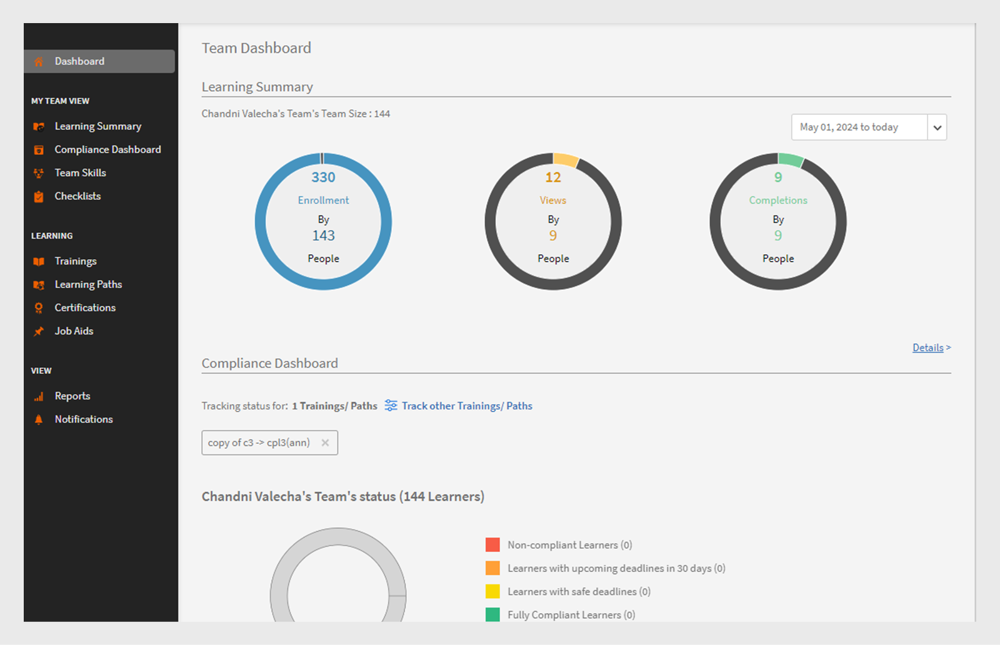
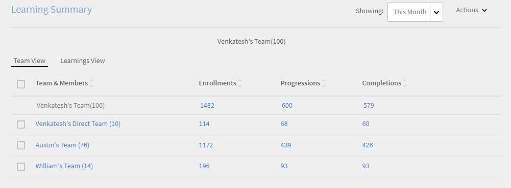
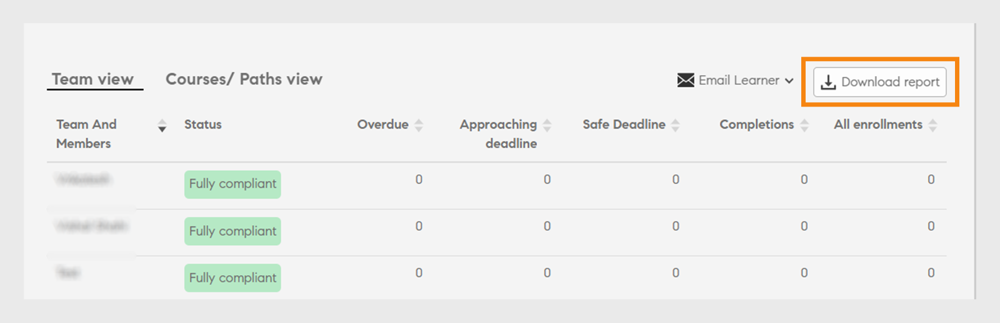
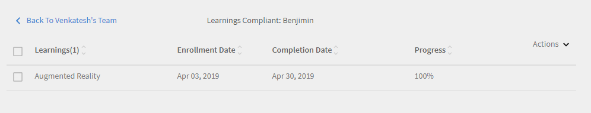
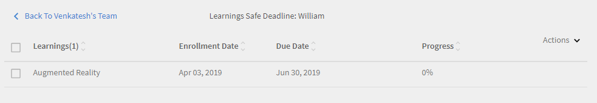
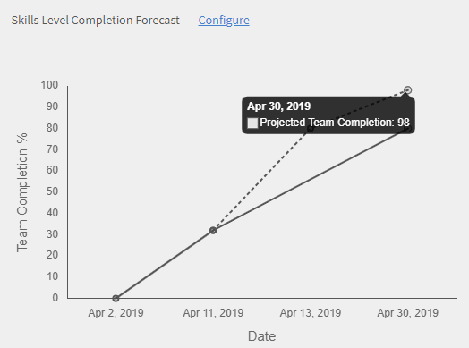
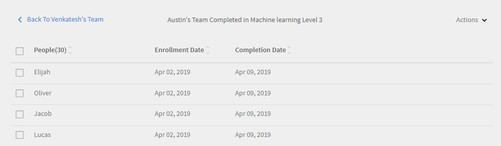

# Kontrollpanel för chef

Lär dig visa och spåra utbildningar från chefens instrumentpanel.

Chefer spelar en viktig roll i ett teams utbildningsinitiativ. För att vägleda dem bättre ger utbildningsplattformen chefen en instrumentpanel för att spåra lärdomarna i hans team.

*Kontrollpanelrapport för en chef*

Om du vill visa diagramdetaljerna klickar du på diagrammet eller på hyperlänken **[!UICONTROL Details]**.

## Sammanfattning av utbildning {#learningsummary}

En chef kan visa sammanfattningen av utbildningsaktiviteter för sitt team under en vald tidsperiod. Välj månad, kvartal eller år i listrutan.

Månad och År baseras på kalenderåret och Kvartal på räkenskapsåret som konfigurerats av administratören i kontoinställningarna.

*Visa utbildningsaktiviteter under en tidsperiod*

## Teamvy {#teamview}

I teamvyn visas teamen, deras medlemmar och deras respektive registreringar, framsteg och slutföranden för utbildningsobjekt.

*I teamvyn visas team, medlemmar och deras respektive registreringar*

När du klickar på teamnamnen, till exempel Venkateshs team, kan du se medlemmarna i Venkateshs team tillsammans med det totala antalet registreringar, framsteg och slutföranden för ett utbildningsobjekt.

*Välj en teammedlem*

Klicka på numret i respektive kolumn som motsvarar teamchefen för att se utbildningssammanfattningen för varje teammedlem. En tabell öppnas som visar listan över utbildningsobjekt med information om registreringsdatum, förfallodatum och förlopp.

*Välj en teamchef*

På samma sätt kan du visa utbildningsobjekten tillsammans med antalet registreringar, framsteg eller slutföranden genom att klicka på värdena under motsvarande kolumner.

*Visa kurser och utbildningssammanfattning*

När du klickar ytterligare på antalet registreringar, framsteg eller slutföranden för varje utbildning kan du se följande information: Personer, registrerings-/slutförandedatum, förfallodatum och gjorda framsteg.

*Visa registrerings-/slutförandedatum, förfallodatum och gjorda framsteg*

## Utbildningsvy {#learningsview}

Utbildningsvyn visar antalet registreringar, framsteg och slutföranden för ett utbildningsobjekt.

Klicka på motsvarande värden i kolumnerna Registreringar, Framsteg och Slutföranden om du vill se information om personer, registreringsdatum, slutdatum och framsteg för respektive utbildningsobjekt.

*Utbildningsvyn*

## Exportera rapport {#exportreport}

Om du vill skapa en Excel-rapport väljer du **[!UICONTROL Actions]>[!UICONTROL Report]**

## Status för efterlevnad {#compliancestatus}

På efterlevnadstavlan kan chefer se teamets övergripande efterlevnadsstatus för konfigurerade utbildningar i specifika kategorier (till exempel försäljning, marknadsföring och juridisk information). Administratörer kan skapa en tavla med efterlevnadskurser, utbildningsvägar eller certifiering och dela med cheferna. Chefer kan visa kontrollpanelen som delas av administratören i sina instanser.

### Visa kontrollpanelen

Välj **[!UICONTROL Compliance Dashboard]** från chefsappen för att visa instrumentpanelen.

_Efterlevnadstavla - hanterarapp_

Efterlevnadstavlan innehåller följande efterlevnadsstatus:

* **[!UICONTROL Non-compliant Learners]**: Visar antalet elever som har missat deadlines.
* **[!UICONTROL Learners approaching deadlines]**: Visar antalet elever med deadlines på mindre än 30 dagar.
* **[!UICONTROL Learners with safe deadlines]**: Visar antalet elever med deadlines längre ut (mer än 30 dagar).
* **[!UICONTROL Fully compliant Learners]**: Visar antalet elever som är helt kompatibla.
* **[!UICONTROL Learners not enrolled anywhere]**: Visar antalet elever som inte har registrerats för några kurser, utbildningsvägar eller certifieringar.

### E-postansvariga och elever

**Hantera flera team**

Om du hanterar flera team kan du meddela dina chefer om deras teammedlemmars utbildningsstatus genom att välja alternativet **[!UICONTROL Email Managers]** som är tillgängligt i avsnittet **[!UICONTROL Team view]**.

_E-postansvariga_

I **[!UICONTROL Email Managers]** finns följande alternativ:

* **[!UICONTROL Email Managers of Non-compliant Learners]**: Meddela chefer vars teammedlemmar har missat deadlines.
* **[!UICONTROL Email Managers of Learners Approaching Deadlines]**: Meddela chefer vars teammedlemmar har kommande deadlines.

**Hantera ett team**

Om du hanterar ett enda team kan du meddela dina elever om deras utbildningsstatus genom att välja alternativet **[!UICONTROL Email Learners]** som finns i avsnittet **[!UICONTROL Team view]**.

_Skicka e-post till elever_

Alternativet **[!UICONTROL Email Learners]** ger dig följande alternativ:

* **[!UICONTROL Email Non-compliant Learners]**: Meddela elever som har missat deadlines.
* **[!UICONTROL Email Learners Approaching Deadlines]**: Meddela elever som har kommande deadlines.

### Ladda ned rapport

Hämta rapporten genom att följa dessa steg:

1. Gå till **[!UICONTROL Compliance Dashboard]** > **[!UICONTROL Team view]** i chefsappen.
1. Välj **[!UICONTROL Download report]** för att spara instrumentpanelen som en rapport.
På så sätt kan du följa teamets allmänna utbildningsframsteg.

_Hämta rapporter_

<!--On this dashboard, managers can also view the learners who are compliant, in a safe deadline, approaching deadline, and non-compliant for a selected learning object. 

Learning Objects with completion deadlines can be configured in compliance dashboard for tracking. 

**Compliant**: Displays the number of learners who have completed the learning object within completion deadline.

**Safe deadline**: Displays the number of learners who have less than 30 days available to complete a learning object.

**Upcoming Deadline**: Displays the number of learners with more than 30 days available to complete a learning object.

**Non-compliant**: Displays the number of learners who did not complete the learning object within the completion deadline.

*View compliance dashboard*

## Team View {#TeamView-1}

Displays the compliance status of a course for respective teams. Compliant, Safe Deadline, Upcoming Deadline, and Non-Compliant are columns in the Team View table.

*compliance status of a course for respective teams*

To display names of the members in a team and the individual number of courses for which their status is Compliant, in Safe Deadline, reaching Upcoming Deadline, and Non Compliant, click the corresponding values in the table.

*Select individual teams*

On further clicking the values in the compliant, safe deadline, upcoming deadline, and non-compliant column, the corresponding course details are displayed: Learning object name, enrollment/ completion date, due date, and progress in percentage.

 

*View progress of courses*

## Learnings View {#LearningsView-1}

In the Compliance Status Learnings View, the list of Learning Objects and the corresponding number of team members that are Compliant, within a Safe Deadline, have an Upcoming Deadline, or are Non Compliant is displayed.

*View deadline and compliance status*

On further clicking the values in the compliant, safe deadline, upcoming deadline, and non compliant columns, the following data is displayed: People, Enrollment Date, Completion date, and Progress.

*View details of compliance*

## Export data & send emails {#exportdataampsendemails}

* To export the compliance status for team and learnings view, click **[!UICONTROL Actions]** > **[!UICONTROL Export]**.

* To send an email to team members, click **[!UICONTROL Actions]** > **[!UICONTROL Send Email]**.

*Export and email data*-->

## Teamfärdigheter {#teamskills}

Chefer kan visa diagrammet för slutförda kompetenser och konfigurera en prognos för slutförda kompetenser på olika nivåer. Listrutan Kompetens innehåller fem kompetenser. Chefen lär känna teammedlemmarnas expertis och identifierar starka talanger inom vissa färdigheter.

Chefer kan också köra vissa färdigheter i ett team genom att sätta upp ett mål och prognostisera hur lång tid det skulle ta att uppnå en kompetens för en viss procentandel av ett team inom en tidslinje.

Prognosen bygger på systemberäkningar som ger en bild av hur denna specifika färdighet utvecklas i framtiden.

*Visa kompetensprognos*

Följ stegen nedan för att visa ett teams kompetensstatus:

1. Klicka på **[!UICONTROL Team Skills]** i den vänstra rutan under avsnittet Min teamvy.
1. Om du vill visa de visade kunskaperna klickar du på filtret kompetens och väljer ett i listrutan.
1. Om du vill välja en nivå (Nivå 1, Nivå 2 eller Nivå 3) klickar du på listrutan Nivå.
1. Baserat på vald kompetens och nivå visas ett diagram med dess kompetensstatus. När du håller diagrammet över det kan du visa följande procentandelar av kompetensstatusen: **Pågår** och **Uppnått**.

   

   *Visa procent av kompetensstatus*

## Så här prognostiserar du slutförandet av teamet i procent för en kompetens {#howtoforecasttheteamcompletionforaskill}

Gör så här för att prognostisera slutförandet av teamet i procent för en kompetens:

1. Om du vill visa konfigurationsspåraren klickar du på länken Konfigurera hyperlänk.

   

   *Välj länken Konfigurera hyperlänk*

1. I dialogrutan Konfigurera anger du ett procentvärde i fältet **Målslutförande %** för kompetensen du vill konfigurera och datumet då du vill uppnå målslutförandet % i fältet **Måldatum**.****

   

   *Ange procent för målslutförande*

1. Klicka på knappen **Beräkning** för att visa utdata för din prognos. Utdata ser ut som nedanstående skärmbild.

   

   *Visa resultat för kompetensmätare*

## Prognos över slutförda kompetensnivåer {#skilllevelcompletionforecast}

Chefen för ett team kan visa och konfigurera procentandelen slutfört team för en kompetens för en viss tidsperiod baserat på målslutförande i procent och datum och tid som anges i kompetensspåraren.

I prognosdiagrammet finns det två typer av linjer (heldragen och prickad linje) med tre hörn vardera.

På den heldragna linjen visar den första punkten datumet för den första registreringen för en kunskapsnivå.

*Visa första registrering för en kompetensnivå*

Den andra punkten visar aktuellt datum och teamets slutförandegrad i procent av kompetensen.

*Visa aktuellt datum och slutförande av teamet % av kompetensnivån*

Den tredje punkten på raden visar förväntat slutförandemål i procent och målslutförandedatum.

*Visa förväntat slutförandemål i % och målslutförandedatum*

## Prognosrad {#forecastline}

Den streckade linjen är prognoslinjen som visar prognosen beroende på det aktuella slutförandet av teamet i procent för en kompetens under en viss tidsperiod.

Den första punkten på den prickade linjen representerar teamets slutförande i procent och det prognostiserade teamets slutförande i procent för en kompetens på det datumet.

*Visa teamets slutförande i procent och beräknat teamslutförande i procent för en kompetens*

Den andra punkten visar det datum då det projekterade teamslutförandet i procent uppnåddes för en kompetens.

*Visa det datum då det projekterade slutförandet av teamet i procent uppnåddes för en kompetens*

Den tredje punkten på prognosraden visar teamets slutförande i procent, som uppnås på det måldatum som anges i kompetensspåraren.

*Visa teamets slutförande i procent som uppnås på det måldatum som anges i kompetensspåraren*

Under diagrammet visas en tabell med teamets vy och antalet kompetenser som har registrerats, uppnåtts och pågår. Om en utbildning har ett slutförandedatum visas även det förväntade slutförandedatumet.

*Tabell med teamvy och antal kompetenser som har registrerats, uppnåtts och pågår*

När du klickar på teamnamnet visas en lista med medlemmar som registrerat sig för kompetensen, kunskapsstatusen och slutförandedatumet.

*Visa en lista över medlemmar*

När du klickar på teamet kan du visa medlemmarna i det och motsvarande information för den valda kompetensen som om du är registrerad, statusen (pågående eller uppnådd) och slutförandedatumet om det är inställt.

*Visa medlemmarnas kompetenser*

När du väljer värden för ett team under kolumnen Registrering, Uppnått och Pågår kan du visa antalet användare som har registrerat sig för kompetensen. Du kan också visa det datum då användaren hade registrerat sig för kompetensen, status och slutförandedatum om kompetensen slutfördes av användaren.

<!-- -->

## Exportera rapport {#Exportreport-1}

* Klicka på **[!UICONTROL Actions]** > **[!UICONTROL Export]** för att exportera data som en Excel-fil.

*Exportera data*
