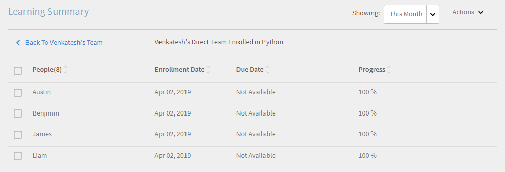
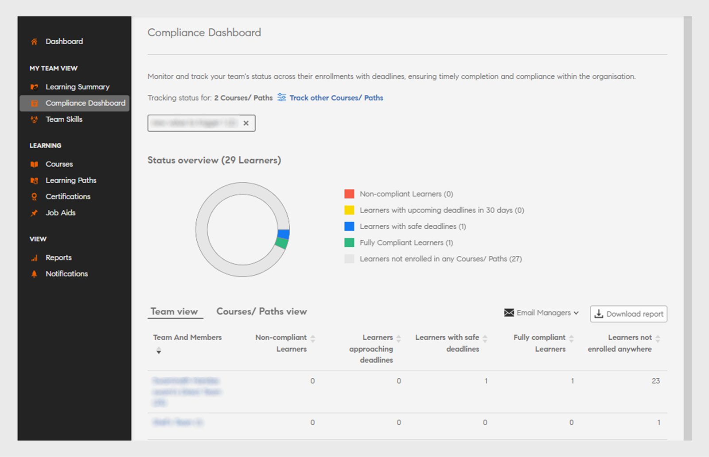
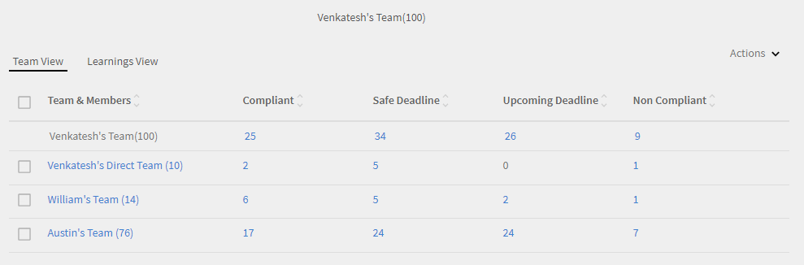

# Instrumentpanel för chefer

Lär dig hur du visar och spårar utbildningar från instrumentpanelen för chefer.

Chefer spelar en viktig roll i ett teams lärandeinitiativ. För att vägleda dem bättre ger lärplattformen chefen en instrumentpanelsvy för att spåra lärdomarna i sitt team.

*Instrumentpanelsrapport för en chef*

Om du vill visa information om ett diagram klickar du på diagrammet eller klickar på **[!UICONTROL Details]** hyperlänk.

## Sammanfattning av utbildning {#learningsummary}

En chef kan visa sammanfattningen av utbildningsaktiviteter för sitt team under en vald tidsperiod. Välj månad, kvartal eller år i rullgardinsmenyn.

&quot;Månad&quot; och &quot;År&quot; baseras på kalenderåret medan &quot;Kvartal&quot; baseras på räkenskapsåret som konfigurerats av administratören i kontoinställningarna.

*Visa läraktiviteter över en tidsperiod*

## Teamvy {#teamview}

I teamvyn visas teamen, deras medlemmar och deras respektive registreringar, framsteg och slutföranden för lärobjekt.

*Teamvyn visar teamen, deras medlemmar och deras respektive registreringar*

När du klickar på teamnamnen, till exempel Venkateshs team, kan du se medlemmarna i Venkateshs team tillsammans med det totala antalet registreringar, framsteg och slutföranden för ett lärobjekt.

*Välj en teammedlem*

Om du vill visa utbildningssammanfattningen för varje teammedlem klickar du på numret i respektive kolumn som motsvarar teamledaren. En tabell öppnas som visar en lista över lärobjekt med information om inskrivningsdatum, förfallodatum och förlopp.

*Välj en teamchef*

På samma sätt kan du visa lärobjekten tillsammans med antalet inskrivningar, framsteg eller slutföranden genom att klicka på värdena under motsvarande kolumner.

*Visa kurser och utbildningssummering*

När du klickar vidare på antalet inskrivningar, framsteg eller slutföranden för varje inlärning kan du se följande information: Personer, inskrivnings-/slutförandedatum, förfallodatum och gjorda framsteg.

*Visa inskrivnings-/slutförandedatum, förfallodatum och framsteg som gjorts*

## Utbildningsvy {#learningsview}

Utbildningsvyn visar antalet inskrivningar, framsteg och slutföranden för ett utbildningsobjekt.

Om du vill se information om personer, inskrivningsdatum, inlämningsdatum och förlopp för respektive lärobjekt klickar du på motsvarande värden i kolumnerna för inskrivningar, framsteg och slutföranden.

*Vyn Utbildningar*

## Exportera rapport {#exportreport}

Om du vill generera en Excel-rapport väljer du **[!UICONTROL Actions]>[!UICONTROL Report]**

## Status för efterlevnad {#compliancestatus}

I instrumentpanelen för efterlevnad kan chefer visa teamets övergripande efterlevnadsstatus för konfigurerade utbildningar i specifika kategorier (till exempel försäljning, marknadsföring och juridik). Administratörer kan skapa en instrumentpanel med efterlevnadskurser, utbildningsvägar eller certifiering och dela med cheferna. Chefer kan visa instrumentpanelen som delas av administratören i sina instanser.

### Visa instrumentpanelen

Om du vill visa instrumentpanelen väljer du **[!UICONTROL Compliance Dashboard]** från chefsappen.

_App för instrumentpanel för efterlevnad_

Instrumentpanelen för efterlevnad innehåller följande efterlevnadsstatusar:

* **[!UICONTROL Non-compliant Learners]**: Visar antalet elever som missade deadlines.
* **[!UICONTROL Learners approaching deadlines]**: Visar antalet elever med inlämningsdatum på mindre än 30 dagar.
* **[!UICONTROL Learners with safe deadlines]**: Visar antalet elever med inlämningsdatum längre fram (mer än 30 dagar).
* **[!UICONTROL Fully compliant Learners]**: Visar antalet elever som uppfyller alla krav.
* **[!UICONTROL Learners not enrolled anywhere]**: Visar antalet elever som inte är inskrivna på några kurser, utbildningsvägar eller certifieringar.

### E-posthanterare och elever

**Hantera flera team**

Om du leder flera team kan du meddela dina chefer om deras teammedlemmars inlärningsstatus genom att välja det alternativ som **[!UICONTROL Email Managers]** är tillgängligt i **[!UICONTROL Team view]** avsnittet.

_Chefer för e-post_

Ger **[!UICONTROL Email Managers]** dig följande alternativ:

* **[!UICONTROL Email Managers of Non-compliant Learners]**: Meddela chefer vars teammedlemmar missade deadlines.
* **[!UICONTROL Email Managers of Learners Approaching Deadlines]**: Meddela chefer vars teammedlemmar har kommande deadlines.

**Hantera ett enda team**

Om du leder ett enda team kan du meddela dina elever om deras inlärningsstatus genom att välja det alternativ som **[!UICONTROL Email Learners]** är tillgängligt i **[!UICONTROL Team view]** avsnittet.

_Elever som lär sig e-post_

Alternativet **[!UICONTROL Email Learners]** ger dig följande alternativ:

* **[!UICONTROL Email Non-compliant Learners]**: Meddela elever som missat deadlines.
* **[!UICONTROL Email Learners Approaching Deadlines]**: Meddela elever som har kommande deadlines.

### Ladda ned rapport

Följ dessa steg för att ladda ned rapporten:

1. I manager-appen går du till **[!UICONTROL Compliance Dashboard]** > **[!UICONTROL Team view]**.
1. Välj **[!UICONTROL Download report]** det här alternativet om du vill spara instrumentpanelen som en rapport.
På så sätt kan du spåra teamets övergripande inlärningsframsteg.

_Ladda ner rapporter_

<!--On this dashboard, managers can also view the learners who are compliant, in a safe deadline, approaching deadline, and non-compliant for a selected learning object. 

Learning Objects with completion deadlines can be configured in compliance dashboard for tracking. 

**Compliant**: Displays the number of learners who have completed the learning object within completion deadline.

**Safe deadline**: Displays the number of learners who have less than 30 days available to complete a learning object.

**Upcoming Deadline**: Displays the number of learners with more than 30 days available to complete a learning object.

**Non-compliant**: Displays the number of learners who did not complete the learning object within the completion deadline.

*View compliance dashboard*

## Team View {#TeamView-1}

Displays the compliance status of a course for respective teams. Compliant, Safe Deadline, Upcoming Deadline, and Non-Compliant are columns in the Team View table.

*compliance status of a course for respective teams*

To display names of the members in a team and the individual number of courses for which their status is Compliant, in Safe Deadline, reaching Upcoming Deadline, and Non Compliant, click the corresponding values in the table.

*Select individual teams*

On further clicking the values in the compliant, safe deadline, upcoming deadline, and non-compliant column, the corresponding course details are displayed: Learning object name, enrollment/ completion date, due date, and progress in percentage.

 

*View progress of courses*

## Learnings View {#LearningsView-1}

In the Compliance Status Learnings View, the list of Learning Objects and the corresponding number of team members that are Compliant, within a Safe Deadline, have an Upcoming Deadline, or are Non Compliant is displayed.

*View deadline and compliance status*

On further clicking the values in the compliant, safe deadline, upcoming deadline, and non compliant columns, the following data is displayed: People, Enrollment Date, Completion date, and Progress.

*View details of compliance*

## Export data & send emails {#exportdataampsendemails}

* To export the compliance status for team and learnings view, click **[!UICONTROL Actions]** > **[!UICONTROL Export]**.

* To send an email to team members, click **[!UICONTROL Actions]** > **[!UICONTROL Send Email]**.

*Export and email data*-->

## Laga-färdigheter {#teamskills}

Chefer kan visa grafen för slutförande av färdigheter och konfigurera en prognos för slutförande av färdigheter på olika nivåer. Rullgardinsmenyn för färdigheter innehåller fem färdigheter. Chefen lär känna den expertis som teammedlemmarna har skaffat sig och identifierar starka talanger inom vissa färdigheter.

Chefer kan också driva vissa färdigheter i ett team genom att sätta upp ett mål och göra prognoser för hur lång tid det skulle ta att uppnå en färdighet för en viss procentandel av ett team inom en tidslinje.

Denna prognos är baserad på systemberäkningar som ger en bild av framtiden för en utveckling av den specifika färdigheten.

*Visa färdighetsprognos*

För att se ett lags skicklighetsstatus, följ stegen nedan:

1. Klicka i **[!UICONTROL Team Skills]** den vänstra rutan under avsnittet Min teamvy.
1. Om du vill visa de färdigheter som visas klickar du på kunskapsfiltret och väljer en i listrutan.
1. Om du vill välja en nivå (Nivå 1, Nivå 2 eller Nivå 3) klickar du på den nedrullningsbara menyn Nivå.
1. Baserat på den valda färdigheten och nivån visas en graf med dess färdighetsstatus. När du hovrar diagrammet kan du visa följande procentandelar av färdighetsstatusen: **Pågår** och **Uppnådd**.

   

   *Visa procentandel av kompetensstatus*

## Hur man prognostiserar lagets slutförandeprocent för en färdighet {#howtoforecasttheteamcompletionforaskill}

Om du vill prognostisera teamets slutförandeprocent för en färdighet följer du stegen nedan:

1. Om du vill visa konfigurationsspåraren klickar du på konfigurera hyperlänken.

   

   *Välj hyperlänken Konfigurera*

1. Från popup-dialogrutan Konfigurera anger du ett procentvärde för **den färdighet som du vill konfigurera i fältet Målslutförandeprocent** och det datum då du vill uppnå målslutförandeprocenten i fältet **Måldatum** .****

   

   *Ange målprocent för slutförande*

1. Om du vill visa utdata för din prognos klickar du på **knappen Uppskattning** . Utdata ser ut som på skärmbilden nedan.

   

   *Visa färdighet tracxker utdata*

## Prognos för slutförande av färdighetsnivå {#skilllevelcompletionforecast}

Chefen för ett team kan visa och konfigurera teamets slutförandeprocent för en färdighet för en viss tidsperiod baserat på målets slutförandeprocent och datum och tid som anges i färdighetsspåraren.

I prognosdiagrammet finns det två typer av linjer (heldragen och prickad linje) med tre hörn vardera.

På den heldragna linjen visar den första punkten datumet för den första registreringen för en färdighetsnivå.

*Visa den första registreringen för en färdighetsnivå*

Den andra punkten visar det aktuella datumet och teamets slutförandeprocentnivå för färdigheten.

*Visa aktuellt datum och teamets slutförandenivå i % av färdigheten*

Den tredje punkten på raden visar den förväntade målslutsprocenten och måldatumet för slutförande.

*Visa den förväntade målslutförandeprocenten och måldatumet för slutförande*

## Prognos linje {#forecastline}

Den streckade linjen är den prognoslinje som visar prognosen beroende på lagets aktuella slutförandeprocent för en färdighet under en viss tidsperiod.

Den första punkten på den streckade linjen representerar lagets slutförandeprocent och beräknad lagslutförandeprocent för en färdighet på det datumet.

*Visa lagets slutförandeprocent och beräknad lagslutförandeprocent för en färdighet*

Den andra punkten visar det datum då den beräknade slutförandeprocenten för ett lag uppnåddes för en färdighet.

*Visa det datum då det beräknade slutförandeprocentet för ett lag uppnåddes för en färdighet*

Den tredje punkten i prognoslinjen visar lagets slutförandeprocent som har uppnåtts på det måldatum som anges i färdighetsspåraren.

*Visa hur många procent av lagets slutförande som har uppnåtts på det måldatum som anges i färdighetsspåraren*

Under diagrammet visas en tabell med teamets vy och antalet färdigheter som har registrerats, uppnåtts och pågår. Om en inlärning har ett slutdatum visas även det förväntade slutdatumet.

*Tabell med teamets vy och antalet färdigheter som har registrerats, uppnåtts och pågår*

När du klickar på teamnamnet visas en lista över medlemmar som har registrerat sig för färdigheten, kompetensens status och slutförandedatum.

*Visa lista över medlemmar*

När du klickar på teamet kan du se medlemmarna i det och motsvarande detaljer för den valda färdigheten, t.ex. om du har registrerat dig, status (om det pågår eller har uppnåtts) och slutdatumet om det har angetts.

*Visa medlemmarnas färdigheter*

När du väljer värdena för ett team under kolumnen registrering, uppnådd och pågår kan du visa antalet användare som har registrerat sig för färdigheten. Du kan också visa det datum då användaren anmälde sig till färdigheten, status och slutförandedatum om färdigheten slutfördes av användaren.

<!-- -->

## Exportera rapport {#Exportreport-1}

* Klicka på **[!UICONTROL Actions]** > **[!UICONTROL Export]** för att exportera data som en Excel-fil.

*Exportera data*
