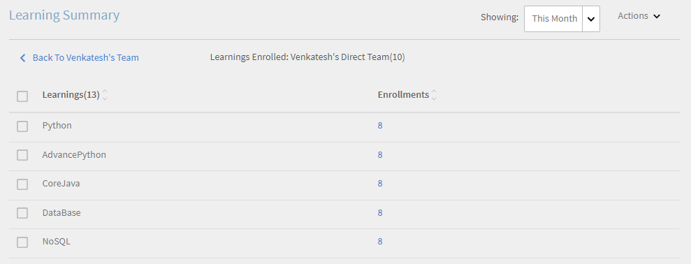
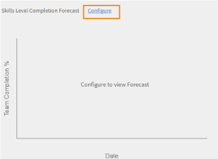

# Kontrollpanel för chef

Lär dig visa och spåra utbildningar från chefens instrumentpanel.

Chefer spelar en viktig roll i ett teams utbildningsinitiativ. För att vägleda dem bättre ger utbildningsplattformen chefen en instrumentpanel för att spåra lärdomarna i hans team.

*Kontrollpanelrapport för en chef*

Om du vill visa diagramdetaljerna klickar du på diagrammet eller på **[!UICONTROL Details]** hyperlänk.

## Sammanfattning av utbildning {#learningsummary}

En chef kan visa sammanfattningen av utbildningsaktiviteter för sitt team under en vald tidsperiod. Välj månad, kvartal eller år i listrutan.

Månad och År baseras på kalenderåret och Kvartal på räkenskapsåret som konfigurerats av administratören i kontoinställningarna.

*Visa utbildningsaktiviteter över en tidsperiod*

## Teamvy {#teamview}

I teamvyn visas teamen, deras medlemmar och deras respektive registreringar, framsteg och slutföranden för utbildningsobjekt.

*I teamvyn visas teamen, deras medlemmar och deras respektive registreringar*

När du klickar på teamnamnen, till exempel Venkateshs team, kan du se medlemmarna i Venkateshs team tillsammans med det totala antalet registreringar, framsteg och slutföranden för ett utbildningsobjekt.

*Välj en teammedlem*

Klicka på numret i respektive kolumn som motsvarar teamchefen för att se utbildningssammanfattningen för varje teammedlem. En tabell öppnas som visar listan över utbildningsobjekt med information om registreringsdatum, förfallodatum och förlopp.

*Välj en teamchef*

På samma sätt kan du visa utbildningsobjekten tillsammans med antalet registreringar, framsteg eller slutföranden genom att klicka på värdena under motsvarande kolumner.

*Visa kurser och utbildningssammanfattning*

När du klickar ytterligare på antalet registreringar, framsteg eller slutföranden för varje utbildning kan du se följande information: Personer, registrerings-/slutförandedatum, förfallodatum och gjorda framsteg.

*Visa registrerings-/slutförandedatum, förfallodatum och gjorda framsteg*

## Vyn Utbildningar {#learningsview}

Utbildningsvyn visar antalet registreringar, framsteg och slutföranden för ett utbildningsobjekt.

Klicka på motsvarande värden i kolumnerna Registreringar, Framsteg och Slutföranden om du vill se information om personer, registreringsdatum, slutdatum och framsteg för respektive utbildningsobjekt.

*Vyn Utbildningar*

## Exportera rapport {#exportreport}

Om du vill skapa en Excel-rapport klickar du på **[!UICONTROL Actions]>[!UICONTROL Report]**

## Efterlevnadsstatus {#compliancestatus}

Chefer kan visa teamets övergripande kompatibilitetsstatus för konfigurerade utbildningar på efterlevnadstavlan. Utbildningslistan kan konfigureras och chefen kan välja utbildningar för att spåra kompatibilitetsstatusen.

På instrumentpanelen kan chefer även visa elever som uppfyller kraven, inom en säker deadline, närmar sig deadline och som inte uppfyller kraven för ett valt utbildningsobjekt.

Utbildningsobjekt med tidsgränser för slutförande kan konfigureras i efterlevnadstavlan för spårning.

**Klagomål**: Visar antalet elever som har slutfört utbildningsobjektet inom deadline för slutförande.

**Säker deadline**: Visar antalet elever som har mindre än 30 dagar på sig att slutföra ett utbildningsobjekt.

**Kommande deadline**: Visar antalet elever som har mer än 30 dagar på sig att slutföra ett utbildningsobjekt.

**Icke-kompatibel**: Visar antalet elever som inte har slutfört utbildningsobjektet inom deadline för slutförande.

*Visa efterlevnadstavla*

## Teamvy {#TeamView-1}

Visar efterlevnadsstatus för en kurs för respektive team. Kompatibla, säkra deadlines, kommande deadlines och icke-kompatibla kolumner är kolumner i teamvytabellen.

*efterlevnadsstatus för en kurs för respektive team*

Om du vill visa namnen på medlemmarna i ett team och det individuella antalet kurser för vilka deras status är kompatibel, i Säker deadline, nå kommande deadline och Icke-kompatibel, klickar du på motsvarande värden i tabellen.

*Välj enskilda team*

När du klickar ytterligare på värdena i kolumnen för kompatibel, säker deadline, kommande deadline och icke-kompatibel visas motsvarande kursinformation: Namn på utbildningsobjekt, registrerings-/slutförandedatum, förfallodatum och förlopp i procent.

 

*Visa framsteg för kurser*

## Vyn Utbildningar {#LearningsView-1}

I vyn Efterlevnadsstatus för utbildningar visas listan med utbildningsobjekt och motsvarande antal teammedlemmar som är kompatibla, inom en säker deadline, har en kommande deadline eller är icke-kompatibla.

*Visa deadline och efterlevnadsstatus*

När du ytterligare klickar på värdena i de kompatibla, säkra tidsgränsen, kommande tidsgräns och icke-kompatibla kolumnerna visas följande data: Personer, registreringsdatum, slutförandedatum och förlopp.

*Visa detaljer om efterlevnad*

## Exportera data och skicka e-post {#exportdataampsendemails}

* Om du vill exportera efterlevnadsstatusen för team- och utbildningsvyn klickar du på **[!UICONTROL Actions]** > **[!UICONTROL Export]**.

* Om du vill skicka ett e-postmeddelande till teammedlemmar klickar du på **[!UICONTROL Actions]** > **[!UICONTROL Send Email]**.

*Exportera och skicka data via e-post*

## Teamfärdigheter {#teamskills}

Chefer kan visa diagrammet för slutförda kompetenser och konfigurera en prognos för slutförda kompetenser på olika nivåer. Fem kompetenser listas i listrutan Kompetens. Chefen lär känna teammedlemmarnas expertis och identifierar starka talanger i vissa färdigheter.

Chefer kan också köra vissa färdigheter i ett team genom att sätta upp ett mål och prognostisera hur lång tid det skulle ta att uppnå en kompetens för en viss procent av ett team inom en tidslinje.

Prognosen bygger på systemberäkningar som ger en bild av hur denna specifika färdighet utvecklas i framtiden.

*Visa kompetensprognos*

Följ stegen nedan för att visa ett teams kompetensstatus:

1. Klicka **[!UICONTROL Team Skills]** i den vänstra rutan under avsnittet Min teamvy.
1. Om du vill visa de visade kunskaperna klickar du på filtret kompetens och väljer ett i listrutan.
1. Om du vill välja en nivå (Nivå 1, Nivå 2 eller Nivå 3) klickar du på listrutan Nivå.
1. Baserat på vald kompetens och nivå visas ett diagram med dess kompetensstatus. När du håller diagrammet kan du visa följande procentandelar av kunskapsstatusen: **Pågår** och **Uppnått**.

   

   *Visa procentandel av kompetensstatus*

## Så här prognostiserar du slutförandet av teamet i procent för en kompetens {#howtoforecasttheteamcompletionforaskill}

Gör så här för att prognostisera slutförandet av teamet i procent för en kompetens:

1. Om du vill visa konfigurationsspåraren klickar du på länken Konfigurera hyperlänk.

   

   *Välj länken Konfigurera hyperlänk*

1. I dialogrutan Konfigurera anger du ett procentvärde i rutan för den kompetens du vill konfigurera **Slutförande av mål i procent** och det datum då du vill uppnå målslutförandet i procent i **Måldatum** field.****

   

   *Ange procent för slutförande av mål*

1. Om du vill visa utdata för prognosen klickar du på **Uppskattning** knapp. Utdata ser ut som nedanstående skärmbild.

   

   *Visa resultat för kompetensmätare*

## Prognos över slutförda kompetensnivåer {#skilllevelcompletionforecast}

Chefen för ett team kan visa och konfigurera procentandelen slutfört team för en kompetens för en viss tidsperiod baserat på målslutförande i procent och datum och tid som anges i kompetensspåraren.

I prognosdiagrammet finns det två typer av linjer (heldragen och prickad linje) med tre hörn vardera.

På den heldragna linjen visar den första punkten datumet för den första registreringen för en kunskapsnivå.

*Visa första registrering för en kompetensnivå*

Den andra punkten visar aktuellt datum och teamets slutförandegrad i procent av kompetensen.

*Visa aktuellt datum och slutförande för team i procent av kompetensen*

Den tredje punkten på raden visar förväntat slutförandemål i procent och målslutförandedatum.

*Visa förväntat slutförandemål i procent och målslutförandedatum*

## Prognosrad {#forecastline}

Den streckade linjen är prognoslinjen som visar prognosen beroende på det aktuella slutförandet av teamet i procent för en kompetens under en viss tidsperiod.

Den första punkten på den prickade linjen representerar teamets slutförande i procent och det prognostiserade teamets slutförande i procent för en kompetens på det datumet.

*Visa teamslutförande i procent och planerat teamslutförande i procent för en kompetens*

Den andra punkten visar det datum då det projekterade teamslutförandet i procent uppnåddes för en kompetens.

*Visa datumet då det planerade slutförandet av teamet i procent uppnåddes för en kompetens*

Den tredje punkten på prognosraden visar teamets slutförande i procent, som uppnås på det måldatum som anges i kompetensspåraren.

*Visa teamets slutförande i procent som uppnås på det måldatum som anges i kompetensspåraren*

Under diagrammet visas en tabell med teamets vy och antalet kompetenser som har registrerats, uppnåtts och pågår. Om en utbildning har ett slutförandedatum visas även det förväntade slutförandedatumet.

*Tabell med teamvy och antal kompetenser som har registrerats, uppnåtts och pågår*

När du klickar på teamnamnet visas en lista med medlemmar som registrerat sig för kompetensen, kunskapsstatusen och slutförandedatumet.

*Visa lista med medlemmar*

När du klickar på teamet kan du visa medlemmarna i det och motsvarande information för den valda kompetensen som om du är registrerad, statusen (pågående eller uppnådd) och slutförandedatumet om det är inställt.

*Visa medlemmarnas kompetenser*

När du väljer värden för ett team under kolumnen Registrering, Uppnått och Pågår kan du visa antalet användare som har registrerat sig för kompetensen. Du kan också visa det datum då användaren hade registrerat sig för kompetensen, status och slutförandedatum om kompetensen slutfördes av användaren.

<!-- -->

## Exportera rapport {#Exportreport-1}

* Klicka **[!UICONTROL Actions]** > **[!UICONTROL Export]** för att exportera data som en Excel-fil.

*Exportera data*
