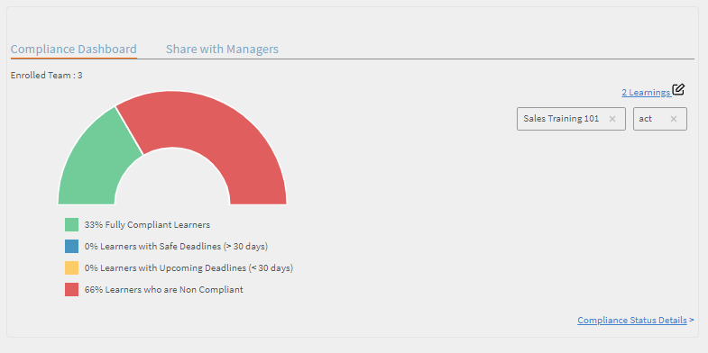

# Rapporter

Skapa och hantera rapporter för chefer.

Med Adobe Learning Manager kan du skapa olika rapporter för att följa, övervaka och kontrollera elevaktiviteter. Elevaktiviteter spåras och hämtas automatiskt till databasen. Chefs- och administratörsrapporter genereras från databasen.

## Översikt {#overview}

Genereringsprocessen för rapporter är densamma för både Administratör och Chef. Chefer kan visa rapporter som motsvarar deras underordnade, medan administratörer kan visa alla rapporter som gäller för hela organisationen.

Rapporter sammanställs i en kontrollpanel. En rapport måste finnas inuti en kontrollpanel. En **standardtavla** finns som standard på sidan Rapporter. Alla rapporter som läggs till av dig placeras på den här standardkontrollpanelen. Om du vill lägga till rapporter i enskilda kontrollpaneler använder du listrutepilen och väljer Lägg till rapport. Mer information om hur du skapar kontrollpaneler finns i avsnittet Kontrollpaneler på den här sidan.

## Chefens instrumentpaneler {#manager-dashboards}

En chef kan visa information om sitt direkta eller indirekta team som en sammanfattning.

Chefen kan sedan filtrera rapporten enligt intervall som kvartal, den här månaden, de senaste tre hela månaderna och de senaste 12 hela månaderna.

## Sammanfattning av utbildning {#learningsummary}

*Visa utbildningssammanfattning*

*Filtrera utbildningssammanfattningen per datum*

## Efterlevnadstavla {#compliancedashboard}

Se teamets efterlevnad och vilken teammedlem som gränsar till bristande efterlevnad. Välj utbildningsobjekt och se status för varje.

*Visa efterlevnadstavla*

## Kompetensstatus {#skillsstatus}

Se procentandelen elever för varje kompetens. Välj högst fem färdigheter som du vill se kunskaperna för elever. Visualiseringen sker i form av ett skiktat stapeldiagram. När du för musen över varje fält kan du se hur statusen för den kompetensen delas upp.

*Visa status för en elevs kompetenser*

## Skils Tracker {#skilstracker}

Se en prognos över slutförda kompetenser i ett team. Välj målslutförandeprocent och datum för en kompetens.

Baserat på historiska data kan du se en grafisk representation av projektet för slutförande av kompetens det valda datumet.

*Visa projektion för slutförande av kompetens*

## Skapa rapporter {#creatingreports}

1. Klicka på Rapporter i den vänstra rutan. Sidan Rapportsammanfattning visas.\
   **Anteckning**
Som standard visas minst tre exempelrapporter på sidan Rapportsammanfattning. Du kan bara visa dessa exempelrapporter för att få en uppfattning om hur du kan skapa och anpassa dem.

1. På sidan Rapportsammanfattning klickar du på Lägg till. Dialogrutan för att skapa rapport visas.
1. Klicka på Spara för att slutföra rapporten. Nedan visas en exempelrapport som referens.

*Dialogrutan Lägg till rapport*

I Rapporttyp kan du välja en fördefinierad uppsättning med rapporter eller välja Anpassad. Du kan visa följande rapporter som en del av de fördefinierade rapporterna:

* Kompetenser som tilldelats och uppnåtts
* Kurs registrerad och slutförd
* Effektivitet på kurser
* Registrerade och slutförda utbildningsprogram
* Använd utbildningstid per kurs
* Använd utbildningstid per kvartal

Du kan använda ovanstående rapporttyper för att generera rapporter om fler än 300 varianter.

Rapportnamn Ange en rubrik för rapporten.

**Primär Y-axel** Välj det första/primära kriteriet för rapporten i listrutan. För vissa av de valda kriterierna kan du välja ett eller flera lägen från listrutan Intilliggande lägen. Till exempel kan delstaterna för ett primärt kriterium för kursregistreringsstatistik vara slutförda, ofullständiga, registrerade och så vidare. Primära intervalldata visas i form av stolpdiagram i rapporten.

**Sekundär Y-axel** Välj kriterier/intervall för den sekundära Y-axeln i rapporten i listrutan. Till exempel, i registreringsalternativet för utbildningsprogram väljer du ett eller flera lägen från rullgardinsmenyn Intilliggande lägen. Sekundära områdesdata representeras i form av linjediagram.

**X-axel** Välj lämpliga x-axelkriterier för din rapport i listrutan. Om x-axeln väljs som datum, finns det ett alternativ för att gruppera x-axelkriteriet efter dag, månad, kvartal och år.

**Datum** Välj lämpligt alternativ i listrutan. Alternativ: senaste månaden, kvartal, år, QTD (senaste 90 dagarna), YTD (senaste 365 dagarna) och datumintervallet. Om du väljer datumintervall anger du Till- och Från-datum på följande sätt:

**Från** Välj startdatumet som du vill att rapporten ska börja från.

**Till** Välj slutdatumet för din rapport.

## Filter {#filters}

Filter visas längst ned i dialogrutan Lägg till rapport baserat på de typer av rapporter som du har valt. Några av de mer framträdande filtren nämns nedan.

**Chef** Du kan välja vilken du vill av cheferna baserat på hierarki. För vissa chefer kan det finnas underordnade chefer och flera anställda som rapporterar till varje underordnad chef.

**Profil** Välj anställningsbeteckning. Det skulle vara till hjälp för att visa rapporter om anställda baserat på deras profil/beteckning. Till exempel datavetare, ingenjör och så vidare.

**Användargrupp** Välj vilken användargrupp du vill filtrera rapporterna från. Learning Manager hämtar användargrupperna som definierats för ditt konto från funktionen Användare.

**Kurs** Du kan filtrera din rapport baserat på valfri kurs genom att välja dem i listrutan.

*Visa diagram över registrerade och slutförda kurser*

>[!NOTE]
>
>Ovanför teckenförklaringen kan du visa en zoomningsruta. Du kan flytta markören över det, klicka och dra tvärsnittet över den del av zoomrutan som du vill zooma in.

Du kan visa de sekundära y-axelvärdena i form av en linje tvärs över diagramstaplarna. I exemplet ovan kan du till exempel se värdena för effektivitet i grå linje tvärs över diagrammet.

## Rapporter om användargrupper {#user-group-reporting}

Spåra hur användargrupper som avdelningar, externa partner och roller presterar i jämförelse med andra användargrupper eller mot andra utbildningsmål.

### Användargrupper {#usergroups}

Om du vill skapa rapporter baserade på användargrupper väljer du **Användargrupp** i X-axeln i listan med rullgardinsmenyalternativ som visas i skärmbilden nedan.

*Generera användargruppsrapporter*

En annan **Välj**-listruta visas bredvid X-axeln med en lista över användargrupper som är tillgängliga för ditt konto. I den här rullgardinsmenyn kan du välja en eller flera användargrupper.

Om du har markerat flera användargrupper när du sparar och genererar den här rapporten, skapas rapporten med alla användargrupper som visas i ett stolpdiagram bredvid varandra längs x-axeln.

Med den här rapporten över användargrupper kan du jämföra prestanda hos en avdelning/roll med den andra för att utvärdera deras utbildningsresultat.

### Anpassade användargrupper/användarattribut {#customusergroupsuserattributes}

Du kan också skapa anpassade användargrupper med funktionen Lägg till användare/användargrupper i Learning Manager. När du har skapat användargrupperna kan du generera rapporter för dessa anpassade användargrupper med hjälp av en lista med attribut som plats, gren och så vidare.

Välj alternativet för användarattribut i X-axeln och välj attributet bredvid det i listrutan **välj**. Om du vill skapa en anpassad användargruppsrapport baserad på dessa attribut måste du också välja lämplig användargrupp i filtret.

Chefer kan endast skapa användargruppsrapporter för sina egna teammedlemmar som elever.

## Typer av rapporter {#typesofreports}

* Statistik för kursleverans för elever
* Effektivitetsrapport för kurser
* Rapport över elevkompetens
* Statistik för registrering i utbildningsprogram för elever
* Utbildningstid som elever lagt ner
* Slutförande av certifiering

## Mina rapporter {#myreports}

En kontrollpanel är en samling rapporter. Rapporter kan grupperas i en kontrollpanel enligt ditt val.

**Exempelrapporter**

Klicka på den här fliken om du vill visa några indikativa rapporter som baseras på exempeldatapunkter. Utforska dessa rapporter och få en uppfattning om olika typer av funktionsrika rapporter som du kan generera med hjälp av dina kontodata.

**Mina rapporter**

Klicka på den här fliken för att se alla tavlor som du har skapat. I listrutan Visa tavla kan du välja standardtavlan eller någon av dina skapade kontrollpaneler.

**Lägg till tavla**

1. Klicka på Lägg till tavla till höger på sidan för att börja skapa egna tavlor.

   

   *Skapa en egen tavla*

1. Ange namnet på och beskrivningen av instrumentpanelen och klicka på **[!UICONTROL Save]**.

Du kan visa den nyligen skapade tavlan i listan Mina kontrollpaneler.

Om du vill lägga till rapporter på tavlan klickar du på listrutan i det övre högra hörnet av tavlan och klickar på Lägg till rapport. Rapporten som du skapar på det här sättet är kopplad till din kontrollpanel.

>[!NOTE]
>
>Rapporterna som du skapar genom att klicka på Lägg till längst upp till höger på sidan Rapporter läggs till i standardkontrollpanelen.

**Delade rapporter**

Delade rapporter är en samling rapporter som har delats med dig av andra användare i organisationen. Om du har behörigheterna kan du hämta eller duplicera de delade rapporterna. Kontakta organisationens administratör för att få hämtnings-/dupliceringsbehörighet till de delade rapporterna.

**Prenumererade på rapporter**

Du kan prenumerera på dina favoritrapporter genom att ange ditt e-post-ID här. Dina prenumerationsrapporter skickas till dig via e-post.

Klicka på ikonen **Redigera** i det högra hörnet av rapportnamnet i listan Rapporter om du vill ändra din prenumeration när som helst.

## Visa rapporter {#viewingreports}

På sidan Rapportsammanfattning kan du visa alla rapporter. Du kan minimera varje rapport genom att klicka på minusikonen (-) längst upp till höger i varje rapport. Klicka på +-ikonen för att visa din rapport igen.

**Snabbvy med olika datum**

Datumvärdena som du använder för att visa rapporten är tillfälliga. Den här vyn av rapporten hämtas inte när du väljer hämtningsalternativet. Det här är bara en tillfällig vy.

Du kan ändra datumintervallet/värdet för en rapport och visa snabbt för olika datum utan att ändra och spara rapporten. Klicka på redigeringsikonen (som visas med en pil i ögonblicksbilden nedan) bredvid datumintervallet, t.ex. QTD, senaste året och så vidare. Välj det nya värdet i listrutan och klicka på bockmarkeringen för att bekräfta ändringen. Du kan avbryta ändringen genom att klicka på X-markeringen.

**Snabbvy med olika chefer**

Om det finns flera chefer som rapporterar till dig kan du visa rapporterna snabbt för varje chef. Välj chefens namn i listrutan för att visa en unik rapport för varje chef.
**Redigera/flytta till tavla/skapa en kopia/ta bort/ändra storlek på rapporter** Klicka på rullgardinspilen i det övre högra hörnet av varje rapport för att visa rullgardinsmenyalternativ som Redigera/Flytta till tavla/Skapa en kopia/Ta bort/Ändra storlek.

<!---->

**Redigera** Klicka på Återställ om du vill gå tillbaka till de ursprungliga värdena när du ändrar data. Klicka på Spara när du har ändrat värdena.

**Flytta till kontrollpanelen** Du kan flytta den aktuella rapporten till en annan kontrollpanel, som väljs i listan över kontrollpaneler.

**Skapa en kopia** Du kan kopiera rapporten till samma eller en annan tavla, som väljs i listan över tavlor.

**Ta bort** Klicka på Ta bort för att ta bort rapporten. Ett varningsmeddelande/bekräftelsemeddelande visas innan du kan ta bort rapporten.

**Ändra storlek** Du kan ändra storlek på dina rapporter i storlekarna 1×1 (medel) och 2×2 (stor).

## E-postprenumerationer {#emailsubscriptions}

Du kan få dina favoritrapporter via e-post genom att prenumerera på dem.

På sidan Rapporter klickar du på knappen Lägg till i det övre högra hörnet på sidan E-postprenumeration. Sidan Rapportprenumeration visas.

Börja skriva rapportnamnet i fältet Rapporter för att välja rapportnamnet i listrutan. Välj hur ofta du vill att e-postmeddelanden ska skickas per dag, vecka eller månad. Lägg till e-postmeddelandets ämne och prenumerera genom att klicka på Lägg till.

Klicka på Redigera för att ändra prenumerationen. Radera prenumerationen genom att klicka på Ta bort.
