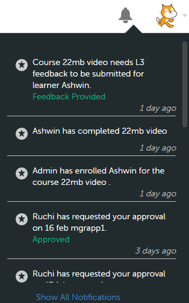

# Användarmeddelanden

Konfigurera användarmeddelanden för chefer.

Meddelandefunktionen gäller alla användare av Adobe Learning Manager 1.0. Men varje användare baserat på sin roll får olika typer av meddelanden i olika scenarier. Alla aviseringar och meddelanden till användare visas i popup-dialogrutan Aviseringar.

## Åtkomstmeddelanden {#accessnotifications}

Användare kan se meddelanden genom att klicka på aviseringsikonen i det övre högra hörnet av fönstret. Vid chefsinloggning kan du även klicka på Aviseringar i den vänstra rutan för att komma åt dessa aviseringar.

Ögonblicksbild av meddelanden i exempelhanteraren:

*Visa alla meddelanden*

Det här popup-fönstret visar markeringar av alla meddelanden tillsammans med tidpunkten för förekomsten med en rullningslist. Om du vill visa mer information om alla meddelanden klickar du på Visa alla meddelanden längst ned i popup-fönstret. Sidan Meddelanden visas.

En chef kan se väntande uppgifter och alla meddelanden i flikform på aviseringssidan. Meddelanden om väntande uppgifter kategoriseras baserat på godkännanden, nomineringar och så vidare. Om du vill visa alla meddelanden klickar du på **[!UICONTROL All Notifications]** -fliken. På fliken Alla meddelanden sorteras meddelandena efter datum och tid och visas.

*Visa alla väntande uppgifter*

Du kan få reda på antalet senaste meddelanden med det markerade numret högst upp på aviseringsikonen. Om det till exempel finns fem senaste meddelanden efter din föregående inloggning, kan du se att siffran fem visas ovanpå aviseringsikonen. Dessa siffror försvinner när du läser alla de senaste meddelandena.

## Nominera elever till kurser {#nominatelearnersforcourses}

I aviseringsfönstret, som visas i ögonblicksbilden ovan, klickar du på länken Nominera. En popup-dialogruta visas. Klicka på Nominera.

*Nominera elever till kurser*

**Typer av meddelanden för chefer**

Chefer kan få aviseringar när följande händelser utlöses:

1. En elev registrerar sig för en kurs eller ett utbildningsprogram
1. En elev slutför en kurs eller ett utbildningsprogram
1. En administratör registrerar en elev till en kurs eller ett utbildningsprogram
1. En chef krävs för att ge L3-feedback till eleven
1. En chef krävs för att nominera elever till en kurs
1. En chef krävs för att godkänna en elev för en kurs.
1. En chef krävs för att godkänna det certifieringsbevisdokument som laddats upp av eleven
1. En elev slutför inte kursen efter deadline. (Den här händelsen utlöses endast när aviseringspåminnelsen för kursinstansen är inställd på eskaleringsnivån till elevens chef)

>[!NOTE]
>
>Chefer kan också få meddelanden när de spelar rollen som en elev. Se elevmeddelanden för mer information.

## Ge feedback {#providefeedback}

Som visas i skärmbilden ovan kan chefer klicka på Ge feedback för att ge L3-feedback till elever i varje kurs eller utbildningsprogram.

>[!NOTE]
>
>Elever och chefer kan bara få feedback på kurser när en administratör aktiverar det för en viss kurs.
