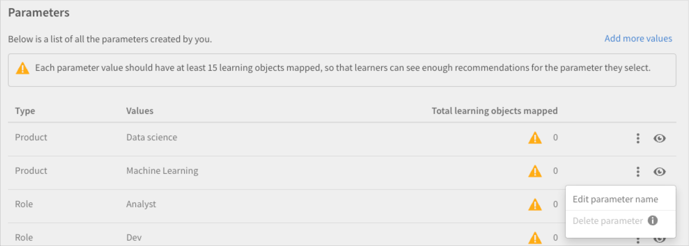

# Recommendations i Adobe Learning Manager

Adobe Learning Manager har infört ett nytt och moderniserat rekommendationssystem för kurser. Den här rekommendationsfunktionen använder AI-algoritmer och användares intressen som Produkter, Roller och Nivåer för att ge personliga innehållsrekommendationer.

Med det nya rekommendationssystemet kan du skapa anpassade parametrar som elever kan välja för att få personliga rekommendationer. Rekommendationerna visas som kurser, utbildningsvägar och certifieringar för elever i flödet på deras startsida.

Du måste aktivera funktionen i Admin-appen för att komma igång med den här funktionen.

## Aktivera och konfigurera rekommendationerna

1. Ladda upp kursen och användardata (valfritt).
1. Gör ändringarna live.
1. När du har aktiverat och konfigurerat rekommendationerna överför du dem till Adobe Learning Manager för rekommendationer om hur du kan börja arbeta. Dessa data består av:

   * Kursdata
   * Användardata (valfritt)

## Kursrankningsalgoritm

Kärnan i rekommendationsmotorn drivs av Learning Managers nya **[!UICONTROL Course Ranking Algorithm]**. Algoritmen använder 50 miljoner datapunkter och fem års aggregerade utbildningsdata för miljontals användare för att rangordna kurser baserat på deras sannolikhet för registrering. Denna rankning säkerställer att de flesta registrerbara kurser visas i förväg för eleverna.

## Nyckeltermer

Learning Managers nya AI-baserade rekommendationsmotor ger inlärningsledare ett konfigurerbart parameterbaserat rekommendationssystem för att skapa en personlig upplevelse för elever.

Parametrarna är - **Produkter/ämnen**, **Roller** och **Nivåer**. Dessutom kan parametrarna ändras för att passa dina behov. Så &quot;produkter&quot; kan bli &quot;ämnen&quot; eller &quot;roller&quot; kan bli &quot;regioner&quot;.

## Konfigurera rekommendationssystemet

Den nya rekommendationsmotorn i Adobe Learning Manager förenklar det administrationsarbetsflöde som krävs för att ställa in anpassade rekommendationer, eftersom data om produkter och roller som är kopplade till en kund/partner vanligtvis är tillgängliga för administratörer (till exempel från inköpsposter).

Det finns främst tre arbetsflöden som är involverade i konfigurationen av den nya rekommendationsmotorn:

* Admin
* Författare
* Elev

Administratörer konfigurerar kontots parametrar för Produkter, Roller och Nivåer. Till exempel kan en IT-lösningsleverantör med banker som primär kundbas konfigurera parametern &quot;Produkt&quot; så att den har värden som Payment Gateway, Secure Cloud Storage, Fraud Detection System, Trading Platform osv., och parametern &quot;Roll&quot; så att den har värden som integrationsspecialist, nätverksadministratör, riskanalytiker, efterlevnadsansvarig osv.

Administratörer får ett guidat arbetsflöde i Learning Manager för att optimalt konfigurera rekommendationsmotorn och anpassa motorn utifrån kontots användningsfall. Dessutom kan administratörer även välja att konfigurera PRL-rekommendationer via en engångsuppladdning av en CSV-fil.

1. Välj **[!UICONTROL Recommendations]** i Admin-appen.

   

   *Markera alternativet Recommendations*

1. Klicka på **[!UICONTROL Upgrade]**.

   

   *Välj alternativet Uppgradera*

1. Klicka **[!UICONTROL Proceed]** för att uppgradera till det nya rekommendationssystemet.

   
   *Välj knappen Fortsätt*

1. Skapa rekommendationsparametrar för Produkter och Roller.

   
   *Skapa parametrar för rekommendation*

1. Klicka på **[!UICONTROL Add more values]**.
1. Lägg till produkterna. Skriv namnet på en produkt och tryck på Enter.

   Du måste lägga till minst två produkter för att komma igång med.

   
   *Lägg till produkter*

1. Lägg till rollerna. Skriv rollernas namn och tryck på Retur.

   
   *Lägg till rollerna*

1. Klicka på **[!UICONTROL Continue]**.

   Produkterna och rollerna finns nu i listan över parametrar.

   
   *Lista över produkter och roller*

## Dataförberedelser

Användarens intressedata, produkt, roller och nivåer måste överföras för att rekommendationerna ska fungera korrekt.

**Alternativ för att överföra data**

Funktionen för rekommendationer kan konfigureras. I stället för produkter/roller/nivåer kan du alltså använda ämnen/roller/nivå eller välja något av dessa alternativ: endast produkter/ämnen, endast roller, endast produkter/ämnen och roller, endast roller-nivåer eller endast produktnivåer.

Ändra databladen enligt den rekommenderade konfiguration du väljer.

I följande avsnitt förklaras det mest omfattande alternativet att använda produkt, roller och nivåer.

Administratören måste överföra användardata i ett på förhand bestämt format. De överförda uppgifterna matas sedan in i rekommendationsalgoritmen, så att en elev får rekommendationer för rätt kurser baserat på roll och nivå.

**Förutsättningar**

Om du vill överföra data för rekommendationerna så att de fungerar fyller du i Produkter, Roller och Nivåer i CSV-filerna Användare och RecommendationsLO.

Som en del av dataförberedelseövningen tillhandahåller vi två CSV-mallar:

**RecUser.csv**

* Användar-id
* Produkter
* Roller
* Nivåer (Nybörjare, Mellannivå eller Avancerad)

Nedan följer ett exempel på poster i CSV-filen:

| Användar-id | Produkter | Roller | Nivåer |
|--- |--- |--- |--- |
| 123 | Datavetenskap | Analytiker | Analytiker: Medelkunniga |
| 456 | Aerospace Engg | Tekniker | Tekniker: Avancerat |

**RecLO.csv**

* Utbildning
* Utbildningstyp
* Utbildningsnamn
* Produkter
* Roller
* Nivåer
* Taggar
* Kompetenser

Nedan följer ett exempel på poster i CSV-filen:

| Utbildnings-ID | Utbildningstyp | Utbildningsnamn | Produkter | Roller | Nivåer | Taggar | Kompetenser |
|---|---|---|---|---|---|---|---|
| 111 | KURS | Python 101 | Datavetenskap | Analytiker | Analytiker: Medelkunniga | data | Allmänt |
| 222 | KURS | Julia 101 | Datavetenskap | Analytiker | Analytiker: avancerad | data | Allmänt |

Fyll i dessa CSV-filer och kontakta ditt kundframgångsteam för att hämta formaten och överföra dessa CSV-filer.

## Se till att rekommendationerna sänds live

När båda CSV-filerna har överförts klickar du på Go live. Detta kommer att göra det nya rekommendationssystemet synligt för eleverna.

*Se till att rekommendationerna sänds live*

Rekommendationssystemet är nu tillgängligt för dina elever.

## Redigera en parameter

1. I listan med parametrar väljer du ikonen med tre punkter och väljer **[!UICONTROL Edit parameter name]**.

   

1. Ändra namnet på parametern och klicka på **[!UICONTROL Save]**.

   
   *Redigera parametern*

## Ta bort en parameter

1. I listan med parametrar väljer du ikonen med tre punkter och väljer **[!UICONTROL Delete parameter]**.

*Ta bort parametern*

## Sidan Kursinställningar

På inställningssidan för en kurs visas rekommendationerna för Produkter och Roller. Elever kommer att rekommenderas denna kurs om de har uttryckt intresse för dessa Produkter och Roller.

*Sidan Kursinställningar*

## Elevvy

För ett konto med PRL-baserade rekommendationer konfigurerade, när en elev loggar in på utbildningsplattformen, kan ett guidat arbetsflöde hjälpa eleven att ställa in rekommendationer baserat på hans/hennes produkt, roll och nivåinställningar. Detta skapar elevprofilen för rekommendationsmotorn som ska analyseras.

Elever på konton som har bytt till det nya rekommendationssystemet kan se de rekommenderade kurserna och utbildningarna.

Eleverna kan se detta:

* Produkter, roller - nivåer: Elever uppmanas att välja Produkter först, Roller och sedan Nivåer för varje vald roll
* Produkt - nivåer: Elever uppmanas att välja Produkter först och sedan Nivåer för var och en av de valda produkterna
* Roller - nivåer: Eleverna uppmanas att välja Roller först och sedan Nivåer för varje vald roll.
* Produkter och roller: Elever uppmanas att välja Produkter först och sedan Roller.
* Produkter: Eleverna uppmanas att bara välja produkter.
* Roller: Eleverna uppmanas att endast välja roller.

När Recommendations har valts i den vänstra panelen ser eleven ett popup-fönster för att ställa in rekommendationerna.

*Eleven ställer in rekommendationen*

När du klickar på Konfigurera Recommendations kommer eleven till popup-fönstret för produktval.

*Välj produkter*

Sedan kan eleven välja rollen i nästa popup-fönster.

*Välj roller*

Eleven kan sedan lägga till nivåerna.

*Välj nivåer*

## Utbildningsremsor i elevappen

En elev kan se följande strimlor i appen:

* Min utbildningsremsa
* Remsa med kalender, sociala medier och spelifiering widget
* Sparad av mig-remsa
* Superrelevant remsa
* Produktremsa - 1
* Produktremsa - 2
* Identifieringsband
* Rekommenderad remsa för admin
* Bläddra efter katalogremsa

### Kort på min utbildningsremsa

*Kort på utbildningsremsa*

Varje kort har Gradering, Kortbild, Titel, Kompetens, Publiceringsdatum, Författare, Varaktighet, Förloppsindikator och knappen Fortsätt eller Utforska.

### Kort på sparade av mig-remsa

*Sparade kort*

Varje kort har betyg, kortbild, titel, kompetens, publiceringsdatum, författare, varaktighet, förloppsindikator och knappen Starta eller Utforska eller Fortsätt eller Besök igen.

Det finns ingen förloppsindikator på kortet efter att en elev startat kursen. En elev kan också Ångra sparandet av kursen.

### Kort på super relevant remsa

*Relevanta kort*

Varje kort har betyg, kortbild, titel, kompetens, publiceringsdatum, författare, varaktighet, förloppsindikator och knappen Starta eller Utforska eller Fortsätt eller Besök igen.

Det finns ingen förloppsindikator på kortet efter att en elev startat kursen.

På menyn finns det två alternativ, **[!UICONTROL Save]** och **[!UICONTROL Don't recommend this]**. Om eleven klickar **[!UICONTROL Save]**, kursen sparas i remsan &quot;Sparat av mig&quot;. Om eleven klickar **[!UICONTROL Don't recommend this]** tas den rekommenderade utbildningen bort från listan.
