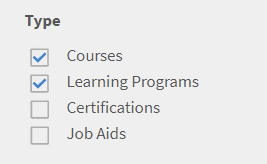

# Versionsinformation om Adobe Learning Manager

<!--<table>
 <tbody>
  <tr>
   <td></td>
   <td>
    
<a href="https://business.adobe.com/products/learning-manager/adobe-learning-manager.html">Adobe Learning Manager</a> was launched in August 2015. As part of our continuous improvement efforts to enhance the product, we have been rolling out regular updates. Read on to know the features enhanced/issues fixed in update releases. 
</td>
  </tr>
 </tbody>
</table>-->

+++Uppdatering 96: Mars 2024-versionen av Adobe Learning Manager

**Utgivningsdatum:** 16 mars 2024

## Nyheter i den här versionen

Visa [Nyheter i Adobe Learning Manager](/help/migrated/whats-new.md) för mer information.
+++

+++Uppdatering 95: November 2023-versionen av Adobe Learning Manager

**Utgivningsdatum:** 18 november 2023

## Nyheter i den här versionen

Visa [Nyheter i Adobe Learning Manager](https://experienceleague.adobe.com/en/docs/learning-manager/using/introduction/whats-new-november-2023) för mer information.
+++

+++Uppdatering 94

**Utgivningsdatum:** 23 augusti 2023

## Nyheter i den här uppdateringen

* Välj spelarens kugghjulsikon för att ändra kvaliteten på videon.
* Ändra kvalitet och hastighet för en video på sociala medier.
+++

+++Uppdatering 93: Juli 2023-versionen av Adobe Learning Manager

**Utgivningsdatum:** 10 juli 2023

Nyheter i den här versionen

### Förbättrat Recommendations

Adobe Learning Manager har infört ett nytt och moderniserat rekommendationssystem för kurser. Den här rekommendationsfunktionen använder AI-algoritmer och användares intressen som Produkter, Roller och Nivåer för att ge personliga innehållsrekommendationer.

### Flera registreringar

I den här versionen av Adobe Learning Manager introducerar vi flerregistrering för elever som gör att de kan registrera sig för mer än en instans av en kurs vid en eller flera tidsperioder.

### Borttagning av Exavault-anslutning

Denna version av Adobe Learning Manager kommer att innehålla en ny anslutning som kommer att använda AWS Transfer familjs SFTP-protokoll.

Mer information finns i [Nyheter i juli 2023-versionen av Adobe Learning Manager](/help/migrated/whats-new-2023-july.md).
+++

+++Uppdatering: 92

**Utgivningsdatum:** 23 juni 2023

**Fel som är åtgärdade i den här uppdateringen**

* När du har slutfört en modul utlöses inte Grade API automatiskt, vilket resulterar i att den gröna bockmarkeringen inte visas som förväntat i användargränssnittet.
* När du har slutfört några moduler på en utbildningsväg eller ett certifikat visas inte den gröna bockmarkeringen som indikerar att slutförandet lyckades som förväntat.
* Adobe Learning Manager startar inte som förväntat efter att en användar-CSV med felaktiga fält har laddats upp.
* Ett varningsmeddelande om hur du kontaktar administratören visar också andra e-postadresser.
* Alla utmärkelsetecken som en elev tjänat in visas inte i svaret.
* Under användarregistreringen måste ett användarnamn med &quot; &quot; accepteras.

#### Spelare

* Lägg till en meny för att välja skärmupplösning när du spelar upp en video.
+++

+++Uppdatering 91

**Utgivningsdatum:** 1 juni 2023

### Anslutningar

* Adobe Connect-kopplingen kräver API:er för att skicka CSRF-token. Mer information finns i Förbättra Adobe Connect-kontosäkerhet.

### Strängändring

* Vi har bytt namn på strängen Ranka denna utbildning för att Ranka denna kurs, Ranka denna utbildningsväg eller Ranka denna certifiering, baserat på den utbildning en elev tar. Beroende på typ av utbildning ser en elev strängen därefter.

### Fel som är åtgärdade i den här uppdateringen

* Play Butikens mobilappsbeskrivning Adobe Learning Manager säger felaktigt att en elev kan koppla från en kurs.
* Det uppstod problem när du migrerade innehåll (module_version.csv och course_module.csv) från LinkedIn till Adobe Learning Manager.
* Om ett konto är i inaktivt läge och skapades för mer än tre år sedan, tas alla användare av kontot bort med GDPR oavsett användarstatus.
* När du ställer in väntelistegränsen på noll i en session i instruktörsappen och sparar sessionen visar användargränssnittet felaktigt Inte tillämpligt i stället för noll.
* När elevens betygsutdrag genereras för Power BI-kopplingen visas null-värden för vissa klassrums- eller VC-moduler i kolumnen Utbildnings- eller modulvaraktighet (min).
* När du har markerat en kurs som slutförd för elever i en instans eller flera instanser markeras alla elever i kursen som slutförda, inte bara eleverna i den aktuella instansen eller instanserna.
+++

+++Uppdatering 90

**Utgivningsdatum:** 04 april 2023

### Fel som har åtgärdats i den här uppdateringen

SAML-inloggning misslyckas om SSO-inloggnings-URL:en innehåller entity_id.
+++

+++Uppdatering 89: Mars 2023-versionen av Adobe Learning Manager

**Utgivningsdatum:** 01 april 2023

### Nyheter i den här uppdateringen

**Förbättringar av lärarledd utbildning (ILT)**

Flera förbättringar har gjorts av lärarledd utbildning (ILT). Viktiga förbättringar: möjlighet att filtrera klassrumssessioner baserat på plats, möjlighet att växla instanser (VILT) utan att förlora framsteg, en ny &quot;schemaläggningsassistent&quot; för att hantera konflikter vid bokning av instruktörer och klassrum, möjlighet att bifoga &quot;Kompetenser&quot; till instruktörer och välja instruktörer baserat på kunskaper.

**Förbättringar av checklistan för observationer**:

Författare kan nu välja &quot;Manager&quot; och &quot;Store Manager&quot; som observatör för checklistor. Chefer kan visa och slutföra checklistorna i chefsgränssnittet utan att behöva växla roll till en instruktör. Ett meddelande skickas till en chef när en checklista har tilldelats honom/henne.

**Använd valfri app/smartphone-kamera för att skanna QR-koder i Learning Manager**

Elever kan nu använda valfri QR-kodskanningsapp eller sin smartphone-kamera för att skanna de QR-koder som genereras av Learning Manager för registrering av kurser, slutförande och mycket mer.

**Förbättrade rapporter**

En ny rapport över instruktörsutnyttjande, rapport över utbildningsomgångar, rapport över arbetsstöd och andra rapporteringsförbättringar.

**Stöd för hybridsessioner**

Adobe Learning Manager stöder nu möjligheten att skapa hybridsessioner med handledarledd utbildning (ILT). Virtuella ILT-sessioner kan skapas med valfri platsinformation så att elever kan närvara vid sessionen personligen även om de är tillgängliga på platsen.

**Bättre framstegsspårning för klassrums- och virtuell ILT**

Klassrums- och virtuella ILT-moduler ger nu möjlighet att rapportera en elevs quiz-status (godkänt eller underkänt) tillsammans med närvarostatusen. Därför kan både närvaro och frågesportframgång övervägas för att avgöra elevens framsteg.

**Adobe Learning Manager-app för Microsoft Teams**

Den nya Adobe Learning Manager-appen på Microsoft Teams är utformad för att främja lärande i arbetsflödet och öka inlärningen i samhället. Elever kommer att kunna komma åt utbildningsinnehåll inom plattformen Microsoft Teams utan att behöva växla till en webbläsare. Kontakta din CSAM för betaversionen av Adobe Learning Manager-programmet på MS Teams.

### Fel som är åtgärdade i den här uppdateringen

**Kurs**

* En anpassad författare kan inte förhandsgranska en modul när kursen är i läget &quot;UNDER_CONSTRUCTION&quot;. Svaret visar felkod 404.
* Kurstiteln på kursen/lägg till-sidan i en skaparapp flödar över när kurstiteln överskrider en viss teckengräns.

**Författare**

* I appen Författare överskrider titeln på kursen (om den är lång) sidgränserna när en kurs skapas.
* Ibland läggs en kurs till, även om ingen författare har valts.

**Rapporter för kontrollpanelen**

* Verktygstips visas som bra när gränssnittsspråket är engelska, men ger ett konsolfel när gränssnittsspråket är annorlunda.
* Byt namn på &quot;Obligatoriskt&quot; till &quot;Obligatoriskt&quot; i elevtavlan.

**Instruktörsapp**

* Tidsformatet i instruktörsappen är inte konsekvent med de andra apparna.

**Social**

* För vissa typer av inlägg öppnas inte socialnämnden som förväntat efter utannonsering.

**Administratör**

* En användare med en anpassad roll kan inte hämta resurser när en kurs förhandsgranskas.

**E-postmallar**

* När en elev avregistrerar sig från ett utbildningsprogram som innehåller en klassrums-/VC-kurs får han/hon inget e-postmeddelande om uppsägning.

**Arbetsstöd**

* Namnet på kursen visas inte i widgeten Arbetsstöd.

**Förlagsverksamhet**

* Modulbeskrivningen som lagts till i Adobe Captivate visas inte i Learning Manager när modulen publiceras i ALM.

**Aktiva fält**

* När en CSV-fil med ett stort antal poster bearbetas tar det lång tid, och om en användare loggar in och anger ett värde för ett av attributen kan det leda till att en ny användargrupp skapas som kan resultera i CSV-fel. Det åtgärdas genom att popup-meddelandet Aktiva fält-attribut inaktiveras när CSV-importen pågår och återaktiveras när CSV-överföringen är klar.
* Om kolumnen i csv-filen för användare har samma namn som det aktiva fältet externa användare misslyckas överföringen av csv-filen.

**API-relaterade korrigeringar**

* I svaret learningObjects saknas bokmärkesattributet.
* En åtkomstpost skapas när en OAuth-uppdateringstoken genereras för borttagna användare.
* LO API returnerar felaktigt loFormat, eftersom förarbetsmoduler övervägdes för att beräkna kurstypen tillsammans med kärninnehållet.

**Kända problem i den här uppdateringen**

* Knappen Dela i elevkatalogen fungerar inte som förväntat på Safari-webbläsaren, mobilappen och iPad MS Teams-appen.
* Meddelanden visas inte på fliken Aktivitet när programmet har tagits bort från andra datorer.
Ingenting händer när du klickar på aviseringarna på fliken Aktivitet i programmet på iPhone 14.
* I MS Teams-programmet visar Learning Manager-meddelanden (slutförda, registrerade, deadline och försenade) inte kursens status och namn på fliken Aktivitet.
* Ett popup-fönster med XML-innehåll visas när integreringsadministratören inte godkänner MS Teams-programmet.
* Användargränssnittsspråket i Adobe Learning Manager-programmet på MS Teams ändras ibland inte som förväntat när språket ändras.
* Du kan inte interagera med det första meddelandet när fokus är inom iFrame (flikarna Hem och Katalog).

**Begränsningar med Adobe Learning Manager-mobilappen**

* Visa offlineinnehåll.
* Rutnäts-/listvy på sidan Katalog/Min utbildning.
* Flera försök att ta en kurs.
* Deadline för registrering på ett kurskort.
* På iOS-enheter visas inte push-aviseringar när appen finns i förgrunden.
* Djupa länkar i push-meddelanden omdirigeras inte till den avsedda landningssidan.
* Klicka på Registrera intresse knappen kommer att omdirigeras till webben.
* Du kommer inte att kunna bifoga en fil när du svarar eller kommenterar i Social utbildning.
* Du kan inte logga in på LinkedIn Learning.
+++

+++Uppdatering 88

**Utgivningsdatum:** 7 mars 2023

### Prestandaförbättringar i den här versionen

När en massregistrering av elever utförs kommer det inte att skapas någon loggfil för varje elev.
Vi har optimerat bearbetningen av utbildningsplaner för stora konton. Genom att göra detta undviker du eventuella sökproblem eller fördröjningar.
+++

+++Uppdatering 87

**Utgivningsdatum:** 1 mars 2023

## Fel som har åtgärdats i den här uppdateringen

* En elev får inte e-postmeddelandet om annullering av session om CR/VC-modulen tas bort från den registrerade kursen.
* Ändra GetNotificationData från GET till POST. Felet uppstod i det ursprungliga genomförandet. **IllegalArgumentException: huvudet för begäran är för stort**, som ledde till misslyckade aviseringar.
+++

+++Uppdatering: 86

**Utgivningsdatum:** 17 februari 2023

### Fel åtgärdat i den här versionen

I elevappen misslyckas sökningen efter användare och användargrupper på grund av vissa problem med språkinställningarna.
+++

+++Uppdatering 85

**Utgivningsdatum:** 13 februari 2023

### Vad har ändrats i den här uppdateringen

Lade till stöd för språkkod med fyra bokstäver medan du filtrerar språk i GET LearningManagerapi/v2/learningObjects.

### Fel som har åtgärdats i den här uppdateringen

För vissa språk returnerar sökningen felaktiga resultat.
Kursmetadata skrivs över när kursen har mer än en variant av samma språkinställning.
+++

+++Uppdatering 84

**Utgivningsdatum:** 2 februari 2023

### Vad har ändrats i den här uppdateringen

**Arbetsstödsrapport**

Den här uppdateringen innehåller en ny arbetsstödsrapport som listar alla arbetsstöd på kontot.

**Versionskontroll**

Vi har lagt till versionskontroll för resurser när vi lägger till resurser när vi skapar en kurs.

**Rapport över försök**

Du kan visa en rapport över alla återförsök och återbesök av en elev för varje utbildning.

**API för modulåterställning**

En administratör kan nu återställa en modul med hjälp av API:et för modulåterställning. Mer information finns i [API-referens för Adobe Learning Manager](https://captivateprime.adobe.com/docs/primeapi/v2/).

**E-postmall**

För några e-postmallar kan du nu lägga till en förutsättning i mallen.

**Andra ändringar**

* Du kan lägga till en chefsgodkänd kurs som en förutsättning.
* Prestandaförbättring vid uppdatering av instrumentpanelen Utbildningssammanfattning.
* E-post-ID:n och konto-ID:n verifieras innan en studsrapport skickas.

### FEL SOM HAR ÅTGÄRDATS I DEN HÄR UPPDATERINGEN

* Dubbletter av författarnamn visas på sidan Kursöversikt.
* En hyperlänk på sidan för att skapa kontot ledde till fel 404.
* Den tjeckiska versionen återspeglade inte det som förväntat i spelarinställningarna.
* I vissa fall visas kompetenser som odefinierade för pågående och inte påbörjade elever.
* Tid som tillbringas över flera dagar visar olika mycket tid i elevens betygsutdrag och registreringsrapporter.
* Knappen Tillbaka svarar inte för administratörs- och chefsprofiler i Kurs > L2 quizpoäng > Efter fråga-fliken respektive Närvaro och poäng.
* För några språk saknas en del innehåll i e-postmeddelandet i en e-postmall och språköversättningen i mallen är inte konsekvent.
+++

+++Uppdatering 83

**Utgivningsdatum:** 18 januari 2023

### Vad har ändrats i den här uppdateringen

**Ny kolumn**

en ny kolumn, **unenrollmentAllowed**, har lagts till i course.xlsx. Hämta filen från den här handboken.

**LinkedIn-utbildningskontakt**

För Länkad i utbildningskontakt finns en ny kryssruta som introduceras där eleven kan avregistrera sig på sidan Filter. Mer information finns i [LinkedIn Learning Connector](/help/migrated/integration-admin/feature-summary/connectors.md).

### Fel som har åtgärdats i den här uppdateringen

* Om du håller muspekaren över ett stapeldiagram visas instrumentpanelens rapportverktygstips som förväntat.
* I Rapporter under Användaraktivitet visar rapporten Använd utbildningstid felaktiga data för dagliga/månatliga data.
* I vissa fall visar quiz-poängdiagrammet felaktiga värden.
* I en kurs med SCORM-innehåll med flera försök inställda är knappen Återbesök inaktiverad när en elev försöker genomföra kursen.
* I vissa fall levereras e-postmeddelandet efter att ha registrerat en elev på en kurs och hämtat en granskningslogg för e-post, men det visas inte i loggen.
* Kalenderinbjudan till en instruktör måste innehålla textinstruktören i ämnet.
* Ikonen för utbildningskortet visas inte på relaterade kursrekommendationer och kort för utbildningsväg som finns på sidan för kursöversikten.
* Lägg till avsnittet Sparat av mig på elevens startsida inställningar.
* För vissa konton uppmanas en användare att logga in SSO på ett konto där ett Adobe-ID krävs.
* I tidszoner med sommartid beräknas fältet &#39;start_time&#39; baserat på tidsskillnaden för närvarande, inte baserat på tidsskillnaden i det faktiska startdatumet och starttiden. Detta orsakade inbjudningar med felaktiga tider.
* När certifieringen återkommer skapas en kopia av de underliggande kurserna internt i databasen. Dessa kurser visas sedan i sökrutan, i motsats till det förväntade beteendet.
* När överföringen av en CSV-fil misslyckas får du ingen e-postavisering.
* Om namnen på de aktiva fälten är långa försvinner namnen när du drar och släpper dem. Därefter fungerar inte knappen Spara som förväntat.
* En sessionsrapport exporteras inte via en kursnärvaro och poängsida om den första användaren i rapporten har en post i aktivitetsgraderingstabellen med kommentaren som null.
* När du använder administratörskontot för att hämta märkena kan du sortera listan som förväntat. Men när du utför samma sak för en elev sorteras inte resultaten.
* Om du väljer en kurs från dina sökresultat och sedan försöker gå tillbaka till sökresultaten med hjälp av knappen Tillbaka försvinner sökresultaten.
* Alla användare läggs inte till i en användargrupp som instruktörer i en session.
* Mallar som har flera användarmallar åsidosätts med vissa värden.
+++

+++Uppdatering 82

**Utgivningsdatum:** 15 december 2022

* GET LO API innehåller nu prisinformation, om den är tillgänglig.
* En ny kolumn, Slutförd av, läggs till i LT-rapporter. Detta hjälper administratören att identifiera slutförandekällan för en LO.
* Vi har lagt till en ny ILT-modul som kan registrera elevens status godkänt/underkänt tillsammans med närvaro. Instruktörer kan nu markera en elev som närvarad med godkänt eller närvarat med icke godkänt.
* En administratör kan nu kräva att elever slutför och klarar sig innan de utför nästa modul/kurs. Detta gäller för förkunskapskrav, beställda kurser och LP-nummer.

**Felkorrigeringar**

* Bahasa språk frågor av uppslukande mobil upplevelse på sidofältet och sidfoten.
* Integrerande vykorrigeringar som är relaterade till modulförhandsgranskning.
* En kurssökning på admin och författare returnerar resultat på en annan plats än den angivna.
* Ändringar av välkomstmallar för e-post sparades inte efter redigering.
* Användare med olika e-post-ID:n och Adobe ID:n kunde inte logga in på mobilappen.
* Användare identifierades felaktigt när de gick med i Zoom/BJ VC-sessioner.
+++

+++Uppdatering 81 - november 2022-versionen av Adobe Learning Manager

**Utgivningsdatum:** 05 november 2022

**Obs!** I den här versionen av Adobe Learning Manager kan användare med inaktiva konton inte längre komma åt sina konton via underdomäner. Du kommer åt kontona med hjälp av konto-ID:t eller genom att använda sidan acapindex.html och ange e-post-ID:t.

### Nyheter i den här versionen

November 2022-versionen av Adobe Learning Manager består av följande:

* Konfiguration av flera SSO
* Stöd för funktioner som inte är inloggade
* Förbättringar av sidan Utbildningsöversikt
* Anpassning av spelare
* Personifiering av elev och chef

Mer information finns i [Nyheter i november 2022-versionen av Adobe Learning Manager](/help/migrated/whats-new-2022-november.md).

**Obs!** Med november 2022-versionen av Adobe Learning Manager kommer Zoom att fasas ut [JWT-autentisering senast juni 2023](https://marketplace.zoom.us/docs/guides/auth/jwt/). Zoomanslutningen med JWT fortsätter därför att fungera till det angivna datumet, men vi rekommenderar att användarna skapar OAuth-appen Server-till-Server för att ersätta funktionaliteten i sina konton. Alla nya anslutningar har Zoom OAuth-autentisering som standard.

### Fel som är åtgärdade i den här uppdateringen

* En elev som försöker gå ett utbildningsprogram med mer än 10 kurser på mobilen visas ett felmeddelande.
* Om en kurs har ställt in en påminnelse som ska skickas dagar efter att deadline har missats, skickas e-postmeddelandet efter n dagar som förväntat men antalet dagar som deadline missas är n-1 istället för n.
* En video laddas inte i spelaren om L1-feedback har aktiverats för kursen i elevappen och användaren bara har en elevroll.
* Ett e-postmeddelande med en påminnelse om slutförande visar inte tiden i användarens tidszon som förväntat.
* Elevens betygsutdrag som genereras via instrumentpanelsrapporter respekterar inte filtren och visar mer information än vad som krävs.
* Du kan inte markera innehåll där gränssnittsspråket inte läggs till som innehållsspråk.
* När du registrerade dig för en kurs en andra gång var den URL som visades felaktig.
* När en instruktör tas bort från en VC-session får hen inget e-postmeddelande om att sessionen har annullerats.
* Texten &quot;minut&quot; på en sida på elevens utbildningssida översätts inte till Indonesiska som förväntat.
* Efterlevnadstavlan visar felaktiga data för elever som inte uppfyller kraven.
* När du lägger till en rapport kan du inte välja kurser eller kataloger där gränssnittsspråket inte lades till i innehållsspråket.
* Vi har lagt till följande innehållsspråk i den här versionen:
   * Bulgariska
   * flamländska
   * Portugisiska (Brasilien)

### Kända problem i den här uppdateringen

* I vissa fall visas inte quiz-poängdiagrammet som förväntat. När du ändrar storlek på diagrammet visas ett tomt utrymme i början. Dessutom visas inte alla frågor och felaktiga data visas ibland.
+++

+++Uppdatering 80

**Utgivningsdatum:** 20 september 2022

* Inloggningsproblem i mobilappen på iOS har nu åtgärdats.
* Ett problem med studsade e-postmeddelanden har korrigerats.
* Instruktörer fick felaktiga meddelanden redan innan bidragen lämnades in av elever.
* En instruktör får ett e-postmeddelande även om en elev inte har skickat in en aktivitet.
* Instruktörer får inga sessionsinbjudningar när de har skapat en VC-session på MS Teams eller Adobe Connect.
* Felaktig status i en utbildningsväg.
* Förbättrade programmets prestanda.
+++

+++Uppdatering 79

**Utgivningsdatum:** 18 augusti 2022

* Bekräftelse av kalenderinbjudan för ILT-/VILT-sessioner fungerar nu med Google-kalendern.
* En butikschef kan nu se meddelanden för användare som är underställda dem även om de tas bort som en personchef.
* I vissa fall misslyckas registrering till kurs och felkod 500 visas.
* I vissa fall kan du inte ändra en virtuell kursinstans för Teams.
* Administratörer och instruktörer kan lägga till kommentarer för användare som inte har deltagit i ILT-/VILT-sessioner.
* Förbättrade prestanda vid hämtning av stora rapporter.
* När en användares e-postadress studsar får administratören ett e-postmeddelande. E-postmeddelandet innehåller en länk som hämtar en CSV-fil med listan över användare vars e-post studsade när de klickades på den. Administratören kan sedan vidta nödvändiga åtgärder.
   * E-postmeddelandet utlöses när ett e-postmeddelande studsar eller tappas.
   * E-postmeddelandet utlöses en gång per dag för alla administratörer som läggs till i listan.
   * Länken går ut om sju dagar.
* Ett felmeddelande visas när du försöker integrera ett redan integrerat Adobe Connect-konto med ett annat Learning Manager-konto.
+++

+++Uppdatering 78

**Utgivningsdatum:** 4 augusti 2022

### Fel som är åtgärdade i den här uppdateringen

* Om du har en kurs som innehåller en modul med en förhandsgranskning och sedan använder ett API för att hämta resurserna från kursen, kommer svaret inte att innehålla några data från plats, contentZipUrl och contentStructureInfoUrl.
* Felaktigt svar efter att en XAPI-begäran har skickats från Swagger-dokumentet där domännamnet är LearningManager.
* I /boards/{id}/posts API-svar visas egenskapen &quot;post.attributes.myPoll&quot; som ett tomt objekt.
* I vissa fall är knappen Lägg till i kundvagn inaktiverad för icke-inloggade användare för vissa kurser eller utbildningsvägar.
* Felaktig underdomän-URL på varumärkessidan.
+++

+++Uppdatering 77

**Utgivningsdatum:** 24 maj 2022

**Problem som har åtgärdats i den här uppdateringen:**

* Nya kurser respekterar inte sekvensen i Salesforce-programmet. Om du ändrar ordningsföljden visas inte kursen i avsedd ordning.
* När du har ändrat inställningarna på den klassiska startsidan och sparat dem sparas inte ändringarna som förväntat. Detta händer ibland.
* HTML-kod visas när elever kontrollerar sina meddelanden, vilket har negativ inverkan på upplevelsen.
* På instrumentpanelen visas inlärningstiden felaktigt som noll timmar.

## UPPDATERING: Adobe Learning Manager kommer att profileras om till Adobe Learning Manager

Det här är en uppdatering om en kommande ändring och hjälper dig att förbereda dig för den.

**Adobe Learning Manager kommer att profileras om till Adobe Learning Manager i juli 2022**. Detta är en strategisk ansträngning som görs för att mer exakt återspegla anpassningen av produkten med vissa affärsprioriteringar.

Produktteamet vidtar alla åtgärder för att säkerställa att din användning av plattformen inte påverkas. Du kan fortsätta använda produkten som vanligt. Plattformens administratörer kan märka det nya varumärkesnamnet på vissa skärmar i juli.

Som en del av den här ändringen påverkas åtkomst-URL:erna för Learning Manager.

Till exempel, om åtkomst-URL:en för ditt konto är `https://learningmanager.adobe.com/XYZ`, kommer den nya URL:en att `https://learningmanager.adobe.com/XYZ`.

Alla befintliga URL:er fortsätter att fungera.

Slutför den här åtgärden genom att samarbeta med din organisations IT-avdelning. För mer information kan du kontakta oss på `learningmanagersupport@adobe.com`.
+++

+++Uppdatering 76

**Utgivningsdatum:** den 20 april 2022

* Korrigeringar av produktterminologier i några instrumentpanelsrapporter.
* Ett dubbelt snedstreck (&quot;//&quot;) i URL:en för en slutpunkt resulterade i valideringsfel.
* När en sida har uppdaterats visas felaktig information i procent av slutförandet och i de senast besökta fälten.
* Vi har gjort några ändringar i hur värdecertifikatet eller en utbildningsplan beräknas.
* En anpassad administratör kunde lägga till alla användare som instruktörer även om han/hon endast fick lägga till en användare.
* Ett felaktigt slutförandedatum visas på ett märke (PDF).
+++

+++Uppdatering 75

**Utgivningsdatum:** 29 mars 2022

* I vissa konton sker inte användarimporten som förväntat efter att CSV-filen med Raw-format har kopierats till FTP-platsen, och flera meddelanden om fel visas.
* I tidigare versioner av Learning Manager var du tvungen att konfigurera Exavaults FTP för att kopiera CSV-filen för att konfigurera en zoomanslutning. I den här versionen kommer FTP-anslutningen inte längre att användas för CSV-filen, och du behöver därför inte konfigurera FTP först.
+++

+++Uppdatering 74: AWS-instans av Learning Manager

**Utgivningsdatum:** 15 februari 2022

### Översikt

en [instans](https://learningmanagerapac.adobe.com/acapindex.html) Learning Manager kommer nu att ligga på AWS i Mumbai (ap-South-1). För kunder som använder den här Indien-instansen kommer användarens personligt identifierade information (PII) och användarens utbildningsposter endast att lagras i Indien-regionen.

### Vad stöds

Adobe Learning Manager India-instansen är i nivå med andra instanser som EU:s och USA:s när det gäller funktionsförmåga. Det finns några funktioner som inte stöds i Indien instans. Dessa är:

* Kreditkortsbetalning för köp av platser
* Creative Cloud innehållskatalog
* Slack-app
* **&#42;** Väntar på certifiering för SOC2-kompatibilitet

### Vanliga frågor

**Hur skiljer sig den här instansen i Mumbai från andra AWS-miljöer?**

Det är ingen skillnad. Instansen i Mumbai är densamma som [AWS, USA](http://learningmanager.adobe.com/) eller [AWS](http://learningmanagereu.adobe.com/) instanser. Den här instansen finns i Indien och alla utbildningsposter och användardata finns kvar i Indien. Följande funktioner stöds inte i Indien-instansen:

* Kreditkortsbetalning för köp av platser
* Creative Cloud innehållskatalog
* Slack-app
* **&#42;** Väntar på certifiering för SOC2-kompatibilitet

**Kommer den här miljön att vara CCF-kompatibel (Common Controls Framework)?**

Ja. Den nya instansen är CCF-kompatibel (Common Control Framework).
+++

+++Uppdatering 73

Lanseringsdatum: 5 februari 2022

* Stöd för e-postmallar är nu tillgängligt för innehållsspråk, inklusive ungerska och finska.
+++

+++Uppdatering 72 - januari 2022-versionen av Learning Manager

Utgivningsdatum: 15 januari 2022

### Nyheter och ändringar

* Lägg till klassrumsplatser
* Ändringar i spelifiering
* Microsoft Teams-förbindelse
* API-ändringar
* Integrerande webbändringar för mobila enheter

<!--
For more information, see What's new in the [**January 2022 release of Adobe Learning Manager**](../whats-new.md).
-->

### Fel som är åtgärdade i den här versionen

**Innehållsbibliotek**

* Sökning efter innehållsfiler i privata innehållsmappar fungerade inte för användare med anpassade rollbehörigheter. Det här är nu åtgärdat.

**Kurser**

* Det gick inte att radera en kurs eller utbildningsväg om de hade en historisk koppling till en utbildningsplan. Det här är nu åtgärdat. Användare kan nu ta bort en kurs eller en utbildningsväg om de inte för närvarande är kopplade till en utbildningsplan.
* Om resursfilen har ett långt namn utan mellanslag när du förhandsgranskar en kurs eller utbildningsväg radbryts inte filnamnet som förväntat och flödar över till nästa rad. Problemet har åtgärdats.
* När det gäller virtuella klassrum kunde du tidigare skapa en modul utan att välja något VC-konferenssystem genom att i en ny instans VC URL inte hade den information som krävdes. Detta undviks nu genom ett felmeddelande när modulen skapas som ber dig specificera VC-konferenssystemet innan du kan spara modulen.
* Väntelistesidan visade ett vilseledande banderollmeddelande om registrerade användare, som nu tas bort.
* Vid massavregistrering av kurser visades inte popup-fönstret för att ange e-postadresser, vilket nu är åtgärdat.
* Alternativet att skicka e-post till elever från fliken Närvaro och poäng i appen admin och instruktör uteslöt inte avmarkerade elever efter att ha utfört åtgärden Välj allt. Därför skickade Learning Manager e-post till alla elever. Problemet har nu åtgärdats.
* Registreringsrapporten visas som &quot;Ej påbörjad&quot;, även om en elev redan har slutfört kursen.

**SSO**

* Om enhets-ID i SSO-konfigurationen hade inledande eller utbildande områden fungerade inte inloggningskonfigurationen. Den hanteras nu som en del av korrigeringen.

**Meddelanden**

* Som administratör sparas inte start- och slutdatum för ett meddelande om gränssnitts- och innehållsspråket är Deutsch/Espanol. Problemet har nu åtgärdats.

**E-postmall**

* Sessionsinbjudningar som sträcker sig över flera dagar där inbjudningarna inte återspeglade korrekt information om dagar är blockerade i vissa e-postklienter. Det här är nu åtgärdat.
* Variabeln &quot;Platsnamn&quot; saknades i e-postmallen &quot;Påminnelse om kommande session&quot; för elever på tyska. Detta läggs nu till.
* Länken för att skapa ett konto som en del av välkomstmeddelandet till användaren tog inte hänsyn till användarens nationella inställningar, som nu är åtgärdade.

**E-postpåminnelser**

* Om elever registrerades för utbildning via en utbildningsplan skickades e-postmeddelandet om slutförande flera gånger baserat på antalet ändringar som gjorts i slutförandedatum för samma utbildningsplan. Problemet har nu åtgärdats.

**Användare**

* Meddelandet som visas för användaren när hans/hennes konto är inaktivt/avstängt har förbättrats. Det indikerar att du kan kontakta administratören för att aktivera kontona igen.

**Aktivitet**

* En instruktör kunde inte se elevens bidrag om inlämningens filnamn innehöll specialtecken. Det här är nu åtgärdat.

**Rapportera**

* En administratör kunde inte hämta rapporten över kursregistrering om den innehåller en elev som är indirekt registrerad för denna kurs via en flexibel utbildningsväg men som ännu inte har valt en instans för denna kurs i utbildningsvägen. Problemet har nu åtgärdats.
* När rapporter ordnades om i instrumentpanelen för rapporter för administratörs- och chefsroller bevarades inte rapportens status. Problemet har nu åtgärdats.

**Innehåll**

* Ljud i utbildningsinnehåll spelades inte upp automatiskt i förhandsgranskningsläge som elevläge på grund av principer för automatisk uppspelning i webbläsaren. Det här är nu åtgärdat för webbläsare som stöds förutom Safari.

**Spelifiering**

* Om en extern elev konverterades till en intern elev på samma konto kunde han/hon inte få tillgång till resultattavlan för spelifiering i elevappen. Problemet har nu åtgärdats.

**Spelare**

* Spelaren visade inget varningsmeddelande när användaren försökte hoppa moduler i en beställd kurs som hade AICC-typ av moduler. Det här är nu åtgärdat.
* För vissa förvärvade kurser med videomoduler i fjärradministrerad LMS fungerar inte uppspelning för vissa användare. Problemet har åtgärdats nu.

**Kontrollpanel för chef**

* En chef kunde inte exportera rapporten för sitt direkta team från chefens kontrollpanels sida för teamkunskaper. Problemet har nu åtgärdats.

**Publish**

* I Europainstansen för Learning Manager-innehåll som publicerades direkt till Adobe Learning Manager från Adobe Captivate publicerades det som standard på tyska. Det här är nu åtgärdat.

**API**

* Varaktighetsfältet läggs nu till i arbetsstödsmodellen.
* För rekommendation-API:er returnerar ibland en begäran om GET felkod 500.
* När du migrerar utbildningar via Exavault och om texten innehåller tecken som inte är engelska uppdateras den med skräptecken i texten. Problemet har nu åtgärdats.

**Lokalisering**

* `NormalTextRun  BCX0 SCXW38820519 For the`Administrations-, författare- och elevprogram. En del innehåll på tyska visas inte som förväntat.

## Kända fel i den här versionen

* När du skapar ett inlägg på sidan Social utbildning kan du inte spela in ett ljud eller överföra ljudet efter att du har tryckt på mikrofonknappen. Det här är en begränsning för webbläsaren.
* I iOS stöds inte H264- och WMA-ljudfiler i mobilwebbläsaren.
* Elever som har ett + i sin e-postadress får inte ett förlopp markerat. Detta efter att de gått en VC-kurs i Microsoft Teams.
* I Safari Mobile-webbläsaren kommer eleverna inte att kunna ladda upp mer än 200 MB-filer i Social utbildning. Detta är webbläsarbegränsning.
+++

+++Uppdatering 71

Utgivningsdatum: 17 november 2021

### Dela utbildning med chefer

Learning Manager erbjuder efterlevnadstavla till alla administratörer och chefer. Chefer tycker att det är mycket användbart att följa hur deras teammedlemmar följer en viss utbildning. Samtidigt vill administratörer att alla chefer ska lägga till efterlevnadsutbildningar på sin kontrollpanel och spåra dem.

I Learning Manager **Dela med chefer** Med arbetsflödet kan administratörer dela utbildning med chefer så att de kan läggas till i en chefs efterlevnadstavla. Chefer behöver alltså inte vidta några åtgärder och kan börja spåra efterlevnad omedelbart.

Mer information finns i  [**Dela utbildning med chefer**](../administrators/feature-summary/reports.md#share_training_managers).

### Fel som är åtgärdade i den här uppdateringen

* Om det finns två konton och funktionen förbättrad utbildningsväg är inaktiverad och det finns en delad katalog från det första kontot till det andra, har utbildningsvägen i det andra kontot dubbla avsnitt på kurssidan.
* En anpassad FTP har nu stöd för sftp:// förutom http:// och https://
* Exavault-kopplingen använder nu V2 API:er.
* I vissa fall var kvaliteten på videor inte optimal. Problemet har åtgärdats nu.
* Även efter att en elev har slutfört en obligatorisk kurs och godkänts av chefen, förblir certifieringen i läget Väntande på godkännande.
* Om författarnas namn innehåller accenttecken misslyckas migreringen av kursen.
* Om det aktiva fältet har värden med versaler sparas inte det aktiva fältet som förväntat.
* Det går inte att filtrera utbildningsvägar baserat på kunskaper.
* När en administratör skapar en instans och lägger till en ny session får en instruktör inte e-postmeddelandet med inbjudan till session. Det här problemet uppstår i kurser i Zoom VC.
+++

+++Uppdatering 70

Utgivningsdatum: 28 oktober 2021

### Fel som är åtgärdade i den här uppdateringen

* I vissa fall återspeglas inte information om en utbildningsväg i elevens betygsutdrag.
* Texten i **Markera slutförande** dialogrutan uppdateras och visar att åtgärden är oåterkallelig.
* I vissa fall returnerade API:t för utbildningsobjekt metadatafel.
+++

+++Uppdatering 69 - Oktober 2021-versionen av Learning Manager

**Utgivningsdatum:** 09 oktober 2021

### Utbildningsväg

Inställningen **Oktober 2021-versionen av Adobe Learning Manager** introducerar konceptet utbildningsvägar.

>[!NOTE]
>
>Inställningen **Inställningar > Allmänt** sidan har ett nytt alternativ för att aktivera utökade funktioner i utbildningsvägar. Om det här alternativet är aktiverat kan du lägga till utbildningsvägar i en annan utbildningsväg. Du kan inte ändra alternativet när det har aktiverats.

Utbildningsvägar ersätter vår befintliga funktion i utbildningsprogram. Tänk dig att utbildningsprogram får kraftfulla förbättringar utan att släppa befintliga funktioner. Dessutom profileras funktionen som en utbildningsväg.

Mer information finns i [***Utbildningsvägar***](../administrators/feature-summary/learning-paths.md).

### Andra ändringar

* Nytt Salesforce-program
* Materialnav
* Rapportera ändringar
* Sammanfattningsrapport för session
* Ändringar i innehållsförteckning för spelare
* API-ändringar
* Kopplingsrelaterade ändringar

Mer information finns i [***Nyheter i oktober 2021-versionen av Learning Manager***](../whats-new.md).

### Fel som är åtgärdade i den här uppdateringen

* E-postmallar, till exempel Avregistrering från kurs, Avregistrering från utbildningsprogram eller Avregistrering från certifiering, återspeglar inte de senaste produktterminologierna enligt definitionen i CSV-filen. Nu kommer standardtexten i e-postmallar att stödja anpassade terminologier.
* Användarspråket i Learning Manager stöds inte i arbetsflödet Publicera till Learning Manager. Om användarspråket är annorlunda sker Publicera till Learning Manager på engelska.
* Om du lägger till många kataloger i en anpassad roll uppstår ett fel när du uppdaterar rollen. Nu utökas gränsen för antalet kataloger till 50 kataloger.
* I vissa fall är utbildningar som har tagits bort fortfarande synliga i en katalog. Det här problemet uppstod bara i Admin-programmet och åtgärdas nu.
* När chefsrollen ändras från en användare till en annan återspeglades chefsrollen från den tidigare användaren fortfarande i användargränssnittet. Det här är nu åtgärdat. Det här problemet fanns bara för externa användare och inte för interna användare.
* I vissa specifika scenarier där en stor grupp användare importeras via användar-CSV misslyckades importen. Problemet har åtgärdats nu.
* Ett utbildningsbevis visar inte slutförandedatumet för ett externt certifikat om en obligatorisk kurs har lagts till efter att ett externt certifikat har skapats och en användare har registrerats för den. Det här är nu åtgärdat.
* Ett certifikat visar inte elevens lokaliserade namn som förväntat. Det här är nu åtgärdat.
* Vid zoom VC-sessioner får en instruktör inte alltid inbjudan till sessionen. Det här är nu åtgärdat. Instruktören får nu den kommunikation som krävs.
* En elev får inte inbjudningar till en session om kursmallar är aktiverade men mallar på kontonivå är inaktiverade. Det här är nu åtgärdat.
* För specifika tidszoner levererades e-postpåminnelser en dag senare än förväntat. Det här är nu åtgärdat.
* Elever får inga sessionsmeddelanden via e-post om vissa e-postmallar är inaktiverade.
* Om ett BlueJeans-möte uppdateras av författare, administratörer, blev webbadressen till BJ-mötet oanvändbar. Det här är nu åtgärdat.
* När du kör GET /LO API returneras i vissa fall inte kurserna som ingår i ett utbildningsprogram.
* Om eleven försöker ladda upp innehåll vars namn har tomt utrymme, kommer eleven att få ett internt serverfel.
* Utmärkelsetecknet PDF som skapats för elever hade formateringsproblem när de genererades på andra språk än engelska. Sådana problem är nu åtgärdade.
+++

+++Uppdatering 68

Utgivningsdatum: 28 september 2021

### Fel som är åtgärdade i den här uppdateringen

* I mobilwebbläsaren har djuplänkar aktiverats för följande:

   * Alla tavlor
   * Offentlig tavla och inlägg
   * Privat tavla och inlägg med åtkomst
   * Privat tavla och inlägg utan åtkomst
   * Begränsad tavla och inlägg
   * Kommentera inlägg
   * Svara på kommentar
   * Social användarprofil

* För konton som använder en anpassad domän visar elevappen inte favicon.
* I AEM tar Learning Manager-komponenten bort konfigurationen för andra komponenter.
* Hjälpsidan för AEM-komponenten omdirigeras till en felaktig plats.
* Externaliserad hämtning och lagring av användares e-postadresser/token så att användare kan implementera sin egen lagringsserver i stället för att använda AEM-användarnoder.
* När du redigerar beskrivning av oformaterad text i kurser, utbildningsprogram, certifikat och arbetsstöd visas ett varningsmeddelande.
* Rapporter från chefskontrollpanelen hämtas inte när en användare har både anpassade roller och chefsroller.
* Ett e-postsammandrag visar utbildningsaktivitetens felaktiga värde.
* I vissa fall fungerar Learning Manager oväntat när du flyttar från Content Marketplace till elevsidan.
* I appen Social fungerar inte filtren som förväntat i listvyn.
* Välkomstmeddelandet som interna användare får tas också emot av externa användare.
* Lägg till Learning Manager-widgeten i sidmallen i AEM.
* Om du vill återpublicera ett certifikat efter att du har tagit bort en kurs kan du inte göra det.
* Elever får inte e-postmeddelanden som innehåller information om en session.
+++

+++Uppdatering 67 - Uppdateringar av Azure

Den här uppdateringen introducerar en ny instans av Azure.

>[!NOTE]
>
>Följande stöds inte i instansen:
>
>* [Anpassad domän](../custom-domain.md)
>* [Kreditkortsköp](../administrators/feature-summary/billing-management.md)
>* [Innehållskatalog](../administrators/feature-summary/content-catalogs.md)

+++

+++Uppdatering 66 - Augusti 2021-versionen av Learning Manager

Inställningen **Augusti 2021** **utgivning av Adobe Learning Manager** fokuserar på att förbättra elevupplevelsen, rapportering och administrativa arbetsflöden. Några av högdagrarna:

* **Content Marketplace:** Learning Manager erbjuder nu mer än 70000 kurser från olika områden, såsom teknik, hantering, ledarskap och så vidare.
* **Förbättrat stöd för hjälpmedel:** Hjälpmedelsstödet för elevrollen förstärks via förbättrad tangentbordsnavigering, skärmläsarkapacitet och överensstämmelse med kontrastförhållanden.
* **RTF-formatering:** Learning Manager erbjuder nu textredigering för beskrivningar i kurser, program, certifikat och arbetsstöd. Detta gör att användare kan ange beskrivningar i RTF-format, inklusive hyperlänkar, bilder och andra textformateringsalternativ, i motsats till vanlig text.
* **Stjärngradering:** En elev kan nu betygsätta en kurs på en 5-gradig skala. En administratör kan välja mellan befintlig effektivitet eller 5-stjärnig.
* **Badgr-integrering:** Elever kan nu auktorisera Learning Manager att automatiskt skicka utmärkelsetecken de har tjänat in i Learning Manager till sitt Badgr-konto, och därifrån kan de dela sina utmärkelsetecken i sina sociala nätverk.
* **Exportera utbildningshändelser till Salesforce:** Learning Manager erbjuder nu möjligheten att exportera vissa specifika händelser i Learning Manager som nytt användartillägg, registrering och slutförande till en Salesforce-klient och tillhandahålla en möjlighet att länka dessa med lämpligt användarobjekt eller behörighetsobjekt i Salesforce.

Mer information finns i [***Nyheter och ändringar i augusti 2021-versionen av Learning Manager***](../whats-new.md).

**Utgivningsdatum:** 7 augusti 2021

### Fel som är åtgärdade i den här uppdateringen

**Elevupplevelse**

* När en elev har lagts till i två användargrupper och en utbildningsplan har lagts till registreras hen i en annan instans av samma kurs.
* I vissa fall, efter registrering och start av kursen, kursen inte spela som förväntat.
* I kursbeskrivningen visas HTML-taggar, som nu har åtgärdats.
* Om du kommenterar ett inlägg på en anslagstavla i sociala medier som sträcker sig över flera rader visas kommentaren på en rad. Det här är nu åtgärdat.

**Redigering**

* I vissa fall med automatiska registreringar får elever flera registreringsmeddelanden via e-post.

**Rapportering**

* När gränssnittet är inställt på några icke-engelska språk genereras inte elevens betygsutdrag som förväntat.
* Möjlighet att återställa status för en kurs i ett utbildningsprogram och certifiering.
* Om en CSV-fil innehåller aktiva fält med samma namn men med annan skiftlägeskänslighet skapas ett undantag i CSV-filen.

**Annat**

* Alternativet att redigera poäng och kommentarer måste inaktiveras om ingen elev har valts eller om den valda elevens närvaro inte har angetts.
* Värden i aktiva fält visas med små bokstäver i dialogrutan Redigera användare, även om användaren tidigare har lagt till värdena med stora bokstäver.
* Möjlighet för administratörer och ledning att visa väntande godkännanden för kurser. Detta ger ledningen möjlighet att se till att cheferna håller reda på medarbetarnas utbildning och gör det möjligt för Learning Manager-administratörer att godkänna kursregistreringen efter behov.
* En användare med författarbehörighet eller anpassad administratörs-/författarbehörighet kan inte redigera ett arbetsstöd som har skapats av en annan användare.
* När en användare går till Kurs > Instans från Administratörsrollen och väljer Elever registrerade för en instans, visades eleverna från Standardinstans tidigare. Administratören måste ändra instansen från listrutan manuellt. Nu kan Learning Manager navigera användaren korrekt till elevsidan med rätt instans vald.

**Enhetsapp**

* På Android- och iPhone-enheter kan en elev inte starta kursmoduler på måfå. Om du gör det genereras fel 401 otillåtet.
* En elev kan skanna två QR-koder, men när den tredje QR-koden skannas visas ett felmeddelande.
* På vissa Android- och iOS-enheter öppnas inte en fil som förväntat för vissa hämtade kurser.
* Om du försöker öppna ett arbetsstöd visas ett felmeddelande.
* Enhetsappen fungerar oväntat när ett utbildningsprogram används offline.
* När en elev går tillbaka online och öppnar appen fastnar den på välkomstskärmen.
* Ibland, när en användare är online igen, växlar appen till den klassiska vyn.
* Ibland sparas inte förloppet när en kurs används offline.
* Ibland visas inte kursnamnet som förväntat från början när namnet är långt.
* Kurserna på katalogsidan sorteras inte som förväntat.
+++

+++Uppdatering 65

Utgivningsdatum: juli 2021

### Fel som är åtgärdade i den här uppdateringen

* Problem med inloggningar för användare.
* E-postmallen för kursregistrering för chefen visar inte deadline för kursens slutförande om variabeln läggs till i mallen.
* TLS 1.0 och TLS 1.1 har tagits bort.
* Problem med GDPR-dataradering för en användare.
+++

+++Uppdatering 64

Utgivningsdatum: juli 2021

### Fel som är åtgärdade i den här uppdateringen

* Meddelande om registrering skickas till elever som redan är registrerade på en kurs.
* Datumformatet stöds inte på tyska när ett anpassat certifikat skapas som ett märke.
+++

+++Uppdatering 63

Utgivningsdatum: juni 2021

### Fel som är åtgärdade i den här uppdateringen

* Du kan skapa en användare med ett tomt namn i en CSV-fil.
* Om det finns ett /-tecken i det aktiva fältet ändras inte jobbets tillstånd från Skickat till Slutfört efter att ett jobb har skapats för att hämta user.csv.
* Beställda moduler följer inte sekvensen.
* När en extern författare tas bort är kursen som författaren har skapat inte längre tillgänglig.
* Att söka efter ett utbildningsobjekt med mer än en kompetens ger oväntade resultat.
+++

+++Uppdatering 62

Utgivningsdatum: juni 2021

### Fel som är åtgärdade i den här uppdateringen

* Det går inte att logga in på appen när kontot är SP-inloggningsinitierat.
* Videor återges inte som förväntat från Brightcove.
* UserGroupInfo API:t är inte synligt när du besöker utbildningsprogrammet i någon av apparna.
* Det gick inte att söka efter ett utfasat utbildningsprogram och certifiering när en instrumentpanelsrapport skapades.
* En författare kan inte redigera eller uppdatera ett arbetsstöd som har skapats av en annan författare.
* API:t för filöverföring fungerar inte som förväntat i EU-klustret.
+++

+++Uppdatering 61

Utgivningsdatum: maj 2021

### Fel som är åtgärdade i den här uppdateringen

* Prestandaförbättring vid anrop av userGroupInfo.
* Efter att ha aktiverat nya Brightcove-profiler stöder Learning Manager innehåll med video- och ljudmoduler.
* Utbildningsutskrifter kan inte samla in data om ett smalt datumintervall har valts.
* En sessionsinbjudan skickas till de registrerade eleverna för alla sessioner även om bara en ny session läggs till.
* Ljudmoduler överförs inte som förväntat.
+++

+++Uppdatering 60

Utgivningsdatum: april 2021

### Fel som är åtgärdade i den här uppdateringen

**Rapportera**

* Om du efter att ha skapat en rapport söker efter en utfasad kurs kan du inte göra det.
* Fel i en rapport sprids till andra. Till följd av detta ledde dessa rapporter till fel.

**Arbetsstöd**

* När du har hämtat ett arbetsstöd kan du inte ta bort arbetsstödet.

**Spelare**

* WebVTT-bildtexter visas inte som förväntat.

**Elevapp**

* På sidan Certifieringsöversikt visar inte Extern certifiering den varaktighet som lagts till av en författare.
* Lägg till alternativet **Alla** i filtret Kompetens.
* Elever fick flera sammandragsmeddelanden via e-post.
* Antalet markerade rader motsvarar inte förväntningarna på en sida.

**AEM-komponent**

* Widgetar uppdateras inte som förväntat efter en siduppdatering.

**Lokalisering**

* Några tyska strängar är inte lokaliserade som förväntat.
* Strängöversättningen är som standard på engelska om en elev inte valde gränssnitts- och innehållsspråk.

**Certifiering**

* Modulens ordning kan kringgås om kraven inte uppfylls.

**Webbläsare**

* Författar-, hanterar- eller elevprogram visas inte som förväntat i IE 11.

**Spelifiering**

* Spelifieringspoäng löses inte in som väntat.

**Innehållsbibliotek**

* Kurser i testversionen av innehåll fungerar inte som förväntat.

**Spelare**

* Spelaren läses bara in i det område där widgeten finns.
* Videor inuti en Captivate-modul spelas inte upp som förväntat.

**Koppling**

* I vissa fall raderas filer från en FTP-/Box-anslutning.
* Filer raderas från ftp om filerna uppdateras med samma namn.
* Ett BlueJeans-evenemang stöder sidnumrering där antalet händelser är fler än 100.

**Uppdatering av mobilapp 3.3 - mars 2021**

Utgivningsdatum: 26 mars 2021

### Nyheter och ändringar {#whatsnewandchanged}

Captivate Learning Manager Mobile App update 3.3 introducerar en helt ny startsida, som stöder mastheads och AI-baserade utbildningsrekommendationer. Den här startsidan är tillgänglig för alla konton som är konfigurerade för det nya alternativet Immersive Layout. De konton som konfigurerats med den klassiska layouten fortsätter att se den klassiska/äldre startsidan. De bör inte se några förändringar på startsidan.

Dessutom kan elever ladda ned sitt märke som PDF och en bild. Uppdateringen introducerar också ett popup-fönster med feedback, som gör att elever kan ge feedback om appen anonymt.

Mer information finns i  [Enhetsprogram för Learning Manager](../learners/feature-summary/ipad-android-tablet-users.md).

Läs vidare och få veta mer.

#### Ny startsida

För alla konton som har alternativet Immersive Layout aktiverat finns det en helt ny startsida som stöder konfigurationen för immersiv layout.

#### Feedback

I den här versionen av Learning Manager uppmanas användaren att ge feedback om sin upplevelse av mobilappen.

#### Ladda ned utmärkelsetecken

Eleverna kan då ladda ned sina utmärkelsetecken i PDF- och bildformat.

<!--## Previous update releases {#previousupdatereleases}-->
+++

+++Uppdatering 60 - februari 2021-versionen av Learning Manager

Utgivningsdatum: 20 februari 2021

### Nyheter och ändringar {#Whatsnewandchanged-1}

* Tavlans vy i sociala medier.
* Anpassa den sociala banderollen.
* Katalogfilter i elevappen.
* Avregistrering från utbildning.
* Importera användare från Salesforce-kontakter.
* ... och många fler.

Mer information finns i Nyheter i [Februari 2021-uppdateringen av Learning Manager](../whats-new.md).

### Fel som är åtgärdade i den här uppdateringen {#bug-fixes}

**Certifiering**

* I vissa fall kunde en elev inte göra om ett försök till kurs, vilket ingår i en certifiering även om maximalt antal försök för kursen är inställt på oändligt. Problemet har nu åtgärdats.
* I vissa fall kan en elev inte registrera sig för ett certifikat på grund av **Registrera** knappen inte är synlig som förväntat.

**Innehållsbibliotek**

* Felaktig hjälp-URL på **Lägg till nytt innehåll** sidan. Rätt URL har uppdaterats.

**Kurs**

* En L2 quiz-poängrapport som hämtats för en AICC-innehållsmodul visar fel poäng under kolumnen Total poäng för användare/Quiz-poäng. Problemet har åtgärdats.
* Att hämta resurser från en kurs fungerade inte om den dupliceras från en annan kurs om eleven inte hade tillgång till den ursprungliga kursen som användes för att skapa en dubblettkurs.
* Banderollbilder tas inte bort när författaren tar bort dem medan kursen är i utkastläge. Problemet har åtgärdats.

**AEM**

* När du har infogat Learning Manager-komponenten i AEM tog det lång tid att läsa in sidan och förhindra åtkomst till de andra komponenterna. Problemet har åtgärdats.

**Administratör**

* Kurser som är utfasade visas inte i sökresultaten som förväntat. Problemet har åtgärdats.
* Administratören kunde inte söka efter utfasade kurser i **Administratörsapp** -> **Anpassade rapporter** -> **Excel-rapporter** -> **Kursrapporter**, som nu har åtgärdats.

* Att hämta en frågeformulärsrapport som Excel fungerar inte om filen innehåller elever som har slutfört utbildningarna före och efter innehållsuppdateringen. Problemet har åtgärdats.
* En CSV-överföring misslyckas om de aktiva fälten innehåller specialtecken. Detta har åtgärdats.
* I några få fall, när en elev gör ett frågeformulär som har skapats i Captivate, fångas inte svaren som de förväntas.
* När du har skapat en prenumeration och försökt redigera prenumerationen kan du **Spara** och **Avbryt** knapparna visas inte som förväntat. Detta har åtgärdats.

**Spelare**

* För en viss typ av innehåll i SCORM-2004 fungerade inte återupptagningsscenariot. Därför var eleverna tvungna att navigera till den punkt där de slutade. Det här är nu åtgärdat. Innehållet bör nu återupptas från den punkt där det användes vilket var tidigare.
* Efter registrering till en kurs spelas innehållet i vissa fall inte upp som förväntat. Problemet har åtgärdats.

**Avregistrering**

* I en registreringsrapport listas endast 20 oregistrerade elever även om det finns fler elever som har avregistrerats från kursen/certifieringen. Problemet har åtgärdats.
* Det uppstod ett problem vid export av listan över avregistrerade elever i registreringsrapporten i vissa fall. Det här är nu åtgärdat.

**Utbildningsprogram**

* Om en elev har registrerat sig till endast en av kursinstanserna för en flexibel utbildningsplan öppnas en tom sida när du klickar på kurslänken för de andra kurserna vars instanser inte har valts.

**Elev**

* Vissa elever vars användarnamn innehåller specialtecken får inte e-postaviseringar som förväntat.
* I den fördjupande vyn visas inte kommande VC-sessioner som förväntat i kalenderwidgeten.
* I elevappen visas **Kompetens** filtret fungerade inte som förväntat. Problemet har åtgärdats.

**Search**

* I ett specifikt scenario kunde chefen inte söka efter en chefs användargrupp tidigare. Problemet har nu åtgärdats för rollen Chef.

**Användargrupp**

* När du exporterar en användargruppsrapport som har fler än 500 användare matchar inte datavärdena och kolumnrubrikerna i rapporten, vilket nu är fastställt.
* När administratören redigerar e-postsignaturer i e-postmallar och lägger till flera rader brukade han se html-taggar bara i administratörsgränssnittet. Problemet har åtgärdats nu.
* in **Admin-programmet > Katalog > sök efter katalog**, du kan inte söka.

**Användare**

* Några aktiva externa användare raderades. Vi har gjort några ändringar och problemet är åtgärdat nu.

**Importera**

* Det går inte att importera en CSV-fil om CSV-rubriken innehåller efterföljande blanksteg eller om e-postadressen till en användare innehåller accenter eller diakritiska tecken.

**Aktivitetsinlämning**

* På sidan Instruktörsapp - aktivitetsansökningar används det inskickade datumvärdet för att överlappa filnamnet om det var långt som det här gränssnittsproblemet nu är löst.

**Instruktör**

* En instruktör får sessionsinbjudningar för alla sina sessioner även om endast en ny session läggs till. Problemet har åtgärdats.

**SCORM**

* För visst SCORM-innehåll finns det få webbläsarrelaterade problem, navigeringsproblem för spelare och inkonsekvenser vid inspelning av quiz-poäng. De här problemen har åtgärdats.

**SAML och SSO**

* Vi har uppdaterat felmeddelandet som visas när autentiseringsuppgifterna för enkel inloggning har upphört att gälla.

**API för Learning Manager**

* GetLearningObject API returnerade felaktiga registreringsdata på grund av problem med cachelagring. Problemet har åtgärdats.
* En VC-session visar nu mötets URL i fältet Plats i en mötesinbjudan.
* Om du har konfigurerat flera VC-providerintegreringar och om någon av dem inte fungerar som förväntat visas en tom lista i listrutan VC-val. Det här är nu åtgärdat. Återstående VC-integrering visas korrekt nu.
* Anslut VC-mallar läses inte in som förväntat när en instruktör ansluter till sessionen.
* En felaktig varaktighet visas i gränssnittet efter att moduler med varaktighet har migrerats i csv-filen module_version.
* För vissa konton fungerar inte uppdateringen av en användare som förväntat. Detta har åtgärdats.

### Kända problem i den här uppdateringen {#known-issues}

* När du använder **Varaktighet** filter i elevappen kanske innehållet och filtret inte är synkat om eleven använder något annat innehållsspråk och inte är en del av standardinstansen när det gäller registrering.

>[!NOTE]
>
>Utbildningen &quot;**Varaktighet** och **Format**&quot; filter identifieras baserat på utbildningsinnehållet som är tillgängligt för standardinstansen och för kontots önskade språk.

+++

+++Uppdatering 59

## Uppdatering 59

Utgivningsdatum: 18 december 2020

### BlueJeans-händelseanslutning {#bluejeanseventconnector}

BlueJeans Events-anslutning kopplar Learning Manager- och BlueJeans-system för att automatisera datasynkronisering. Med den här anslutningen kan du:

* **Konfigurera virtuella sessioner med BlueJeans Events:** Konfigurera en ny aktivitet i BlueJeans och konfigurera en VC-session i Learning Manager genom att välja lämplig BlueJeans-händelse. Datum- och tidsinformation hämtas automatiskt från BlueJeans-evenemangen.
* **Automatisk synkronisering av slutförande av användare:** Med en automatiserad synkroniseringsprocess för slutförande av användare kan Learning Manager-administratören hämta slutförandeposter för BlueJeans-händelser automatiskt.

Den här nya anslutningen kräver en separat uppsättning autentiseringsuppgifter för att konfigurera anslutningen.

Mer information finns i [***BlueJeans-händelseanslutning***](../integration-admin/feature-summary/connectors.md#bj-events).

+++

+++Uppdatering 58 - December 2020-versionen av Learning Manager

## Uppdatering 58 - December 2020-versionen av Learning Manager

Utgivningsdatum: 5 december 2020

### Nyheter och ändringar {#Whatsnewandchanged-2}

Den här versionen fokuserar på följande:

* En helt ny startsida för elever
* Mobil webbresponsiv layout för elevroll
* AI-baserad rekommendation för elever
* Veckosammandrag
* Checklista
* Engagemangsintegrering i Marketo
* Anpassad domän
* Importera quiz-poäng från Adobe Connect
* djuplänk till katalog för elever
* LinkedIn Learning Enhancements
* ... och många fler

Mer information finns i  [***Nyheter i december 2020-versionen av Adobe Learning Manager***](../whats-new.md).

### Funktioner utan stöd i en uppslukande mobil upplevelse {#unsupportedfeaturesinmobileimmersiveexperience}

Följande funktioner stöds inte:

* Social app: en elev omdirigeras till den klassiska upplevelsen om han/hon klickar på den sociala widgeten på startsidan
* Profilinställningar/Redigera profil
* Visa utmärkelsetecken/kompetenser
* Resultattavla: En elev omdirigeras till den klassiska upplevelsen om han klickar på Leaderboard-widgeten på startsidan
* Ladda ned arbetsstöd.
* Filteralternativ i Sök.

### Fel som är åtgärdade i den här uppdateringen {#bug-fixes-1}

* Du kan inte ta bort en innehållsmapp om innehållsmappen innehåller borttaget innehåll.
* Med utbildningsplanen kan administratörer konfigurera en kurs med automatisk instans. För en kurs med modulen Aktivitet hade instruktörsinformationen inte ställts in korrekt tidigare. Nu tilldelar Learning Manager instruktören från standardinstansen till denna automatiska instans automatiskt.
* Ett anpassat märke med en katalogetikett med ett blanksteg tillåter inte att PDF-filen hämtas som förväntat.
* En rapport som hämtas från instrumentpanelen skiljer sig från e-postmeddelandet om prenumerationen som togs emot för instrumentpanelsrapporten.
* En elevs betygsutdrag har inte uppdaterade data för en återkommande certifiering.
* Om du efter att ha startat en kurs låter tiden löpa ut, visas inte antalet försök som förväntat. Det finns också en tom skärm ibland när du försöker en kurs flera gånger.
* Det uppstår fel 5xx efter att du har överfört en modul.
* En privat anslagstavla är inte synlig för alla elever.

### Kända problem i den här uppdateringen {#known-issues-1}

När du har slutfört en kurs eller en certifiering visas inte popup-fönstret för feedback direkt. Det här problemet uppstår bara när du deltar i kursen i det omslutande användargränssnittet. Om du deltar i kursen i det klassiska användargränssnittet kan du se popup-fönstret för feedback visas som förväntat.

+++

+++Uppdatering 57

## Uppdatering 57

Utgivningsdatum: 23 september 2020

**Innehållsbibliotek**

* I innehållsbiblioteket tas inte innehållet i innehållshandboken bort när ett innehåll tas bort **Publicerat**-fliken. När du uppdaterar sidan visas inte längre det indragna innehållet.
* När du skapar en innehållsmapp **Namn** fältet inte är markerat som obligatoriskt, vilket i själva verket är ett obligatoriskt fält.

**Kundförfrågan**

* För att identifiera alla kurser som varje elev är registrerad på och om de har slutfört det, inkludera följande fält på instrumentpanelen, Prenumerationsrapport:

   * UUID
   * E-postadress

**Elevens betygsutdrag**

* Fel uppstod vid generering av elevens betygsutdrag på indonesiska.

**Search**

* Du kan inte söka efter en specifik kurs. Detta har åtgärdats.

+++

+++Uppdatering 56 - Mobilapp

Utgivningsdatum: 25 augusti 2020

### Gå på kurser från LinkedIn Learning {#takecoursesfromlinkedinlearning}

Learning Manager har redan stöd för LinkedIn Learning-kurser på utbildningsplattformen. Nu kan elever gå sådan LinkedIn Learning-kurs i Learning Manager-mobilappen. Sök efter en kurs i enhetsappen och starta sedan kursen.

Mer information finns i Gå på kurser från [***LinkedIn Learning***](../learners/feature-summary/ipad-android-tablet-users.md#linkedin).

### Push-meddelande om administratörsregistreringar {#pushnotificationforadminenrollments}

När administratören registrerar elever för utbildningar får eleverna meddelanden om registreringarna.

Push-aviseringar stöds nu också för meddelanden.

### Obligatorisk L1-feedback {#mandatoryl1feedback}

I den senaste versionen från augusti 2020 låter Learning Manager administratörer konfigurera L1-feedback så att alla frågor blir obligatoriska. Samma sak stöds nu från elevens perspektiv i mobilappen.

### Förbättringar av användargränssnittet {#userinterfaceenhancements}

**Sidfotslänkar**

Administratören kan konfigurera flera sidfotslänkar i administratörsvyn på webben. Elever kan nu komma åt de här länkarna genom att trycka på hamburgarikonen och hjälpikonen .

Som standard finns det två länkar, och administratören kan lägga till ytterligare tre länkar (via administratörsvyn på webben) som visas i appen.

**Kortvy för utbildningsobjekt**

Som standard visas utbildningarna i avsnitten Min utbildning och Katalog i appen som kort i stället för listor. Detta är en ändring för elever eftersom standardvyn tidigare var &quot;Listvy&quot;.

Elever kan dock växla mellan listvy och kortvy.

+++

+++Uppdatering 55 - Augusti 2020-versionen av Learning Manager

Utgivningsdatum: 23 augusti 2020

### Nyheter och ändringar {#Whatsnewandchanged-3}

Den här versionen fokuserar på följande:

* Förbättrade rapporter
* Privata innehållsmappar
* Anpassad FTP
* Bildtextstöd för videor
* Power BI-förbättringar
* Förbättrad feedback
* Nya och ändrade API:er
* Ändringar i principer för datalagring
* ... och många fler

Mer information finns i  [***Nyheter i augusti 2020-versionen av Adobe Learning Manager***](../whats-new.md).

### Information om den här versionen {#notes}

* Att generera ett elevintyg (~1 GB) tar mindre än 15 minuter.
* I tidigare versioner av Learning Manager användes kolumnerna Quizpoäng och högsta quizpoäng för att ge poäng och maximala poäng i formatet 25/100. För att underlätta läsbarhet och analys exporteras quiz-poäng nu även som separata kolumner - **Quiz_score, Quiz_score_max, Highest_Quiz_score och Highest_Quiz_score_max**. Med hjälp av dem kan administratörer göra snabba beräkningar och analyser.

### Fel som är åtgärdade i den här uppdateringen {#bug-fixes-2}

**Koppling**

* En elev kan inte delta i två olika möten samtidigt, som skapas av två olika författare.
* Klicka på alternativet Hantera anslutningar från Adobe Connect-kortet för att gå till FTP-anslutningssidan.
* En schemalagd FTP-synkronisering avslutas med ett undantag.
* Det finns lösenordsrelaterade problem vid anslutning till Exavault.

**Kurs**

* Du kan skapa en VC-modul utan att välja något konferenssystem. Som en bieffekt ger processen att skapa en kurs fel 500.
* En elev kan inte hämta resurser trots att hen är registrerad för en kurs som har duplicerats.
* När en administratör eller författare förhandsgranskar en kurs som elev kan han eller hon inte hämta resurser om han eller hon inte är registrerad för kursen.

**Enhetsapp**

* I specifika registreringsfall visar mundiagrammet under Min väntande utbildning olika värden för elevappen från webbläsaren till mobilappen.

**Certifiering**

* Rapportfilterstatusen fungerar inte som förväntat när du försöker hämta en kontrollpanelrapport för certifiering.

**Search**

* På katalogsidan för elever visas inga sökresultat när du försöker söka efter en kurs i dess anteckning.

**SCORM**

* För visst innehåll visar SCORM-spelaren en tom skärm.
* Ett Storyline-innehåll identifieras som ett Captivate-innehåll om det publicerade Storyline-projektet innehåller ett webbobjekt som pekar på det publicerade Captivate-utdata.
* SCORM-innehållet kan inte startas på grund av fel URL.

**Anpassad roll**

* För vissa scenarier kan en anpassad administratör inte se den fullständiga listan över utbildningsobjekt.
* En anpassad administratör kan inte söka efter ett utbildningsprogram eller en certifiering i kontrollpanelens rapporter.
* En anpassad administratör kan inte söka efter en chef på en kontrollpanel.
* Elevens betygsutdrag som genereras av en anpassad administratör innehåller inte data om borttagna användare.
* En anpassad författare eller administratör kan inte duplicera ett utbildningsprogram eller en kurs eller en certifiering.

**Rapporter**

* Kolumnen Typ i ett elevbetygsutdrag visar värdet som kurs för de kurser som ingår i en certifiering, om eleven är avregistrerad från certifieringen.

**Kompetenser**

* När du lägger till en kunskap för en kurs uppstår några problem när du söker efter en kompetens.

**Spelifiering**

* Om många användare behandlas konfidentiellt fungerar webbläsaren oväntat när de klickar på fliken Konfidentiell elev i Edge och Internet Exempel.
* Om ett kriteriums frekvens ändras, adderas de punkter som beräknats med äldre frekvens till den aktuella beräkningen.

**Administratör**

* Elever kan inte markeras som närvarade om kursinstansen som är mappad till ett utbildningsprogram ändras.

**E-postmallar**

* För utbildningsprogram och certifieringar saknas växlingsknappen i e-postmallen.

**Innehållsbibliotek**

* SCORM-innehållet startas inte som förväntat på grund av fel URL.

**Elevens betygsutdrag**

* Om du lägger till en borttagen elev i inmatningsrutan Välj elever och sedan aktiverar alternativet Inkludera data för borttagna elever i Avancerat när du genererar elevbetygsutdrag fungerar sidan oväntat.

**Search**

* Du kan inte söka efter en kurs med dess anteckningar.

**Excel-rapporter**

* Om det tar mer än en timme att hämta en användargranskningsrapport på grund av stor datamängd eller långsam bearbetning, avbryts anslutningen och rapporten hämtas aldrig.
* I ett elevbetygsutdrag visas kolumnen Typ som Kurs i stället för Certifiering för de kurser som ingår i certifieringen, om eleven inte är registrerad från certifieringen.

**Elevapp**

* En elev kan genomföra en beställd kurs på ett oorganiserat sätt genom att gå in på kurser via ett e-postmeddelande för avregistrering eller ett meddelande om avregistrering.
* En elev får inte e-postpåminnelse om session som förväntat.
* En kurs startar inte som förväntat om en viss modul saknas.

**Meddelanden**

* Om ett meddelande innehåller taggen `<a>`, meddelandet skapas inte som förväntat.

**Konto**

* I vissa fall inaktiveras konton även om ett konto har en giltig inköpsorder.

**API**

* Om du klickar på Hantera anslutningar på Adobe Connect-kortet omdirigeras du till sidan FTP-anslutning.
* I vissa scenarier får Connect-administratören felaktiga aviseringar.
* Migreringen till linkedIn Learning leder till några fel.

### Kända problem i den här uppdateringen {#known-issues-2}

**Rapporter för kontrollpanelen**

* När ett certifieringsprogram för utbildning raderas visar rapporten Aktiva utbildningar de kurser som finns i utbildningsprogrammet eller certifieringen, även om utbildningsprogrammet eller certifieringen inte har några registreringar.

+++

+++Uppdatering 54 - Mobilapp

## Uppdatering 54 - Mobilapp

Utgivningsdatum: 16 april 2020

Vi rekommenderar att du uppdaterar enhetsappen till den senaste versionen för att få de senaste funktionerna, uppdateringarna och en bättre upplevelse. Uppdateringen är **obligatorisk**.

### Nya och förbättrade funktioner {#newandenhancedfeatures}

En administratör kan förmedla viktig information till alla användare av appen. Meddelanden kan vara av typen video eller bild eller ett enkelt textmeddelande. Med den här enhetsappen stöder vi nu meddelanden i enhetsappen. Ett nytt meddelande visas så snart appen har startats, så att eleverna inte missar viktig kommunikation som skickats av administratörerna. Elever kan läsa den direkt eller senare genom att gå till **Meddelanden** -fliken.

När det finns något meddelande eller flera meddelanden, kan du se meddelandena i **Meddelanden** -sektionen.

Tryck på för att se ett meddelande **Meddelanden**. Det senaste meddelandet visas på skärmen.

Om du vill se nästa meddelande trycker du på **Svep åt vänster för nästa**.

### Meddelanden {#announcements}

Om du inte vill läsa meddelandet i det ögonblicket, kan du alltid välja att läsa meddelandet senare. Tryck **Läs senare** på tillkännagivandet och tillkännagivandet går tillbaka till oläst tillstånd.

### Fel som är åtgärdade i den här uppdateringen {#bugsfixedinthisupdate}

* På iOS avbryts uppspelningen av en poddsändning när skärmen är låst. Problemet har åtgärdats och ljudet spelas upp även när skärmen är låst.
* Om du går en kurs i enhetsappen kan resultatbilden ibland visas tom. Problemet har åtgärdats i den här uppdateringen.

+++

+++Uppdatering 53 - April 2020-versionen av Learning Manager

Utgivningsdatum: 4 april 2020

April 2020-utgåvan av Learning Manager fokuserade på följande:

* [Prestandaförbättringar](../whats-new.md#performance)
* [Klassrumsutbildning](../whats-new.md#classroom)
* [Chefsarbetsflöden](../whats-new.md#manager)
* [Socialt lärande](../whats-new.md#social)
* [Rapportering](../whats-new.md#reporting)
* [Elevupplevelse](../whats-new.md#learner)
* [Ändringar på API-nivå](../whats-new.md#api)

Mer information finns i [***Nyheter i april 2020-versionen av Learning Manager***](../whats-new.md).

+++

+++Uppdatering 52 - mobilapp

## Uppdatering 52 - mobilapp

Utgivningsdatum: 20 dec 2019

### Nya och förbättrade funktioner {#Newandenhancedfeatures-1}

#### Företagets varumärkeslogotyp {#companybrandinglogo}

Appen kan nu visa antingen Varumärket och Varumärkeslogotypen eller båda i enhetsappen beroende på inställningarna som angetts av administratören.

#### Mörka länkar {#deeplinks}

Learning Manager startar nu enhetsappen så fort du klickar på en länk/URL som stöds av Learning Manager. Om programmet inte är installerat på enheten öppnas URL-adressen i webbläsaren.

Här är några användningsfall som stöds i den här uppdateringen.

* Klicka på en utbildnings-URL som du fått i ett e-postmeddelande.
* Standardutbildningswebbadresser som visas i e-postmallarna.
* Konto-URL som visas i e-postmallarna.
* Go-URL:er för Min utbildning och katalog.

Dessutom kan valfri URL med domän *learningmanager.adobe.com* öppnas i enhetsappen.

#### Överför resurser i externt certifikat som bevis på slutförande {#uploadassetsinexternalcertificateasproofofcompletion}

I den här uppdateringen kan en elev ladda upp tillgångar som bevis på slutförande för ett externt certifikat.

En elev kan öppna ett externt certifikat och överföra mediefiler som pdf, text eller bildfiler.

Mer information finns i  [***Överför resurser i ett externt certifikat***](../learners/feature-summary/ipad-android-tablet-users.md#externalcert).****

### Problem som har åtgärdats i den här versionen {#issuesfixedinthisrelease}

* En användare kan inte logga in på enhetsappen om e-postmeddelandet innehåller specialtecken.
* När du bläddrar flimrar ikonen för utbildningsobjekt när du är i en listvy.
* Du kan nu visa alla push-meddelanden utan att trycka på nedåtpilen och visa meddelanden ett i taget.
* När du klickar på ett meddelande för ett inlägg som har accepterats eller avslagits i kurateringen öppnas en tom sida i appen. I den här uppdateringen öppnas sidan Tavla.

+++

+++Uppdatering 51

I den här uppdateringen kan du även ändra banderollbilden för ett utbildningsobjekt.

Du kan också anpassa banderollen på en sida för social utbildning.

## Uppdatering 51

Utgivningsdatum: 17 dec 2019

### Nya och förbättrade funktioner {#Newandenhancedfeatures-2}

### Utbildningsplaner som omfattas av konfigurerbara roller {#learningplansscopedbyconfigurableroles}

Du kan skapa anpassade roller för utbildningsplaner som tillåter omfång för användare och utbildningsobjekt. Med andra ord kan utbildningsplaner skapas med ett begränsat omfång som härrör från en anpassad administratörs rollomfång.

Nu kan en administratör definiera eller begränsa omfattningen när han/hon ger åtkomst till hantering av utbildningsplaner.

Mer information finns i [***Utbildningsplaner som omfattas av konfigurerbara roller***](../administrators/feature-summary/custom-role.md#scopeconfigure).

### Begränsa aktiva fält i rapporter {#restrictactivefieldsinreports}

För aktiva fält har vi lagt till två nya alternativ - **Rapporteringsbar** och **Kan exporteras**.

För CSV-fält och manuellt tillagda fält om ett aktivt fält är markerat som **Rapporteringsbar** blir det aktiva fältet sökbart i ett filter i en kontrollpanelsrapport.

Mer information finns i  [***Begränsa aktiva fält i rapporter***](../administrators/feature-summary/add-users-user-groups.md#restrictactivefields)***,***

### Visa beskrivning av innehållsmodul {#viewdescriptionofcontentmodule}

Som författare kan du se beskrivningen av modulerna när du lägger till modulen i en kurs.

Lägg till en beskrivning när du skapar en modul. Mer information om hur du skapar en kurs finns i [***Skapa en kurs***](../authors/feature-summary/courses.md).

### Visa kurs- och sessionsnamn {#displaycourseandsessionnames}

Du som är instruktör kan se sessions- och kursnamn i närvarovyn. Du kan hålla reda på de sessioner som ändras.

### Meddelande för elever {#announcementforlearners}

Elever kan nu visa ett meddelande i fullständig vy i stället för i en listvy. Detta händer när eleven har ett oläst meddelande. Detta förbättrar elevernas upplevelse av att se meddelandet.

Med Adobe Learning Manager kan du nu anpassa ditt konto för att ge dina användare en rikare upplevelse. Här är en lista över element som kan anpassas. Kontakt [Support för Learning Manager](mailto:learningmanagersupport@adobe.com)för att göra dessa ändringar.

* Färgerna på utbildningskortet.
* Förloppsikon
* Muspekarbild
* Teckensnitt

Mer information finns i [***Anpassa ditt konto***](../administrators/feature-summary/themes.md#customize).

### Överför bannerbilder {#uploadbannerimages}

I den här uppdateringen kan du även ändra banderollbilden för ett utbildningsobjekt.

Du kan också anpassa banderollen på en sida för social utbildning.

### API-stöd {#apisupport}

Den här uppdateringen av Learning Manager innehåller API för följande åtgärder:

**Ladda ned utmärkelsetecken PDF**

Denna uppdatering innehåller elevs-API:t som tillåter nedladdning av PDF i ett utmärkelsetecken.

**Ladda ned elevens betygsutdrag**

Denna uppdatering innehåller elevs-API:t som tillåter nedladdning av elevens betygsutdrag.

**Hämta frågeformulärsrapport**

Den här uppdateringen innehåller Admin API som tillåter nedladdning av quiz-rapporter.

**Paginerad spelifiering**

Elevens API tillåter nu att alla elever och spelifieringspoäng hämtas i elevens omfattning. Detta hjälper till att bygga upp en resultattavla för spelifiering.

**API:** `GET /users`

**Begäran:** `GET\\ users?page[offset]=0&page[limit]=10&sort=id&filter=gamification`

**Svar:** *Svaret innehåller användarna sorterade i ordning efter spelifieringspoäng.*

**Stör ej**

För närvarande kan bara administratörer lägga till användare på en lista Stör ej via gränssnittet. Efter den här versionen kommer en elev att kunna ange dessa behörigheter själv via API förutsatt att detta API aktiveras av administratören. För att aktivera detta API för ett konto krävs en serverdelsinställning. Med detta API kan eleven redigera behörigheterna nedan för e-postmeddelanden.

* Skicka e-post direkt till eleven
* Eskalering av e-postmeddelanden till Elevhanterare
* Om underställda
* Hoppa över nivårapporter

Mer information om API:er för Learning Manager finns här:

* [***API-referens***](<https://learningmanager.adobe.com/docs/Learning> Managerapi/v2/)
* [***Användarhandbok för API-utvecklare***](<https://helpx.adobe.com/captivate-Learning> Manager/integration-admin/feature-summary/developer-manual.html)

### Problem som har åtgärdats i den här versionen {#Issuesfixedinthisrelease-1}

* Bara användare som tillhör en viss användargrupp får meddelanden som är avsedda för dem. Andra användare får inte ta emot meddelanden.
* Spelaren visar en laddande rotationsruta innan innehållet visas.
* Användarmetadata i rapporter orsakar ett undantag för null-pekare.
* När du lägger till en instruktör för en standardinstans för kursen Connect VC visas meddelandet *&quot;Ingen session för den här modulen&quot;* visas på sidan Kursinstans i appen Admin.

* Att exportera en elevtranskribering leder till oväntat beteende under en FTP-överföring.
* Namnet på en författare visas felaktigt på kurser i ett utbildningsprogram.
* Ändringarna i produktterminologin för arbetsstöd återspeglar inte förväntat.
* Namnet på en modul trunkeras om namnet är långt och visas i mobilt porträttläge.
* Det går inte att skapa en instans för en äldre Connect-kurs efter uppdatering av standardinstansen med äldre Connect-implementering.
* En instruktör får en inbjudan till en kalender redan innan kursen publiceras.

+++

+++Uppdatering 50

## Uppdatering 50

Lanseringsdatum: 24 okt 2019

### Nya och förbättrade funktioner {#Newandenhancedfeatures-3}

#### Skapa en anpassad roll med flera katalogomfattningar {#createcustomrolewithmultiplecatalogscopes}

Administratörer kan begränsa en anpassad roll baserat på kataloger och användargrupper. Alla användare som tillhör sådana roller kan bara se utbildningsobjekt från katalogen i sitt omfång. Dessa användare kan bara utföra åtgärder som definierats inom deras omfång av användargrupper.

Hittills i Learning Manager kan en anpassad roll omfång anges på flera kataloger för en enda användargrupp med fullständig behörighet.

I den här uppdateringen av Learning Manager kan du skapa en anpassad roll som omfattar flera kataloger där varje katalog ges olika uppsättning behörigheter. Mer information finns i [***Anpassad rollomfattning över flera kataloger***](../administrators/feature-summary/custom-role.md#multi-scope).

### Förbättringar för sökning {#enhancementstosearch}

**utbildningsplan**

På sidan Utbildningsplaner för administratörer och författare finns det nu ett sökfält som du kan använda för att söka i alla utbildningsplaner.

**Administratörs- och författarprogram**

I den här uppdateringen av Learning Manager kan du som administratör eller författare söka på valfritt utbildningsobjekt utöver att göra en typframåtsökning.

### Sökfiltret bevaras {#searchfilterispreserved}

Detta gäller endast en elevprofil.

På fliken **Katalog** och **Mitt lärande** sidor kan en elev använda ett filter på den vänstra panelen, till exempel **Kurser** eller **Utbildningsprogram** och klickar sedan på en kurs eller ett katalogobjekt.

När eleven kommer tillbaka till **Katalog** eller **Mitt lärande** sidor med webbläsarens tillbaka-knapp, behålls filtret. Filtret som en elev hade tillämpat tidigare återställs inte längre.

### Styr synlighet för sökfilter {#controlvisibilityofsearchfilters}

I tidigare versioner av Learning Manager har administratörer inte kontroll över synlighetsalternativen för ett katalogfilter, så att eleverna inte ser kunskaperna och taggarna. I den här versionen av Learning Manager kan administratören filtrera typer, färdigheter och taggar för en katalog.

I dialogrutan **Inställningar** sida, för kategorin Visa filterpaneler, när du klickar på **[!UICONTROL Edit]** visas följande alternativ. Alternativen bestämmer vilka filterpaneler som är synliga för eleverna, så att de kan finjustera sökresultaten.

Mer information finns i [***Visa filterpaneler***](../administrators/feature-summary/settings.md#filter-panels).

### Hämta QR-koden från Administratörsprogrammet {#downloadqrcodefromadministratorapp}

I tidigare uppdateringar av Learning Manager stötte en anpassad administratör på problem när en QR-kod hämtades. I den här uppdateringen fick en anpassad administratör med åtkomst till **Alla elever** och tillstånd för **Kursregistrering** kan hämta QR-koden.

QR-koden är fortfarande inte tillgänglig för användare med anpassade roller om de har behörighet för ett begränsat antal användare.

### Lägg till kommentarer när du registrerar elever {#addcommentswhileenrollinglearners}

Som administratör eller chef kan du lägga till kommentarer när du registrerar elever för en kurs. Du kan nämna ytterligare information om kohorten av användare som registreras. Dessa data exporteras i kursrapporter.

Mer information finns i [***Lägg till kommentarer när du registrerar elever***](../administrators/feature-summary/courses.md#enroll-comments).

### Stöd för Adobe Connect beständiga mötesrum {#supportforadobeconnectpersistentmeetingroom}

I Adobe Connect använder man mötesrum som redan skapats i Connect. Alla mötesrum i Connect är beständiga och mötesrumsmallarna är noggrant inställda för att ge en enhetlig upplevelse för varje beständigt rum.

I den här versionen av Learning Manager har integreringen med Adobe Connect förbättrats så att den även stöder beständigt rum. Det innebär att du nu kan skapa en virtuell klassrumssession med hjälp av ett av de rum som redan har skapats i Adobe Connect.

Learning Manager låter nu också elever gå in i anslutningsrummet för sin virtuella session med SSO-autentisering.

Mer information finns i [***Beständigt rumsstöd i Adobe Connect***](../integration-admin/feature-summary/connectors.md#persistent).

### Varning innan närvaro markeras om sessionens varaktighet är noll {#warningbeforemarkingattendanceifthesessiondurationiszero}

En författare eller en administratör kan skapa en session med varaktigheten 0. Det är möjligt när

* startdatum och/eller slutdatum är tomma.
* starttid och/eller sluttid är tomma.

I den här uppdateringen **varningsmeddelande, som anger att sessionslängden är noll** visas för administratören eller chefen eller instruktören.

### Varning om en klassrumsmodul skapas utan att sessionsdata läggs till {#warningifaclassroommoduleiscreatedwithoutaddingsessiondata}

Om en författare skapar en kurs genom att lägga till en klassrums- eller VC-modul kan författaren välja att:

* Lägg inte till ett start-/slutdatum och en start-/sluttid.
* Lägg till ett datum, men inte en start-/sluttid.
* Lägg till ett datum och en starttid.

När en Administratör, en Hantera eller en Instruktör i något av ovanstående markerar närvaro eller slutförande blir värdena för sessionens startdatum och slutdatum lika, vilket innebär att värdet för använd utbildningstid visas som noll i ett Elevens betygsutdrag.

I den här uppdateringen **varningsmeddelande som anger att sessionsdata är ofullständiga** visas för författaren.

### Problem som har åtgärdats i den här versionen {#Issuesfixedinthisrelease-2}

**Elevapp**

* En elev kan inte se en kurs i ett utbildningsprogram om kursen har skapats av en extern författare.
* Om en Administratör lägger till ett inlägg på en extern tavla går kurateringsbegäran till ett internt SME, som har tilldelats den kompetensen.
* En elev kan inte se knappen Start eller Fortsätt efter att ha registrerat sig för LinkedIn-kurser.

**Mejl**

* När det fanns ett stort antal användare i en DND-lista via e-post, **Inställningar** sidan läses in mycket långsamt. I den här uppdateringen läggs sidnumreringen till i en lista över e-post-DND:er.
* En instruktör får uppdateringar/e-post för sessioner som han/hon inte deltar i. I den här uppdateringen har detta åtgärdats.

**Kompetenser**

* I ett elevbetygsutdrag visas en färdighets typ felaktigt som text.

**Mobilapp**

* I mobilappen kunde en elev visa och registrera sig för en instans av en utbildningsplan, vilket inte var det avsedda beteendet. I den här uppdateringen har detta åtgärdats.

**Anpassade roller**

* Som anpassad administratör kan du inte söka efter en chef i en kontrollpanelsrapport.

**Flera försök**

* I vissa scenarier visas inte vissa kursmoduler för elever.

**Extern registrering**

* Du kan inte ändra en användares externa profil om platserna har fyllts i för de högsta profilerna.

### Kända fel i den här versionen {#knownissuesinthisrelease}

* I de webbläsare som nämns nedan visas texten efter en liten fördröjning när du för musen över den vänstra rutan.

   * Edge 42.17134.1.0
   * Edge 44.17763.1.0
   * Internet Explorer 11.1006
   * Internet Explorer 11.615

* En elev får gå in i ett Connect-mötesrum före och efter sessionen.

+++

+++Uppdatering 49

## Uppdatering 49

Utgivningsdatum: 26 augusti 2019

### Nya och förbättrade funktioner {#Newandenhancedfeatures-4}

**Prestandaförbättringar**

* Det går snabbare att importera användare i systemet jämfört med tidigare versioner. Det sker avsevärda förbättringar vid import av stora användardata.
* För chefer och administratörer har alternativen i listrutan Rapportkonfiguration ändrats för att läsa in data på begäran.
* API-prestanda har förbättrats. Många API:er bör nu ha en förbättrad svarstid.
* Den tid det tar att generera elevens betygsutdrag har förbättrats.
* Det finns ingen fördröjning på de sidor där interna och externa elever listas, särskilt när det finns ett stort antal användare.

**Särskilda användarbehörigheter**

En administratör kan ge särskilda behörigheter till en användargrupp, med vilken medlemmar i gruppen kan delta i alla tavlor. Eventuella begränsningar som har angetts i avsnittet Omfångsinställningar kringgås av den särskilda användargruppen. Mer information finns i [***Särskilda användarbehörigheter***](../administrators/feature-summary/social-learning-configurations-as-an-admin.md#privilege).

**Ändringar i användargränssnittet**

* I dialogrutan **Lägg till rapport** dialogen, **Tidsintervall** och **Filter** Väljare visas som separata avsnitt, som är komprimerade som standard. Mer information finns i [***Skapa rapporter***](../administrators/feature-summary/reports.md#report).

* I dialogrutan **Lägg till rapport** för en användargrupp kan du använda sökningstypen för att välja en eller flera användargrupper. Mer information finns i [***Rapporter om användargrupper***](../administrators/feature-summary/reports.md#user-group-reporting).

**Ändringar i värden i tidskolumner**

I elevens betygsutdrag avrundas minuterna i tidskolumnerna till närmaste minut och värdet på sekunden är 00. Mer information finns i [***Tidskolumner***](../administrators/feature-summary/learner-transcripts.md#datetime).

### Problem som har åtgärdats i den här versionen {#Issuesfixedinthisrelease-3}

**Elevtavla**

* En utbildningskalender visade status **Session registrerad** även när en chef ännu inte hade godkänt registreringen. Nu rätt status **Väntar** visas för eleven tills chefen godkänner registreringen.

* I ett visst fall visade utbildningskalendern status för en session **Registrerad** även om eleven har slutfört en kurs.

**Kontrollpanel för chef**

* Chefer kunde inte spåra efterlevnadsutbildningar för sitt team om teammedlemmarna är registrerade via utbildningsplaner.

**Search**

* I instruktörsvyn kunde du inte söka efter en elev.

**Användargränssnitt**

* För ett konto med taxonomiändringar tillämpade återspeglades inte ändringarna som förväntat i aviseringarna.

### Kända fel i den här versionen {#Knownissuesinthisrelease-1}

* Du kan inte söka efter borttagna användare i listan Externa användare med sökfältet. Du kan lösa det genom att bläddra nedåt för att visa listan över alla användare och leta reda på den önskade användaren manuellt.
* Om en särskild användare gör inlägg i en extern styrelse tas kurateringsbegäran emot av små och medelstora företag inom hans/hennes ansvarsområde.

+++

+++Uppdatering 48

## Uppdatering 48

Utgivningsdatum: 2 augusti 2019

### Nya och förbättrade funktioner {#Newandenhancedfeatures-5}

**Åtskillnad mellan omfattning inom social utbildning för interna och externa användare** En administratör kan definiera separata omfång för interna och externa elever. Det finns två nya avsnitt för interna och externa användare. I båda avsnitten kan du definiera omfattningarna för elevgrupperna. För interna användare kan du definiera värden för användaregenskaperna. För externa användare kan du definiera den externa profilen där elever kan dela samma sociala område. Mer information finns i [***Omfångsinställningar***](../administrators/feature-summary/social-learning-configurations-as-an-admin.md#scopesettings).  **Social-Begränsa skapandet av sociala tavlor** För att begränsa skapandet av tavlor för alla elever och för att moderera tavlorna effektivt, kan en administratör bevilja behörigheter att skapa tavlor för en utvald grupp användare. Administratören kan begränsa skapandet av en tavla till endast en vald grupp och inte alla elever som deltar i social utbildning. Mer information finns i [***Behörigheter för att skapa tavla***](../administrators/feature-summary/social-learning-configurations-as-an-admin.md#permission).  **Visa endast tomma aktiva fält för elever** En administratör kan välja att visa de aktiva fälten eller dölja fälten efter att värdena har fyllts i. Mer information finns i [***Användarvisning***](../administrators/feature-summary/add-users-user-groups.md#activefields).  **Interna användare tas bort under en viss tid efter inaktivitet** En administratör kan ange hur länge (i dagar) en intern elev raderas om eleven förblir inaktiv under den angivna tiden. Mer information finns i ***[Ta bort användare automatiskt](../administrators/feature-summary/settings.md#autodelete)***.  **Anpassa länkar i sidfoten** En administratör kan lägga till och anpassa länkar i sidfoten. Du kan anpassa länkarna för olika språkversioner. Den befintliga metoden för att lägga till länken Kontakta administratören i sidfoten finns även i **Sidfotslänkar** -sektionen. Mer information finns i [***Anpassa sidfotslänkar***](../administrators/feature-summary/settings.md#footer).

### Kända fel i den här versionen {#Knownissuesinthisrelease-2}

* Länkar för anpassade sidfötter visas inte för integreringsadministratörsroller.

+++

+++Uppdatering 47- Mobilapp

## Uppdatering 47 - Mobilapp

Utgivningsdatum: 24 juli 2019

Android-användare:

Den här uppdateringen innehåller även stöd för ändringar som krävs för att följa Google reviderade rekommendationer för att implementera push-meddelanden. Därför kommer du inte längre att få **aviseringar** om du använder version 2.7.4 eller tidigare.

För att få meddelanden rekommenderar vi att du uppgraderar till version 2.8.

### Nya och förbättrade funktioner {#Newandenhancedfeatures-6}

**Socialt lärande**

Dela dina kunskaper med kollegor i form av användargenererat innehåll som publiceras på ämnesbaserade diskussionstavlor. Andra elever som är intresserade av liknande färdigheter kan följa dessa tavlor för att lära sig och även bidra till ämnet, som en plattform för sociala medier.

Dela idéer och meningsfulla insikter i en informell miljö. Gillar, ogillar ett inlägg, överför innehåll och kommenterar inlägg. Mer information finns i [***Social utbildning i mobilappen***](../learners/feature-summary/ipad-android-tablet-users.md#socialmobile).

**Dela media på en tavla**

Dela bilder, dokument eller ljud- eller videofiler till en anslagstavla så att andra styrelseledamöter kan se ditt inlägg och starta en interaktion.  Mer information finns i [***Dela inlägg***](../learners/feature-summary/ipad-android-tablet-users.md#socialmobile).

**Skicka fil för klassrums- och aktivitetsmoduler**

Skicka in filer som bevis på att kursen har slutförts till din instruktör. Instruktören kan sedan godkänna eller avslå ditt bidrag baserat på innehållet i filen. Mer information finns i [***Skicka fil för godkännande***](../learners/feature-summary/ipad-android-tablet-users.md#submitfile).

**Uppdaterat plattformsstöd**

Learning Manager-mobilappen stöds nu på enheter med Android 7 och senare och iOS 10 och senare. Mer information finns i [***Systemkrav***](../system-requirements.md).

### Kända fel i den här versionen {#Knownissuesinthisrelease-3}

1. På Android kan du inte överföra en GIF-fil i ett inlägg, en kommentar eller när du svarar på en kommentar.
1. Som moderator för en tavla kan du inte ta bort en användares inlägg, kommentar eller svar. Du kan dock göra samma sak från webbappen.
1. Du kan inte markera en frågetyp i appen.
1. När du har aktiverat Social utbildning i appen startar du om appen för att se fliken **Social utbildning**. Om du inte ser Social utbildning stänger du appen och startar sedan om den. Fliken Social utbildning visas.

+++

+++Uppdatering 46

### Nya och förbättrade funktioner {#Newandenhancedfeatures-7}

## Uppdatering 46

Utgivningsdatum: 20 juni 2019

**Automatiskt urval av innehåll**

Med social utbildning kan innehåll som publiceras av elever kurateras på två sätt, nämligen - **Ingen kuratering** och **Manuell kuratering**. I den här versionen förbättrar Adobe Learning Manager det sociala lärandet genom att tillhandahålla AI-aktiverade funktioner för automatisk kurering. När innehållet har publicerats analyseras det för att identifiera om det tillhör den kompetens som det har publicerats för. Baserat på konfidenspoängen antingen läggs innehållet upp live eller skickas för manuell kuratering. Mer information finns i *[** Automatisk kuratering **](../administrators/feature-summary/social-learning-configurations-as-an-admin.md#autocuration)**.***

**Mappa kompetens med kompetensdomäner**

Mappa kompetenser i kontot med de kompetensdomäner som finns i Learning Manager LMS. Det här hjälper dig att länka dina kontokunskaper till de kunskapsdomäner som Learning Manager stöder för automatisk kuratering. Mer information finns i [***Mappa kompetens med domäner***](../administrators/feature-summary/curation-skills.md).

**CSV-specifikationer och CSV-exempelfiler**

Uppdaterade CSV-specifikationer som du kan använda för att mappa befintliga LMS-migreringsdata. Använd de senaste hämtningsbara csv-specifikationerna och zip-filerna med csv-exempelfiler för att förstå det föreskrivna formatet för de data som ska anges. Mer information finns i  [***Migreringshandbok***.](../integration-admin/feature-summary/migration-manual.md)

### Problem som har åtgärdats i den här versionen {#Issuesfixedinthisrelease-4}

**API för Learning Manager**

* När en extern POST läggs till med hjälp av API-profilmetoden *externalProfile* välkomstmeddelandet visas inte,.

**Kontrollpanel för chef**

* När en chef valde alternativet **Det här kvartalet**, registrerings-, progressions- och slutförandeinformationen för ett utbildningsobjekt visas inte. I den här versionen visas nu dessa uppgifter som förväntat.

**Elever på väntelistan**

* I tidigare versioner av Learning Manager, efter att en chef registrerat elever, när en instruktör ville söka efter elever på väntelistan, visas ett felmeddelande. I den här versionen kan en instruktör bläddra i listan över elever på väntelistan utan att stöta på något felmeddelande.

**Certifieringsöversikt**

* Efter att en författare skapat en kurs och en certifiering som innehöll en beskrivning och översiktsinnehåll, när en elev landade på kurssidan, visades inte översiktsinnehållet som förväntat. Innehållet visades dock på elevens förhandsgranskningssidor i programmen Admin och Författare. I den här versionen visas översiktsinnehållet som förväntat i elevappen.

**Katalog**

* För varje katalog kan en elev se alla utbildningsobjekt. I tidigare versioner visades katalogen fortfarande i början av andra kataloger om någon katalog inte innehöll ett utbildningsobjekt. I den här versionen visas alla kataloger som inte har några utbildningsobjekt längst ned i katalogerna.

+++

+++Uppdatering 45

Utgivningsdatum: 30 maj 2019

**Nya och förbättrade funktioner**

* Konsoliderad sökning i alla instanser för registrerade elever i utbildningsobjektets elevavsnitt. Sök efter registrerade användare i utbildningsobjektets elevavsnitt med hjälp av typbaserad sökning. Mer information finns i [***Sök efter registrerade användare***](../administrators/feature-summary/courses.md#searchforusers).
* Fullständiga redigeringsfunktioner för utbildningsobjekt som förvärvats via delad katalog. Mer information finns i [***Delad katalogkontroll***](../administrators/feature-summary/shared-catalog-full-control.md). Kontakta Learning Manager-supporten för att aktivera funktionen.
* Instruktörer kan nu enkelt identifiera sessioner och moduler med väntande granskningar. Mer information finns i [***Väntande granskningar***](../instructors/feature-summary/learners.md#pending).

* Kompetenser stöder nu tilldelning av kreditvärden i decimalformat. Detta gör det möjligt för författare att tilldela decimalnivå kreditvärde till en viss kurs. Mer information finns i [***Decimalstöd***](../administrators/feature-summary/skills-levels.md#decimal).
* Automatisera skapandet av anpassade roller. Mer information finns i [***Konfigurera roller via csv-filer***](../integration-admin/feature-summary/configure-role-csv-files.md).
* Ansökningar som krävs för externa certifieringar och aktivitetsmoduler är nu valfria. Detta gör det möjligt för chefer och instruktörer att utvärdera utan ett bidrag. Mer information finns i [***Valfri inlämning***](../managers/feature-summary/learning-objects.md#optional).
* Hämta elevens betygsutdrag för raderade användare. Mer information finns i [***Elevens betygsutdrag***](../administrators/feature-summary/learner-transcripts.md).
* Stöd för följande språk:

   * Koreanska
   * Turkiska
   * Nederländska
   * Polska

**Kända fel**

* Decimalstöd för kompetenspoäng stöds bara för engelska.
* För koreanska, japanska och ryska visas inte värdet på sessionstidsmätaren som förväntat.

**Problem som har åtgärdats i den här versionen**

* Quizpoängen sparas inte för ett utbildningsprogram eller en certifiering på flikarna Närvaro och Poäng.
* En administratör eller chef kan inte markera en extern certifiering som slutförd.
* I dialogrutan Elevens betygsutdrag kan en administratör inte välja ett anpassat datumintervall om språket är inställt på portugisiska eller spanska.
* En administratör kan inte skapa en extern profil när profilspråket är franska.
* Aktiva fält visas inte i dialogrutan Redigera användare om språkinställningen är på något annat språk än engelska.

+++

+++Uppdatering 44 - Mobilapp

Utgivningsdatum: 26 april 2019

* **Ändringar i användargränssnittet:** I appen kan du   och   alternativ visas nu överst.

* **Skanna QR-koden för att registrera dig:** QR-kodens funktioner har förbättrats. Förutom att stödja närvaromärkning med QR-kod kan du nu även registrera dig för en kurs och slutföra en kurs med QR-kod.

  För att registrera dig till en kurs och slutföra kursen kan du skanna en QR-kod som din administratör har tillhandahållit. Mer information om hur du skannar QR-koder i webbversionen av Learning Manager finns på  [***Skanna QR-kod***](<https://helpx.adobe.com/captivate-Learning> Manager/whats-new.html#QRcodetoenrollcompleteenrollcompleteacourse).

* **Flera försök till kurs:** Med Learning Manager-appen kan eleven genomföra kurser med flera försök aktiverade. Mer information om hur du konfigurerar flera försök finns i  [***Flera försök***](<https://helpx.adobe.com/captivate-Learning> Manager/authors/feature-summary/courses.html#Multiattempts).

+++

+++Uppdatering 43

## Uppdatering 43

Utgivningsdatum: 28 januari 2019

* Utbildningstid som en elev tillbringar i en modul kan räknas flera gånger för att markera närvaro mer än en gång. Problemet har åtgärdats.
* Genom att märka närvaro för ett utbildningsobjekt inom en flerdagarssession kan fel startdatum för sessionen visas för en elev i ett utbildningstranskribering. Problemet har åtgärdats.
* Användare kanske inte kan se en kurs när kursen läggs till i ett slutfört utbildningsprogram eller en slutförd certifiering. Problemet har åtgärdats.
* Registrering av användare kan ske felaktigt när de flyttas från en användargrupp. Problemet har åtgärdats.
* Eleven och instruktören får kanske inte ett e-postmeddelande när sessionsinformationen ändras i instruktörsappen. Problemet har åtgärdats.
* Adobe Connect-URL:en kanske inte fungerar korrekt när / anges i slutet av URL:en. Problemet har åtgärdats.
* Ett felmeddelande kan visas vid val av minst en obligatorisk modul för en redan publicerad kurs. Problemet har åtgärdats.
* När en elev har slutfört en kurs och den senare markeras som obligatorisk av författaren, kan slutförandet av kursen inte markeras som slutförd. Problemet har åtgärdats.
* Kontrollvärdet för en vald modul för en dubblettkurs kanske inte visas ögonblickligen. Den visas bara som en dubblettkurs när sidan uppdateras. Problemet har åtgärdats.
* Alla moduler visas som avmarkerade i redigeringsläge efter publicering av en kurs. Sidan måste uppdateras för att ändringarna ska visas. Problemet har åtgärdats.
* Val av obligatorisk modul kan ha gjorts för en beställd kurs när den inte borde ha gjorts. Problemet har åtgärdats.
* En obligatorisk modul fortsätter att visas i kryssrutan med rullgardinsmenyn även efter att den har tagits bort medan du redigerar kursen. Problemet har åtgärdats.
* Modulerna Förarbete och Testa kan vara markerade som obligatoriska som standard. Problemet har åtgärdats.
* När du klickar på länken L3-feedback i ditt e-postmeddelande är det inte säkert att det modala feedbackfönstret öppnas. Problemet har åtgärdats.
* Certifiering saknas i listrutan Kontrollpanelsrapport även om den visas i chefsappen och i data-API-listan. Problemet har åtgärdats.
* Få utbildningsobjekt kunde inte tas bort av administratören på grund av avsaknad av behörigheter även om delade kataloger är oberoende av Learning Manager-konton. Problemet har åtgärdats.

+++

+++Uppdatering 42

Uppdatering 42

Utgivningsdatum: 11 januari 2019.

* Infogning av användarmeddelanden kan misslyckas slumpmässigt, vilket resulterar i att associerade e-postmeddelanden inte levereras. Problemet har åtgärdats.
* `If a Learner is enrolled in Learning Program 1 and a Course in Learning Program 2, when the Learning Transcript is downloaded for a user group or more than one individual, the Learning Transcript may have missing data. This issue is fixed.`

+++

+++Uppdatering 41

Uppdatering 41 Utgivningsdatum: 1 december 2018.

* Administratörer kan kontrollera vilken behörighet som ges till elever för att visa quiz-poäng i elevens betygsutdrag. Detta kan aktiveras/inaktiveras från sidan Inställningar.
* Infogning av användarmeddelanden kan misslyckas slumpmässigt, vilket resulterar i att associerade e-postmeddelanden inte levereras. Problemet har åtgärdats.
* Data om använd utbildningstid kanske inte visas i elevens betygsutdrag och instrumentpanelsrapporter. Problemet har åtgärdats.
* Information om aktiviteter som registrering/slutförande kanske inte finns i elevens betygsutdrag som laddats ned av en chef. Det här är fixat.
* Moduler som ingår i en kurs som fortfarande pågår kan visas som slutförda i Elevens betygsutdrag. Problemet har åtgärdats.
* Elevens betygsutdrag får inte visa nedladdade data enligt det valda datumintervallet. Problemet har åtgärdats.
* För användare med endast skaparrollen tilldelad kanske kataloger inte visas. Problemet har åtgärdats.
* När en administratör för anpassad roll laddar ned elevens betygsutdrag kommer den nedladdade rapporten inte att ha information om de LO:er som endast var del av standardkatalogerna. Problemet har åtgärdats.
* Det kan finnas ett matchningsfel för det totala antalet användare och listan över användare på sidan Användargrupp. Det här är fixat.
* Popup-fönstret Utbildningsprogram kanske inte visas ens när det är aktiverat och användare kan omdirigeras till sidan LO. Problemet har åtgärdats.
* När väntelistan har rensats och elever registreras i en kurs kan administratören få ett e-postmeddelande med sitt namn nämnt i stället för att elevens namn nämns. Problemet har åtgärdats.
* Efternamn kanske inte visas i användargränssnittet för en användare som lagts till via POSTENS användar-API. Problemet har åtgärdats.

+++

+++Uppdatering 40

Uppdatering 40

Utgivningsdatum: september 2018.

Prestandaförbättring

* Användarna kan få problem med timeout när de hämtar stora uppsättningar elevbetygsutdrag. Problemet har åtgärdats.
* Användare kan uppleva fördröjning när de hämtar en stor uppsättning registreringsrapport där elevens quiz-poäng registreras. Problemet har åtgärdats.
* Det kan ta längre tid än vanligt att hämta stora quiz-poängrapporter. Det här är fixat.
* När eleven slutför ett utbildningsprogram kanske inte L1-feedbackformuläret visas automatiskt även om automatisk popup-meny aktiveras av administratören. Problemet har åtgärdats.
* I de hämtade rapporterna för användarens granskningsspår och innehållsgranskningsspår kan de kolumner som ändras av användarnamn och ändras av användarens e-postadress vara oregistrerade. I rapporten visas System i sådana fall. Detta har uppdaterats för att markeras som okänt.

+++

+++Uppdatering 39

Utgivningsdatum: 19 maj 2018.

* I den här versionen av Adobe Learning Manager finns nya funktioner och förbättringar. Det ger dig möjlighet att skapa anpassade roller, lägga till katalogetiketter, möjlighet att rensa användare, hantera taggar, byta namn på utbildningsobjekt, Slack-integrering, nya anslutningsintegreringar, stöd för xAPI och mycket mer. Mer information om de nya funktionerna och förbättringarna finns i  [Sammanfattning av ny funktion](../whats-new.md#main-pars_text).

* Learning Manager är kompatibelt med GDPR. Mer information finns i [Learning Manager-kompatibilitet till GDPR](/help/migrated/kb/prime-gdpr.md).

## Känt problem {#knownissue}

* Hyperlänken till antalet kurser och certifieringar inuti taggarna modala inkluderar skuggkurser och återkommande certifieringar. När du klickar på hyperlänken, kanske dessa kurser och certifieringar inte listas vilket orsakar en avvikelse i siffror.

+++

+++Uppdatering 38

* Elever i väntande läge eller i väntande läge markerades som slutförda. Problemet har åtgärdats.
* När en instruktör söker och markerar alla elever skiljer sig antalet valda elever och det antal som visas åt. Problemet har åtgärdats.
* När du söker och väljer en elev och markerar närvaro kan Learning Manager markera närvaro för alla elever. Det här är fixat.
* Learning Manager visar tid i e-postmeddelanden i 24-timmarsformat. Detta har åtgärdats. Tiden visas nu i 12-timmarsformat.
* När en chef nominerar en elev till en kurs med hjälp av knappen Nominera som finns på aviseringssidan, kommer den modala nomineringen inte att läsas in. Detta har åtgärdats.
* I exporterade Excel-rapporter visas måldatumet, som ska vara registreringsdatum + dagar för att slutföra värdet som anges i automatisk instans av LO:erna, fel. Problemet har åtgärdats.

* Sökresultat för användare visas tomma när inga användare finns i gruppen som söks igenom. Det här är nu åtgärdat.
* Chefer kunde inte tas bort även om det inte finns några direkta rapporter. Problemet har åtgärdats. Chefer kan nu tas bort.
* Funktionen för att återställa modulens förlopp kan sluta fungera. Det här är nu åtgärdat.
* Borttagen certifiering kan visas i widgeten för elever. Problemet har åtgärdats.
* Problemet med beräkningen av kurseffektivitet har lösts.

* Problemet med att integrera nya anslutningskonton har åtgärdats.
* Den automatiska popup-menyn för L1-feedback kanske inte visas om den är aktiverad vid instanser som inte är standardinstanser. Problemet har åtgärdats.
* Instruktören kanske inte kan markera närvaro för alla användare på en gång för sessioner som ingår i utbildningsprogrammet/certifieringen. Det här är fixat.

+++

+++Uppdatering 37

Utgivningsdatum: 25 mars 2018

Mars 2018-versionen av Adobe Learning Manager kommer med spännande nya funktioner och förbättringar. Den ger dig möjlighet att skapa rapporter över granskningsspår för användare och inloggnings-/åtkomstrapporter, ger elever möjlighet att välja kursinstanser, förbättringar av klassrum och virtuella klassrum och mycket mer. Den här versionen innehåller även felkorrigeringar och prestandaförbättringar.

Mer information om nyheter i den här versionen finns på  [Nyheter i Adobe Learning Manager](../whats-new.md).

### Känt problem {#KnownIssue-1}

**Problem:** Om du öppnar vissa specifika utbildningsobjekt med Internet Explorer v11.1478.10586.0 kan det leda till att Learning Manager kraschar.

**Tillfällig lösning:** Uppdatera webbläsaren Internet Explorer 11 till den senaste versionen genom att kontakta IT-teamet i din organisation.

+++

+++Uppdatering 36

Utgivningsdatum: 22 januari 2018.

### Problem åtgärdade {#issuesfixed}

* Om du ändrar inställningen för e-postmallen kan det leda till att e-postbanderollen försvinner. Problemet har åtgärdats.
* Elever kanske inte kan lägga till/starta privata arbetsstöd. Det här är fixat.
* Anpassade användargrupper i ett konto kanske inte listas under fältet Användargrupp i den modala rapporten Lägg till/redigera. Problemet har åtgärdats.
* Om en badge-bild har blanksteg i sitt namn kanske den inte visas för eleven på startsidan.
* När en registrerad användare tas bort från en kurs kanske inte kursrapporten och frågeformulärsrapporten genereras för den specifika kursen. Problemet har åtgärdats.
* Om administratören ändrar antalet nominerade platser för en chef kan antalet vara fel i nomineringsbegäran när den öppnas från olika platser. Problemet har åtgärdats.
* När du konverterar en extern användare till en intern användare kanske användaren inte läggs till i gruppen Alla interna elever. Problemet har åtgärdats.
* Om du söker efter en enskild elev markerar du dem och utför åtgärden avregistrera, kan det leda till att alla elever i den gruppen avregistreras i stället för bara den valda. Problemet har åtgärdats.
* Som administratör kanske du inte kan använda kryssrutan för att välja en elev i certifieringar. Problemet har åtgärdats.
* Det kan hända att det inte går att skapa och uppdatera användargrupper med fler än 600 enskilda användare. Problemet har åtgärdats. Du kan nu skapa användargrupper med fler än 600 enskilda användare.
* Om du tar bort en anpassad användargrupp som ingår i en annan anpassad användargrupp, kan skärningsregeln föra över användarnumret till den högre gruppen. Problemet har åtgärdats.
* När standardkatalogen är inaktiverad och en ny katalog skapas, och om chefen har åtkomst till denna nyskapade katalog, kanske han inte kan söka någon kurs under den katalogen. Problemet har åtgärdats.
* Användare av mobilappar kanske inte får feedback om L1 som push-meddelanden. Detta har åtgärdats.

+++

+++Uppdatering 35

Utgivningsdatum: 7 januari 2018.

I den här versionen av Learning Manager ingår prestandaoptimeringar för att förbättra skalbarhet, prestanda och säkerhet.

### Förbättringar {#enhancements}

* Upplev elastisk sökning när du söker efter kurser och användare i alla program. Detta inkluderar kurser, användare och sökning i användargrupper.
* Stöd användning av Box-anslutning för att integrera Learning Manager med externa system för att automatisera datasynkronisering. Mer information finns i [Koppling till ruta](../integration-admin/feature-summary/connectors.md#main-pars_header_302653946).
* Uppdaterade CSV-specifikationer som du kan använda för att mappa befintliga LMS-migreringsdata. Använd de senaste hämtningsbara csv-specifikationerna och zip-filerna med csv-exempelfiler för att förstå det föreskrivna formatet för de data som ska anges. Mer information finns i [Migreringshandbok.](../integration-admin/feature-summary/migration-manual.md)

+++

+++Uppdatering 34

### Problem åtgärdade {#IssuesFixed-1}

* Meddelanden kan misslyckas när antalet användare är högt. Problemet har lösts.
* Om du använder Learning Manager-kontot med hjälp av underdomänens URL i EU kan användare omdirigeras till en annan sida. Problemet har lösts.
* När en LP beställs bör en elev endast kunna konsumera LP i angiven ordning. Elever kunde delta i kurser som inte var listade först med hjälp av kurshyperlänkarna. Problemet har åtgärdats. Elever kan inte längre starta en kurs förrän han är klar med den föregående.

* Felmeddelandet om webbläsarversionen stöds kanske inte visas i versioner av Internet Explorer som inte stöds ( IE 7, IE 8, IE 9 och IE 10) och Safari ( version 7, 8 och 9). Problemet har åtgärdats.

+++

+++Uppdatering 33

Utgivningsdatum: 5 oktober 2017.

### Problem åtgärdade {#IssuesFixed-2}

* Ändringar i en delad kurs kanske inte sprids till det delade kontot om författaren i ursprungskontot automatiskt sparar kursen. Problemet har åtgärdats.
* Ibland kan innehåll som används för att frysa i fluidic-spelare för specifika Learning Manager-projekt. Problemet har åtgärdats.

* Kalenderlistan under widgeten Utbildningskalender på elevtavlan kan visas i slumpmässig ordning. Problemet har åtgärdats. Förteckningen kommer nu att visas på ett ordnat sätt.
* När du markerar närvaro med alternativet markera allt markeras elever som närvarade i alla utbildningsobjekt för samma session. Problemet har åtgärdats.
* På vissa högupplösta skärmar hade e-postmeddelandet som togs emot från Learning Manager justerings- och trunkeringsproblem för banderollbilden och texten. Detta har åtgärdats.
* Vissa e-postmeddelanden från Learning Manager, till exempel e-postmeddelanden utan meddelandedata, utlöstes inte för användarna. Exempel - E-post mottagen vid skapande och aktivering av extern profil och e-post mottagen vid konfiguration av anslutningskonto. Problemet har åtgärdats.
* När du skapar en LP, ställer in en påminnelse, registrerar användare och sedan ändrar instansens deadline kanske inte den ändrade tidsgränsen återspeglas för påminnelserna. Det här är fixat. Påminnelserna skulle nu ha den ändrade tidsfristen.
* För innehåll som har skapats med Adobe Presenter var i vissa fall den totala och förflutna tiden i fluidic-spelaren inte synkroniserad med innehållet. Problemet har åtgärdats.
* I vissa fall kan alternativet att lägga till fortfarande vara aktiverat efter att ett utbildningsprogram har lagts till i en katalog. Problemet har åtgärdats.
* När Learning Manager öppnas i en enhetswebbläsare visas ett alternativ för att använda Learning Manager i enhetsappen. Klicka på Ja för att starta Play Store (Android) om appen inte är installerad, eller starta appen om den är installerad (i Android eller iOS). Det här arbetsflödet hade problem och har åtgärdats.

+++

+++Uppdatering 32

Utgivningsdatum: 17 augusti 2017

### Problem åtgärdade {#IssuesFixed-3}

**Kurs med flera modulversioner som återställs till den tidigare versionen vid borttagningsåtgärd.**

När en kurs har flera modulversionsposter för specifika moduler och modulen tas bort, återställs den till den tidigare versionen och raderas inte helt. Problemet har åtgärdats.

**Ändringar av en delad kurs sprids inte om den sparas automatiskt genom att flyttas mellan flikar.**

Ändringar i en delad kurs kanske inte sprids till klientkontot om författaren i det överordnade kontot automatiskt sparar kursen genom att flytta till nästa flik. Problemet har åtgärdats.

**Användarna kunde inte ändra tidsgränsen för instanser för en kurs med enbart aktivitet.**

Användarna kunde inte ändra deadline för en instans i aktivitetskurser eftersom den skulle återgå till det tidigare deadline. Problemet har åtgärdats.

**Det går inte att använda ett unikt ID när det har tagits bort från ett utbildningsobjekt.**

När du tilldelar ett unikt ID till en kurs och tar bort det, kan du inte använda ID:t igen. Problemet har åtgärdats.

**Ett utbildningsprogram som redan har registrerats som en del av en utbildningsplan kan visas igen som en del av ett annat event i elevappen.**

Om ett utbildningsprogram redan har registrerats som en del av en utbildningsplan kan det visas igen som en del av ett annat event i elevappen. Problemet har åtgärdats.

**Eleven får påminnelsemeddelanden med deadline/sessionstid som angetts felaktigt.**

Elever fick ofta e-postmeddelanden med felaktiga påminnelser om deadline/sessionstid på grund av tidszonskorrigeringar. Problemet har åtgärdats.

**Tidslinjen på resultattavlan för spelifiering visar externa elever om han eller hon konverteras från en extern till en intern.**

En intern elevs tidslinje för resultattavlan för spelifiering kan visa en extern elev när denne konverteras från en extern till en intern elev. Problemet har åtgärdats.

**UUID-fält för en elev visas i redigerbart format när du skapar en enskild användare och CSV-användare i ett UUID-aktiverat konto.**

UUID-fältet visades för eleven när profilen slutfördes även när administratören har angett UUID för enskilda användare och CSV-användare. Problemet har åtgärdats.

**Utbildningstiden som används fångas inte in i rapporter i vissa fall.**

Data om använd inlärningstid visades inte i rapporter för en elev.

* Om hans/hennes närvaro automatiskt markeras av systemet för anslutningsmoduler.
* När en QR-kod skannas för CR- och VC-moduler med Learning Manager-enhetsprogram.

**I den här versionen av Learning Manager introducerades även förbättringar och felkorrigeringar relaterade till enhetsspelare.**

* Frågor rörande slutförande av aktivitetsmoduler. Detta har åtgärdats.
* När eleven spelar upp en video i stående läge kanske +10 och -10 knappar inte fungerar. Detta har åtgärdats
* Förbättrade uppspelningsupplevelsen av vissa exempelprojekt när de spelas på en Android-enhet (mobil och flik) som tidigare flimrade.
* När du lägger till en ny anteckning bör anteckningspanelen stängas och uppspelningen återupptas i spelaren. Detta kanske inte är fallet i vissa fall. Detta har åtgärdats.
* När du öppnar anteckningarna som har lagts till i en modul, kanske stängningsknappen inte visas. Problemet har åtgärdats.
* När eleven öppnar anteckningspanelen med anteckningsmarkör kan hen behöva klicka på anteckningsikonen två gånger för att stänga panelen.
* När den klickas på innehållsförteckningen kanske den inte komprimeras automatiskt och den måste stängas manuellt för att innehållet ska kunna visas. Problemet har åtgärdats.
* En kurs som har en modul med flera språk kanske inte visar alla tillgängliga språk eftersom rullningslisten kanske inte skalanpassas därefter. Detta har åtgärdats.
* När du öppnar en aktivitetskursmodul från tredje part i en spelare i liggande läge, kan det hända att textorienteringen inte justeras så att den blir svår att rulla. Detta har åtgärdats.
* Utökat tryckområde för stängningsknappen för spelaren i både online- och offlineläge.
* Innehållsförteckningen stängs inte automatiskt när enhetens orientering ändras. Detta har åtgärdats.
* Vissa mindre problem som rör användargränssnittet, till exempel justering av uppspelningsknapp, alternativknapp och andra inställningar i liggande och stående läge har åtgärdats.

* Problemet med att sökfältet visas även när alternativet Visa uppspelningskontroll är avmarkerat i innehåll har åtgärdats.
* Spelarens stängningsknapp var inte synlig i vissa projekt när enhetens orientering ändras. Detta har åtgärdats.
* Problemet med att innehållsförteckningsdelen av modulen trunkeras i liggande läge på enhetsspelare har åtgärdats. I vissa fall var innehållsförteckningen inte synlig för innehåll i enhetsspelaren. Detta har också rättats till.

**I den här versionen av Learning Manager introducerades även förbättringar och korrigeringar som anges nedan för enhetsprogrammet**.

* Push-meddelanden om tidsgränser för slutförande kanske inte levereras på vissa enheter. Problemet har lösts.
* Vi stöder nu livscykel för utbildningsobjekt även på enhetsprogram. Elever kan nu komma åt det senaste innehållet i utbildningsobjekt om de har redigerats av författaren.

* Problem med programorientering (inklusive standardorientering - stående läge) för Learning Manager-programmet har åtgärdats.
* Det kanske inte går att uppdatera innehållet när användaren går över från offline- till online-läge.
* Modulbeställning stöds nu för kurser i enhetsprogram i onlineläge.

* Om en användare inte har laddat ner några arbetsstöd kan programmet krascha i IOS när användaren klickar på fliken Mina arbetsstöd i offlineläge och ett meddelande visas som säger att det inte gick att läsa in data i Android. Detta har lösts.
* Learning Manager-appen stänger eller ger upphov till ett fel om vi ansluter till kursen omedelbart efter att ha stängt av internet även när det är en nedladdad kurs. Problemet har nu åtgärdats.
* När du skannar QR-koden visas ibland en inhämtad bild av den tidigare QR-kodskanningen. Detta har rättats till.
* Om du försöker ta bort ett arbetsstöd som redan har lagts till från fliken Arbetsstöd vid vissa tillfällen visas ett felmeddelande. Problemet har åtgärdats.

+++

+++Uppdatering 31

Utgivningsdatum: 16 juli 2017

### Förbättringar {#Enhancements-1}

**Spelifiering**

Den här utgåvan förbättrar spelifieringsomfånget. Externa användare kan nu delta i spelifiering. Som administratör kan du definiera omfattningen av spelifieringen genom att ändra scopeinställningarna. Du kan välja att aktivera spelifiering bland liknande profilanvändare, grupper eller platser.

**Förbättringar för externa användare**

Med den här förbättringen kan du ange ett tidsintervall efter vilket användare automatiskt tas bort efter inaktivitetsperioden. Förbättringen gör också att administratören kan lägga till användaren igen som en extern elev för både automatiskt raderade och manuellt raderade elever.

**Arbetsstöd, meddelanden och avregistreringsrapport**

Arbetsstöd är utbildningsinnehåll som en elev kan komma åt utan att behöva registrera sig för ett specifikt utbildningsobjekt som en kurs eller ett utbildningsprogram. Med den här förbättringen kan administratörer extrahera och hämta Job Aids-rapporten. Som administratör kan du även skapa en rapport över alla meddelanden som du har skickat. Administratörer och chefer kan också extrahera en rapport över elever som har avregistrerats.

**Anslutningar för Learning Manager**

Du kan nu exportera användarfärdigheter till en FTP-plats för att integrera med alla externa system med hjälp av alternativet Dataexport. Du kan ange Anslutningsnamn för din integrering och välja om du vill importera interna användare eller exportera användarkunskaper genom att konfigurera dem eller hämta dem på begäran.

**Kopiera kursinstanser**

Du kan nu kopiera instans-URL:en genom att klicka på rullgardinspilen i det övre högra hörnet av en instans.

### Problem åtgärdade {#IssuesFixed-4}

**Användare får inte kalenderinbjudan när de registreras i utbildningsprogrammet**

Användare fick ibland inte inbjudan till kalenderinbjudningar (.ics) när de registrerade sig för utbildningsprogram, certifikat med klassrum och anslutningssessioner. Problemet har åtgärdats. Användare får nu .ics-filer som bilagor som nämner sessionsinformationen tillsammans med registreringsmeddelandet.

**Även om aktivitetsbeskrivningen är på flera språk visas den fortfarande på engelska**

En användare vars språkinställning inte är engelsk kan fortfarande se beskrivningen av modulen Aktivitet på engelska. Problemet har åtgärdats.

+++

+++Uppdatering 30

Utgivningsdatum: 30 juni 2017

### Förbättringar {#Enhancements-2}

**Stöd för flera utbildningsobjekt i utbildningsplan**

Du som är administratör eller författare kan nu tilldela flera utbildningsobjekt till en utbildningsplan. Om någon av utbildningsobjektets instans förfaller eller förfaller inaktiveras hela utbildningsplanen automatiskt. Med den här förbättringen kan du även söka **[!UICONTROL Completed Learning]** och **[!UICONTROL Assign Learning]** fält med unika ID för utbildningsobjekt.

**Tillgänglighet**

I och med den här uppdateringen stöder Learning Manager Learner Experience nu Section 508 Standard of accessibility. Learning Manager är även kompatibelt med den senaste versionen av **[!UICONTROL JAWS]**. Den här funktionen stöds endast för elevtillämpningen. Använd Internet Explorer 11, Windows Chrome eller macOS Safari för att få tillgång till den här funktionen.

### Problem åtgärdade {#IssuesFixed-5}

**Felaktig information i vissa tidszoner**

Deadline-påminnelser nämnde felaktigt antalet återstående dagar för elever i vissa tidszoner. Problemet har åtgärdats.

**Problem med utbildningsprogram vid programinstans som upphört att gälla**

Det uppstod problem när moduler startades från utbildningsprogrammet om programinstansen har upphört att gälla. Detta ledde till att modulen inte fungerade och att elever inte kunde starta spelaren och besöka innehållet. Problemet har åtgärdats.

**Översättningsproblem i elevtillämpningen**

Learning Manager-användare har stött på vissa översättningsproblem i elevappen. De här problemen har åtgärdats.

**Problem med prenumeration på en kompetens**

I vissa fall kunde eleverna inte prenumerera på en ny kompetens. Problemet har åtgärdats.

+++

+++Uppdatering 29

Utgivningsdatum: 9 april 2017

### Nya funktioner {#newfeatures}

En lista över nya funktioner och förbättringar i Learning Manager-versionen från april finns i [Nyheter.](../whats-new.md)

**Widget-baserad elevapp**

Använd widgetar på startsidan för att hantera kurser, färdigheter och prestationer. Använd sökfältet för att utföra en sökning i hela ditt LMS som omfattar alla utbildningsobjekt, kataloger, kunskaper, anteckningar och diskussioner

Mer information om den nya startsidan finns på  [Elevens startsida i Learning Manager](../learners/feature-summary/getting-started-learner.md).

**Administratörsinställningar för elevtavlan**

Som administratör kan du styra elevens startsida genom att aktivera och inaktivera olika widgetar.

**Learning Manager-mobilapp för elever**

Den nya Learning Manager-mobilappen låter elever använda appen för att registrera sig och genomföra kurser. Appen kan också användas för att hantera instrumentpaneler.

Mer information om hur du använder Learning Manager i mobiler finns i  [Learning Manager-appen för mobiler](../learners/feature-summary/ipad-android-tablet-users.md#main-pars_header_1451175907).

**Markera närvaro med QR-kod**

Använd QR-skanningskoden för att markera din närvaro för klassrumssessioner med dina mobila enheter.

**Instruktörsroll**

Learning Manager introducerar nu instruktörer för moduler. Instruktörer kan hantera modulsessioner, inklusive tid, plats och platsgräns för de moduler som tilldelas dem.

Detaljerad information om instruktörer finns i  [Instruktörer i Learning Manager](../instructors/feature-summary/getting-started.md#main-pars_header).

**Kollegialt konto**

Om du är administratör kan du skapa kollegiala konton som du kan dela dina köpta platser med.

Information om hur du skapar och hanterar kollegiala konton finns i  [Kollegiala konton](../administrators/feature-summary/peer-account.md#main-pars_text).

**Erbjudanden om kursekvivalenter**

Användning **[!UICONTROL Add New Language]** när du lägger till en modul eller kurs för att göra den tillgänglig på flera språk och i flera format.

**Elevens betygsutdrag**

Learning Manager ger chefer och administratörer möjlighet att ladda ner transkriptionsdata för att spåra utbildningshistoriken hos enskilda personer såväl som team.

**Integrering med andra innehållsleverantörer**

Learning Manager har introducerat tre nya anslutningar i den här versionen, så att elever kan komma åt och konsumera kurser från följande innehållsleverantörer: Lynda.com, getAbstract och Harvard ManageMentor.

Information om hur du konfigurerar och använder dessa anslutningar finns i  [Anslutningar](../integration-admin/feature-summary/connectors.md#main-pars_header).

**Unikt ID för utbildningsobjekt**

När du skapar utbildningsobjekt kan nu författare och administratörer ange unika id:n för kurser, utbildningsprogram eller certifieringar. Om du vill aktivera ett unikt ID när du skapar ett utbildningsobjekt klickar du på Inställningar > Allmänt. Markera kryssrutan Aktivera bredvid alternativet Unika ID för utbildningsobjekt.

**Diskussionstavla för elever**

Använd diskussionstavlan i kurser för att interagera med kollegor och instruktörer. Som elev kan du se alla inlägg för kurser. Du kan dock endast ta bort de inlägg som du har angett. Mer information om diskussionstavla finns i  [Visa och delta i diskussioner](../learners/feature-summary/courses.md#main-pars_header_1772461149).

### Förbättringar {#Enhancements-3}

**X av Y-kurser**

Kriterierna för slutförande av utbildningsobjekt som kurser, certifieringar och utbildningsplaner kan ställas in så att eleverna bara behöver slutföra X av Y-moduler eller -kurser. Författare kan på samma sätt ange kriterier för slutförande av certifieringar och utbildningsplaner också.

Mer information om den här funktionen finns i  [Kriterier för slutförande av kurs](../learners/feature-summary/courses.md#main-pars_image_1164377098).

**Kursmoderering**

Administratörer får nu meddelanden när en författare redigerar eller uppdaterar moduler och återpublicerar en kurs.

**Administratörsinställningar för att återställa moduler**

Nu kan administratörer konfigurera alternativet Återställ modul för att tillåta elever att återställa en misslyckad eller ofullständig kurs.

**Rapportkatalog**

När du skapar rapporter i Learning Manager kan du nu generera rapporter och grafer för kataloger.

**Förbättringar av utbildningsplan**

Administratörer kan nu skapa utbildningsplaner av typen På datum. Med utbildningsplanen On Date kan en administratör ange händelsens namn, välja datum för händelsen och välja vilken användargrupp som händelsen tillhör.

**Kursspecifika registreringsmeddelanden**

Administratörer kan nu konfigurera och skicka kursspecifika registreringsmeddelanden via e-post till elever.

**Meddelanden på notislappar**

Som administratör kan du nu aktivera funktionen Fästis för meddelanden.

**Stöd för URL i meddelanden**

Du kan lägga till URL-adresser som meddelanden genom att lägga till URL-adressen i HTML.

**Lägg till nya leveranstyper (kurser)**

Med Adobe Learning Manager kan du nu lägga till leveranstyper för dina kurser.

**Förbättringar av roller för författare**

Tidigare författare kunde bara skapa moduler och kurser. Nu har författarna även möjlighet att skapa certifieringar och utbildningsprogram för elever.

**Författarroll för externa användare**

Du som är administratör kan nu tilldela externa användare författarroller.

**Flera författare**

Learning Manager låter nu flera författare redigera samma innehållsgrupp samtidigt.

**Adobe Connect-förbättringar**

Nu kan du konfigurera en enskild Adobe Connect-URL med flera Learning Manager-konton.

**Stöd för nya språk**

Stöd för japanska, brasiliansk portugisiska, italienska finns i denna version.

+++

+++Uppdatering 28

Utgivningsdatum: 30 januari 2017

### Problem åtgärdade {#IssuesFixed-6}

#### Kontoinställningar {#accountsettings}

När du som är administratör klickar på Extern profil och väljer Åtgärder > Ändra profil visas inte alla profiler. Problemet har nu åtgärdats.

#### Kursens livscykel {#courselifecycle}

* När du startar en kurs som skapats med Biz-bibliotekets e-utbildningsverktyg fungerade inte åtgärden &quot;Återuppta&quot;. Problemet har åtgärdats.
* Vissa användare kunde inte starta en kurs i iPad med hjälp av kurslänken i Meddelanden. Det här är nu åtgärdat.
* När du klickar på knappen Fortsätt i elevprogrammet kommer du inte åt kurserna i ordning. Det här är nu åtgärdat.
* Etiketten Kursöversikt för kurser i Elevprogrammet var tidigare felplacerad. Problemet har nu åtgärdats.

#### Elevapp {#learnerapp}

* Om du öppnar en meddelandebild i helskärmsläge i enheten kunde du inte gå tillbaka till programmet. Det här är fixat nu.
* Tincan-innehåll som laddats upp från Captivate kunde inte spelas upp i onlineläge i operativsystemen Android och iOS. Problemet har åtgärdats.

#### Kursrapporter {#coursereports}

Felaktiga rapporter om elevens betygsutdrag genereras i Learning Manager när kursen har flera versioner av moduler. Det här är nu åtgärdat.

#### API-lager {#apilayer}

Du stöter på ett fel när du försökte hämta modulversionsinformation med hjälp av AP/kurser/{coursesid}. Detta har nu åtgärdats.

+++

+++Uppdatering 27

Utgivningsdatum: 23 december 2016.

### Nya funktioner {#Newfeatures-1}

Adobe gör det möjligt för företag att migrera sin organisations utbildningsdata och utbildningsinnehåll från sina befintliga system för hantering av inlärning (LMS) till programmet Learning Manager LMS.

Learning Manager tillhandahåller de verktyg och mallar som behövs för att organisationens integrationsadministratör ska kunna konfigurera och utföra migreringsuppgifterna.

Mer information om migreringsfunktionen finns i  [Hjälp om migreringshandbok](../integration-admin/feature-summary/migration-manual.md)

### Förbättringar {#Enhancements-4}

**Användarregistrering**

Som administratör kan du nu lägga till specifika domännamn när du lägger till externa användare. När elever registrerar sig för kontot kan de ange e-postadresser enbart från dessa domännamn.

Du kan också skicka verifieringslänkar till användarnas e-postmeddelanden när användare registrerar sig för kontot. Mer information om den här förbättringen finns i  [Lägg till användare/användargrupper](../administrators/feature-summary/add-users-user-groups.md#main-pars_header_1217981931).

**Fluidic-spelare**

Nu kan du ändra uppspelningshastigheten med Fluidic Player. Du kan välja mellan fem olika hastighetsvarianter. Fluidic Player kan också styra volyminställningarna när du går en kurs.

Som elev kan du hoppa framåt eller bakåt 10 sekunder med de nya ikonerna på var sida om uppspelningsknappen i Fluidic-spelaren. Mer information om de här förbättringarna finns i  [Fluidic-spelare](../learners/feature-summary/fluidic-player.md).

Förbättringarna i Fluidic Player gäller endast för video.

+++

+++Uppdatering 26

Utgivningsdatum: 6 december 2016.

### Förbättring {#enhancement}

Som en del av den här uppdateringen erbjuder Learning Manager en slutpunkt [PATCH/users/{id}](<https://learningmanager.adobe.com/docs/Learning> Managerapi/v1/#!/user/patch_users_id) för att uppdatera användare i ett program. Du kan komma åt den här API-slutpunkten i administratörsrollen. Med **** här slutpunkten kan du uppdatera följande information om Learning Manager-användare:

* Namn
* E-post
* Profil
* Roll
* Chef

### Problemet har åtgärdats {#issuefixed}

**Fluidic-spelare**

När du konsumerar en kurs som utvecklats i Captivate med hjälp av  `code cpQuizInfoStudentName` variabel visades elevnamnet inte som förväntat. Problemet har åtgärdats.

+++

+++Uppdatering 25

Utgivningsdatum: 17 november 2016.

### Förbättringar {#Enhancements-5}

**Delade kataloger**

Med funktionen Delad katalog kan administratörer över flera konton dela eller hämta kataloger med utbildningsobjekt. Som ett tillägg till den här funktionen för delad katalog stöder vi spridning av uppdateringarna av utbildningsobjekt som märken, färdigheter, moduler, kurser, utbildningsprogram, certifieringar och arbetsstöd.

Mer information om den här funktionen finns  [Hjälp för delade kataloger](../administrators/feature-summary/catalogs.md#propagation)

**Feedback om L1 och L3**

* L1-feedbackdialogen visas så snart en elev har slutfört kursförbrukningen. Eleven får också ett meddelande om att L1-feedback har slutförts.
* Ett alternativ för att lägga till beskrivande frågor har angetts i L1- och L3-feedbackfunktionen. Administratörer kan lägga till dessa beskrivande frågor för elever. Denna bestämmelse kompletterar standarduppsättningen med frågor som tillhandahålls av Learning Manager. Du kan lägga till två beskrivande frågor för L1-feedback och en beskrivande fråga för L3-feedback.\
  Mer information om den här funktionen finns [Hjälp med beskrivande frågor om L1- och L3-feedback](../administrators/feature-summary/courses.md#descriptive)

**Exportera användare**

* På begäran av några stora företagsanvändare finns det ett nytt alternativ för att hämta listan över alla användare i Learning Manager-kontot. Klicka på i Administratörsinloggning **[!UICONTROL Users]** i den vänstra rutan och klicka på **[!UICONTROL Export user data]** för att ladda ned listan över användare som ett Excel-ark.

### Problem åtgärdade {#Issuesfixed-1}

**Kursregistrering**

* I vissa fall när en administratör försöker visa kursregistreringar med hjälp av fliken Elever visades inte vissa av namnen på de registrerade eleverna. Problemet har åtgärdats.

**Lägg till kurser**

* När en författare lägger till en kunskap i kursen och lägger till en kunskap som har ett tomt utrymme i slutet av namnet, inträffar ett fel och kursen sparades inte. Problemet har åtgärdats.

**Förbruka kurser**

* I en beställd kurs kunde vissa elever inte flytta från en modul till en annan medan de genomförde en kurs eftersom modulerna inte markerades som slutförda. Problemet har åtgärdats.
* I en beställd kurs kunde eleverna inte navigera mellan modulerna i innehållsförteckningen under normala lägen och återbesök. Problemet har åtgärdats.

**Fluidic-spelare**

* I vissa fall när en användare överför ett modulinnehåll med dolda ramar/bilder används innehållsförteckningen i den vänstra rutan för att visa dolda ramar/bilder. Problemet har åtgärdats.

**Rapporter**

* Tiden det tar att läsa in rapporter är längre i den senaste uppdateringen av Learning Manager. Problemet har åtgärdats.

+++

+++Uppdatering 24

Utgivningsdatum: 12 oktober 2016.

### Förbättringar {#Enhancements-6}

**Kursrapporter**

* För UUID-aktiverade Learning Manager-konton (Universal Unique Identifier) visas UUID i kursregistreringsrapporten, elevtranskriptioner och quiz-poängrapporter.

### Problem åtgärdade {#Issuesfixed-2}

**Arbetsstöd**

* I vissa fall när en elev försöker navigera från fliken Utbildning > Arbetsstöd till Utbildning > Kurser lästes kurserna inte in som förväntat på fliken Utbildning > Kurser. Problemet har åtgärdats.

**Lägg till användare**

* I vissa fall när en enskild användare läggs till i Learning Manager-programmet får användaren inte ett e-postmeddelande. Problemet har åtgärdats.
* Administratörer kunde inte hämta CSV-filen om CSV-uppladdningen misslyckas. Problemet är åtgärdat. Administratörer kan hämta den senaste CSV-filen även om CSV-uppladdningen misslyckas.
* Om en CSV-fil importeras efter att egenregistrerad användarinformation har ändrats med blandade skiftlägen, visades inte den egenregistrerade användarinformationen i administratörens användargränssnitt. Problemet har åtgärdats.

**Kursrapporter**

* I vissa fall visades quiz-poäng inte för kurser även om poängen visas i elevens betygsutdrag. Problemet har åtgärdats.

**Registreringsrapporter**

* I vissa fall hämtades inte elevens registrering av Excel-rapporter för utbildningsobjekten. Det här problemet brukade uppstå när andra tecken än ASCII eller specialtecken användes i namnet på utbildningsobjekt. Problemet har åtgärdats.

**Användarinloggning**

* När du konfigurerade ett lösenord under registreringen eller under återställningen visades inte felmeddelandet även om det angivna lösenordet inte följer lösenordsprincipen. Problemet har åtgärdats.

**Kurseffektivitet**

* I elevrollen visades kurseffektivitet som en av de **Sortera på** filtreringsalternativ även när en administratör har inaktiverat kursens effektivitet för elever. Problemet har åtgärdats.

**Certifieringar**

* När en administratör tar bort elever från en återkommande certifiering inträffade ett fel och programmet Learning Manager användes för att lägga på. Problemet har åtgärdats.

**Rapporter**

* När en administratör försöker generera en certifieringsrapport med **Till dags dato** Som ett alternativ visades inte inaktiva användare i rapporten. Problemet har åtgärdats.
* När en administratör klickar på länken Kursrapporter på fliken Rapporter > Mina rapporter visas en popup-dialogruta utan knappen Stäng. Problemet har åtgärdats.

**Fluidic-spelare**

* När en användare förhandsgranskar kurser som administratör eller författare och väljer helskärmsläge i Fluidic-spelaren visas skärmen som tom. Problemet har åtgärdats.

**Stöd för flera språk**

* Frågetecken används i stället för kinesiska tecken som svar på API-anrop från användare. Problemet har åtgärdats.

**API-lager**

* Ett fel inträffade när en användare försökte hämta standardkatalog-ID med API:et get/catalog/catalog Id. Ett standardkatalog-ID kan likna &#39;970_default&#39;. Problemet har åtgärdats.

**Användargränssnitt**

* Vissa mindre skrivfel har åtgärdats i Learning Manager-programmets användargränssnitt för elevrollen.

+++

+++Uppdatering 23

Utgivningsdatum: 19 september 2016.

### Problem åtgärdade {#Issuesfixed-3}

**Elevens betygsutdrag**

* I vissa fall, om det finns fler än tjugo inaktiva/borttagna elever på ett konto, visades inte de inaktiva eleverna över tjugo i söklistrutan i dialogrutan för elevbetygsutdrag. Problemet har åtgärdats.
* Om ett externt användarkonto har upphört att gälla listades dess elever inte i det genererade elevutdraget. Problemet har åtgärdats.

**Kataloger**

* Vissa av kunderna hade problem med att visa användargrupper i en katalog. Även om det finns fler än tjugo användargrupper i en katalog visades bara 20 användargrupper. Vi har löst problemet genom att visa 200 användargrupper på en sida.

+++

+++Uppdatering 22

Utgivningsdatum: 13 september 2016.

I den här uppdateringsversionen har vi åtgärdat några av de serverdelproblem som rör produktutveckling för att förbättra kundupplevelsen.

### Problem åtgärdade {#Issuesfixed-4}

* Det uppstod ett problem med moduldataexport i elevutskrifter som resulterade i felaktiga exportdata. Problemet har åtgärdats.
* Om en användare använder ett e-post-ID med fler än fyra tecken stöds det inte. Till exempel, om ett e-post-ID är <abcd@company.world> det stöddes inte eftersom tilläggsvärlden bestod av fler än fyra tecken. Vi har åtgärdat det för att stödja tillägget med mer än fyra tecken.

+++

+++Uppdatering 21

Utgivningsdatum: 1 september 2016.

### Förbättringar {#Enhancements-7}

**Kurseffektivitet**

Nu kan administratörer anpassa funktionen för kurs- eller utbildningsprogrammets effektivitet för att dölja effektivitetspoängen från vyn Elever.

**Lägg till externa användare**

Learning Manager har förbättrat maxgränsen för externa självregistreringar till 5 siffror.

**Rapporter**

Alla hämtade rapporter och elevlistor för alla utbildningsobjekt visar borttagna användare nu med tydlig avgränsning för borttagna användare.

### Problem åtgärdade {#Issuesfixed-5}

**Kursens livscykel**

I vissa fall när en författare redigerar en delad kurs för att uppdatera en ändrad modulinformation visas ett varningsmeddelande som säger att användaren inte kan redigera eftersom tidigare ändringar bearbetas. Problemet har åtgärdats.

**Stöd för flera språk**

I vissa av funktionerna i användargränssnittet för Learning Manager översattes inte meddelandena och visades för användaren i lämpliga språkversioner. Problemet har åtgärdats.

**Lägg till användare**

* När en borttagen användare läggs till igen som en enskild användare lades användaren som standard inte till i användargruppen Alla användare. Problemet har åtgärdats.
* Ett begränsat antal profiler används för att visas i dialogrutorna för ändring av profiler för extern registrering och självregistrering. Sidnumreringen tillämpas nu.

**Arbetsstöd**

När en elev går in på fliken Arbetsstöd på elevkontot visades ett felmeddelande som &quot;Detta arbetsstöd finns inte längre på din lista&quot; innan innehållet lästes in. Problemet har åtgärdats.

**Kataloger**

När kataloger skapades fungerade inte filtret Sortera efter när kurser lades till som innehåll i katalogen. Problemet har åtgärdats.

**Inställningar**

När en administratör använder en underdomän som redan används av ett annat konto i kontoinställningarna visas inget felmeddelande för administratören. Problemet har åtgärdats.

**API-lager**

* När en inkluderingshanterare används för att hämta användare hämtades en fullständig hierarki med hanterare i stället för användarens omedelbara hanterare. Problemet har åtgärdats.
* När en användare med auktoriseringsbehörighet för elevomfattning försöker lägga till användare visades ett allmänt felmeddelande. Problemet har åtgärdats och ett meddelande om obehörig åtkomst visas för eleven nu.
* När en användare försöker ta bort en sista befintlig användare i en användargrupp visas ett felmeddelande om 204 för användaren. Problemet åtgärdas nu genom att ett relevant felmeddelande visas till användaren om att gruppen ska ha minst en användare.
* Utrymmet, om det finns i början av namnet, trimmades medan användarnamnet visades i GET/users API. Det här är fixat nu.
* Utkastkurserna returnerades också som svar när Administratören försöker hämta alla kurser. Dessa utkast till kurser är tänkta att vara privata för författaren. Problemet är åtgärdat. Kursutkast återkommer inte nu.

**Integrering med Adobe Connect**

* I vissa instanser av Adobe Connect-baserade virtuella klassrumssessioner markerades närvaron inte automatiskt efter sessionen. Det här problemet brukade endast uppstå när en instruktör använde ett inloggnings-ID för att logga in i stället för ett e-post-ID. Det är fixat nu.
* I vissa fall brukade instruktörens namn visas flera gånger i listrutan Instruktör när Adobe Connect-baserade virtuella klassrumsmodul skapades. Problemet har åtgärdats.

+++

+++Uppdatering 20

Utgivningsdatum: 22 augusti 2016.

### Förbättringar {#Enhancements-8}

**API-lager**

Som en del av den här uppdateringen har vi lagt till följande nya API:er för att uppfylla några av våra kundkrav:

1. POST användare
1. Användare i DELETE
1. GET användargrupper
1. GET userGroups /{id}
1. Användargrupper för DELETE /{id}/Användare
1. POST userGroups /{id}/Användare
1. GET /users/userId/userGroups

Vi har också förbättrat den befintliga användarmodellen med följande tillägg:

1. Chefsmodellen läggs till som relation till användarmodellen
1. userGroupId läggs till som en ny parameter i GetUsers

**Elevens betygsutdrag**

När en användare genererar elevens betygsutdrag för en elev brukade dialogrutan visas mycket kort och försvinna utan att användaren tillfrågas om åtgärder. Vi har förbättrat användarupplevelsen genom att tillhandahålla ett popup-fönster som pausar och uppmanar användaren att klicka på OK.

**Integrering med Adobe Connect**

Inloggnings-ID finns som ett nytt valfritt fält i Adobe Connect-integreringsinställningarna för användare som inte använder sitt e-post-ID för att logga in.

### Problem åtgärdade {#Issuesfixed-6}

**Kursrapporter**

* När en kursmodul består av öppna frågor eller enbart undersökningsfrågor visades en tom quiz-poängrapport när den exporterades. Problemet har åtgärdats.
* I vissa fall hämtades inte quiz-poängrapporten när en användare använder länken Exportera quiz-poäng. Problemet har åtgärdats.

**Skapa kurser**

Sidan Kursinställningar i rollen Författare visades inte när en kompetens som är kopplad till den kursen togs bort av administratören. Problemet har åtgärdats.

**Smart registreringsfunktion**

Sökfältet stödde inte specialtecken som indata och därför visades inte sökresultaten. Problemet har åtgärdats.

+++

+++Uppdatering 19

Utgivningsdatum: 11 augusti 2016.

### Förbättringar {#Enhancements-9}

**Smart registreringsfunktion**

Sökmotorns prestanda har förbättrats för att ge användare mer exakta sökresultat.

**Integrering med Adobe Connect**

Verifierings-/autentiseringsprocessen för integreringsbegäran har förbättrats i Learning Manager-programmet.

### Problem åtgärdade {#Issuesfixed-7}

**Lägg till användare**

* När det finns ett stort antal Learning Manager-användare uppstod en fördröjning när sidan Användare och användargrupper lästes in. Problemet har åtgärdats.
* När administratören har slutfört överföringen av CSV-filen med nya användare uppdaterades inte listan över användare på sidan med nya användare förrän sidan uppdaterades. Problemet har åtgärdats.
* När du har importerat användare med CSV ersätts ibland användar-ID-värdet på sidan med e-post-ID. Problemet har åtgärdats.

**Skapa användargrupper**

I vissa fall visades inte antalet användare på sidan Standardanvändargrupper i Learning Manager. Problemet har åtgärdats.

**Elevens betygsutdrag**

Attributvärden för aktiva fält visades felaktigt i elevens betygsutdrag för certifieringar. Problemet har åtgärdats.

**Delning av flera konton**

I ett scenario där en kontoadministratör delade en kurskatalog med mottagaren och uppdaterade test ut eller pre-work modul senare, pre-work eller test ut modulinnehåll som används för att spela i innehållsmodulen för mottagaren. Problemet har åtgärdats.

**Teman och varumärken**

När en administratör ändrar ett tema till programmet med hjälp av widgeten Direktförhandsvisning och byter roll fungerade inte widgeten Direktförhandsvisning som förväntat för en ny roll. Problemet har åtgärdats.

**Stöd för flera språk**

När en administratör ändrar språket för programmet till Förenklad kinesiska eller Spanska visades en del av menyinnehållet i den vänstra rutan, onlineinstruktioner och popup-meddelanden inte i meningsfulla ord eller meningar. Problemet har åtgärdats.

**Fluidic-spelare**

* När en författare skapar en kurs med AICC- eller Tin Can-innehåll och försöker förhandsgranska innehållet spelades det inte upp. Problemet har åtgärdats.
* Modulförhandsgranskningen fungerade inte när en kurs skapades eller när en författare redigerade kursen. Problemet har åtgärdats.

**Kataloger**

När en elev försöker komma åt kataloger/utbildningsprogram direkt i webbläsaren omdirigerades den till kurser. Problemet har åtgärdats.

**Salesforce-integrering**

* När du har upprättat en Salesforce- eller FTP-anslutning i sidan Mappattribut visades inte listrutepilarna för fälten i webbläsarna IE, Edge och Safari. Vissa popup-meddelanden visades inte heller i arbetsflödena. Problemet har åtgärdats.
* I vissa fall när en administratör försöker synkronisera .csv-importerade data i FTP-anslutningen misslyckades synkroniseringen med replikerade poster. Problemet har åtgärdats.

**API-lager**

* När en administratör auktoriserar den externa eleven med OAuth-autentisering kan de externa eleverna ibland inte logga in på applikationen. Problemet har åtgärdats.
* Ibland, när det finns ett API-anrop för elevarbetsstöd, används ett fel om obehörig åtkomst för att visa. Problemet har åtgärdats.

**Inställningar**

På sidan Datakällor återgår den till det gamla tillståndet när en tid för automatisk schemaläggning är inställd och sparad. Problemet har åtgärdats.

**Rapportering av användargrupper**

Användargruppvärden i filtret fylldes inte i när rapporttypen väljs som Anpassad. Problemet har åtgärdats.

**Integrering med Adobe Connect**

Felaktig rubriktitel brukade visas för Adobe Connect-integrering efter att anslutningen har slutförts. Texten i sidhuvudet har korrigerats.

**Rapporter**

Även om alternativet Visa data för aktuella värden är markerat visades de senaste data inte i rapporterna. Problemet har åtgärdats.

+++

+++Uppdatering 18

Utgivningsdatum: 31 juli 2016.

## Nya funktioner och förbättringar {#newfeaturesandenhancements}

En lista över nya funktioner och förbättringar i Learning Manager-versionen från juli finns i [Nyheter](../whats-new.md).

Vissa av förbättringsfunktionerna visas nedan som referens.

**Elevens betygsutdrag**

Learning Manager är en funktion som du kan använda för att generera betygsutdrag för elever i organisationens Learning Manager. Mer information finns i  [Hjälpinnehåll för funktionen Elevens betygsutdrag](../administrators/feature-summary/learner-transcripts.md).

**Exportera utmärkelsetecken som PDF**

Med Learning Manager kan du exportera dina märken som PDF-filer. Mer information finns i  [Innehåll i funktionen Märken](../administrators/feature-summary/badges.md).

**Quiz-poäng för moduler**

Du kan lägga till quiz-poäng för modulerna Klassrum, Virtuellt klassrum och Aktivitet.

**Lägg till användare**

* Du kan flytta elever från en självregistreringsgrupp till en annan grupp.
* Du kan flytta användare från en extern grupp till en annan.
* Du kan göra en användare av en extern grupp till chef för samma externa grupp.
* När du har lagt till en extern användargrupp i Learning Manager kan du även pausa registreringen av externa användare. Du kan när som helst återkalla blockeringen (paus) genom att välja ett återupptagningsalternativ.
* Nu kan du redigera elevernas namn och e-post-ID.

**Egenregistrering**

Elever kan även avregistrera sig själva från utbildningsobjekt som kurs, utbildningsprogram eller certifiering. Eleven kan dock inte avregistrera sig från ett utbildningsobjekt efter att ha slutfört ett utbildningsobjekt.

**Använda utbildningsobjekt**

Nu kan administratörer markera en utbildningsaktivitet som slutförd för elever.

**Rapporter**

* Du kan prenumerera på rapporter om kurser, utbildningsprogram eller certifikat. Du kan även prenumerera på enskilda kursrapporter om data som quizpoäng och elevstatus. Prenumerationerna levereras till din mejladress såsom den registrerats i Learning Manager-kontot. Du kan också ändra detta e-post-ID.
* När du exporterar rapporten om certifieringsregistrering skapas en ny kolumn med namnet **Inlämningsdatum** exporteras också. Kolumndata gör att administratörer kan se elever som har missat sina tidsgränser för förbrukning av utbildningsobjekt.

**E-postmallar**

Nu kan du redigera rubriken för e-postmallar.

+++

+++Uppdatering 17

Utgivningsdatum: 15 juni 2016.

### Problem åtgärdade {#Issuesfixed-8}

**Lägg till användare**

När det finns ett stort antal Learning Manager-användare uppstod en fördröjning när sidan Användare och användargrupper lästes in. Problemet har åtgärdats.

**Skapa användargrupper**

I vissa fall visades inte antalet användare på sidan Standardanvändargrupper i Learning Manager. Problemet har åtgärdats.

+++

+++Uppdatering 16

Utgivningsdatum: 10 juni 2016.

## Problemet har åtgärdats {#Issuefixed-1}

Vissa kunder fick problem med att använda funktionen för enkel inloggning i Learning Manager. Problemet har åtgärdats genom att enhets-ID för Learning Manager refererats till en URL (<https://learningmanager.adobe.com>) i stället för ett nyckelord. Learning Manager följer SAML 2.0-specifikationen.

+++

+++Uppdatering 15

Utgivningsdatum: 25 maj 2016

### Förbättringar {#Enhancements-10}

**Certifieringar/utbildningsprogram**

* I listan över elever som har registrerat sig för certifieringar och utbildningsprogram visas elevens fullständiga namn (för- och efternamn). Tidigare visades bara elevernas förnamn.
* Kompetenser med högsta poäng räknas från listan över kurser i certifieringar/utbildningsprogram och visas på kort som färdigheter i certifierings-/utbildningsprogram. Om det finns flera kurser med samma tillgodoräknandevärde hämtas de upp i alfabetisk ordning. Tidigare bedömdes färdighetsnamnen för certifierings-/utbildningsprogram slumpmässigt från en lista över respektive kurser.

**Importera CSV**

För funktionen för automatisk överföring av CSV med FTP får administratörer e-postaviseringar om CSV-överföringen misslyckas.

**Lägg till externa partner**

När externa elever besöker registreringssidan med hjälp av en extern profil-URL visas namnet på den externa profilen på registreringssidan för bättre identifiering.

### Problem åtgärdade {#Issuesfixed-9}

**Förhandsgranska och publicera kurser**

* I författarrollen, när du förhandsgranskar en kurs som har laddats upp från Captivate som ett SCORM+SWF-innehåll med `code $$cpQuizInfoStudentName$$` variabel, null-värde visades för variabel. Problemet har åtgärdats.
* När en presentatörskurs med titel som innehåller apostrof (&#39;) publiceras och visas i Learning Manager, brukade frågetecken (???) visas i innehållsförteckningen. Problemet har åtgärdats.

**Certifieringar**

* Om en certifiering är kopplad till en katalog och när certifieringen återkommer visas den i alla associerade kataloger. Tidigare fanns det vissa fall där användare inte kunde visa de återkommande certifieringarna i sina kataloger.
* När du skapar certifieringar och en administratör anger **dagar för slutförande** ett värde som är större än eller lika med intygets giltighetstid visas ett varningsmeddelande. Tidigare visades inte varningsmeddelandet för administratörerna.
* Certifieringen **giltighet** visas för användarna uttryckt i månader. Tidigare uppträdde basvärdet uttryckt i år.

**Definiera utbildningsprogram**

Deadline visas inte för standardinstanser av utbildningsprogram. Tidigare visades en i förväg definierad tidsfrist som kanske inte var relevant för användarna.

**Skapa kurser med moduler**

* När en författare uppdaterade en modul för en blandad kurs visades närvarosidan inte i administratörsrollen. Problemet har åtgärdats.
* När namnet på en kursinstans innehåller kolon (:) misslyckades exportåtgärden för listan Elever. Problemet har åtgärdats.

+++

+++Uppdatering 14

Utgivningsdatum: 4 maj 2016

### Förbättringar {#Enhancements-11}

**Kataloger**

När en elev kommer åt katalogen flyttas standardfokus mellan flikar baserat på tillgängligheten av utbildningsobjekt, i följande ordning: 1. Kurser 2. Program 3. Certifieringar och 4. ARBETSSTÖD. Om kurserna till exempel inte finns på fliken Kurser för den eleven, flyttas fokus till nästa utbildningsobjekt, som är Program om det finns utbildningsprogram.

**Kontoinställningar**

Ett feedbackalternativ tillhandahålls i bekräftelsedialogrutan för kontoinaktivering när en administratör väljer att inaktivera ett konto.

### Problem åtgärdade {#Issuesfixed-10}

**Exportera rapporter**

* Listan över elever som exporteras misslyckades när en stor mängd användare är registrerade i ett utbildningsprogram. Problemet har åtgärdats.
* När en kurs har två instanser med samma namn och instansnamnet är långt, skapades inte två kalkylblad i den exporterade Excel-filen. Problemet har åtgärdats.

**Massregistrering**

När ett stort antal elever är registrerade för utbildningsobjekt som utbildningsprogram, kurser, certifieringar, arbetsstöd och utbildningsplaner misslyckades registreringen. Problemet har åtgärdats.

+++

+++Uppdatering 13

Utgivningsdatum: 20 april 2016

### Problem åtgärdade {#Issuesfixed-11}

**Skapa kurser med moduler**

När ett modulinnehåll med långt filnamn överfördes uppstod problem med knapparnas utseende. Dessutom fungerade inte alternativen för att överföra och ta bort moduler som förväntat. Problemet har åtgärdats.

**Importera CSV**

Enligt begäran från amerikanska kunder har FTP CSV automatisk uppladdningstid ändrats från midnatt GMT till midnatt PST.

**Exportera rapporter**

Export av registreringsdata misslyckas om en av de registrerade eleverna tas bort efter att kursen har slutförts. Problemet har åtgärdats.

**E-postmallar**

* Ordet **partner,** som användes för att representera externa grupper,****&#x200B;är **** har tagits bort från brödtext och titel för e-postmallar. Externa grupper kallas inte nödvändigtvis partner.\
  **Obs!** Den uppdaterade mallen visas inte om standardmallen redan har ändrats. Om du vill visa den uppdaterade mallen klickar du på&#x200B;**Återgå till original** i **Förhandsgranskning av mall** dialog.

* Det går inte att klicka på URL:en i e-postmeddelandet som mottas av administratörer när **Profilen har skapats (självregistrering)** och **Profilen har skapats (extern/partner)** e-postmallar redigeras. Problemet har åtgärdats.

+++

+++Uppdatering 12

Utgivningsdatum: 7 april 2016

### Förbättringar {#Enhancements-12}

**Arbetsstöd**

Skapa arbetsstöd via en URL. Du kan bara ange ett webbadressnamn i arbetsflödet för att skapa arbetsstöd och skapa arbetsstöd om du vill använda befintligt onlineinnehåll som arbetsstöd.

**Lägg till elever**

Det är tillåtet att redigera enskilda användares data, t.ex. namn, e-postadress, profil och chefens namn. Alla motsvarande användargrupper uppdateras med de senaste användaruppgifterna.

**Exportera rapporter**

Chefens namn, namnet på utbildningsobjektet och användardefinierade icke-unika värdekolumner från CSV läggs till i den exporterade elevlistan för utbildningsobjekt. Tidigare visades bara grunddata för elever som namn, datum, e-postadress och status.

**Lägg till externa partner**

Learning Manager-programmet tillåter inte externa elever att logga in på programmet efter att deras konto har upphört att gälla. Externa partner kan visa sin kontostatus i applikationen.

**Certifieringar**

Du kan förlänga certifieringarna uttryckt i månader genom att nämna värdet i **Giltighet** område. Tidigare var förnyelsen av certifieringen tillåten endast i fråga om år.

### Problem åtgärdade {#Issuesfixed-12}

**Meddelanden**

Vid administratörsinloggning fungerade inte sidnumreringen på sidan Meddelanden. Problemet har åtgärdats.

**Utbildningsprogram och utbildningsplaner**

* Ett felmeddelande visades inte när en elev försöker hoppa över en beställd kursmodul i ett utbildningsprogram. Problemet har åtgärdats nu. Ett felmeddelande **Det går inte att hoppa över moduler** visas.
* Kurserna lades inte till i utbildningsprogrammen när sidnumrering används i kurslistan. Problemet har åtgärdats.
* **Utfasad** fliken visades två gånger i Utbildningsprogram > instanser. Problemet har åtgärdats.

**Arbetsstöd**

* När en elev tar bort arbetsstöd från **Utbildning** flik, **Namn** sorteringen fungerade inte som förväntat förrän sidan uppdaterades. Problemet har åtgärdats.

* Om arbetsstöd ingår i flera kurser visas kurserna inte i listan Arbetsstöd. Problemet har åtgärdats.
* Om en elev zoomar in eller ut webbläsaren fungerade inte sidnumreringen för arbetsstödslistan som förväntat. Problemet har åtgärdats.

**Kurstagning**

* Om en elev zoomar in eller ut webbläsaren fungerade inte sidnumreringen för kurserna som förväntat. Problemet har åtgärdats.

**Skapa kompetenser**

I inloggningen för elever anger du knappbeskrivningen för färdighetsnamnet i **kompetensöversikt **har** **det fullständiga namnet visas ****. Problemet har åtgärdats.

**Lägg till externa partner**

* Ett textmeddelande har inkluderats på registreringssidan för externa användare som **Användare måste först registrera sig och skapa användarnamn och lösenord för efterföljande inloggningar**.

**Användarmeddelanden**

* När en extern elev klickar på **Öppna anteckningar** länk i Återbesök kurs e-postmeddelande, spelaren öppnas men anteckningspanelen fungerade inte. Problemet har åtgärdats.
* När en extern elev försöker öppna förarbets- eller testmodulerna med **Öppna anteckningar** länk i E-postmeddelande om återbesök på kurs, anteckningarna var inte synliga. Problemet har åtgärdats.

**Skapa kurser med moduler**

När en administratör försöker registrera elever på en blandad kurs som innehåller en klassrumsmodul som har upphört att gälla, öppnades inte registreringsdialogrutan. Problemet har åtgärdats.

**Exportera rapporter**

Om en frågetext innehåller fler än 255 tecken och är aktiverad för SCORM 1.2-format fungerade inte frågeformulärsrapportering av sådana frågor. Problemet har åtgärdats.

+++

+++Uppdatering 11

Utgivningsdatum: 15 mars 2016

### Problem åtgärdade {#Issuesfixed-13}

**Skapa kurser med moduler**

* När du försöker skapa en ny instans för kurser från i Administratörsinloggning **Utfasad**-fliken, ett fel inträffade tidigare. Problemet har åtgärdats.
* Vid administratörsinloggning av lokaliserat innehåll förvrängdes åtgärderna och skärmlayouterna för registrering när elever registrerades för kursinstans. Problemet har åtgärdats.
* När en författare skapar klassrums- eller virtuella klassrumsmoduler visades kalenderns standardmånad som jan 2015. Problemet har som standard korrigerats för att återspegla det aktuella datumet.
* När ett kursinstansnamn består av snedstreck framåt eller bakåt har exportåtgärden för elevlistan misslyckats. Problemet har åtgärdats.

**Meddelanden**

När en elev hovrar med musen på ett videomeddelande ändras inte markören till ett pekande finger som förväntat. Problemet har åtgärdats.

**Användarmeddelanden**

När en extern elev klickar på **Öppna anteckningar** länk i E-postavisering om återbesök på kursen, det fungerade inte. Problemet har åtgärdats nu. Den här länken öppnar spelaren med anteckningar, även om användaren inte är inloggad på Learning Manager.

**Stöd för franska och tyska**

Hjälp-URL:erna i CSV-uppladdningsfunktionen gick över till engelskt hjälpinnehåll. Problemet har åtgärdats.

**Förhandsgranska och publicera kurser**

Vid författarinloggning fungerade inte innehållet när du förhandsgranskade Presenter 10- och 11 TinCan API-innehåll (SWF/HTML). Problemet har åtgärdats.

**Anpassningsbar e-post**

Titelnamnen i e-postmallarna var inte lämpliga. Innehållet uppdateras i dessa malltitlar så att de blir läsbara.

**Arbetsstöd**

I webbläsaren Internet Explorer 11 visades jobbstödsnamnet och -ikonen som förvrängda i förhandsgranskningen av författaren och administratören. Problemet har åtgärdats.

+++

+++Uppdatering 10

Utgivningsdatum: 28 februari 2016.

## Nya funktioner {#Newfeatures-2}

### Arbetsstöd

Arbetsstöd är ett arkiv med utbildningsinnehåll som är tillgängligt för elever utan några registrerings- eller slutförandekriterier. Elever kan hänvisa till dessa arbetsstöd för att få hjälp med att utföra någon aktivitet eller uppgift i en organisation. Administratören kan spåra antalet nedladdningar per arbetsstöd.

Mer information om den här funktionen finns  [Hjälp med arbetsstöd](../learners/feature-summary/job-aids.md).

### Meddelanden

Ett meddelande är ett multimediemeddelande (text, bild eller video) som en administratör kan skapa och sända till en viss grupp användare. Använd meddelanden för att motivera elever att gå vidare med utbildningar och därmed bygga upp en utbildningskultur.

Mer information om den här funktionen finns  [Hjälp för meddelanden](../learners/feature-summary/announcements.md).

### Tin Can API-stöd

Adobe Learning Manager stöder Tin Can API (kallas även Experience API eller xAPI)-specifikationen. Du kan överföra och spåra API-kompatibelt Tin Can-innehåll på liknande sätt som när du spårar SCORM- och AICC-innehåll.

Kontakta Adobe supportteam för mer information.

### Kurssekvens

Du kan skapa en utbildningsväg genom att tilldela en uppföljningskurs eller någon utbildningsaktivitet automatiskt.

Händelser för utbildningsplaner har uppdaterats. Ett par nya händelser har lagts till. Se  [Utbildningsplaner](../learners/feature-summary/learning-programs.md) för mer information.

### Anteckningspåminnelse

Om du gör några anteckningar medan du slutför en kurs, påminner Learning Manager dig efter 15 dagar genom att skicka ett meddelande för att granska anteckningarna.

### spelifiering på gruppnivå

Administratörer kan definiera omfattningen av spelifieringen genom att ändra omfångsinställningarna. Du kan välja att aktivera spelifiering bland liknande profilanvändare, grupper eller platser. Se  [Spelifiering](../learners/feature-summary/gamification.md) för mer information.

### Stöd för franska och tyska

Programmet Learning Manager finns på franska och tyska. Du kan anpassa språket för feedback, kursinstanser och kommunikation.

### Förbättringar {#Enhancements-13}

Det finns betydande förbättringar av de befintliga funktionerna i Learning Manager. Några av de viktigaste förbättringarna är dessa:

### Importera CSV

Om du tar bort användare kan du inte lägga till samma användare igen i programmet om du lägger till enskilda användare. Du kan dock lägga till den raderade användaren igen genom att ladda upp en CSV-fil. Det finns betydande ändringar av begränsningen för obligatoriska fält i funktionen för CSV-överföring. Se  [Vanliga frågor och svar om CSV](../administrators/add-users-in-bulk.md) för mer information.

### Vyn Kurslista

Som standard kan du visa kurser som kort. En listvy har introducerats i den här versionen. Du kan klicka på ikonen med trippelfältet bredvid sökfältet för att ändra vy.

### Radera kurser

Nu kan du radera kurser i utkast och utfasade steg. Se  [Kurser](../administrators/feature-summary/courses.md) för mer information. Om ett utbildningsobjekt tas bort tas även alla dess rapporteringsdata bort. Om en kurs tas bort och om den ingick i något annat utbildningsobjekt visas ett lämpligt meddelande för användaren.

**Utbildningsprogram och utbildningsplaner**

Du kan upprätthålla ordningen för att elever ska kunna delta i kurser i utbildningsprogram. Du kan ta bort utbildningsprogram i utkastfaser och utfasade faser. Om ett utbildningsobjekt tas bort tas även alla dess rapporteringsdata bort.

**Certifieringar**

Du kan ta bort certifieringar i utkaststadier och utfasade stadier. Om ett utbildningsobjekt tas bort tas även alla dess rapporteringsdata bort.

**Effektivitetsklassificering för kurs**

Vid administratörsinloggning kan du exportera L1- och L3-feedbackdata för alla kurser.

**Skapa kurser med moduler**

Du kan tvinga elever att slutföra förkunskapskraven innan de påbörjar kurserna.

**Användarmeddelanden**

Elever får meddelanden när de är egenregistrerade till ett utbildningsprogram.

**Klassrumsmoduler (ILT)**

Du kan skapa klassrumskurser för ett tidigare datum. Med den här funktionen kan företagsadministratörer mata in information om äldre klassrumskurser även i Learning Manager och generera rapporter.

**Exportera rapporter**

Elevrapport har förbättrats. Du kan visa namn, e-post, status för utbildningsobjekt, registreringskriterier, registreringsdatum, slutförandedatum och startdatum i rapporten.

**Lägg till externa partner**

När du har registrerat de externa eleverna på Learning Manager-kontot kan du även minska antalet elever, om det behövs. Du kan dock inte minska elevernas storlek utöver det använda antalet platser. En lösning är att först ta bort de registrerade eleverna och sedan registrera dig igen med det önskade antalet platser.

### Problem åtgärdade {#Issuesfixed-14}

**Elevers närvaro**

Närvaroblad i administratörsvyn visar medarbetarens fullständiga namn om det finns tillgängligt. Tidigare visades bara elevens förnamn.

**Utbildningsprogram och utbildningsplaner**

Alla kurser i utbildningsprogrammen visas i förväntad ordning. Tidigare fanns det problem med ordningen på kurser i ett utbildningsprogram. Problemet har åtgärdats.

**Lägg till elever**

Om en befintlig självregistrerad användare försöker registrera sig igen med hjälp av självregistreringsprocessen visas ett lämpligt meddelande. Meddelandets format och innehåll är fast.

**Rapporter**

Om du vill att innehållet ska identifiera den tid som användaren lagt ned på att konsumera innehåll kan du identifiera det med en variabel, `code cmi.core.session_time`. Variabeln har inte angetts tidigare. Problemet har åtgärdats.

**Skapa kurser med moduler**

När en befintlig kursmodul ersätts med en annan modul, genereras en ny version av den. Om frågeformuläret för den nya modulen exporteras inträffade ett undantag och frågeformulärsrapporten genererades inte. Problemet har åtgärdats nu.

**E-postmallar**

De skrivfel som har gjorts i e-postmallarna har åtgärdats.

+++

+++Uppdatering 9

Utgivningsdatum: 9 februari 2016.

## Utloggningsbeteende har uppdaterats {#signoutbehaviorupdated}

När användarna klickar på **[!UICONTROL Sign Out]** i Learning Manager loggas de nu ut från Learning Manager-programmet och loggas också ut från sina Adobe ID.

+++

+++Uppdatering 8

Utgivningsdatum: 20 januari 2016.

### Förbättringar {#Enhancements-14}

**Anpassningsbar e-post**

* Användare kan ändra sidfotsavsnittet i e-postmallarna. Du kan anpassa sidfoten i en e-postmall med den text du väljer. Den anpassade sidfoten används automatiskt för alla typer av e-postmallar.

**Kurstagning**

* Resursobjekten i förhandsgranskningsläge för en kurs listas efter varandra på en ny rad. Tidigare fanns det tillfällen då resurserna i en kurs brukade visas bredvid varandra på en enda rad.

**Direktlänk till utbildningsobjekt**

* Du kan komma åt utbildningsobjekten (utom Certifiering) med hjälp av en direkt URL. Inställningen **[!UICONTROL Copy url]** alternativet visas på flikarna i utbildningsobjekt. Användarna kan klicka **[!UICONTROL Copy url]** och klistra in länken på en separat webbläsarsida för att få direkt åtkomst till utbildningsobjektet.

**Skapa kurser med moduler**

* När du skapar en kurs kan författarna ordna de obligatoriska kurserna i valfri ordning. Tidigare var det här alternativet inte tillgängligt i Learning Manager.

* Författare kan lägga till eller ta bort obligatoriska kurser i Publicerade kurser. Tidigare var den här funktionen endast tillgänglig för kurser i Utkast.

**Användarregistrering**

* Användare kan logga in på Learning Manager utan ytterligare URL-verifiering om deras Adobe ID matchar e-post-ID för Learning Manager. När användare läggs till i kontot tillhandahåller administratören för en organisation e-post-ID för Learning Manager.

**Skapa katalog**

* I administratörsrollen, när du skapar kataloger med **Lägg till utbildningsobjekt** visas inte utfasade kurser i listan över kurser.

**Andra korrigeringar**

* I rollen Administratör visas elevernas fullständiga namn i **Elever** -fliken. Tidigare visades bara elevens förnamn.

+++

+++Uppdatering 7

Utgivningsdatum: 13 januari 2016.

### Problem åtgärdade {#Issuesfixed-15}

**Kurstagning**

* När du öppnar kursinnehåll visas alltid innehållsuppspelningsfältet på skärmen. Ett problem uppstod tidigare med innehållsuppspelningsfältet eftersom det brukade försvinna från skärmen ibland.
* Om innehållet har en popup-dialogruta som visas med en uppmaning till användarna om de verkligen vill avsluta eller stanna kvar på sidan när de öppnar kursinnehåll, kommer användaren tillbaka till innehållet om du trycker på Stanna vid en sådan dialogruta. I vissa scenarier klickar du på vistelseknappen för att ta bort användaren från kursinnehållet.

**Andra korrigeringar**

* Ett par problem som rör uppspelning av innehåll är lösta.

+++

+++Uppdatering 6

Utgivningsdatum: 22 december 2015

### Förbättringar {#Enhancements-15}

**Personlig tavla**

* När du öppnar kurser, kataloger och utbildningsprogram i rollerna Administratör och Författare ändras ordningen på flikar till **Publicerat - Utkast - Alla - Utfasat**. Standardvalet är **Publicerat.**

### Problem åtgärdade {#Issuesfixed-16}

**Kurstagning**

* I elevrollen medan du utför en kurs, om spelaren är stängd med bakåtknappen i webbläsaren eller backstegstangenten i tangentbordet, registreras utbildningstid i rapporter. I vissa scenarier fanns det ett problem med att varaktigheten inte registrerades i rapporterna.

**Användarregistrering**

* Om en användare registrerar ett Learning Manager-konto med självregistrering aktiverad med SSO, visas användarnamnet i användarlistan korrekt enligt poster. I vissa fall visades användarnamnet felaktigt.

**Skapa kurser med moduler**

* När en författare duplicerar en kurs kan resursfilerna för den duplicerade kursen tas bort eller uppdateras. I vissa scenarier fick användare problem med att uppdatera eller ta bort resurser från dubblerade kurser.

**Skapa en anpassad katalog för användargruppen**

* Vid användning **Lägg till utbildningsobjekt** i rollen Administratör kan du filtrera kurser, välja en kurs och lägga till med **Lägg till** längst ned i dialogrutan. I vissa fall kan **Lägg till** knappen visades inte för vissa användare.

+++

+++Uppdatering 5

Utgivningsdatum: 11 december 2015

### Problem åtgärdade {#Issuesfixed-17}

**Användarinloggning**

* När en användare försöker logga in på Learning Manager-programmet utan att använda aktiveringslänken, visades felmeddelandet i fel format. Problemet har åtgärdats.

**App för surfplattor**

* När du har installerat Learning Manager på en Android- eller iPhone-surfplatta visas inga meddelanden om webbläsarkompatibilitet. Tidigare visades ett webbläsarkompatibilitetsmeddelande för användare. Problemet har åtgärdats.

+++

+++Uppdatering 4

Utgivningsdatum: 9 december 2015

### Förbättringar {#Enhancements-16}

**Lägg till användare**

* När Administratör med rollen Administratör registrerar användare eller slutför tillägg av en enskild användare visas ett meddelande om att arbetsflödet har slutförts tillsammans med nästa steg.
* När en användare försöker logga in direkt i Learning Manager-programmet utan att använda länken för användaraktivering, visas ett felmeddelande som uppmanar användarna att använda aktiveringslänken.

**Webbläsare som stöds**

* Om någon användare öppnar Learning Manager-programmet i webbläsare som inte stöds, får användaren ett meddelande med listan över webbläsare som visas i tillåtelselistan.

### Problem åtgärdade {#Issuesfixed-18}

**Rapporter**

* När du i rollen Administratör eller Chef skapar en rapport med sekundär axel som inlärningstid, använder chefsfilter och sparar rapporten kunde användaren inte hämta sådana rapporter. Du kan hämta alla typer av rapporter.

**Lägg till användare**

* Det fanns några skrivfel i varningsmeddelandet som visades när externa elever aktiverades i administratörsrollen. Problemet har åtgärdats.
* I rollen Administratör visas ett lämpligt felmeddelande när fältet Chef inte har valts korrekt när en användare läggs till.

**Användarregistrering**

* Välkomstmeddelandet som nya användare har fått visar hur viktigt det är att länka Adobe ID till Learning Manager-ID:t för att lyckas med inloggningen.

**Anpassningsbar e-post**

* När du lägger till flera elever i klassrumskurserna som har sessioner som bilagor, fick vissa elever inga e-postmeddelanden. Problemet har åtgärdats.
* E-postmeddelanden till elever angående registreringar av utbildningsobjekt och andra händelser innehåller det specifika namnet på utbildningsobjektet i e-postämnet.

**Andra korrigeringar**

* Problemen relaterade till URL-länkar i e-postmallar har åtgärdats.
* Stöd för

   * Publicera på Learning Manager
   * Snabbare stöd för överföring av innehåll för CP 8-versionen (en CP803-korrigering krävs)

+++

+++Uppdatering 3

Utgivningsdatum: 26 oktober 2015.

### Förbättringar {#Enhancements-17}

**Lägg till användare**

* Länken Onlinehjälp finns i dialogrutan Lägg till användare > CSV-överföring för bättre förståelse för användarna när de överför CSV-filen.

**Fluidic-spelare**

* När du laddar upp Captivate Course-innehåll med mer än 500 MB storlek, spelades inte innehållet i Fluidic-spelare. Denna begränsning tas bort. Storleksgränsen har för närvarande ändrats till 2 GB.

**Fakturering**

* När en användare i rollen Administratör anger antal elever och klickar på **Beställ,** En dialogruta visas med information om månads- och årsprenumerationsavgifter per användare.

### Problem åtgärdade {#Issuesfixed-19}

**Skapa kurser med moduler**

* När du skapar kurser med aktivitetsmoduler kan användarna välja giltiga externa URL:er även om de innehåller mappsökvägar i URL:en. Tidigare stöddes inte URL:er med mappsökvägar. Problemet har åtgärdats.
* Om kursinnehållet är ett projekt som laddas upp med en zip-fil i Learning Manager och om denna zip-fil innehåller mappsökvägar som Zip>mapp>innehåll, stöddes inte denna typ av innehåll. Problemet har åtgärdats.

**App för surfplattor**

* När en användare försöker hämta resursfilerna för en kurs i Android-appen Learning Manager gick resursfilerna inte att hämta. Problemet har åtgärdats.
* När du slutför en kurs med Fluidic-spelare, när en användare registrerar Anteckning och försöker ladda ner den från kursen senare, var den inte nedladdningsbar. Problemet har åtgärdats.

+++

+++Uppdatering 2

Utgivningsdatum: 28 september 2015

### Förbättringar {#Enhancements-18}

**Skapa kurser med moduler**

* Learning Manager-programmet stöder överföring av SCORM-innehåll även om versionen inte nämns i filen manifest.xml. Som standard anses versionen vara 1.2.
* När du laddar upp Captivate Course-innehåll med mer än 500 MB storlek, spelades inte innehållet i Fluidic-spelare. Som en del av uppdatering 2 har storleksgränsen ändrats till 800 MB.

**Fakturering**

* Med rollen Administratör kan användaren välja den första beställningen från tio elever när han/hon köper en prenumeration med kreditkort. Det minsta antalet elever som krävs för den första beställningen har minskats från 100 till 10.

**Användarregistrering**

* En URL-länk för att skapa Adobe ID finns i välkomstmeddelandet som elever får via e-post efter registreringen.

**Lägg till användare**

* I administratörsrollen fungerade det inte för vissa kunder att lägga till användare med hjälp av alternativet för CSV-uppladdning direkt från Exavault-kontot. Problemet har åtgärdats.

### Problem åtgärdade {#Issuesfixed-20}

**Utbildningsprogram och utbildningsplaner**

* Elever kan registreras automatiskt till samma utbildningsprogram som en del av flera utbildningsplaner. Tidigare fanns det vissa undantag från det här arbetsflödet. Problemet har åtgärdats.

**Visa resultatlista och utmärkelsetecken**

* I elevrollen, efter att ha slutfört en kurs som innehåller ett utmärkelsetecken, visades inte utmärkelseteckenbilden i elevtavlans utmärkelseteckenskarta och i den hämtade filen. Problemet har åtgärdats.

**App för surfplattor**

* Ett popup-fönster visas för att ange att elevens app är tillgänglig när elevens app-URL öppnas i en webbläsare på en Android-enhet.

**Andra korrigeringar**

* Ett problem med att skapa användarkonton på grund av Akamai net-lagringsstöd har åtgärdats.
* Ett problem som rör uppladdning av SCORM 1.2-innehåll som innehåller en zip-fil med flera mappar har åtgärdats.

+++
