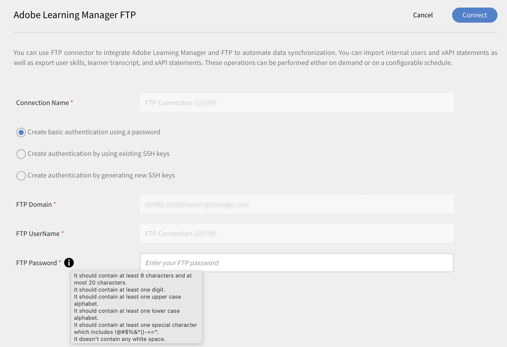

# Övergång från FTP-hanteraren i Adobe

Adobe Learning Manager stöder en ny anslutning med SFTP-protokollet i AWS Transfer-familjen.

Du kan ersätta en FTP-klient med öppen källkod med Adobe FTP Manager.

Vissa FTP-klienter som rekommenderas av AWS visas [här](https://docs.aws.amazon.com/transfer/latest/userguide/transfer-file.html):

* FileZilla (Windows, macOS och Linux)
* OpenSSH (macOS och Linux) - Obs! Den här klienten fungerar bara med servrar som har aktiverats för SFTP (Secure Shell).
* WinSCP (endast Microsoft Windows)
* Cyberduck (Windows, macOS och Linux)

## Konfigurera AWS-baserad FTP-anslutning

Du måste konfigurera den nya AWS-baserade FTP-anslutningen i integrationsadministratören.

*Välj FTP-alternativet*

När du har anslutit kan du se sidan Anslutningsinformation.

*Visa sidan Anslutningsinformation*

Det finns tre autentiseringsalternativ:

### Skapa autentisering genom att generera nya SSH-nycklar

Om du vill generera SSH-nyckeln i själva systemet kan du göra det. Klicka på Generera SSH-nyckel.

Den privata nyckeln hämtas till din dator och den offentliga nyckeln sparas i våra tjänster. När du har klickat på Anslut skapas FTP-användaren med de offentliga och privata nycklarna som autentisering.

Du har skapat en FTP-anslutning.

### Skapa autentisering med befintliga SSH-nycklar

Om du redan har en SSH-nyckel klistrar du in den offentliga nyckeln i **[!UICONTROL FTP Public Key]** och klicka sedan på Anslut.

*Klistra in tangenterna*

### Skapa grundläggande autentisering med ett lösenord

Detta är den grundläggande autentiseringsmekanismen. Välj det första alternativet, **[!UICONTROL Create basic authentication using a password]**. Ange lösenordet och klicka sedan på **[!UICONTROL Connect]**.

Detta skapar en anslutning.

## Nästa steg

### Konfigurera FTP-klienten

Skapa anslutningen på en FTP-klient (rekommenderas i avsnittet tidigare) med de hämtade eller befintliga nycklarna eller lösenordet.

### Exempel på testexport

* I FTP-klienten ändrar du platsen för ExaVault FTP till den nya FTP-platsen. Den nya domänen är `http://almftp.adobelearningmanager.com/`.
* Du måste också vitlista IP, `18.195.107.67`.
* Efter autentiseringen måste du överföra och hämta några exempelfiler till och från den nya FTP-platsen med hjälp av externa FTP-klienter eller automatiseringsskript.
* Du måste överföra data från den gamla platsen till den nya.
* Datalagringsprincipen för kopplingen är fortfarande densamma. ExaVault har även stöd för vissa principer för datalagring utöver den officiella policyn. Sådana principer för datalagring kommer inte att vara tillgängliga för den nya anslutningen. Kontrollera om anslutningen använder datalagring utöver de officiellt stödda principerna.

### Vad händer med migreringsprojekten

| Status | Rekommendation |
|---|---|
| Ny migrering | Du kan inte starta nya migreringar från den gamla FTP-servern. Du måste använda den nya FTP:n för de nya migreringarna. Kontakta kundframgångsteamet om du vill ha mer support för detta. |
| Migrering pågår | Skapa ett sprint: Du kan fortsätta använda den gamla FTP-servern, men vi rekommenderar att du använder den nya FTP-servern. Kontakta kundtjänstteamet om du vill ha ett befintligt sprint som inte kan flyttas. |
| Stängd migrering | Ingen åtgärd. |

## Anslut till Adobe Learning Manager med Filezilla FTP-klient

1. Anslut till ny ALM FTP-anslutning. Klicka på Anslut.

   
   *Anslut till ny ALM FTP-anslutning*

1. Om du vill ansluta via grundläggande autentisering via lösenord anger du domännamnet, FTP-användarnamnet och konfigurerar lösenordet som matchar kriterierna för lösenordsvalidering. Klicka på Anslut. Den nya FTP-anslutningen skapas och kan nås via valfri SFTP-klient.

   
   *via grundläggande autentisering via lösenord*

1. Installera valfri SFTP-klient, t.ex. Arkiv Zilla. Starta File Zilla och klicka på Öppna Site Manager i det övre vänstra hörnet.

   
   *Anslut via SFTP-klienten*

1. Klicka **[!UICONTROL New site]** för att skapa en ny plats. Byt namn på platsen efter behov.

   
   *Skapa en webbplats*

1. Mappa informationen från sidan med anslutningsreferenser.

   * Välj protokoll som &#39;SFTP - SSH File Transfer Protocol&#39;
   * Värd som FTP-domän
   * Inloggningstyp som &quot;Be om lösenord&quot;
   * Användare som FTP-användarnamn

1. Klicka på Anslut.

   
   *Ange autentiseringsuppgifter*

   >[!NOTE]
   >
   >Utför detta steg i Arkiv Zilla-klienten.

1. Ange lösenordet.

   (Valfritt) Markera kryssrutan Kom ihåg lösenord för att komma ihåg lösenordet.

   
   *Ange lösenord*

   (Valfritt) Välj alternativet **[!UICONTROL Always trust this host]** för att lita på värden.

1. Klicka på OK.

   
   *Värdnyckel*

1. Kontrollera status och förlopp för anslutningen högst upp.

   Den vänstra halvan är den lokala platsen och den högra halvan är den fjärranslutna platsen.

   Flytta filer från en lokal server till en fjärrserver och vice versa:

   * Du kan dra och släppa filer.
   * Dubbelklicka på filen.

   
   *Kontrollera anslutningsstatus*

Du kan när som helst ändra och uppdatera autentiseringstypen.

Andra autentiseringssätt är via SSH-nycklar:

Klistra in din offentliga nyckel i textrutan för att använda befintliga SSH-nycklar. Klicka på Anslut/Spara.

Om du vill skapa nya SSH-nycklar klickar du på&#x200B;**[!UICONTROL Generate SSH Key]**&quot;. Den privata nyckeln hämtas. Klicka **[!UICONTROL Connect/Save]**.

*Generera SSH-nyckel*

Mappa detaljerna. Välj inloggningstyp som nyckelfil. Välj filen med den privata nyckeln.

Klicka **[!UICONTROL Connect]**.

## Vad händer efter att ExaVault har utfasats

När ExaVault har fasats ut kommer alla befintliga migreringsprojekt som pågår att övergå till den nya FTP som källplats. Du måste sedan konfigurera den nya FTP-anslutningen och fortsätta migreringsprocessen.

## Recommendations för att migrera sprints

När du skapar ett migreringsprojekt rekommenderar Adobe att du skapar projektet med den nya AWS SFTP -anslutningen för att undvika sprintmigreringen från Exavault till AWS i ett senare skede.

Om en migrering pågår stänger du den aktuella utskriften som använder Exavault som datakälla. Skapa AWS SFTP-anslutningen, testa installationen och kontakta kundtjänstteamet för att byta till den nya AWS SFTP-datakällan. Skapa ett nytt spurt i samma migreringsprojekt efter bytet. Sprint-mapparna skapas på den nya platsen och du kan överföra CSV-filerna för migrering för att fortsätta aktiviteten.

**Fall där ett migreringsprojekt inte kan stängas**

* Mappningen av kurs-ID görs i det aktuella projektet för kurser som migreras från externa äldre system till Adobe Learning Manager. Du kan bara göra det om du vill uppdatera samma kurser i samma projekt. När du har stängt projektet kan du inte ändra dess information.
* För API-baserade migreringsprojekt där du inte får stänga ett projekt.
